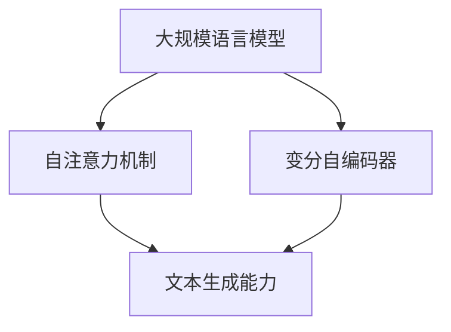

                 

### 文章标题：大规模语言模型在自动科研方法创新中的应用

大规模语言模型在近年来的迅速发展，不仅在自然语言处理领域取得了显著的成就，还在自动科研方法的创新中展现出了巨大的潜力。本文将深入探讨大规模语言模型的基本概念、应用场景、技术挑战及其在自动科研方法创新中的具体应用，以期为科研工作者提供新的视角和方法。

关键词：大规模语言模型，自动科研方法，自然语言处理，人工智能，技术挑战

摘要：本文首先介绍了大规模语言模型的发展背景和基本概念，随后阐述了其在自动科研方法中的应用现状和优势。通过具体案例分析，本文展示了大规模语言模型在文本数据预处理、实验设计和结果分析等方面的实际应用。最后，本文分析了大规模语言模型在自动科研方法中面临的挑战和未来的发展方向。

### 引言

#### 大规模语言模型的发展背景

随着互联网的普及和数据量的爆炸性增长，自然语言处理（NLP）领域迎来了前所未有的发展机遇。传统的方法在面对海量文本数据时显得力不从心，这使得基于深度学习的语言模型迅速崭露头角。尤其是2018年GPT-2的发布，标志着大规模语言模型技术进入了一个新的阶段。GPT-2模型凭借其强大的文本生成能力，在多个NLP任务中刷新了记录。

#### 自动科研方法的重要性

在科研领域，自动化方法的应用可以大幅提高研究效率，降低人为错误的风险，并且有助于发现新的研究模式和规律。传统的科研方法往往依赖于手动处理和分析大量数据，这不仅费时费力，而且容易出现偏差。自动科研方法的出现，使得科研工作更加智能化和高效化。

#### 本文目的

本文旨在探讨大规模语言模型在自动科研方法中的应用，通过分析其技术原理、应用场景和实际案例，展示这一技术在科研领域中的巨大潜力。同时，本文也将探讨大规模语言模型在自动科研方法中面临的挑战和未来的发展方向。

### 目录

1. 引言
2. 大规模语言模型基础
3. 自动科研方法的创新
4. 大规模语言模型在自动科研中的应用
5. 大规模语言模型的开发与优化
6. 自动科研方法的挑战与未来
7. 总结与展望

### 大规模语言模型基础

#### 基本概念

大规模语言模型是一种基于深度学习的自然语言处理模型，其主要目的是理解和生成自然语言。这些模型通常由多层神经网络组成，通过大规模文本数据的学习，能够捕获语言的复杂结构和语义信息。

#### 技术原理

大规模语言模型的技术原理主要基于自注意力机制（Self-Attention）和变分自编码器（Variational Autoencoder，VAE）。自注意力机制使得模型能够自动关注文本中的关键信息，从而提高了模型的表达能力。变分自编码器则用于生成和优化模型的参数，使得模型在生成文本时具有更好的鲁棒性和稳定性。

#### 关系架构 Mermaid 流程图



#### 核心算法原理讲解

```python
# 自注意力机制伪代码
def self_attention(inputs, keys, values, mask=None):
    # 计算query与key的相似度
    similarity = dot_product(inputs, keys)
    
    # 应用softmax函数，得到注意力权重
    attention_weights = softmax(similarity, mask)
    
    # 计算加权求和，得到输出
    output = dot_product(attention_weights, values)
    
    return output
```

#### 数学模型和公式讲解

在自注意力机制中，相似度计算通常采用点积（Dot Product）或余弦相似度（Cosine Similarity）。以下是一个简单的数学模型：

$$
\text{similarity} = \frac{\text{dot_product}(q, k)}{\sqrt{d_k}}
$$

其中，$q$ 和 $k$ 分别是查询向量（Query Vector）和键向量（Key Vector），$d_k$ 是键向量的维度。

#### 举例说明

假设我们有两个查询向量 $q_1 = [1, 0, 1]$ 和 $q_2 = [0, 1, 0]$，以及两个键向量 $k_1 = [1, 1, 1]$ 和 $k_2 = [1, 1, 0]$。我们可以计算它们的相似度如下：

$$
\text{similarity}_{q_1, k_1} = \frac{\text{dot_product}(q_1, k_1)}{\sqrt{d_k}} = \frac{1 \cdot 1 + 0 \cdot 1 + 1 \cdot 1}{\sqrt{3}} = \frac{2}{\sqrt{3}}
$$

$$
\text{similarity}_{q_2, k_2} = \frac{\text{dot_product}(q_2, k_2)}{\sqrt{d_k}} = \frac{0 \cdot 1 + 1 \cdot 1 + 0 \cdot 0}{\sqrt{3}} = \frac{1}{\sqrt{3}}
$$

通过这种方式，模型可以自动关注关键信息，从而生成更高质量的文本。

### 自动科研方法的创新

#### 基本概念

自动科研方法是指利用人工智能技术，特别是大规模语言模型，来自动化科研过程的各个环节，包括数据收集、预处理、分析、实验设计等。

#### 技术原理

自动科研方法的核心是利用大规模语言模型进行文本数据的理解和生成。这些模型可以自动处理大量的文本数据，提取关键信息，进行实验设计，甚至生成论文摘要和结论。

#### 应用场景

自动科研方法可以应用于多个领域，如生物信息学、材料科学、化学等。例如，在生物信息学领域，大规模语言模型可以用于基因序列分析，识别潜在的疾病基因；在材料科学领域，模型可以帮助设计新的材料结构。

#### 优势

自动科研方法的优势在于其高效性、准确性和可扩展性。传统的科研方法往往需要大量的人力和时间，而自动科研方法可以显著提高研究效率，减少人为错误。

#### 挑战

尽管自动科研方法具有巨大的潜力，但也面临一些挑战，如数据质量和模型可靠性等问题。此外，如何确保科研过程的透明度和可解释性也是需要解决的重要问题。

### 大规模语言模型在自动科研中的应用

#### 文本数据预处理

大规模语言模型在自动科研方法中的一个重要应用是文本数据预处理。传统的文本预处理方法往往依赖于规则和词典，而大规模语言模型可以自动处理大量的文本数据，提取关键信息。

#### 伪代码示例

```python
def preprocess_text(text, model):
    # 使用预训练的语言模型进行文本预处理
    processed_text = model.encode(text)
    return processed_text
```

#### 数学模型和公式讲解

在文本预处理过程中，大规模语言模型通常使用嵌入（Embedding）技术将文本转换为向量表示。以下是一个简单的数学模型：

$$
\text{embedding} = \text{W} \cdot \text{X}
$$

其中，$\text{W}$ 是嵌入矩阵，$\text{X}$ 是文本的词向量表示。

#### 举例说明

假设我们有一个文本 “大规模语言模型在自动科研方法创新中的应用”，使用预训练的语言模型将其转换为向量表示。我们可以使用以下公式：

$$
\text{embedding}_{\text{大规模语言模型}} = \text{W} \cdot \text{X}
$$

其中，$\text{W}$ 是嵌入矩阵，$\text{X}$ 是文本的词向量表示。

#### 实际案例

在生物信息学领域，大规模语言模型可以用于基因序列分析。研究人员可以使用模型自动提取基因序列中的关键信息，如启动子、转录因子结合位点等。以下是一个实际案例：

- **案例背景**：研究人员需要分析一段基因序列，以确定其功能。
- **数据处理**：使用大规模语言模型对基因序列进行预处理，提取关键信息。
- **实验设计**：根据提取的信息，设计实验来验证基因的功能。
- **结果分析**：使用模型对实验结果进行分析，得出结论。

#### 项目小结

通过上述案例，我们可以看到大规模语言模型在自动科研方法中的应用潜力。尽管仍存在一些挑战，但这一技术为科研工作带来了新的机遇和可能性。

### 大规模语言模型的开发与优化

#### 开发流程

大规模语言模型的开发通常包括以下步骤：

1. 数据收集与预处理：收集大量高质量的文本数据，并进行预处理，如分词、去停用词、标准化等。
2. 模型设计与实现：设计适合语言模型的神经网络架构，并使用深度学习框架实现。
3. 模型训练与优化：使用预处理的文本数据进行模型训练，并通过优化算法调整模型参数。
4. 模型评估与部署：评估模型性能，并进行部署，使其能够应用于实际任务。

#### 优化技巧

1. 参数调优：通过调整模型参数，如学习率、批量大小等，以优化模型性能。
2. 模型压缩与加速：使用模型压缩技术，如剪枝、量化等，以减少模型大小和计算量。
3. 模型安全与隐私保护：确保模型在处理敏感数据时不会泄露隐私。

#### 最佳实践 Tips

1. 使用高质量的数据集：高质量的数据集是模型训练的关键，应尽量使用经过验证的数据集。
2. 适度预训练：预训练可以大幅提高模型的性能，但也要避免过度依赖预训练，应结合具体任务进行微调。
3. 关注模型解释性：虽然深度学习模型具有强大的表现能力，但其解释性较差。在实际应用中，应关注模型的解释性，以提高模型的可靠性。

### 自动科研方法的挑战与未来

#### 挑战

1. 数据质量：自动科研方法依赖于高质量的数据，但数据质量往往难以保证。
2. 模型可靠性：大规模语言模型的可靠性是自动科研方法成功的关键，但模型可能会出现错误。
3. 可解释性：深度学习模型通常难以解释，这给科研工作者带来了挑战。
4. 道德与法律问题：自动科研方法的应用可能引发道德和法律问题，如数据隐私和安全等。

#### 未来发展方向

1. 数据质量管理：开发新的数据清洗和预处理方法，以提高数据质量。
2. 模型可靠性与可解释性：研究新的方法，提高大规模语言模型的可靠性和可解释性。
3. 跨学科合作：促进不同学科之间的合作，以推动自动科研方法的全面发展。
4. 法律法规完善：制定相关法律法规，确保自动科研方法的合法合规。

### 总结与展望

大规模语言模型在自动科研方法创新中展现出了巨大的潜力，通过文本数据预处理、实验设计、结果分析等多个环节的应用，为科研工作带来了新的机遇和可能性。尽管面临诸多挑战，但随着技术的不断进步，我们有理由相信，大规模语言模型将在自动科研方法中发挥越来越重要的作用。

### 作者信息

作者：AI天才研究院/AI Genius Institute & 禅与计算机程序设计艺术 /Zen And The Art of Computer Programming

### 附录

附录中可以包含扩展阅读、相关资源的引用、以及作者团队或个人简介等信息。

---

本文通过逐步分析和讲解，展示了大规模语言模型在自动科研方法中的广泛应用和潜力。希望通过这篇文章，能够为科研工作者提供一些新的思路和方法，推动自动科研方法的创新发展。在未来的研究中，我们期待看到更多关于大规模语言模型在自动科研方法中的应用和实践案例。

