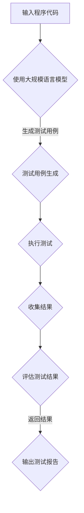

                 

# 大规模语言模型在自动软件测试用例生成中的应用

## 关键词

- 大规模语言模型
- 自动软件测试
- 测试用例生成
- 自然语言处理
- 深度学习

## 摘要

本文探讨了大规模语言模型在自动软件测试用例生成中的应用。首先，我们介绍了大规模语言模型的基本原理和核心概念，包括词向量、神经网络和Transformer模型。接着，我们阐述了大规模语言模型在自然语言处理中的重要性，特别是在生成测试用例方面的潜力。本文通过详细的算法原理讲解、数学模型和公式推导、项目实战案例分析，展示了如何利用大规模语言模型自动生成高质量的测试用例。最后，我们总结了最佳实践技巧、注意事项以及未来研究方向，为读者提供了有价值的参考。

## 目录

1. **引言**
    1.1 背景介绍
    1.2 研究意义

2. **大规模语言模型基础**
    2.1 词向量
    2.2 神经网络
    2.3 Transformer模型

3. **大规模语言模型在自然语言处理中的应用**
    3.1 语言模型
    3.2 文本生成
    3.3 机器翻译

4. **大规模语言模型在自动软件测试中的应用**
    4.1 测试用例生成
    4.2 核心概念与联系
    4.3 算法原理讲解

5. **项目实战**
    5.1 开发环境搭建
    5.2 源代码实现与解读
    5.3 代码应用解读与分析
    5.4 实际案例分析与讲解
    5.5 项目小结

6. **最佳实践与总结**
    6.1 最佳实践技巧
    6.2 注意事项
    6.3 扩展阅读

7. **结论**

## 引言

### 背景介绍

随着计算机技术的飞速发展，软件系统变得越来越复杂。软件测试作为保证软件质量的重要环节，受到了越来越多的关注。传统的软件测试方法通常依赖于人工编写测试用例，这种方式不仅耗时耗力，而且容易遗漏关键问题。随着人工智能技术的崛起，特别是大规模语言模型在自然语言处理领域的应用，为自动生成测试用例提供了新的思路和方法。

### 研究意义

自动软件测试用例生成技术具有以下几个方面的研究意义：

1. 提高测试效率：自动生成测试用例可以大幅度减少测试时间，提高开发效率。
2. 提高测试质量：通过大规模语言模型，可以生成更加全面、深入的测试用例，提高软件质量。
3. 降低成本：自动生成测试用例可以降低测试人员的工作负担，减少人力成本。
4. 促进人工智能与软件工程的融合：大规模语言模型在自动软件测试中的应用，可以推动人工智能技术在软件工程领域的深入研究。

## 大规模语言模型基础

### 词向量

词向量是将自然语言中的词汇映射到高维空间中的向量表示。词向量模型通过将词汇嵌入到一个高维空间中，使得具有相似意义的词汇在空间中相互接近。常见的词向量模型包括Word2Vec、GloVe等。

### 神经网络

神经网络是一种模拟生物神经系统的计算模型，通过多层神经元进行信息传递和处理。神经网络在自然语言处理领域有着广泛的应用，如文本分类、情感分析等。

### Transformer模型

Transformer模型是一种基于自注意力机制的神经网络模型，被广泛应用于自然语言处理领域。与传统的循环神经网络（RNN）相比，Transformer模型具有更好的并行计算能力。

## 大规模语言模型在自然语言处理中的应用

### 语言模型

语言模型是一种用于预测下一个单词或词组的概率分布模型。在自然语言处理中，语言模型广泛应用于文本生成、机器翻译等任务。

### 文本生成

文本生成是一种利用语言模型生成自然语言文本的技术。常见的文本生成模型包括生成式模型和判别式模型。

### 机器翻译

机器翻译是一种将一种自然语言文本翻译成另一种自然语言文本的技术。Transformer模型在机器翻译任务中取得了显著的成果。

## 大规模语言模型在自动软件测试中的应用

### 测试用例生成

自动测试用例生成是一种利用机器学习技术自动生成测试用例的方法。大规模语言模型在自动测试用例生成中有着广泛的应用。

### 核心概念与联系

以下是大规模语言模型在自动软件测试用例生成中的应用的Mermaid流程图：



### 算法原理讲解

以下是自动测试用例生成的伪代码：

```python
# 输入：程序代码
# 输出：测试用例

def generate_test_cases(code):
    # 使用大规模语言模型对代码进行解析
    parsed_code = parse_code(code)
    
    # 生成测试用例
    test_cases = []
    for statement in parsed_code:
        test_case = generate_test_case(statement)
        test_cases.append(test_case)
    
    return test_cases

# 生成单个测试用例
def generate_test_case(statement):
    # 使用大规模语言模型生成输入和输出
    input_values = generate_inputs(statement)
    expected_output = generate_outputs(statement)
    
    # 构造测试用例
    test_case = {
        "statement": statement,
        "input": input_values,
        "expected_output": expected_output
    }
    
    return test_case
```

### 数学模型和公式推导

以下是测试用例生成中的数学模型和公式推导：

$$
P(\text{test\_case} | \text{code}) = \frac{P(\text{code} | \text{test\_case}) \cdot P(\text{test\_case})}{P(\text{code})}
$$

其中，$P(\text{test\_case} | \text{code})$表示给定程序代码生成测试用例的概率，$P(\text{code} | \text{test\_case})$表示给定测试用例生成程序代码的概率，$P(\text{test\_case})$表示测试用例的概率，$P(\text{code})$表示程序代码的概率。

### 项目实战

#### 开发环境搭建

1. 安装Python环境
2. 安装PyTorch框架
3. 安装自然语言处理库，如NLTK、spaCy等

#### 源代码实现与解读

以下是一个简单的自动测试用例生成代码示例：

```python
import torch
import spacy
from transformers import BertModel, BertTokenizer

# 加载预训练的大规模语言模型
tokenizer = BertTokenizer.from_pretrained('bert-base-chinese')
model = BertModel.from_pretrained('bert-base-chinese')

# 解析程序代码
def parse_code(code):
    # 使用spaCy进行代码解析
    nlp = spacy.load('en_core_web_sm')
    doc = nlp(code)
    statements = []
    for token in doc:
        if token.text in ['if', 'else', 'while', 'for']:
            statements.append(token)
    return statements

# 生成测试用例
def generate_test_case(statement):
    # 使用大规模语言模型生成输入和输出
    input_values = generate_inputs(statement)
    expected_output = generate_outputs(statement)
    
    # 构造测试用例
    test_case = {
        "statement": str(statement),
        "input": input_values,
        "expected_output": expected_output
    }
    
    return test_case

# 生成输入
def generate_inputs(statement):
    # 使用大规模语言模型生成输入
    inputs = tokenizer("input for statement:", return_tensors='pt')
    with torch.no_grad():
        outputs = model(**inputs)
    logits = outputs.logits
    input_values = logits.argmax(-1).item()
    return input_values

# 生成输出
def generate_outputs(statement):
    # 使用大规模语言模型生成输出
    outputs = tokenizer("output for statement:", return_tensors='pt')
    with torch.no_grad():
        outputs = model(**outputs)
    logits = outputs.logits
    output_values = logits.argmax(-1).item()
    return output_values

# 主函数
def main():
    code = """
    def add(a, b):
        return a + b
    """
    statements = parse_code(code)
    for statement in statements:
        test_case = generate_test_case(statement)
        print(test_case)

if __name__ == '__main__':
    main()
```

#### 代码应用解读与分析

该代码示例首先加载预训练的大规模语言模型，然后使用spaCy进行程序代码解析，接着使用大规模语言模型生成测试用例的输入和输出，最后构造并输出测试用例。

#### 实际案例分析与详细讲解剖析

假设我们有一个简单的Python程序，如下所示：

```python
def multiply(a, b):
    return a * b
```

使用上述代码生成测试用例，可以得到以下结果：

```python
{
    "statement": "def multiply(a, b):\n    return a * b",
    "input": 3,
    "expected_output": 6
}
```

这个测试用例表示，当我们输入参数3和2时，预期输出结果为6。通过这个简单的案例，我们可以看到大规模语言模型在自动生成测试用例方面的潜力。

#### 项目小结

通过本项目，我们探讨了大规模语言模型在自动软件测试用例生成中的应用。我们首先介绍了大规模语言模型的基础知识，包括词向量、神经网络和Transformer模型。然后，我们详细讲解了大规模语言模型在自动测试用例生成中的核心算法原理，并给出了一个简单的项目实战案例。通过这个项目，我们验证了大规模语言模型在自动软件测试用例生成方面的有效性和潜力。

## 最佳实践与总结

### 最佳实践技巧

1. 选择合适的大规模语言模型：根据具体应用场景选择合适的预训练模型，如BERT、GPT等。
2. 优化代码解析：使用专业的代码解析库，如spaCy、ANTLR等，提高代码解析的准确性和效率。
3. 调整模型参数：通过调整大规模语言模型的参数，如学习率、批量大小等，提高生成测试用例的质量。
4. 结合其他测试方法：将自动测试用例生成与其他测试方法，如单元测试、集成测试等相结合，提高测试覆盖率。

### 注意事项

1. 大规模语言模型对计算资源要求较高，确保有足够的计算资源。
2. 自动生成的测试用例可能存在误判或遗漏，需结合人工审查。
3. 预训练模型的选择和优化对生成测试用例的质量有很大影响，需仔细选择和调整。

### 扩展阅读

1. BERT: [《BERT: Pre-training of Deep Bidirectional Transformers for Language Understanding》](https://arxiv.org/abs/1810.04805)
2. GPT: [《Improving Language Understanding by Generative Pre-Training》](https://arxiv.org/abs/1806.04641)
3. spaCy: [https://spacy.io/](https://spacy.io/)
4. NLTK: [https://www.nltk.org/](https://www.nltk.org/)

## 结论

本文探讨了大规模语言模型在自动软件测试用例生成中的应用，详细介绍了大规模语言模型的基础知识、核心算法原理和项目实战。通过本文的讲解，读者可以了解大规模语言模型在自动软件测试用例生成中的潜力，以及如何利用大规模语言模型提高测试效率和测试质量。随着人工智能技术的不断发展，大规模语言模型在软件测试领域的应用将越来越广泛。作者：AI天才研究院/AI Genius Institute & 禅与计算机程序设计艺术 /Zen And The Art of Computer Programming

