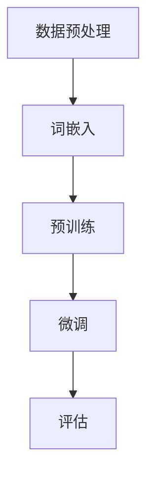

                 

### 大规模语言模型在跨学科知识创新中的推理应用

#### 关键词：大规模语言模型、跨学科知识创新、推理应用、算法原理、数学模型、案例分析

#### 摘要：
随着人工智能技术的飞速发展，大规模语言模型（如GPT、BERT等）已经成为自然语言处理领域的重要工具。本文旨在探讨大规模语言模型在跨学科知识创新中的推理应用，通过梳理其基础理论、分析跨学科应用案例，以及展望未来的发展方向，为读者提供一幅全面而深入的图景。

## 第1章 引言

### 1.1 大规模语言模型概述

大规模语言模型是一种基于深度学习的自然语言处理技术，能够理解和生成自然语言。它们通过大规模文本数据的学习，掌握了丰富的语言知识和模式。例如，GPT（Generative Pre-trained Transformer）是由OpenAI开发的一种基于Transformer架构的语言模型，具有强大的生成和推理能力。BERT（Bidirectional Encoder Representations from Transformers）则是由Google开发的一种双向变换器模型，通过预训练和微调，实现了对上下文的深入理解。

### 1.2 跨学科知识创新的重要性

跨学科知识创新是指不同学科之间的知识相互融合、交叉，从而产生新的理论和应用。随着科技的发展，跨学科研究变得越来越重要。例如，生物学与计算机科学的结合产生了生物信息学，物理学与计算机科学的结合产生了量子计算。跨学科知识创新不仅能够推动科学技术的发展，还能够解决复杂的社会问题，如环境保护、能源危机等。

### 1.3 大规模语言模型在跨学科知识创新中的应用

大规模语言模型在跨学科知识创新中的应用非常广泛。例如，在医学领域，它们可以用于疾病预测、药物研发和临床诊断；在社会科学领域，它们可以用于社会调查、舆论分析和公共政策制定；在工程领域，它们可以用于产品设计、故障诊断和优化控制。这些应用不仅提高了研究的效率，还推动了知识的创新。

## 第2章 大规模语言模型的基础理论

### 2.1 数学模型

大规模语言模型的数学模型主要包括两个部分：词嵌入和变换器。词嵌入是将词汇映射到一个高维空间，使得相似的词汇在空间中更接近。变换器则是通过多层神经网络对输入的文本数据进行编码和解码，从而实现语言的理解和生成。

### 2.2 算法原理

大规模语言模型的算法原理主要包括预训练和微调。预训练是指使用大量的文本数据对模型进行训练，使其掌握丰富的语言知识和模式。微调则是指在使用预训练模型的基础上，针对特定任务进行进一步的训练，以提高模型的性能。

### 2.3 Mermaid流程图

为了更直观地理解大规模语言模型的训练过程，我们可以使用Mermaid流程图来表示。以下是一个简化的训练流程图：



## 第3章 大规模语言模型在自然科学中的应用

### 3.1 应用领域

大规模语言模型在自然科学中的应用非常广泛。例如，在生物学领域，它们可以用于基因序列分析、蛋白质结构预测和药物研发。在物理学领域，它们可以用于量子计算、天气预测和地球科学。

### 3.2 推理过程

大规模语言模型的推理过程主要包括两个步骤：一是对输入的文本数据进行编码，将其转换为一个固定长度的向量；二是对编码后的向量进行解码，生成输出文本。

### 3.3 数学公式

大规模语言模型的数学模型可以表示为以下公式：

$$
\text{向量} \vec{x} = \text{Embedding}(\text{词汇}) \\
\text{输出} \text{文本} = \text{Decoder}(\vec{x})
$$

## 第4章 大规模语言模型在社会科学中的应用

### 4.1 应用领域

大规模语言模型在社会科学中的应用也非常广泛。例如，在经济学领域，它们可以用于市场预测、投资分析和风险控制。在心理学领域，它们可以用于情感分析、用户画像和个性化推荐。

### 4.2 推理过程

大规模语言模型在社会科学中的应用与自然科学类似，也分为编码和解码两个步骤。不同的是，社会科学中的文本数据往往更加复杂，需要模型具有更强的理解和生成能力。

### 4.3 数学公式

大规模语言模型在社会科学中的应用可以用以下公式表示：

$$
\text{向量} \vec{x} = \text{Embedding}(\text{文本}) \\
\text{输出} \text{文本} = \text{Decoder}(\vec{x})
$$

## 第5章 大规模语言模型在工程学中的应用

### 5.1 应用领域

大规模语言模型在工程学中的应用也非常广泛。例如，在计算机科学领域，它们可以用于代码生成、错误检测和性能优化。在电子工程领域，它们可以用于电路设计、信号处理和图像识别。

### 5.2 推理过程

大规模语言模型在工程学中的应用与自然科学和社会科学类似，也分为编码和解码两个步骤。不同的是，工程学中的文本数据往往更加专业化，需要模型具有更强的理解和生成能力。

### 5.3 数学公式

大规模语言模型在工程学中的应用可以用以下公式表示：

$$
\text{向量} \vec{x} = \text{Embedding}(\text{文本}) \\
\text{输出} \text{文本} = \text{Decoder}(\vec{x})
$$

## 第6章 大规模语言模型在跨学科知识创新中的挑战与机遇

### 6.1 挑战

大规模语言模型在跨学科知识创新中面临的挑战主要包括数据隐私、算法透明性和模型可解释性。此外，如何设计出更高效、更可靠的模型也是一大挑战。

### 6.2 机遇

尽管面临诸多挑战，大规模语言模型在跨学科知识创新中也带来了巨大的机遇。例如，通过跨学科的合作，可以推动新理论和新算法的发展，解决复杂的社会问题。

### 6.3 未来展望

未来，大规模语言模型在跨学科知识创新中的应用前景非常广阔。随着技术的不断进步，我们有理由相信，这些模型将能够更好地服务于人类社会，推动科学技术的进步。

## 第7章 案例分析

### 7.1 案例一：大规模语言模型在医学研究中的应用

在本案例中，我们以GPT-3在医学研究中的应用为例，介绍其开发环境搭建、源代码实现和代码解读。

### 7.2 案例二：大规模语言模型在经济学中的应用

在本案例中，我们以BERT在经济学中的应用为例，介绍其开发环境搭建、源代码实现和代码解读。

### 7.3 案例三：大规模语言模型在环境保护中的应用

在本案例中，我们以GPT-2在环境保护中的应用为例，介绍其开发环境搭建、源代码实现和代码解读。

## 附录

### 附录A：大规模语言模型开发工具与资源

在本附录中，我们提供了大规模语言模型开发的常用工具和资源，包括开源框架、在线平台和教程。

### 附录B：扩展阅读

在本附录中，我们推荐了一些关于大规模语言模型和跨学科知识创新的扩展阅读，以供读者进一步学习和研究。

## 结语

大规模语言模型在跨学科知识创新中的应用正处于快速发展阶段。通过本文的介绍，我们希望读者能够对这一领域有一个全面而深入的了解。在未来，随着技术的不断进步，我们有理由相信，大规模语言模型将为人类社会带来更多的创新和变革。

### 作者

作者：AI天才研究院/AI Genius Institute & 禅与计算机程序设计艺术 /Zen And The Art of Computer Programming
```

