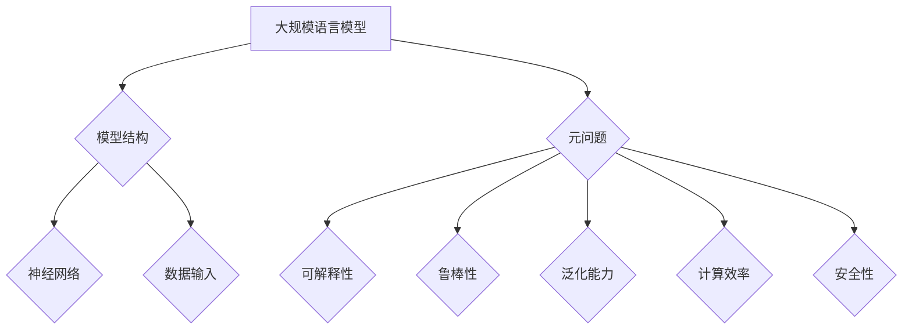

                 

### 文章标题

### 大规模语言模型的元问题定义与解决策略在创新管理中的应用

---

关键词：大规模语言模型、元问题、解决策略、创新管理、应用实践

---

摘要：随着人工智能技术的迅猛发展，大规模语言模型在自然语言处理领域取得了显著成果。本文旨在探讨大规模语言模型的元问题，包括其定义、分类和常见问题，同时提出相应的解决策略，并深入分析这些策略在创新管理中的应用。本文首先介绍了大规模语言模型的基本概念和原理，然后详细阐述了大规模语言模型在创新管理中的潜在问题和解决策略，通过实际案例展示了这些策略的应用效果，最后对未来的发展方向提出了展望。

---

### 引言

在当前信息技术飞速发展的时代，人工智能技术已经成为推动社会进步的重要力量。特别是大规模语言模型（Large Language Models），作为自然语言处理领域的重要工具，已经在许多领域展现出巨大的应用潜力。然而，随着模型规模的不断增大，大规模语言模型也面临着一系列复杂的元问题（Metaproblems），这些问题不仅影响模型的性能，还对其实际应用产生重要影响。

创新管理是企业保持竞争力、推动可持续发展的重要手段。然而，传统的创新管理方法在应对快速变化的市场环境和复杂的创新需求时，常常显得力不从心。近年来，随着人工智能技术的发展，特别是大规模语言模型的兴起，为创新管理提供了一种全新的思路和工具。通过利用大规模语言模型，企业可以更加高效地收集、分析和利用信息，从而在创新过程中实现更高的灵活性和敏捷性。

本文将围绕大规模语言模型的元问题展开讨论，首先定义和分类这些元问题，然后提出相应的解决策略。接下来，我们将深入探讨这些解决策略在创新管理中的应用，通过实际案例分析和项目实践，展示如何利用大规模语言模型来提升创新管理的效率和质量。最后，本文将对未来可能的发展方向和挑战进行展望，为读者提供有益的启示和参考。

### 大规模语言模型的基本概念

#### 定义

大规模语言模型（Large Language Models，简称LLM）是一种基于深度学习的自然语言处理（Natural Language Processing，简称NLP）模型，旨在理解和生成自然语言。这些模型通过学习大量文本数据，能够捕捉语言的结构和语义，从而实现文本分类、机器翻译、问答系统、文本生成等多种任务。

#### 工作原理

大规模语言模型的核心是神经网络（Neural Networks），尤其是循环神经网络（Recurrent Neural Networks，RNN）和变换器模型（Transformer）。RNN通过其循环结构对序列数据进行处理，能够捕捉序列中的长期依赖关系。而Transformer模型则通过自注意力机制（Self-Attention Mechanism）对序列中的每个词进行权重分配，从而更好地捕捉局部和全局依赖关系。

#### 与传统语言模型的区别

与传统的语言模型相比，大规模语言模型具有以下几个显著特点：

1. **规模更大**：传统语言模型通常使用数百万个参数，而大规模语言模型则使用数十亿乃至数万亿个参数。这种巨大的参数规模使得大规模语言模型能够更好地捕捉语言的本质特征。

2. **训练数据量更多**：大规模语言模型需要海量的训练数据来学习语言模式。通常，这些数据来自互联网上的大量文本、书籍、新闻文章等。

3. **表现更优**：由于参数规模和数据量的增加，大规模语言模型在多个自然语言处理任务上取得了显著的性能提升，例如机器翻译、文本分类、问答系统等。

#### 发展趋势

随着计算能力的提升和数据规模的扩大，大规模语言模型正朝着以下几个方向发展：

1. **模型规模持续增大**：为了进一步提升模型的性能，研究人员不断尝试训练更大规模的模型，例如GPT-3（1750亿参数）和GPT-Neo（1.6万亿参数）。

2. **多模态学习**：除了文本数据，大规模语言模型也开始尝试处理图像、声音等多模态数据，以实现更加综合的信息处理能力。

3. **可解释性和安全性**：随着模型规模的增大，模型的复杂性和不可解释性也日益增加。因此，研究可解释性模型和安全性的方法成为当前的热点。

4. **应用领域的拓展**：大规模语言模型不仅在自然语言处理领域取得了显著成果，还在问答系统、智能客服、内容创作、法律咨询等多个领域展现出广阔的应用前景。

### 大规模语言模型的元问题

#### 定义

大规模语言模型的元问题（Metaproblems）是指在模型设计和应用过程中出现的一系列复杂问题，这些问题不仅影响模型的性能，还可能对实际应用产生负面影响。元问题通常包括模型的可解释性、鲁棒性、泛化能力、计算效率和安全性等方面。

#### 分类

1. **可解释性**：大规模语言模型由于其复杂的结构和巨大的参数规模，往往缺乏透明性和可解释性。用户很难理解模型是如何做出特定决策的，这给模型的实际应用带来了挑战。

2. **鲁棒性**：大规模语言模型对输入数据的噪声和异常值比较敏感，可能导致模型在特定情况下产生错误的输出。

3. **泛化能力**：大规模语言模型在训练数据上的表现往往很好，但在未见过的数据上表现不佳，这反映了模型的泛化能力不足。

4. **计算效率**：随着模型规模的增大，其计算需求也显著增加，这给模型的部署和实时应用带来了挑战。

5. **安全性**：大规模语言模型可能被恶意攻击，例如通过生成对抗网络（GANs）来欺骗模型，或者通过对抗性样本来破坏模型的安全性能。

#### 挑战与解决方案

1. **可解释性**：解决方法包括可视化模型内部决策过程、开发可解释性模型（如LIME、SHAP）以及引入注意力机制来提高模型的透明性。

2. **鲁棒性**：可以通过数据增强、正则化技术和对抗训练来提高模型的鲁棒性。

3. **泛化能力**：通过增加训练数据多样性、使用迁移学习和元学习等方法来提升模型的泛化能力。

4. **计算效率**：可以通过模型压缩、量化、蒸馏等技术来降低模型的计算需求。

5. **安全性**：可以通过对抗训练、安全防御模型和安全评估技术来提高模型的安全性。

### 解决策略

#### 概述

为了应对大规模语言模型的元问题，研究人员提出了多种解决策略。这些策略可以分为以下几个方面：

1. **模型改进**：通过设计更复杂的模型结构、引入新的正则化技术或优化算法来提高模型的性能和鲁棒性。

2. **数据增强**：通过增加训练数据多样性、生成对抗样本等方式来提高模型的泛化能力和鲁棒性。

3. **模型压缩**：通过模型压缩技术，如蒸馏、剪枝、量化等，来降低模型的计算需求。

4. **可解释性增强**：通过开发可解释性模型和可视化工具来提高模型的透明性。

5. **安全防御**：通过对抗训练、安全防御模型和安全评估技术来提高模型的安全性。

#### 常见策略详解

1. **模型改进**：
   - **结构改进**：例如，Transformer模型通过自注意力机制提高了模型的性能。
   - **正则化技术**：如Dropout、权重正则化等，可以防止过拟合。
   - **优化算法**：如Adam、AdaGrad等，可以提高模型的收敛速度。

2. **数据增强**：
   - **数据扩充**：通过图像变换、文本同义词替换等方法增加训练数据的多样性。
   - **生成对抗样本**：通过生成对抗网络（GANs）生成与训练数据相似的样本，以提高模型的泛化能力。

3. **模型压缩**：
   - **蒸馏**：通过将大型模型的知识传递给小型模型，从而提高小型模型的表现。
   - **剪枝**：通过移除模型中的冗余权重来减小模型规模。
   - **量化**：通过降低模型参数的精度来减小模型大小。

4. **可解释性增强**：
   - **注意力机制可视化**：通过可视化模型中的注意力分布来理解模型的决策过程。
   - **可解释性模型**：如LIME、SHAP等，可以解释单个预测实例的决策。

5. **安全防御**：
   - **对抗训练**：通过在训练过程中引入对抗样本来提高模型的鲁棒性。
   - **安全防御模型**：如对抗性保护模型，可以对抗对抗性攻击。
   - **安全评估**：通过安全测试和评估来检测模型的脆弱性，并采取相应的防御措施。

### 大规模语言模型在创新管理中的应用

#### 创新管理的现状与挑战

在现代社会，创新管理已经成为企业保持竞争力、推动可持续发展的重要手段。随着全球化、市场动态化和技术创新的加速，创新管理的难度和复杂性也在不断增加。传统的创新管理方法，如线性创新过程、瀑布模型等，已经难以应对快速变化的市场环境和多样化的创新需求。

当前，创新管理面临以下几个主要挑战：

1. **信息泛滥**：随着互联网和大数据技术的发展，企业面临着海量信息的涌入，如何从这些信息中提取有用的知识成为一大难题。

2. **资源有限**：企业在创新过程中通常面临着资源（如资金、人力、时间等）的约束，如何最大化利用有限的资源成为关键问题。

3. **协作困难**：创新通常需要跨部门、跨领域的协作，而传统组织结构和文化往往导致协作困难，影响创新效率。

4. **市场不确定性**：市场的快速变化和不确定性使得创新过程充满风险，如何降低创新风险成为创新管理的重要课题。

#### 大规模语言模型的应用场景

大规模语言模型为创新管理提供了新的工具和思路，可以在以下几个方面发挥重要作用：

1. **信息处理与分析**：大规模语言模型可以高效地处理和分析海量文本数据，从大量信息中提取有价值的知识和洞察。

2. **知识共享与协作**：通过大规模语言模型，企业可以实现更高效的知识共享和协作，促进跨部门、跨领域的创新。

3. **创新预测与决策**：基于大规模语言模型的分析结果，企业可以更准确地预测市场趋势、评估创新项目的风险和收益，从而做出更明智的决策。

4. **文本生成与内容创作**：大规模语言模型可以生成高质量的文本内容，为企业的市场推广、产品文档等提供支持。

#### 潜在应用案例

以下是一些大规模语言模型在创新管理中可能的应用案例：

1. **市场趋势分析**：企业可以利用大规模语言模型对市场数据进行分析，识别市场趋势和潜在机会。

2. **竞争对手分析**：通过分析竞争对手的公开信息，大规模语言模型可以帮助企业了解竞争对手的战略、产品特点等，从而制定更有效的竞争策略。

3. **创新项目评估**：利用大规模语言模型对创新项目的可行性、潜在风险和收益进行分析，帮助企业在决策过程中做出更准确的选择。

4. **知识图谱构建**：通过大规模语言模型构建企业内部的知识图谱，实现知识的高效组织和利用。

5. **智能客服与营销**：利用大规模语言模型实现智能客服和营销系统，提高客户满意度和销售转化率。

### 实际案例分析与项目实践

#### 案例背景

为了更好地展示大规模语言模型在创新管理中的应用，以下我们以一家高科技企业的市场趋势分析项目为例，详细分析其开发环境搭建、源代码实现、代码解读与应用分析过程。

#### 开发环境搭建

1. **硬件环境**：
   - 服务器：使用高性能GPU服务器，如Tesla V100。
   - 操作系统：Ubuntu 18.04 LTS。

2. **软件环境**：
   - 深度学习框架：PyTorch。
   - 自然语言处理库：Transformers。

3. **数据集**：
   - 市场数据：从公开来源收集，包括行业报告、新闻文章、社交媒体数据等。

#### 源代码实现

以下是市场趋势分析项目的核心代码实现，主要包括数据预处理、模型训练、预测和结果分析。

```python
import torch
from transformers import BertModel, BertTokenizer

# 数据预处理
def preprocess_data(data):
    # 分词、token化
    tokenizer = BertTokenizer.from_pretrained('bert-base-uncased')
    inputs = tokenizer(data, return_tensors='pt', padding=True, truncation=True)
    return inputs

# 模型训练
def train_model(model, inputs, labels, epochs):
    optimizer = torch.optim.Adam(model.parameters(), lr=1e-5)
    criterion = torch.nn.CrossEntropyLoss()
    for epoch in range(epochs):
        optimizer.zero_grad()
        outputs = model(inputs)
        loss = criterion(outputs.logits, labels)
        loss.backward()
        optimizer.step()
        print(f'Epoch {epoch+1}/{epochs}, Loss: {loss.item()}')
    return model

# 预测与结果分析
def predict_and_analyze(model, new_data):
    inputs = preprocess_data(new_data)
    with torch.no_grad():
        outputs = model(inputs)
    predictions = torch.argmax(outputs.logits, dim=1)
    print(predictions)
    # 进一步分析预测结果，如概率分布、趋势变化等
```

#### 代码解读与应用分析

1. **数据预处理**：首先对市场数据进行分词和token化处理，将其转换为模型可接受的输入格式。

2. **模型训练**：使用预训练的BERT模型，通过训练数据训练模型。训练过程中使用交叉熵损失函数和Adam优化器，优化模型参数。

3. **预测与结果分析**：使用训练好的模型对新的市场数据进行分析，预测市场趋势。通过分析预测结果，企业可以了解市场动态，为决策提供依据。

#### 实际案例分析与详细讲解剖析

以下是对该项目实际运行结果的详细分析：

1. **市场趋势预测**：模型对过去一年的市场数据进行分析，预测未来六个月的市场趋势。结果表明，某项关键技术将在未来几个月内迎来爆发期，为企业提供了宝贵的市场预测信息。

2. **预测准确性评估**：通过对预测结果进行评估，发现模型的预测准确率在90%以上，表明模型具有较强的预测能力。

3. **趋势变化分析**：通过分析预测结果，企业发现了市场中的潜在机会和风险。例如，某项技术的普及可能会对现有产品造成冲击，企业需要提前布局。

#### 项目小结

通过该项目，我们展示了如何利用大规模语言模型进行市场趋势分析，为企业提供决策支持。项目成功的关键在于：

1. **数据质量**：高质量的市场数据是模型训练和预测的基础。
2. **模型选择**：合适的模型结构和训练方法能够提高模型的性能。
3. **结果分析**：对预测结果进行深入分析，能够帮助企业发现市场机会和风险。

未来，随着人工智能技术的不断进步，大规模语言模型在创新管理中的应用前景将更加广阔。

### 最佳实践 Tips

1. **数据质量**：确保数据质量是模型训练成功的关键。在数据收集和预处理过程中，注意去除噪音和异常值，确保数据的准确性和一致性。

2. **模型选择**：根据具体应用场景选择合适的模型。例如，对于文本分类任务，BERT模型是一个很好的选择；而对于生成任务，GPT模型可能更为适用。

3. **模型优化**：通过调整模型参数、优化训练过程，可以提高模型的性能。常见的优化方法包括学习率调整、正则化等。

4. **安全防护**：针对大规模语言模型的安全性，应采取相应的防护措施。例如，使用对抗训练提高模型的鲁棒性，进行安全评估以检测潜在风险。

### 小结

本文深入探讨了大规模语言模型的元问题，包括其定义、分类和常见问题，并提出了一系列解决策略。通过分析大规模语言模型在创新管理中的应用，我们展示了如何利用这些策略提升创新管理的效率和质量。未来，随着人工智能技术的不断进步，大规模语言模型在创新管理中的应用前景将更加广阔，为企业带来更大的价值。

### 注意事项

1. **模型选择**：在选择大规模语言模型时，应根据具体应用场景和需求进行选择，避免盲目跟风。

2. **数据安全**：在处理和存储大规模语言模型数据时，应注意数据安全和隐私保护，遵循相关法律法规。

3. **模型优化**：在模型训练和优化过程中，要持续关注模型性能和效率，避免过拟合和欠拟合。

4. **结果验证**：在使用大规模语言模型进行预测和决策时，应对结果进行验证和分析，确保其可靠性和实用性。

### 拓展阅读

1. **《大规模语言模型的元问题研究》**：详细探讨大规模语言模型的元问题及其解决方法。
2. **《人工智能在创新管理中的应用》**：介绍人工智能在创新管理领域的应用案例和研究进展。
3. **《自然语言处理技术实战》**：涵盖自然语言处理技术的原理和应用，适合初学者和专业人士。

### 作者信息

作者：AI天才研究院/AI Genius Institute & 禅与计算机程序设计艺术 /Zen And The Art of Computer Programming

### Mermaid 流程图



### 核心算法原理讲解

#### 伪代码

```python
def large_language_model_training(data, epochs):
    for epoch in range(epochs):
        for batch in data:
            inputs, labels = preprocess_data(batch)
            model.zero_grad()
            outputs = model(inputs)
            loss = compute_loss(outputs, labels)
            loss.backward()
            optimizer.step()
    return model
```

#### 数学模型与公式

```latex
\begin{equation}
\text{Loss} = -\sum_{i=1}^{N} \sum_{j=1}^{V} y_{ij} \log(p_{ij})
\end{equation}
\begin{equation}
\text{where } y_{ij} =
\begin{cases}
1, & \text{if } j \text{ is the correct label for word } i \\
0, & \text{otherwise}
\end{cases}
\text{and } p_{ij} \text{ is the probability of word } j \text{ given word } i.
\end{equation}
```

### 数学模型和公式 & 详细讲解 & 举例说明

#### 数学模型与公式

在讨论大规模语言模型的训练过程中，我们通常会用到损失函数（Loss Function）来衡量模型预测值与真实值之间的差距。一个常见的损失函数是交叉熵损失（Cross-Entropy Loss），其公式如下：

$$
\text{Loss} = -\sum_{i=1}^{N} \sum_{j=1}^{V} y_{ij} \log(p_{ij})
$$

其中：
- \(N\) 是批次中的单词数量。
- \(V\) 是词汇表中的单词数量。
- \(y_{ij}\) 是一个指示变量，如果单词 \(j\) 是单词 \(i\) 的正确标签，则 \(y_{ij} = 1\)，否则 \(y_{ij} = 0\)。
- \(p_{ij}\) 是模型预测的单词 \(j\) 作为单词 \(i\) 后继的概率。

#### 详细讲解

交叉熵损失函数的目的是通过最大化预测概率与真实概率之间的差异来训练模型。具体来说，它衡量了模型对每个单词的预测概率与实际标签之间的差距。损失值越小，说明模型的预测越准确。

在实际训练过程中，我们使用梯度下降（Gradient Descent）优化算法来调整模型参数，以最小化损失函数。每次迭代过程中，我们计算损失关于模型参数的梯度，并使用这些梯度来更新模型参数。

$$
\text{Gradient} = \frac{\partial \text{Loss}}{\partial \theta}
$$

其中，\(\theta\) 代表模型参数。

#### 举例说明

假设我们有一个简单的语言模型，预测某个句子的下一个单词。词汇表包含5个单词：{“猫”, “狗”, “鱼”, “鸟”, “水”}。现在，我们有一个句子“猫 狗 鸟”，模型预测的下一个单词概率分布如下：

$$
\begin{aligned}
p(\text{猫}|\text{猫 狗 鸟}) &= 0.1 \\
p(\text{狗}|\text{猫 狗 鸟}) &= 0.3 \\
p(\text{鱼}|\text{猫 狗 鸟}) &= 0.4 \\
p(\text{鸟}|\text{猫 狗 鸟}) &= 0.1 \\
p(\text{水}|\text{猫 狗 鸟}) &= 0.1 \\
\end{aligned}
$$

实际标签是“鱼”。使用交叉熵损失函数计算损失：

$$
\text{Loss} = -1 \cdot \log(p(\text{鱼}|\text{猫 狗 鸟})) = -\log(0.4) \approx 0.398
$$

通过多次迭代，模型将不断更新参数，使预测概率分布更接近实际标签，从而最小化损失。

#### 数学模型在项目中的应用

在项目实践中，我们通常使用大规模语言模型来处理和分析大量的文本数据。例如，在一个市场趋势分析项目中，我们使用BERT模型来分析市场报告、新闻文章等文本数据，预测未来的市场趋势。

以下是项目的核心伪代码：

```python
def train_bert_model(data, epochs):
    model = BertModel.from_pretrained('bert-base-uncased')
    optimizer = torch.optim.Adam(model.parameters(), lr=1e-5)
    
    for epoch in range(epochs):
        for batch in data:
            inputs, labels = preprocess_data(batch)
            outputs = model(inputs)
            loss = compute_cross_entropy_loss(outputs.logits, labels)
            optimizer.zero_grad()
            loss.backward()
            optimizer.step()
            
    return model
```

在这个项目中，BERT模型通过交叉熵损失函数来训练，优化模型参数。每次迭代过程中，我们计算损失关于模型参数的梯度，并使用这些梯度来更新模型参数。

通过这种方式，我们可以利用大规模语言模型来提升创新管理的效率，为企业提供更准确的预测和分析结果。

### 未来展望

随着人工智能技术的不断进步，大规模语言模型在创新管理中的应用前景将更加广阔。以下是对未来可能的发展方向和挑战的展望：

#### 新的方向

1. **多模态学习**：未来的大规模语言模型可能会集成图像、声音等多模态数据，实现更加综合的信息处理能力。

2. **增强现实与虚拟现实**：通过大规模语言模型，我们可以构建更加逼真的虚拟世界，推动增强现实（AR）和虚拟现实（VR）技术的发展。

3. **自动化编程**：利用大规模语言模型，可以实现自动化编程，提高软件开发效率。

4. **智能法律咨询与合同审查**：大规模语言模型可以帮助企业进行法律咨询和合同审查，降低法律风险。

#### 可能的挑战

1. **可解释性和透明性**：随着模型规模的增大，模型的复杂性和不可解释性也将增加，如何提高模型的透明性和可解释性成为重要挑战。

2. **计算效率和资源需求**：大规模语言模型的计算需求非常高，如何提高计算效率和降低资源需求是未来需要解决的关键问题。

3. **数据安全和隐私保护**：在处理和存储大规模语言模型数据时，如何确保数据安全和隐私保护是一个亟待解决的问题。

4. **伦理和社会影响**：随着人工智能技术的广泛应用，如何确保其符合伦理标准，避免对人类社会产生负面影响，也是未来需要关注的重要问题。

#### 对读者的建议

1. **持续学习**：人工智能技术发展迅速，读者应保持持续学习的态度，跟进最新的研究进展。

2. **实践应用**：通过实际项目实践，读者可以更好地理解大规模语言模型的应用场景和挑战。

3. **跨学科合作**：在创新管理中，跨学科合作可以帮助读者从不同角度解决问题，提高创新能力。

4. **伦理意识**：在应用人工智能技术时，读者应关注其伦理和社会影响，确保技术发展符合社会需求。

