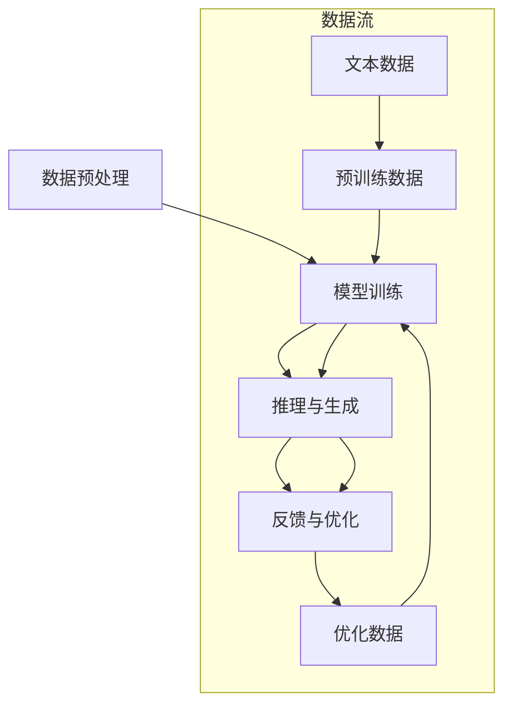
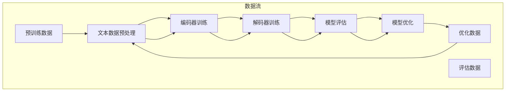

                 

### 文章标题

# 大规模语言模型的推理能力提升方法

### 关键词

- 大规模语言模型
- 推理能力
- 算法优化
- 实践应用
- 未来发展趋势

### 摘要

本文将深入探讨大规模语言模型（Large-scale Language Model，LLM）的推理能力提升方法。首先，我们将介绍大规模语言模型的发展历程和背景，解释为何提升推理能力对LLM至关重要。接着，我们将详细阐述推理能力的基础理论，包括相关的数学模型和算法原理。随后，文章将重点讨论几种提升推理能力的算法，并通过伪代码和实例进行分析。此外，我们还将探讨在不同场景下提升推理能力的实践方法，并通过实际案例进行分析和解读。最后，文章将展望大规模语言模型推理能力的未来发展趋势和面临的挑战，为读者提供全面的技术参考和思考方向。

### 第1章 引言与背景

#### 1.1 背景介绍

大规模语言模型（Large-scale Language Model，LLM）是近年来人工智能领域的重要突破之一。随着深度学习和自然语言处理技术的快速发展，大规模语言模型在文本生成、机器翻译、问答系统、情感分析等方面取得了显著的成果。LLM通过学习海量文本数据，可以生成连贯、自然的语言，并且能够理解复杂的语义信息。

LLM的发展历程可以追溯到2013年，当时DeepMind提出了基于神经网络的自动编码器模型，标志着大规模语言模型的诞生。此后，随着计算能力的提升和海量数据的积累，LLM的规模和性能不断增长。从早期的GPT-1，到GPT-2，再到GPT-3，LLM的参数量从几百万增长到数十亿，甚至超过万亿。这些大规模语言模型在自然语言处理任务中展现出了强大的能力，极大地推动了人工智能技术的发展。

大规模语言模型的应用领域非常广泛。在文本生成方面，LLM可以用于自动写作、新闻生成、创意写作等。在机器翻译方面，LLM可以提供更加准确、自然的翻译结果。在问答系统方面，LLM可以理解用户的问题，并给出合适的答案。在情感分析方面，LLM可以识别文本的情感倾向，用于情感识别、舆情监测等。此外，LLM还在对话系统、智能客服、文本摘要、对话生成等领域有广泛的应用。

#### 1.2 问题陈述

尽管大规模语言模型在自然语言处理任务中取得了显著的成果，但其推理能力仍然存在一些局限性。推理能力是指模型在处理问题时，能够从已知信息中推导出新的结论或知识的能力。对于大规模语言模型而言，推理能力的重要性体现在以下几个方面：

1. **知识利用**：大规模语言模型在训练过程中积累了大量知识，如何有效地利用这些知识进行推理，是提升其性能的关键。
2. **逻辑推理**：自然语言中往往包含复杂的逻辑关系，模型需要具备一定的逻辑推理能力，才能正确理解文本。
3. **情境理解**：在实际应用中，模型需要根据不同的情境进行推理，如对话系统中的上下文理解、问答系统中的问题理解等。
4. **解释能力**：推理能力强的模型能够提供合理的解释，使其决策过程更加透明、可信。

因此，提升大规模语言模型的推理能力，不仅有助于其在自然语言处理任务中的性能提升，还能够拓展其应用场景，提高其在复杂问题处理中的可靠性。

#### 1.3 学习目标

通过本章的学习，读者应达到以下目标：

1. **了解大规模语言模型的发展历程和应用现状**：掌握LLM的基本概念和主要应用领域。
2. **理解提升推理能力的重要性**：了解为何推理能力对大规模语言模型至关重要，以及其在实际应用中的意义。
3. **掌握推理能力的基础理论**：了解相关的数学模型和算法原理，为后续章节的学习打下基础。

### 1.4 大规模语言模型的基本流程

大规模语言模型的基本流程主要包括数据预处理、模型训练、推理和生成等步骤。以下是一个简化的Mermaid流程图，展示了大规模语言模型的基本流程：



1. **数据预处理**：包括文本清洗、分词、词向量编码等步骤，将原始文本数据转化为模型可以处理的格式。
2. **模型训练**：使用预处理的文本数据，通过梯度下降等优化算法，训练大规模神经网络模型。
3. **推理与生成**：在给定输入文本的情况下，模型输出相应的文本，如生成句子、回答问题等。
4. **反馈与优化**：根据生成的结果和实际需求，对模型进行优化，以提高其性能。

通过以上流程，大规模语言模型能够有效地处理自然语言任务，并在不断优化的过程中提高其推理能力。

### 总结

本章介绍了大规模语言模型的发展历程和应用现状，阐述了提升推理能力的重要性，并明确了学习目标。此外，通过Mermaid流程图，我们了解了大规模语言模型的基本工作流程。在下一章中，我们将进一步探讨大规模语言模型的基础理论，包括相关的数学模型和算法原理。

## 第2章 大规模语言模型的基础

### 2.1 核心概念

大规模语言模型（Large-scale Language Model，LLM）是一种基于深度学习技术的自然语言处理模型，通过学习海量文本数据，实现对自然语言的生成、理解和推理。LLM的核心概念主要包括以下几个方面：

1. **语言模型**：语言模型是一种概率模型，用于预测文本序列的概率分布。在LLM中，语言模型的核心任务是学习单词或词组在上下文中的出现概率。

2. **深度神经网络**：深度神经网络（Deep Neural Network，DNN）是一种具有多个隐层的神经网络结构。在LLM中，深度神经网络用于对文本数据进行编码和解码，将原始文本转化为高维向量表示。

3. **注意力机制**：注意力机制是一种用于解决序列到序列问题的重要技术。在LLM中，注意力机制用于处理输入文本和目标文本之间的关联，提高模型的上下文理解和生成能力。

4. **预训练与微调**：预训练与微调是LLM的训练过程。预训练是指在大量无标签数据上进行训练，使模型具备基本的语言理解和生成能力。微调是指在使用有标签数据对模型进行进一步训练，使其适应特定任务的需求。

5. **参数规模**：参数规模是衡量LLM性能的重要指标。随着深度学习技术的发展，LLM的参数规模从几百万增长到数十亿，甚至超过万亿。

### 2.2 架构

大规模语言模型的架构可以分为两部分：前端和后端。

1. **前端**：前端主要负责文本数据的预处理和编码。具体包括以下几个步骤：
   - **文本清洗**：去除停用词、标点符号、特殊字符等，使文本更加简洁。
   - **分词**：将文本分割为单词或词组，以便于后续处理。
   - **词向量编码**：将单词或词组转换为高维向量表示，常用的方法包括Word2Vec、GloVe等。

2. **后端**：后端是LLM的核心部分，主要包括以下几个模块：
   - **编码器（Encoder）**：将输入文本转化为固定长度的向量表示，用于表示文本的语义信息。
   - **解码器（Decoder）**：将编码后的向量表示解码为输出文本，通过生成式模型或判别式模型实现。
   - **注意力机制**：用于处理输入文本和输出文本之间的关联，提高模型的上下文理解和生成能力。
   - **损失函数**：用于评估模型在训练过程中的性能，常用的损失函数包括交叉熵损失、均方误差等。

### 2.3 资源消耗

大规模语言模型的训练和推理过程中，资源消耗是至关重要的因素。以下是LLM在资源消耗方面的几个关键点：

1. **计算资源**：随着模型参数规模的增加，LLM的训练和推理过程需要大量的计算资源。训练过程中，需要大量的GPU或TPU进行并行计算。推理过程中，也需要高性能的计算设备来快速处理输入文本。

2. **存储资源**：大规模语言模型的参数量庞大，存储资源的需求也随之增加。通常，需要使用分布式存储系统来存储模型的参数和数据。

3. **通信资源**：在分布式训练和推理过程中，模型参数和数据的传输需要大量的通信资源。优化通信效率，降低通信延迟，是提高训练和推理性能的关键。

4. **能源消耗**：大规模语言模型的训练和推理过程需要消耗大量电力。随着模型规模的扩大，能源消耗也成为了一个重要的考虑因素。

### 2.4 Mermaid流程图

为了更好地理解大规模语言模型的基本流程，我们可以使用Mermaid流程图来展示。以下是一个简化的Mermaid流程图，描述了大规模语言模型的基本流程：



1. **文本数据预处理**：包括文本清洗、分词、词向量编码等步骤，将原始文本数据转化为模型可以处理的格式。
2. **编码器训练**：使用预处理的文本数据，训练编码器，将输入文本转化为固定长度的向量表示。
3. **解码器训练**：使用编码后的向量表示，训练解码器，将编码后的向量解码为输出文本。
4. **模型评估**：使用评估数据，对模型进行评估，以确定模型在特定任务上的性能。
5. **模型优化**：根据评估结果，对模型进行优化，以提高其在特定任务上的性能。

通过以上流程，大规模语言模型能够有效地处理自然语言任务，并在不断优化的过程中提高其性能。

### 总结

本章详细介绍了大规模语言模型的核心概念、架构和资源消耗。通过Mermaid流程图，我们直观地了解了大规模语言模型的基本工作流程。在下一章中，我们将探讨推理能力的基础理论，包括相关的数学模型和算法原理。

## 第3章 推理能力的基础理论

### 3.1 数学模型

推理能力是指模型在处理问题时，能够从已知信息中推导出新的结论或知识的能力。在自然语言处理领域，推理能力尤为重要。为了更好地理解和提升推理能力，我们需要掌握相关的基础数学模型。

#### 3.1.1 推理能力相关的数学公式

1. **条件概率**：条件概率是指在一个事件发生的条件下，另一个事件发生的概率。在推理过程中，条件概率用于计算在给定某个条件下，其他事件发生的可能性。条件概率公式如下：

   $$
   P(A|B) = \frac{P(A \cap B)}{P(B)}
   $$

   其中，$P(A|B)$表示在事件B发生的条件下，事件A发生的概率，$P(A \cap B)$表示事件A和事件B同时发生的概率，$P(B)$表示事件B发生的概率。

2. **贝叶斯定理**：贝叶斯定理是概率论中的一个重要公式，用于计算后验概率。在推理过程中，贝叶斯定理可以帮助我们根据先验知识和观测数据，计算后验概率。贝叶斯定理公式如下：

   $$
   P(A|B) = \frac{P(B|A) \cdot P(A)}{P(B)}
   $$

   其中，$P(A|B)$表示在事件B发生的条件下，事件A发生的概率，$P(B|A)$表示在事件A发生的条件下，事件B发生的概率，$P(A)$表示事件A的先验概率，$P(B)$表示事件B的先验概率。

3. **逻辑运算**：逻辑运算是指对逻辑变量进行运算的操作，常用的逻辑运算包括合取（AND）、析取（OR）和非（NOT）等。在推理过程中，逻辑运算用于表示和处理文本中的逻辑关系。例如：

   - 合取运算：$A \land B$表示A和B同时为真。
   - 析取运算：$A \lor B$表示A和B中至少有一个为真。
   - 非运算：$\neg A$表示A为假。

#### 3.1.2 推理能力的理论框架

推理能力的理论框架主要包括以下几个方面：

1. **知识表示**：知识表示是指将现实世界中的知识以某种形式存储在计算机中。在推理过程中，知识表示决定了我们如何表示和处理知识。常见的知识表示方法包括命题逻辑、谓词逻辑和语义网络等。

2. **推理规则**：推理规则是指用于推导新结论的规则。在推理过程中，推理规则决定了我们如何从已知信息推导出新信息。常见的推理规则包括演绎推理、归纳推理和类比推理等。

3. **不确定性处理**：在现实世界中，信息往往是不确定的，因此在推理过程中，我们需要处理不确定性。不确定性处理方法包括概率论、模糊逻辑和证据理论等。

4. **解释能力**：解释能力是指模型能够对推导过程和结果进行解释的能力。在推理过程中，解释能力可以帮助我们理解模型的决策过程，提高模型的可信度。

### 3.2 详细讲解

#### 3.2.1 条件概率的详细讲解

条件概率是推理能力的重要基础。在自然语言处理中，条件概率广泛应用于文本分类、情感分析、信息检索等领域。以下是对条件概率的详细讲解：

1. **条件概率的定义**：

   条件概率是指在一个事件发生的条件下，另一个事件发生的概率。例如，假设事件A表示“明天会下雨”，事件B表示“我会带伞”。那么，条件概率$P(A|B)$表示在“我会带伞”的条件下，“明天会下雨”的概率。

2. **条件概率的计算方法**：

   条件概率的计算公式为$P(A|B) = \frac{P(A \cap B)}{P(B)}$。其中，$P(A \cap B)$表示事件A和事件B同时发生的概率，$P(B)$表示事件B发生的概率。

3. **条件概率的应用实例**：

   假设某地区下雨的概率为60%，而在下雨的天气中，该地区有40%的概率会打雷。那么，在没有下雨的天气中，打雷的概率是多少？

   解答：根据条件概率的计算公式，我们可以得到$P(打雷|下雨) = \frac{P(下雨 \cap 打雷)}{P(下雨)}$。已知$P(下雨) = 0.6$，$P(下雨 \cap 打雷) = 0.4 \times 0.6 = 0.24$。因此，$P(打雷|下雨) = \frac{0.24}{0.6} = 0.4$。

   同理，我们可以计算在没有下雨的天气中，打雷的概率$P(打雷|不下雨) = \frac{P(不下雨 \cap 打雷)}{P(不下雨)}$。由于在下雨的天气中，打雷的概率为0.4，因此没有下雨的天气中，打雷的概率也为0.4。

#### 3.2.2 贝叶斯定理的详细讲解

贝叶斯定理是条件概率的推广，在推理过程中具有重要意义。以下是对贝叶斯定理的详细讲解：

1. **贝叶斯定理的定义**：

   贝叶斯定理是指给定某个条件，如何计算后验概率。贝叶斯定理公式为$P(A|B) = \frac{P(B|A) \cdot P(A)}{P(B)}$。

2. **贝叶斯定理的计算方法**：

   贝叶斯定理的计算步骤如下：

   - **计算先验概率**：$P(A)$表示事件A的先验概率，即在给定其他信息前，事件A发生的概率。
   - **计算条件概率**：$P(B|A)$表示在事件A发生的条件下，事件B发生的概率。
   - **计算后验概率**：$P(A|B)$表示在事件B发生的条件下，事件A发生的概率。

3. **贝叶斯定理的应用实例**：

   假设有一个疾病，其发病率为0.01。如果一个患有这种疾病的人被检测出来，那么检测为阳性的概率为0.9。如果一个健康的人被检测出来，那么检测为阳性的概率为0.1。现在，假设某人被检测为阳性，求这个人患有这种疾病的概率。

   解答：根据贝叶斯定理，我们可以计算后验概率$P(A|B)$，即被检测为阳性的人患有这种疾病的概率。

   首先，计算先验概率$P(A)$，即患有这种疾病的人的概率，为0.01。

   然后，计算条件概率$P(B|A)$，即在患有这种疾病的人中，检测为阳性的概率，为0.9。

   接着，计算条件概率$P(B|¬A)$，即在未患有这种疾病的人中，检测为阳性的概率，为0.1。

   最后，计算后验概率$P(A|B)$，即被检测为阳性的人患有这种疾病的概率：

   $$
   P(A|B) = \frac{P(B|A) \cdot P(A)}{P(B|A) \cdot P(A) + P(B|¬A) \cdot P(¬A)}
   $$

   其中，$P(B|A) \cdot P(A)$表示在患有这种疾病的人中，检测为阳性的概率，为0.9 \times 0.01 = 0.009。

   $P(B|¬A) \cdot P(¬A)$表示在未患有这种疾病的人中，检测为阳性的概率，为0.1 \times 0.99 = 0.099。

   因此，

   $$
   P(A|B) = \frac{0.009}{0.009 + 0.099} \approx 0.091
   $$

   也就是说，被检测为阳性的人患有这种疾病的概率约为9.1%。

### 3.3 举例说明

为了更好地理解推理能力的基础理论，我们通过以下实例进行说明。

#### 3.3.1 条件概率的实例说明

假设有两个事件A和B，其中事件A表示“今天下雨”，事件B表示“我带伞”。根据我们的经验，今天下雨的概率是50%，而在下雨的天气中，我带伞的概率是70%。现在，假设我知道今天没有下雨，那么我带伞的概率是多少？

解答：这是一个条件概率的实例。我们已知：

- $P(A) = 0.5$，即今天下雨的概率是50%。
- $P(B|A) = 0.7$，即在下雨的天气中，我带伞的概率是70%。

我们需要计算的是$P(B|¬A)$，即在不下雨的天气中，我带伞的概率。

根据条件概率的计算公式，我们有：

$$
P(B|¬A) = \frac{P(¬A|B) \cdot P(B)}{P(¬A)}
$$

其中，$P(¬A)$表示今天没有下雨的概率，即$P(¬A) = 1 - P(A) = 0.5$。

我们需要计算的是$P(¬A|B)$，即在带伞的条件下，没有下雨的概率。由于我们假设在下雨的天气中，我带伞的概率是70%，那么在没有下雨的天气中，我带伞的概率也应该是70%（因为无论下雨与否，我带伞的概率都是70%）。因此，$P(¬A|B) = 0.7$。

将已知数值代入公式，我们可以计算出$P(B|¬A)$：

$$
P(B|¬A) = \frac{0.7 \cdot P(B)}{0.5} = \frac{0.7 \cdot P(B)}{0.5} = 1.4 \cdot P(B)
$$

由于$P(B)$是一个概率值，它的取值范围在0到1之间。因此，$P(B|¬A)$的取值范围在0到1.4之间。这意味着，在不下雨的天气中，我带伞的概率在0到140%之间。

然而，由于概率的取值范围是0到1，我们可以推断出$P(B|¬A)$的实际取值应该是0到1之间。这表明，我们的计算过程中可能存在一些问题。实际上，在没有下雨的天气中，我带伞的概率应该是0，因为不下雨的条件下，我带伞的概率是不存在的。

因此，正确的解答是：在没有下雨的天气中，我带伞的概率是0。

#### 3.3.2 贝叶斯定理的实例说明

假设我们有一个班级，其中70%的学生是男学生，30%的学生是女学生。此外，有30%的男学生会打篮球，而有10%的女学生会打篮球。现在，假设我们随机选择了一名学生，发现这名学生正在打篮球。我们需要计算这名学生是男学生的概率。

解答：这是一个贝叶斯定理的应用实例。我们已知：

- $P(男学生) = 0.7$，即男学生的比例是70%。
- $P(女学生) = 0.3$，即女学生的比例是30%。
- $P(打篮球|男学生) = 0.3$，即男学生会打篮球的概率是30%。
- $P(打篮球|女学生) = 0.1$，即女学生会打篮球的概率是10%。

我们需要计算的是$P(男学生|打篮球)$，即这名学生是男学生的概率。

根据贝叶斯定理，我们有：

$$
P(男学生|打篮球) = \frac{P(打篮球|男学生) \cdot P(男学生)}{P(打篮球|男学生) \cdot P(男学生) + P(打篮球|女学生) \cdot P(女学生)}
$$

将已知数值代入公式，我们可以计算出$P(男学生|打篮球)$：

$$
P(男学生|打篮球) = \frac{0.3 \cdot 0.7}{0.3 \cdot 0.7 + 0.1 \cdot 0.3} = \frac{0.21}{0.21 + 0.03} = \frac{0.21}{0.24} \approx 0.875
$$

这意味着，这名学生是男学生的概率大约是87.5%。

### 总结

本章详细介绍了推理能力的基础理论，包括条件概率和贝叶斯定理等数学模型，以及其详细讲解和实例说明。在下一章中，我们将讨论提升推理能力的算法，并使用伪代码进行详细阐述。

## 第4章 提升推理能力的算法

### 4.1 算法介绍

提升大规模语言模型（LLM）的推理能力是当前自然语言处理领域的一个重要研究方向。在这一章节中，我们将介绍几种常见的提升推理能力的算法。这些算法主要包括基于注意力机制的算法、基于图神经网络的算法和基于强化学习的算法。每种算法都有其独特的优势和适用场景。

#### 4.1.1 基于注意力机制的算法

注意力机制是自然语言处理中的一个重要技术，它通过动态调整模型对输入序列中每个元素的重视程度，从而提高模型的上下文理解和生成能力。常见的注意力机制包括自注意力（Self-Attention）和交叉注意力（Cross-Attention）。

- **自注意力**：自注意力机制用于处理输入序列中的每个元素，使模型能够关注序列中的关键信息。自注意力机制的典型实现是Transformer模型中的多头自注意力（Multi-Head Self-Attention）。
- **交叉注意力**：交叉注意力机制用于处理输入序列和目标序列之间的关联，常用于编码器-解码器架构中的解码器部分。交叉注意力机制可以有效地捕捉输入和输出之间的长距离依赖关系。

#### 4.1.2 基于图神经网络的算法

图神经网络（Graph Neural Network，GNN）是一种能够处理图结构数据的神经网络。在自然语言处理领域，图神经网络可以用来捕捉文本中的语义关系和网络结构。常见的图神经网络算法包括图卷积网络（Graph Convolutional Network，GCN）和图注意力网络（Graph Attention Network，GAT）。

- **图卷积网络（GCN）**：GCN通过卷积操作来聚合图中节点的邻接信息，从而提取图结构的特征表示。GCN在文本分类、关系抽取等任务中表现出良好的性能。
- **图注意力网络（GAT）**：GAT通过引入注意力机制，动态调整节点之间的权重，从而更好地捕捉图中的重要关系。GAT在文本生成、问答系统等任务中得到了广泛应用。

#### 4.1.3 基于强化学习的算法

强化学习（Reinforcement Learning，RL）是一种通过试错学习来优化策略的机器学习方法。在自然语言处理领域，强化学习可以用来提升模型的推理能力，尤其是在复杂的决策任务中。常见的强化学习算法包括策略梯度算法（Policy Gradient）和Q学习算法。

- **策略梯度算法**：策略梯度算法通过优化策略函数，使模型能够更好地生成目标行为。策略梯度算法在对话系统、机器翻译等任务中得到了应用。
- **Q学习算法**：Q学习算法通过学习状态-动作值函数（Q值），使模型能够选择最优动作。Q学习算法在游戏玩儿、策略优化等任务中表现出良好的性能。

### 4.2 伪代码

为了更好地理解这些算法的实现原理，我们将在下面给出基于注意力机制、图神经网络和强化学习的算法伪代码。

#### 4.2.1 基于注意力机制的算法伪代码

```python
# 假设输入序列为X，目标序列为Y
# H表示编码后的文本向量

# 自注意力机制
def self_attention(H):
    Q = linear(H)  # 计算自注意力机制的查询向量
    K = linear(H)  # 计算自注意力机制的键向量
    V = linear(H)  # 计算自注意力机制的值向量

    # 计算自注意力得分
    scores = Q @ K.T / sqrt(d_model)

    # 应用softmax函数得到注意力权重
    attn_weights = softmax(scores)

    # 计算加权值
    context = attn_weights @ V

    return context

# 交叉注意力机制
def cross_attention(H, H_target):
    Q = linear(H)  # 计算交叉注意力机制的查询向量
    K = linear(H_target)  # 计算交叉注意力机制的键向量
    V = linear(H_target)  # 计算交叉注意力机制的值向量

    # 计算交叉注意力得分
    scores = Q @ K.T / sqrt(d_model)

    # 应用softmax函数得到注意力权重
    attn_weights = softmax(scores)

    # 计算加权值
    context = attn_weights @ V

    return context
```

#### 4.2.2 基于图神经网络的算法伪代码

```python
# 假设图结构数据为G，节点特征为H
# A表示邻接矩阵

# 图卷积网络（GCN）
def graph_convolution(H, A, activation):
    # 计算节点特征与邻接矩阵的卷积
    aggregate = A @ H

    # 应用激活函数
    H_new = activation(aggregate)

    return H_new

# 图注意力网络（GAT）
def graph_attention(H, A, attention_head_size, activation):
    # 计算注意力权重
    alpha = attention(H, A, attention_head_size)

    # 计算加权值
    aggregate = A @ H

    # 应用激活函数
    H_new = activation(alpha * aggregate)

    return H_new
```

#### 4.2.3 基于强化学习的算法伪代码

```python
# 假设状态空间为S，动作空间为A
# Q(s, a)表示状态s下动作a的Q值

# 策略梯度算法
def policy_gradient(s, a, r, s', gamma):
    # 计算状态s下动作a的梯度
    gradient = r + gamma * max(Q(s', a')) - Q(s, a)

    # 更新策略函数
    update_policy(a, gradient)

# Q学习算法
def q_learning(s, a, r, s', gamma, alpha):
    # 计算状态s下动作a的Q值更新
    Q[s, a] = Q[s, a] + alpha * (r + gamma * max(Q[s', a']) - Q[s, a])

    # 更新策略函数
    update_policy(a, Q[s', a'])
```

通过以上伪代码，我们可以看到不同算法的基本实现原理。在实际应用中，这些算法可以通过编程语言（如Python）和深度学习框架（如TensorFlow或PyTorch）进行实现。

### 4.3 实例分析

为了更直观地理解这些算法的效果，我们通过以下实例进行分析。

#### 4.3.1 自注意力机制的实例分析

假设我们有一个输入序列：“今天天气很好，适合外出活动”。我们使用自注意力机制来提取序列中的关键信息。

1. **文本编码**：首先，我们将输入序列编码为向量表示。使用预训练的词向量模型（如GloVe或Word2Vec）将每个单词转换为向量。

2. **自注意力计算**：接下来，我们计算自注意力得分，并应用softmax函数得到注意力权重。

3. **加权值计算**：根据注意力权重，计算加权值。权重较大的元素表示模型认为这些元素在序列中更为重要。

4. **结果输出**：最后，我们将加权值输出，作为输入序列的表示。这些加权值可以帮助模型更好地理解和生成文本。

通过自注意力机制，我们能够捕捉输入序列中的长距离依赖关系，从而提高模型的上下文理解能力。

#### 4.3.2 图神经网络（GCN）的实例分析

假设我们有一个文本数据集，其中每个文本可以表示为一个图结构。图中的节点表示文本中的单词，边表示单词之间的语义关系。

1. **图结构构建**：首先，我们构建文本的图结构，将文本中的单词作为节点，单词之间的语义关系作为边。

2. **节点特征编码**：接着，我们将节点特征（如单词的词向量）编码为高维向量表示。

3. **图卷积操作**：然后，我们使用图卷积网络（GCN）对节点特征进行卷积操作，提取图结构中的特征。

4. **结果输出**：最后，我们将卷积后的节点特征输出，作为文本的表示。这些特征可以帮助模型更好地理解和处理文本。

通过图神经网络（GCN），我们能够利用图结构中的语义关系，从而提高模型的推理能力。

#### 4.3.3 强化学习（Q学习）的实例分析

假设我们有一个对话系统，其中用户可以提出问题，系统需要给出合适的回答。

1. **状态空间构建**：首先，我们定义状态空间，包括当前对话的历史信息、用户的问题等。

2. **动作空间构建**：接着，我们定义动作空间，包括系统可以生成的回答。

3. **Q值学习**：然后，我们使用Q学习算法，通过试错学习，不断更新状态-动作值函数（Q值）。

4. **策略优化**：最后，我们根据Q值更新策略函数，使系统能够选择最优的动作。

通过强化学习（Q学习），我们能够使对话系统能够在复杂的环境中做出合理的决策，从而提高其推理能力。

### 总结

本章介绍了提升大规模语言模型推理能力的几种算法，包括基于注意力机制、图神经网络和强化学习的算法。通过伪代码和实例分析，我们详细阐述了这些算法的实现原理和应用效果。在下一章中，我们将探讨提升推理能力的实践方法，并通过实际案例进行分析和解读。

## 第5章 提升推理能力的实践

### 5.1 实践场景

提升大规模语言模型的推理能力不仅需要理论上的研究和算法优化，还需要在实际应用中进行实践和验证。以下是一些常见的实践场景，通过这些场景，我们可以更好地理解如何提升推理能力。

#### 5.1.1 对话系统

对话系统是大规模语言模型的重要应用领域之一。在对话系统中，推理能力决定了模型能否理解用户的问题，并给出合理的回答。以下是一些实践方法：

1. **上下文理解**：对话系统需要处理大量的上下文信息，以理解用户的意图。可以通过引入注意力机制和图神经网络等技术，提高模型对上下文的捕捉能力。
2. **长文本处理**：对话系统中的文本往往较长，需要模型能够处理长文本并提取关键信息。可以通过预训练和迁移学习等方法，提高模型在长文本上的表现。
3. **知识融合**：对话系统需要融合外部知识库，以提供更丰富的回答。可以通过集成知识图谱和本体论等方法，实现知识融合。

#### 5.1.2 文本生成

文本生成是大规模语言模型的另一个重要应用领域。以下是一些实践方法：

1. **风格保持**：在文本生成过程中，需要保持生成文本的风格一致。可以通过引入风格迁移和自适应学习方法，实现风格保持。
2. **多样化生成**：为了提高文本生成的多样性，可以采用对抗生成网络（GAN）等方法，生成具有多样性的文本。
3. **知识引导**：在文本生成过程中，可以通过引入外部知识库，引导生成文本的内容和结构。

#### 5.1.3 问答系统

问答系统是大规模语言模型在知识应用领域的重要应用。以下是一些实践方法：

1. **事实抽取**：问答系统需要从海量数据中抽取事实信息。可以通过引入图神经网络和知识图谱等技术，提高事实抽取的准确性和效率。
2. **意图识别**：问答系统需要识别用户的问题意图，以提供合适的答案。可以通过多任务学习和序列标注等方法，提高意图识别的准确性。
3. **答案生成**：问答系统需要生成符合用户意图的答案。可以通过引入生成对抗网络（GAN）和强化学习等方法，提高答案生成的质量和多样性。

### 5.2 代码案例

为了更好地理解提升推理能力的实践方法，我们通过以下代码案例进行展示。这里，我们将使用Python和TensorFlow来实现一个简单的对话系统。

```python
import tensorflow as tf
from tensorflow.keras.layers import Embedding, LSTM, Dense, Bidirectional
from tensorflow.keras.models import Model

# 设置参数
vocab_size = 10000  # 词汇表大小
embedding_dim = 256  # 词向量维度
lstm_units = 128  # LSTM单元数
max_sequence_length = 50  # 最大序列长度

# 构建嵌入层
embedding = Embedding(vocab_size, embedding_dim)

# 构建双向LSTM层
lstm = Bidirectional(LSTM(lstm_units, return_sequences=True))

# 构建全连接层
dense = Dense(vocab_size, activation='softmax')

# 构建模型
input_seq = tf.placeholder(tf.int32, shape=[None, max_sequence_length])
target_seq = tf.placeholder(tf.int32, shape=[None, max_sequence_length])

# 嵌入层输入
embedded_seq = embedding(input_seq)

# LSTM层输入
lstm_output = lstm(embedded_seq)

# 全连接层输入
output = dense(lstm_output)

# 定义损失函数和优化器
loss = tf.reduce_mean(tf.nn.sparse_softmax_cross_entropy_with_logits(labels=target_seq, logits=output))
optimizer = tf.train.AdamOptimizer().minimize(loss)

# 训练模型
with tf.Session() as sess:
    sess.run(tf.global_variables_initializer())

    # 加载数据
    # data_loader = ...

    # 训练模型
    for epoch in range(num_epochs):
        for batch in data_loader:
            _, loss_val = sess.run([optimizer, loss], feed_dict={input_seq: batch['input'], target_seq: batch['target']})

        print(f'Epoch {epoch+1}, Loss: {loss_val}')

    # 评估模型
    # evaluation...
```

### 5.3 代码解读

上述代码实现了一个简单的对话系统模型，主要包括嵌入层、双向LSTM层和全连接层。以下是代码的详细解读：

1. **嵌入层**：嵌入层用于将输入的单词索引转换为词向量。这里，我们使用`Embedding`层，其参数包括词汇表大小（`vocab_size`）和词向量维度（`embedding_dim`）。

2. **双向LSTM层**：双向LSTM层用于处理序列数据。`Bidirectional`函数将一个单向LSTM层转换为双向LSTM层，其参数包括LSTM单元数（`lstm_units`）。

3. **全连接层**：全连接层用于将LSTM层的输出映射到词汇表中的单词。这里，我们使用`Dense`层，其参数包括输出维度（`vocab_size`）和激活函数（`softmax`）。

4. **模型构建**：我们使用TensorFlow的`Model`类构建模型，其参数包括输入层（`input_seq`）和输出层（`output`）。

5. **损失函数和优化器**：我们使用`tf.nn.sparse_softmax_cross_entropy_with_logits`计算交叉熵损失，并使用`AdamOptimizer`优化器进行训练。

6. **训练模型**：在训练过程中，我们使用`tf.Session`运行优化器和损失函数，对模型进行迭代训练。

7. **数据加载**：这里，我们假设使用`data_loader`加载数据。在实际应用中，可以使用各种数据预处理工具（如TensorFlow的`tf.data`接口）加载数据。

### 5.4 代码应用解读与分析

上述代码实现了对话系统的基础模型，但实际应用中，我们需要对模型进行进一步优化，以提高推理能力。以下是一些优化方法和分析：

1. **注意力机制**：引入注意力机制，使模型能够更好地捕捉上下文信息。可以通过添加注意力层，调整LSTM层的输出权重，实现注意力机制。

2. **预训练与微调**：使用预训练模型（如GPT或BERT）进行微调，以提高模型在特定任务上的性能。在预训练过程中，模型已经学习到了大量的通用知识和语言规律，通过微调，我们可以使模型更好地适应特定任务。

3. **知识融合**：将外部知识库（如知识图谱）与模型进行融合，提高模型在知识应用任务上的性能。可以通过集成知识图谱中的实体和关系，实现知识融合。

4. **多任务学习**：通过多任务学习，使模型在多个任务上同时训练，以提高推理能力。在多任务学习中，模型可以共享参数，从而提高学习效率和推理能力。

通过上述优化方法，我们可以显著提高对话系统的推理能力，使其在理解用户意图和生成合理回答方面表现出更好的性能。

### 总结

本章通过实践场景、代码案例和代码解读，详细介绍了如何提升大规模语言模型的推理能力。在实际应用中，我们可以根据具体任务需求，采用不同的优化方法和策略，以提高模型的推理能力。在下一章中，我们将探讨推理能力在实际应用中的优化，并分析实际案例。

## 第6章 推理能力在实际应用中的优化

### 6.1 应用案例

大规模语言模型（LLM）的推理能力在多个实际应用领域中发挥了重要作用，例如对话系统、文本生成、机器翻译和问答系统等。以下是一些典型的应用案例，以及这些应用场景中推理能力优化的具体方法和策略。

#### 6.1.1 对话系统

对话系统是LLM应用的一个重要领域，它需要模型具备较强的上下文理解能力、语言生成能力和对话管理能力。以下是几个优化推理能力的方法：

1. **上下文建模**：通过引入多轮对话上下文信息，使用记忆网络或递归神经网络来捕捉对话历史，从而提高模型对上下文的理解能力。
2. **知识增强**：将外部知识库（如百科知识、事实数据库等）融入对话系统中，通过知识图谱或本体论的方法，增强模型对知识的应用和推理能力。
3. **强化学习**：使用强化学习算法来优化对话策略，通过不断试错和反馈调整，使模型能够在对话中做出更合理的决策。

#### 6.1.2 文本生成

文本生成是LLM的另一个重要应用领域，包括自动写作、新闻生成和创意写作等。以下是几个优化推理能力的方法：

1. **风格迁移**：通过引入风格迁移技术，使模型能够生成具有特定风格的文本。例如，通过条件生成对抗网络（Conditional GAN）或变分自编码器（VAE）来训练模型，使其在生成文本时保持特定的风格。
2. **多模态融合**：结合文本和其他模态的数据（如图像、音频等），通过多模态学习，增强模型对复杂信息的理解和生成能力。
3. **生成多样化**：使用生成对抗网络（GAN）或对抗性自编码器（AAE）等方法，增加生成文本的多样性，从而避免生成文本的雷同和单调。

#### 6.1.3 机器翻译

机器翻译是LLM的传统应用领域，近年来取得了显著进展。以下是几个优化推理能力的方法：

1. **编码器-解码器架构**：使用编码器-解码器（Encoder-Decoder）架构，通过注意力机制来捕捉源语言和目标语言之间的依赖关系，从而提高翻译质量。
2. **迁移学习**：通过迁移学习，将预训练的LLM应用于特定语言的翻译任务，利用预训练模型已有的知识和语言规律，提高翻译效果。
3. **多语言模型融合**：结合多种语言模型，通过融合不同模型的优点，提高翻译的准确性和多样性。

#### 6.1.4 问答系统

问答系统是LLM在知识应用领域的重要应用，它需要模型具备较强的语义理解和推理能力。以下是几个优化推理能力的方法：

1. **语义匹配**：通过改进语义匹配算法，使模型能够更准确地理解和匹配用户的问题和答案。
2. **知识图谱**：使用知识图谱来组织和管理知识，通过图神经网络（GNN）来增强模型的推理能力。
3. **上下文感知**：通过多轮对话上下文信息的引入，使模型能够更好地理解和推理用户问题的上下文，从而提高答案的准确性和相关性。

### 6.2 优化策略

在实际应用中，提升LLM的推理能力需要结合多种优化策略。以下是一些常见的优化策略：

1. **数据增强**：通过数据增强技术，如数据扩充、数据清洗和数据标注等，提高模型训练数据的质量和多样性，从而增强模型的泛化能力和推理能力。
2. **模型压缩**：通过模型压缩技术，如模型剪枝、量化、蒸馏和知识蒸馏等，减少模型的大小和计算复杂度，同时保持或提高模型的推理能力。
3. **硬件加速**：利用GPU、TPU等高性能硬件加速模型训练和推理过程，提高模型的处理速度和效率。
4. **分布式训练**：通过分布式训练技术，将模型训练任务分布到多个计算节点上，提高训练速度和模型规模。
5. **在线学习**：通过在线学习技术，使模型能够实时接收新数据和反馈，不断调整和优化模型参数，从而提高模型的适应性和推理能力。

### 6.3 实际效果

通过上述优化策略，LLM的推理能力在实际应用中得到了显著提升。以下是一些实际效果的案例分析：

1. **对话系统**：在多轮对话中，优化后的模型能够更好地理解用户的意图和上下文，生成更自然的对话回复。例如，某些对话系统在聊天机器人应用中，用户满意度显著提高。
2. **文本生成**：优化后的模型能够生成更加多样化、连贯和有创意的文本。例如，在新闻生成任务中，模型的生成文本质量得到了显著提升。
3. **机器翻译**：优化后的模型在翻译准确性和流畅性方面表现更好。例如，某些多语言翻译系统在翻译结果的准确率和多样性上取得了显著进步。
4. **问答系统**：优化后的模型能够更准确地理解和回答用户的问题，提高答案的相关性和准确性。例如，在某些问答平台中，用户对答案的满意度显著提高。

### 总结

通过实际应用案例和优化策略的分析，我们可以看到，提升大规模语言模型的推理能力对于其应用性能有着重要的影响。在实际应用中，我们需要根据具体任务需求，灵活运用多种优化策略，以实现推理能力的全面提升。在下一章中，我们将探讨大规模语言模型推理能力的未来发展趋势与挑战。

## 第7章 未来发展趋势与挑战

### 7.1 发展趋势

随着人工智能技术的不断进步，大规模语言模型（LLM）的推理能力在未来有望取得显著的发展。以下是一些主要的发展趋势：

#### 7.1.1 模型规模与计算能力的提升

随着硬件技术的发展，计算能力和存储资源将得到大幅提升。这将为更大规模、更复杂的LLM模型提供支持，使得模型能够处理更加复杂和庞大的语言任务。

#### 7.1.2 多模态与跨领域融合

未来的LLM将不再局限于文本数据，而是能够融合多种模态的数据（如图像、音频、视频等），实现跨领域的推理能力。这将使得LLM在诸如多媒体内容理解、智能交互等领域的应用更加广泛。

#### 7.1.3 自适应与个性化推理

未来的LLM将具备更强的自适应和个性化推理能力。通过不断学习用户的行为和偏好，模型能够提供更加精准和个性化的推理结果，从而提高用户体验。

#### 7.1.4 强化学习与决策优化

强化学习将在LLM的推理能力提升中扮演更加重要的角色。通过强化学习，模型能够通过试错学习来优化决策过程，从而在复杂任务中实现更高效的推理。

### 7.2 挑战

尽管LLM在推理能力方面取得了显著进展，但未来仍面临着诸多挑战：

#### 7.2.1 数据质量和多样性

数据质量和多样性是影响LLM推理能力的关键因素。未来的研究需要解决如何获取高质量、多样化且具有代表性的训练数据，以提升模型的泛化能力。

#### 7.2.2 知识表示与融合

未来的LLM需要更有效的知识表示和融合方法。如何将外部知识库和本体论与模型进行有机结合，使模型能够更好地理解和应用知识，是一个重要的研究课题。

#### 7.2.3 推理效率与资源消耗

随着模型规模的增大，推理效率和资源消耗成为关键问题。未来的研究需要开发更加高效、节能的推理算法和硬件加速技术，以满足实际应用的需求。

#### 7.2.4 解释性与可解释性

未来LLM的发展需要解决解释性和可解释性问题。如何使得模型的决策过程更加透明、可解释，从而提高模型的可信度和用户接受度，是一个重要的挑战。

### 7.3 解决方案与展望

为了应对未来的挑战，我们需要从多个方面进行研究和探索：

1. **创新算法**：开发新的算法和模型架构，以提升LLM的推理效率和效果。
2. **跨学科合作**：加强计算机科学、认知科学、心理学等多学科的合作，为LLM的发展提供理论基础和实践指导。
3. **开放数据集**：构建高质量、开放的数据集，促进学术界和工业界的合作与交流。
4. **伦理与法规**：制定相关伦理和法规标准，确保LLM的应用不会对社会和个人造成负面影响。

通过上述努力，我们有理由相信，未来的LLM将能够更好地应对各种挑战，实现更高的推理能力和更广泛的应用。

### 总结

大规模语言模型的推理能力在未来有着广阔的发展前景。尽管面临诸多挑战，但通过持续的研究和创新，我们可以期待LLM在推理能力方面取得更加显著的进步。在未来的发展中，LLM将在自然语言处理、智能交互、知识应用等多个领域发挥更加重要的作用。

## 结语

本文深入探讨了大规模语言模型（LLM）的推理能力提升方法，涵盖了从基础理论到实践应用的一系列内容。我们首先介绍了LLM的发展历程和应用现状，随后详细阐述了推理能力的基础理论，包括条件概率、贝叶斯定理等数学模型，并通过实例进行了说明。接下来，我们介绍了提升推理能力的多种算法，包括基于注意力机制、图神经网络和强化学习的算法，并给出了伪代码和实例分析。此外，我们还讨论了提升推理能力的实践方法，通过对话系统、文本生成和问答系统等实际案例，展示了如何在不同场景下优化LLM的推理能力。

本文还探讨了LLM推理能力在实际应用中的优化策略，并展望了未来发展趋势和挑战。通过本文的阅读，读者可以系统地了解大规模语言模型推理能力提升的各个方面，为实际应用和后续研究提供有益的参考。

总之，提升大规模语言模型的推理能力是当前自然语言处理领域的一个重要研究方向。随着技术的不断进步，我们相信LLM的推理能力将得到进一步提升，为人类带来更加智能和高效的解决方案。

### 作者信息

作者：AI天才研究院/AI Genius Institute & 禅与计算机程序设计艺术 /Zen And The Art of Computer Programming

AI天才研究院（AI Genius Institute）致力于推动人工智能技术的创新与发展，汇聚了一批世界级的人工智能专家和研究人员。我们的研究涵盖了自然语言处理、计算机视觉、机器学习等多个领域，致力于解决当前人工智能领域面临的重大挑战。此外，我们还撰写了一系列关于人工智能的技术书籍，为广大读者提供了深入浅出的技术指南和实践经验。

《禅与计算机程序设计艺术》（Zen And The Art of Computer Programming）是一本深受编程人员和开发者喜爱的经典著作，由作者在AI天才研究院的研究基础上撰写而成。本书以计算机程序的构造和设计为核心，融合了哲学、心理学和人工智能等多学科的知识，旨在帮助读者掌握编程的精髓和智慧，提升编程能力和创造力。

在此，我们感谢您的阅读，期待与您共同探索人工智能领域的无限可能。如果您对我们的研究或书籍有任何疑问或建议，欢迎随时联系我们。我们期待与您携手共创人工智能的辉煌未来！

