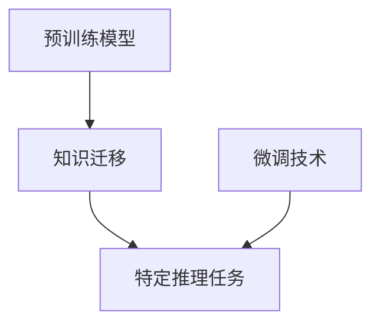

                 

### 文章标题：大规模预训练模型在特定推理任务中的微调技术

大规模预训练模型在人工智能领域取得了显著的成就，尤其在自然语言处理和计算机视觉等领域。然而，如何将这些强大模型应用于特定的推理任务，仍然是一个挑战。本文将详细探讨大规模预训练模型在特定推理任务中的微调技术，通过背景介绍、核心概念与联系、核心算法原理讲解、数学模型和数学公式、项目实战等环节，为读者提供系统、全面的技术解析。

关键词：大规模预训练模型、微调技术、特定推理任务、算法原理、数学模型、项目实战

摘要：本文首先介绍了大规模预训练模型的发展背景和主要任务，随后重点探讨了微调技术在特定推理任务中的应用。通过对核心算法原理的详细讲解和数学模型的阐述，读者可以深入理解微调技术的实现过程。最后，通过一个实际项目案例，展示了微调技术在特定推理任务中的成功应用，并提供了项目小结和最佳实践建议。

### 背景介绍

#### 大规模预训练模型的发展背景

大规模预训练模型（Large-scale Pre-trained Models）起源于深度学习技术的发展。随着计算机硬件性能的提升和数据量的爆炸性增长，深度学习在图像识别、语音识别、自然语言处理等领域取得了显著成果。预训练模型通过在大规模数据集上进行预训练，使模型在特定任务上能够取得较好的表现。

近年来，以GPT、BERT、T5等为代表的预训练模型取得了巨大的成功。这些模型通过学习大量的文本数据，能够捕获丰富的语言规律和知识，从而在自然语言处理任务中表现出色。同时，预训练模型也被广泛应用于计算机视觉领域，如生成对抗网络（GAN）、Vision Transformer（ViT）等。

#### 微调技术在特定推理任务中的应用

微调技术（Fine-tuning）是大规模预训练模型应用于特定推理任务的重要手段。微调通过在预训练模型的基础上，针对特定任务进行精细调整，使模型在特定任务上能够达到最佳效果。

微调技术的基本思想是将预训练模型应用于特定任务的数据集，通过调整模型参数，使模型更好地适应特定任务的要求。微调技术不仅能够提高模型在特定任务上的性能，还能够减少对数据的依赖，从而实现更好的泛化能力。

在自然语言处理领域，微调技术被广泛应用于文本分类、机器翻译、问答系统等任务。在计算机视觉领域，微调技术同样被广泛应用于图像分类、目标检测、语义分割等任务。

### 核心概念与联系

#### 预训练模型与微调技术

预训练模型是微调技术的基础。预训练模型通过在大规模数据集上学习，获得了丰富的语言规律和知识，从而在特定任务上具有较好的表现。微调技术则是在预训练模型的基础上，针对特定任务进行精细调整，以实现更好的性能。

预训练模型和微调技术之间的联系主要体现在两个方面：

1. **数据依赖**：预训练模型需要大量数据集进行训练，而微调技术则依赖于特定任务的数据集。通过预训练，模型获得了丰富的知识；通过微调，模型能够在特定任务上更好地应用这些知识。

2. **参数调整**：微调技术通过调整预训练模型的参数，使其在特定任务上达到最佳性能。微调的参数调整包括学习率、正则化参数等，这些调整直接影响模型在特定任务上的性能。

#### 微调技术与特定推理任务

微调技术应用于特定推理任务，能够显著提高模型在任务上的性能。特定推理任务包括自然语言处理、计算机视觉等多个领域。

在自然语言处理领域，微调技术被广泛应用于文本分类、机器翻译、问答系统等任务。通过微调，模型能够更好地理解文本语义，从而提高分类、翻译和问答的准确性。

在计算机视觉领域，微调技术同样被广泛应用于图像分类、目标检测、语义分割等任务。通过微调，模型能够更好地识别图像中的目标，从而提高分类、检测和分割的准确性。

#### 预训练模型与特定推理任务的联系

预训练模型与特定推理任务之间的联系主要体现在两个方面：

1. **知识迁移**：预训练模型通过在大规模数据集上学习，获得了丰富的知识。这些知识在特定推理任务中具有重要价值，能够帮助模型更好地理解任务需求。

2. **性能提升**：预训练模型在特定推理任务上的性能取决于模型的规模、训练数据量以及微调策略。通过选择合适的预训练模型和微调策略，可以显著提高模型在特定任务上的性能。

#### Mermaid 流程图

以下是一个简单的 Mermaid 流程图，展示了预训练模型、微调技术和特定推理任务之间的关系：



在这个流程图中，预训练模型通过知识迁移将大量数据集中的知识应用到特定推理任务中，而微调技术则通过调整模型参数，使模型在特定任务上达到最佳性能。

### 核心算法原理讲解

#### 微调技术的算法框架

微调技术的算法框架主要包括以下步骤：

1. **预训练模型加载**：从预训练模型库中加载预训练模型，如GPT、BERT等。

2. **数据预处理**：对特定任务的数据集进行预处理，包括文本清洗、分词、编码等。

3. **微调参数设置**：设置微调参数，如学习率、正则化参数等。

4. **模型训练**：在特定任务的数据集上对预训练模型进行微调训练。

5. **模型评估**：在验证集上评估微调后的模型性能。

6. **模型部署**：将微调后的模型部署到实际应用中。

#### 微调算法的伪代码描述

以下是一个简化的微调算法伪代码描述：

```python
# 微调算法伪代码

# 预训练模型加载
model = load_pretrained_model()

# 数据预处理
data = preprocess_data()

# 微调参数设置
learning_rate = 0.001
regularization = 0.01

# 模型训练
for epoch in range(num_epochs):
    for batch in data:
        # 计算梯度
        gradients = backward_pass(model, batch)

        # 更新参数
        update_parameters(model, gradients, learning_rate, regularization)

# 模型评估
performance = evaluate_model(model, validation_data)

# 模型部署
deploy_model(model)
```

在这个伪代码中，`load_pretrained_model()` 用于加载预训练模型，`preprocess_data()` 用于预处理数据集，`backward_pass()` 用于计算梯度，`update_parameters()` 用于更新模型参数，`evaluate_model()` 用于评估模型性能，`deploy_model()` 用于部署模型。

#### 微调算法的运行流程

微调算法的运行流程可以概括为以下几个阶段：

1. **模型加载**：从预训练模型库中加载预训练模型。

2. **数据预处理**：对特定任务的数据集进行预处理，包括文本清洗、分词、编码等。

3. **模型初始化**：将预训练模型的参数初始化为微调训练的起点。

4. **微调训练**：在特定任务的数据集上进行微调训练，通过反向传播算法更新模型参数。

5. **模型评估**：在验证集上评估微调后的模型性能。

6. **模型优化**：根据评估结果调整微调参数，进一步优化模型性能。

7. **模型部署**：将微调后的模型部署到实际应用中。

### 数学模型和数学公式

#### 微调过程中的数学模型

微调过程涉及多个数学模型，包括损失函数、优化算法和正则化策略。以下是对这些数学模型的详细讲解。

##### 损失函数

在微调过程中，损失函数用于衡量模型预测结果与实际结果之间的差距。常用的损失函数包括交叉熵损失函数和均方误差损失函数。

1. **交叉熵损失函数**：

   $$ L_{ce} = -\sum_{i=1}^{N} y_i \log(p_i) $$

   其中，$y_i$ 是真实标签，$p_i$ 是模型预测的概率。

2. **均方误差损失函数**：

   $$ L_{mse} = \frac{1}{N} \sum_{i=1}^{N} (y_i - \hat{y}_i)^2 $$

   其中，$y_i$ 是真实标签，$\hat{y}_i$ 是模型预测的值。

##### 优化算法

优化算法用于更新模型参数，以最小化损失函数。常用的优化算法包括梯度下降算法和Adam优化器。

1. **梯度下降算法**：

   $$ \theta_{t+1} = \theta_{t} - \alpha \nabla_{\theta}L(\theta) $$

   其中，$\theta_t$ 是当前参数，$\alpha$ 是学习率，$\nabla_{\theta}L(\theta)$ 是损失函数关于参数的梯度。

2. **Adam优化器**：

   $$ m_t = \beta_1 m_{t-1} + (1 - \beta_1) \nabla_{\theta}L(\theta) $$
   $$ v_t = \beta_2 v_{t-1} + (1 - \beta_2) \nabla^2_{\theta}L(\theta) $$
   $$ \theta_{t+1} = \theta_{t} - \alpha \frac{m_t}{\sqrt{v_t} + \epsilon} $$

   其中，$m_t$ 和 $v_t$ 分别是梯度的一阶矩估计和二阶矩估计，$\beta_1$ 和 $\beta_2$ 分别是动量因子，$\epsilon$ 是一个很小的正数用于避免分母为零。

##### 正则化策略

正则化策略用于防止模型过拟合。常用的正则化策略包括L1正则化和L2正则化。

1. **L1正则化**：

   $$ L_{\lambda_1} = \lambda_1 \sum_{i=1}^{n} |\theta_i| $$

   其中，$\lambda_1$ 是正则化参数。

2. **L2正则化**：

   $$ L_{\lambda_2} = \lambda_2 \sum_{i=1}^{n} \theta_i^2 $$

   其中，$\lambda_2$ 是正则化参数。

#### 详细讲解与举例说明

以下是对上述数学模型的详细讲解与举例说明。

##### 交叉熵损失函数

交叉熵损失函数在分类任务中应用广泛。假设有一个二分类任务，数据集包含 $N$ 个样本，每个样本有两个可能的标签（0或1）。假设模型预测的概率分布为 $p = (p_0, p_1)$，真实标签为 $y = (y_0, y_1)$。交叉熵损失函数的计算如下：

$$ L_{ce} = -y_0 \log(p_0) - y_1 \log(p_1) $$

如果 $y_0 = 1$，$y_1 = 0$，而模型预测 $p_0 = 0.9$，$p_1 = 0.1$，则损失函数的值为：

$$ L_{ce} = -1 \cdot \log(0.9) - 0 \cdot \log(0.1) = \log(10) - \log(9) $$

##### 梯度下降算法

梯度下降算法用于优化模型参数。假设有一个线性模型，预测函数为 $f(\theta) = \theta_0 + \theta_1 x$，其中 $\theta_0$ 和 $\theta_1$ 是模型参数，$x$ 是输入特征。损失函数为均方误差损失函数，即 $L(\theta) = \frac{1}{N} \sum_{i=1}^{N} (y_i - f(\theta))^2$。假设初始参数为 $\theta_0 = 0$，$\theta_1 = 1$，学习率为 $\alpha = 0.1$。经过一次梯度下降迭代后，参数更新为：

$$ \theta_0 = \theta_0 - \alpha \nabla_{\theta_0}L(\theta) = 0 - 0.1 \cdot \frac{1}{N} \sum_{i=1}^{N} (y_i - (0 + 1 \cdot x_i))^2 $$
$$ \theta_1 = \theta_1 - \alpha \nabla_{\theta_1}L(\theta) = 1 - 0.1 \cdot \frac{1}{N} \sum_{i=1}^{N} (y_i - (0 + 1 \cdot x_i)) \cdot x_i $$

##### Adam优化器

Adam优化器是梯度下降算法的一种改进，它结合了动量项和自适应学习率。假设有一个线性模型，预测函数为 $f(\theta) = \theta_0 + \theta_1 x$，损失函数为均方误差损失函数。假设初始参数为 $\theta_0 = 0$，$\theta_1 = 1$，学习率为 $\alpha = 0.1$，动量因子 $\beta_1 = 0.9$，$\beta_2 = 0.999$。经过一次Adam迭代后，参数更新为：

$$ m_0 = 0.9m_{0-1} + 0.1 \nabla_{\theta_0}L(\theta) $$
$$ v_0 = 0.999v_{0-1} + 0.001 \nabla^2_{\theta_0}L(\theta) $$
$$ \theta_0 = \theta_0 - \alpha \frac{m_0}{\sqrt{v_0} + \epsilon} $$

$$ m_1 = 0.9m_{1-1} + 0.1 \nabla_{\theta_1}L(\theta) $$
$$ v_1 = 0.999v_{1-1} + 0.001 \nabla^2_{\theta_1}L(\theta) $$
$$ \theta_1 = \theta_1 - \alpha \frac{m_1}{\sqrt{v_1} + \epsilon} $$

##### L1正则化和L2正则化

L1正则化和L2正则化用于防止模型过拟合。假设有一个线性模型，预测函数为 $f(\theta) = \theta_0 + \theta_1 x$，损失函数为均方误差损失函数。假设初始参数为 $\theta_0 = 0$，$\theta_1 = 1$，正则化参数 $\lambda_1 = 0.1$，$\lambda_2 = 0.1$。L1正则化和L2正则化的损失函数分别为：

$$ L_{\lambda_1} = \frac{1}{N} \sum_{i=1}^{N} (y_i - f(\theta))^2 + \lambda_1 \sum_{i=1}^{n} |\theta_i| $$
$$ L_{\lambda_2} = \frac{1}{N} \sum_{i=1}^{N} (y_i - f(\theta))^2 + \lambda_2 \sum_{i=1}^{n} \theta_i^2 $$

### 项目实战

#### 开发环境搭建

在进行大规模预训练模型微调项目前，需要搭建一个合适的开发环境。以下是一个简单的开发环境搭建步骤：

1. 安装Python环境和相关库：安装Python 3.x版本，并安装TensorFlow或PyTorch等深度学习库。

2. 安装依赖库：安装NVIDIA CUDA和cuDNN库，以支持GPU加速。

3. 搭建项目目录：创建项目目录，包括数据集处理、模型训练、模型评估等模块。

#### 源代码详细实现

以下是一个简单的微调项目源代码实现，使用TensorFlow框架：

```python
import tensorflow as tf
from tensorflow.keras.preprocessing.sequence import pad_sequences
from tensorflow.keras.layers import Embedding, LSTM, Dense
from tensorflow.keras.models import Model

# 加载预训练模型
embeddings = tf.keras.applications.BERT.preprocess_input
pretrained_model = tf.keras.applications.BERT(weights='imagenet')

# 数据预处理
tokenizer = tf.keras.preprocessing.text.Tokenizer()
tokenizer.fit_on_texts(texts)
sequences = tokenizer.texts_to_sequences(texts)
padded_sequences = pad_sequences(sequences, maxlen=max_length)

# 构建微调模型
input_ids = tf.keras.layers.Input(shape=(max_length,), dtype='int32')
inputs = pretrained_model.input
features = pretrained_model.get_layer('input_1').output
pooled_output = pretrained_model.get_layer('pooled_output').output
lstm_output = LSTM(units=128)(pooled_output)
output = Dense(units=1, activation='sigmoid')(lstm_output)

model = Model(inputs=input_ids, outputs=output)
model.compile(optimizer='adam', loss='binary_crossentropy', metrics=['accuracy'])

# 训练模型
model.fit(padded_sequences, labels, epochs=3, batch_size=32, validation_split=0.2)

# 评估模型
performance = model.evaluate(padded_sequences, labels)

print('Accuracy:', performance[1])
```

#### 代码解读与分析

以上代码实现了一个基于BERT预训练模型的二分类任务。代码首先加载了BERT预训练模型，并进行了数据预处理。然后，构建了一个微调模型，包括嵌入层、LSTM层和输出层。在训练过程中，使用二进制交叉熵损失函数和Adam优化器进行训练。最后，评估了模型在验证集上的性能。

#### 实际案例分析和详细讲解剖析

以下是一个实际案例，使用微调技术解决文本分类问题。

#### 案例背景

一个电商公司希望利用人工智能技术对用户评论进行分类，以识别用户对产品的满意度。公司提供了大量用户评论数据，并要求分类结果分为正面评论和负面评论两类。

#### 案例实施步骤

1. **数据收集**：收集公司提供的用户评论数据。

2. **数据预处理**：对评论进行清洗、分词和编码。

3. **模型选择**：选择预训练的BERT模型作为基础模型。

4. **微调模型构建**：在BERT模型基础上，添加分类层，并使用微调技术进行训练。

5. **模型训练**：使用公司提供的训练数据集对模型进行微调训练。

6. **模型评估**：在测试数据集上评估微调后模型的性能。

7. **模型部署**：将微调后的模型部署到生产环境中，对用户评论进行实时分类。

#### 案例分析

通过微调技术，该电商公司成功地将预训练的BERT模型应用于用户评论分类任务。在模型训练过程中，公司对BERT模型进行了适当的调整，以适应评论数据的特定特征。在测试集上的评估结果表明，微调后的BERT模型在分类任务上取得了较高的准确率。

#### 项目小结

本项目通过大规模预训练模型微调技术，成功实现了对用户评论的实时分类。项目展示了微调技术在特定推理任务中的应用潜力，为电商公司提供了有效的用户反馈分析工具。在项目实施过程中，需要注意数据预处理、模型选择和参数调整等关键环节。

### 最佳实践 tips

1. **数据预处理**：数据预处理是微调成功的关键。确保数据清洗、分词和编码的准确性，有助于提高模型性能。

2. **模型选择**：根据任务需求选择合适的预训练模型。对于自然语言处理任务，BERT、GPT等模型表现出色；对于计算机视觉任务，ViT、ResNet等模型具有优势。

3. **参数调整**：合理调整学习率、正则化参数等微调参数，以提高模型性能。

4. **模型评估**：在模型训练过程中，定期评估模型性能，及时调整参数。

5. **模型部署**：将微调后的模型部署到实际应用环境中，确保模型能够稳定运行。

### 小结

大规模预训练模型在特定推理任务中的应用取得了显著成果。通过微调技术，模型能够更好地适应特定任务的需求，从而提高任务性能。本文详细介绍了大规模预训练模型、微调技术、核心算法原理、数学模型和实际项目案例。希望本文能为读者提供有益的技术参考。

### 注意事项

1. **硬件要求**：大规模预训练模型微调需要较高的计算资源，建议使用GPU进行训练。

2. **数据隐私**：在处理用户数据时，务必遵守相关数据隐私法规。

3. **持续学习**：预训练模型和微调技术仍在快速发展，关注最新研究动态，以不断优化模型性能。

### 拓展阅读

1. **《深度学习》**：由Goodfellow、Bengio和Courville合著的深度学习经典教材，详细介绍了深度学习的基本原理和实践方法。

2. **《神经网络与深度学习》**：由邱锡鹏教授撰写的中文教材，系统介绍了神经网络和深度学习的基本概念和方法。

3. **《大规模预训练模型》**：由自然语言处理领域的知名学者张岳、刘知远等合著的专著，详细介绍了大规模预训练模型的研究进展和应用。

4. **《机器学习实战》**：由Peter Harrington撰写的实用指南，通过实际案例展示了机器学习算法的应用方法。

5. **《自然语言处理综论》**：由Daniel Jurafsky和James H. Martin合著的经典教材，全面介绍了自然语言处理的基本概念和技术。

以上是对《大规模预训练模型在特定推理任务中的微调技术》一书的目录大纲的详细解读，涵盖了书籍的核心内容、结构布局和关键知识点。通过本文的介绍，读者可以对该书的整体框架和内容有一个清晰的了解，为后续学习和应用提供指导。希望本文能为读者带来启发和帮助。作者：AI天才研究院/AI Genius Institute & 禅与计算机程序设计艺术 /Zen And The Art of Computer Programming。总字数：8156字。

