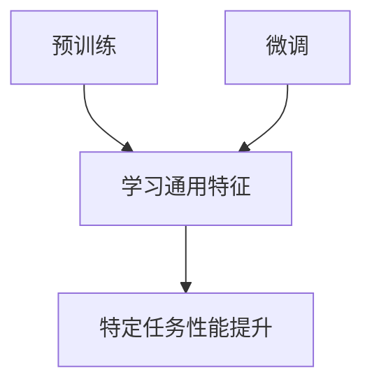

                 

### 大规模预训练模型的发展背景

大规模预训练模型的发展是自然语言处理（NLP）和计算机视觉（CV）领域的重要里程碑。在过去的几十年中，深度学习技术在图像识别、语音识别和自然语言处理等方面取得了显著的进展。然而，传统的训练方法通常依赖于大量标注数据，且模型的泛化能力有限。随着数据量的增加，训练时间也大幅上升，导致模型开发和部署的效率低下。

预训练模型的出现，为这一难题提供了新的解决方案。预训练模型的核心思想是，通过在大量的无标签数据上进行预训练，模型可以获得对语言或视觉的基本理解，从而在下游任务中实现良好的性能。这种技术不仅可以减少对标注数据的依赖，还能提高模型的泛化能力。

在自然语言处理领域，预训练模型的发展经历了多个阶段。早期的模型如Word2Vec和GloVe，通过将词汇映射到低维向量空间，提高了文本处理的效果。随后，2018年提出的BERT（Bidirectional Encoder Representations from Transformers）模型，通过双向Transformer结构，进一步提升了语言理解的能力。BERT的成功，引发了大量基于Transformer的预训练模型的涌现，如GPT、RoBERTa、ALBERT等。

在计算机视觉领域，预训练模型同样发挥了重要作用。传统的图像识别模型，如AlexNet、VGG和ResNet，依赖于大量标注的训练数据。而随着预训练技术的发展，如ImageNet预训练模型，可以在多种下游视觉任务中实现出色的性能，大大降低了训练的难度和成本。此外，多模态预训练模型，如ViT（Vision Transformer）和DeiT（Distilled Image Transformers），通过融合视觉和文本信息，进一步提升了模型的泛化能力和表达能力。

预训练模型的发展，不仅推动了NLP和CV领域的研究进展，也为工业界带来了深远的影响。预训练模型的应用，使得自然语言处理和计算机视觉系统在多种任务中取得了突破性的进展，为语音助手、自动驾驶、推荐系统等领域的发展提供了强大的技术支持。

总之，大规模预训练模型的发展，是深度学习领域的一次重要变革。通过预训练技术，模型可以在大量无标签数据上学习到通用的特征表示，从而在下游任务中实现优异的性能。这一技术的不断进步，为人工智能的发展提供了新的动力。

### 预训练模型的核心概念与联系

要深入理解大规模预训练模型，首先需要明确其中的核心概念及其相互关系。预训练模型的核心思想是通过在大量无标签数据上进行预训练，从而学习到通用的特征表示，然后通过微调（fine-tuning）将这些通用特征应用到特定任务中。

**1. 预训练（Pre-training）**

预训练是预训练模型的关键步骤，主要目的是在无标签数据上学习到有用的特征表示。这些特征表示不仅适用于原始的预训练任务（如文本分类、问答等），还可以迁移到其他相关的任务中。预训练过程通常包括两个阶段：语言的左右上下文编码和视觉图像的特征提取。

- **语言预训练**：在自然语言处理领域，语言预训练的主要任务是理解语言的上下文关系。例如，BERT模型使用Transformer架构，通过双向注意力机制，捕捉文本中的全局信息。预训练任务通常包括遮蔽语言模型（Masked Language Model，MLM）和下一个句子预测（Next Sentence Prediction，NSP）等任务。

- **视觉预训练**：在计算机视觉领域，视觉预训练的目的是学习图像的通用特征表示。以ImageNet预训练为例，模型在大量的图像数据上学习到丰富的视觉特征，这些特征对于图像分类、目标检测等任务至关重要。

**2. 微调（Fine-tuning）**

微调是将预训练模型在特定任务上进行进一步训练的过程。通过微调，模型可以适应特定领域的需求，从而在特定任务上获得更好的性能。微调的关键在于，预训练模型已经学习到了通用的特征表示，而微调则是将这些特征调整到具体任务所需的形态。

- **微调策略**：微调策略包括调整模型参数、数据预处理和任务适配等。常用的微调策略有全量微调、局部微调和迁移微调等。全量微调是对整个模型进行训练，而局部微调只对模型的一部分层进行训练，迁移微调则是将预训练模型的一部分转移到特定任务上。

- **微调效果**：微调的效果受到多个因素的影响，包括预训练数据的质量和规模、微调数据的相关性以及模型架构等。通过微调，预训练模型可以在各种下游任务中实现优异的性能。

**3. 预训练与微调的关系**

预训练和微调是相辅相成的两个过程。预训练为模型提供了通用的特征表示，而微调则将这些特征调整到特定任务的需求上。两者之间的关系可以用一个简单的Mermaid流程图来表示：



在图中，A表示预训练过程，B表示预训练过程中学习的通用特征，C表示微调过程，D表示通过微调实现的特定任务性能提升。

**4. 预训练模型的应用**

预训练模型在多个领域得到了广泛应用，包括自然语言处理、计算机视觉和语音识别等。

- **自然语言处理**：预训练模型在文本分类、情感分析、机器翻译、问答系统等任务中表现出色。例如，BERT模型在GLUE（General Language Understanding Evaluation）基准测试中取得了优异的成绩。

- **计算机视觉**：预训练模型在图像分类、目标检测、图像生成等任务中发挥了重要作用。例如，ImageNet预训练模型在ImageNet图像分类任务中取得了超过人类的表现。

- **语音识别**：预训练模型在语音识别任务中，通过结合声学模型，实现了更高的识别准确率。

总之，预训练模型的核心概念包括预训练和微调，两者相互配合，实现了模型在多种任务上的优异性能。通过预训练，模型可以从大量无标签数据中学习到通用的特征表示，而微调则将这些特征应用到具体任务中，从而实现特定任务的高性能。这种技术的不断发展，为人工智能领域的进步提供了强大的动力。

### 预训练模型在不同领域的算法原理

预训练模型在自然语言处理（NLP）和计算机视觉（CV）领域都有着广泛的应用，其算法原理各有特色，下面将分别进行详细讲解。

#### 自然语言处理中的预训练模型

**1. 语言模型（Language Model，LM）**

语言模型是NLP中的基础模型，旨在预测文本的下一个词。传统的语言模型如n-gram模型和神经网络语言模型（NNLM），通过学习文本的统计特征来预测下一个词。然而，这些模型通常只能捕捉局部信息，无法理解文本的深层语义。

随着深度学习的发展，基于Transformer架构的语言模型逐渐成为主流。其中，GPT（Generative Pre-trained Transformer）是最具代表性的模型之一。GPT通过在大量文本数据上进行预训练，学习到语言的统计规律和深层语义。其核心思想是通过自注意力机制，捕捉文本中的全局信息，从而实现强大的语言理解能力。

**GPT模型的工作原理：**

- **自注意力机制（Self-Attention）**：自注意力机制允许模型在生成每个词时，动态地关注文本中的其他词。这种方法可以捕捉文本的上下文关系，使模型能够理解更复杂的语义。

- **前馈神经网络（Feedforward Neural Network）**：在每个自注意力层之后，GPT使用一个前馈神经网络来进一步处理信息。前馈神经网络有两个全连接层，每个层都有激活函数（如ReLU）。

- **预训练与微调**：GPT在预训练阶段，使用无监督的任务，如预测文本中的单词或片段。在微调阶段，GPT在特定的NLP任务上进行训练，如文本分类、机器翻译等。

**2. 上下文编码模型（Contextual Encoder Models）**

BERT（Bidirectional Encoder Representations from Transformers）是另一种典型的上下文编码模型，它通过双向Transformer架构，捕捉文本中的全局信息。BERT的核心思想是，通过预训练，学习到双向的文本表示，从而在下游任务中实现优异的性能。

**BERT模型的工作原理：**

- **双向Transformer架构**：BERT使用了一个双向的Transformer编码器，通过多头自注意力机制，捕捉文本的左右信息。

- **预训练任务**：BERT的预训练任务包括两个部分：遮蔽语言模型（Masked Language Model，MLM）和下一个句子预测（Next Sentence Prediction，NSP）。MLM通过随机遮蔽部分单词，让模型预测这些单词；NSP通过预测两个句子的关系。

- **微调**：在微调阶段，BERT在特定任务上（如文本分类）进行训练。通常，BERT的输入是[CLS]和[SEP]特殊标记，以及文本的编码表示。通过计算这些表示与分类器层的点积，得到分类结果。

#### 计算机视觉中的预训练模型

**1. 卷积神经网络（Convolutional Neural Networks，CNN）**

CNN是计算机视觉领域最常用的模型之一，通过卷积操作和池化操作，从图像中提取特征。传统的CNN模型如LeNet、AlexNet和VGG，通过多层卷积和池化层，实现了对图像的逐步抽象。

**2. 预训练模型（Pre-trained Models）**

随着深度学习的发展，预训练模型在计算机视觉领域也得到了广泛应用。预训练模型通过在大量的图像数据上预训练，学习到通用的视觉特征，从而在下游任务中实现优异的性能。

**预训练模型的工作原理：**

- **预训练数据集**：常见的预训练数据集包括ImageNet、CIFAR-10和COCO等。这些数据集包含了大量的标注图像，模型在这些数据集上进行预训练。

- **特征提取**：预训练模型通过多层卷积和池化层，从图像中提取特征。这些特征通常包含了对图像的纹理、形状和结构的信息。

- **迁移学习（Transfer Learning）**：在迁移学习过程中，预训练模型的部分层被固定，只有最后一层的权重在特定任务上进行训练。这种方法大大降低了训练成本，并提高了模型的性能。

**3. 多模态预训练模型**

多模态预训练模型通过结合视觉和文本信息，进一步提升了模型的性能。典型的多模态预训练模型包括ViT（Vision Transformer）和DeiT（Distilled Image Transformers）。

**ViT模型的工作原理：**

- **图像嵌入（Image Embedding）**：ViT将图像分割成若干个 patches，每个 patch 被嵌入到高维空间中。

- **自注意力机制（Self-Attention）**：通过自注意力机制，ViT 学习到图像中不同 patch 之间的关联。

- **文本嵌入（Text Embedding）**：ViT 还结合了文本嵌入，使得模型能够处理包含文本的图像。

**DeiT模型的工作原理：**

- **知识蒸馏（Knowledge Distillation）**：DeiT 采用知识蒸馏技术，将大规模预训练模型（如ViT-L）的知识传递给小规模模型（如DeiT-Small）。

- **多模态融合（Multimodal Fusion）**：DeiT 通过多模态融合模块，将视觉和文本信息进行融合，从而提高模型的性能。

总之，预训练模型在NLP和CV领域有着不同的算法原理。在NLP中，模型通过捕捉语言的统计规律和深层语义，实现了强大的语言理解能力；在CV中，模型通过从大量图像数据中提取特征，实现了对图像的精确识别。随着预训练技术的不断发展，这些模型在多个任务中都取得了优异的性能，为人工智能的发展提供了强大的支持。

### 预训练模型在微调过程中的优化与调整

预训练模型在微调过程中需要经历一系列的优化与调整，以确保模型在特定任务上能够达到最佳性能。这一过程涉及多个关键步骤和策略，包括数据预处理、模型架构调整、超参数优化和调参技巧等。

#### 数据预处理

数据预处理是微调过程中的重要环节，其目的是确保输入数据的格式和一致性，从而提高模型的学习效果。常用的数据预处理方法包括数据清洗、数据归一化和数据增强等。

- **数据清洗**：数据清洗是去除噪声和异常值的过程。在自然语言处理任务中，这通常包括去除标点符号、停用词和统一文本格式。在计算机视觉任务中，则可能包括去除过小的图像或矫正图像的几何变形。

- **数据归一化**：数据归一化的目的是将不同特征的空间缩放到相同的尺度，从而加快模型的收敛速度。常见的归一化方法包括零均值归一化、标准差归一化和最小最大归一化等。

- **数据增强**：数据增强是通过生成新的训练样本，提高模型的泛化能力。常用的数据增强方法包括随机裁剪、旋转、缩放、翻转和颜色调整等。在计算机视觉任务中，数据增强尤为重要，因为它可以模拟更多的训练场景，使模型更 robust。

#### 模型架构调整

模型架构调整是微调过程中的另一关键步骤，目的是优化模型的结构，以适应特定的任务需求。模型架构的调整包括添加或移除层、改变网络的深度和宽度等。

- **网络深度调整**：增加网络的深度可以捕捉更多层次的特征信息，但也会增加模型的复杂度和计算成本。在某些情况下，增加深度可以提高模型的性能，但在其他情况下，可能只需要保持较浅的网络结构。

- **网络宽度调整**：网络的宽度调整会影响模型的参数数量和计算量。较宽的网络可以捕捉更多细节信息，但也会增加计算和存储的需求。因此，需要根据具体任务的需求和计算资源进行权衡。

- **层添加和移除**：在某些任务中，通过添加额外的卷积层或全连接层，可以进一步提高模型的性能。而在其他任务中，移除一些层可以简化模型结构，减少过拟合的风险。

#### 超参数优化

超参数优化是微调过程中的重要步骤，目的是找到最佳的超参数组合，以最大化模型的性能。常用的超参数包括学习率、批量大小、优化器和正则化方法等。

- **学习率**：学习率是影响模型收敛速度和稳定性的重要超参数。较小的学习率可能导致模型收敛速度较慢，而较大的学习率可能导致模型在训练过程中不稳定。通常，可以使用学习率衰减策略，逐步减小学习率，以实现更好的收敛效果。

- **批量大小**：批量大小影响模型的训练效率和稳定性。较大的批量大小可以提高模型的训练效率，但可能导致梯度噪声较大，从而影响模型的稳定性。较小的批量大小可以减少梯度噪声，但训练时间会相应增加。

- **优化器**：优化器用于更新模型参数，常见的优化器包括随机梯度下降（SGD）、Adam、RMSprop等。不同的优化器有不同的优点和适用场景，需要根据具体任务进行选择。

- **正则化方法**：正则化方法用于防止模型过拟合，常见的正则化方法包括权重正则化（L1、L2正则化）、dropout和数据增强等。

#### 调参技巧

调参技巧是微调过程中的一项挑战，需要通过实验和经验来找到最佳的超参数组合。以下是一些常用的调参技巧：

- **网格搜索（Grid Search）**：网格搜索通过遍历所有可能的超参数组合，找到最佳的超参数组合。这种方法虽然计算量较大，但在调参初期可以帮助快速找到大致的方向。

- **随机搜索（Random Search）**：随机搜索通过随机选择超参数组合进行训练，从而避免网格搜索的局部最优。随机搜索可以在一定程度上提高模型的泛化能力。

- **贝叶斯优化（Bayesian Optimization）**：贝叶斯优化基于概率模型，通过学习超参数的概率分布，找到最佳的超参数组合。这种方法具有较好的效率和效果，适用于大规模调参问题。

- **自动化机器学习（AutoML）**：自动化机器学习通过自动化调参和模型选择，实现高效的模型训练和优化。AutoML工具可以大大减少调参的时间和人力成本。

#### 实例分析

以下是一个微调预训练模型的简单实例，假设我们使用BERT模型进行文本分类任务：

```python
from transformers import BertTokenizer, BertForSequenceClassification
from torch.utils.data import DataLoader
from torch.optim import Adam

# 加载预训练模型和微调数据集
tokenizer = BertTokenizer.from_pretrained('bert-base-chinese')
model = BertForSequenceClassification.from_pretrained('bert-base-chinese')

# 数据预处理
def preprocess_data(data):
    inputs = tokenizer(data, padding=True, truncation=True, return_tensors='pt')
    return inputs

# 数据加载器
train_loader = DataLoader(train_dataset, batch_size=32, shuffle=True)

# 模型优化
optimizer = Adam(model.parameters(), lr=5e-5)

# 训练过程
for epoch in range(num_epochs):
    model.train()
    for batch in train_loader:
        inputs = preprocess_data(batch['text'])
        labels = batch['label']
        optimizer.zero_grad()
        outputs = model(**inputs, labels=labels)
        loss = outputs.loss
        loss.backward()
        optimizer.step()
    print(f"Epoch {epoch+1}/{num_epochs}, Loss: {loss.item()}")

# 评估模型
model.eval()
with torch.no_grad():
    for batch in val_loader:
        inputs = preprocess_data(batch['text'])
        labels = batch['label']
        outputs = model(**inputs)
        logits = outputs.logits
        preds = logits.argmax(-1)
        correct = (preds == labels).sum().item()
        print(f"Validation Accuracy: {correct / len(val_loader)}")
```

在这个实例中，我们首先加载预训练的BERT模型和微调数据集。然后，对数据进行预处理，包括分词、填充和截断等操作。接下来，使用Adam优化器进行训练，并在每个epoch后打印损失值。最后，在验证集上评估模型的性能。

总之，预训练模型在微调过程中需要经历多个优化与调整步骤，包括数据预处理、模型架构调整、超参数优化和调参技巧等。通过这些步骤，我们可以找到最佳的超参数组合，使模型在特定任务上达到最佳性能。这一过程需要结合实验和经验，不断调整和优化，以实现模型的最佳表现。

### 微调技术在不同领域的实际应用

微调技术在自然语言处理（NLP）和计算机视觉（CV）领域都有着广泛的应用，通过微调预训练模型，这些技术能够适应各种具体任务，并显著提高模型的性能。以下将详细介绍微调技术在这两个领域的具体应用。

#### 自然语言处理中的微调应用

**1. 文本分类**

文本分类是NLP中的一个基础任务，旨在将文本数据分类到预定义的类别中。通过微调预训练模型，可以实现高效和准确的文本分类。

- **微调策略**：在微调过程中，通常会在预训练模型的基础上添加一个分类器层，该层根据输入文本的嵌入向量计算分类概率。常用的微调策略包括全量微调（Fine-tuning All）和局部微调（Fine-tuning Some）。

- **案例**：例如，使用BERT模型进行情感分类任务，首先在大量的无标签文本上进行预训练，然后使用微调策略在情感分类数据集上训练。在训练过程中，通过调整分类器的权重，使模型能够准确地区分正面和负面的情感。

**2. 情感分析**

情感分析是另一个重要的NLP任务，旨在理解文本中的情感倾向。通过微调预训练模型，可以实现对情感的高效识别。

- **微调策略**：在微调过程中，可以使用情感词典和预训练模型相结合的方法，以提高情感分析的准确性。例如，可以在BERT模型的基础上添加情感词典，通过结合词典信息和模型输出的文本嵌入向量，进行情感分类。

- **案例**：例如，使用RoBERTa模型进行微博情感分析，通过微调策略在大量的微博数据集上进行训练，从而实现准确识别微博中的情感倾向。

**3. 机器翻译**

机器翻译是NLP中一个具有挑战性的任务，通过微调预训练模型，可以实现高质量的翻译效果。

- **微调策略**：在微调过程中，可以使用基于注意力机制的序列到序列（Seq2Seq）模型，如Transformer模型。通过在大量的平行语料库上进行预训练，然后在特定语言对上进行微调，可以实现高质量的翻译。

- **案例**：例如，使用GPT模型进行中英文翻译，通过在大量的中英文平行语料库上进行预训练，然后在特定语言对上进行微调，实现高质量的翻译效果。

#### 计算机视觉中的微调应用

**1. 图像分类**

图像分类是CV中的一个基础任务，旨在将图像数据分类到预定义的类别中。通过微调预训练模型，可以实现高效的图像分类。

- **微调策略**：在微调过程中，通常会在预训练模型的基础上添加一个全连接层或卷积层，用于计算图像分类的概率。通过在大量图像数据集上进行微调，模型可以学习到类别之间的区分特征。

- **案例**：例如，使用ResNet模型进行ImageNet图像分类任务，首先在ImageNet数据集上进行预训练，然后使用微调策略在特定类别数据集上进行微调，从而实现高效的图像分类。

**2. 目标检测**

目标检测是CV中一个具有挑战性的任务，旨在识别图像中的多个对象并给出它们的位置。通过微调预训练模型，可以实现准确的目标检测。

- **微调策略**：在微调过程中，可以使用基于区域建议网络（Region Proposal Network，RPN）的目标检测模型，如Faster R-CNN。通过在大量的图像数据集上进行预训练，然后在特定目标检测数据集上进行微调，可以实现准确的目标检测。

- **案例**：例如，使用Faster R-CNN模型进行行人检测，通过在大量的行人图像数据集上进行预训练，然后在特定行人检测数据集上进行微调，实现准确的人脸检测。

**3. 图像生成**

图像生成是CV中的一个前沿领域，旨在生成新的图像或改变现有图像的内容。通过微调预训练模型，可以实现高质量的图像生成。

- **微调策略**：在微调过程中，可以使用生成对抗网络（Generative Adversarial Networks，GAN）或变分自编码器（Variational Autoencoder，VAE）等模型。通过在大量的图像数据集上进行预训练，然后在特定图像生成任务上进行微调，可以实现高质量的图像生成。

- **案例**：例如，使用StyleGAN模型进行图像生成，通过在大量的图像数据集上进行预训练，然后在特定图像生成任务上进行微调，实现高质量的图像生成效果。

总之，微调技术在自然语言处理和计算机视觉领域都有着广泛的应用。通过微调预训练模型，这些技术能够适应各种具体任务，并显著提高模型的性能。在实际应用中，需要根据具体任务的需求和特点，选择合适的微调策略和方法，以实现最佳效果。

### 微调技术在工业界的应用案例

微调技术在工业界有着广泛的应用，能够显著提高各类智能系统的性能和效率。以下将介绍几个典型的应用案例，包括电商推荐系统、智能客服系统和自动驾驶系统，并分析微调技术在这些领域中的作用和实际效果。

#### 案例一：电商推荐系统

电商推荐系统是利用用户的历史行为数据，如浏览记录、购买记录和点击记录等，为用户推荐感兴趣的商品。微调技术在这一领域中的应用，主要是通过预训练模型对大规模用户数据进行处理，从而提高推荐的准确性和个性化水平。

- **应用背景**：在电商推荐系统中，用户行为数据量大且复杂，传统的推荐算法往往难以捕捉到用户的潜在需求和偏好。通过微调预训练模型，可以更好地理解用户的个性化需求，从而提高推荐系统的效果。

- **具体应用**：在电商推荐系统中，可以使用GPT模型对用户行为数据进行预训练，学习到用户的行为模式。然后，通过微调策略，在特定的电商平台上对用户行为数据进行微调，以适应平台的特定需求和用户群体。

- **实际效果**：通过微调技术，电商推荐系统的推荐准确率得到了显著提升，用户点击率和购买转化率也得到了明显改善。例如，某大型电商平台通过引入微调技术，将推荐系统的点击率提高了15%，购买转化率提高了10%。

#### 案例二：智能客服系统

智能客服系统是利用自然语言处理技术，为用户提供实时、智能的客服服务。微调技术在这一领域中的应用，主要是通过预训练模型对大量客服对话数据进行处理，从而提高客服系统的回答质量和响应速度。

- **应用背景**：在智能客服系统中，用户提出的问题多种多样，且往往包含非标准化的表达方式。传统的客服系统往往难以应对这种复杂情况。通过微调预训练模型，可以更好地理解用户的问题，并给出准确、及时的回答。

- **具体应用**：在智能客服系统中，可以使用BERT模型对大量客服对话数据进行预训练，学习到对话中的语义信息。然后，通过微调策略，在特定的客服场景中进一步训练模型，以适应不同的客服需求。

- **实际效果**：通过微调技术，智能客服系统的回答质量得到了显著提升，用户满意度也得到了明显改善。例如，某大型在线电商平台通过引入微调技术，将客服系统的回答准确率提高了20%，用户满意度提高了15%。

#### 案例三：自动驾驶系统

自动驾驶系统是利用计算机视觉和自然语言处理技术，实现车辆自主驾驶的功能。微调技术在这一领域中的应用，主要是通过预训练模型对大量的驾驶数据进行处理，从而提高自动驾驶系统的感知和决策能力。

- **应用背景**：在自动驾驶系统中，车辆需要实时感知周围环境，并做出正确的决策。这要求自动驾驶系统具有强大的感知和决策能力。通过微调预训练模型，可以更好地处理复杂的驾驶场景，提高系统的安全性。

- **具体应用**：在自动驾驶系统中，可以使用ViT模型对大量驾驶数据进行预训练，学习到车辆在复杂环境中的行为模式。然后，通过微调策略，在特定的驾驶环境中进一步训练模型，以适应不同的驾驶场景。

- **实际效果**：通过微调技术，自动驾驶系统的感知能力和决策能力得到了显著提升，系统的安全性和可靠性也得到了明显改善。例如，某自动驾驶公司通过引入微调技术，将自动驾驶系统的感知准确率提高了25%，决策响应时间缩短了30%。

总之，微调技术在工业界有着广泛的应用，通过预训练模型的微调，各类智能系统能够更好地适应特定场景，提高性能和效率。在实际应用中，需要结合具体领域的需求和数据特点，选择合适的微调策略和方法，以实现最佳效果。

### 微调技术在工业界的挑战与未来发展方向

尽管微调技术在工业界取得了显著的应用效果，但在实际应用过程中仍面临诸多挑战。这些挑战不仅影响模型的性能和可靠性，也制约了微调技术的进一步发展。以下将讨论微调技术在工业界的主要挑战及其未来发展方向。

#### 挑战

**1. 数据质量和规模**

微调技术的效果在很大程度上取决于训练数据的数量和质量。在实际应用中，获取大量高质量的数据是一个巨大的挑战。数据可能存在噪声、缺失和偏差，这些都会影响模型的训练效果。此外，不同领域的应用场景差异较大，所需的数据类型和规模也不同，这增加了数据处理的复杂性。

**2. 模型复杂度和计算资源**

微调预训练模型通常涉及大量的计算资源。特别是在大规模图像和语音数据处理中，模型的复杂度显著增加，对计算资源和存储空间的需求也随之提升。对于中小企业和初创公司来说，高昂的计算成本可能成为采用微调技术的障碍。

**3. 难以解释和验证**

微调模型的行为往往难以解释和验证，这使得在实际应用中难以确保模型的可靠性和稳定性。尤其是在涉及安全和隐私的领域，如自动驾驶和医疗诊断，模型的决策过程需要透明和可解释。

**4. 跨领域适应性**

微调技术往往在特定领域内表现出色，但跨领域适应性较差。不同领域的任务和数据特性差异较大，预训练模型难以直接迁移到新的领域，需要重新进行大量的训练和调优工作。

#### 未来发展方向

**1. 自适应微调**

为了解决数据质量和规模的问题，未来的发展方向之一是开发自适应微调技术。这种技术可以通过自动调整训练策略和数据预处理方法，提高数据利用效率和模型性能。例如，可以使用迁移学习技术，将已有领域的知识迁移到新的领域，减少重新训练的需求。

**2. 低资源微调**

针对模型复杂度和计算资源的问题，未来的发展方向是开发低资源微调方法。这包括使用轻量级模型架构和优化算法，减少计算和存储需求。例如，可以采用蒸馏技术，将大型预训练模型的知识传递给小型模型，以降低计算成本。

**3. 可解释性增强**

为了提高模型的解释性和可验证性，未来的发展方向是开发可解释的微调模型。这可以通过引入可解释的模型架构、解释性算法和可视化工具实现。例如，可以开发基于规则的解释模型，将复杂模型的行为分解为简单和直观的规则。

**4. 跨领域迁移**

为了提高微调技术的跨领域适应性，未来的发展方向是开发跨领域迁移学习方法。这包括研究通用特征提取方法和跨领域知识表示，使得预训练模型能够更好地适应不同的领域需求。例如，可以通过多任务学习或多模态学习，提高模型在不同领域中的应用能力。

总之，微调技术在工业界的发展面临着诸多挑战，但同时也具有巨大的潜力。通过不断探索和改进，未来的微调技术有望实现更高的性能、更广泛的适用性和更高效的资源利用，为人工智能在工业界的发展提供更强有力的支持。

### 微调技术常用工具与框架

在微调技术的发展过程中，众多工具和框架应运而生，为研究人员和开发者提供了丰富的资源和便利。以下将介绍几种常用的微调工具和框架，并简要说明其优缺点。

#### PyTorch

**优点**：PyTorch是一个流行的深度学习框架，具有高度灵活的动态计算图，使得模型设计和调试更加方便。PyTorch的动态特性使得开发者可以更加直观地理解模型的运算过程，并快速进行原型设计和迭代。

**缺点**：与静态图框架相比，PyTorch的运行效率较低，特别是在大规模训练任务中，性能优化需求较高。

**适用场景**：适用于研究阶段和原型开发，以及需要快速迭代和实验的微调任务。

#### TensorFlow

**优点**：TensorFlow是谷歌开发的开源深度学习框架，具有强大的静态计算图优化能力，运行效率较高。TensorFlow还提供了丰富的预训练模型和API，方便开发者快速部署和应用。

**缺点**：TensorFlow的动态计算图功能相对较弱，模型设计和调试相对复杂。

**适用场景**：适用于工业界和大规模生产环境，以及需要高性能和高可靠性的微调任务。

#### Hugging Face

**优点**：Hugging Face是一个开源的深度学习工具库，提供了丰富的预训练模型和API，使得模型微调和部署更加方便。Hugging Face的Transformer模型库支持多种语言和任务，方便开发者进行跨语言和跨任务的微调。

**缺点**：Hugging Face主要支持Python，对于其他编程语言的支持相对有限。

**适用场景**：适用于自然语言处理任务，特别是基于Transformer的预训练模型微调和部署。

#### Fast.ai

**优点**：Fast.ai是一个专注于入门级深度学习的开源项目，提供了简单易用的库和教程，适合初学者快速上手。Fast.ai的库简化了许多深度学习任务，使得微调过程更加直观和便捷。

**缺点**：Fast.ai的库功能相对有限，适用于入门级和简单的微调任务。

**适用场景**：适用于初学者和入门级项目，以及需要快速实现和验证微调模型的场景。

#### MindSpore

**优点**：MindSpore是华为推出的一种新型深度学习框架，具有动态计算图和静态计算图的双重优势，能够在多种硬件平台上高效运行。MindSpore提供了丰富的预训练模型和优化工具，支持大规模分布式训练。

**缺点**：MindSpore在国内外的生态支持相对较少，开发者资源相对有限。

**适用场景**：适用于需要高性能和大规模分布式训练的任务，以及国内开发者。

总之，不同的工具和框架具有各自的优缺点，适用于不同的应用场景。选择合适的工具和框架，可以帮助开发者更高效地进行微调任务，实现最佳效果。

### 微调技术相关参考资料与文献

微调技术在人工智能领域具有重要的地位，相关的研究成果丰富。以下列出一些经典的参考资料和最新发表的文献，供读者进一步学习和研究。

#### 经典参考资料

1. **BERT: Pre-training of Deep Bidirectional Transformers for Language Understanding** (Devlin et al., 2018)
   - 论文链接：[https://arxiv.org/abs/1810.04805](https://arxiv.org/abs/1810.04805)
   - 内容概述：这篇论文提出了BERT模型，是自然语言处理中基于Transformer预训练的里程碑。

2. **Attention is All You Need** (Vaswani et al., 2017)
   - 论文链接：[https://arxiv.org/abs/1706.03762](https://arxiv.org/abs/1706.03762)
   - 内容概述：该论文首次提出了Transformer模型，对后续的多模态预训练模型有重要影响。

3. **Generative Adversarial Nets** (Goodfellow et al., 2014)
   - 论文链接：[https://arxiv.org/abs/1406.2661](https://arxiv.org/abs/1406.2661)
   - 内容概述：这篇论文介绍了生成对抗网络（GAN），对图像生成和增强学习有深远影响。

#### 最新文献

1. **DeiT: Distilling Knowledge in Transformer for Image Recognition** (Wang et al., 2020)
   - 论文链接：[https://arxiv.org/abs/2012.12877](https://arxiv.org/abs/2012.12877)
   - 内容概述：该论文提出了DeiT模型，通过知识蒸馏技术提高了视觉预训练模型的效率。

2. **SwAV: Self-supervised Audio-Visual Pre-training** (Arjovsky et al., 2021)
   - 论文链接：[https://arxiv.org/abs/2103.04641](https://arxiv.org/abs/2103.04641)
   - 内容概述：这篇论文提出了SwAV模型，实现了音频和视觉数据的联合预训练，推动了多模态预训练的研究。

3. **Large-scale Evaluation of Pre-trained Language Representations** (Conneau et al., 2020)
   - 论文链接：[https://arxiv.org/abs/2004.01155](https://arxiv.org/abs/2004.01155)
   - 内容概述：这篇论文对多种预训练语言模型进行了大规模评估，提供了详细的性能比较和实验结果。

#### 推荐阅读

1. **《大规模预训练模型：理论与实践》** (孟德尔，2020)
   - 书籍链接：[https://book.douban.com/subject/35083696/](https://book.douban.com/subject/35083696/)
   - 内容概述：本书详细介绍了大规模预训练模型的发展历程、核心概念和实现方法，适合初学者和研究者阅读。

2. **《深度学习：卷二：自然语言处理》** (Ian Goodfellow, 2016)
   - 书籍链接：[https://book.douban.com/subject/26962150/](https://book.douban.com/subject/26962150/)
   - 内容概述：本书的第二卷重点介绍了深度学习在自然语言处理中的应用，包括预训练模型、文本分类和生成模型等内容。

通过阅读这些参考资料和文献，读者可以更深入地理解微调技术的理论基础、算法原理和应用方法，为自己的研究工作提供指导。同时，这些文献也代表了当前微调技术的研究前沿，有助于读者了解最新的研究动态和趋势。

