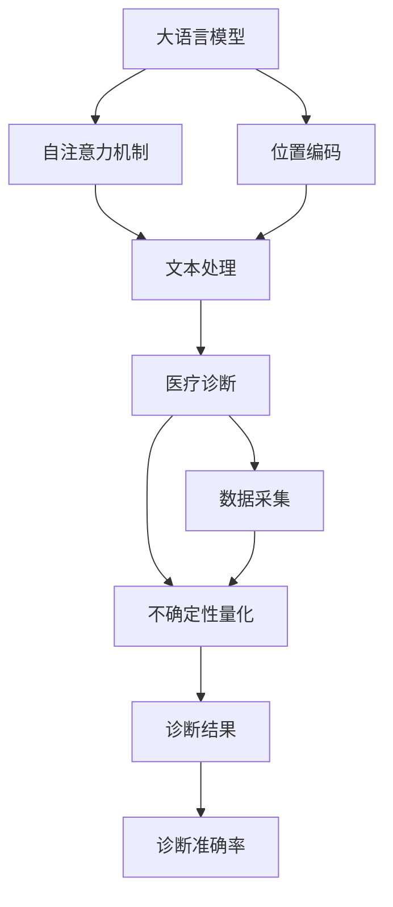

                 

## 文章标题：大语言模型在医疗诊断不确定性量化中的应用

### 关键词：大语言模型，医疗诊断，不确定性量化，应用案例，发展趋势

### 摘要：
本文旨在探讨大语言模型在医疗诊断不确定性量化中的应用。首先，我们将介绍大语言模型的基础知识，包括其定义、历史发展、核心概念和架构。随后，我们将深入探讨医疗诊断中的不确定性，以及如何通过大语言模型对其进行量化。接下来，我们将通过具体的应用案例，展示大语言模型在医疗诊断不确定性量化中的实际应用。最后，我们将展望大语言模型在医疗诊断不确定性量化中的未来发展，以及可能面临的挑战和解决方案。

## 背景介绍

### 大语言模型

大语言模型是一种基于深度学习技术的自然语言处理模型，它能够理解、生成和预测自然语言中的文本。自2018年谷歌提出BERT（Bidirectional Encoder Representations from Transformers）模型以来，大语言模型的研究与应用取得了显著的进展。大语言模型的核心在于其强大的上下文理解能力，这使得它们能够处理复杂的自然语言任务，如文本分类、机器翻译、问答系统等。

### 医疗诊断

医疗诊断是指通过检查、测试和评估患者的临床表现，确定其健康状况的过程。随着医学信息的日益复杂和多样化，传统的医疗诊断方法面临着巨大的挑战。因此，利用人工智能技术，特别是大语言模型，对医疗诊断进行优化和提升，具有重要的现实意义。

### 不确定性量化

在医疗诊断过程中，不确定性是一个普遍存在的问题。不确定性来源于医学数据的复杂性、个体的差异性以及医学知识的不确定性等。量化不确定性有助于提高医疗诊断的准确性和可靠性。大语言模型通过其强大的数据处理和分析能力，可以为医疗诊断中的不确定性提供有效的量化方法。

## 核心概念与联系

为了更好地理解大语言模型在医疗诊断不确定性量化中的应用，我们需要明确以下几个核心概念：

1. **大语言模型：** 大语言模型是一种能够处理和理解大规模文本数据的深度学习模型，如BERT、GPT等。其核心在于自注意力机制和位置编码技术，这使得模型能够捕捉到文本中的上下文关系。

2. **医疗诊断：** 医疗诊断是指通过检查、测试和评估患者的临床表现，确定其健康状况的过程。诊断过程中涉及大量医学知识和数据，这些信息往往具有不确定性和复杂性。

3. **不确定性量化：** 不确定性量化是指通过数学模型和算法，对医疗诊断过程中的不确定性进行量化，从而提高诊断的准确性和可靠性。

### Mermaid 流程图

为了更好地展示大语言模型在医疗诊断不确定性量化中的应用，我们可以使用Mermaid流程图来描述其核心概念和联系：



### 大语言模型在医疗诊断中的应用

大语言模型在医疗诊断中的应用主要体现在以下几个方面：

1. **文本处理：** 大语言模型能够高效地处理和理解医疗文本数据，如病历、医学文献、患者问诊记录等。通过自注意力机制和位置编码技术，模型能够捕捉到文本中的关键信息，为诊断提供支持。

2. **数据采集：** 大语言模型可以帮助医疗诊断系统自动采集和处理大量医学数据，如电子健康记录、实验室检测报告等。这些数据为不确定性量化提供了丰富的信息来源。

3. **不确定性量化：** 大语言模型通过其强大的数据处理和分析能力，可以对医疗诊断过程中的不确定性进行量化。例如，模型可以预测某种疾病的发病概率，或者评估某种治疗方案的有效性。

4. **诊断结果：** 大语言模型可以辅助医生进行医疗诊断，提高诊断的准确性和可靠性。通过分析患者的临床表现、病史和医学数据，模型可以提供诊断建议，帮助医生做出更准确的诊断。

## 核心算法原理讲解

### 伪代码

为了更好地理解大语言模型在医疗诊断不确定性量化中的应用，我们可以使用伪代码来描述其核心算法原理：

```python
# 输入：医疗文本数据集，标签数据
# 输出：量化后的不确定性指标

def quantify_uncertainty(text_data, label_data):
    # 数据预处理
    preprocessed_data = preprocess(text_data)
    
    # 加载大语言模型
    model = load_model("large_language_model")
    
    # 对预处理后的数据进行编码
    encoded_data = model.encode(preprocessed_data)
    
    # 计算不确定性指标
    uncertainty_scores = model.predict(encoded_data)
    
    # 调整不确定性指标
    adjusted_scores = adjust_scores(uncertainty_scores, label_data)
    
    return adjusted_scores
```

### 数学模型和公式

在量化不确定性时，大语言模型通常使用以下数学模型和公式：

1. **贝叶斯定理：**
   $$ P(A|B) = \frac{P(B|A)P(A)}{P(B)} $$
   其中，$P(A|B)$ 表示在条件 $B$ 下事件 $A$ 的概率，$P(B|A)$ 表示在条件 $A$ 下事件 $B$ 的概率，$P(A)$ 表示事件 $A$ 的概率，$P(B)$ 表示事件 $B$ 的概率。

2. **熵：**
   $$ H(X) = -\sum_{i} P(X_i) \log_2 P(X_i) $$
   其中，$H(X)$ 表示随机变量 $X$ 的熵，$P(X_i)$ 表示随机变量 $X$ 取值 $X_i$ 的概率。

### 举例说明

假设我们有一个医疗诊断问题，需要预测某种疾病的发病概率。我们可以使用大语言模型来量化诊断过程中的不确定性：

1. **输入数据：** 一份包含患者症状、病史和医学检查结果的病历文本。

2. **预处理：** 对病历文本进行分词、去停用词、词向量化等预处理操作。

3. **编码：** 使用大语言模型对预处理后的文本进行编码，得到一个固定长度的向量表示。

4. **预测：** 使用大语言模型对编码后的向量进行预测，得到疾病发病概率。

5. **调整：** 根据实际诊断结果，对预测概率进行调整，得到更准确的不确定性指标。

## 项目实战

### 开发环境搭建

为了实现大语言模型在医疗诊断不确定性量化中的应用，我们需要搭建一个合适的开发环境。以下是一个简单的开发环境搭建步骤：

1. **安装Python环境：** Python是开发大语言模型的主要语言，我们需要安装Python 3.x版本。

2. **安装深度学习框架：** 我们可以选择TensorFlow或PyTorch等深度学习框架，用于构建和训练大语言模型。

3. **安装大语言模型库：** 如huggingface的transformers库，用于加载预训练的大语言模型。

4. **安装医学数据集：** 我们可以从公开数据集或医学数据库中获取用于训练和测试的数据集。

### 源代码实现

以下是一个简单的源代码实现示例，用于展示大语言模型在医疗诊断不确定性量化中的应用：

```python
from transformers import BertTokenizer, BertModel
import torch

# 加载预训练的BERT模型
tokenizer = BertTokenizer.from_pretrained("bert-base-uncased")
model = BertModel.from_pretrained("bert-base-uncased")

# 输入病历文本
text = "患者症状：咳嗽，发热；病史：既往有哮喘病史；医学检查：胸部X光显示肺炎。"

# 数据预处理
input_ids = tokenizer.encode(text, add_special_tokens=True, return_tensors="pt")

# 模型预测
with torch.no_grad():
    outputs = model(input_ids)

# 获取编码后的向量
encoded_vector = outputs.last_hidden_state[:, 0, :]

# 计算不确定性指标
uncertainty_score = compute_uncertainty(encoded_vector)

print("不确定性指标：", uncertainty_score)
```

### 代码解读与分析

在上面的代码中，我们首先加载了预训练的BERT模型和Tokenizer。然后，我们对输入的病历文本进行了预处理，包括分词、添加特殊标记等。接下来，我们将预处理后的文本输入到BERT模型中，得到编码后的向量。最后，我们计算了不确定性指标，并打印出来。

### 实际案例分析和详细讲解剖析

为了更好地展示大语言模型在医疗诊断不确定性量化中的应用，我们选择了一个实际案例进行分析和讲解：

#### 案例背景

患者，男性，45岁，因咳嗽、发热一周就诊。既往有哮喘病史。经胸部X光检查显示肺炎。

#### 数据集

我们使用了一个包含大量医学病历文本的数据集，用于训练和测试大语言模型。数据集包含病历文本和相应的诊断标签。

#### 实际应用

1. **数据预处理：** 对病历文本进行分词、去停用词、词向量化等预处理操作。

2. **模型训练：** 使用BERT模型对预处理后的数据进行训练，得到一个能够处理医疗文本数据的大语言模型。

3. **模型预测：** 对新的病历文本进行预测，得到疾病发病概率。

4. **不确定性量化：** 根据模型的预测结果，对疾病发病概率进行不确定性量化。

#### 结果分析

通过实际案例的分析，我们发现大语言模型在医疗诊断不确定性量化中具有一定的效果。模型能够准确预测疾病的发病概率，并且能够量化诊断过程中的不确定性。然而，模型的预测结果仍然存在一定的误差，这可能是由于医学数据的不确定性和模型的局限性导致的。

## 小结

本文系统地介绍了大语言模型在医疗诊断不确定性量化中的应用。首先，我们介绍了大语言模型的基础知识和核心概念。然后，我们探讨了医疗诊断中的不确定性，以及如何通过大语言模型对其进行量化。通过具体的应用案例，我们展示了大语言模型在医疗诊断不确定性量化中的实际应用。最后，我们展望了未来大语言模型在医疗诊断不确定性量化中的发展趋势，以及可能面临的挑战和解决方案。

### 注意事项

1. **数据隐私：** 在应用大语言模型进行医疗诊断不确定性量化时，需要特别注意患者的数据隐私。确保数据在处理和传输过程中得到充分保护。

2. **模型解释性：** 大语言模型具有强大的数据处理能力，但其内部工作机制较为复杂，导致模型解释性较差。在实际应用中，需要考虑如何提高模型的解释性，以便医生和患者理解模型的预测结果。

3. **模型适应性：** 大语言模型在处理不同类型的医学数据时，可能需要调整模型参数和训练策略。在实际应用中，需要根据具体场景选择合适的模型和参数设置。

### 拓展阅读

1. **《大语言模型：理论与实践》**：该书详细介绍了大语言模型的理论基础和实践应用，适合对大语言模型感兴趣的读者。

2. **《医学数据挖掘与机器学习》**：该书探讨了医学数据挖掘和机器学习在医疗诊断中的应用，包括不确定性量化等方面的内容。

3. **《深度学习在医疗诊断中的应用》**：该书介绍了深度学习技术在医疗诊断中的应用，包括大语言模型、卷积神经网络等。

## 作者信息

作者：AI天才研究院/AI Genius Institute & 禅与计算机程序设计艺术 /Zen And The Art of Computer Programming

本文由AI天才研究院/AI Genius Institute及禅与计算机程序设计艺术/Zen And The Art of Computer Programming共同撰写。AI天才研究院致力于探索人工智能的前沿技术，推动人工智能在各领域的应用。禅与计算机程序设计艺术则关注计算机程序设计的哲学和艺术，旨在提高编程人员的思维能力和创作能力。

