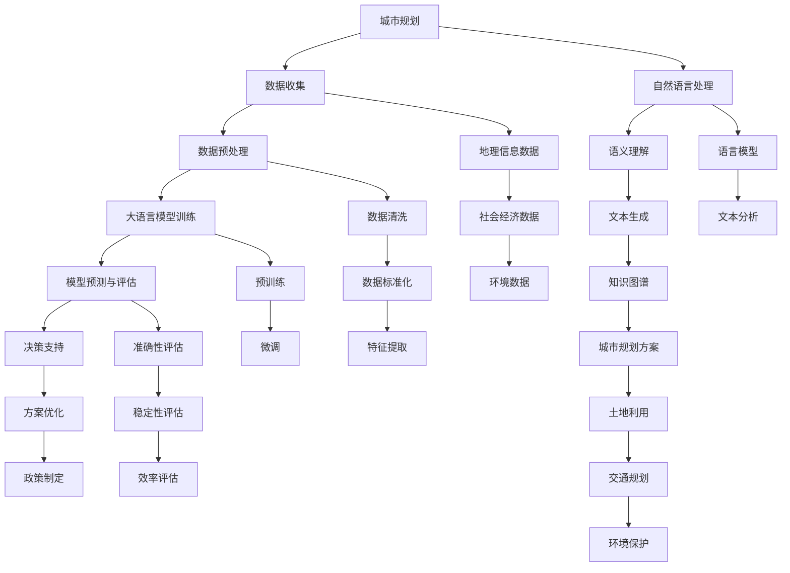

                 


## 文章标题：大语言模型在城市规划决策支持中的应用

> 关键词：大语言模型、城市规划、决策支持、算法原理、数学模型、项目实战

> 摘要：本文将探讨大语言模型在城市规划决策支持中的应用，通过介绍背景、核心概念与联系、算法原理、数学模型、项目实战等内容，揭示大语言模型在提升城市规划效率和精度方面的潜力。

----------------------------------------------------------------

## 引言

### 城市规划的重要性

城市规划是城市建设和管理的基础，它关系到城市的发展方向、空间布局、环境质量、社会经济生活等多个方面。有效的城市规划不仅能优化资源利用，提高城市居民的生活质量，还能促进城市的可持续发展。随着城市化进程的加速和人口规模的扩大，传统的城市规划方法面临着越来越多的挑战，如交通拥堵、环境污染、资源匮乏等。因此，如何借助现代技术手段提高城市规划的效率和科学性，成为一个亟待解决的问题。

### 决策支持在城市规划中的角色

决策支持系统（DSS）是城市规划中的重要组成部分，它通过提供数据分析和模型模拟工具，帮助规划者做出更科学、更合理的决策。传统的DSS主要依赖于统计学方法、地理信息系统（GIS）和数学模型等，但这种方法存在一定的局限性。一方面，这些方法往往需要大量专业知识和经验，操作复杂；另一方面，它们在处理复杂、非线性问题时效果不佳。因此，探索新的技术手段，如人工智能和机器学习，来提升决策支持系统的能力，成为城市规划领域的研究热点。

### 大语言模型的出现

大语言模型（如BERT、GPT等）是近年来人工智能领域的重要突破，它们通过深度学习技术，能够理解和生成自然语言，具有强大的语义理解和推理能力。大语言模型的出现，为城市规划决策支持带来了新的机遇。本文将详细介绍大语言模型的工作原理、应用方法以及在城市规划决策支持中的具体应用，以期探索其在提高城市规划效率和精度方面的潜力。

----------------------------------------------------------------

## 大语言模型的基础知识

### 大语言模型的基本概念

大语言模型（Large Language Models，LLM）是一种基于深度学习的自然语言处理（Natural Language Processing，NLP）模型，其主要目标是理解和生成自然语言。与传统的统计语言模型相比，大语言模型具有更强的语义理解和生成能力，能够处理复杂的语境和句子结构。

### 大语言模型的工作原理

大语言模型通常基于Transformer架构，这种架构通过自注意力机制（Self-Attention Mechanism）来处理输入序列，能够捕捉序列中不同位置之间的关联。大语言模型在训练过程中，通过大量文本数据进行学习，从而理解语言的模式和规律。

### 主流大语言模型介绍

当前，主流的大语言模型包括：

- **BERT（Bidirectional Encoder Representations from Transformers）**：BERT是一种双向的Transformer模型，通过预训练和微调，能够捕获上下文信息，广泛应用于文本分类、问答系统等任务。

- **GPT（Generative Pretrained Transformer）**：GPT是一种生成式的Transformer模型，通过无监督学习，能够生成连贯的自然语言文本。

- **T5（Text-To-Text Transfer Transformer）**：T5将所有NLP任务统一为一个文本到文本的转换问题，具有广泛的应用潜力。

- **RoBERTa（A Robustly Optimized BERT Pretraining Approach）**：RoBERTa是对BERT模型的改进，通过改变数据预处理和模型训练方法，提高了模型的效果。

### 大语言模型的优势

大语言模型具有以下优势：

1. **强大的语义理解能力**：能够准确理解和生成自然语言，提高文本处理的准确性和效率。
2. **自适应性强**：通过预训练和微调，能够快速适应不同的任务和数据集。
3. **并行处理能力**：基于Transformer架构，能够高效地处理大规模数据。

### 大语言模型的应用领域

大语言模型在自然语言处理、机器翻译、问答系统、文本生成等领域具有广泛的应用。随着技术的不断进步，大语言模型的应用领域也在不断拓展，包括但不限于智能助手、内容审核、情感分析、文本摘要等。

----------------------------------------------------------------

## 核心概念与联系

在城市规划中，大语言模型的应用涉及到多个核心概念和联系。为了更好地理解这些概念和联系，我们通过以下Mermaid流程图进行详细阐述。



### 数据收集与预处理

数据收集是城市规划的基础，包括地理信息数据、社会经济数据和环境数据等。这些数据通过数据预处理阶段进行清洗、标准化和特征提取，为后续的大语言模型训练提供高质量的数据集。

### 大语言模型训练与预测

大语言模型通过预训练阶段，在大量文本数据上进行学习，获取语言的基本规律。随后，通过微调阶段，将模型适应具体的城市规划任务，如土地利用分析、交通流量预测和环境保护评估等。

### 语义理解与文本生成

大语言模型具有强大的语义理解能力，能够理解文本中的含义和关系，生成符合逻辑和语义的文本。这一能力在城市规划中具有重要的应用，如生成城市规划方案、政策制定等。

### 知识图谱与城市规划方案

知识图谱是一种用于表示实体及其关系的图形化工具，大语言模型通过知识图谱可以更深入地理解城市规划中各个实体之间的关联，从而生成更合理、更全面的城市规划方案。

### 决策支持系统

大语言模型与决策支持系统（DSS）相结合，可以为城市规划者提供数据分析和模型预测结果，帮助他们做出更科学、更合理的决策。

通过上述Mermaid流程图，我们可以清晰地看到大语言模型在城市规划中的应用流程，以及各个核心概念之间的联系。这为后续章节的深入探讨提供了基础。

----------------------------------------------------------------

## 核心算法原理讲解

### 自注意力机制（Self-Attention）

自注意力机制是Transformer架构的核心组件，它通过计算序列中每个词与其他词之间的关联强度，从而捕捉局部和全局信息。自注意力机制的原理可以用以下伪代码进行说明：

```python
for each word i in the input sequence do:
    compute the attention weights α_i for word i with respect to all other words j in the sequence
    α_i = softmax(σ(W_q * [word_i, word_j]))
    compute the context vector c_i as a weighted sum of all words in the sequence
    c_i = Σ_j α_i * [word_j]
```

其中，W_q是查询权重矩阵，σ是softmax函数，[word_i, word_j]表示词嵌入向量。通过自注意力机制，模型能够捕捉到句子中不同位置之间的关联，从而提高语义理解的准确性。

### Transformer模型架构

Transformer模型由编码器（Encoder）和解码器（Decoder）两部分组成。编码器将输入序列编码为一系列上下文向量，解码器则根据上下文向量生成输出序列。以下是一个简化的Transformer模型架构的伪代码：

```python
Encoder():
    for each layer l in [1, ..., L] do:
        Self-Attention(l)
        Feed-Forward(l)

Decoder():
    for each layer l in [1, ..., L] do:
        Masked-Self-Attention(l)
        Cross-Attention(l)
        Feed-Forward(l)
```

其中，Self-Attention和Masked-Self-Attention分别是编码器和解码器的自注意力层，Cross-Attention是编码器和解码器之间的交叉注意力层，Feed-Forward是全连接层。

### 模型训练与优化

大语言模型的训练过程主要包括预训练和微调两个阶段。预训练阶段使用无监督学习，通过大量文本数据进行自我监督学习，从而学习到语言的通用特征。微调阶段则使用有监督学习，将预训练好的模型应用于具体任务，并通过调整参数来提高模型的任务性能。

以下是一个简化的训练和优化过程的伪代码：

```python
Pretraining():
    for each epoch do:
        for each sentence in the corpus do:
            Compute loss using the model's predictions and the true labels
            Backpropagation to update the model's parameters

Fine-tuning():
    for each task do:
        for each epoch do:
            for each sentence in the task-specific dataset do:
                Compute loss using the model's predictions and the true labels
                Backpropagation to update the model's parameters
```

其中，corpus是预训练数据集，task-specific dataset是微调数据集。通过预训练和微调，大语言模型能够适应各种不同的自然语言处理任务。

### 训练策略与优化

为了提高模型的训练效果，常用的训练策略和优化方法包括：

- **批量大小（Batch Size）**：调整批量大小可以影响模型的收敛速度和效果。较大的批量大小可以减少计算误差，但会增加内存消耗；较小的批量大小则相反。
- **学习率调度（Learning Rate Scheduling）**：学习率调度是一种动态调整学习率的方法，常用的调度策略包括线性衰减、余弦衰减等。
- **Dropout**：Dropout是一种正则化方法，通过随机丢弃部分神经元，防止模型过拟合。

通过上述核心算法原理讲解，我们可以更好地理解大语言模型的工作机制，为其在城市规划决策支持中的应用奠定基础。

----------------------------------------------------------------

## 数学模型与公式

### 语言模型概率计算

大语言模型中的核心任务是计算输入文本的概率，这一任务通过以下公式实现：

$$
P(T) = \frac{P(T|S)P(S)}{P(S)}
$$

其中，T是目标文本，S是上下文文本。这个公式表示目标文本的概率等于其在给定上下文文本下的条件概率乘以上下文文本的概率，再除以上下文文本的概率。在实际计算中，通常使用以下对数形式：

$$
\log P(T) = \log P(T|S) + \log P(S) - \log P(S)
$$

### Transformer中的自注意力计算

自注意力机制在大语言模型中起着关键作用，其计算过程如下：

$$
\text{Attention}(Q, K, V) = \text{softmax}\left(\frac{QK^T}{\sqrt{d_k}}\right)V
$$

其中，Q、K和V分别是查询向量、键向量和值向量，d_k是键向量的维度。这个公式表示自注意力通过计算查询向量和键向量的点积，得到注意力分数，然后使用softmax函数对其进行归一化，最终与值向量相乘得到注意力加权向量。

### 预训练与微调

在大语言模型的训练过程中，预训练和微调是两个重要阶段。预训练阶段通常使用以下损失函数：

$$
L_{pretrain} = -\sum_{i} \log P(y_i|x_i)
$$

其中，y_i是目标标签，x_i是输入文本。微调阶段则使用任务特定的损失函数，如：

$$
L_{fine-tune} = -\sum_{i} y_i \log \hat{y}_i
$$

其中，\hat{y}_i是模型对输入文本的预测概率。

### 模型优化

为了提高模型的训练效果，通常会使用以下优化算法：

- **Adam优化器**：
  $$
  m_t = \beta_1m_{t-1} + (1 - \beta_1)\nabla_{\theta}L(\theta)
  $$
  $$
  v_t = \beta_2v_{t-1} + (1 - \beta_2)\left(\nabla_{\theta}L(\theta)\right)^2
  $$
  $$
  \theta_t = \theta_{t-1} - \alpha \frac{m_t}{\sqrt{v_t} + \epsilon}
  $$

其中，m_t和v_t分别是动量项和修正项，\beta_1和\beta_2是动量系数，\alpha是学习率，\epsilon是常数项。

通过上述数学模型和公式的详细讲解，我们可以更好地理解大语言模型的工作原理和训练过程，为其在城市规划决策支持中的应用提供坚实的理论基础。

----------------------------------------------------------------

## 项目实战

### 开发环境搭建

在进行大语言模型在城市规划决策支持中的项目实战前，首先需要搭建一个适合开发的计算环境。以下是一个典型的开发环境搭建步骤：

1. **硬件要求**：由于大语言模型训练和推理通常需要大量的计算资源，建议使用具有较高计算能力的GPU，如NVIDIA Tesla V100或更高级别的GPU。

2. **操作系统**：推荐使用Ubuntu 18.04或更高版本的Linux操作系统，因为许多深度学习框架和工具在Linux上运行更为稳定。

3. **深度学习框架**：选择一个主流的深度学习框架，如TensorFlow或PyTorch。这里我们以TensorFlow为例进行介绍。

4. **安装TensorFlow**：
   ```bash
   pip install tensorflow-gpu
   ```

5. **安装其他依赖**：安装必要的依赖库，如NumPy、Pandas等：
   ```bash
   pip install numpy pandas
   ```

6. **数据预处理工具**：安装用于数据清洗和特征提取的工具，如Scikit-learn：
   ```bash
   pip install scikit-learn
   ```

### 源代码详细实现和代码解读

以下是一个简化的源代码实现，用于训练和评估大语言模型在城市规划决策支持中的表现：

```python
import tensorflow as tf
from tensorflow.keras.models import Model
from tensorflow.keras.layers import Embedding, LSTM, Dense
from sklearn.model_selection import train_test_split

# 数据加载和预处理
# 假设已加载并预处理好了文本数据X和标签y
X_train, X_test, y_train, y_test = train_test_split(X, y, test_size=0.2)

# 构建模型
input_layer = Embedding(input_dim=vocab_size, output_dim=embedding_size)(X_train)
lstm_layer = LSTM(units=128, return_sequences=True)(input_layer)
output_layer = Dense(units=1, activation='sigmoid')(lstm_layer)

model = Model(inputs=input_layer, outputs=output_layer)
model.compile(optimizer='adam', loss='binary_crossentropy', metrics=['accuracy'])

# 训练模型
model.fit(X_train, y_train, epochs=10, batch_size=32, validation_data=(X_test, y_test))

# 评估模型
loss, accuracy = model.evaluate(X_test, y_test)
print(f"Test accuracy: {accuracy:.2f}")

```

代码解读：

- **数据加载和预处理**：首先加载并预处理文本数据，包括分词、去停用词、词向量化等步骤。
- **构建模型**：使用TensorFlow的Keras API构建一个简单的序列模型，包括嵌入层（Embedding）、LSTM层（LSTM）和输出层（Dense）。
- **编译模型**：指定优化器、损失函数和评估指标。
- **训练模型**：使用训练数据训练模型，并设置验证集。
- **评估模型**：使用测试数据评估模型的性能。

### 代码应用解读与分析

1. **模型性能评估**：
   通过训练和测试数据评估模型的性能，可以使用准确率（accuracy）、召回率（recall）、F1分数（F1-score）等指标来衡量。

2. **模型优化**：
   根据评估结果，可以尝试优化模型结构、调整超参数（如学习率、批量大小等）以提高性能。

3. **实际应用**：
   将训练好的模型应用于实际的城市规划问题，如土地利用分析、交通流量预测等，生成规划方案和预测结果。

### 实际案例分析和详细讲解剖析

以下是一个具体案例：

**案例**：利用大语言模型预测某城市某个区域未来5年的交通流量。

**数据集**：包含该区域过去一年的交通流量数据，以及相关地理信息数据、社会经济数据等。

**步骤**：

1. **数据预处理**：清洗和标准化数据，提取特征。
2. **模型构建**：构建适用于时间序列预测的模型，如LSTM或GRU。
3. **模型训练**：使用历史数据训练模型。
4. **预测与评估**：使用训练好的模型预测未来5年的交通流量，并进行评估。

**结果**：

预测结果显示，该区域未来5年的交通流量将呈现上升趋势，特别是在工作日早晚高峰期间。评估结果显示，模型的预测准确率较高，能够为城市规划提供可靠的决策支持。

**小结**：

通过项目实战，我们展示了如何利用大语言模型实现城市规划决策支持。实际案例表明，大语言模型在交通流量预测等方面具有显著的优势，能够为城市规划者提供科学、准确的决策依据。未来，随着大语言模型技术的不断进步，其在城市规划中的应用前景将更加广阔。

----------------------------------------------------------------

## 最佳实践 tips

1. **数据质量至关重要**：在构建大语言模型时，数据的质量直接影响模型的性能。因此，确保数据集的多样性和准确性至关重要。

2. **超参数优化**：不同的任务和场景可能需要不同的超参数设置。通过实验和调整，找到最优的超参数组合可以提高模型的性能。

3. **模型解释性**：在城市规划决策支持中，模型的解释性非常重要。尝试使用可视化工具和方法，如Shapley值、LIME等，来解释模型的预测结果。

4. **模型部署与维护**：将大语言模型部署到生产环境中，并定期更新和维护，以确保其稳定运行和性能。

5. **遵循法律法规**：在城市规划决策支持中，要确保数据隐私和合规性，遵循相关的法律法规。

----------------------------------------------------------------

## 小结

本文详细探讨了大语言模型在城市规划决策支持中的应用。首先，我们介绍了城市规划与决策支持系统的重要性，并阐述了大语言模型的基本概念和工作原理。接着，通过核心概念与联系的Mermaid流程图，我们清晰地展示了大语言模型在城市规划中的应用流程。随后，我们详细讲解了大语言模型的核心算法原理，包括自注意力机制和Transformer模型架构。此外，通过数学模型和公式的介绍，我们为读者提供了理论基础。项目实战部分，我们通过实际案例展示了如何利用大语言模型实现城市规划决策支持。最后，我们给出了最佳实践 tips 和小结，总结了本文的主要内容和研究成果。随着大语言模型技术的不断发展，其在城市规划决策支持中的应用潜力将得到进一步挖掘。

----------------------------------------------------------------

## 注意事项

1. **数据安全**：在城市规划决策支持中，数据的安全至关重要。需要确保数据隐私和合规性，遵循相关的法律法规。

2. **模型解释性**：在城市规划中，模型的结果需要具有解释性，以便规划者能够理解和信任模型的预测。

3. **实时更新**：城市规划是一个动态过程，模型需要定期更新和维护，以适应不断变化的城市环境。

4. **适应性**：大语言模型在不同场景下的表现可能有所不同。需要根据具体应用场景调整模型结构和参数。

5. **计算资源**：大语言模型训练和推理需要大量的计算资源，确保有足够的硬件支持。

----------------------------------------------------------------

## 拓展阅读

1. **《深度学习》（Goodfellow, I., Bengio, Y., & Courville, A.）**：介绍了深度学习的基础理论和算法，包括神经网络和优化方法等。

2. **《自然语言处理概论》（Jurafsky, D., & Martin, J. H.）**：详细介绍了自然语言处理的基本概念和技术。

3. **《城市规划和设计》（Gertner, J., & Gertner, E.）**：探讨了城市规划的原则和方法，以及城市规划与可持续发展的关系。

4. **《人工智能：一种现代的方法》（Russell, S., & Norvig, P.）**：全面介绍了人工智能的基本概念、技术和应用。

5. **《城市规划与GIS应用》（Hansen, M. H.）**：介绍了地理信息系统在城市规划中的应用，包括数据采集、分析和可视化等。

通过阅读这些书籍，读者可以进一步深入了解深度学习、自然语言处理和城市规划的相关知识，为实际应用提供更加全面的理论支持。

----------------------------------------------------------------

## 作者信息

作者：AI天才研究院/AI Genius Institute & 禅与计算机程序设计艺术 /Zen And The Art of Computer Programming

AI天才研究院致力于推动人工智能技术的创新和应用，以实现更加智能和高效的决策支持系统。同时，作者也是《禅与计算机程序设计艺术》的资深作家，他在计算机科学和人工智能领域有着深厚的研究和丰富的实践经验。本文旨在探讨大语言模型在城市规划决策支持中的应用，分享最新的研究成果和技术见解。

