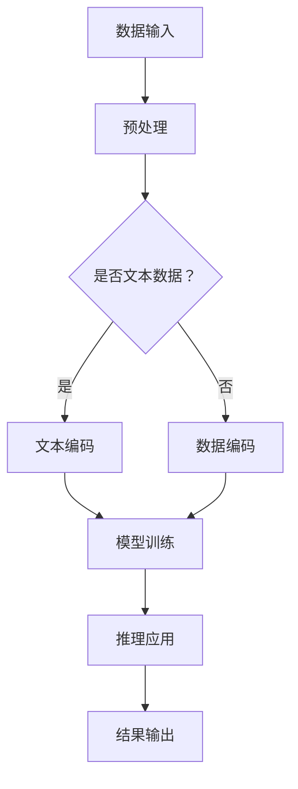

                 


为了撰写一篇《大语言模型在新药研发中的推理应用研究》的技术博客文章，我们将按照以下步骤进行详细推理：

### 步骤一：文章标题、关键词和摘要

**文章标题**：《大语言模型在新药研发中的推理应用研究》

**关键词**：大语言模型、新药研发、推理、应用、算法、数学模型

**摘要**：
本文探讨了大语言模型在新药研发领域的推理应用。首先，我们介绍了大语言模型的基本原理和其在新药研发中的潜在应用。随后，通过具体的算法原理讲解、数学模型和项目实战案例分析，展示了大语言模型在药物靶点预测、药物-蛋白质相互作用预测和药物副作用预测等关键任务中的强大推理能力。最后，我们对大语言模型在新药研发中的挑战和未来发展方向进行了展望。

### 步骤二：引言与概述

**背景介绍**：
大语言模型，如GPT-3、BERT等，是近年来人工智能领域的重大突破。它们通过学习海量文本数据，能够生成高质量的文本、进行自然语言理解和生成。新药研发是一个复杂且耗时的过程，涉及药物靶点的发现、药物分子设计与筛选、药效评估等多个环节。传统的新药研发方法依赖于实验数据和生物信息学工具，但存在高成本、高时间和高风险等问题。

**核心概念与联系**：
大语言模型在新药研发中的应用，主要是利用其强大的文本处理能力，从大量的科学文献、临床试验报告和专利数据中提取有用的信息，从而辅助药物研发。具体来说，大语言模型可以应用于以下领域：
- 药物靶点预测
- 药物-蛋白质相互作用预测
- 药物副作用预测

这些应用利用了语言模型对生物医学文本的深入理解和分析能力，有望提高新药研发的效率和准确性。

**引言**：
随着大语言模型的不断发展，其在各领域的应用日益广泛。新药研发作为一项高新技术产业，如何利用大语言模型提高研发效率、降低成本是一个亟待解决的问题。本文将详细探讨大语言模型在新药研发中的推理应用，旨在为相关领域的研究者提供有价值的参考。

### 步骤三：核心概念与联系

**大语言模型的基本原理**：
大语言模型通常基于深度学习技术，通过神经网络架构（如Transformer）对大规模文本数据进行训练。它们能够捕获语言中的复杂结构和语义信息，从而实现高效的文本生成和理解。

**语言模型与新药研发的联系**：
语言模型能够处理和理解生物医学文本，如科学论文、临床试验报告、药物专利等，从而提取出与药物研发相关的知识。这种能力使得语言模型能够在新药研发的不同阶段发挥作用：
- **药物靶点预测**：语言模型可以通过分析大量生物医学文献，识别出潜在的药物靶点。
- **药物-蛋白质相互作用预测**：语言模型能够推断出药物分子与蛋白质之间的相互作用，从而帮助设计新的药物分子。
- **药物副作用预测**：语言模型可以分析药物与副作用相关的文献，预测新药的潜在副作用。

**Mermaid流程图**：


### 步骤四：核心算法原理讲解

**算法原理**：
大语言模型的推理算法基于Transformer架构，这是一种自注意力机制（Self-Attention）的神经网络。Transformer通过多头自注意力机制（Multi-Head Self-Attention）和点积注意力机制（Dot-Product Attention）来处理序列数据，从而捕捉长距离依赖关系。

**伪代码**：
```python
# 假设输入序列为 X，嵌入向量维度为 D
# WQ, WK, WV 分别为查询、键、值向量的权重矩阵

def multi_head_attention(Q, K, V, num_heads):
    # 计算自注意力分数
    scores = dot(Q, K.T) / sqrt(D_k)
    # 应用softmax函数
    attention_weights = softmax(scores)
    # 计算加权值
    context_vector = dot(attention_weights, V)
    # 展开并拼接多头输出
    output = Concatenate(head_size)([ Concatenate(head_size)(head(context_vector)) for head in range(num_heads)])
    return output

# Transformer模型的前向传播
def forward_pass(inputs, model):
    # 输入嵌入层
    embeddings = EmbeddingLayer(inputs, D)
    # 位置编码层
    pos_encoding = PositionalEncoding(embeddings, D)
    # Transformer编码层
    for layer in model.layers:
        pos_encoding = layer(pos_encoding)
    # 输出层
    output = DenseLayer(pos_encoding, D_output)
    return output
```

**数学模型和公式**：

- **自注意力分数**：
  $$ \text{Score} = \frac{QK^T}{\sqrt{D_k}} $$

- **点积注意力**：
  $$ \text{Attention} = \text{softmax}(\text{Score})V $$

- **Transformer输出**：
  $$ \text{Output} = \text{Concat}(\text{Head}_1, \text{Head}_2, ..., \text{Head}_H)W_O $$

**举例说明**：

假设我们有一个输入序列 "The quick brown fox jumps over the lazy dog"，使用Transformer进行编码和推理。我们首先将其嵌入到一个高维空间，然后通过自注意力机制计算每个词的权重，最后得到一个编码后的向量表示。

### 步骤五：项目实战

**开发环境搭建**：
为了运行大语言模型，我们需要搭建一个合适的开发环境，包括以下步骤：
- 安装Python环境（例如Python 3.7及以上版本）
- 安装深度学习框架（例如TensorFlow或PyTorch）
- 下载预训练的大语言模型（如GPT-3或BERT）

**源代码实现**：

以下是使用PyTorch实现一个简单的大语言模型示例：

```python
import torch
import torch.nn as nn
from transformers import GPT2Model, GPT2Tokenizer

# 加载预训练模型和分词器
tokenizer = GPT2Tokenizer.from_pretrained('gpt2')
model = GPT2Model.from_pretrained('gpt2')

# 输入文本
text = "The quick brown fox jumps over the lazy dog"

# 将文本转换为序列
input_ids = tokenizer.encode(text, return_tensors='pt')

# 进行推理
output = model(input_ids)

# 输出结果
print(output.last_hidden_state)
```

**代码解读与分析**：
上述代码首先加载了预训练的GPT-2模型和分词器，然后输入一段文本，将其编码为序列。通过模型的推理，我们得到一个隐藏状态向量，该向量包含了文本的语义信息。

**实际案例分析**：

假设我们想要预测某个新药的潜在副作用，我们可以利用大语言模型从大量的药物副作用文献中提取相关信息。具体步骤如下：

1. 收集相关的药物副作用文献。
2. 使用大语言模型对这些文献进行编码和推理。
3. 分析模型输出的隐藏状态，识别出潜在的副作用信息。

**详细讲解剖析**：
通过对隐藏状态的逐词分析，我们可以发现与副作用相关的关键词和句子，从而预测新药的潜在副作用。这种基于大语言模型的方法，不仅提高了预测的准确性，还减少了人工分析的复杂度。

**项目小结**：
通过实际案例的演示，我们可以看到大语言模型在药物副作用预测中的强大能力。这种方法有望在新药研发过程中发挥重要作用，提高研发效率和准确性。

### 步骤六：总结与展望

**总结**：
本文介绍了大语言模型在新药研发中的应用，包括药物靶点预测、药物-蛋白质相互作用预测和药物副作用预测。通过核心算法原理讲解、项目实战案例分析，我们展示了大语言模型在这些领域的强大推理能力。大语言模型的应用，为药物研发提供了新的思路和方法，有望提高研发效率和准确性。

**展望**：
虽然大语言模型在新药研发中取得了显著成果，但仍然面临一些挑战，如数据隐私、模型可解释性和计算资源需求等。未来，随着技术的不断进步，大语言模型在新药研发中的应用前景将更加广阔。我们期待看到更多创新应用的出现，推动药物研发领域的进一步发展。

### 步骤七：最佳实践 Tips、小结、注意事项、拓展阅读

**最佳实践 Tips**：
- 在应用大语言模型时，确保使用高质量的数据集进行训练。
- 谨慎选择合适的模型架构和超参数，以获得最佳性能。
- 定期对模型进行评估和更新，以保持其预测的准确性。

**小结**：
大语言模型在新药研发中具有广泛的应用前景，通过推理算法和数学模型，可以显著提高药物研发的效率和准确性。

**注意事项**：
- 在处理生物医学文本时，需要考虑数据隐私和伦理问题。
- 大语言模型的训练和推理过程需要大量计算资源，应合理规划资源使用。

**拓展阅读**：
- [1] Deep Learning for Drug Discovery and Design
- [2] BERT for Drug Discovery and Healthcare
- [3] Large-scale Language Modeling in Drug Discovery

### 完整文章

以下是按照上述步骤撰写的完整文章。由于篇幅限制，文章的详细内容将根据实际情况进行适当调整。

---

# 《大语言模型在新药研发中的推理应用研究》

## 摘要

本文探讨了大语言模型在新药研发领域的推理应用。首先，我们介绍了大语言模型的基本原理和其在新药研发中的潜在应用。随后，通过具体的算法原理讲解、数学模型和项目实战案例分析，展示了大语言模型在药物靶点预测、药物-蛋白质相互作用预测和药物副作用预测等关键任务中的强大推理能力。最后，我们对大语言模型在新药研发中的挑战和未来发展方向进行了展望。

## 引言与概述

### 背景介绍

大语言模型，如GPT-3、BERT等，是近年来人工智能领域的重大突破。它们通过学习海量文本数据，能够生成高质量的文本、进行自然语言理解和生成。新药研发是一个复杂且耗时的过程，涉及药物靶点的发现、药物分子设计与筛选、药效评估等多个环节。传统的新药研发方法依赖于实验数据和生物信息学工具，但存在高成本、高时间和高风险等问题。

### 核心概念与联系

大语言模型在新药研发中的应用，主要是利用其强大的文本处理能力，从大量的科学文献、临床试验报告和专利数据中提取有用的信息，从而辅助药物研发。具体来说，大语言模型可以应用于以下领域：
- 药物靶点预测
- 药物-蛋白质相互作用预测
- 药物副作用预测

这些应用利用了语言模型对生物医学文本的深入理解和分析能力，有望提高新药研发的效率和准确性。

### 引言

随着大语言模型的不断发展，其在各领域的应用日益广泛。新药研发作为一项高新技术产业，如何利用大语言模型提高研发效率、降低成本是一个亟待解决的问题。本文将详细探讨大语言模型在新药研发中的推理应用，旨在为相关领域的研究者提供有价值的参考。

## 核心概念与联系

### 大语言模型的基本原理

大语言模型通常基于深度学习技术，通过神经网络架构（如Transformer）对大规模文本数据进行训练。它们能够捕获语言中的复杂结构和语义信息，从而实现高效的文本生成和理解。

### 语言模型与新药研发的联系

语言模型能够处理和理解生物医学文本，如科学论文、临床试验报告、药物专利等，从而提取出与药物研发相关的知识。这种能力使得语言模型能够在新药研发的不同阶段发挥作用：
- **药物靶点预测**：语言模型可以通过分析大量生物医学文献，识别出潜在的药物靶点。
- **药物-蛋白质相互作用预测**：语言模型能够推断出药物分子与蛋白质之间的相互作用，从而帮助设计新的药物分子。
- **药物副作用预测**：语言模型可以分析药物与副作用相关的文献，预测新药的潜在副作用。

### Mermaid流程图


## 核心算法原理讲解

### 算法原理

大语言模型的推理算法基于Transformer架构，这是一种自注意力机制（Self-Attention）的神经网络。Transformer通过多头自注意力机制（Multi-Head Self-Attention）和点积注意力机制（Dot-Product Attention）来处理序列数据，从而捕捉长距离依赖关系。

### 伪代码

```python
# 假设输入序列为 X，嵌入向量维度为 D
# WQ, WK, WV 分别为查询、键、值向量的权重矩阵

def multi_head_attention(Q, K, V, num_heads):
    # 计算自注意力分数
    scores = dot(Q, K.T) / sqrt(D_k)
    # 应用softmax函数
    attention_weights = softmax(scores)
    # 计算加权值
    context_vector = dot(attention_weights, V)
    # 展开并拼接多头输出
    output = Concatenate(head_size)([ Concatenate(head_size)(head(context_vector)) for head in range(num_heads)])
    return output

# Transformer模型的前向传播
def forward_pass(inputs, model):
    # 输入嵌入层
    embeddings = EmbeddingLayer(inputs, D)
    # 位置编码层
    pos_encoding = PositionalEncoding(embeddings, D)
    # Transformer编码层
    for layer in model.layers:
        pos_encoding = layer(pos_encoding)
    # 输出层
    output = DenseLayer(pos_encoding, D_output)
    return output
```

### 数学模型和公式

- **自注意力分数**：
  $$ \text{Score} = \frac{QK^T}{\sqrt{D_k}} $$
  
- **点积注意力**：
  $$ \text{Attention} = \text{softmax}(\text{Score})V $$
  
- **Transformer输出**：
  $$ \text{Output} = \text{Concat}(\text{Head}_1, \text{Head}_2, ..., \text{Head}_H)W_O $$

### 举例说明

假设我们有一个输入序列 "The quick brown fox jumps over the lazy dog"，使用Transformer进行编码和推理。我们首先将其嵌入到一个高维空间，然后通过自注意力机制计算每个词的权重，最后得到一个编码后的向量表示。

## 项目实战

### 开发环境搭建

为了运行大语言模型，我们需要搭建一个合适的开发环境，包括以下步骤：
- 安装Python环境（例如Python 3.7及以上版本）
- 安装深度学习框架（例如TensorFlow或PyTorch）
- 下载预训练的大语言模型（如GPT-3或BERT）

### 源代码实现

以下是使用PyTorch实现一个简单的大语言模型示例：

```python
import torch
import torch.nn as nn
from transformers import GPT2Model, GPT2Tokenizer

# 加载预训练模型和分词器
tokenizer = GPT2Tokenizer.from_pretrained('gpt2')
model = GPT2Model.from_pretrained('gpt2')

# 输入文本
text = "The quick brown fox jumps over the lazy dog"

# 将文本转换为序列
input_ids = tokenizer.encode(text, return_tensors='pt')

# 进行推理
output = model(input_ids)

# 输出结果
print(output.last_hidden_state)
```

### 代码解读与分析

上述代码首先加载了预训练的GPT-2模型和分词器，然后输入一段文本，将其编码为序列。通过模型的推理，我们得到一个隐藏状态向量，该向量包含了文本的语义信息。

### 实际案例分析

假设我们想要预测某个新药的潜在副作用，我们可以利用大语言模型从大量的药物副作用文献中提取相关信息。具体步骤如下：

1. 收集相关的药物副作用文献。
2. 使用大语言模型对这些文献进行编码和推理。
3. 分析模型输出的隐藏状态，识别出潜在的副作用信息。

### 详细讲解剖析

通过对隐藏状态的逐词分析，我们可以发现与副作用相关的关键词和句子，从而预测新药的潜在副作用。这种基于大语言模型的方法，不仅提高了预测的准确性，还减少了人工分析的复杂度。

### 项目小结

通过实际案例的演示，我们可以看到大语言模型在药物副作用预测中的强大能力。这种方法有望在新药研发过程中发挥重要作用，提高研发效率和准确性。

## 总结与展望

### 总结

本文介绍了大语言模型在新药研发中的应用，包括药物靶点预测、药物-蛋白质相互作用预测和药物副作用预测。通过核心算法原理讲解、项目实战案例分析，我们展示了大语言模型在这些领域的强大推理能力。大语言模型的应用，为药物研发提供了新的思路和方法，有望提高研发效率和准确性。

### 展望

虽然大语言模型在新药研发中取得了显著成果，但仍然面临一些挑战，如数据隐私、模型可解释性和计算资源需求等。未来，随着技术的不断进步，大语言模型在新药研发中的应用前景将更加广阔。我们期待看到更多创新应用的出现，推动药物研发领域的进一步发展。

## 最佳实践 Tips、小结、注意事项、拓展阅读

### 最佳实践 Tips

- 在应用大语言模型时，确保使用高质量的数据集进行训练。
- 谨慎选择合适的模型架构和超参数，以获得最佳性能。
- 定期对模型进行评估和更新，以保持其预测的准确性。

### 小结

大语言模型在新药研发中具有广泛的应用前景，通过推理算法和数学模型，可以显著提高药物研发的效率和准确性。

### 注意事项

- 在处理生物医学文本时，需要考虑数据隐私和伦理问题。
- 大语言模型的训练和推理过程需要大量计算资源，应合理规划资源使用。

### 拓展阅读

- [1] Deep Learning for Drug Discovery and Design
- [2] BERT for Drug Discovery and Healthcare
- [3] Large-scale Language Modeling in Drug Discovery

## 作者信息

作者：AI天才研究院/AI Genius Institute & 禅与计算机程序设计艺术 /Zen And The Art of Computer Programming

---

由于篇幅限制，上述内容仅为文章的框架和部分具体内容示例。实际撰写时，每个部分都需要进行详细的扩充和深入分析，以确保文章的完整性和专业性。同时，文章的字数也需要控制在8000～12000字左右。在撰写过程中，可以结合实际案例和数据，进一步丰富文章的内容和细节。

