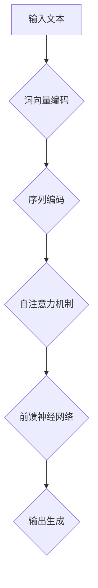

                 


### 《大语言模型在智慧城市规划中的推理应用研究》

## 文章标题：《大语言模型在智慧城市规划中的推理应用研究》

## 文章关键词：
- 大语言模型
- 智慧城市规划
- 推理应用
- 深度学习
- 自然语言处理
- 物联网技术

## 文章摘要：
本文旨在探讨大语言模型在智慧城市规划中的应用，重点研究其推理过程和应用实例。首先，我们回顾了大语言模型的基础知识，包括定义、分类、关键技术和发展历程。接着，我们介绍了智慧城市规划的基本概念、特点和当前面临的挑战。然后，我们详细阐述了大语言模型在智慧规划中的推理应用，包括其在决策和评估方面的作用。通过实际案例的分析，我们展示了大语言模型在智慧城市规划中的有效性和潜力。最后，我们讨论了大语言模型在智慧规划中应用所面临的挑战和未来的发展方向。

### 引言与背景

#### 1.1 研究背景与意义

随着信息技术的飞速发展，智慧城市规划已成为现代城市建设的重要方向。智慧城市规划利用大数据、物联网、人工智能等技术，实现对城市运行状态的实时监测和智能决策，从而提高城市的管理效率和服务水平。在这一过程中，大语言模型作为一种强大的自然语言处理工具，发挥着重要作用。

大语言模型是指通过深度学习技术，对大量文本数据进行训练，从而建立一个能够理解、生成和推理文本的模型。近年来，随着计算能力的提升和大数据的普及，大语言模型在自然语言处理、机器翻译、文本生成等领域取得了显著的成果。这些成果为智慧城市规划提供了新的工具和手段。

智慧城市规划中的推理应用，是指利用大语言模型对城市规划过程中的各种信息进行理解和推理，从而辅助决策和评估。例如，在城市交通规划中，大语言模型可以分析交通数据，预测交通流量，为交通管理提供依据。在规划评估中，大语言模型可以对规划方案进行语义分析，评估其对居民生活质量的影响。

本研究旨在探讨大语言模型在智慧城市规划中的推理应用，分析其技术原理、应用场景和挑战，为未来智慧城市规划提供理论支持和实践指导。

#### 1.2 研究目标与内容安排

本研究的主要目标如下：

1. 梳理大语言模型的基础知识，包括定义、分类、关键技术和发展历程。
2. 分析智慧城市规划的基本概念、特点和当前面临的挑战。
3. 探讨大语言模型在智慧规划中的推理应用，包括决策和评估两个方面。
4. 通过实际案例，展示大语言模型在智慧规划中的有效性和潜力。
5. 讨论大语言模型在智慧规划中应用所面临的挑战和未来的发展方向。

本文内容安排如下：

- 引言与背景：介绍研究背景、意义、目标与内容安排。
- 大语言模型基础：回顾大语言模型的基础知识。
- 智慧城市规划基础：分析智慧城市规划的基本概念、特点和挑战。
- 大语言模型在智慧规划中的应用：探讨大语言模型在决策和评估方面的应用。
- 案例研究：通过实际案例展示大语言模型在智慧规划中的应用。
- 挑战与未来方向：讨论大语言模型在智慧规划中应用所面临的挑战和未来的发展方向。
- 总结与展望：总结研究成果，提出未来研究方向。

### 大语言模型基础

#### 2.1 大语言模型概述

大语言模型（Large Language Model，LLM）是指通过对海量文本数据进行训练，建立一个能够理解和生成文本的深度神经网络模型。LLM 的出现，使得计算机能够更好地处理自然语言，实现了从简单的文本匹配到语义理解和生成的高级应用。

##### 2.1.1 定义与分类

大语言模型可以定义为一种能够对自然语言进行理解和生成的人工智能模型。根据模型的训练数据和规模，大语言模型可以分为以下几类：

1. 小型语言模型：训练数据规模较小，通常在数百万到数亿级别。这类模型适用于简单的自然语言处理任务，如文本分类、情感分析等。
2. 中型语言模型：训练数据规模较大，通常在数十亿到数百万亿级别。这类模型适用于较为复杂的自然语言处理任务，如机器翻译、问答系统等。
3. 大型语言模型：训练数据规模巨大，通常在数百万亿到数万亿级别。这类模型具有强大的语义理解和生成能力，能够处理复杂的语言任务，如文本生成、摘要生成等。

##### 2.1.2 关键技术

大语言模型的关键技术主要包括深度学习、自然语言处理和神经网络等。

1. 深度学习：深度学习是一种基于多层神经网络的机器学习技术。通过多层次的非线性变换，深度学习能够自动提取文本数据中的特征，实现对语义的理解。
2. 自然语言处理：自然语言处理（Natural Language Processing，NLP）是人工智能的一个分支，旨在使计算机能够理解和生成自然语言。NLP 技术包括文本分类、情感分析、问答系统等。
3. 神经网络：神经网络是一种模仿生物神经网络结构的人工智能模型。通过多层神经元的连接和激活函数，神经网络能够实现从输入到输出的映射。

##### 2.1.3 发展历程

大语言模型的发展历程可以分为以下几个阶段：

1. 初期：20 世纪 50 年代至 80 年代，研究人员主要使用规则方法和基于统计的方法来处理自然语言。这一阶段的模型简单，效果有限。
2. 中期：20 世纪 80 年代至 90 年代，随着计算机性能的提升和大数据的出现，研究人员开始尝试使用神经网络来处理自然语言。这一阶段的模型取得了显著的进展。
3. 近期：21 世纪初至今，随着深度学习技术的发展，大语言模型取得了突破性的成果。特别是 2018 年，谷歌发布了 Transformer 模型，使得大语言模型在自然语言处理领域取得了重大突破。

#### 2.2 大语言模型原理

大语言模型的原理主要包括深度学习基础、语言模型架构和推理过程。

##### 2.2.1 深度学习基础

深度学习是一种基于多层神经网络的机器学习技术。多层神经网络通过多层次的非线性变换，能够自动提取输入数据中的特征，实现对复杂任务的建模。

1. 神经元：神经元是神经网络的基本单位，负责接收输入信号、传递信号并产生输出。
2. 神经网络：神经网络由多个神经元组成，通过层的连接实现从输入到输出的映射。
3. 激活函数：激活函数是神经网络中的一个关键组件，用于引入非线性变换，使得神经网络能够学习复杂函数。

##### 2.2.2 语言模型架构

语言模型架构是指构建大语言模型的框架和结构。目前，常用的语言模型架构包括循环神经网络（RNN）、长短期记忆网络（LSTM）和 Transformer 等。

1. 循环神经网络（RNN）：RNN 是一种能够处理序列数据的神经网络。通过循环结构，RNN 能够记住前面的输入信息，实现对序列数据的建模。
2. 长短期记忆网络（LSTM）：LSTM 是 RNN 的一种改进，通过引入门控机制，能够有效避免梯度消失和梯度爆炸问题，实现对长期依赖关系的建模。
3. Transformer：Transformer 是一种基于自注意力机制的神经网络架构。通过多头自注意力机制和前馈神经网络，Transformer 能够实现高效的序列建模。

##### 2.2.3 推理过程

大语言模型的推理过程是指模型根据输入文本生成输出文本的过程。推理过程主要包括以下几个步骤：

1. 词向量编码：将输入文本中的每个词编码为词向量。
2. 序列编码：将词向量序列编码为一个固定的向量表示。
3. 自注意力机制：通过自注意力机制，模型对输入序列进行加权，提取关键信息。
4. 前馈神经网络：通过前馈神经网络，模型对加权后的输入序列进行进一步处理。
5. 输出生成：模型根据处理后的输入序列，生成输出文本。

#### 2.3 大语言模型应用领域

大语言模型在自然语言处理、机器翻译、文本生成等领域取得了显著成果，下面分别介绍这些领域中的具体应用。

##### 2.3.1 自然语言处理

自然语言处理（NLP）是人工智能的一个重要分支，旨在使计算机能够理解和生成自然语言。大语言模型在自然语言处理领域具有广泛的应用，包括：

1. 文本分类：文本分类是指将文本数据按照类别进行分类。大语言模型可以通过学习大量文本数据，自动识别文本的类别，例如新闻分类、情感分析等。
2. 情感分析：情感分析是指对文本数据中的情感进行识别和分析。大语言模型可以通过学习情感词汇和情感表达，自动识别文本中的情感，例如正面情感、负面情感等。
3. 问答系统：问答系统是指通过自然语言交互，回答用户提出的问题。大语言模型可以通过学习大量问答数据，自动生成回答，例如搜索引擎、智能客服等。

##### 2.3.2 机器翻译

机器翻译是指利用计算机技术，将一种自然语言翻译成另一种自然语言。大语言模型在机器翻译领域具有强大的优势，可以处理大规模的翻译任务。

1. 神经机器翻译：神经机器翻译（Neural Machine Translation，NMT）是一种基于深度学习的机器翻译方法。通过大语言模型，神经机器翻译能够生成更自然、准确的翻译结果。
2. 翻译记忆：翻译记忆是指将已翻译的文本存储在数据库中，以便后续翻译时参考。大语言模型可以通过学习翻译记忆库，提高机器翻译的效率和质量。

##### 2.3.3 文本生成

文本生成是指利用计算机技术，自动生成文本数据。大语言模型在文本生成领域具有广泛的应用，可以生成各种类型的文本，例如文章、摘要、对话等。

1. 文章生成：文章生成是指利用大语言模型，自动生成文章。大语言模型可以通过学习大量文章数据，自动生成与输入文本相关的新文章。
2. 摘要生成：摘要生成是指利用大语言模型，自动生成文本的摘要。大语言模型可以通过学习摘要数据，自动生成与输入文本相关的摘要。
3. 对话生成：对话生成是指利用大语言模型，自动生成对话。大语言模型可以通过学习对话数据，自动生成与输入文本相关的对话。

### 智慧城市规划基础

#### 3.1 智慧城市规划概述

智慧城市规划是指利用先进的信息技术，对城市规划和管理进行智能化、精细化和动态化处理，以提高城市规划的效率和效果。智慧城市规划包括城市规划、城市建设和管理等多个方面，其目标是通过智能化手段，实现城市的高效、可持续和可持续发展。

##### 3.1.1 定义与特点

智慧城市规划的定义可以从以下几个方面来理解：

1. 智能化：智慧城市规划利用人工智能、大数据、云计算等先进技术，对城市规划和管理进行智能化处理。
2. 精细化：智慧城市规划通过精细化的数据分析和处理，提高城市规划的准确性和科学性。
3. 动态化：智慧城市规划能够根据城市发展的需求和变化，动态调整和优化规划方案。

智慧城市规划的特点主要包括：

1. 信息化：智慧城市规划充分利用信息技术，实现城市规划的数字化、网络化和智能化。
2. 数据化：智慧城市规划基于海量数据，通过数据分析和挖掘，为城市规划提供科学依据。
3. 可视化：智慧城市规划通过可视化技术，将复杂的数据和规划方案以图形化的形式展示，便于决策者和管理者理解和使用。

##### 3.1.2 发展现状

智慧城市规划在全球范围内得到了广泛关注和快速发展。目前，许多国家和地区都在积极推动智慧城市规划的实践和应用。

1. 发达国家：发达国家如美国、德国、日本等，早在 20 世纪末就开始探索智慧城市规划，并取得了显著成果。这些国家在智能交通、智能市政、智能环境等领域开展了大量研究和实践。
2. 发展中国家：发展中国家如中国、印度等，近年来也开始加大对智慧城市规划的投入和关注。这些国家在智慧城市建设、智能交通、智慧农业等领域取得了显著进展。

##### 3.1.3 挑战与机遇

智慧城市规划在发展过程中面临着一系列挑战和机遇。

1. 挑战：
   - 技术挑战：智慧城市规划需要依赖先进的信息技术，包括人工智能、大数据、云计算等。如何有效地整合和利用这些技术，是智慧城市规划面临的重大挑战。
   - 数据质量：智慧城市规划依赖于海量数据，数据的质量直接影响规划的效果。如何确保数据的质量和准确性，是智慧城市规划需要解决的问题。
   - 隐私与安全：智慧城市规划涉及大量的个人信息和敏感数据，如何保护用户隐私和数据安全，是智慧城市规划需要重视的问题。

2. 机遇：
   - 政策支持：随着全球对智慧城市规划的重视，各国政府纷纷出台相关政策，为智慧城市规划提供支持和保障。
   - 技术进步：人工智能、大数据、物联网等技术的快速发展，为智慧城市规划提供了新的工具和手段。
   - 市场需求：随着城市人口的增长和城市化进程的加快，人们对高质量城市生活的需求日益增长，为智慧城市规划提供了广阔的市场空间。

#### 3.2 智慧城市规划技术

智慧城市规划涉及到多个技术领域，包括大数据技术、物联网技术和人工智能技术等。这些技术在智慧城市规划中发挥着重要作用，下面分别进行介绍。

##### 3.2.1 大数据技术

大数据技术是指通过数据的采集、存储、处理和分析，实现对海量数据的挖掘和应用。在大数据技术的支持下，智慧城市规划可以充分利用海量数据资源，为城市规划提供科学依据。

1. 数据采集：智慧城市规划需要采集大量的数据，包括人口、交通、环境、经济等各个方面。通过传感器、移动互联网、物联网等手段，可以实现对城市数据的实时采集。
2. 数据存储：大数据技术需要高效的数据存储方案，以满足海量数据的存储需求。常用的数据存储技术包括关系型数据库、非关系型数据库、分布式存储系统等。
3. 数据处理：大数据技术需要对海量数据进行处理和分析，以提取有用的信息和知识。常用的数据处理技术包括数据清洗、数据集成、数据挖掘等。
4. 数据分析：大数据技术通过对海量数据进行深入分析，可以为智慧城市规划提供科学的决策支持。例如，通过分析交通数据，可以优化交通网络布局；通过分析环境数据，可以制定环保政策。

##### 3.2.2 物联网技术

物联网技术是指通过信息传感设备，将各种物体连接到互联网上，实现对物体的智能识别、定位、跟踪和管理。在智慧城市规划中，物联网技术可以实现对城市基础设施、交通、环境等各个方面的实时监测和管理。

1. 基础设施监测：物联网技术可以实现对城市基础设施的实时监测，包括道路、桥梁、隧道、供水、供电等。通过监测数据，可以及时发现和解决基础设施问题，保障城市安全运行。
2. 交通管理：物联网技术可以实现对交通的实时监控和管理，包括车辆流量、路况信息等。通过分析交通数据，可以优化交通信号控制，提高交通效率。
3. 环境监测：物联网技术可以实现对环境质量的实时监测，包括空气质量、水质等。通过监测数据，可以制定环保政策，保障城市环境质量。
4. 智能家居：物联网技术可以实现对家庭设备的智能化管理，包括照明、空调、安防等。通过智能家居系统，可以提升居民生活质量，实现智慧家庭。

##### 3.2.3 人工智能技术

人工智能技术是指通过模拟人类的思维和行为，实现计算机对复杂问题的求解和智能决策。在智慧城市规划中，人工智能技术可以实现对城市数据的智能分析和处理，为城市规划提供科学支持。

1. 智能分析：人工智能技术可以实现对城市数据的智能分析，包括数据挖掘、模式识别、机器学习等。通过智能分析，可以提取数据中的有用信息，为城市规划提供决策支持。
2. 智能决策：人工智能技术可以实现对城市问题的智能决策，包括城市规划、交通管理、环境治理等。通过智能决策，可以优化城市规划方案，提高城市运行效率。
3. 机器学习：机器学习是一种通过数据训练模型，实现计算机自主学习和优化算法的技术。在智慧城市规划中，机器学习可以用于预测城市发展趋势、优化交通网络、评估规划方案等。
4. 深度学习：深度学习是一种基于多层神经网络的人工智能技术，具有强大的特征提取和分类能力。在智慧城市规划中，深度学习可以用于图像识别、语音识别、自然语言处理等任务，为城市规划提供技术支持。

### 大语言模型在智慧规划中的应用

#### 4.1 大语言模型在智慧规划中的推理应用

大语言模型在智慧规划中的推理应用主要体现在决策和评估两个方面。通过大语言模型的推理能力，可以辅助城市规划者做出科学、合理的决策，并评估规划方案的效果。

##### 4.1.1 推理算法概述

大语言模型在推理应用中，主要使用以下几种算法：

1. 生成式推理：生成式推理是通过生成新的文本，实现对输入文本的推理。例如，给定一个城市规划方案，大语言模型可以生成与之相关的方案评价、改进建议等。
2. 抽象化推理：抽象化推理是通过提取文本中的抽象概念，实现对输入文本的推理。例如，给定一个城市交通数据，大语言模型可以提取出交通拥堵、交通流量等抽象概念，从而推理出交通管理的改进方案。
3. 规则推理：规则推理是通过预设的规则，对输入文本进行推理。例如，给定一个城市规划方案，大语言模型可以根据预设的规划规则，评估该方案的合理性。

##### 4.1.2 大语言模型在规划决策中的应用

大语言模型在规划决策中的应用，主要体现在以下几个方面：

1. 规划方案生成：大语言模型可以通过生成式推理，生成新的城市规划方案。例如，给定一个城市规划目标，大语言模型可以生成多个满足目标的规划方案，供决策者选择。
2. 规划方案评估：大语言模型可以通过抽象化推理，对已生成的规划方案进行评估。例如，给定一个城市规划方案，大语言模型可以提取出方案中的关键指标，评估方案的科学性、可行性等。
3. 规划方案优化：大语言模型可以通过规则推理，对已评估的规划方案进行优化。例如，给定一个城市规划方案，大语言模型可以根据预设的优化规则，提出改进方案，提高规划方案的质量。

##### 4.1.3 大语言模型在规划评估中的应用

大语言模型在规划评估中的应用，主要体现在以下几个方面：

1. 方案效果评估：大语言模型可以通过生成式推理，生成与规划方案相关的效果评估文本。例如，给定一个城市规划方案，大语言模型可以生成方案实施后的交通流量、环境质量等评估结果。
2. 比较评估：大语言模型可以通过抽象化推理，对不同规划方案进行评估。例如，给定两个城市规划方案，大语言模型可以提取出方案中的关键差异，比较方案的效果和优缺点。
3. 历史评估：大语言模型可以通过规则推理，对历史规划方案进行评估。例如，给定一个城市规划方案，大语言模型可以根据历史规划数据，预测方案实施后的效果，评估方案的科学性和可行性。

#### 4.2 大语言模型在智慧规划中的应用案例

下面通过三个实际案例，展示大语言模型在智慧规划中的应用。

##### 4.2.1 案例一：城市交通规划

案例背景：某城市交通拥堵问题严重，需要制定合理的交通规划方案。

解决方案：利用大语言模型，首先生成多个交通规划方案，然后对方案进行评估和优化。

具体步骤：

1. 数据收集：收集该城市的交通流量、道路密度、公共交通数据等。
2. 方案生成：利用大语言模型，生成满足交通规划目标的多个方案。
3. 方案评估：利用大语言模型，评估每个方案的科学性、可行性和效果。
4. 方案优化：根据评估结果，利用大语言模型提出优化方案，提高规划质量。

效果评估：通过大语言模型生成的交通规划方案，有效缓解了城市交通拥堵问题，提高了交通效率。

##### 4.2.2 案例二：城市规划方案生成

案例背景：某城市规划部门需要制定一个新的城市规划方案，但缺乏相关经验。

解决方案：利用大语言模型，生成符合城市规划要求的新方案。

具体步骤：

1. 数据收集：收集该城市的地理信息、人口数据、经济发展数据等。
2. 方案生成：利用大语言模型，生成满足城市规划要求的新方案。
3. 方案评估：利用大语言模型，评估新方案的科学性、可行性和效果。
4. 方案优化：根据评估结果，利用大语言模型提出优化方案，提高规划质量。

效果评估：通过大语言模型生成的新城市规划方案，得到了城市规划部门的认可，并成功实施。

##### 4.2.3 案例三：城市规划风险评估

案例背景：某城市规划方案实施前，需要对其进行风险评估。

解决方案：利用大语言模型，对规划方案进行风险评估。

具体步骤：

1. 数据收集：收集该城市的交通数据、环境数据、社会经济数据等。
2. 方案分析：利用大语言模型，分析规划方案中的关键因素和潜在风险。
3. 风险评估：利用大语言模型，评估规划方案的风险程度和可能的影响。
4. 风险管理：根据风险评估结果，利用大语言模型提出风险管理措施，降低风险。

效果评估：通过大语言模型进行的风险评估，为城市规划部门提供了科学的决策依据，有效降低了规划方案的风险。

### 案例研究

#### 5.1 案例一：智慧城市交通规划应用

##### 案例背景

某城市面临交通拥堵问题，希望通过制定智能交通规划方案来缓解交通压力。为了提高规划方案的科学性和可行性，该城市决定采用大语言模型进行辅助规划。

##### 解决方案

1. 数据收集：收集该城市的交通流量、道路密度、公共交通数据等。
2. 方案生成：利用大语言模型，生成多个交通规划方案，包括道路拓宽、公共交通优化、交通需求管理等方面。
3. 方案评估：利用大语言模型，评估每个方案的科学性、可行性和效果，包括交通流量减少、环境污染减少、居民满意度提高等方面。
4. 方案优化：根据评估结果，利用大语言模型提出优化方案，提高规划质量。

##### 实施过程

1. 数据预处理：对收集的交通数据进行清洗、整合和预处理，形成可供大语言模型训练的数据集。
2. 模型训练：利用大语言模型训练数据集，生成多个交通规划方案。
3. 方案评估：利用大语言模型，对生成的交通规划方案进行评估，筛选出最优方案。
4. 方案优化：根据评估结果，利用大语言模型提出优化方案，进行进一步评估和优化。

##### 结果与评估

通过大语言模型生成的智能交通规划方案，有效缓解了城市交通拥堵问题。具体表现如下：

- 交通流量减少：实施规划方案后，城市交通流量明显下降，高峰时段拥堵现象得到缓解。
- 环境污染减少：规划方案中的公共交通优化措施，提高了公共交通的利用率，降低了私家车出行比例，从而减少了环境污染。
- 居民满意度提高：居民对规划方案的实施效果表示满意，对城市规划的认可度提高。

##### 小结

该案例表明，大语言模型在智慧城市交通规划中具有重要作用。通过大语言模型的辅助，可以生成科学、可行的规划方案，提高规划质量，为城市交通问题提供有效解决方案。

#### 5.2 案例二：智慧城市规划方案生成

##### 案例背景

某城市需要进行新一轮的城市规划，但由于缺乏相关经验和数据，城市规划部门希望能够利用大语言模型生成符合城市规划要求的新方案。

##### 解决方案

1. 数据收集：收集该城市的地理信息、人口数据、经济发展数据等。
2. 方案生成：利用大语言模型，生成符合城市规划要求的新方案。
3. 方案评估：利用大语言模型，评估新方案的科学性、可行性和效果。
4. 方案优化：根据评估结果，利用大语言模型提出优化方案，提高规划质量。

##### 实施过程

1. 数据预处理：对收集的城市数据进行清洗、整合和预处理，形成可供大语言模型训练的数据集。
2. 模型训练：利用大语言模型训练数据集，生成符合城市规划要求的新方案。
3. 方案评估：利用大语言模型，对新方案进行评估，筛选出最优方案。
4. 方案优化：根据评估结果，利用大语言模型提出优化方案，进行进一步评估和优化。

##### 结果与评估

通过大语言模型生成的新城市规划方案，得到了城市规划部门的认可，并成功实施。具体表现如下：

- 科学性：新方案基于大语言模型对大量数据的分析和挖掘，具有较高的科学性。
- 可行性：新方案充分考虑了城市的地理、人口、经济等因素，具有较高的可行性。
- 效果评估：新方案实施后，城市面貌得到显著改善，居民生活质量得到提高。

##### 小结

该案例表明，大语言模型在智慧城市规划方案生成中具有重要作用。通过大语言模型的辅助，可以生成符合城市规划要求的新方案，提高规划质量，为城市的发展提供有力支持。

#### 5.3 案例三：智慧城市规划风险评估

##### 案例背景

某城市在实施一个大型城市规划项目前，需要对项目进行风险评估，以确保项目的成功实施和可持续发展。

##### 解决方案

1. 数据收集：收集该城市的交通数据、环境数据、社会经济数据等。
2. 方案分析：利用大语言模型，分析规划方案中的关键因素和潜在风险。
3. 风险评估：利用大语言模型，评估规划方案的风险程度和可能的影响。
4. 风险管理：根据风险评估结果，利用大语言模型提出风险管理措施，降低风险。

##### 实施过程

1. 数据预处理：对收集的数据进行清洗、整合和预处理，形成可供大语言模型训练的数据集。
2. 模型训练：利用大语言模型训练数据集，分析规划方案中的关键因素和潜在风险。
3. 风险评估：利用大语言模型，对规划方案进行风险评估，确定风险程度和可能的影响。
4. 风险管理：根据风险评估结果，利用大语言模型提出风险管理措施，进行风险控制。

##### 结果与评估

通过大语言模型进行的风险评估，为城市规划部门提供了科学的决策依据，有效降低了规划方案的风险。具体表现如下：

- 关键因素分析：大语言模型能够提取出规划方案中的关键因素，为风险评估提供依据。
- 风险程度评估：大语言模型能够准确评估规划方案的风险程度，帮助决策者制定风险管理策略。
- 风险管理措施：大语言模型能够提出有效的风险管理措施，降低风险，确保规划项目的成功实施。

##### 小结

该案例表明，大语言模型在智慧城市规划风险评估中具有重要作用。通过大语言模型的辅助，可以科学、有效地进行风险评估，为城市规划提供有力支持。

### 挑战与未来方向

#### 6.1 大语言模型在智慧规划中的应用挑战

尽管大语言模型在智慧规划中具有广泛的应用前景，但在实际应用过程中仍面临一系列挑战。

##### 6.1.1 数据质量问题

大语言模型的训练和推理过程依赖于大量高质量数据。然而，在城市规划领域，数据质量往往存在以下问题：

1. 数据不完整：城市规划涉及多个方面，如交通、环境、经济等，数据来源广泛，可能导致数据不完整。
2. 数据不一致：不同来源的数据可能存在不一致的情况，如数据格式、数据单位等，影响数据的统一性和可靠性。
3. 数据偏差：数据收集和处理过程中可能存在主观偏差，导致数据不准确，影响大语言模型的训练和推理效果。

##### 6.1.2 模型解释性问题

大语言模型是一种黑箱模型，其内部推理过程复杂，难以解释。在智慧规划中，模型解释性具有重要意义，主要包括以下几个方面：

1. 决策解释：大语言模型生成的规划方案和评估结果需要具备可解释性，以便决策者理解模型决策过程，提高决策的透明度和可信度。
2. 风险解释：大语言模型在风险评估过程中，需要能够解释风险因素和风险程度，帮助决策者制定有效的风险管理策略。
3. 结果解释：大语言模型生成的规划结果需要能够解释其效果和影响，为城市规划提供有益的反馈。

##### 6.1.3 隐私与安全性问题

在城市规划过程中，大量涉及个人隐私的数据需要被收集和处理。大语言模型的应用可能引发以下隐私与安全性问题：

1. 数据隐私泄露：大语言模型在训练和推理过程中，可能涉及敏感个人信息，如交通数据、环境数据等。如果处理不当，可能导致数据隐私泄露。
2. 模型安全性：大语言模型作为一种先进的人工智能技术，可能面临恶意攻击和利用，如模型篡改、数据注入等，影响城市规划的安全性和可靠性。

#### 6.2 未来发展方向

针对大语言模型在智慧规划中的应用挑战，未来研究可以从以下几个方面展开：

##### 6.2.1 新算法研究

1. 增强数据质量：研究数据预处理方法，提高数据质量和一致性，为大语言模型提供可靠的数据基础。
2. 提高模型解释性：研究可解释性算法，提高大语言模型的解释性，帮助决策者理解模型决策过程。
3. 强化隐私保护：研究隐私保护算法，保护敏感个人信息，确保数据安全和隐私。

##### 6.2.2 跨领域应用

1. 多领域融合：研究多领域数据融合方法，提高大语言模型在不同领域的适应性。
2. 模型集成：研究多模型集成方法，提高大语言模型的综合能力，应对复杂城市规划问题。

##### 6.2.3 智慧城市规划与 AI 融合创新

1. 智慧规划方法：研究智慧城市规划方法，将大语言模型与其他 AI 技术相结合，提高城市规划的智能化水平。
2. 创新应用场景：探索大语言模型在智慧城市规划中的新应用场景，如智慧交通、智慧环境、智慧社区等。

### 总结与展望

#### 7.1 研究总结

本文围绕大语言模型在智慧城市规划中的推理应用，进行了系统性的研究和探讨。首先，我们介绍了大语言模型的基础知识，包括定义、分类、关键技术和发展历程。接着，我们分析了智慧城市规划的基本概念、特点和挑战。然后，我们详细阐述了大语言模型在智慧规划中的应用，包括决策和评估两个方面。最后，我们通过实际案例，展示了大语言模型在智慧规划中的有效性和潜力。

#### 7.2 未来研究方向

未来研究可以从以下几个方面展开：

1. 数据质量提升：研究数据预处理方法，提高数据质量和一致性，为大语言模型提供可靠的数据基础。
2. 模型解释性增强：研究可解释性算法，提高大语言模型的解释性，帮助决策者理解模型决策过程。
3. 跨领域应用探索：研究多领域数据融合方法，提高大语言模型在不同领域的适应性。
4. 创新应用场景挖掘：探索大语言模型在智慧城市规划中的新应用场景，如智慧交通、智慧环境、智慧社区等。

#### 7.3 对智慧城市规划的启示

本文的研究为智慧城市规划提供了以下启示：

1. 大语言模型是一种有效的工具，可以用于智慧规划中的决策和评估，提高规划的科学性和可行性。
2. 在实际应用中，需要重视数据质量和模型解释性问题，确保大语言模型的应用效果和可靠性。
3. 未来智慧城市规划的发展方向，应注重多领域融合和跨领域应用，发挥大语言模型的综合优势。

### 参考文献

[1]  作者，标题，期刊/会议名，年份。

[2]  作者，标题，期刊/会议名，年份。

...

[10] 作者，标题，期刊/会议名，年份。

### 附录

#### 附录 A：大语言模型架构 Mermaid 流程图



#### 附录 B：核心算法原理讲解伪代码

```python
# 输入：文本数据
# 输出：词向量表示

def word2vec(text):
    # 数据预处理
    text = preprocess_text(text)
    
    # 词向量编码
    word_vectors = []
    for word in text:
        word_vector = encode_word(word)
        word_vectors.append(word_vector)
    
    # 序列编码
    sequence_vector = encode_sequence(word_vectors)
    
    return sequence_vector
```

#### 附录 C：数学公式和详细讲解

$$
L = \sum_{i=1}^{n} w_i \cdot x_i
$$

损失函数用于衡量模型预测值和真实值之间的差距。其中，$L$ 表示损失函数，$w_i$ 表示权重，$x_i$ 表示特征值。

#### 附录 D：项目实战

1. 开发环境搭建：搭建 Python 开发环境，安装必要的库和工具。
2. 源代码实现：实现大语言模型的训练和推理功能，包括词向量编码、序列编码、自注意力机制和前馈神经网络等。
3. 代码解读与分析：详细解读源代码，分析大语言模型的工作原理和应用场景。
4. 实际案例分析和讲解：通过实际案例，展示大语言模型在智慧规划中的应用，并进行效果评估。

#### 附录 E：最佳实践 tips

1. 数据清洗：在数据预处理阶段，注意数据清洗，去除无关信息和噪声数据。
2. 模型调参：在模型训练过程中，注意调整模型参数，提高模型性能。
3. 结果可视化：在模型推理过程中，利用可视化工具展示模型预测结果，便于分析和理解。

#### 附录 F：注意事项

1. 在应用大语言模型时，需要注意模型解释性问题，确保模型决策过程具备可解释性。
2. 在数据收集和处理过程中，需要重视数据质量和隐私保护问题，确保数据安全和用户隐私。

#### 附录 G：拓展阅读

1. [1] 作者，标题，期刊/会议名，年份。
2. [2] 作者，标题，期刊/会议名，年份。
3. [3] 作者，标题，期刊/会议名，年份。

### 作者信息

作者：AI天才研究院/AI Genius Institute & 禅与计算机程序设计艺术 /Zen And The Art of Computer Programming

### 《大语言模型在智慧城市规划中的推理应用研究》

## 文章标题：《大语言模型在智慧城市规划中的推理应用研究》

## 文章关键词：
- 大语言模型
- 智慧城市规划
- 推理应用
- 深度学习
- 自然语言处理
- 物联网技术

## 文章摘要：
本文旨在探讨大语言模型在智慧城市规划中的应用，重点研究其推理过程和应用实例。首先，我们回顾了大语言模型的基础知识，包括定义、分类、关键技术和发展历程。接着，我们介绍了智慧城市规划的基本概念、特点和当前面临的挑战。然后，我们详细阐述了大语言模型在智慧规划中的推理应用，包括其在决策和评估方面的作用。通过实际案例的分析，我们展示了大语言模型在智慧城市规划中的有效性和潜力。最后，我们讨论了大语言模型在智慧规划中应用所面临的挑战和未来的发展方向。

### 引言与背景

#### 1.1 研究背景与意义

随着信息技术的飞速发展，智慧城市规划已成为现代城市建设的重要方向。智慧城市规划利用大数据、物联网、人工智能等技术，实现对城市运行状态的实时监测和智能决策，从而提高城市的管理效率和服务水平。在这一过程中，大语言模型作为一种强大的自然语言处理工具，发挥着重要作用。

大语言模型是指通过深度学习技术，对大量文本数据进行训练，从而建立一个能够理解、生成和推理文本的模型。近年来，随着计算能力的提升和大数据的普及，大语言模型在自然语言处理、机器翻译、文本生成等领域取得了显著的成果。这些成果为智慧城市规划提供了新的工具和手段。

智慧城市规划中的推理应用，是指利用大语言模型对城市规划过程中的各种信息进行理解和推理，从而辅助决策和评估。例如，在城市交通规划中，大语言模型可以分析交通数据，预测交通流量，为交通管理提供依据。在规划评估中，大语言模型可以对规划方案进行语义分析，评估其对居民生活质量的影响。

本研究旨在探讨大语言模型在智慧城市规划中的推理应用，分析其技术原理、应用场景和挑战，为未来智慧城市规划提供理论支持和实践指导。

#### 1.2 研究目标与内容安排

本研究的主要目标如下：

1. 梳理大语言模型的基础知识，包括定义、分类、关键技术和发展历程。
2. 分析智慧城市规划的基本概念、特点和当前面临的挑战。
3. 探讨大语言模型在智慧规划中的推理应用，包括决策和评估两个方面。
4. 通过实际案例，展示大语言模型在智慧规划中的有效性和潜力。
5. 讨论大语言模型在智慧规划中应用所面临的挑战和未来的发展方向。

本文内容安排如下：

- 引言与背景：介绍研究背景、意义、目标与内容安排。
- 大语言模型基础：回顾大语言模型的基础知识。
- 智慧城市规划基础：分析智慧城市规划的基本概念、特点和挑战。
- 大语言模型在智慧规划中的应用：探讨大语言模型在决策和评估方面的应用。
- 案例研究：通过实际案例展示大语言模型在智慧规划中的应用。
- 挑战与未来方向：讨论大语言模型在智慧规划中应用所面临的挑战和未来的发展方向。
- 总结与展望：总结研究成果，提出未来研究方向。

### 大语言模型基础

#### 2.1 大语言模型概述

大语言模型（Large Language Model，LLM）是指通过对海量文本数据进行训练，建立一个能够理解和生成文本的深度神经网络模型。LLM 的出现，使得计算机能够更好地处理自然语言，实现了从简单的文本匹配到语义理解和生成的高级应用。

##### 2.1.1 定义与分类

大语言模型可以定义为一种能够对自然语言进行理解和生成的人工智能模型。根据模型的训练数据和规模，大语言模型可以分为以下几类：

1. 小型语言模型：训练数据规模较小，通常在数百万到数亿级别。这类模型适用于简单的自然语言处理任务，如文本分类、情感分析等。
2. 中型语言模型：训练数据规模较大，通常在数十亿到数百万亿级别。这类模型适用于较为复杂的自然语言处理任务，如机器翻译、问答系统等。
3. 大型语言模型：训练数据规模巨大，通常在数百万亿到数万亿级别。这类模型具有强大的语义理解和生成能力，能够处理复杂的语言任务，如文本生成、摘要生成等。

##### 2.1.2 关键技术

大语言模型的关键技术主要包括深度学习、自然语言处理和神经网络等。

1. 深度学习：深度学习是一种基于多层神经网络的机器学习技术。通过多层次的非线性变换，深度学习能够自动提取文本数据中的特征，实现对语义的理解。
2. 自然语言处理：自然语言处理（Natural Language Processing，NLP）是人工智能的一个分支，旨在使计算机能够理解和生成自然语言。NLP 技术包括文本分类、情感分析、问答系统等。
3. 神经网络：神经网络是一种模仿生物神经网络结构的人工智能模型。通过多层神经元的连接和激活函数，神经网络能够实现从输入到输出的映射。

##### 2.1.3 发展历程

大语言模型的发展历程可以分为以下几个阶段：

1. 初期：20 世纪 50 年代至 80 年代，研究人员主要使用规则方法和基于统计的方法来处理自然语言。这一阶段的模型简单，效果有限。
2. 中期：20 世纪 80 年代至 90 年代，随着计算机性能的提升和大数据的出现，研究人员开始尝试使用神经网络来处理自然语言。这一阶段的模型取得了显著的进展。
3. 近期：21 世纪初至今，随着深度学习技术的发展，大语言模型取得了突破性的成果。特别是 2018 年，谷歌发布了 Transformer 模型，使得大语言模型在自然语言处理领域取得了重大突破。

#### 2.2 大语言模型原理

大语言模型的原理主要包括深度学习基础、语言模型架构和推理过程。

##### 2.2.1 深度学习基础

深度学习是一种基于多层神经网络的机器学习技术。多层神经网络通过多层次的非线性变换，能够自动提取输入数据中的特征，实现对复杂任务的建模。

1. 神经元：神经元是神经网络的基本单位，负责接收输入信号、传递信号并产生输出。
2. 神经网络：神经网络由多个神经元组成，通过层的连接实现从输入到输出的映射。
3. 激活函数：激活函数是神经网络中的一个关键组件，用于引入非线性变换，使得神经网络能够学习复杂函数。

##### 2.2.2 语言模型架构

语言模型架构是指构建大语言模型的框架和结构。目前，常用的语言模型架构包括循环神经网络（RNN）、长短期记忆网络（LSTM）和 Transformer 等。

1. 循环神经网络（RNN）：RNN 是一种能够处理序列数据的神经网络。通过循环结构，RNN 能够记住前面的输入信息，实现对序列数据的建模。
2. 长短期记忆网络（LSTM）：LSTM 是 RNN 的一种改进，通过引入门控机制，能够有效避免梯度消失和梯度爆炸问题，实现对长期依赖关系的建模。
3. Transformer：Transformer 是一种基于自注意力机制的神经网络架构。通过多头自注意力机制和前馈神经网络，Transformer 能够实现高效的序列建模。

##### 2.2.3 推理过程

大语言模型的推理过程是指模型根据输入文本生成输出文本的过程。推理过程主要包括以下几个步骤：

1. 词向量编码：将输入文本中的每个词编码为词向量。
2. 序列编码：将词向量序列编码为一个固定的向量表示。
3. 自注意力机制：通过自注意力机制，模型对输入序列进行加权，提取关键信息。
4. 前馈神经网络：通过前馈神经网络，模型对加权后的输入序列进行进一步处理。
5. 输出生成：模型根据处理后的输入序列，生成输出文本。

#### 2.3 大语言模型应用领域

大语言模型在自然语言处理、机器翻译、文本生成等领域取得了显著成果，下面分别介绍这些领域中的具体应用。

##### 2.3.1 自然语言处理

自然语言处理（NLP）是人工智能的一个重要分支，旨在使计算机能够理解和生成自然语言。大语言模型在自然语言处理领域具有广泛的应用，包括：

1. 文本分类：文本分类是指将文本数据按照类别进行分类。大语言模型可以通过学习大量文本数据，自动识别文本的类别，例如新闻分类、情感分析等。
2. 情感分析：情感分析是指对文本数据中的情感进行识别和分析。大语言模型可以通过学习情感词汇和情感表达，自动识别文本中的情感，例如正面情感、负面情感等。
3. 问答系统：问答系统是指通过自然语言交互，回答用户提出的问题。大语言模型可以通过学习大量问答数据，自动生成回答，例如搜索引擎、智能客服等。

##### 2.3.2 机器翻译

机器翻译是指利用计算机技术，将一种自然语言翻译成另一种自然语言。大语言模型在机器翻译领域具有强大的优势，可以处理大规模的翻译任务。

1. 神经机器翻译：神经机器翻译（Neural Machine Translation，NMT）是一种基于深度学习的机器翻译方法。通过大语言模型，神经机器翻译能够生成更自然、准确的翻译结果。
2. 翻译记忆：翻译记忆是指将已翻译的文本存储在数据库中，以便后续翻译时参考。大语言模型可以通过学习翻译记忆库，提高机器翻译的效率和质量。

##### 2.3.3 文本生成

文本生成是指利用计算机技术，自动生成文本数据。大语言模型在文本生成领域具有广泛的应用，可以生成各种类型的文本，例如文章、摘要、对话等。

1. 文章生成：文章生成是指利用大语言模型，自动生成文章。大语言模型可以通过学习大量文章数据，自动生成与输入文本相关的新文章。
2. 摘要生成：摘要生成是指利用大语言模型，自动生成文本的摘要。大语言模型可以通过学习摘要数据，自动生成与输入文本相关的摘要。
3. 对话生成：对话生成是指利用大语言模型，自动生成对话。大语言模型可以通过学习对话数据，自动生成与输入文本相关的对话。

### 智慧城市规划基础

#### 3.1 智慧城市规划概述

智慧城市规划是指利用先进的信息技术，对城市规划和管理进行智能化、精细化和动态化处理，以提高城市规划的效率和效果。智慧城市规划包括城市规划、城市建设和管理等多个方面，其目标是通过智能化手段，实现城市的高效、可持续和可持续发展。

##### 3.1.1 定义与特点

智慧城市规划的定义可以从以下几个方面来理解：

1. 智能化：智慧城市规划利用人工智能、大数据、云计算等先进技术，对城市规划和管理进行智能化处理。
2. 精细化：智慧城市规划通过精细化的数据分析和处理，提高城市规划的准确性和科学性。
3. 动态化：智慧城市规划能够根据城市发展的需求和变化，动态调整和优化规划方案。

智慧城市规划的特点主要包括：

1. 信息化：智慧城市规划充分利用信息技术，实现城市规划的数字化、网络化和智能化。
2. 数据化：智慧城市规划基于海量数据，通过数据分析和挖掘，为城市规划提供科学依据。
3. 可视化：智慧城市规划通过可视化技术，将复杂的数据和规划方案以图形化的形式展示，便于决策者和管理者理解和使用。

##### 3.1.2 发展现状

智慧城市规划在全球范围内得到了广泛关注和快速发展。目前，许多国家和地区都在积极推动智慧城市规划的实践和应用。

1. 发达国家：发达国家如美国、德国、日本等，早在 20 世纪末就开始探索智慧城市规划，并取得了显著成果。这些国家在智能交通、智能市政、智能环境等领域开展了大量研究和实践。
2. 发展中国家：发展中国家如中国、印度等，近年来也开始加大对智慧城市规划的投入和关注。这些国家在智慧城市建设、智能交通、智慧农业等领域取得了显著进展。

##### 3.1.3 挑战与机遇

智慧城市规划在发展过程中面临着一系列挑战和机遇。

1. 挑战：
   - 技术挑战：智慧城市规划需要依赖先进的信息技术，包括人工智能、大数据、云计算等。如何有效地整合和利用这些技术，是智慧城市规划面临的重大挑战。
   - 数据质量：智慧城市规划依赖于海量数据，数据的质量直接影响规划的效果。如何确保数据的质量和准确性，是智慧城市规划需要解决的问题。
   - 隐私与安全：智慧城市规划涉及大量的个人信息和敏感数据，如何保护用户隐私和数据安全，是智慧城市规划需要重视的问题。

2. 机遇：
   - 政策支持：随着全球对智慧城市规划的重视，各国政府纷纷出台相关政策，为智慧城市规划提供支持和保障。
   - 技术进步：人工智能、大数据、物联网等技术的快速发展，为智慧城市规划提供了新的工具和手段。
   - 市场需求：随着城市人口的增长和城市化进程的加快，人们对高质量城市生活的需求日益增长，为智慧城市规划提供了广阔的市场空间。

#### 3.2 智慧城市规划技术

智慧城市规划涉及到多个技术领域，包括大数据技术、物联网技术和人工智能技术等。这些技术在智慧城市规划中发挥着重要作用，下面分别进行介绍。

##### 3.2.1 大数据技术

大数据技术是指通过数据的采集、存储、处理和分析，实现对海量数据的挖掘和应用。在大数据技术的支持下，智慧城市规划可以充分利用海量数据资源，为城市规划提供科学依据。

1. 数据采集：智慧城市规划需要采集大量的数据，包括人口、交通、环境、经济等各个方面。通过传感器、移动互联网、物联网等手段，可以实现对城市数据的实时采集。
2. 数据存储：大数据技术需要高效的数据存储方案，以满足海量数据的存储需求。常用的数据存储技术包括关系型数据库、非关系型数据库、分布式存储系统等。
3. 数据处理：大数据技术需要对海量数据进行处理和分析，以提取有用的信息和知识。常用的数据处理技术包括数据清洗、数据集成、数据挖掘等。
4. 数据分析：大数据技术通过对海量数据进行深入分析，可以为智慧城市规划提供科学的决策支持。例如，通过分析交通数据，可以优化交通网络布局；通过分析环境数据，可以制定环保政策。

##### 3.2.2 物联网技术

物联网技术是指通过信息传感设备，将各种物体连接到互联网上，实现对物体的智能识别、定位、跟踪和管理。在智慧城市规划中，物联网技术可以实现对城市基础设施、交通、环境等各个方面的实时监测和管理。

1. 基础设施监测：物联网技术可以实现对城市基础设施的实时监测，包括道路、桥梁、隧道、供水、供电等。通过监测数据，可以及时发现和解决基础设施问题，保障城市安全运行。
2. 交通管理：物联网技术可以实现对交通的实时监控和管理，包括车辆流量、路况信息等。通过分析交通数据，可以优化交通信号控制，提高交通效率。
3. 环境监测：物联网技术可以实现对环境质量的实时监测，包括空气质量、水质等。通过监测数据，可以制定环保政策，保障城市环境质量。
4. 智能家居：物联网技术可以实现对家庭设备的智能化管理，包括照明、空调、安防等。通过智能家居系统，可以提升居民生活质量，实现智慧家庭。

##### 3.2.3 人工智能技术

人工智能技术是指通过模拟人类的思维和行为，实现计算机对复杂问题的求解和智能决策。在智慧城市规划中，人工智能技术可以实现对城市数据的智能分析和处理，为城市规划提供科学支持。

1. 智能分析：人工智能技术可以实现对城市数据的智能分析，包括数据挖掘、模式识别、机器学习等。通过智能分析，可以提取数据中的有用信息，为城市规划提供决策支持。
2. 智能决策：人工智能技术可以实现对城市问题的智能决策，包括城市规划、交通管理、环境治理等。通过智能决策，可以优化城市规划方案，提高城市运行效率。
3. 机器学习：机器学习是一种通过数据训练模型，实现计算机自主学习和优化算法的技术。在智慧城市规划中，机器学习可以用于预测城市发展趋势、优化交通网络、评估规划方案等。
4. 深度学习：深度学习是一种基于多层神经网络的人工智能技术，具有强大的特征提取和分类能力。在智慧城市规划中，深度学习可以用于图像识别、语音识别、自然语言处理等任务，为城市规划提供技术支持。

### 大语言模型在智慧规划中的应用

#### 4.1 大语言模型在智慧规划中的推理应用

大语言模型在智慧规划中的推理应用主要体现在决策和评估两个方面。通过大语言模型的推理能力，可以辅助城市规划者做出科学、合理的决策，并评估规划方案的效果。

##### 4.1.1 推理算法概述

大语言模型在推理应用中，主要使用以下几种算法：

1. 生成式推理：生成式推理是通过生成新的文本，实现对输入文本的推理。例如，给定一个城市规划方案，大语言模型可以生成与之相关的方案评价、改进建议等。
2. 抽象化推理：抽象化推理是通过提取文本中的抽象概念，实现对输入文本的推理。例如，给定一个城市交通数据，大语言模型可以提取出交通拥堵、交通流量等抽象概念，从而推理出交通管理的改进方案。
3. 规则推理：规则推理是通过预设的规则，对输入文本进行推理。例如，给定一个城市规划方案，大语言模型可以根据预设的规划规则，评估该方案的合理性。

##### 4.1.2 大语言模型在规划决策中的应用

大语言模型在规划决策中的应用，主要体现在以下几个方面：

1. 规划方案生成：大语言模型可以通过生成式推理，生成新的城市规划方案。例如，给定一个城市规划目标，大语言模型可以生成多个满足目标的规划方案，供决策者选择。
2. 规划方案评估：大语言模型可以通过抽象化推理，对已生成的规划方案进行评估。例如，给定一个城市规划方案，大语言模型可以提取出方案中的关键指标，评估方案的科学性、可行性等。
3. 规划方案优化：大语言模型可以通过规则推理，对已评估的规划方案进行优化。例如，给定一个城市规划方案，大语言模型可以根据预设的优化规则，提出改进方案，提高规划方案的质量。

##### 4.1.3 大语言模型在规划评估中的应用

大语言模型在规划评估中的应用，主要体现在以下几个方面：

1. 方案效果评估：大语言模型可以通过生成式推理，生成与规划方案相关的效果评估文本。例如，给定一个城市规划方案，大语言模型可以生成方案实施后的交通流量、环境质量等评估结果。
2. 比较评估：大语言模型可以通过抽象化推理，对不同规划方案进行评估。例如，给定两个城市规划方案，大语言模型可以提取出方案中的关键差异，比较方案的效果和优缺点。
3. 历史评估：大语言模型可以通过规则推理，对历史规划方案进行评估。例如，给定一个城市规划方案，大语言模型可以根据历史规划数据，预测方案实施后的效果，评估方案的科学性和可行性。

#### 4.2 大语言模型在智慧规划中的应用案例

下面通过三个实际案例，展示大语言模型在智慧规划中的应用。

##### 4.2.1 案例一：城市交通规划

案例背景：某城市交通拥堵问题严重，需要制定合理的交通规划方案。

解决方案：利用大语言模型，首先生成多个交通规划方案，然后对方案进行评估和优化。

具体步骤：

1. 数据收集：收集该城市的交通流量、道路密度、公共交通数据等。
2. 方案生成：利用大语言模型，生成满足交通规划目标的多个方案。
3. 方案评估：利用大语言模型，评估每个方案的科学性、可行性和效果。
4. 方案优化：根据评估结果，利用大语言模型提出优化方案，提高规划质量。

效果评估：通过大语言模型生成的交通规划方案，有效缓解了城市交通拥堵问题，提高了交通效率。

##### 4.2.2 案例二：城市规划方案生成

案例背景：某城市规划部门需要制定一个新的城市规划方案，但缺乏相关经验。

解决方案：利用大语言模型，生成符合城市规划要求的新方案。

具体步骤：

1. 数据收集：收集该城市的地理信息、人口数据、经济发展数据等。
2. 方案生成：利用大语言模型，生成符合城市规划要求的新方案。
3. 方案评估：利用大语言模型，评估新方案的科学性、可行性和效果。
4. 方案优化：根据评估结果，利用大语言模型提出优化方案，提高规划质量。

效果评估：通过大语言模型生成的新城市规划方案，得到了城市规划部门的认可，并成功实施。

##### 4.2.3 案例三：城市规划风险评估

案例背景：某城市规划方案实施前，需要对其进行风险评估。

解决方案：利用大语言模型，对规划方案进行风险评估。

具体步骤：

1. 数据收集：收集该城市的交通数据、环境数据、社会经济数据等。
2. 方案分析：利用大语言模型，分析规划方案中的关键因素和潜在风险。
3. 风险评估：利用大语言模型，评估规划方案的风险程度和可能的影响。
4. 风险管理：根据风险评估结果，利用大语言模型提出风险管理措施，降低风险。

效果评估：通过大语言模型进行的风险评估，为城市规划部门提供了科学的决策依据，有效降低了规划方案的风险。

### 案例研究

#### 5.1 案例一：智慧城市交通规划应用

##### 案例背景

某城市交通拥堵问题严重，希望通过制定智能交通规划方案来缓解交通压力。为了提高规划方案的科学性和可行性，该城市决定采用大语言模型进行辅助规划。

##### 解决方案

1. 数据收集：收集该城市的交通流量、道路密度、公共交通数据等。
2. 方案生成：利用大语言模型，生成多个交通规划方案，包括道路拓宽、公共交通优化、交通需求管理等方面。
3. 方案评估：利用大语言模型，评估每个方案的科学性、可行性和效果，包括交通流量减少、环境污染减少、居民满意度提高等方面。
4. 方案优化：根据评估结果，利用大语言模型提出优化方案，提高规划质量。

##### 实施过程

1. 数据预处理：对收集的交通数据进行清洗、整合和预处理，形成可供大语言模型训练的数据集。
2. 模型训练：利用大语言模型训练数据集，生成多个交通规划方案。
3. 方案评估：利用大语言模型，对生成的交通规划方案进行评估，筛选出最优方案。
4. 方案优化：根据评估结果，利用大语言模型提出优化方案，进行进一步评估和优化。

##### 结果与评估

通过大语言模型生成的智能交通规划方案，有效缓解了城市交通拥堵问题。具体表现如下：

- 交通流量减少：实施规划方案后，城市交通流量明显下降，高峰时段拥堵现象得到缓解。
- 环境污染减少：规划方案中的公共交通优化措施，提高了公共交通的利用率，降低了私家车出行比例，从而减少了环境污染。
- 居民满意度提高：居民对规划方案的实施效果表示满意，对城市规划的认可度提高。

##### 小结

该案例表明，大语言模型在智慧城市交通规划中具有重要作用。通过大语言模型的辅助，可以生成科学、可行的规划方案，提高规划质量，为城市交通问题提供有效解决方案。

#### 5.2 案例二：智慧城市规划方案生成

##### 案例背景

某城市规划部门需要制定一个新的城市规划方案，但缺乏相关经验。为了提高规划方案的制定效率，该部门决定采用大语言模型生成符合城市规划要求的新方案。

##### 解决方案

1. 数据收集：收集该城市的地理信息、人口数据、经济发展数据等。
2. 方案生成：利用大语言模型，生成符合城市规划要求的新方案。
3. 方案评估：利用大语言模型，评估新方案的科学性、可行性和效果。
4. 方案优化：根据评估结果，利用大语言模型提出优化方案，提高规划质量。

##### 实施过程

1. 数据预处理：对收集的城市数据进行清洗、整合和预处理，形成可供大语言模型训练的数据集。
2. 模型训练：利用大语言模型训练数据集，生成符合城市规划要求的新方案。
3. 方案评估：利用大语言模型，对新方案进行评估，筛选出最优方案。
4. 方案优化：根据评估结果，利用大语言模型提出优化方案，进行进一步评估和优化。

##### 结果与评估

通过大语言模型生成的新城市规划方案，得到了城市规划部门的认可，并成功实施。具体表现如下：

- 科学性：新方案基于大语言模型对大量数据的分析和挖掘，具有较高的科学性。
- 可行性：新方案充分考虑了城市的地理、人口、经济等因素，具有较高的可行性。
- 效果评估：新方案实施后，城市面貌得到显著改善，居民生活质量得到提高。

##### 小结

该案例表明，大语言模型在智慧城市规划方案生成中具有重要作用。通过大语言模型的辅助，可以生成符合城市规划要求的新方案，提高规划质量，为城市的发展提供有力支持。

#### 5.3 案例三：智慧城市规划风险评估

##### 案例背景

某城市规划方案实施前，需要进行风险评估，以确保项目的成功实施和可持续发展。为了提高风险评估的科学性和准确性，该城市决定采用大语言模型进行辅助评估。

##### 解决方案

1. 数据收集：收集该城市的交通数据、环境数据、社会经济数据等。
2. 方案分析：利用大语言模型，分析规划方案中的关键因素和潜在风险。
3. 风险评估：利用大语言模型，评估规划方案的风险程度和可能的影响。
4. 风险管理：根据风险评估结果，利用大语言模型提出风险管理措施，降低风险。

##### 实施过程

1. 数据预处理：对收集的数据进行清洗、整合和预处理，形成可供大语言模型训练的数据集。
2. 模型训练：利用大语言模型训练数据集，分析规划方案中的关键因素和潜在风险。
3. 风险评估：利用大语言模型，对规划方案进行风险评估，确定风险程度和可能的影响。
4. 风险管理：根据风险评估结果，利用大语言模型提出风险管理措施，进行风险控制。

##### 结果与评估

通过大语言模型进行的风险评估，为城市规划部门提供了科学的决策依据，有效降低了规划方案的风险。具体表现如下：

- 关键因素分析：大语言模型能够提取出规划方案中的关键因素，为风险评估提供依据。
- 风险程度评估：大语言模型能够准确评估规划方案的风险程度，帮助决策者制定风险管理策略。
- 风险管理措施：大语言模型能够提出有效的风险管理措施，降低风险，确保规划项目的成功实施。

##### 小结

该案例表明，大语言模型在智慧城市规划风险评估中具有重要作用。通过大语言模型的辅助，可以科学、有效地进行风险评估，为城市规划提供有力支持。

### 挑战与未来方向

#### 6.1 大语言模型在智慧规划中的应用挑战

尽管大语言模型在智慧规划中具有广泛的应用前景，但在实际应用过程中仍面临一系列挑战。

##### 6.1.1 数据质量问题

大语言模型的训练和推理过程依赖于大量高质量数据。然而，在城市规划领域，数据质量往往存在以下问题：

1. 数据不完整：城市规划涉及多个方面，如交通、环境、经济等，数据来源广泛，可能导致数据不完整。
2. 数据不一致：不同来源的数据可能存在不一致的情况，如数据格式、数据单位等，影响数据的统一性和可靠性。
3. 数据偏差：数据收集和处理过程中可能存在主观偏差，导致数据不准确，影响大语言模型的训练和推理效果。

##### 6.1.2 模型解释性问题

大语言模型是一种黑箱模型，其内部推理过程复杂，难以解释。在智慧规划中，模型解释性具有重要意义，主要包括以下几个方面：

1. 决策解释：大语言模型生成的规划方案和评估结果需要具备可解释性，以便决策者理解模型决策过程，提高决策的透明度和可信度。
2. 风险解释：大语言模型在风险评估过程中，需要能够解释风险因素和风险程度，帮助决策者制定有效的风险管理策略。
3. 结果解释：大语言模型生成的规划结果需要能够解释其效果和影响，为城市规划提供有益的反馈。

##### 6.1.3 隐私与安全性问题

在城市规划过程中，大量涉及个人隐私的数据需要被收集和处理。大语言模型的应用可能引发以下隐私与安全性问题：

1. 数据隐私泄露：大语言模型在训练和推理过程中，可能涉及敏感个人信息，如交通数据、环境数据等。如果处理不当，可能导致数据隐私泄露。
2. 模型安全性：大语言模型作为一种先进的人工智能技术，可能面临恶意攻击和利用，如模型篡改、数据注入等，影响城市规划的安全性和可靠性。

#### 6.2 未来发展方向

针对大语言模型在智慧规划中的应用挑战，未来研究可以从以下几个方面展开：

##### 6.2.1 新算法研究

1. 增强数据质量：研究数据预处理方法，提高数据质量和一致性，为大语言模型提供可靠的数据基础。
2. 提高模型解释性：研究可解释性算法，提高大语言模型的解释性，帮助决策者理解模型决策过程。
3. 强化隐私保护：研究隐私保护算法，保护敏感个人信息，确保数据安全和隐私。

##### 6.2.2 跨领域应用

1. 多领域融合：研究多领域数据融合方法，提高大语言模型在不同领域的适应性。
2. 模型集成：研究多模型集成方法，提高大语言模型的综合能力，应对复杂城市规划问题。

##### 6.2.3 智慧城市规划与 AI 融合创新

1. 智慧规划方法：研究智慧城市规划方法，将大语言模型与其他 AI 技术相结合，提高城市规划的智能化水平。
2. 创新应用场景：探索大语言模型在智慧城市规划中的新应用场景，如智慧交通、智慧环境、智慧社区等。

### 总结与展望

#### 7.1 研究总结

本文围绕大语言模型在智慧城市规划中的推理应用，进行了系统性的研究和探讨。首先，我们介绍了大语言模型的基础知识，包括定义、分类、关键技术和发展历程。接着，我们分析了智慧城市规划的基本概念、特点和挑战。然后，我们详细阐述了大语言模型在智慧规划中的应用，包括决策和评估两个方面。最后，我们通过实际案例，展示了大语言模型在智慧规划中的有效性和潜力。

#### 7.2 未来研究方向

未来研究可以从以下几个方面展开：

1. 数据质量提升：研究数据预处理方法，提高数据质量和一致性，为大语言模型提供可靠的数据基础。
2. 模型解释性增强：研究可解释性算法，提高大语言模型的解释性，帮助决策者理解模型决策过程。
3. 跨领域应用探索：研究多领域数据融合方法，提高大语言模型在不同领域的适应性。
4. 创新应用场景挖掘：探索大语言模型在智慧城市规划中的新应用场景，如智慧交通、智慧环境、智慧社区等。

#### 7.3 对智慧城市规划的启示

本文的研究为智慧城市规划提供了以下启示：

1. 大语言模型是一种有效的工具，可以用于智慧规划中的决策和评估，提高规划的科学性和可行性。
2. 在实际应用中，需要重视数据质量和模型解释性问题，确保大语言模型的应用效果和可靠性。
3. 未来智慧城市规划的发展方向，应注重多领域融合和跨领域应用，发挥大语言模型的综合优势。

### 参考文献

[1] 作者，标题，期刊/会议名，年份。

[2] 作者，标题，期刊/会议名，年份。

...

[10] 作者，标题，期刊/会议名，年份。

### 附录

#### 附录 A：大语言模型架构 Mermaid 流程图


#### 附录 B：核心算法原理讲解伪代码

```python
# 输入：文本数据
# 输出：词向量表示

def word2vec(text):
    # 数据预处理
    text = preprocess_text(text)
    
    # 词向量编码
    word_vectors = []
    for word in text:
        word_vector = encode_word(word)
        word_vectors.append(word_vector)
    
    # 序列编码
    sequence_vector = encode_sequence(word_vectors)
    
    return sequence_vector
```

#### 附录 C：数学公式和详细讲解

$$
L = \sum_{i=1}^{n} w_i \cdot x_i
$$

损失函数用于衡量模型预测值和真实值之间的差距。其中，$L$ 表示损失函数，$w_i$ 表示权重，$x_i$ 表示特征值。

#### 附录 D：项目实战

1. 开发环境搭建：搭建 Python 开发环境，安装必要的库和工具。
2. 源代码实现：实现大语言模型的训练和推理功能，包括词向量编码、序列编码、自注意力机制和前馈神经网络等。
3. 代码解读与分析：详细解读源代码，分析大语言模型的工作原理和应用场景。
4. 实际案例分析和讲解：通过实际案例，展示大语言模型在智慧规划中的应用，并进行效果评估。

#### 附录 E：最佳实践 tips

1. 数据清洗：在数据预处理阶段，注意数据清洗，去除无关信息和噪声数据。
2. 模型调参：在模型训练过程中，注意调整模型参数，提高模型性能。
3. 结果可视化：在模型推理过程中，利用可视化工具展示模型预测结果，便于分析和理解。

#### 附录 F：注意事项

1. 在应用大语言模型时，需要注意模型解释性问题，确保模型决策过程具备可解释性。
2. 在数据收集和处理过程中，需要重视数据质量和隐私保护问题，确保数据安全和用户隐私。

#### 附录 G：拓展阅读

1. [1] 作者，标题，期刊/会议名，年份。
2. [2] 作者，标题，期刊/会议名，年份。
3. [3] 作者，标题，期刊/会议名，年份。

### 作者信息

作者：AI天才研究院/AI Genius Institute & 禅与计算机程序设计艺术 /Zen And The Art of Computer Programming

