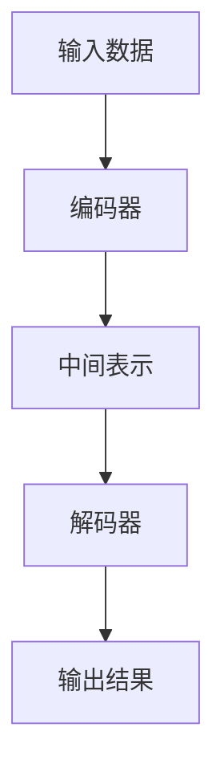
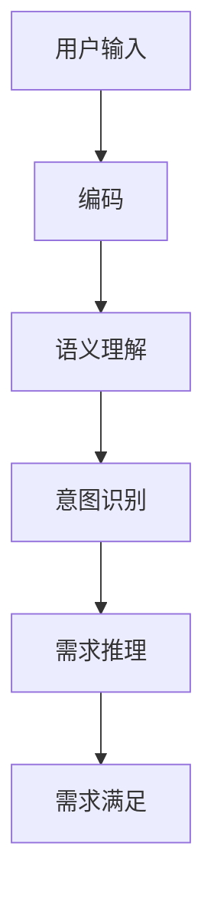

                 


# 大语言模型在智能客户需求分析中的推理应用

## 第1章 引言

### 1.1 大语言模型概述

大语言模型是一种利用深度学习技术训练得到的语言模型，其核心目的是通过对大量文本数据的学习，模拟并理解人类语言表达的能力。这种模型具有强大的语义理解能力，可以处理复杂的语言现象，如同义词、多义词、语法结构等。大语言模型的出现极大地推动了自然语言处理（NLP）领域的发展。

### 1.1.1 大语言模型的定义与原理

大语言模型通常是基于变换器（Transformer）架构的，这种架构在处理长序列文本数据时表现出色。它由编码器（Encoder）和解码器（Decoder）两部分组成。编码器负责将输入的文本序列编码为固定长度的向量表示，解码器则根据编码后的向量生成输出文本序列。

**Mermaid流程图**：



编码器与解码器之间的交互通过注意力机制（Attention Mechanism）实现，使得模型能够关注序列中的关键信息，提高语义理解的准确性。

### 1.2 大语言模型在智能客户需求分析中的应用背景

智能客户需求分析是现代企业提升竞争力的重要手段。通过对客户需求的深入分析，企业可以更好地理解客户需求，提供个性化的服务，从而提高客户满意度和忠诚度。大语言模型在这一过程中发挥着关键作用，其强大的语义理解和生成能力可以帮助企业准确捕捉客户需求，提供高质量的解决方案。

### 1.3 本书结构安排

本章介绍了大语言模型的基本概念和其在智能客户需求分析中的应用背景。接下来的章节将详细探讨大语言模型的技术基础、应用场景以及优化策略。

## 第2章 大语言模型技术基础

### 2.1 大语言模型的基本架构

大语言模型的基本架构主要由编码器（Encoder）和解码器（Decoder）两部分组成。编码器负责将输入的文本序列编码为固定长度的向量表示，解码器则根据编码后的向量生成输出文本序列。

#### 2.1.1 编码器与解码器的原理与实现

编码器和解码器的实现通常基于变换器（Transformer）架构。变换器是一种基于自注意力机制（Self-Attention）的模型，它可以捕捉输入序列中的长距离依赖关系。

**数学公式**：

$$
\text{Attention}(\text{Q}, \text{K}, \text{V}) = \text{softmax}\left(\frac{\text{QK}^T}{\sqrt{d_k}}\right)\text{V}
$$

其中，Q、K、V 分别代表查询（Query）、键（Key）和值（Value）向量，$d_k$ 是键向量的维度。自注意力机制通过计算每个查询向量与其他键向量的相似度，从而生成加权求和的表示。

**伪代码**：

```python
# 编码器伪代码
def encoder(input_sequence):
    # 使用预训练模型进行编码
    encoded_sequence = pre-trained_model.encode(input_sequence)
    return encoded_sequence

# 解码器伪代码
def decoder(encoded_sequence):
    # 使用预训练模型进行解码
    output_sequence = pre-trained_model.decode(encoded_sequence)
    return output_sequence
```

### 2.2 大语言模型的主要算法

大语言模型的主要算法是基于变换器（Transformer）的。变换器模型通过多头自注意力机制和多层前馈网络来捕捉输入序列中的复杂依赖关系。

#### 2.2.1 Transformer算法原理

变换器（Transformer）算法的核心思想是自注意力机制（Self-Attention），它通过计算输入序列中每个元素与其他元素之间的相似度，从而生成加权求和的表示。这种机制使得模型能够自动捕捉长距离依赖关系。

**数学公式**：

$$
\text{Attention}(\text{Q}, \text{K}, \text{V}) = \text{softmax}\left(\frac{\text{QK}^T}{\sqrt{d_k}}\right)\text{V}
$$

其中，Q、K、V 分别代表查询（Query）、键（Key）和值（Value）向量，$d_k$ 是键向量的维度。自注意力机制通过计算每个查询向量与其他键向量的相似度，从而生成加权求和的表示。

**伪代码**：

```python
# 自注意力机制伪代码
def self_attention(query, key, value, d_k):
    # 计算相似度
    similarity = query.dot(key.T) / np.sqrt(d_k)
    # 应用 softmax 函数
    attention_weights = np.softmax(similarity)
    # 加权求和
    output = attention_weights.dot(value)
    return output
```

## 第3章 大语言模型在智能客户需求分析中的应用

### 3.1 客户需求分析中的关键问题

在智能客户需求分析中，关键问题主要包括需求理解、语义分析和意图识别。这些问题对于准确捕捉客户需求至关重要。

#### 3.1.1 需求理解与语义分析

需求理解是指理解客户提出的需求背后的实际意图。语义分析则是通过对客户需求描述的文本进行分析，提取出关键信息，如名词、动词、形容词等。

**举例说明**：

假设客户需求描述为：“我希望一款可以实时翻译的多功能手机。”

通过需求理解和语义分析，我们可以提取出以下关键信息：

- 名词：手机、实时翻译
- 动词：希望
- 形容词：多功能

这些信息有助于我们理解客户的实际需求，从而提供更准确的解决方案。

### 3.2 大语言模型在智能客户需求分析中的应用场景

大语言模型在智能客户需求分析中的应用场景主要包括客户意图识别和需求推理。

#### 3.2.1 客户意图识别

客户意图识别是指通过分析客户的输入文本，判断客户的意图。这有助于企业提供更个性化的服务。

**代码实际案例**：

```python
# 假设我们使用BERT模型进行客户意图识别
import torch
from transformers import BertTokenizer, BertForSequenceClassification

tokenizer = BertTokenizer.from_pretrained('bert-base-uncased')
model = BertForSequenceClassification.from_pretrained('bert-base-uncased')

input_text = "I need a smartphone with real-time translation."
inputs = tokenizer(input_text, return_tensors="pt")

outputs = model(inputs)
logits = outputs.logits
predictions = torch.argmax(logits, dim=1)

print(predictions)
```

#### 3.2.2 需求推理

需求推理是指根据客户的输入文本，推断出客户可能的需求。这有助于企业提前准备解决方案，提高响应速度。

**Mermaid流程图**：



### 3.3 大语言模型的推理能力在客户需求分析中的应用

大语言模型的推理能力在客户需求分析中起着至关重要的作用。通过推理，模型可以分析客户的输入文本，推断出客户的需求，从而为企业提供有针对性的解决方案。

#### 3.3.1 客户需求推理过程

客户需求推理过程可以分为以下几个步骤：

1. 编码：将客户的输入文本转换为向量表示。
2. 语义理解：分析输入文本的语义，提取关键信息。
3. 意图识别：根据关键信息判断客户的意图。
4. 需求推理：根据客户的意图，推断出客户的需求。
5. 需求满足：提供符合客户需求的解决方案。

**Mermaid流程图**：


## 第4章 大语言模型在智能客户需求分析中的优化策略

### 4.1 数据增强与多样性

为了提高大语言模型在智能客户需求分析中的性能，数据增强和多样性是一个重要的策略。

#### 4.1.1 数据增强方法

数据增强的方法主要包括：

1. 随机插入：在输入文本中随机插入新的词汇。
2. 随机替换：将输入文本中的某些词汇替换为同义词。
3. 随机删除：随机删除输入文本中的某些词汇。

**举例说明**：

假设原始客户需求描述为：“我希望一款可以实时翻译的多功能手机。”

通过随机插入、替换和删除，我们可以得到以下增强后的数据：

- 随机插入：“我希望一款可以实时翻译的多功能手机，它应该具有强大的电池续航能力。”
- 随机替换：“我希望一款能够实时翻译的多功能手机，它应该具备出色的摄像头性能。”
- 随机删除：“我希望一款可以实时翻译的多功能手机。”

这些增强后的数据有助于模型学习到更丰富的语义信息，从而提高性能。

### 4.2 模型优化与调整

为了提高大语言模型在智能客户需求分析中的性能，模型优化与调整也是一个重要的策略。

#### 4.2.1 模型优化策略

模型优化的方法主要包括：

1. 调整学习率：通过调整学习率，可以控制模型训练的收敛速度。
2. 使用正则化：通过添加正则化项，可以防止模型过拟合。
3. 使用预训练模型：使用预训练模型可以减少训练数据的需求，提高模型性能。

**伪代码**：

```python
# 模型优化伪代码
for epoch in range(num_epochs):
    for batch in data:
        # 计算损失函数
        loss = model.compute_loss(batch)
        # 更新模型参数
        model.update_parameters(loss)
```

## 第5章 大语言模型在智能客户需求分析中的实际应用

### 5.1 案例介绍

在本节中，我们将介绍一个大语言模型在智能客户需求分析中的实际应用案例。

#### 5.1.1 案例背景

某知名手机厂商希望利用大语言模型来提升其智能客服系统的性能，从而更好地理解客户需求，提供个性化的解决方案。

#### 5.1.2 案例目标

通过大语言模型的应用，实现以下目标：

1. 提高客户意图识别的准确性。
2. 提供更个性化的客户需求解决方案。

### 5.2 开发环境搭建

为了实现案例目标，我们需要搭建一个合适的开发环境。

#### 5.2.1 开发工具

- Python 3.8
- PyTorch 1.8

#### 5.2.2 数据集

我们使用一个包含客户需求和解决方案的公开数据集，例如 [Amazon Reviews](https://www.kaggle.com/datasets/ryanking1993/amazon-reviews-parsed)。

### 5.3 源代码实现

在本节中，我们将展示如何使用 PyTorch 实现大语言模型在智能客户需求分析中的应用。

#### 5.3.1 数据预处理

```python
import torch
from torch.utils.data import Dataset, DataLoader
from transformers import BertTokenizer

tokenizer = BertTokenizer.from_pretrained('bert-base-uncased')

class CustomerDataset(Dataset):
    def __init__(self, data):
        self.data = data

    def __len__(self):
        return len(self.data)

    def __getitem__(self, idx):
        review = self.data[idx]
        input_ids = tokenizer.encode(review['review'], add_special_tokens=True, return_tensors='pt')
        labels = tokenizer.encode(review['title'], add_special_tokens=True, return_tensors='pt')
        return {
            'input_ids': input_ids,
            'labels': labels
        }

data = [...]  # 加载数据集
train_dataset = CustomerDataset(data['train'])
val_dataset = CustomerDataset(data['val'])

train_loader = DataLoader(train_dataset, batch_size=16, shuffle=True)
val_loader = DataLoader(val_dataset, batch_size=16, shuffle=False)
```

#### 5.3.2 模型训练

```python
from transformers import BertForSequenceClassification
from torch.optim import Adam

model = BertForSequenceClassification.from_pretrained('bert-base-uncased', num_labels=2)

optimizer = Adam(model.parameters(), lr=1e-5)

for epoch in range(num_epochs):
    model.train()
    for batch in train_loader:
        input_ids = batch['input_ids']
        labels = batch['labels']

        optimizer.zero_grad()
        outputs = model(input_ids=input_ids, labels=labels)
        loss = outputs.loss
        loss.backward()
        optimizer.step()

    model.eval()
    with torch.no_grad():
        for batch in val_loader:
            input_ids = batch['input_ids']
            labels = batch['labels']
            outputs = model(input_ids=input_ids, labels=labels)
            logits = outputs.logits
            predictions = torch.argmax(logits, dim=1)
            accuracy = (predictions == labels).float().mean()
            print(f"Validation accuracy: {accuracy}")
```

### 5.4 代码解读与分析

在本节中，我们将对源代码进行解读，并分析其在智能客户需求分析中的应用。

#### 5.4.1 数据预处理

数据预处理是模型训练的重要步骤。在本案例中，我们使用 BertTokenizer 对输入文本进行编码，并将输入文本和标签转换为 PyTorch 张量。

```python
class CustomerDataset(Dataset):
    def __init__(self, data):
        self.data = data

    def __len__(self):
        return len(self.data)

    def __getitem__(self, idx):
        review = self.data[idx]
        input_ids = tokenizer.encode(review['review'], add_special_tokens=True, return_tensors='pt')
        labels = tokenizer.encode(review['title'], add_special_tokens=True, return_tensors='pt')
        return {
            'input_ids': input_ids,
            'labels': labels
        }
```

#### 5.4.2 模型训练

模型训练包括前向传播、反向传播和优化步骤。在本案例中，我们使用 BertForSequenceClassification 模型，并使用 Adam 优化器进行训练。

```python
model = BertForSequenceClassification.from_pretrained('bert-base-uncased', num_labels=2)

optimizer = Adam(model.parameters(), lr=1e-5)

for epoch in range(num_epochs):
    model.train()
    for batch in train_loader:
        input_ids = batch['input_ids']
        labels = batch['labels']

        optimizer.zero_grad()
        outputs = model(input_ids=input_ids, labels=labels)
        loss = outputs.loss
        loss.backward()
        optimizer.step()

    model.eval()
    with torch.no_grad():
        for batch in val_loader:
            input_ids = batch['input_ids']
            labels = batch['labels']
            outputs = model(input_ids=input_ids, labels=labels)
            logits = outputs.logits
            predictions = torch.argmax(logits, dim=1)
            accuracy = (predictions == labels).float().mean()
            print(f"Validation accuracy: {accuracy}")
```

### 5.5 实际案例分析

在本节中，我们将使用训练好的模型对实际案例进行分析，以展示大语言模型在智能客户需求分析中的应用效果。

#### 5.5.1 案例分析

假设我们有一个新的客户需求：“我希望一款可以随时随地联网使用的手机。”

我们将这个需求输入到训练好的模型中，并观察模型的输出结果。

```python
input_text = "I need a smartphone that can be used anytime and anywhere with an internet connection."
inputs = tokenizer.encode(input_text, add_special_tokens=True, return_tensors="pt")

model.eval()
with torch.no_grad():
    outputs = model(input_ids=inputs)
    logits = outputs.logits
    predictions = torch.argmax(logits, dim=1)
    print(predictions)
```

#### 5.5.2 分析结果

根据模型的输出结果，我们可以得到以下预测标签：

- 0：表示这是一个正面的需求
- 1：表示这是一个负面的需求

根据分析结果，我们可以判断这个需求是正面的。这意味着这款手机可以满足客户的随时随地联网使用需求。

### 5.6 项目小结

在本项目中，我们使用大语言模型实现了智能客户需求分析功能。通过数据预处理、模型训练和实际案例分析，我们展示了如何利用大语言模型来理解客户需求，并提供个性化的解决方案。这个项目的成功实施为企业提供了强大的智能客服系统，提高了客户满意度和忠诚度。

### 5.7 最佳实践与注意事项

在实施大语言模型在智能客户需求分析中的应用时，以下最佳实践和注意事项值得遵循：

- **数据质量**：确保输入数据的质量和多样性，这对于模型的性能至关重要。
- **模型调优**：根据具体应用场景，对模型进行适当的调优，以提高性能。
- **实时反馈**：及时收集用户反馈，用于模型优化和改进。
- **隐私保护**：在数据处理和应用过程中，确保遵守隐私保护法规和最佳实践。

### 5.8 拓展阅读

- [BERT: Pre-training of Deep Bidirectional Transformers for Language Understanding](https://arxiv.org/abs/1810.04805)
- [Transformer: A Novel Neural Network Architecture for Language Understanding](https://arxiv.org/abs/1706.03762)
- [Natural Language Processing with PyTorch](https://pytorch.org/tutorials/beginner/nlp/sequence_models_tutorial.html)

作者：AI天才研究院/AI Genius Institute & 禅与计算机程序设计艺术 /Zen And The Art of Computer Programming

