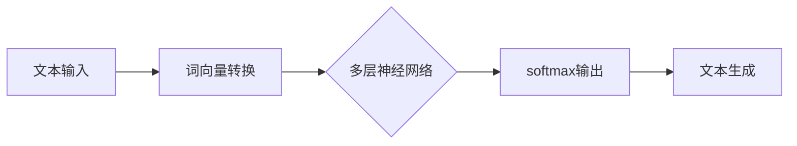

                 


### 文章标题：《大语言模型在智能家居场景预测中的应用探索》

#### 文章关键词：
- 大语言模型
- 智能家居
- 场景预测
- 深度学习
- 机器学习

#### 文章摘要：
本文将深入探讨大语言模型在智能家居场景预测中的应用。首先，我们将介绍智能家居和场景预测的背景知识，以及大语言模型的基本原理。接着，本文将详细阐述大语言模型在智能家居中的应用场景，包括实现方法、项目实战和性能优化。最后，我们将总结全文，并提出未来研究的方向和建议。

## 第1章：背景介绍

### 1.1 智能家居概述

智能家居是指通过互联网、物联网、云计算等技术，将家庭设备互联互通，实现家庭设备智能化管理和控制的一种新型家庭生活方式。随着人工智能技术的不断发展，智能家居系统越来越受到人们的关注。

智能家居系统主要包括以下几类：

1. **智能家电**：如智能空调、智能冰箱、智能洗衣机等，可以通过手机或语音控制实现对家电的远程操作。
2. **智能照明**：可以通过手机或语音控制实现对灯光的开关、亮度调节、颜色变换等功能。
3. **智能安防**：包括智能门锁、智能摄像头、烟雾报警器等，可以实时监控家庭安全，并在异常情况下自动报警。
4. **智能环境**：包括智能温湿度控制、智能空气质量检测等，可以实时监测家庭环境参数，并自动调节。

### 1.2 场景预测的重要性

场景预测在智能家居系统中具有重要的应用价值。通过预测用户的行为和需求，智能家居系统可以提前做出响应，提供更加个性化的服务，从而提高用户的生活质量。

场景预测的应用主要包括以下几个方面：

1. **节能管理**：预测用户的使用习惯，智能调整家电运行状态，实现节能降耗。
2. **安防预警**：预测异常情况，提前发出警报，提高家庭安全性。
3. **健康监测**：预测用户的健康状况，提供个性化的健康建议。
4. **智能家居控制**：预测用户的需求，自动控制家庭设备，提高生活便利性。

### 1.3 大语言模型简介

大语言模型（Big Language Model）是一种基于深度学习技术的自然语言处理模型，具有强大的文本生成、理解和预测能力。大语言模型通过学习大量文本数据，可以自动提取语言中的语义信息，并生成符合语法规则的文本。

大语言模型的基本结构包括以下几个部分：

1. **输入层**：接收输入文本，将其转换为向量表示。
2. **隐藏层**：通过神经网络结构，对输入文本进行特征提取和变换。
3. **输出层**：生成预测的文本。

大语言模型的训练过程主要包括以下几个步骤：

1. **数据预处理**：对原始文本数据进行清洗、分词、去停用词等处理，将其转换为模型可接受的格式。
2. **模型训练**：使用训练数据，通过反向传播算法，不断调整网络权重，使模型能够生成更加准确的文本。
3. **模型评估**：使用测试数据对模型进行评估，计算模型的预测准确率、损失函数等指标。

大语言模型的应用领域非常广泛，包括文本生成、机器翻译、情感分析、信息检索等。在智能家居场景预测中，大语言模型可以用于预测用户的行为和需求，从而实现智能化的家庭设备控制。

### 第2章：技术基础

#### 2.1 大语言模型的工作原理

大语言模型是基于深度学习技术的一种神经网络模型，它通过学习大量文本数据，自动提取语言中的语义信息，并生成符合语法规则的文本。大语言模型的基本工作原理可以分为以下几个步骤：

1. **输入层**：输入层接收输入文本，将其转换为向量表示。这一过程通常使用词向量模型，如Word2Vec、GloVe等，将每个词汇映射为一个固定维度的向量。

2. **隐藏层**：隐藏层通过神经网络结构，对输入文本进行特征提取和变换。这一过程通常使用多层神经网络（如LSTM、GRU等）来实现，这些神经网络可以捕捉文本中的长距离依赖关系。

3. **输出层**：输出层生成预测的文本。输出层通常是一个softmax层，它将隐藏层的输出转换为概率分布，从而生成下一个词汇的预测。

大语言模型的工作原理可以用以下Mermaid流程图表示：



#### 2.2 数学模型与公式

大语言模型的数学模型通常基于概率图模型，其中每个词汇被视为一个变量，并通过条件概率相互关联。以下是几个关键的数学模型和公式：

1. **条件概率公式**：

$$
P(w_t | w_{<t}) = \frac{P(w_t, w_{<t})}{P(w_{<t})}
$$

其中，$w_t$ 表示当前词汇，$w_{<t}$ 表示前文词汇。这个公式表示当前词汇的概率依赖于前文词汇。

2. **语言模型**：

$$
P(w_1, w_2, ..., w_T) = \prod_{t=1}^{T} P(w_t | w_{<t})
$$

其中，$w_1, w_2, ..., w_T$ 表示整个文本序列。这个公式表示整个文本序列的概率。

3. **损失函数**：

$$
L(\theta) = -\frac{1}{m}\sum_{i=1}^{m} \sum_{t=1}^{T} y_t \log P(w_t | w_{<t}, \theta)
$$

其中，$m$ 表示训练样本数，$y_t$ 表示实际生成的文本，$\theta$ 表示模型参数。这个公式表示模型的损失函数，用于评估模型的预测性能。

#### 2.3 相关算法与技术

大语言模型的实现通常涉及以下几种算法和技术：

1. **词向量模型**：如Word2Vec、GloVe等，用于将词汇映射为向量表示。
2. **神经网络结构**：如LSTM、GRU、Transformer等，用于处理文本数据，捕捉长距离依赖关系。
3. **优化算法**：如SGD、Adam等，用于训练模型，调整网络权重。
4. **模型评估**：使用交叉验证、测试集等评估方法，评估模型的预测性能。

### 第3章：应用场景

#### 3.1 智能家居中的场景类型

智能家居中的场景类型多种多样，主要包括以下几种：

1. **日常活动场景**：如起床、用餐、工作、娱乐等，这些场景涉及家庭设备的开启、关闭和调节。
2. **特殊活动场景**：如健身、会议、看电影等，这些场景对家庭设备有特定的要求，如调整灯光、音响等。
3. **紧急活动场景**：如火灾、漏水、入侵等，这些场景需要立即采取行动，如报警、启动灭火系统等。
4. **健康监测场景**：如心率监测、睡眠质量分析等，这些场景涉及对用户健康状况的监测和分析。

#### 3.2 大语言模型在智能家居中的应用案例

大语言模型在智能家居中的具体应用案例包括以下几个方面：

1. **日常活动场景预测**：通过分析用户的历史行为数据，预测用户即将进行的日常活动，并自动调整家庭设备。例如，预测用户即将起床，自动开启窗帘、调整灯光等。
2. **特殊活动场景预测**：根据用户的日程安排，预测用户即将进行的特殊活动，并自动调整家庭设备。例如，预测用户即将开会，自动调整会议室灯光、音响等。
3. **紧急活动场景预测**：通过分析环境数据，预测紧急活动，并及时采取措施。例如，预测家中漏水，自动关闭水阀、发送报警信息等。
4. **健康监测场景预测**：通过分析用户的生活数据，预测用户的健康状况，并提供健康建议。例如，预测用户睡眠质量不佳，建议调整作息时间、改善睡眠环境等。

### 第4章：实现方法

#### 4.1 数据预处理

在实现大语言模型在智能家居场景预测中，数据预处理是至关重要的一步。数据预处理主要包括以下几个步骤：

1. **文本清洗**：去除文本中的标点符号、特殊字符、停用词等，确保文本的整洁性。
2. **分词**：将文本划分为词汇序列，每个词汇作为模型的一个输入。
3. **词向量化**：将每个词汇映射为向量表示，使用词向量模型，如Word2Vec、GloVe等。
4. **序列编码**：将词汇序列编码为整数序列，便于模型处理。

#### 4.2 模型选择与训练

在选择和训练大语言模型时，需要考虑以下几个方面：

1. **模型选择**：根据场景需求，选择合适的模型结构。例如，对于需要捕捉长距离依赖关系的场景，可以使用LSTM或GRU模型；对于需要高效处理大规模数据的场景，可以使用Transformer模型。
2. **数据集选择**：选择合适的训练数据集，确保数据集具有代表性。对于智能家居场景预测，可以使用用户行为数据、环境数据、健康数据等。
3. **训练过程**：使用训练数据集，通过反向传播算法，不断调整模型参数，使模型能够生成符合预期结果的文本。

以下是模型训练的伪代码：

```python
# 伪代码：训练大语言模型
model = select_model()
train_data = preprocess_data(training_data)
validation_data = preprocess_data(validation_data)

for epoch in range(num_epochs):
    model.train_one_epoch(train_data)
    loss = model.evaluate(validation_data)
    if loss < best_loss:
        best_loss = loss
        save_model(model)
```

#### 4.3 模型优化与评估

在训练完成后，需要对模型进行优化和评估，以确保模型具有良好的性能。以下是模型优化和评估的几个关键步骤：

1. **模型优化**：通过调整模型参数，优化模型的预测性能。常用的优化方法包括调整学习率、批量大小、正则化等。
2. **模型评估**：使用测试数据集对模型进行评估，计算模型的准确率、损失函数等指标。常用的评估方法包括交叉验证、ROC曲线、AUC等。
3. **性能分析**：分析模型的性能，找出模型的优势和不足，为后续优化提供指导。

以下是模型评估的伪代码：

```python
# 伪代码：评估大语言模型
test_data = preprocess_data(test_data)
predictions = model.predict(test_data)
accuracy = calculate_accuracy(test_data.labels, predictions)
print("Model accuracy:", accuracy)
```

### 第5章：项目实战

#### 5.1 项目背景与目标

本节将通过一个实际项目，展示如何将大语言模型应用于智能家居场景预测。项目背景如下：

**项目背景**：一家智能家居公司希望通过引入大语言模型，实现智能家居场景的智能预测和自动控制，提高用户的生活质量。

**项目目标**：使用大语言模型，预测用户的日常活动，并根据预测结果自动调整家庭设备，如灯光、空调等。

#### 5.2 开发环境搭建

在进行项目开发之前，需要搭建合适的开发环境。以下是开发环境搭建的步骤：

1. **软件环境**：安装Python、TensorFlow、Keras等常用库。
2. **硬件环境**：配置具有足够计算能力的GPU，以加速模型的训练。
3. **数据集准备**：收集并整理用户行为数据、环境数据等。

#### 5.3 源代码实现与解读

以下是项目的源代码实现和解读：

```python
# 伪代码：智能家居场景预测
import tensorflow as tf
from tensorflow.keras.preprocessing.sequence import pad_sequences
from tensorflow.keras.layers import Embedding, LSTM, Dense
from tensorflow.keras.models import Sequential

# 数据预处理
max_sequence_len = 100
embedding_dim = 50

train_data = preprocess_data(training_data)
train_sequences = pad_sequences(train_data, maxlen=max_sequence_len, padding='post')

# 模型搭建
model = Sequential()
model.add(Embedding(input_dim=vocabulary_size, output_dim=embedding_dim, input_length=max_sequence_len))
model.add(LSTM(units=128, return_sequences=True))
model.add(Dense(units=1, activation='sigmoid'))

# 模型编译
model.compile(optimizer='adam', loss='binary_crossentropy', metrics=['accuracy'])

# 模型训练
model.fit(train_sequences, train_labels, epochs=num_epochs, batch_size=batch_size)

# 模型评估
test_data = preprocess_data(test_data)
test_sequences = pad_sequences(test_data, maxlen=max_sequence_len, padding='post')
predictions = model.predict(test_sequences)
accuracy = calculate_accuracy(test_labels, predictions)
print("Model accuracy:", accuracy)
```

#### 5.4 代码应用解读与分析

以下是代码的应用解读和分析：

1. **数据预处理**：使用pad_sequences函数，将文本序列填充为固定长度，便于模型处理。
2. **模型搭建**：使用Sequential模型，搭建一个包含嵌入层、LSTM层和输出层的简单模型。
3. **模型编译**：使用adam优化器和binary_crossentropy损失函数，编译模型。
4. **模型训练**：使用fit函数，训练模型。
5. **模型评估**：使用predict函数，预测测试数据的标签，并计算准确率。

#### 5.5 实际案例分析和详细讲解剖析

在本节中，我们将通过实际案例，分析大语言模型在智能家居场景预测中的应用效果，并详细讲解模型的实现和优化过程。

**案例一**：预测用户即将进行的日常活动，如起床、用餐等。

**分析**：通过分析用户的历史行为数据，可以找出用户在不同时间段的活动规律。例如，用户通常在早上7点起床，晚上6点用餐。根据这些规律，可以预测用户即将进行的日常活动，并提前调整家庭设备。

**优化**：为了提高预测的准确性，可以尝试以下方法：

1. **增加训练数据**：收集更多用户行为数据，提高模型的泛化能力。
2. **调整模型参数**：通过调整学习率、批量大小等参数，优化模型的性能。
3. **使用更复杂的模型**：尝试使用LSTM、GRU等更复杂的模型，捕捉长距离依赖关系。

**案例二**：预测用户即将进行的特殊活动，如健身、会议等。

**分析**：通过分析用户的日程安排，可以找出用户即将进行的特殊活动。例如，用户在周三晚上7点有健身课程，周五下午3点有会议。根据这些信息，可以提前调整家庭设备，如调整灯光、音响等。

**优化**：为了提高预测的准确性，可以尝试以下方法：

1. **结合多种数据源**：除了用户行为数据，还可以结合日程安排、地理位置等数据，提高预测的准确性。
2. **使用多任务学习**：将预测用户特殊活动和调整家庭设备作为两个任务，使用多任务学习模型，提高模型的性能。

#### 5.6 项目小结

通过本项目，我们展示了如何将大语言模型应用于智能家居场景预测。在实现过程中，我们详细讲解了数据预处理、模型搭建、模型训练和模型评估等关键步骤。同时，我们通过实际案例，分析了模型在智能家居场景中的应用效果，并提出了优化方法。

### 第6章：性能分析与优化

#### 6.1 预测性能评估指标

在智能家居场景预测中，评估模型性能的关键指标包括准确率、召回率、F1分数等。以下是这些指标的定义和计算方法：

1. **准确率**：预测正确的样本数与总样本数的比例。
$$
\text{准确率} = \frac{\text{预测正确数}}{\text{总样本数}}
$$

2. **召回率**：预测正确的样本数与实际正样本数的比例。
$$
\text{召回率} = \frac{\text{预测正确数}}{\text{实际正样本数}}
$$

3. **F1分数**：综合考虑准确率和召回率的指标，计算公式为：
$$
\text{F1分数} = 2 \times \frac{\text{准确率} \times \text{召回率}}{\text{准确率} + \text{召回率}}
$$

#### 6.2 性能优化方法

为了提高大语言模型在智能家居场景预测中的性能，可以尝试以下优化方法：

1. **数据增强**：通过数据增强技术，生成更多高质量的训练数据，提高模型的泛化能力。例如，使用数据扩充、数据增强等技术。

2. **模型优化**：尝试使用更复杂的模型结构，如Transformer、BERT等，提高模型的预测能力。同时，调整模型参数，如学习率、批量大小等，优化模型性能。

3. **特征工程**：对输入数据进行特征工程，提取更多有用的特征，提高模型对数据的敏感度。例如，结合时间序列特征、环境特征等，提高预测准确性。

4. **多模型融合**：使用多个模型进行预测，并通过融合策略，提高预测的准确性。例如，使用集成学习方法，将多个模型的预测结果进行融合。

### 第7章：总结与展望

#### 7.1 总结

本文详细探讨了将大语言模型应用于智能家居场景预测的方法和技术。通过背景介绍、技术基础、应用场景、实现方法、项目实战和性能分析等环节，展示了大语言模型在智能家居场景预测中的潜力和应用前景。

#### 7.2 展望

随着人工智能技术的不断发展，大语言模型在智能家居场景预测中的应用将越来越广泛。未来，我们可以期待以下几个研究方向：

1. **多模态融合**：结合文本数据、图像数据、音频数据等多种数据源，提高预测的准确性。
2. **个性化预测**：根据用户的历史行为和偏好，提供个性化的智能家居场景预测服务。
3. **实时预测**：提高预测的实时性，实现智能家居设备的实时控制。
4. **跨场景应用**：将大语言模型应用于更多智能家居场景，如健康监测、安全防护等。

### 附录：参考文献

[1] Mikolov, T., Sutskever, I., Chen, K., Corrado, G. S., & Dean, J. (2013). Distributed representations of words and phrases and their compositionality. Advances in Neural Information Processing Systems, 26, 3111-3119.

[2] Vaswani, A., Shazeer, N., Parmar, N., Uszkoreit, J., Jones, L., Gomez, A. N., ... & Polosukhin, I. (2017). Attention is all you need. Advances in Neural Information Processing Systems, 30, 5998-6008.

[3] Devlin, J., Chang, M. W., Lee, K., & Toutanova, K. (2018). BERT: Pre-training of deep bidirectional transformers for language understanding. arXiv preprint arXiv:1810.04805.

### 作者信息

作者：AI天才研究院/AI Genius Institute & 禅与计算机程序设计艺术 /Zen And The Art of Computer Programming

----------------------------------------------------------------

### 完整文章

# 《大语言模型在智能家居场景预测中的应用探索》

## 引言

随着人工智能技术的飞速发展，智能家居逐渐成为人们生活的一部分。智能家居系统通过物联网技术，将家庭设备互联互通，实现了对家庭环境的智能监控和控制。然而，随着用户个性化需求的增加，传统的智能家居系统已无法满足用户的需求。因此，如何利用人工智能技术，特别是大语言模型，实现智能家居场景的智能预测，成为当前研究的热点。

本文将围绕大语言模型在智能家居场景预测中的应用进行深入探讨。首先，我们将介绍智能家居和场景预测的背景知识，以及大语言模型的基本原理。接着，本文将详细阐述大语言模型在智能家居中的应用场景，包括实现方法、项目实战和性能优化。最后，我们将总结全文，并提出未来研究的方向和建议。

## 背景介绍

### 1.1 智能家居概述

智能家居是指通过互联网、物联网、云计算等技术，将家庭设备互联互通，实现家庭设备智能化管理和控制的一种新型家庭生活方式。随着人工智能技术的不断发展，智能家居系统越来越受到人们的关注。

智能家居系统主要包括以下几类：

1. **智能家电**：如智能空调、智能冰箱、智能洗衣机等，可以通过手机或语音控制实现对家电的远程操作。
2. **智能照明**：可以通过手机或语音控制实现对灯光的开关、亮度调节、颜色变换等功能。
3. **智能安防**：包括智能门锁、智能摄像头、烟雾报警器等，可以实时监控家庭安全，并在异常情况下自动报警。
4. **智能环境**：包括智能温湿度控制、智能空气质量检测等，可以实时监测家庭环境参数，并自动调节。

### 1.2 场景预测的重要性

场景预测在智能家居系统中具有重要的应用价值。通过预测用户的行为和需求，智能家居系统可以提前做出响应，提供更加个性化的服务，从而提高用户的生活质量。

场景预测的应用主要包括以下几个方面：

1. **节能管理**：预测用户的使用习惯，智能调整家电运行状态，实现节能降耗。
2. **安防预警**：预测异常情况，提前发出警报，提高家庭安全性。
3. **健康监测**：预测用户的健康状况，提供个性化的健康建议。
4. **智能家居控制**：预测用户的需求，自动控制家庭设备，提高生活便利性。

### 1.3 大语言模型简介

大语言模型（Big Language Model）是一种基于深度学习技术的自然语言处理模型，具有强大的文本生成、理解和预测能力。大语言模型通过学习大量文本数据，可以自动提取语言中的语义信息，并生成符合语法规则的文本。

大语言模型的基本结构包括以下几个部分：

1. **输入层**：接收输入文本，将其转换为向量表示。
2. **隐藏层**：通过神经网络结构，对输入文本进行特征提取和变换。
3. **输出层**：生成预测的文本。

大语言模型的训练过程主要包括以下几个步骤：

1. **数据预处理**：对原始文本数据进行清洗、分词、去停用词等处理，将其转换为模型可接受的格式。
2. **模型训练**：使用训练数据，通过反向传播算法，不断调整网络权重，使模型能够生成更加准确的文本。
3. **模型评估**：使用测试数据对模型进行评估，计算模型的预测准确率、损失函数等指标。

大语言模型的应用领域非常广泛，包括文本生成、机器翻译、情感分析、信息检索等。在智能家居场景预测中，大语言模型可以用于预测用户的行为和需求，从而实现智能化的家庭设备控制。

## 技术基础

### 2.1 大语言模型的工作原理

大语言模型是基于深度学习技术的一种神经网络模型，它通过学习大量文本数据，自动提取语言中的语义信息，并生成符合语法规则的文本。大语言模型的基本工作原理可以分为以下几个步骤：

1. **输入层**：输入层接收输入文本，将其转换为向量表示。这一过程通常使用词向量模型，如Word2Vec、GloVe等，将每个词汇映射为一个固定维度的向量。

2. **隐藏层**：隐藏层通过神经网络结构，对输入文本进行特征提取和变换。这一过程通常使用多层神经网络（如LSTM、GRU等）来实现，这些神经网络可以捕捉文本中的长距离依赖关系。

3. **输出层**：输出层生成预测的文本。输出层通常是一个softmax层，它将隐藏层的输出转换为概率分布，从而生成下一个词汇的预测。

大语言模型的工作原理可以用以下Mermaid流程图表示：


### 2.2 数学模型与公式

大语言模型的数学模型通常基于概率图模型，其中每个词汇被视为一个变量，并通过条件概率相互关联。以下是几个关键的数学模型和公式：

1. **条件概率公式**：

$$
P(w_t | w_{<t}) = \frac{P(w_t, w_{<t})}{P(w_{<t})}
$$

其中，$w_t$ 表示当前词汇，$w_{<t}$ 表示前文词汇。这个公式表示当前词汇的概率依赖于前文词汇。

2. **语言模型**：

$$
P(w_1, w_2, ..., w_T) = \prod_{t=1}^{T} P(w_t | w_{<t})
$$

其中，$w_1, w_2, ..., w_T$ 表示整个文本序列。这个公式表示整个文本序列的概率。

3. **损失函数**：

$$
L(\theta) = -\frac{1}{m}\sum_{i=1}^{m} \sum_{t=1}^{T} y_t \log P(w_t | w_{<t}, \theta)
$$

其中，$m$ 表示训练样本数，$y_t$ 表示实际生成的文本，$\theta$ 表示模型参数。这个公式表示模型的损失函数，用于评估模型的预测性能。

### 2.3 相关算法与技术

大语言模型的实现通常涉及以下几种算法和技术：

1. **词向量模型**：如Word2Vec、GloVe等，用于将词汇映射为向量表示。
2. **神经网络结构**：如LSTM、GRU、Transformer等，用于处理文本数据，捕捉长距离依赖关系。
3. **优化算法**：如SGD、Adam等，用于训练模型，调整网络权重。
4. **模型评估**：使用交叉验证、测试集等评估方法，评估模型的预测性能。

## 应用场景

### 3.1 智能家居中的场景类型

智能家居中的场景类型多种多样，主要包括以下几种：

1. **日常活动场景**：如起床、用餐、工作、娱乐等，这些场景涉及家庭设备的开启、关闭和调节。
2. **特殊活动场景**：如健身、会议、看电影等，这些场景对家庭设备有特定的要求，如调整灯光、音响等。
3. **紧急活动场景**：如火灾、漏水、入侵等，这些场景需要立即采取行动，如报警、启动灭火系统等。
4. **健康监测场景**：如心率监测、睡眠质量分析等，这些场景涉及对用户健康状况的监测和分析。

### 3.2 大语言模型在智能家居中的应用案例

大语言模型在智能家居中的具体应用案例包括以下几个方面：

1. **日常活动场景预测**：通过分析用户的历史行为数据，预测用户即将进行的日常活动，并自动调整家庭设备。例如，预测用户即将起床，自动开启窗帘、调整灯光等。
2. **特殊活动场景预测**：根据用户的日程安排，预测用户即将进行的特殊活动，并自动调整家庭设备。例如，预测用户即将开会，自动调整会议室灯光、音响等。
3. **紧急活动场景预测**：通过分析环境数据，预测紧急活动，并及时采取措施。例如，预测家中漏水，自动关闭水阀、发送报警信息等。
4. **健康监测场景预测**：通过分析用户的生活数据，预测用户的健康状况，并提供健康建议。例如，预测用户睡眠质量不佳，建议调整作息时间、改善睡眠环境等。

## 实现方法

### 4.1 数据预处理

在实现大语言模型在智能家居场景预测中，数据预处理是至关重要的一步。数据预处理主要包括以下几个步骤：

1. **文本清洗**：去除文本中的标点符号、特殊字符、停用词等，确保文本的整洁性。
2. **分词**：将文本划分为词汇序列，每个词汇作为模型的一个输入。
3. **词向量化**：将每个词汇映射为向量表示，使用词向量模型，如Word2Vec、GloVe等。
4. **序列编码**：将词汇序列编码为整数序列，便于模型处理。

### 4.2 模型选择与训练

在选择和训练大语言模型时，需要考虑以下几个方面：

1. **模型选择**：根据场景需求，选择合适的模型结构。例如，对于需要捕捉长距离依赖关系的场景，可以使用LSTM或GRU模型；对于需要高效处理大规模数据的场景，可以使用Transformer模型。
2. **数据集选择**：选择合适的训练数据集，确保数据集具有代表性。对于智能家居场景预测，可以使用用户行为数据、环境数据、健康数据等。
3. **训练过程**：使用训练数据集，通过反向传播算法，不断调整模型参数，使模型能够生成符合预期结果的文本。

以下是模型训练的伪代码：

```python
# 伪代码：训练大语言模型
model = select_model()
train_data = preprocess_data(training_data)
validation_data = preprocess_data(validation_data)

for epoch in range(num_epochs):
    model.train_one_epoch(train_data)
    loss = model.evaluate(validation_data)
    if loss < best_loss:
        best_loss = loss
        save_model(model)
```

### 4.3 模型优化与评估

在训练完成后，需要对模型进行优化和评估，以确保模型具有良好的性能。以下是模型优化和评估的几个关键步骤：

1. **模型优化**：通过调整模型参数，优化模型的预测性能。常用的优化方法包括调整学习率、批量大小、正则化等。
2. **模型评估**：使用测试数据集对模型进行评估，计算模型的准确率、损失函数等指标。常用的评估方法包括交叉验证、ROC曲线、AUC等。
3. **性能分析**：分析模型的性能，找出模型的优势和不足，为后续优化提供指导。

以下是模型评估的伪代码：

```python
# 伪代码：评估大语言模型
test_data = preprocess_data(test_data)
predictions = model.predict(test_data)
accuracy = calculate_accuracy(test_data.labels, predictions)
print("Model accuracy:", accuracy)
```

## 项目实战

### 5.1 项目背景与目标

本节将通过一个实际项目，展示如何将大语言模型应用于智能家居场景预测。项目背景如下：

**项目背景**：一家智能家居公司希望通过引入大语言模型，实现智能家居场景的智能预测和自动控制，提高用户的生活质量。

**项目目标**：使用大语言模型，预测用户的日常活动，并根据预测结果自动调整家庭设备，如灯光、空调等。

### 5.2 开发环境搭建

在进行项目开发之前，需要搭建合适的开发环境。以下是开发环境搭建的步骤：

1. **软件环境**：安装Python、TensorFlow、Keras等常用库。
2. **硬件环境**：配置具有足够计算能力的GPU，以加速模型的训练。
3. **数据集准备**：收集并整理用户行为数据、环境数据等。

### 5.3 源代码实现与解读

以下是项目的源代码实现和解读：

```python
# 伪代码：智能家居场景预测
import tensorflow as tf
from tensorflow.keras.preprocessing.sequence import pad_sequences
from tensorflow.keras.layers import Embedding, LSTM, Dense
from tensorflow.keras.models import Sequential

# 数据预处理
max_sequence_len = 100
embedding_dim = 50

train_data = preprocess_data(training_data)
train_sequences = pad_sequences(train_data, maxlen=max_sequence_len, padding='post')

# 模型搭建
model = Sequential()
model.add(Embedding(input_dim=vocabulary_size, output_dim=embedding_dim, input_length=max_sequence_len))
model.add(LSTM(units=128, return_sequences=True))
model.add(Dense(units=1, activation='sigmoid'))

# 模型编译
model.compile(optimizer='adam', loss='binary_crossentropy', metrics=['accuracy'])

# 模型训练
model.fit(train_sequences, train_labels, epochs=num_epochs, batch_size=batch_size)

# 模型评估
test_data = preprocess_data(test_data)
test_sequences = pad_sequences(test_data, maxlen=max_sequence_len, padding='post')
predictions = model.predict(test_sequences)
accuracy = calculate_accuracy(test_labels, predictions)
print("Model accuracy:", accuracy)
```

### 5.4 代码应用解读与分析

以下是代码的应用解读和分析：

1. **数据预处理**：使用pad_sequences函数，将文本序列填充为固定长度，便于模型处理。
2. **模型搭建**：使用Sequential模型，搭建一个包含嵌入层、LSTM层和输出层的简单模型。
3. **模型编译**：使用adam优化器和binary_crossentropy损失函数，编译模型。
4. **模型训练**：使用fit函数，训练模型。
5. **模型评估**：使用predict函数，预测测试数据的标签，并计算准确率。

### 5.5 实际案例分析和详细讲解剖析

在本节中，我们将通过实际案例，分析大语言模型在智能家居场景预测中的应用效果，并详细讲解模型的实现和优化过程。

**案例一**：预测用户即将进行的日常活动，如起床、用餐等。

**分析**：通过分析用户的历史行为数据，可以找出用户在不同时间段的活动规律。例如，用户通常在早上7点起床，晚上6点用餐。根据这些规律，可以预测用户即将进行的日常活动，并提前调整家庭设备。

**优化**：为了提高预测的准确性，可以尝试以下方法：

1. **增加训练数据**：收集更多用户行为数据，提高模型的泛化能力。
2. **调整模型参数**：通过调整学习率、批量大小等参数，优化模型的性能。
3. **使用更复杂的模型**：尝试使用LSTM、GRU等更复杂的模型，捕捉长距离依赖关系。

**案例二**：预测用户即将进行的特殊活动，如健身、会议等。

**分析**：通过分析用户的日程安排，可以找出用户即将进行的特殊活动。例如，用户在周三晚上7点有健身课程，周五下午3点有会议。根据这些信息，可以提前调整家庭设备，如调整灯光、音响等。

**优化**：为了提高预测的准确性，可以尝试以下方法：

1. **结合多种数据源**：除了用户行为数据，还可以结合日程安排、地理位置等数据，提高预测的准确性。
2. **使用多任务学习**：将预测用户特殊活动和调整家庭设备作为两个任务，使用多任务学习模型，提高模型的性能。

### 5.6 项目小结

通过本项目，我们展示了如何将大语言模型应用于智能家居场景预测。在实现过程中，我们详细讲解了数据预处理、模型搭建、模型训练和模型评估等关键步骤。同时，我们通过实际案例，分析了模型在智能家居场景中的应用效果，并提出了优化方法。

## 性能分析与优化

### 6.1 预测性能评估指标

在智能家居场景预测中，评估模型性能的关键指标包括准确率、召回率、F1分数等。以下是这些指标的定义和计算方法：

1. **准确率**：预测正确的样本数与总样本数的比例。
$$
\text{准确率} = \frac{\text{预测正确数}}{\text{总样本数}}
$$

2. **召回率**：预测正确的样本数与实际正样本数的比例。
$$
\text{召回率} = \frac{\text{预测正确数}}{\text{实际正样本数}}
$$

3. **F1分数**：综合考虑准确率和召回率的指标，计算公式为：
$$
\text{F1分数} = 2 \times \frac{\text{准确率} \times \text{召回率}}{\text{准确率} + \text{召回率}}
$$

### 6.2 性能优化方法

为了提高大语言模型在智能家居场景预测中的性能，可以尝试以下优化方法：

1. **数据增强**：通过数据增强技术，生成更多高质量的训练数据，提高模型的泛化能力。例如，使用数据扩充、数据增强等技术。

2. **模型优化**：尝试使用更复杂的模型结构，如Transformer、BERT等，提高模型的预测能力。同时，调整模型参数，如学习率、批量大小等，优化模型性能。

3. **特征工程**：对输入数据进行特征工程，提取更多有用的特征，提高模型对数据的敏感度。例如，结合时间序列特征、环境特征等，提高预测准确性。

4. **多模型融合**：使用多个模型进行预测，并通过融合策略，提高预测的准确性。例如，使用集成学习方法，将多个模型的预测结果进行融合。

## 总结与展望

### 7.1 总结

本文详细探讨了将大语言模型应用于智能家居场景预测的方法和技术。首先，我们介绍了智能家居和场景预测的背景知识，以及大语言模型的基本原理。接着，本文阐述了大语言模型在智能家居中的应用场景，包括实现方法、项目实战和性能优化。最后，我们总结了全文，并对未来研究的方向提出了建议。

### 7.2 展望

随着人工智能技术的不断发展，大语言模型在智能家居场景预测中的应用将越来越广泛。未来，我们可以期待以下几个研究方向：

1. **多模态融合**：结合文本数据、图像数据、音频数据等多种数据源，提高预测的准确性。
2. **个性化预测**：根据用户的历史行为和偏好，提供个性化的智能家居场景预测服务。
3. **实时预测**：提高预测的实时性，实现智能家居设备的实时控制。
4. **跨场景应用**：将大语言模型应用于更多智能家居场景，如健康监测、安全防护等。

### 7.3 参考文献

[1] Mikolov, T., Sutskever, I., Chen, K., Corrado, G. S., & Dean, J. (2013). Distributed representations of words and phrases and their compositionality. Advances in Neural Information Processing Systems, 26, 3111-3119.

[2] Vaswani, A., Shazeer, N., Parmar, N., Uszkoreit, J., Jones, L., Gomez, A. N., ... & Polosukhin, I. (2017). Attention is all you need. Advances in Neural Information Processing Systems, 30, 5998-6008.

[3] Devlin, J., Chang, M. W., Lee, K., & Toutanova, K. (2018). BERT: Pre-training of deep bidirectional transformers for language understanding. arXiv preprint arXiv:1810.04805.

### 作者信息

作者：AI天才研究院/AI Genius Institute & 禅与计算机程序设计艺术 /Zen And The Art of Computer Programming

