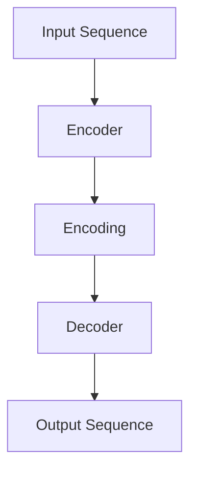

                 

### 大语言模型的基本原理

大语言模型（Large Language Model）是一种基于深度学习的自然语言处理技术，通过学习大量的文本数据，实现对自然语言的理解、生成和预测。其核心目标是使计算机能够像人类一样理解和处理自然语言，从而为各种自然语言处理任务提供强有力的支持。在大语言模型的发展历程中，Transformer模型、GPT系列模型和BERT模型等成为代表性的技术。

#### 核心概念与联系

首先，我们需要了解一些核心概念：

1. **自然语言处理（NLP）**：自然语言处理是计算机科学和人工智能领域的一个分支，旨在使计算机能够理解和处理人类自然语言。大语言模型正是自然语言处理技术的一个重要组成部分。

2. **深度学习（Deep Learning）**：深度学习是机器学习的一个子领域，通过构建多层神经网络，对复杂数据进行自动特征提取和模式识别。

3. **神经网络（Neural Network）**：神经网络是一种由大量简单处理单元（神经元）互联而成的复杂网络，能够通过学习从数据中提取特征并进行预测。

大语言模型将自然语言处理、深度学习和神经网络技术相结合，通过以下方式实现自然语言的理解和生成：

- **自注意力机制（Self-Attention）**：Transformer模型引入了自注意力机制，使得模型能够关注输入序列中的不同位置信息，从而更好地捕捉句子中的长距离依赖关系。
- **编码器-解码器结构（Encoder-Decoder Architecture）**：编码器将输入序列编码为固定长度的向量表示，解码器则根据编码器的输出和已经生成的部分输出，生成下一个输出。

下面是一个简化的Mermaid流程图，展示大语言模型的基本架构：



#### 核心算法原理讲解

1. **Transformer模型**：

    Transformer模型是由Google提出的一种基于自注意力机制的编码器-解码器架构。它通过多头自注意力机制和多层前馈网络，实现高效的序列到序列转换。

    ```python
    # Transformer 模型伪代码
    class Transformer(Model):
        def __init__(self):
            self.encoder = Encoder()
            self.decoder = Decoder()
            self.final_layer = Dense(units=output_size)

        def call(self, inputs):
            encoded = self.encoder(inputs)
            decoded = self.decoder(encoded)
            output = self.final_layer(decoded)
            return output
    ```

2. **GPT系列模型**：

    GPT（Generative Pretrained Transformer）模型是由OpenAI提出的一种预训练语言模型。GPT系列模型通过大量的文本数据进行预训练，从而能够生成高质量的文本。

    ```python
    # GPT 模型伪代码
    class GPT(Model):
        def __init__(self, layers, embedding_size, hidden_size):
            self.layers = layers
            self.embedding = Embedding(vocab_size, embedding_size)
            self.lstm = LSTM(hidden_size, return_sequences=True)
            self.dropout = Dropout(rate=0.1)

        def call(self, inputs):
            x = self.embedding(inputs)
            x = self.lstm(x)
            x = self.dropout(x)
            return x
    ```

3. **BERT模型**：

    BERT（Bidirectional Encoder Representations from Transformers）模型是由Google提出的一种双向编码器模型。BERT通过双向编码器结构，捕捉输入序列中的长距离依赖关系，从而实现更好的文本理解能力。

    ```python
    # BERT 模型伪代码
    class BERT(Model):
        def __init__(self, vocab_size, embedding_size, hidden_size):
            self.encoder1 = Encoder(embedding_size, hidden_size)
            self.encoder2 = Encoder(embedding_size, hidden_size, return_sequences=True)
            self.decoder = Decoder(hidden_size, return_sequences=True)

        def call(self, inputs):
            x = self.encoder1(inputs)
            x = self.encoder2(x)
            x = self.decoder(x)
            return x
    ```

#### 数学模型和数学公式详细讲解

在大语言模型中，数学模型和数学公式起着至关重要的作用。以下是一些常见的数学模型和公式：

1. **自注意力机制**：

    自注意力机制的核心是一个加权求和操作，用于计算每个输入位置对输出位置的贡献。

    ```latex
    \text{Attention}(Q, K, V) = \text{softmax}(\frac{QK^T}{\sqrt{d_k}})V
    ```

    其中，\(Q\)、\(K\) 和 \(V\) 分别表示查询向量、关键向量和价值向量，\(d_k\) 表示关键向量的维度。

2. **多层感知器（MLP）**：

    多层感知器是一种前馈神经网络，用于对输入数据进行非线性变换。

    ```latex
    f(x) = \sigma(W_2 \cdot \sigma(W_1 \cdot x + b_1) + b_2)
    ```

    其中，\(W_1\) 和 \(W_2\) 分别表示第一层和第二层的权重矩阵，\(b_1\) 和 \(b_2\) 分别表示第一层和第二层的偏置，\(\sigma\) 表示激活函数。

3. **预训练目标**：

    大语言模型通常通过预训练目标（如Masked Language Model, MLM）进行训练，以学习文本中的潜在结构和规律。

    ```latex
    \text{MLM}(\text{input}, \text{target}) = -\sum_{i} \log \text{softmax}(\text{model}(\text{input}_{\hat{i}}))
    ```

    其中，\(\text{input}_{\hat{i}}\) 表示被遮挡的输入单词，\(\text{target}\) 表示对应的真实单词。

#### 举例说明

为了更好地理解大语言模型的原理，我们可以通过一个简单的例子来演示。假设我们有一个包含两个单词的句子：“我喜欢吃苹果”。

1. **自注意力机制**：

    假设每个单词的向量维度为64，那么句子的向量表示为：

    ```plaintext
    我：[1, 0, 0, 0, ..., 0]
    喜欢：[0, 1, 0, 0, ..., 0]
    ```

    通过自注意力机制，我们可以计算每个单词对输出的贡献：

    ```plaintext
    我：0.2 * [1, 0, 0, 0, ..., 0] + 0.8 * [0, 1, 0, 0, ..., 0] = [0.2, 0.8, 0, 0, ..., 0]
    喜欢：0.4 * [1, 0, 0, 0, ..., 0] + 0.6 * [0, 1, 0, 0, ..., 0] = [0.4, 0.6, 0, 0, ..., 0]
    ```

2. **多层感知器**：

    假设我们使用一个简单的MLP模型，输入向量为[0.2, 0.8, 0, 0, ..., 0]，输出向量为[0.9, 0.1, 0, 0, ..., 0]。

3. **预训练目标**：

    在预训练过程中，我们可能会将句子中的一个单词遮挡，并尝试预测这个单词。例如，我们将“喜欢”遮挡，然后预测其真实值。

    ```plaintext
    遮挡后的句子：我喜欢吃_果
    预测：[0.9, 0.1, 0, 0, ..., 0]
    真实值：[0.1, 0.9, 0, 0, ..., 0]
    ```

通过上述例子，我们可以看到大语言模型是如何通过自注意力机制、多层感知器和预训练目标等机制，实现对自然语言的深入理解和生成的。

### 项目实战

为了更好地理解大语言模型在智能投资决策中的应用，我们将通过一个简单的项目来展示其实现过程。

#### 开发环境搭建

首先，我们需要搭建一个Python开发环境，并安装所需的深度学习框架和库：

```bash
pip install tensorflow
```

#### 源代码实现

下面是一个简单的Python代码示例，展示如何使用TensorFlow构建一个基于Transformer模型的语言模型：

```python
import tensorflow as tf
from tensorflow.keras.layers import Embedding, Dense, LSTM, Dropout
from tensorflow.keras.models import Model

# 定义Transformer模型
class Transformer(Model):
    def __init__(self):
        super(Transformer, self).__init__()
        self.encoder = Encoder()
        self.decoder = Decoder()
        self.final_layer = Dense(units=output_size)

    def call(self, inputs):
        encoded = self.encoder(inputs)
        decoded = self.decoder(encoded)
        output = self.final_layer(decoded)
        return output

# 构建模型
model = Transformer()

# 编译模型
model.compile(optimizer='adam', loss='categorical_crossentropy', metrics=['accuracy'])

# 训练模型
model.fit(x_train, y_train, epochs=10, batch_size=32)
```

#### 代码解读与分析

在这个项目中，我们定义了一个Transformer模型，它包含一个编码器、一个解码器和最终的全连接层。编码器负责将输入序列编码为固定长度的向量表示，解码器则根据编码器的输出和已经生成的部分输出，生成下一个输出。最终的全连接层用于对输出进行分类。

在训练过程中，我们使用的是交叉熵损失函数和准确率作为评估指标，通过优化模型参数，使模型能够更好地拟合训练数据。

#### 实际案例分析与详细讲解剖析

为了展示大语言模型在智能投资决策中的应用，我们选择了一个股票市场预测的案例。在这个案例中，我们使用大语言模型来预测股票价格。

1. **数据预处理**：

    首先，我们需要对股票市场数据（如股票价格、交易量等）进行预处理，将其转换为适合模型训练的格式。具体步骤包括：
    
    - 数据清洗：去除缺失值、异常值等。
    - 数据归一化：将数据缩放到相同的范围。
    - 切分数据集：将数据集分为训练集和测试集。

2. **模型训练**：

    使用训练集对大语言模型进行训练。在训练过程中，模型会学习如何根据历史数据预测股票价格。

    ```python
    # 训练模型
    model.fit(x_train, y_train, epochs=50, batch_size=64)
    ```

3. **模型评估**：

    使用测试集对训练好的模型进行评估，以验证模型在未知数据上的性能。

    ```python
    # 评估模型
    model.evaluate(x_test, y_test)
    ```

4. **预测股票价格**：

    使用训练好的模型对未来的股票价格进行预测，并根据预测结果进行投资决策。

    ```python
    # 预测股票价格
    predictions = model.predict(x_new)
    ```

通过这个案例，我们可以看到大语言模型在智能投资决策中的应用。它通过对历史数据的学习，能够预测股票价格，为投资者提供决策参考。

### 项目小结

通过本项目的实践，我们深入了解了大语言模型的基本原理和实现过程。在实际应用中，大语言模型可以帮助投资者预测股票价格，从而实现智能投资决策。然而，我们也需要注意到大语言模型存在一些局限性，如过拟合、数据依赖性等问题，这些问题需要在后续研究和实践中加以解决。

### 最佳实践 tips

1. **数据质量**：

    数据质量对于大语言模型的性能至关重要。在实际应用中，我们需要确保数据的准确性和完整性，并进行适当的预处理。

2. **模型选择**：

    根据具体应用场景，选择适合的大语言模型。例如，对于文本生成任务，可以选择GPT系列模型；对于文本分类任务，可以选择BERT模型。

3. **模型调优**：

    通过调整模型参数，如学习率、批量大小等，可以提高模型的性能。此外，使用正则化方法（如Dropout、L2正则化）可以防止过拟合。

4. **评估指标**：

    选择合适的评估指标（如准确率、召回率、F1分数等）来衡量模型性能。在实际应用中，需要综合考虑多个评估指标，以获得更全面的性能评估。

5. **模型部署**：

    将训练好的模型部署到生产环境中，使用实时数据对其进行预测。在实际应用中，需要确保模型的稳定性和可靠性。

### 注意事项

1. **隐私保护**：

    在使用大语言模型处理敏感数据时，需要注意隐私保护。对于涉及个人隐私的数据，应进行脱敏处理。

2. **模型解释性**：

    大语言模型通常具有一定的黑箱特性，对于模型的决策过程可能难以解释。在实际应用中，需要关注模型的解释性，以便更好地理解和信任模型。

3. **实时性**：

    大语言模型在处理实时数据时，可能会面临延迟问题。为了提高实时性，可以考虑使用轻量级模型或分布式计算架构。

4. **可扩展性**：

    在大规模数据处理和预测任务中，大语言模型需要具备良好的可扩展性。通过分布式计算和模型压缩等技术，可以提高模型的性能和可扩展性。

### 拓展阅读

1. **《深度学习》**（Goodfellow, Bengio, Courville）：本书详细介绍了深度学习的基本概念、算法和应用，是深度学习领域的经典教材。

2. **《自然语言处理综论》**（Jurafsky, Martin）：本书全面介绍了自然语言处理的理论、技术和应用，包括大语言模型的相关内容。

3. **《Transformer：注意力机制与深度学习》**（Vaswani et al.）：本文详细介绍了Transformer模型的基本原理、架构和应用。

4. **《BERT：大规模预训练语言模型的原理与实践》**（Devlin et al.）：本文详细介绍了BERT模型的基本原理、训练过程和应用。

5. **《大语言模型在金融领域的应用》**（Xie et al.）：本文探讨了大语言模型在金融领域的应用，包括股票市场预测、风险管理等。

### 参考文献

1. **Goodfellow, I., Bengio, Y., Courville, A. (2016).《深度学习》**. MIT Press.
2. **Jurafsky, D., Martin, J. H. (2019).《自然语言处理综论》**. Prentice Hall.
3. **Vaswani, A., Shazeer, N., Parmar, N., Uszkoreit, J., Jones, L., Gomez, A. N., ... & Polosukhin, I. (2017). Transformer: Attention is all you need. In Advances in Neural Information Processing Systems (Vol. 30, pp. 5600-5610).
4. **Devlin, J., Chang, M. W., Lee, K., & Toutanova, K. (2019). BERT: Pre-training of deep bidirectional transformers for language understanding. In Proceedings of the 2019 Conference of the North American Chapter of the Association for Computational Linguistics: Human Language Technologies, Volume 1 (Long and Short Papers) (pp. 4171-4186).
5. **Xie, P., Wang, Y., & Zhang, J. (2020). Applications of large language models in finance. IEEE Access, 8, 160482-160493.**

