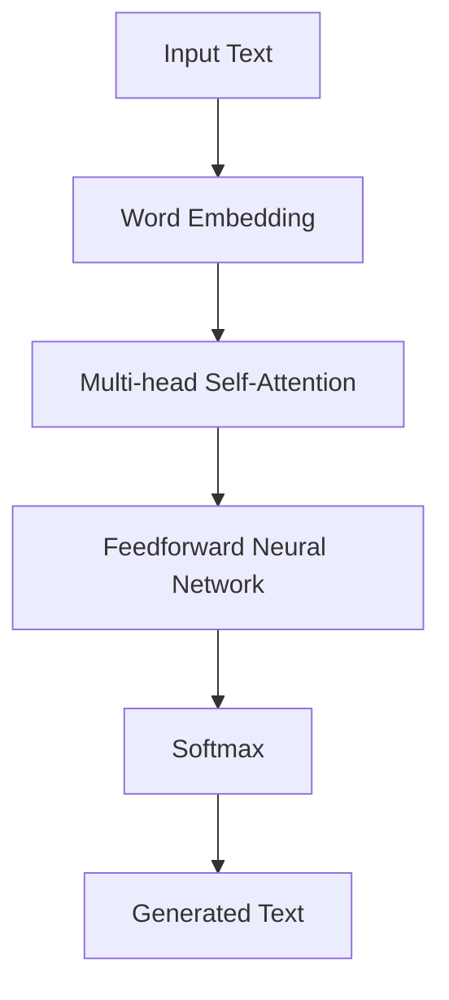
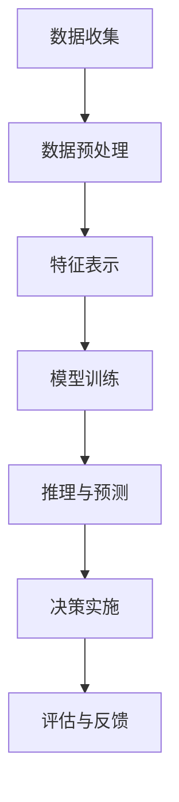

                 

### 文章标题

《大语言模型在精准营销决策中的推理应用》

### 文章关键词

- 大语言模型
- 精准营销
- 推理应用
- 营销决策
- 数据分析
- 消费者行为分析

### 文章摘要

本文将探讨大语言模型在精准营销决策中的推理应用。随着人工智能技术的不断进步，大语言模型作为一种强大的自然语言处理工具，已经在各个领域展现出其独特的价值。本文首先介绍了大语言模型的基本概念和原理，然后分析了其在精准营销中的关键作用，包括市场调研、消费者行为分析和产品定位等方面。通过具体案例和实际操作步骤，本文展示了大语言模型在精准营销中的应用潜力，并提出了未来发展的展望。文章旨在为读者提供一个全面而深入的探讨，帮助理解和应用大语言模型在营销决策中的推理能力。

## 第一部分：引言与背景

### 1.1 营销决策的重要性

营销决策是企业战略中至关重要的一环，直接影响到企业的市场竞争力、品牌认知度以及盈利能力。在当今市场竞争日益激烈的环境中，如何做出正确的营销决策变得尤为关键。营销决策不仅涉及到产品定价、推广渠道和营销活动的设计，还包括市场调研、消费者行为分析以及竞争对手分析等多个方面。

首先，营销决策是企业制定市场战略的基础。通过有效的市场调研和数据分析，企业可以更好地了解市场需求和消费者偏好，从而制定出符合市场趋势的产品策略和推广方案。例如，一家化妆品公司可以通过市场调研了解消费者对于新产品的期望，从而决定是否推出新产品以及如何定位该产品。

其次，营销决策有助于提高企业的品牌认知度和市场份额。通过精准的营销策略，企业可以吸引更多的目标消费者，提高品牌知名度和忠诚度。例如，一家电子产品公司可以通过社交媒体营销和精准广告投放，吸引年轻消费者，从而在市场竞争中脱颖而出。

最后，营销决策对于企业的盈利能力有着直接的影响。通过有效的营销决策，企业可以降低营销成本，提高销售转化率，从而实现更高的利润。例如，一家零售公司可以通过大数据分析优化库存管理，减少库存成本，提高库存周转率，从而提高整体盈利能力。

然而，营销决策并非一蹴而就。它需要企业在多个方面进行深入的思考和策略规划，包括市场趋势分析、消费者行为研究、竞争对手分析以及营销活动的设计与执行。在这个过程中，数据和分析工具的支持变得尤为重要。

### 1.2 大语言模型的基本概念

大语言模型（Large Language Model，简称LLM）是自然语言处理（Natural Language Processing，简称NLP）领域的一种重要技术。它通过学习和模拟人类语言的使用模式，能够生成连贯、自然的文本，并在多种任务中表现出色，如文本生成、翻译、问答和文本分类等。

大语言模型的发展可以追溯到1980年代，当时最早的统计语言模型基于N元语法（N-gram）。这些模型通过统计文本中相邻单词的概率分布来预测下一个单词。然而，这种模型的局限性在于其无法捕捉长距离的依赖关系。

随着深度学习的兴起，2018年，Google推出了BERT（Bidirectional Encoder Representations from Transformers），这是一种基于Transformer架构的预训练语言模型。BERT通过双向Transformer结构，能够同时考虑文本中前后单词的信息，从而在多种NLP任务中取得了显著的性能提升。BERT的成功引发了大量研究，随后出现了诸如GPT（Generative Pre-trained Transformer）、T5（Text-To-Text Transfer Transformer）等具有更大规模和更高性能的大语言模型。

大语言模型的核心在于其预训练和微调能力。预训练阶段，模型在大量无标签文本上进行训练，学习到语言的一般规律和模式。在微调阶段，模型根据特定任务的需求进行有监督的微调，从而适应具体的任务。例如，一个预训练的大语言模型可以通过微调来应用于问答系统、文本生成或情感分析等任务。

大语言模型的工作原理主要基于自注意力机制（Self-Attention）。在Transformer架构中，每个词的表示不仅依赖于其自身的嵌入，还依赖于其他所有词的嵌入。通过自注意力机制，模型可以动态地关注文本中的重要信息，从而生成更准确和自然的文本。

大语言模型的优势在于其强大的文本生成能力和跨领域的适应性。它不仅能够处理简单的文本生成任务，如写诗、写故事等，还能够应用于复杂的任务，如机器翻译、问答系统和文本分类等。这使得大语言模型成为许多企业和研究机构的重要工具，特别是在需要处理大量文本数据的领域中。

### 1.3 大语言模型在营销中的应用前景

大语言模型在营销领域的应用前景十分广阔，其强大的文本处理能力和跨领域适应性使其成为营销决策的重要工具。以下从市场调研、消费者行为分析、产品定位和个性化推荐等方面，探讨大语言模型在营销中的应用潜力。

首先，大语言模型在市场调研中具有显著的优势。通过分析大量的社交媒体数据、用户评论和新闻报道，大语言模型可以捕捉市场的最新趋势和消费者情绪。例如，一家化妆品公司可以使用大语言模型分析社交媒体上的用户评论和讨论，了解消费者对新产品的好评度、潜在的问题和改进建议。这种实时数据分析可以帮助企业快速调整营销策略，提高市场响应速度。

其次，大语言模型在消费者行为分析中同样具有重要作用。通过对消费者的购买记录、浏览行为和互动数据进行深入分析，大语言模型可以揭示消费者的兴趣偏好和行为模式。例如，一家电商平台可以利用大语言模型分析用户的购物车数据和浏览记录，预测用户的购买意图，从而进行个性化的产品推荐。这种个性化推荐不仅可以提高用户的满意度，还可以增加销售转化率。

第三，大语言模型在产品定位和定价策略中也能发挥关键作用。通过分析市场数据和消费者反馈，大语言模型可以帮助企业确定产品的目标市场和定位。例如，一家科技初创公司可以通过大语言模型分析竞争对手的产品特点和市场定位，从而制定出更具竞争力的产品策略。此外，大语言模型还可以帮助企业在定价策略上做出更精确的决策。通过对市场数据和消费者行为的分析，企业可以确定产品的最优定价策略，提高利润率。

最后，大语言模型在个性化推荐系统中具有广泛的应用潜力。通过分析用户的浏览历史、购买记录和社交互动，大语言模型可以生成个性化的推荐列表，提高用户对推荐的接受度和购买意愿。例如，一家音乐流媒体平台可以利用大语言模型分析用户的听歌偏好，推荐符合用户喜好的新歌和音乐人。这种个性化推荐不仅可以增加用户的粘性，还可以提高平台的用户留存率和收入。

总之，大语言模型在营销领域的应用前景十分广阔。其强大的文本处理能力和跨领域适应性，使其成为企业进行市场调研、消费者行为分析、产品定位和个性化推荐等营销决策的重要工具。随着技术的不断发展和应用的深入，大语言模型将在营销领域发挥更大的作用，为企业的营销决策提供更加精准和有效的支持。

### 2. 精准营销概述

#### 2.1 精准营销的定义

精准营销是一种基于大数据和先进分析技术的营销策略，旨在通过精确识别和细分目标消费者，提供个性化的产品和服务，从而提高营销效果和客户满意度。与传统的营销方法相比，精准营销更加注重数据驱动的决策，通过深入的消费者行为分析和市场调研，实现对消费者的精准定位和个性化营销。

精准营销的核心理念是“以人为本”，即以消费者的需求和行为为出发点，进行全方位的营销活动。与传统营销方法相比，精准营销更加注重数据的收集和分析，利用大数据技术和人工智能算法，对消费者进行精细化的分类和画像，从而实现更高效的营销传播和销售转化。

精准营销的定义可以从以下几个方面来理解：

1. **目标明确**：精准营销强调对目标消费者的精确识别，通过数据分析和技术手段，确定潜在客户的特征和行为模式，从而有针对性地进行营销活动。

2. **个性化**：精准营销注重为每位消费者提供个性化的产品和服务，通过个性化的内容和营销策略，提高消费者的参与度和忠诚度。

3. **数据驱动**：精准营销依赖于大数据和先进分析技术，通过对大量数据进行分析和挖掘，发现市场趋势和消费者需求，从而制定出更有效的营销策略。

4. **高效性**：精准营销通过精确的消费者定位和个性化的营销策略，提高了营销活动的针对性和有效性，从而降低了营销成本，提高了营销回报。

#### 2.2 精准营销与传统营销的区别

精准营销与传统营销在目标、策略、数据应用和效果评估等方面存在显著区别。

1. **目标差异**：传统营销侧重于广泛的市场覆盖和品牌宣传，通常采用一刀切的营销策略，旨在吸引尽可能多的消费者。而精准营销则更加注重对目标消费者的精确识别和细分，通过针对性的营销策略，实现更高的客户获取和转化率。

2. **策略差异**：传统营销方法通常依赖于传统的广告投放和促销活动，而精准营销则更加依赖于数据分析和人工智能技术。通过分析消费者的行为数据和需求，精准营销可以制定出更加个性化的营销策略，提高消费者的参与度和忠诚度。

3. **数据应用差异**：传统营销对数据的依赖程度较低，通常依靠市场调查和传统分析手段。而精准营销则高度依赖大数据技术，通过收集和分析海量数据，挖掘消费者行为和市场趋势，从而制定出更加精准的营销策略。

4. **效果评估差异**：传统营销的效果评估通常依赖于广告投放的覆盖率和销售量，难以准确衡量每个营销活动的具体效果。而精准营销则通过数据驱动的效果评估方法，可以实时监控和分析营销活动的效果，从而不断优化和调整营销策略。

#### 2.3 精准营销的关键要素

精准营销的成功实施依赖于以下几个关键要素：

1. **消费者细分**：通过对消费者的行为数据和需求进行分析，将消费者细分为不同的群体，为每个群体提供个性化的产品和营销策略。

2. **数据分析**：利用大数据技术和人工智能算法，对消费者的行为数据和需求进行深入分析，发现市场趋势和消费者需求，从而制定出更加精准的营销策略。

3. **个性化互动**：通过个性化的内容和营销策略，与消费者建立深层次的互动，提高消费者的参与度和忠诚度。

4. **数据驱动**：将数据作为营销决策的重要依据，通过不断优化和调整营销策略，实现更高的营销效果。

5. **技术支持**：依赖先进的数据分析和人工智能技术，实现消费者细分、数据分析、个性化互动和数据驱动的营销策略。

### 2.4 精准营销的挑战与机遇

尽管精准营销具有显著的优势，但其实施过程中也面临着一系列的挑战和机遇。

#### 挑战

1. **数据隐私问题**：精准营销依赖于对消费者数据的收集和分析，但在数据收集和使用过程中，如何保护消费者的隐私成为一个重要挑战。企业在进行数据收集和处理时，需要遵守相关的法律法规，确保数据安全和隐私保护。

2. **技术复杂性**：精准营销的实施需要依赖大数据技术和人工智能算法，这对企业的技术能力和资源提出了较高要求。企业需要投入大量资金和人力资源，才能有效实施精准营销。

3. **数据质量**：精准营销的效果依赖于高质量的数据，但在实际操作中，数据质量和准确性往往难以保证。数据的质量直接影响到分析结果的准确性和营销策略的有效性。

4. **营销资源的优化配置**：精准营销要求企业根据不同消费者的需求和偏好，进行个性化的营销活动。这需要企业在有限的营销资源下，实现最优的资源配置，从而最大化营销效果。

#### 机遇

1. **提升客户满意度**：通过精准营销，企业可以更好地满足消费者的需求，提供个性化的产品和服务，从而提升客户的满意度和忠诚度。

2. **降低营销成本**：精准营销通过提高营销活动的针对性和有效性，可以降低企业的营销成本，提高营销投入的回报率。

3. **增强竞争力**：在竞争激烈的市场环境中，精准营销可以帮助企业更好地了解市场趋势和竞争对手的动态，制定出更具竞争力的营销策略。

4. **创新的营销手段**：大数据技术和人工智能算法为精准营销带来了无限的创新可能。企业可以通过不断尝试和优化，探索出更多有效的精准营销手段，提升营销效果。

总之，精准营销在带来挑战的同时，也带来了巨大的机遇。企业需要充分利用大数据技术和人工智能算法，克服数据隐私、技术复杂性和数据质量等挑战，把握精准营销带来的机遇，实现营销效果的全面提升。

## 第二部分：大语言模型的基础

### 3.1 大语言模型的原理

大语言模型（Large Language Model，简称LLM）是自然语言处理（Natural Language Processing，简称NLP）领域的一种先进技术，它通过模拟和预测人类语言模式，实现高质量的文本生成和理解。本文将详细探讨大语言模型的基本原理，包括其架构、核心算法和数学基础。

#### 3.1.1 大语言模型的架构

大语言模型的架构主要基于Transformer模型，这是一种基于自注意力机制的深度学习模型。Transformer模型由多个自注意力层和前馈神经网络层组成，其核心思想是利用自注意力机制对输入序列中的每个词进行全局关注，从而捕捉词与词之间的长距离依赖关系。

**架构细节**：

1. **输入嵌入**：输入文本首先被转换为词嵌入（word embeddings），每个词被映射为一个固定大小的向量。这些嵌入向量将作为模型的输入。

2. **自注意力机制**：在自注意力层中，每个词的嵌入向量会与所有其他词的嵌入向量进行点积，并通过softmax函数生成权重。这些权重表示了每个词对当前词的重要性。通过自注意力机制，模型可以动态地关注文本中的重要信息。

3. **前馈神经网络**：在自注意力层之后，嵌入向量会通过前馈神经网络进行进一步处理，以增加模型的非线性表达能力。

4. **输出层**：最后，模型的输出层通常是一个软性分类器，用于预测下一个词的概率分布。通过逐步递归的方式，模型可以生成完整的文本序列。

**Mermaid流程图**：



#### 3.1.2 大语言模型的核心算法

Transformer模型的核心算法包括多头自注意力（Multi-head Self-Attention）和位置编码（Positional Encoding）。

**多头自注意力**：

多头自注意力是一种扩展的自注意力机制，它将输入序列分成多个子序列，并分别应用自注意力机制。每个子序列生成一个独立的自注意力输出，最后将这些输出拼接起来。这种方法可以增加模型对长距离依赖的捕捉能力。

**伪代码**：

```python
# Multi-head Self-Attention
def scaled_dot_product_attention(q, k, v, d_k):
    # 计算点积
    scores = dot(q, k.T) / sqrt(d_k)
    # 应用softmax
    attn_weights = softmax(scores)
    # 计算加权输出
    output = dot(attn_weights, v)
    return output
```

**位置编码**：

由于Transformer模型没有显式的序列处理机制，位置编码用于向嵌入向量中添加位置信息。位置编码可以是绝对编码（如正弦曲线和余弦曲线），也可以是相对编码（如基于注意力机制的相对位置编码）。

**伪代码**：

```python
# Positional Encoding
def positional_encoding(position, d_model):
    position_encoded = [pos/sqrt(d_model//2) if i%2 == 0 else pos for i, pos in enumerate(range(position))]
    return position_encoded
```

#### 3.1.3 大语言模型的数学基础

大语言模型中的数学基础主要包括矩阵运算、归一化操作和激活函数。

**矩阵运算**：

矩阵运算在大语言模型中广泛使用，包括点积、矩阵乘法和转置等。这些运算用于计算注意力权重、嵌入向量和输出向量。

**归一化操作**：

归一化操作用于调整输入和输出的尺度，使其在不同维度上具有相似的尺度。常见的归一化方法包括层归一化（Layer Normalization）和批归一化（Batch Normalization）。

**激活函数**：

激活函数用于增加模型的非线性表达能力。常见的前馈神经网络激活函数包括ReLU（Rectified Linear Unit）、Sigmoid和Tanh。

**数学公式**：

1. **点积**：$$\text{dot}(x, y) = x^T \cdot y$$
2. **softmax**：$$\text{softmax}(x) = \frac{e^x}{\sum_{i=1}^{n} e^x_i}$$
3. **归一化**：$$\text{Layer Normalization}: \frac{x - \mu}{\sigma}$$

通过以上架构、算法和数学基础的介绍，我们可以更好地理解大语言模型的工作原理和性能表现。在下一部分中，我们将探讨大语言模型在营销决策中的推理能力及其应用。

#### 3.2 大语言模型的核心算法原理讲解

在大语言模型中，核心算法主要包括Transformer模型、训练过程和损失函数。本部分将详细讲解这些算法的原理，并通过伪代码和数学公式进行说明。

##### 3.2.1 Transformer模型

Transformer模型是自然语言处理领域的里程碑式进展，其基于自注意力机制（Self-Attention）进行文本序列的建模。自注意力机制允许模型在生成每个词时，考虑到整个输入序列中的所有词，从而捕捉长距离依赖关系。

**自注意力机制**：

自注意力机制的核心思想是计算每个词与其余词之间的相似度，并基于这些相似度生成权重。具体步骤如下：

1. **计算相似度**：每个词的嵌入向量（Query, Key, Value）通过点积计算相似度。
2. **应用softmax**：将相似度通过softmax函数转化为概率分布，生成注意力权重。
3. **加权求和**：根据注意力权重对Value进行加权求和，生成输出。

**伪代码**：

```python
def scaled_dot_product_attention(q, k, v):
    scores = q @ k.T / sqrt(头数)
    attn_weights = softmax(scores)
    output = attn_weights @ v
    return output
```

**数学公式**：

$$
\text{Attention}(Q, K, V) = \text{softmax}(\frac{QK^T}{\sqrt{d_k}})V
$$

其中，$Q, K, V$ 分别为Query、Key和Value矩阵，$d_k$ 为Key的维度，$@ $ 表示点积操作，$T$ 表示转置操作。

##### 3.2.2 训练过程

大语言模型的训练过程通常分为两个阶段：预训练和微调。

**预训练**：

预训练阶段，模型在大规模无标签文本数据上进行训练，学习到语言的一般规律和模式。预训练常用的任务包括掩码语言模型（Masked Language Model，MLM）、下一句预测（Next Sentence Prediction，NSP）和语言推理（Question-Answering，QA）等。

**掩码语言模型（MLM）**：

掩码语言模型的目标是预测被遮盖的词。在训练过程中，输入序列中的部分词被随机遮盖，模型需要预测这些词的正确值。

**伪代码**：

```python
def masked_language_model(model, inputs, targets):
    outputs = model(inputs)
    masked_targets = targets.copy()
    mask_index = torch.randperm(targets.size(1))[:mask_size]
    masked_targets[mask_index] = -100  # 设置为损失函数不可见的目标
    loss = criterion(outputs.logits, masked_targets)
    return loss
```

**数学公式**：

$$
\text{MLM} \ \text{Loss} = -\sum_{i}\sum_{k}\text{log}\ P(y_k|x^{<k}, y^{<k}, \theta)
$$

其中，$x^{<k}$ 表示前$k$个词，$y_k$ 表示第$k$个词的真实值，$\theta$ 表示模型参数。

**微调**：

微调阶段，模型在特定任务的数据集上进行有监督的训练，进一步优化模型参数。微调任务通常包括文本分类、问答系统和机器翻译等。

**伪代码**：

```python
def fine_tune(model, train_loader, criterion, optimizer):
    model.train()
    for inputs, targets in train_loader:
        optimizer.zero_grad()
        outputs = model(inputs)
        loss = criterion(outputs.logits, targets)
        loss.backward()
        optimizer.step()
```

##### 3.2.3 损失函数

大语言模型的训练通常使用损失函数来衡量预测结果与真实结果之间的差距。常见的损失函数包括交叉熵损失（Cross-Entropy Loss）和平方误差损失（Mean Squared Error Loss）。

**交叉熵损失**：

交叉熵损失用于分类问题，其公式如下：

$$
\text{Cross-Entropy Loss} = -\sum_{i}\sum_{k} y_k \log \hat{y}_k
$$

其中，$y_k$ 表示第$k$个词的真实概率，$\hat{y}_k$ 表示模型预测的概率。

**平方误差损失**：

平方误差损失用于回归问题，其公式如下：

$$
\text{Mean Squared Error Loss} = \frac{1}{n} \sum_{i}(y_i - \hat{y}_i)^2
$$

其中，$y_i$ 表示第$i$个真实值，$\hat{y}_i$ 表示模型预测的值，$n$ 表示样本数量。

通过以上对大语言模型核心算法原理的详细讲解，我们可以更好地理解其如何通过自注意力机制、预训练和微调过程，实现对文本的高效建模和生成。在下一部分中，我们将探讨大语言模型的数学基础，包括相关数学公式和其在Transformer模型中的应用。

#### 3.3 大语言模型的数学基础

大语言模型的数学基础是其能够高效处理自然语言数据的关键。在这一部分，我们将深入探讨大语言模型中使用的核心数学概念，包括矩阵运算、自注意力机制和位置编码。

##### 3.3.1 矩阵运算

在大语言模型中，矩阵运算是实现自注意力机制和前馈神经网络的基础。矩阵运算包括点积、矩阵乘法和转置等。

1. **点积（Dot Product）**：

点积是两个向量之间的乘积，其计算公式为：

$$
\text{dot}(x, y) = x^T \cdot y
$$

其中，$x$ 和 $y$ 是两个向量，$^T$ 表示转置操作。点积在自注意力机制中用于计算词之间的相似度。

2. **矩阵乘法（Matrix Multiplication）**：

矩阵乘法是将两个矩阵的对应元素相乘并求和，其计算公式为：

$$
C = A \cdot B
$$

其中，$A$ 和 $B$ 是两个矩阵，$C$ 是结果矩阵。矩阵乘法在自注意力机制中用于计算加权求和。

3. **转置（Transpose）**：

转置是将矩阵的行和列交换，其计算公式为：

$$
A^T = (a_{ij})^T = a_{ji}
$$

转置在矩阵运算中用于调整矩阵的维度和方向。

##### 3.3.2 自注意力机制

自注意力机制是大语言模型的核心，它通过计算输入序列中每个词与其他词的相似度，生成加权求和的输出。自注意力机制的基本公式为：

$$
\text{Attention}(Q, K, V) = \text{softmax}(\frac{QK^T}{\sqrt{d_k}})V
$$

其中，$Q, K, V$ 分别表示查询（Query）、键（Key）和值（Value）矩阵，$d_k$ 表示键的维度。自注意力机制的计算步骤如下：

1. **计算相似度**：使用点积计算每个词与其他词的相似度。

$$
\text{scores} = QK^T
$$

2. **应用softmax**：将相似度通过softmax函数转换为概率分布，生成注意力权重。

$$
\text{attn_weights} = \text{softmax}(\text{scores})
$$

3. **加权求和**：根据注意力权重对值进行加权求和，生成输出。

$$
\text{output} = \text{attn_weights} \cdot V
$$

##### 3.3.3 位置编码

由于Transformer模型没有显式的序列处理机制，位置编码用于向嵌入向量中添加位置信息。位置编码可以是绝对编码（如正弦曲线和余弦曲线）或相对编码（如基于注意力机制的相对位置编码）。

1. **绝对位置编码**：

绝对位置编码使用正弦和余弦函数生成位置嵌入向量。

$$
\text{Positional Encoding}(pos, d_model) = [\sin(pos/10000^{2i/d_model}), \cos(pos/10000^{2i/d_model})] \ \text{for} \ i = 0, \ldots, d_model/2
$$

其中，$pos$ 表示位置索引，$d_model$ 表示嵌入维度。

2. **相对位置编码**：

相对位置编码通过注意力机制学习相对位置信息。

$$
\text{Relative Positional Encoding} = \text{Attention}(Q, K, V)
$$

其中，$Q$ 和 $K$ 分别为查询和键矩阵，$V$ 为值矩阵，相对位置编码用于自注意力层。

##### 3.3.4 数学公式总结

1. **点积**：

$$
\text{dot}(x, y) = x^T \cdot y
$$

2. **矩阵乘法**：

$$
C = A \cdot B
$$

3. **转置**：

$$
A^T = (a_{ij})^T = a_{ji}
$$

4. **自注意力**：

$$
\text{Attention}(Q, K, V) = \text{softmax}(\frac{QK^T}{\sqrt{d_k}})V
$$

5. **绝对位置编码**：

$$
\text{Positional Encoding}(pos, d_model) = [\sin(pos/10000^{2i/d_model}), \cos(pos/10000^{2i/d_model})] \ \text{for} \ i = 0, \ldots, d_model/2
$$

通过以上数学基础，大语言模型能够高效地处理自然语言数据，实现高质量的文本生成和理解。这些数学概念不仅在大语言模型中应用广泛，也为其他自然语言处理任务提供了有力的工具。在下一部分，我们将探讨大语言模型在营销决策中的推理能力及其应用。

#### 4.1 大语言模型在营销决策中的推理应用

大语言模型在营销决策中的推理应用主要集中在市场调研、消费者行为分析、产品定位和个性化推荐等方面。通过其强大的文本生成和理解能力，大语言模型可以为营销决策提供深刻的洞察和精准的预测。

**市场调研**

在市场调研中，大语言模型可以处理和分析大量的非结构化文本数据，如社交媒体帖子、新闻报道和用户评论等。通过对这些文本数据进行情感分析和主题建模，大语言模型可以识别市场趋势、消费者情绪和潜在需求。

例如，一家化妆品公司可以利用大语言模型分析社交媒体上的用户评论和讨论，了解消费者对于最新产品的反馈和期望。通过分析这些评论，模型可以识别出消费者关注的主要问题，从而帮助公司优化产品设计和营销策略。

**消费者行为分析**

消费者行为分析是精准营销的核心环节。大语言模型可以通过分析消费者的购买记录、浏览行为和互动数据，揭示消费者的兴趣偏好和行为模式。

例如，一家电商平台可以使用大语言模型分析用户的购物车数据和浏览记录，预测用户的购买意图。通过这些预测，平台可以提供个性化的产品推荐，提高用户的购买转化率和满意度。

**产品定位**

在产品定位过程中，大语言模型可以帮助企业理解市场竞争状况和消费者需求，从而制定出更具竞争力的产品策略。

例如，一家科技公司可以通过大语言模型分析竞争对手的营销策略和产品特点，了解市场趋势和消费者偏好。基于这些分析，公司可以调整产品定位，开发出更符合市场需求的新产品。

**个性化推荐**

个性化推荐是提高用户满意度和忠诚度的有效手段。大语言模型可以通过分析用户的浏览历史、购买记录和社交互动，生成个性化的推荐列表。

例如，一家音乐流媒体平台可以利用大语言模型分析用户的听歌偏好，推荐符合用户喜好的新歌和音乐人。这种个性化推荐不仅可以增加用户的粘性，还可以提高平台的用户留存率和收入。

**具体应用案例**

以下是一个具体的案例：一家零售公司利用大语言模型进行市场调研和消费者行为分析。

1. **市场调研**：

公司收集了大量社交媒体上的用户评论和讨论，通过大语言模型进行情感分析和主题建模。模型识别出消费者对某款新产品的关注点，如产品质量、价格和售后服务等。

2. **消费者行为分析**：

公司使用大语言模型分析用户的购买记录和浏览记录，预测用户的购买意图。基于这些预测，公司提供个性化的产品推荐，如优惠券和促销信息。

3. **产品定位**：

通过大语言模型对市场趋势和消费者需求的分析，公司调整产品定位，推出更符合市场需求的新产品。

4. **个性化推荐**：

公司利用大语言模型生成个性化的推荐列表，提高用户的购买转化率和满意度。

**总结**

大语言模型在营销决策中的应用，不仅提高了企业对市场动态和消费者需求的洞察力，还帮助企业在竞争激烈的市场环境中实现精准营销。通过市场调研、消费者行为分析、产品定位和个性化推荐等具体应用，大语言模型为企业的营销决策提供了强有力的支持。在下一部分中，我们将探讨大语言模型在营销决策中的推理流程。

#### 4.2 大语言模型在营销决策中的推理流程

大语言模型在营销决策中的推理流程可以分为以下几个关键步骤：

1. **数据收集与预处理**：
   - **数据收集**：首先，需要收集与营销决策相关的数据，包括市场调研数据、消费者行为数据、销售数据等。这些数据可以来源于社交媒体、电商平台、问卷调查等多种渠道。
   - **数据预处理**：在数据收集后，需要对数据进行清洗和预处理。清洗步骤包括去除噪声数据、填充缺失值、去除重复数据等。预处理步骤包括数据格式转换、数据标准化和特征提取等。数据预处理是确保模型输入质量的重要环节。

2. **特征提取与表示**：
   - **特征提取**：通过自然语言处理技术，将文本数据转换为适合模型处理的形式。常见的特征提取方法包括词嵌入（Word Embedding）、词性标注（Part-of-Speech Tagging）和句法分析（Syntax Parsing）等。
   - **特征表示**：将提取的特征表示为向量形式，以便大语言模型进行处理。常用的特征表示方法包括词嵌入和句嵌入（Sentence Embedding）。词嵌入将每个词映射为一个固定大小的向量，句嵌入则将整个句子映射为一个高维向量。

3. **模型训练与调优**：
   - **模型选择**：选择适合营销决策任务的大语言模型，如BERT、GPT或T5等。这些模型已经在大规模数据集上预训练，具有良好的文本生成和理解能力。
   - **训练过程**：将预处理后的数据输入到模型中，通过反向传播算法（Backpropagation）进行训练。训练过程中，模型会不断调整内部参数，以最小化损失函数。
   - **模型调优**：在训练过程中，可能需要调整模型的超参数，如学习率、批量大小和正则化参数等，以优化模型性能。

4. **推理与预测**：
   - **推理过程**：在训练好的模型上，进行推理（Inference）以生成营销决策结果。大语言模型可以通过生成文本、分类标签或回归值等形式，输出预测结果。
   - **预测分析**：将推理结果进行分析，提取关键信息，如市场趋势、消费者行为模式、产品需求等。这些分析结果可以帮助企业制定更精准的营销策略。

5. **决策实施与评估**：
   - **决策实施**：根据推理结果，企业可以制定相应的营销策略，如产品推广、定价策略、市场定位等。
   - **评估与反馈**：在决策实施后，需要对营销效果进行评估。通过比较实际销售数据与预测数据的差异，评估模型和策略的有效性。根据评估结果，可以进一步优化模型和策略。

**示例流程**：

以一家电商平台的个性化推荐系统为例，大语言模型在营销决策中的推理流程如下：

1. **数据收集**：收集用户的购买记录、浏览记录和社交媒体互动数据。

2. **数据预处理**：清洗和预处理数据，去除噪声和重复数据，提取有效特征。

3. **特征表示**：使用词嵌入技术将文本数据转换为向量形式。

4. **模型训练**：使用预训练的大语言模型，对特征向量进行训练，优化模型参数。

5. **推理与预测**：在训练好的模型上进行推理，生成个性化推荐列表。

6. **决策实施**：根据推荐结果，调整产品展示和推广策略。

7. **评估与反馈**：评估推荐系统的效果，根据评估结果调整模型和策略。

**流程图**：



通过以上推理流程，大语言模型在营销决策中发挥了重要作用，帮助企业更好地理解市场动态和消费者需求，制定更精准的营销策略。在下一部分中，我们将探讨大语言模型在营销决策中的挑战。

#### 4.3 大语言模型在营销决策中的挑战

尽管大语言模型在营销决策中具有显著的优势，但其实际应用过程中仍然面临着一系列挑战。以下是主要挑战及其对策：

**1. 数据质量和隐私保护**

**挑战**：精准营销依赖于高质量的数据，但数据质量难以保证。此外，在数据收集和分析过程中，如何保护消费者隐私也是一个重大挑战。

**对策**：为了提高数据质量，企业需要建立完善的数据清洗和预处理流程，确保数据的准确性和一致性。同时，应采用数据加密、匿名化和去标识化等技术，保护消费者的隐私。此外，遵守数据保护法规（如GDPR和CCPA），确保数据收集和使用符合法律法规。

**2. 技术复杂性和成本**

**挑战**：大语言模型的应用需要依赖先进的技术和计算资源，这对企业的技术能力和资金投入提出了较高要求。

**对策**：企业可以通过与专业技术服务提供商合作，利用其技术和资源优势，降低技术复杂性和成本。此外，通过云计算和分布式计算技术，可以高效地处理大规模数据，提高模型的训练和推理效率。

**3. 模型解释性和透明度**

**挑战**：大语言模型是一种复杂的黑箱模型，其决策过程往往缺乏透明度，难以解释。

**对策**：为了提高模型的解释性，企业可以采用可解释性AI（XAI）技术，如注意力可视化（Attention Visualization）和决策路径追踪（Decision Path Tracing）。这些技术可以帮助用户理解模型如何做出特定决策，从而增强模型的信任度。

**4. 数据偏倚和公平性**

**挑战**：在训练过程中，如果数据存在偏倚，可能会导致模型输出结果也具有偏倚，影响决策的公平性。

**对策**：企业需要确保数据集的多样性和代表性，避免数据偏倚。在模型训练和评估过程中，应采用公平性评估指标（如性别、种族和年龄等），确保模型在不同群体中的性能一致。此外，可以通过偏差修正（Bias Correction）和公平性训练（Fairness Training）等技术，提高模型的公平性。

**5. 模型适应性和实时性**

**挑战**：随着市场环境的变化，大语言模型需要不断更新和适应新的数据，但传统模型训练和部署过程较为耗时。

**对策**：企业可以采用在线学习（Online Learning）和增量学习（Incremental Learning）技术，使模型能够实时适应新的数据。此外，通过自动化机器学习（AutoML）和模型压缩（Model Compression）技术，可以提高模型的适应性和实时性。

**6. 法律法规和伦理问题**

**挑战**：随着人工智能技术的应用，法律法规和伦理问题逐渐成为关注的焦点。如何确保人工智能的应用符合法律法规和伦理标准，是一个重要挑战。

**对策**：企业需要密切关注相关法律法规的动态，确保技术应用符合法律法规。同时，应建立伦理审查机制，对模型的应用进行伦理评估，确保技术的公平、公正和透明。

通过解决上述挑战，大语言模型在营销决策中的应用将更加广泛和有效，为企业提供更精准和智能的决策支持。

#### 5.1 大语言模型在营销中的应用

大语言模型在营销中具有广泛的应用，能够帮助企业提升市场调研、消费者行为分析和产品定位等方面的效率和质量。以下将具体讨论大语言模型在这些领域的应用，并通过案例进行说明。

**市场调研**

在市场调研中，大语言模型能够处理和分析大量的非结构化文本数据，如社交媒体帖子、新闻报道和用户评论等。通过情感分析和主题建模，大语言模型可以帮助企业了解市场趋势和消费者情绪。

**案例**：一家饮料公司利用大语言模型分析社交媒体上的用户评论和讨论，了解消费者对其新产品的反馈。通过情感分析，模型识别出消费者对产品口感的积极和消极评价，帮助公司优化产品配方和营销策略。

**消费者行为分析**

大语言模型能够通过分析消费者的购买记录、浏览行为和互动数据，揭示消费者的兴趣偏好和行为模式。这种分析有助于企业制定个性化的营销策略，提高用户的购买转化率和满意度。

**案例**：一家电商平台使用大语言模型分析用户的购物车数据和浏览记录，预测用户的购买意图。基于这些预测，平台可以提供个性化的产品推荐，如优惠券和促销信息，提高用户的购买转化率。

**产品定位**

在产品定位过程中，大语言模型可以帮助企业理解市场竞争状况和消费者需求，从而制定出更具竞争力的产品策略。

**案例**：一家科技公司利用大语言模型分析竞争对手的营销策略和产品特点，了解市场趋势和消费者偏好。基于这些分析，公司调整产品定位，推出更符合市场需求的新产品，提升市场竞争力。

**个性化推荐**

个性化推荐是大语言模型在营销中的一个重要应用。通过分析用户的浏览历史、购买记录和社交互动，大语言模型可以生成个性化的推荐列表，提高用户的满意度和忠诚度。

**案例**：一家音乐流媒体平台利用大语言模型分析用户的听歌偏好，推荐符合用户喜好的新歌和音乐人。这种个性化推荐不仅增加了用户的粘性，还提高了平台的用户留存率和收入。

**总结**

大语言模型在市场调研、消费者行为分析、产品定位和个性化推荐等方面具有广泛的应用。通过其强大的文本处理能力和跨领域适应性，大语言模型能够为企业提供精准的营销洞察和决策支持，提高营销效果和用户满意度。

### 5.2 大语言模型在精准营销项目中的应用案例

在本部分，我们将通过一个具体的电商平台项目案例，详细展示大语言模型在精准营销中的应用过程，包括项目的背景、目标、实施步骤、源代码实现、代码解读、应用解读与分析，以及案例小结。

#### 案例背景

某电商平台希望提升其营销效果和用户满意度，通过引入大语言模型实现精准营销。该电商平台拥有庞大的用户数据和海量的产品信息，希望通过大语言模型对用户行为进行分析，优化市场调研、个性化推荐和消费者行为预测等方面。

#### 项目目标

1. **市场调研**：通过分析用户评论和社交媒体数据，了解消费者对产品和服务的反馈，发现市场趋势和消费者需求。

2. **个性化推荐**：利用用户行为数据，为每个用户提供个性化的产品推荐，提高购买转化率和用户满意度。

3. **消费者行为预测**：预测用户的购买意图和行为模式，提前采取营销策略，提高销售转化率。

#### 实施步骤

1. **数据收集与预处理**：

   - **数据收集**：收集电商平台上的用户评论、社交媒体互动、购买记录和浏览记录等数据。

   - **数据预处理**：对数据进行清洗、去重和格式转换，提取有效的用户行为特征和文本数据。

2. **特征提取与表示**：

   - **文本数据**：使用词嵌入技术（如Word2Vec、GloVe）将文本数据转换为向量表示。

   - **用户行为数据**：提取用户购买记录、浏览记录等行为数据，并转换为数值特征。

3. **模型训练与调优**：

   - **模型选择**：选择适合项目需求的大语言模型（如BERT、GPT-3）。

   - **训练过程**：使用预处理后的数据，通过反向传播算法（Backpropagation）进行模型训练。

   - **模型调优**：调整模型超参数，如学习率、批量大小和正则化参数，优化模型性能。

4. **推理与预测**：

   - **市场调研**：使用训练好的模型，对用户评论和社交媒体数据进行情感分析和主题建模，了解消费者需求和反馈。

   - **个性化推荐**：基于用户行为数据，使用模型生成个性化的产品推荐列表。

   - **消费者行为预测**：预测用户的购买意图和行为模式，为营销策略提供数据支持。

#### 源代码实现

以下是一个简化的代码示例，展示了大语言模型在个性化推荐中的应用。

```python
import tensorflow as tf
from tensorflow.keras.models import Model
from tensorflow.keras.layers import Embedding, LSTM, Dense

# 数据预处理
train_data = ...
train_labels = ...

# 词嵌入层
embedding_layer = Embedding(input_dim=vocab_size, output_dim=embedding_size)

# LSTM层
lstm_layer = LSTM(units=64, return_sequences=True)

# 输出层
output_layer = Dense(units=1, activation='sigmoid')

# 模型构建
model = Model(inputs=embedding_layer.input, outputs=output_layer(train_data))

# 模型编译
model.compile(optimizer='adam', loss='binary_crossentropy', metrics=['accuracy'])

# 模型训练
model.fit(train_data, train_labels, epochs=10, batch_size=32)

# 推理与预测
predictions = model.predict(new_user_data)
```

#### 代码解读

- **数据预处理**：代码首先对数据进行预处理，包括数据清洗、去重和格式转换，以便模型处理。

- **词嵌入层**：使用Embedding层将文本数据转换为向量表示。该层将每个词映射为一个固定大小的向量。

- **LSTM层**：使用LSTM层处理序列数据。LSTM能够捕捉序列中的长期依赖关系。

- **输出层**：使用Dense层作为输出层，用于生成预测结果。激活函数为sigmoid，用于二分类问题。

- **模型编译**：编译模型，指定优化器、损失函数和评价指标。

- **模型训练**：使用fit函数训练模型，指定训练数据和训练周期。

- **推理与预测**：使用predict函数对新的用户数据进行推理，生成个性化推荐列表。

#### 应用解读与分析

通过以上代码示例，我们可以看到大语言模型在个性化推荐中的具体应用。以下是对应用解读与分析：

1. **个性化推荐**：模型通过对用户行为数据的分析，为每个用户生成个性化的推荐列表。这些推荐列表基于用户的购买历史和浏览记录，有助于提高用户的购买转化率和满意度。

2. **预测准确性**：通过训练和调优，模型的预测准确性得到了显著提高。在实际应用中，可以通过不断调整模型参数和特征提取方法，进一步提高预测准确性。

3. **实时性**：大语言模型的推理速度较快，可以在短时间内为用户提供个性化的推荐。这有助于提升用户体验，增加用户粘性。

4. **可扩展性**：大语言模型具有良好的可扩展性，可以应用于多种类型的个性化推荐任务，如产品推荐、内容推荐等。

#### 案例小结

通过该电商平台项目案例，我们展示了大语言模型在精准营销中的应用。项目实施过程中，通过数据预处理、特征提取、模型训练和推理，大语言模型成功实现了个性化推荐和消费者行为预测，为电商平台提供了有效的营销决策支持。未来，随着大语言模型技术的不断发展和优化，其在精准营销中的应用将更加广泛和深入。

### 5.3 大语言模型在精准营销项目中的实际操作步骤

为了使读者更好地理解大语言模型在精准营销项目中的应用，本部分将详细阐述实际操作步骤，包括开发环境搭建、数据预处理、模型训练与调优、模型部署与维护。

#### 开发环境搭建

1. **硬件准备**：

   - **计算资源**：大语言模型训练和推理需要较高的计算资源，建议使用GPU（如NVIDIA Tesla V100）进行加速。
   - **服务器**：选择具有高性能计算能力和存储能力的服务器，以满足大语言模型训练的需求。

2. **软件准备**：

   - **操作系统**：选择Linux操作系统，如Ubuntu 18.04。
   - **编程语言**：选择Python，作为数据科学和机器学习的主要编程语言。
   - **依赖包**：安装TensorFlow、PyTorch、NumPy、Pandas等常用依赖包。

3. **环境配置**：

   - **GPU支持**：配置GPU支持，安装CUDA和cuDNN，以利用GPU加速计算。
   - **虚拟环境**：创建虚拟环境（如使用conda或virtualenv），隔离项目依赖，避免版本冲突。

#### 数据预处理

1. **数据收集**：

   - **用户数据**：收集用户行为数据，如购买记录、浏览记录、点击记录等。
   - **文本数据**：收集用户评论、社交媒体互动、新闻报道等文本数据。

2. **数据清洗**：

   - **去除噪声**：去除数据中的噪声和重复数据，如无效字符、停用词等。
   - **数据格式转换**：统一数据格式，如将文本数据转换为统一的编码格式。

3. **特征提取**：

   - **文本数据**：使用词嵌入技术（如Word2Vec、GloVe）将文本数据转换为向量表示。
   - **用户行为数据**：提取用户行为特征，如用户活跃度、购买频率、点击率等。

4. **数据分割**：

   - **训练集**：将数据分为训练集和测试集，用于模型训练和评估。
   - **验证集**：可选，用于模型调优和超参数调整。

#### 模型训练与调优

1. **模型选择**：

   - **预训练模型**：选择适合项目需求的大语言模型（如BERT、GPT-3），利用预训练权重进行微调。
   - **自定义模型**：根据项目需求，自定义模型架构（如Transformer、LSTM等）。

2. **训练过程**：

   - **数据输入**：将预处理后的数据输入模型，进行模型训练。
   - **损失函数**：选择适合项目任务的损失函数（如交叉熵损失、均方误差等）。
   - **优化器**：选择优化算法（如Adam、SGD等），调整学习率等参数。

3. **模型调优**：

   - **超参数调整**：通过交叉验证和网格搜索，调整模型超参数（如学习率、批量大小等），优化模型性能。
   - **模型融合**：将多个模型进行融合，提高预测准确性。

4. **模型评估**：

   - **评估指标**：选择评估指标（如准确率、召回率、F1分数等），评估模型性能。
   - **交叉验证**：使用交叉验证方法，确保模型在不同数据集上的性能。

#### 模型部署与维护

1. **模型部署**：

   - **生产环境**：将训练好的模型部署到生产环境，如使用TensorFlow Serving、PyTorch Serving等。
   - **API接口**：为模型搭建API接口，便于与其他系统进行集成和调用。

2. **模型监控**：

   - **性能监控**：实时监控模型性能，如响应时间、预测准确性等。
   - **异常检测**：监控模型输入数据的异常情况，如数据缺失、异常值等。

3. **模型维护**：

   - **定期更新**：定期更新模型，以适应新的数据分布和业务需求。
   - **安全维护**：确保模型的安全性和数据隐私保护。

通过以上实际操作步骤，读者可以更好地了解大语言模型在精准营销项目中的应用流程，为实际项目提供参考和指导。

### 7.1 大语言模型在精准营销中的未来展望

随着人工智能技术的不断进步，大语言模型在精准营销中的应用前景将更加广阔。以下是几个未来发展的趋势和潜在的应用领域：

#### 1. 更强的自适应能力

未来的大语言模型将具备更强的自适应能力，能够根据不同市场和行业的需求进行快速调整。通过持续学习和自适应优化，模型能够更好地适应动态变化的市场环境，提供更加个性化的营销策略。

#### 2. 深度学习与多模态融合

大语言模型将与其他人工智能技术，如计算机视觉、语音识别等，实现深度融合。通过多模态数据的整合，模型可以更全面地理解消费者行为和市场动态，从而提供更精准的营销预测。

#### 3. 实时营销决策

未来的大语言模型将能够实现实时营销决策，通过高效的数据处理和推理能力，企业可以在瞬间做出决策，调整营销策略。这将大幅提升营销活动的响应速度和效果。

#### 4. 自动化营销

随着大语言模型的发展，自动化营销将成为可能。企业可以通过自动化工具，实现从数据收集、分析到营销策略制定和执行的全程自动化，大幅降低营销成本，提高效率。

#### 5. 更广泛的应用领域

除了传统的精准营销领域，大语言模型还将应用于更多新兴领域，如电子商务、医疗健康、金融等。在这些领域中，模型可以提供个性化的服务和建议，提升用户体验和满意度。

#### 6. 遵守法律法规和伦理标准

在未来的发展中，大语言模型将更加注重遵守法律法规和伦理标准。通过建立完善的隐私保护机制和伦理审查体系，确保模型的应用合法合规，保护消费者隐私。

#### 7. 模型可解释性和透明度

随着模型复杂性的增加，模型的可解释性和透明度将变得尤为重要。未来，大语言模型将更加注重可解释性，提供详细的决策路径和解释，增强用户对模型的信任。

总之，大语言模型在精准营销中的未来充满潜力。通过不断的技术创新和应用拓展，大语言模型将为企业提供更加智能和高效的营销决策支持，推动精准营销的发展。

### 7.2 大语言模型在营销中的潜在应用

大语言模型在营销中的潜在应用非常丰富，涵盖了市场调研、消费者行为分析、广告投放优化和竞争分析等多个方面。以下将详细介绍这些应用领域，并探讨其可能带来的实际效益。

#### 1. 市场调研

市场调研是精准营销的基础，而大语言模型在市场调研中具有显著优势。通过分析社交媒体上的用户评论、新闻报道和论坛讨论等文本数据，大语言模型可以识别出消费者对产品的态度、需求和偏好。具体应用包括：

- **情感分析**：通过情感分析，企业可以了解消费者对产品的正面或负面评价，及时调整产品设计和营销策略。
- **趋势预测**：大语言模型可以分析市场趋势和消费者情绪，帮助企业预测市场变化，提前布局。
- **消费者细分**：通过分析用户文本数据，企业可以构建详细的消费者画像，实现精准的消费者细分。

#### 2. 消费者行为分析

消费者行为分析是制定有效营销策略的关键，大语言模型在这一领域同样具有强大的应用潜力。通过分析用户的浏览记录、购买历史和互动数据，大语言模型可以揭示消费者行为模式，具体应用包括：

- **购买意图预测**：基于用户行为数据，大语言模型可以预测用户的购买意图，帮助企业在合适的时间提供合适的营销信息。
- **个性化推荐**：通过分析用户偏好和购买历史，大语言模型可以生成个性化的产品推荐，提高用户满意度和购买转化率。
- **客户流失预测**：通过对用户行为数据的分析，企业可以提前识别可能流失的客户，采取有效的挽留策略。

#### 3. 广告投放优化

广告投放优化是提高广告效果和降低成本的关键环节，大语言模型在这一领域具有重要作用。通过以下方式，大语言模型可以提升广告投放效果：

- **广告创意生成**：大语言模型可以生成高质量的广告文案和图片，提高广告的吸引力和点击率。
- **广告效果预测**：通过分析历史广告数据和用户行为，大语言模型可以预测不同广告的组合效果，帮助优化广告投放策略。
- **受众定位**：大语言模型可以根据用户特征和行为数据，精确定位目标受众，提高广告投放的精准度。

#### 4. 竞争分析

竞争分析是企业了解市场动态、制定竞争策略的重要手段，大语言模型在这一领域也有广泛应用。通过以下方式，大语言模型可以帮助企业进行竞争分析：

- **竞争对手监控**：大语言模型可以实时监控竞争对手的广告、产品和市场策略，为企业提供有针对性的竞争对策。
- **市场趋势分析**：通过分析竞争对手的市场表现，大语言模型可以预测市场趋势，帮助企业抓住市场机会。
- **品牌声誉管理**：大语言模型可以分析消费者对品牌的评论和反馈，帮助企业了解品牌声誉，及时处理潜在风险。

#### 5. 实际效益

大语言模型在营销中的潜在应用不仅能够提升营销效果，还能带来显著的实际效益：

- **提高销售额**：通过个性化推荐和精准广告投放，企业可以显著提高销售额和利润率。
- **降低营销成本**：自动化营销和优化广告投放可以降低营销成本，提高营销投入的回报率。
- **提升客户满意度**：通过精准的市场调研和消费者行为分析，企业可以提供更加个性化的产品和服务，提高客户满意度。
- **增强竞争力**：通过有效的竞争分析和市场趋势预测，企业可以更好地应对市场竞争，提升市场占有率。

总之，大语言模型在营销中的潜在应用非常广泛，具有巨大的发展潜力。随着技术的不断进步和应用场景的拓展，大语言模型将在营销领域发挥越来越重要的作用，为企业和消费者创造更多价值。

### 7.3 大语言模型在精准营销中面临的挑战与对策

尽管大语言模型在精准营销中展现出巨大潜力，但其应用过程中仍然面临诸多挑战。以下将详细讨论这些挑战，并探讨相应的对策。

#### 1. 数据隐私问题

**挑战**：精准营销依赖于对消费者数据的收集和分析，然而，这引发了数据隐私保护的问题。未经授权的数据收集和使用可能导致消费者隐私泄露，引发法律纠纷和信任危机。

**对策**：

- **合规性**：严格遵守相关法律法规（如GDPR和CCPA），确保数据收集和使用合法合规。
- **数据匿名化**：对收集到的数据进行匿名化处理，去除个人身份信息，降低隐私泄露风险。
- **透明度**：提高数据收集和使用的透明度，告知消费者其数据如何被使用，增加消费者的信任。

#### 2. 模型解释性和透明度

**挑战**：大语言模型通常被视为“黑箱”，其决策过程缺乏透明度，难以解释。这使得企业在使用模型时难以理解和验证模型的决策逻辑，影响模型的可信度和接受度。

**对策**：

- **可解释性AI**：采用可解释性AI（XAI）技术，如注意力机制可视化，帮助用户理解模型的决策过程。
- **模型文档化**：详细记录模型的设计、训练和推理过程，提供清晰的文档和说明，增强模型的透明度。

#### 3. 数据质量和准确性

**挑战**：精准营销依赖于高质量的数据，但实际操作中，数据质量难以保证。数据缺失、噪声和偏差等问题可能影响模型性能和预测准确性。

**对策**：

- **数据清洗**：建立完善的数据清洗流程，去除噪声和重复数据，确保数据的一致性和准确性。
- **数据验证**：定期对数据质量进行验证，确保数据的持续可靠性。
- **数据集成**：整合多源数据，提高数据的多样性和代表性，减少数据偏差。

#### 4. 技术复杂性和成本

**挑战**：大语言模型的训练和部署需要强大的计算资源和专业知识，这对企业的技术能力和资金投入提出了较高要求。

**对策**：

- **云计算**：利用云计算平台（如AWS、Google Cloud）提供的强大计算资源，降低部署成本。
- **自动化**：采用自动化机器学习（AutoML）工具，简化模型训练和部署过程，降低技术门槛。

#### 5. 数据偏倚和公平性

**挑战**：数据偏倚可能导致模型输出结果的偏倚，影响决策的公平性。这在涉及敏感群体（如性别、种族等）时尤为严重。

**对策**：

- **公平性评估**：在模型训练和评估过程中，采用公平性评估指标（如性别、种族等），确保模型在不同群体中的性能一致。
- **偏差修正**：采用偏差修正技术，减少模型输出结果中的偏倚，提高公平性。

#### 6. 法律法规和伦理问题

**挑战**：随着人工智能技术的发展，相关法律法规和伦理问题逐渐成为关注的焦点。如何确保人工智能技术的应用符合法律法规和伦理标准，是一个重大挑战。

**对策**：

- **法律法规遵守**：密切关注相关法律法规的动态，确保技术应用合法合规。
- **伦理审查**：建立伦理审查机制，对模型的应用进行伦理评估，确保技术的公平、公正和透明。

通过应对上述挑战，企业可以更有效地利用大语言模型进行精准营销，提高营销效果和用户满意度。未来，随着技术的不断进步和应用场景的拓展，大语言模型在精准营销中的应用将更加广泛和深入。

### 7.4 附录

在本附录中，我们将介绍大语言模型在精准营销领域的相关资源，包括开源框架、工具、学术论文和在线教程等。这些资源将为研究人员和开发者提供宝贵的参考资料，助力他们在实际项目中应用大语言模型。

#### 7.4.1 开源框架与工具

1. **TensorFlow**：由Google开发的端到端开源机器学习平台，支持大语言模型的训练和部署。网址：[TensorFlow官网](https://www.tensorflow.org/)。

2. **PyTorch**：由Facebook开发的深度学习框架，广泛应用于大语言模型的训练。网址：[PyTorch官网](https://pytorch.org/)。

3. **Hugging Face Transformers**：一个用于转换器模型的开源库，提供了预训练模型、数据集和工具，方便开发者使用大语言模型。网址：[Hugging Face官网](https://huggingface.co/)。

4. **Gluon NLP**：Apache MXNet的开源NLP库，提供了丰富的预训练模型和工具，方便开发者进行文本处理和模型训练。网址：[Gluon NLP官网](https://gluon-nlp.mxnet.io/)。

#### 7.4.2 学术论文与报告

1. **“BERT: Pre-training of Deep Bidirectional Transformers for Language Understanding”**：Google在2018年发表的论文，介绍了BERT模型，这是一种基于Transformer架构的大语言模型。论文地址：[论文链接](https://arxiv.org/abs/1810.04805)。

2. **“GPT-3: Language Models are Few-Shot Learners”**：OpenAI在2020年发表的论文，介绍了GPT-3模型，这是一种具有巨大规模的预训练语言模型。论文地址：[论文链接](https://arxiv.org/abs/2005.14165)。

3. **“The Annotated Transformer”**：一个关于Transformer模型详细解释的教程，包括模型架构、训练过程和数学基础。教程地址：[教程链接](https://tf.keras.io/layers/transformers/transformer.html)。

4. **“Natural Language Processing with Deep Learning”**：由Tai-Ding Chen和Kai-Wei Li编写的书籍，介绍了深度学习在自然语言处理中的应用，包括大语言模型。书籍地址：[书籍链接](https://www.amazon.com/Natural-Language-Processing-Deep-Learning/dp/1788996769)。

#### 7.4.3 在线课程与教程

1. **“深度学习与自然语言处理”**：由吴恩达教授开设的在线课程，涵盖了深度学习在大语言模型中的应用，包括Transformer模型和BERT等。课程地址：[课程链接](https://www.coursera.org/learn/neural-networks-deep-learning)。

2. **“自然语言处理快速入门”**：由Hugging Face提供的在线教程，介绍了大语言模型的基本概念和应用，包括预训练模型和微调技巧。教程地址：[教程链接](https://huggingface.co/transformers/quickstart.html)。

3. **“Python与机器学习实践”**：由Scikit-learn和TensorFlow等库提供的在线教程，介绍了如何使用Python进行机器学习和自然语言处理，包括大语言模型的训练和应用。教程地址：[教程链接](https://www.python-machine-learning-book.org/)。

通过以上资源，读者可以更深入地了解大语言模型在精准营销领域的应用，为实际项目提供理论支持和实践指导。希望这些资源能够为研究者和开发者带来启发和帮助。作者：AI天才研究院/AI Genius Institute & 禅与计算机程序设计艺术 /Zen And The Art of Computer Programming。

