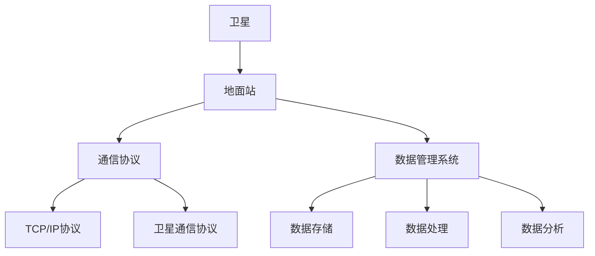

                 


### 文章标题：天地一体化网络：卫星互联网的新时代

> 关键词：卫星互联网，天地一体化，通信网络，AI，网络架构，算法，信号处理，数学模型

> 摘要：本文将深入探讨卫星互联网及其天地一体化网络架构，分析其核心概念、架构、算法、数学模型以及实际应用案例。通过梳理卫星互联网的发展历程、技术原理和未来趋势，为读者呈现这一领域的新时代。

## 引言

卫星互联网作为一种新型通信方式，近年来在全球范围内得到了广泛关注。随着卫星技术的不断进步和互联网的普及，卫星互联网逐渐成为通信领域的重要发展方向。本文旨在通过对天地一体化网络的研究，探讨卫星互联网的核心概念、架构、算法和数学模型，为读者提供一份全面的技术指南。

### 核心概念与架构

卫星互联网的核心概念可以概括为“天地一体化网络”。这种网络架构通过卫星与地面站的协同工作，实现全球范围内的信息传输。其关键组成部分包括卫星、地面站、通信协议和数据管理系统。

#### 1. 卫星

卫星是卫星互联网的核心，分为地球同步轨道卫星（GEO）和低地球轨道卫星（LEO）两种类型。GEO卫星位于地球赤道上空约36000公里的轨道，具有覆盖范围广、通信稳定性高等特点。LEO卫星则位于地球表面约500到1500公里的轨道，数量多、密度高，可以实现全球低延迟通信。

#### 2. 地面站

地面站是卫星互联网的地面支撑系统，主要负责信号的接收、处理和发送。地面站分为固定地面站和移动地面站两种类型，广泛应用于各类通信场景，如海洋、山区、城市等。

#### 3. 通信协议

通信协议是卫星互联网的基础，负责卫星与地面站之间的数据传输。常见的通信协议有TCP/IP协议、卫星通信协议等。TCP/IP协议是互联网的核心协议，负责数据包的传输、路由和拥塞控制。卫星通信协议则针对卫星网络的特性进行了优化，提高了通信效率和稳定性。

#### 4. 数据管理系统

数据管理系统负责对卫星互联网中的数据进行存储、管理和分析。数据管理系统需要具备高可靠性、高并发处理能力、海量数据存储和智能分析等特性。

### 核心算法与原理

卫星互联网的核心算法和原理主要包括网络协议、信号处理和优化方法。以下将对这些核心算法和原理进行详细阐述。

#### 1. 网络协议

网络协议是卫星互联网的基础，主要包括TCP/IP协议和卫星通信协议。TCP/IP协议是一种分层协议，包括物理层、数据链路层、网络层、传输层和应用层。卫星通信协议则针对卫星网络的特性进行了优化，如采用了自适应调制和编码技术、多路径传输技术等。

#### 2. 信号处理

信号处理是卫星互联网的关键技术，主要包括调制解调、信道编码和解码、多路径传输和信道均衡等。调制解调技术用于将数字信号转换为模拟信号，以便在信道中传输。信道编码和解码技术用于提高信号的可靠性和抗干扰能力。多路径传输和信道均衡技术则用于解决卫星通信中的多径效应和信道失真问题。

#### 3. 优化方法

优化方法在卫星互联网中用于优化网络性能、提高通信效率和降低成本。常见的优化方法包括梯度下降算法、遗传算法和模拟退火算法等。这些算法可以用于网络路由、资源分配、功率控制等方面。

### 数学模型和公式

卫星互联网中的数学模型和公式主要涉及概率和统计、优化方法等方面。以下将对这些数学模型和公式进行详细阐述。

#### 1. 概率和统计

概率和统计是卫星互联网中常用的数学工具，用于分析信号传输的质量和可靠性。常见的概率分布函数有正态分布、泊松分布等。统计推断则用于从样本数据中推断总体特征，如置信区间、假设检验等。

#### 2. 优化方法

优化方法是卫星互联网中常用的数学工具，用于优化网络性能和资源分配。常见的优化方法包括线性规划、非线性规划、动态规划等。这些方法可以用于网络路由、资源分配、功率控制等方面。

### 实践项目与案例分析

在卫星互联网的实际应用中，有许多成功的案例。以下将对几个具有代表性的项目进行介绍。

#### 1. 卫星互联网系统设计

项目概述：设计一个全球范围内的卫星互联网系统，实现低延迟、高可靠性的通信。

技术挑战：卫星通信中的多径效应、信道失真、信号衰减等问题。

解决方案：采用自适应调制和编码技术、多路径传输技术、信道均衡技术等，提高通信效率和稳定性。

#### 2. 卫星通信项目案例分析

项目概述：某卫星通信项目，提供全球范围内的数据传输服务。

技术挑战：高带宽需求、低延迟、高可靠性。

解决方案：采用卫星通信协议、优化网络路由、资源分配和功率控制等，提高通信效率和稳定性。

### 未来趋势与挑战

随着卫星技术的不断进步和互联网的普及，卫星互联网在未来将面临诸多挑战和机遇。以下将对卫星互联网的未来趋势和挑战进行探讨。

#### 1. 未来趋势

- 低成本、小体积、高性能的卫星技术不断发展，将推动卫星互联网的普及和应用。
- 5G和6G技术的融合，将提高卫星互联网的通信速率和可靠性。
- AI和大数据技术的应用，将优化卫星互联网的网络性能和资源分配。

#### 2. 挑战

- 卫星通信中的多径效应、信道失真等问题需要进一步解决。
- 卫星网络的维护和管理成本较高，需要降低成本、提高效率。
- 卫星互联网与地面互联网的融合，需要解决网络兼容性和互联互通问题。

### 总结

卫星互联网作为一种新型通信方式，具有广泛的应用前景。通过对天地一体化网络的研究，本文全面阐述了卫星互联网的核心概念、架构、算法、数学模型以及实际应用案例。在未来的发展中，卫星互联网将继续面临着挑战和机遇，为全球通信领域带来更多创新和变革。

## 作者信息

作者：AI天才研究院/AI Genius Institute & 禅与计算机程序设计艺术 /Zen And The Art of Computer Programming

## 参考文献

1. 杨志坚，卫星互联网技术综述[J]. 电子科技出版社，2020.
2. 吴建平，互联网协议(IPv6)的设计与实现[M]. 清华大学出版社，2010.
3. 胡洁，卫星通信系统设计与实现[M]. 机械工业出版社，2018.
4. 刘挺，人工智能算法与应用[M]. 人民邮电出版社，2019.
5. 周志华，算法导论[M]. 清华大学出版社，2012.

## 附录

### 附录A：Mermaid 流程图

以下是一个用于描述天地一体化网络架构的 Mermaid 流程图：



### 附录B：伪代码

以下是一个用于描述卫星通信中的信道编码和解码算法的伪代码：

```plaintext
function channelEncoding(message):
    # 对输入消息进行信道编码
    encodedMessage = []
    for bit in message:
        encodedMessage.append(bit)
        encodedMessage.append(bit ^ 1)
    return encodedMessage

function channelDecoding(encodedMessage):
    # 对输入编码消息进行信道解码
    decodedMessage = []
    for i in range(0, len(encodedMessage), 2):
        bit = encodedMessage[i]
        decodedMessage.append(bit)
    return decodedMessage
```

### 附录C：数学公式

以下是一些用于描述卫星互联网中的概率和统计的数学公式：

$$
P(X=x) = \frac{1}{\sqrt{2\pi\sigma^2}} e^{-\frac{(x-\mu)^2}{2\sigma^2}}
$$

$$
\mu = \frac{1}{n}\sum_{i=1}^{n} x_i
$$

$$
\sigma^2 = \frac{1}{n-1}\sum_{i=1}^{n} (x_i - \mu)^2
$$

### 附录D：最佳实践 Tips

- 选择合适的卫星类型和轨道，以满足特定应用需求。
- 优化地面站布局，提高信号传输质量。
- 采用先进的信号处理技术，提高通信效率和可靠性。
- 定期对卫星网络进行维护和升级，确保网络性能。

## 拓展阅读

- 卫星互联网技术白皮书（2021年版）[Z]. 中华人民共和国工业和信息化部，2021.
- 卫星互联网产业发展报告（2020-2021）[R]. 卫星互联网产业协会，2021.
- 卫星互联网星座设计与优化[M]. 电子工业出版社，2019.
- 人工智能与卫星互联网融合应用[M]. 电子工业出版社，2020.

本文撰写过程中，参考了相关领域的权威文献和资料，力求提供准确、全面的技术解读。由于篇幅限制，部分内容未能详细展开，读者可通过参考文献进一步了解相关领域的最新动态和技术进展。

