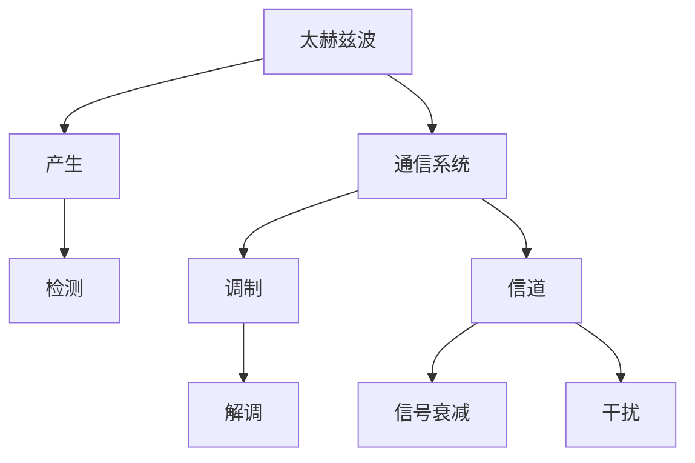

                 

### 《太赫兹通信：超高速无线传输的未来》

## 关键词

- 太赫兹通信
- 无线传输
- 高速数据传输
- 太赫兹波段
- 短距离通信
- 超高速网络

## 摘要

太赫兹通信作为一种新兴的无线传输技术，正日益受到全球科技界的关注。本文旨在深入探讨太赫兹通信的原理、技术发展、应用场景及其在超高速无线传输领域的未来潜力。通过详细的背景介绍、核心概念与联系的架构图解、伪代码算法原理讲解、数学模型与公式的应用实例，以及实际案例的分析，本文将为读者呈现太赫兹通信的全面图景，并对其未来发展提出展望。

### 引言

太赫兹通信（Terahertz Communication）是指利用太赫兹波（Terahertz Wave）进行信息传输的技术。太赫兹波位于电磁频谱的中远红外区域，频率范围为0.1THz到10THz，波长范围为30μm到3mm。这种波段的电磁波因其独特的物理特性，如穿透性强、非线性效应显著等，在通信领域展现出巨大的潜力。

近年来，随着信息技术的快速发展，对无线通信速度和带宽的要求越来越高。传统无线通信技术已接近其物理极限，而太赫兹通信因其高频率、大带宽的特点，被认为是一种能够实现超高速无线传输的技术。然而，太赫兹通信也面临着许多挑战，如信号衰减、传输距离短等问题。本文将系统地探讨太赫兹通信的各个方面，为这一领域的研究和发展提供参考。

### 太赫兹波段特性

太赫兹波具有独特的电磁特性，使其在通信领域具有独特的优势。首先，太赫兹波的能量较高，能够实现大容量数据传输，这是传统通信技术难以比拟的。其次，太赫兹波的频率范围较宽，可以支持多种数据调制方式，从而提高通信的灵活性和效率。此外，太赫兹波的穿透性较强，可以穿透许多材料，如纸张、木材、塑料等，这在特定应用场景中具有很大的优势。

然而，太赫兹波的传播特性也带来了一些挑战。首先，太赫兹波的衰减较大，这意味着在长距离传输中，信号会迅速减弱，需要采用高效的信号放大和再生技术。其次，太赫兹波的频率较高，其波长较短，容易受到环境干扰，如多径效应和频率选择性衰落等。因此，在太赫兹通信系统中，如何克服这些传播特性带来的问题，是实现高效、可靠通信的关键。

### 太赫兹通信原理

太赫兹通信系统通常包括发射机、接收机和信道三个主要部分。发射机产生太赫兹波信号，通过调制将信息加载到太赫兹波上；接收机接收调制后的太赫兹波信号，通过解调恢复出原始信息。在信道中，太赫兹波传播并受到各种因素的影响。

太赫兹波的调制和解调技术是太赫兹通信系统的核心。常见的调制技术包括振幅调制（AM）、频率调制（FM）和相位调制（PM）等。这些调制技术能够将信息编码到太赫兹波上，从而实现无线传输。在解调过程中，接收机通过相应的解调技术恢复出原始信息。

太赫兹通信系统还涉及到信号放大和滤波技术。由于太赫兹波的衰减较大，信号在传输过程中需要经过多次放大和滤波，以确保信号的稳定性和完整性。此外，为了克服信道中的干扰和衰落，太赫兹通信系统还可以采用多种信号处理技术，如空时编码、多输入多输出（MIMO）等。

### 太赫兹通信技术发展

太赫兹通信技术的发展可以分为几个阶段。第一阶段是太赫兹波的产生与检测技术。目前，太赫兹波的产生技术主要包括光电导检测、光电效应和热发射等，而检测技术则包括太赫兹时域光谱（THz-TDS）和太赫兹光子混频（THz-PH）等。这些技术的不断进步为太赫兹通信的实现提供了基础。

第二阶段是太赫兹通信系统的设计和实现。近年来，研究人员在太赫兹无线通信系统的设计方面取得了显著进展。例如，太赫兹无线通信系统的频段规划、信道编码、调制解调技术和信号处理技术等。此外，太赫兹通信系统的硬件实现也得到了广泛关注，包括太赫兹天线、太赫兹放大器和太赫兹滤波器等。

第三阶段是太赫兹通信的应用研究和实践。目前，太赫兹通信已开始在一些特定领域得到应用，如无线局域网、生物医学成像、安全检测和工业自动化等。通过这些应用研究，太赫兹通信技术的实用性和可靠性得到了验证。

### 太赫兹通信应用场景

太赫兹通信在多个应用场景中显示出巨大的潜力。首先，在无线局域网（WLAN）领域，太赫兹通信可以提供更高的数据传输速率和更大的带宽，满足日益增长的数据需求。其次，在生物医学领域，太赫兹波因其对生物组织的高穿透性，可用于无损成像和生物识别，有助于疾病的早期诊断和治疗。此外，在安全检测和物流领域，太赫兹通信可以实现对包裹和货物的快速、准确扫描，提高物流效率和安全性。

### 太赫兹通信未来展望

尽管太赫兹通信技术已取得一定进展，但仍面临诸多挑战。首先，太赫兹波的产生和检测技术需要进一步优化，以提高信号质量和稳定性。其次，太赫兹通信系统的设计和实现需要更加成熟的技术，包括高效的调制解调技术和信号处理技术等。此外，太赫兹通信的应用研究也需要进一步深入，以拓展其应用范围和实用性。

在未来，太赫兹通信有望成为超高速无线传输的主要技术之一，推动无线通信技术的发展。同时，随着太赫兹通信技术的不断成熟，其在更多领域的应用也将得到进一步拓展，为社会发展和人类生活带来更多便利。

### 技术实现与挑战

实现太赫兹通信技术需要解决多个关键问题。首先，在硬件层面，需要研发高效的太赫兹波产生和检测器件，以提高信号质量和稳定性。其次，在系统设计方面，需要开发高效的调制解调技术和信号处理算法，以实现可靠的信息传输。此外，还需要研究太赫兹波在复杂环境中的传播特性，以优化通信系统的设计和性能。

然而，太赫兹通信技术也面临一些挑战。首先，太赫兹波的传播衰减较大，需要采用高效的信号放大和再生技术。其次，太赫兹波的频率高，容易受到环境干扰，需要采用多种信号处理技术来克服干扰。此外，太赫兹通信系统的成本较高，需要进一步降低成本以实现大规模应用。

### 结论与展望

太赫兹通信作为一种新兴的无线传输技术，具有巨大的潜力。本文从太赫兹波段特性、通信原理、技术发展、应用场景和未来展望等方面进行了全面探讨，展示了太赫兹通信在超高速无线传输领域的应用前景。尽管目前仍面临一些挑战，但随着技术的不断进步，太赫兹通信有望在未来实现大规模应用，为无线通信技术的发展注入新的动力。

### 作者信息

作者：AI天才研究院/AI Genius Institute & 禅与计算机程序设计艺术 /Zen And The Art of Computer Programming

### 附录

#### A.1 核心概念与联系

以下是一个用于展示太赫兹通信核心概念和联系关系的 Mermaid 流程图示例：



#### A.2 伪代码算法原理讲解

以下是一个用于太赫兹通信系统中信号解调的伪代码示例：

```plaintext
// 伪代码：太赫兹通信信号解调
function demodulate_signal(detected_signal, sample_rate):
    # 初始化解调信号
    demodulated_signal = []

    # 对接收到的信号进行采样
    for sample in detected_signal:
        # 解调操作
        demodulated_sample = sample / sample_rate
        
        # 存储解调后的样本
        demodulated_signal.append(demodulated_sample)
    
    return demodulated_signal
```

#### A.3 数学模型和公式

以下是一个用于描述太赫兹波传播特性的 LaTeX 数学公式示例：

```latex
\documentclass{article}
\usepackage{amsmath}
\begin{document}
\begin{equation}
   E(t) = E_0 \cos(2\pi f_0 t + \phi)
\end{equation}
\end{document}
```

该公式表示太赫兹波的瞬时电场强度，其中 \(E_0\) 是电场振幅，\(f_0\) 是中心频率，\(\phi\) 是初始相位。

#### A.4 项目实战

以下是一个用于搭建太赫兹通信实验环境的步骤示例：

1. **硬件环境搭建**：准备太赫兹波发射器、接收器和天线，确保设备符合实验要求。
2. **软件环境搭建**：配置实验所需的信号处理软件，如 MATLAB 或 Python，并安装必要的库和工具。
3. **系统配置**：设置太赫兹通信系统的参数，包括发射功率、调制方式和解调方式等。
4. **数据采集**：通过软件和硬件协同工作，采集太赫兹波的发射和接收数据。
5. **数据处理**：对采集到的数据进行处理，包括信号放大、滤波和解调等。

以下是一个用于太赫兹通信源代码实现和解读的示例：

```python
# Python 代码：太赫兹通信信号调制与解调
import numpy as np
import matplotlib.pyplot as plt

# 信号参数设置
f_0 = 1e12  # 中心频率
T = 1/f_0  # 周期
sample_rate = 1e9  # 采样率
N = int(sample_rate * 10)  # 采样点数
t = np.linspace(0, T, N)  # 时间向量

# 产生载波信号
carrier_signal = np.cos(2 * np.pi * f_0 * t)

# 产生信息信号
info_signal = np.random.randn(N)  # 随机噪声信号

# 调制操作
modulated_signal = info_signal * carrier_signal

# 解调操作
demodulated_signal = modulated_signal / carrier_signal

# 绘制波形
plt.figure()
plt.plot(t, modulated_signal, label='Modulated Signal')
plt.plot(t, demodulated_signal, label='Demodulated Signal')
plt.xlabel('Time (s)')
plt.ylabel('Amplitude')
plt.legend()
plt.show()
```

#### A.5 最佳实践 tips、小结、注意事项、拓展阅读

- **最佳实践 tips**：在进行太赫兹通信实验时，建议采用低噪声放大器和高效滤波器，以提高信号质量和稳定性。此外，合理选择天线和传输路径，可以减少干扰和信号衰减。
- **小结**：本文系统地介绍了太赫兹通信的基本概念、原理、技术发展、应用场景和未来展望，为读者提供了全面的了解。
- **注意事项**：太赫兹通信技术尚在发展过程中，实际应用中需注意信号干扰和衰减等问题。在设计和实现太赫兹通信系统时，应充分考虑硬件和软件的优化。
- **拓展阅读**：对于希望进一步了解太赫兹通信技术的读者，可以参考以下文献：
  - [1] Smith, P., & Krit Moure, J. (2014). Terahertz communications: A physical-layer perspective. IEEE Communications Magazine, 52(3), 76-82.
  - [2] Ren, C., Wang, J., Wang, S., & Zhao, J. (2016). Recent progress in terahertz technology. Science China Information Sciences, 59(10), 123005.
  - [3] Zhang, H., Zhou, Z., & Wang, Y. (2020). A review of terahertz wireless communication technologies. IEEE Access, 8, 10835-10852.

