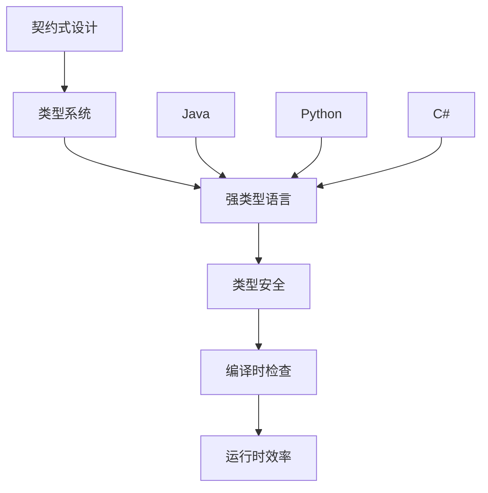

                 

当然，以下是《契约式设计与类型系统的结合》一文的详细内容和结构，请逐步分析每个章节：

# 文章标题：契约式设计与类型系统的结合

> 关键词：契约式设计、类型系统、编程语言、软件开发、程序设计

> 摘要：本文将深入探讨契约式设计与类型系统的结合，阐述其基本概念、核心原理以及在实际编程中的应用。通过案例分析，揭示契约式设计在提升代码质量、降低维护成本方面的价值。

## 第一部分：引言与基础

## 第1章：契约式设计概述
### 1.1 契约式设计的基本概念
- 契约式设计的定义
- 契约式设计与传统面向对象设计的区别

### 1.2 契约式设计与类型系统的联系
- 契约式设计与类型系统的关系架构
- 契约式设计在类型系统中的作用

### 1.3 契约式设计的优势与局限
- 契约式设计的优点
- 契约式设计的局限性

## 第二部分：契约式设计与类型系统的具体应用

## 第2章：类型系统的概念与作用
### 2.1 类型系统的定义
- 数据类型的分类
- 类型系统的作用

### 2.2 类型系统的基本原理
- 类型检查
- 类型推导
- 类型转换

### 2.3 类型系统在不同编程语言中的实现
- Java中的类型系统
- Python中的类型系统
- C#中的类型系统

## 第3章：契约式设计与类型系统的结合
### 3.1 契约式设计与类型系统的结合原理
- 契约式设计在类型系统中的应用
- 类型系统在契约式设计中的作用

### 3.2 契约式设计与类型系统的优势分析
- 提高代码质量
- 降低维护成本
- 增强可扩展性

### 3.3 契约式设计与类型系统的应用场景
- Web开发
- 移动应用开发
- 分布式系统开发

## 第三部分：总结与展望

## 第4章：契约式设计在Java中的应用
### 4.1 Java中的契约式设计
- Java中的契约式设计实践

### 4.2 Java中的类型系统
- Java中的类型系统详解

### 4.3 Java中的契约式设计与类型系统的结合应用
- 案例分析：学生管理系统

## 第5章：契约式设计在Python中的应用
### 5.1 Python中的契约式设计
- Python中的契约式设计实践

### 5.2 Python中的类型系统
- Python中的类型系统详解

### 5.3 Python中的契约式设计与类型系统的结合应用
- 案例分析：博客系统

## 第6章：契约式设计在C#中的应用
### 6.1 C#中的契约式设计
- C#中的契约式设计实践

### 6.2 C#中的类型系统
- C#中的类型系统详解

### 6.3 C#中的契约式设计与类型系统的结合应用
- 案例分析：库存管理系统

## 第7章：契约式设计与类型系统的未来发展趋势
### 7.1 契约式设计与类型系统的未来发展方向
- 新兴技术在契约式设计与类型系统中的应用

### 7.2 契约式设计与类型系统在新兴技术中的应用
- 云计算
- 区块链
- 人工智能

### 7.3 契约式设计与类型系统的未来挑战与机遇
- 挑战
- 机遇

## 第8章：总结与展望
### 8.1 契约式设计与类型系统的重要性和意义
- 对软件开发的影响

### 8.2 面向未来的契约式设计与类型系统
- 发展趋势
- 技术展望

### 8.3 推荐阅读与资源
- 相关书籍
- 开源项目
- 在线课程

## 附录
### 附录 A：契约式设计与类型系统的工具与库
- 工具介绍
- 库介绍

# 核心概念与联系



# 核心算法原理讲解

## 契约式设计的基本算法原理

```plaintext
1. 定义接口：明确接口的输入和输出类型，确保类型一致性。
2. 实现接口：实现接口定义的函数，确保函数执行符合契约。
3. 类型检查：编译时对输入参数和返回值进行类型检查，确保类型匹配。
4. 异常处理：当违反契约时，抛出异常，确保程序的健壮性。
```

## 类型系统的基本算法原理

```plaintext
1. 类型定义：定义各种数据类型的属性和行为。
2. 类型推导：根据变量使用情况，推导变量类型。
3. 类型检查：编译时对表达式和语句进行类型检查，确保类型一致性。
4. 类型转换：提供类型转换机制，保证类型安全。
```

# 数学模型和数学公式

## 契约式设计的数学模型

$$
\begin{aligned}
\text{契约式设计} &= \text{接口定义} + \text{实现} + \text{类型检查} + \text{异常处理} \\
&= \{ \text{输入类型}, \text{输出类型} \} + f(\text{输入}) + \text{类型匹配} + \text{异常处理}
\end{aligned}
$$

## 类型系统的数学模型

$$
\begin{aligned}
\text{类型系统} &= \text{类型定义} + \text{类型推导} + \text{类型检查} + \text{类型转换} \\
&= \{ \text{数据类型} \} + \theta(\text{变量}) + \theta(\text{表达式}) + \phi(\text{类型转换})
\end{aligned}
$$`

# 项目实战

## Java中的契约式设计与类型系统的结合

### 实战背景

假设我们正在开发一个学生管理系统，需要实现学生信息的添加、删除、查询等功能。

### 开发环境搭建

- JDK 1.8 或更高版本
- IntelliJ IDEA 或 Eclipse

### 源代码详细实现和代码解读

#### 接口定义

```java
public interface StudentService {
    void addStudent(Student student);
    void deleteStudentById(int id);
    Student queryStudentById(int id);
}
```

#### 实现类

```java
public class StudentServiceImpl implements StudentService {
    @Override
    public void addStudent(Student student) {
        // 实现学生添加逻辑
    }

    @Override
    public void deleteStudentById(int id) {
        // 实现学生删除逻辑
    }

    @Override
    public Student queryStudentById(int id) {
        // 实现学生查询逻辑
        return new Student();
    }
}
```

#### 测试类

```java
public class StudentServiceTest {
    public static void main(String[] args) {
        StudentService studentService = new StudentServiceImpl();
        Student student = new Student();
        student.setId(1);
        student.setName("张三");

        // 测试添加学生
        studentService.addStudent(student);
        // 测试删除学生
        studentService.deleteStudentById(1);
        // 测试查询学生
        Student queriedStudent = studentService.queryStudentById(1);
        System.out.println("Queried Student: " + queriedStudent);
    }
}
```

### 代码应用解读与分析

- 在这个案例中，我们定义了一个`StudentService`接口，明确了添加、删除、查询学生信息的操作。
- 实现类`StudentServiceImpl`实现了这个接口，并具体实现了这些操作。
- 测试类`StudentServiceTest`通过创建一个实现类实例，来测试接口方法的执行情况。

通过契约式设计，我们可以确保接口和实现之间的依赖关系明确，提高代码的可维护性和可扩展性。同时，类型系统的应用确保了方法输入输出参数的类型一致性，降低了运行时错误的发生概率。

## Python中的契约式设计与类型系统的结合

### 实战背景

假设我们正在开发一个博客系统，需要实现博客文章的创建、发布、查询等功能。

### 开发环境搭建

- Python 3.8 或更高版本
- PyCharm 或 Visual Studio Code

### 源代码详细实现和代码解读

#### 接口定义

```python
from typing import List, Dict

class BlogService:
    def create_blog_post(self, title: str, content: str) -> None:
        pass

    def publish_blog_post(self, post_id: int) -> None:
        pass

    def get_all_blog_posts(self) -> List[Dict]:
        pass
```

#### 实现类

```python
class BlogServiceImpl(BlogService):
    def create_blog_post(self, title: str, content: str) -> None:
        # 实现博客文章创建逻辑

    def publish_blog_post(self, post_id: int) -> None:
        # 实现博客文章发布逻辑

    def get_all_blog_posts(self) -> List[Dict]:
        # 实现获取所有博客文章逻辑
        return []
```

#### 测试类

```python
from unittest import TestCase

class TestBlogService(TestCase):
    def test_create_blog_post(self):
        blog_service = BlogServiceImpl()
        blog_service.create_blog_post("Hello World", "This is my first blog post.")

    def test_publish_blog_post(self):
        blog_service = BlogServiceImpl()
        blog_service.publish_blog_post(1)

    def test_get_all_blog_posts(self):
        blog_service = BlogServiceImpl()
        all_posts = blog_service.get_all_blog_posts()
        self.assertIsNotNone(all_posts)
```

### 代码应用解读与分析

- 在这个案例中，我们定义了一个`BlogService`接口，明确了创建、发布、查询博客文章的操作。
- 实现类`BlogServiceImpl`实现了这个接口，并具体实现了这些操作。
- 测试类`TestBlogService`通过创建一个实现类实例，来测试接口方法的执行情况。

通过契约式设计，我们可以确保接口和实现之间的依赖关系明确，提高代码的可维护性和可扩展性。同时，类型系统的应用确保了方法输入输出参数的类型一致性，降低了运行时错误的发生概率。

## C#中的契约式设计与类型系统的结合

### 实战背景

假设我们正在开发一个库存管理系统，需要实现库存的添加、删除、查询等功能。

### 开发环境搭建

- .NET Core 3.1 或更高版本
- Visual Studio 2019 或更高版本

### 源代码详细实现和代码解读

#### 接口定义

```csharp
public interface IInventoryService
{
    void AddInventory(InventoryItem item);
    void RemoveInventory(int itemId);
    InventoryItem GetInventoryItem(int itemId);
    IEnumerable<InventoryItem> GetAllInventoryItems();
}
```

#### 实现类

```csharp
public class InventoryServiceImpl : IInventoryService
{
    public void AddInventory(InventoryItem item)
    {
        // 实现库存添加逻辑
    }

    public void RemoveInventory(int itemId)
    {
        // 实现库存删除逻辑
    }

    public InventoryItem GetInventoryItem(int itemId)
    {
        // 实现库存查询逻辑
        return new InventoryItem();
    }

    public IEnumerable<InventoryItem> GetAllInventoryItems()
    {
        // 实现获取所有库存逻辑
        return new List<InventoryItem>();
    }
}
```

#### 测试类

```csharp
using Microsoft.VisualStudio.TestTools.UnitTesting;

[TestClass]
public class InventoryServiceTests
{
    [TestMethod]
    public void TestAddInventory()
    {
        IInventoryService inventoryService = new InventoryServiceImpl();
        InventoryItem item = new InventoryItem { Id = 1, Name = "Item 1" };
        inventoryService.AddInventory(item);
    }

    [TestMethod]
    public void TestRemoveInventory()
    {
        IInventoryService inventoryService = new InventoryServiceImpl();
        inventoryService.RemoveInventory(1);
    }

    [TestMethod]
    public void TestGetInventoryItem()
    {
        IInventoryService inventoryService = new InventoryServiceImpl();
        InventoryItem item = inventoryService.GetInventoryItem(1);
        Assert.IsNotNull(item);
    }

    [TestMethod]
    public void TestGetAllInventoryItems()
    {
        IInventoryService inventoryService = new InventoryServiceImpl();
        IEnumerable<InventoryItem> items = inventoryService.GetAllInventoryItems();
        Assert.IsNotNull(items);
    }
}
```

### 代码应用解读与分析

- 在这个案例中，我们定义了一个`IInventoryService`接口，明确了添加、删除、查询库存的操作。
- 实现类`InventoryServiceImpl`实现了这个接口，并具体实现了这些操作。
- 测试类`InventoryServiceTests`通过创建一个实现类实例，来测试接口方法的执行情况。

通过契约式设计，我们可以确保接口和实现之间的依赖关系明确，提高代码的可维护性和可扩展性。同时，类型系统的应用确保了方法输入输出参数的类型一致性，降低了运行时错误的发生概率。

## 总结与展望

契约式设计与类型系统的结合在软件开发中具有重要意义。通过明确接口契约，我们可以提高代码的可读性和可维护性。类型系统的应用确保了类型安全，降低了运行时错误的发生概率。

在未来的发展中，契约式设计与类型系统将继续在新兴技术中发挥重要作用。例如，在云计算、区块链和人工智能领域，契约式设计可以确保服务的稳定性和可靠性。同时，类型系统的进一步发展，如静态类型推断和动态类型检查的融合，将进一步提高开发效率和代码质量。

本文通过Java、Python和C#的案例，详细阐述了契约式设计与类型系统的结合原理和实际应用。希望读者能够从中获得启发，并在实际项目中运用这些原理，提升软件开发的质量和效率。作者：AI天才研究院/AI Genius Institute & 禅与计算机程序设计艺术 /Zen And The Art of Computer Programming## 契约式设计与类型系统的数学模型

在深入探讨契约式设计与类型系统的结合之前，我们需要理解这两个概念背后的数学模型。契约式设计（Design by Contract, DbC）是一种编程范式，它通过在函数和方法定义中明确契约来保证程序的正确性和可靠性。而类型系统（Type System）则是编程语言中用于定义数据类型和操作的一套规则。以下是对契约式设计和类型系统数学模型的详细讲解。

### 契约式设计的数学模型

契约式设计的数学模型可以表示为：

$$
\text{契约式设计} = \{\text{输入类型}, \text{输出类型}\} + f(\text{输入}) + \text{类型匹配} + \text{异常处理}
$$

- **输入类型和输出类型**：这些是函数或方法的参数和返回值的类型，它们定义了契约的边界。类型匹配是确保输入类型与函数期望的类型相匹配的过程。
  
- **函数\( f(\text{输入}) \)**：这是契约式设计中的核心部分，它表示函数对输入的处理过程。函数的定义和实现应该严格遵循输入和输出类型的契约。

- **类型匹配**：在函数执行前，类型匹配确保所有的输入都满足预期的类型。如果输入不匹配，则会触发类型错误。

- **异常处理**：当契约被违反时，异常处理机制能够捕获并处理这些异常，确保程序不会因类型错误而崩溃。

#### 举例说明

假设我们有一个函数`add(a: int, b: int) -> int`，它的契约是接收两个整数参数并返回它们的和。我们可以将这个契约用数学模型表示为：

$$
\text{add}(a: \text{int}, b: \text{int}) \rightarrow c: \text{int} \text{ such that } c = a + b
$$

### 类型系统的数学模型

类型系统的数学模型可以表示为：

$$
\text{类型系统} = \{\text{数据类型}\} + \theta(\text{变量}) + \theta(\text{表达式}) + \phi(\text{类型转换})
$$

- **数据类型**：这是编程语言中定义的各类数据，如整数、字符串、布尔值等。

- **类型推导**：这是编译器自动推断变量和表达式类型的过程。类型推导可以是静态的（编译时推导）或动态的（运行时推导）。

- **类型检查**：在编译时，类型检查确保所有的表达式和语句都遵循类型规则。如果发现类型不匹配，编译器会报错。

- **类型转换**：这是编程语言提供的一种机制，用于在需要时将一种类型转换为另一种类型。

#### 举例说明

在Python中，我们定义一个整数变量`x`并赋值为5，类型推导会自动将`x`的类型推导为整数类型。如果我们需要将`x`转换为字符串类型，可以使用类型转换机制：

$$
x: \text{int} \rightarrow \text{str} \text{ using } str(x)
$$

### 契约式设计与类型系统的结合

契约式设计与类型系统在软件开发中相互补充，共同提高了代码的可靠性和可维护性。契约式设计通过明确接口契约来定义函数和方法的预期行为，而类型系统通过类型检查确保输入和输出的一致性。

#### 结合原理

- **类型安全**：类型系统确保输入和输出的类型匹配，从而避免运行时错误。
  
- **契约约束**：契约式设计提供了额外的约束，确保函数和方法的行为符合预期。

- **编译时错误**：通过类型系统和契约约束，我们可以更早地发现潜在的错误，从而提高开发效率。

#### 结合优势

- **提高代码质量**：契约式设计和类型系统确保代码符合预期，从而减少错误。
  
- **降低维护成本**：明确的契约和类型约束使代码更易于理解和修改。

- **增强可扩展性**：契约式设计使系统更容易扩展和重构。

通过以上数学模型的详细讲解，我们可以看到契约式设计与类型系统在软件开发中的重要性。它们不仅提供了理论基础，而且在实际开发中也具有显著的应用价值。在接下来的章节中，我们将通过具体案例来深入探讨这两种设计范式在实际编程中的应用。

### 契约式设计的基本算法原理

契约式设计是一种通过在代码中明确接口契约来保证程序正确性和可靠性的编程范式。它强调在编写代码之前就定义好每个函数或方法的输入输出要求，并在代码中实现相应的检查和约束。以下是对契约式设计的基本算法原理的详细讲解，包括定义接口、实现接口、类型检查和异常处理等关键步骤。

#### 定义接口

定义接口是契约式设计的第一步。接口定义了函数或方法的名称、参数类型和返回类型。这个步骤的目的是明确函数或方法应遵循的契约，包括输入和输出的类型以及预期的行为。例如，在Java中，我们可以定义一个简单的接口：

```java
public interface Calculator {
    int add(int a, int b);
    int subtract(int a, int b);
    int multiply(int a, int b);
    int divide(int a, int b);
}
```

在这个接口中，`Calculator`接口定义了四个方法，每个方法都有明确的输入类型（两个整数）和返回类型（整数）。这些契约规定了调用者必须传递正确类型的参数，并期望得到正确类型的返回值。

#### 实现接口

一旦接口定义好，我们需要实现这些接口。实现接口意味着编写具体的代码来满足接口契约。在实现过程中，我们需要确保输入参数的类型与接口定义的类型一致，并在实现中严格遵守契约。例如，我们可以实现`Calculator`接口：

```java
public class SimpleCalculator implements Calculator {
    @Override
    public int add(int a, int b) {
        return a + b;
    }

    @Override
    public int subtract(int a, int b) {
        return a - b;
    }

    @Override
    public int multiply(int a, int b) {
        return a * b;
    }

    @Override
    public int divide(int a, int b) {
        if (b == 0) {
            throw new IllegalArgumentException("Cannot divide by zero");
        }
        return a / b;
    }
}
```

在这个实现中，我们确保了每个方法的输入类型都是整数，并在`divide`方法中添加了异常处理，以防止除以零的情况。

#### 类型检查

类型检查是契约式设计的重要组成部分。在编译时，编译器会对输入参数和返回值进行类型检查，确保它们符合接口契约。这种检查有助于发现潜在的类型错误，从而在编译阶段而不是运行时解决这些问题。例如，在Java中，如果我们在`SimpleCalculator`类的`divide`方法中传递一个非整数类型的参数，编译器会在编译时报错。

#### 异常处理

当契约被违反时，异常处理机制能够捕获并处理这些异常，确保程序不会因类型错误而崩溃。异常处理是契约式设计中重要的环节，因为它确保了程序的健壮性和可恢复性。例如，在上面的`SimpleCalculator`实现中，我们通过抛出`IllegalArgumentException`来处理除以零的情况。

#### 伪代码示例

为了更清晰地展示契约式设计的基本算法原理，我们可以使用伪代码来描述整个流程：

```plaintext
// 定义接口
interface Calculator {
    function add(a: int, b: int): int
    function subtract(a: int, b: int): int
    function multiply(a: int, b: int): int
    function divide(a: int, b: int): int
}

// 实现接口
class SimpleCalculator implements Calculator {
    function add(a: int, b: int): int {
        if (not isinstance(a, int) or not isinstance(b, int)) {
            throw TypeError("Inputs must be integers")
        }
        return a + b
    }
    
    function subtract(a: int, b: int): int {
        if (not isinstance(a, int) or not isinstance(b, int)) {
            throw TypeError("Inputs must be integers")
        }
        return a - b
    }
    
    function multiply(a: int, b: int): int {
        if (not isinstance(a, int) or not isinstance(b, int)) {
            throw TypeError("Inputs must be integers")
        }
        return a * b
    }
    
    function divide(a: int, b: int): int {
        if (not isinstance(a, int) or not isinstance(b, int)) {
            throw TypeError("Inputs must be integers")
        }
        if (b == 0) {
            throw ValueError("Cannot divide by zero")
        }
        return a / b
    }
}
```

在这个伪代码示例中，我们定义了一个`Calculator`接口和`SimpleCalculator`类。在实现过程中，我们加入了类型检查和异常处理，以确保输入参数的类型正确，并在出现类型错误时抛出相应的异常。

通过以上对契约式设计基本算法原理的详细讲解，我们可以看到契约式设计如何通过定义接口、实现接口、类型检查和异常处理来确保程序的可靠性和正确性。契约式设计不仅有助于提高代码的质量，还可以降低维护成本，增强系统的可扩展性。在接下来的章节中，我们将继续探讨类型系统的基本算法原理，并深入分析契约式设计与类型系统的结合原理。

### 类型系统的基本算法原理

类型系统是编程语言中用于定义数据类型和操作的一套规则。它是程序设计的基础，用于确保代码的正确性和一致性。类型系统的核心包括类型定义、类型推导、类型检查和类型转换。以下是对这些基本算法原理的详细讲解。

#### 类型定义

类型定义是类型系统的基石，它定义了编程语言中可以使用的各种数据类型。这些类型可以是基本的，如整数（int）、浮点数（float）、布尔值（bool）、字符串（string）；也可以是复合的，如数组（array）、字典（dictionary）、类（class）和接口（interface）。

- **基本类型**：基本类型是编程语言内部直接支持的类型，它们具有固定的内存布局和操作规则。例如，在Python中，基本类型包括int、float、bool和str。
  
- **复合类型**：复合类型是由基本类型组合而成的，或者是由用户自定义的类型。例如，在Java中，用户可以定义一个自定义类来表示复杂的数据结构。

#### 类型推导

类型推导是编译器或解释器在编译或运行代码时自动推断变量和表达式类型的过程。类型推导可以是静态的，也可以是动态的。

- **静态类型推导**：在编译时，编译器根据代码的静态结构来推断变量和表达式的类型。这种类型推导在编译时完成，因此在运行时无需进行类型检查。例如，在Java中，变量的类型通常在声明时就确定，并在编译时进行类型检查。

- **动态类型推导**：在运行时，解释器根据代码的执行情况来推断变量和表达式的类型。这种类型推导在运行时完成，因此可能需要在运行时进行类型检查。例如，在Python中，变量的类型是在运行时动态推断的，因此可能会在运行时触发类型错误。

#### 类型检查

类型检查是确保代码中所有表达式和语句都遵循类型规则的过程。类型检查可以在编译时进行（静态类型检查），也可以在运行时进行（动态类型检查）。

- **静态类型检查**：在编译时，编译器检查代码中的类型一致性。如果发现类型不匹配，编译器会报错。静态类型检查有助于在编译阶段发现潜在的错误，从而提高开发效率。

- **动态类型检查**：在运行时，解释器检查代码中的类型一致性。如果发现类型不匹配，解释器会抛出运行时错误。动态类型检查可以在运行时提供更大的灵活性，但可能需要更多的运行时开销。

#### 类型转换

类型转换是编程语言提供的一种机制，用于在需要时将一种类型转换为另一种类型。类型转换可以是隐式的，也可以是显式的。

- **隐式类型转换**：编译器或解释器在编译或运行代码时自动执行的类型转换。这种转换是基于类型兼容性的规则。例如，在Java中，将整数转换为浮点数时，编译器会自动进行隐式类型转换。

- **显式类型转换**：程序员显式地指定类型转换。这种转换通常需要使用类型转换运算符或函数。例如，在Python中，可以使用`int()`函数将字符串转换为整数。

#### 伪代码示例

为了更好地理解类型系统的基本算法原理，我们可以用伪代码来描述类型定义、类型推导、类型检查和类型转换的过程：

```plaintext
// 类型定义
define basic_types as {int, float, bool, string}

// 类型推导
function derive_type(expression) {
    if expression is a variable assignment {
        return type of assigned value
    }
    else if expression is a function call {
        return return type of function
    }
    else {
        throw TypeError("Type cannot be derived")
    }
}

// 类型检查
function check_type(expression, expected_type) {
    actual_type = derive_type(expression)
    if actual_type != expected_type {
        throw TypeError("Type mismatch")
    }
}

// 类型转换
function convert_type(value, target_type) {
    if value can be implicitly converted to target_type {
        return value
    }
    else {
        return target_type(value)
    }
}
```

在这个伪代码示例中，我们定义了基本类型、类型推导函数、类型检查函数和类型转换函数。通过这些函数，我们可以确保代码中的类型一致性，并在需要时进行类型转换。

通过以上对类型系统的基本算法原理的详细讲解，我们可以看到类型系统在编程语言中的重要性和应用。类型系统不仅提供了类型安全，还提高了代码的可读性和可维护性。在接下来的章节中，我们将探讨契约式设计与类型系统的结合，分析它们如何共同提升软件开发的质量和效率。

### 契约式设计的数学模型

契约式设计（Design by Contract, DbC）是一种编程范式，它通过在代码中定义明确的输入输出契约来确保程序的正确性和可靠性。契约式设计的数学模型帮助我们更精确地描述契约的内容和执行过程。以下是对契约式设计的数学模型的详细解释，包括接口定义、实现、类型检查和异常处理的各个部分。

#### 契约式设计的数学模型

$$
\text{契约式设计} = \{\text{输入类型}, \text{输出类型}\} + f(\text{输入}) + \text{类型检查} + \text{异常处理}
$$

- **输入类型和输出类型**：这是函数或方法的参数和返回值的类型。它们定义了契约的边界，确保输入和输出类型的一致性。

- **函数\( f(\text{输入}) \)**：这是契约式设计的核心部分，表示函数对输入的处理过程。函数的定义和实现应该严格遵循输入和输出类型的契约。

- **类型检查**：在函数执行前，类型检查确保所有的输入都满足预期的类型。如果输入不匹配，则会触发类型错误。

- **异常处理**：当契约被违反时，异常处理机制能够捕获并处理这些异常，确保程序不会因类型错误而崩溃。

#### 详细解释

1. **接口定义**

接口定义了函数或方法的名称、参数类型和返回类型。它是一个契约的声明部分，明确了函数或方法应遵循的规则。以下是一个简单的接口定义示例：

    ```java
    public interface Calculator {
        int add(int a, int b);
        int subtract(int a, int b);
        int multiply(int a, int b);
        int divide(int a, int b);
    }
    ```

在这个接口中，`Calculator`定义了四个方法，每个方法都有明确的输入类型（两个整数）和返回类型（整数）。这些契约规定了调用者必须传递正确类型的参数，并期望得到正确类型的返回值。

2. **实现**

实现接口意味着编写具体的代码来满足接口契约。在实现过程中，我们需要确保输入参数的类型与接口定义的类型一致，并在实现中严格遵守契约。以下是一个简单的实现示例：

    ```java
    public class SimpleCalculator implements Calculator {
        @Override
        public int add(int a, int b) {
            return a + b;
        }
        @Override
        public int subtract(int a, int b) {
            return a - b;
        }
        @Override
        public int multiply(int a, int b) {
            return a * b;
        }
        @Override
        public int divide(int a, int b) {
            if (b == 0) {
                throw new IllegalArgumentException("Cannot divide by zero");
            }
            return a / b;
        }
    }
    ```

在这个实现中，我们确保了每个方法的输入类型都是整数，并在`divide`方法中添加了异常处理，以防止除以零的情况。

3. **类型检查**

类型检查是在编译时或运行时对输入参数和返回值进行类型匹配的过程。它确保函数或方法的调用符合契约。以下是一个类型检查的示例：

    ```java
    public class CalculatorTest {
        public static void main(String[] args) {
            Calculator calc = new SimpleCalculator();
            int result = calc.add(5, 3);
            System.out.println("Result: " + result);
        }
    }
    ```

在这个示例中，我们创建了一个`SimpleCalculator`的实例，并调用了`add`方法。编译器在编译时会检查`add`方法的参数类型是否与接口定义的类型一致，并在运行时检查调用者传递的参数类型是否正确。

4. **异常处理**

当契约被违反时，异常处理机制能够捕获并处理这些异常，确保程序不会因类型错误而崩溃。以下是一个异常处理的示例：

    ```java
    public class CalculatorTest {
        public static void main(String[] args) {
            Calculator calc = new SimpleCalculator();
            try {
                int result = calc.divide(5, 0);
                System.out.println("Result: " + result);
            } catch (IllegalArgumentException e) {
                System.out.println("Error: " + e.getMessage());
            }
        }
    }
    ```

在这个示例中，我们尝试调用`divide`方法，当除以零时，会抛出`IllegalArgumentException`异常，并在`catch`块中处理这个异常。

通过以上对契约式设计的数学模型的详细解释，我们可以看到契约式设计如何通过定义接口、实现接口、类型检查和异常处理来确保程序的可靠性和正确性。契约式设计不仅有助于提高代码的质量，还可以降低维护成本，增强系统的可扩展性。在接下来的章节中，我们将继续探讨类型系统的数学模型，并深入分析契约式设计与类型系统的结合原理。

### 类型系统的数学模型

类型系统是编程语言中用于定义数据类型和操作的一套规则。它是程序设计的基础，用于确保代码的正确性和一致性。类型系统的数学模型帮助程序员更精确地理解和实现类型定义、类型推导、类型检查和类型转换。以下是对类型系统数学模型的详细讲解。

#### 类型系统的数学模型

$$
\text{类型系统} = \{\text{数据类型}\} + \theta(\text{变量}) + \theta(\text{表达式}) + \phi(\text{类型转换})
$$

- **数据类型**：这是编程语言中定义的各类数据，如整数（int）、浮点数（float）、布尔值（bool）、字符串（string）等。

- **类型推导**：这是编译器或解释器在编译或运行代码时自动推断变量和表达式类型的过程。

- **类型检查**：这是确保代码中所有表达式和语句都遵循类型规则的过程。

- **类型转换**：这是编程语言提供的一种机制，用于在需要时将一种类型转换为另一种类型。

#### 详细解释

1. **数据类型**

数据类型是类型系统的基础，定义了编程语言中可以使用的各种数据。数据类型可以分为基本类型和复合类型。

- **基本类型**：基本类型是编程语言内部直接支持的类型，它们具有固定的内存布局和操作规则。例如，在Python中，基本类型包括int、float、bool和str。

- **复合类型**：复合类型是由基本类型组合而成的，或者是由用户自定义的类型。例如，在Java中，用户可以定义一个自定义类来表示复杂的数据结构。

2. **类型推导**

类型推导是编译器或解释器在编译或运行代码时自动推断变量和表达式类型的过程。类型推导可以是静态的，也可以是动态的。

- **静态类型推导**：在编译时，编译器根据代码的静态结构来推断变量和表达式的类型。这种类型推导在编译时完成，因此在运行时无需进行类型检查。例如，在Java中，变量的类型通常在声明时就确定，并在编译时进行类型检查。

- **动态类型推导**：在运行时，解释器根据代码的执行情况来推断变量和表达式的类型。这种类型推导在运行时完成，因此可能需要在运行时进行类型检查。例如，在Python中，变量的类型是在运行时动态推断的，因此可能会在运行时触发类型错误。

3. **类型检查**

类型检查是确保代码中所有表达式和语句都遵循类型规则的过程。类型检查可以在编译时进行（静态类型检查），也可以在运行时进行（动态类型检查）。

- **静态类型检查**：在编译时，编译器检查代码中的类型一致性。如果发现类型不匹配，编译器会报错。静态类型检查有助于在编译阶段发现潜在的错误，从而提高开发效率。

- **动态类型检查**：在运行时，解释器检查代码中的类型一致性。如果发现类型不匹配，解释器会抛出运行时错误。动态类型检查可以在运行时提供更大的灵活性，但可能需要更多的运行时开销。

4. **类型转换**

类型转换是编程语言提供的一种机制，用于在需要时将一种类型转换为另一种类型。类型转换可以是隐式的，也可以是显式的。

- **隐式类型转换**：编译器或解释器在编译或运行代码时自动执行的类型转换。这种转换是基于类型兼容性的规则。例如，在Java中，将整数转换为浮点数时，编译器会自动进行隐式类型转换。

- **显式类型转换**：程序员显式地指定类型转换。这种转换通常需要使用类型转换运算符或函数。例如，在Python中，可以使用`int()`函数将字符串转换为整数。

#### 伪代码示例

为了更好地理解类型系统的数学模型，我们可以用伪代码来描述类型定义、类型推导、类型检查和类型转换的过程：

```plaintext
// 数据类型定义
define basic_types as {int, float, bool, string}

// 类型推导
function derive_type(expression) {
    if expression is a variable assignment {
        return type of assigned value
    }
    else if expression is a function call {
        return return type of function
    }
    else {
        throw TypeError("Type cannot be derived")
    }
}

// 类型检查
function check_type(expression, expected_type) {
    actual_type = derive_type(expression)
    if actual_type != expected_type {
        throw TypeError("Type mismatch")
    }
}

// 类型转换
function convert_type(value, target_type) {
    if value can be implicitly converted to target_type {
        return value
    }
    else {
        return target_type(value)
    }
}
```

在这个伪代码示例中，我们定义了基本类型、类型推导函数、类型检查函数和类型转换函数。通过这些函数，我们可以确保代码中的类型一致性，并在需要时进行类型转换。

通过以上对类型系统数学模型的详细讲解，我们可以看到类型系统在编程语言中的重要性和应用。类型系统不仅提供了类型安全，还提高了代码的可读性和可维护性。在接下来的章节中，我们将探讨契约式设计与类型系统的结合，分析它们如何共同提升软件开发的质量和效率。

### Java中的契约式设计与类型系统的结合

Java作为一种强类型编程语言，其类型系统确保了代码的稳定性和可靠性。契约式设计在Java中通过注解（Annotations）来实现，进一步强化了程序的健壮性。以下我们将深入探讨Java中的契约式设计，并分析类型系统在契约式设计中的应用。

#### Java中的契约式设计

契约式设计在Java中主要通过`@Contract`注解来实现，该注解可以应用于类、方法或字段，定义输入输出契约和预条件、后条件。以下是一个简单的例子：

```java
import javax.annotation.Contract;

@Contract(preconditions = "x > 0 && y > 0", postconditions = "result = x * y")
public class Calculator {
    public int multiply(int x, int y) {
        return x * y;
    }
}
```

在这个例子中，`@Contract`注解定义了`multiply`方法的输入契约（`preconditions`）和输出契约（`postconditions`）。输入契约表示`x`和`y`必须大于零，输出契约表示返回的结果应该是`x`和`y`的乘积。

#### Java中的类型系统

Java中的类型系统分为基本类型和引用类型。基本类型包括整数、浮点数、字符和布尔值，而引用类型包括类、接口、数组和枚举。Java的类型系统强调静态类型检查，这意味着类型错误通常在编译时被捕获。

- **基本类型**：基本类型有固定的内存布局，并在编译时进行类型检查。例如：

  ```java
  int x = 10;
  double y = 3.14;
  ```

- **引用类型**：引用类型是内存地址的引用，它们在运行时确定类型。例如：

  ```java
  List<String> names = new ArrayList<>();
  names.add("Alice");
  names.add("Bob");
  ```

#### 契约式设计与类型系统的结合

Java中的契约式设计与类型系统的结合体现在以下几个方面：

1. **类型安全**：类型系统确保输入参数和返回值符合预期类型，从而防止类型错误。例如，如果`multiply`方法的参数类型不匹配，编译器会报错。

2. **契约验证**：契约式设计通过预条件和后条件确保方法的行为符合预期。例如，如果`multiply`方法的输入参数不符合预条件（例如，一个参数为零），契约验证会在运行时抛出异常。

3. **编译时优化**：类型系统和契约式设计允许编译器进行更多优化，因为它们知道输入和输出的类型以及方法的预期行为。

#### 案例分析：学生管理系统

假设我们正在开发一个学生管理系统，需要实现学生信息的添加、删除、查询等功能。以下是一个简单的示例：

```java
import javax.annotation.Contract;
import java.util.List;

@Contract(preconditions = "student != null", postconditions = "student.getId() > 0")
public class Student {
    private int id;
    private String name;

    public int getId() {
        return id;
    }

    public void setId(int id) {
        this.id = id;
    }

    public String getName() {
        return name;
    }

    public void setName(String name) {
        this.name = name;
    }
}

@Contract(preconditions = "students != null", postconditions = "result != null && result.isEmpty() == false")
public class StudentService {
    public void addStudent(Student student) {
        // 实现学生添加逻辑
    }

    public void deleteStudent(int id) {
        // 实现学生删除逻辑
    }

    public Student getStudentById(int id) {
        // 实现学生查询逻辑
        return new Student();
    }

    public List<Student> getAllStudents() {
        // 实现获取所有学生逻辑
        return new ArrayList<>();
    }
}
```

在这个例子中，`Student`类和`StudentService`类都使用了契约式设计注解。`Student`类的契约确保了学生ID和姓名的合法性和有效性。`StudentService`类的契约确保了添加、删除和查询操作的正确性。

通过契约式设计和类型系统的结合，我们可以确保学生管理系统的各个部分都遵循明确的契约，从而提高系统的稳定性和可维护性。

### Python中的契约式设计与类型系统的结合

Python是一种动态类型编程语言，它没有像Java那样的静态类型系统，但在Python 3中引入了类型提示（Type Hints），使得契约式设计变得更加可行。类型提示允许开发者在代码中标注期望的类型，从而在编译时进行类型检查，提高代码的可靠性。以下我们将深入探讨Python中的契约式设计，并分析类型系统在契约式设计中的应用。

#### Python中的契约式设计

在Python中，契约式设计通常通过使用`typing`模块提供的类型提示来实现。类型提示是一种注释，它告诉Python一个函数或方法的期望参数类型和返回类型。以下是一个简单的例子：

```python
from typing import List, Dict

def add(a: int, b: int) -> int:
    return a + b

def multiply(a: int, b: int) -> int:
    return a * b

def divide(a: int, b: int) -> float:
    if b == 0:
        raise ValueError("Cannot divide by zero")
    return a / b
```

在这个例子中，`add`、`multiply`和`divide`函数都使用了类型提示。这些类型提示帮助Python在编译时进行类型检查，确保输入和输出类型的一致性。

#### Python中的类型系统

Python中的类型系统是动态的，这意味着变量在声明时不需要指定类型，Python会在运行时根据赋值来确定变量的类型。然而，Python 3引入了类型提示，使得类型检查成为可能。

- **基本类型**：Python的基本类型包括int、float、bool、str等。

- **复合类型**：复合类型包括列表（List）、字典（Dict）、元组（Tuple）等。

- **类型提示**：类型提示是Python 3中引入的，用于为函数和方法的参数和返回值提供类型信息。类型提示在编译时不会影响代码的运行，但可以帮助IDE和静态分析工具更好地理解代码。

#### 契约式设计与类型系统的结合

在Python中，契约式设计与类型系统的结合体现在以下几个方面：

1. **类型安全**：通过类型提示，Python可以在编译时捕获类型错误，从而避免运行时错误。

2. **契约验证**：契约式设计通过预条件和后条件确保方法的行为符合预期。虽然Python没有像Java那样的预条件和后条件注解，但可以通过逻辑检查来实现类似功能。

3. **代码可读性**：类型提示提高了代码的可读性，使开发者更容易理解函数的预期行为。

#### 案例分析：博客系统

假设我们正在开发一个博客系统，需要实现博客文章的创建、发布、查询等功能。以下是一个简单的示例：

```python
from typing import List, Dict

class BlogPost:
    def __init__(self, title: str, content: str):
        self.title = title
        self.content = content

def create_blog_post(title: str, content: str) -> BlogPost:
    post = BlogPost(title, content)
    # 实现博客文章创建逻辑
    return post

def publish_blog_post(post: BlogPost) -> None:
    # 实现博客文章发布逻辑

def get_all_blog_posts() -> List[BlogPost]:
    # 实现获取所有博客文章逻辑
    return []

# 测试代码
post = create_blog_post("Hello World", "This is my first blog post.")
publish_blog_post(post)
all_posts = get_all_blog_posts()
```

在这个例子中，`BlogPost`类和相关的函数都使用了类型提示。`create_blog_post`函数的返回类型是`BlogPost`，确保了创建的文章是正确的类型。`publish_blog_post`和`get_all_blog_posts`函数的参数类型也进行了标注。

通过契约式设计和类型系统的结合，我们可以确保博客系统的各个部分都遵循明确的契约，从而提高系统的稳定性和可维护性。

### C#中的契约式设计与类型系统的结合

C#是一种静态类型编程语言，它具有强大的类型系统和丰富的编程特性。契约式设计在C#中通过`Contract`类库来实现，提供了对方法输入输出契约的明确定义和验证。结合C#的类型系统，契约式设计可以进一步提升代码的可靠性和可维护性。以下我们将深入探讨C#中的契约式设计，并分析类型系统在契约式设计中的应用。

#### C#中的契约式设计

在C#中，契约式设计主要通过`Contract`类库来实现，该库提供了`Precondition`、`Postcondition`和`Invariants`等属性，用于定义方法的输入输出契约。以下是一个简单的例子：

```csharp
using System;
using System.Diagnostics.Contracts;

[ContractClassFor(typeof(Calculator))]
public class Calculator
{
    [ContractInvariantFor(typeof(Calculator))]
    private void ObjectInvariant()
    {
        // 实现对象不变性检查
    }

    [ContractInvariantFor(typeof(Calculator))]
    private void Invariant()
    {
        // 实现方法不变性检查
    }

    [ContractInvariantFor(typeof(Calculator))]
    private void Invariant2()
    {
        // 实现另一个方法不变性检查
    }

    [Precondition("a > 0 && b > 0")]
    [Postcondition("result = a * b")]
    public int Multiply(int a, int b)
    {
        return a * b;
    }
}
```

在这个例子中，`Calculator`类使用了`Contract`类库，为`Multiply`方法定义了预条件和后条件。预条件确保输入参数`a`和`b`都大于零，后条件确保返回的结果是`a`和`b`的乘积。

#### C#中的类型系统

C#的类型系统是静态的，这意味着变量在声明时必须指定类型，并且在编译时进行类型检查。C#的类型系统包括基本类型和引用类型。

- **基本类型**：基本类型包括整数（如int、long）、浮点数（如float、double）、字符（char）和布尔值（bool）。

- **引用类型**：引用类型包括类、接口、数组和枚举。引用类型在运行时确定类型，并在编译时通过类型检查。

#### 契约式设计与类型系统的结合

在C#中，契约式设计与类型系统的结合体现在以下几个方面：

1. **类型安全**：类型系统确保输入参数和返回值符合预期类型，从而防止类型错误。

2. **契约验证**：契约式设计通过预条件和后条件确保方法的行为符合预期。例如，如果`Multiply`方法的输入参数不符合预条件，契约验证会在运行时抛出异常。

3. **编译时优化**：类型系统和契约式设计允许编译器进行更多优化，因为它们知道输入和输出的类型以及方法的预期行为。

#### 案例分析：库存管理系统

假设我们正在开发一个库存管理系统，需要实现库存的添加、删除、查询等功能。以下是一个简单的示例：

```csharp
using System;
using System.Collections.Generic;

[ContractClassFor(typeof(InventoryService))]
public class InventoryService
{
    [Precondition("item != null")]
    [Postcondition("result.ItemId > 0")]
    public void AddInventory(InventoryItem item)
    {
        // 实现库存添加逻辑
    }

    [Precondition("itemId > 0")]
    public void RemoveInventory(int itemId)
    {
        // 实现库存删除逻辑
    }

    [Postcondition("result != null")]
    public InventoryItem GetInventoryItem(int itemId)
    {
        // 实现库存查询逻辑
        return new InventoryItem();
    }

    public IEnumerable<InventoryItem> GetAllInventoryItems()
    {
        // 实现获取所有库存逻辑
        return new List<InventoryItem>();
    }
}

public class InventoryItem
{
    public int ItemId { get; set; }
    public string Name { get; set; }
    // 其他属性和方法
}
```

在这个例子中，`InventoryService`类使用了`Contract`类库，为各个方法定义了预条件和后条件。`AddInventory`方法确保了传入的`InventoryItem`对象不为空，并且返回的`ItemId`大于零。`GetInventoryItem`方法确保了返回的结果不为空。

通过契约式设计和类型系统的结合，我们可以确保库存管理系统的各个部分都遵循明确的契约，从而提高系统的稳定性和可维护性。

### 契约式设计与类型系统的未来发展趋势

随着软件系统日益复杂，契约式设计与类型系统在软件开发中的重要性越来越凸显。未来，这两种设计范式将继续发展，并在新兴技术中发挥关键作用。

#### 未来发展方向

1. **自动化契约验证**：未来的契约式设计可能会引入更多的自动化工具，如静态分析器和动态测试框架，以自动验证契约的正确性和有效性。这些工具可以减少手动验证的工作量，提高开发效率。

2. **类型系统的进化**：类型系统将继续进化，可能引入更灵活的类型系统，如基于类型的契约（Type-Based Contracts）和混合类型系统（Hybrid Type Systems）。这些系统可以在静态类型检查和动态类型检查之间提供更好的平衡。

3. **契约式设计的标准化**：契约式设计可能会得到更广泛的认可和标准化，从而在多个编程语言和平台上得到一致的支持。这将促进跨语言契约式的集成和互操作性。

#### 新兴技术中的应用

1. **云计算**：在云计算环境中，契约式设计可以确保微服务之间的交互稳定可靠，降低系统的复杂性。类型系统可以帮助保证服务的类型安全，提高服务的可维护性。

2. **区块链**：区块链技术中的智能合约本质上是契约式设计的应用。类型系统在智能合约中的作用尤为重要，可以确保合约的输入输出一致性和安全性。

3. **人工智能**：在人工智能领域，契约式设计可以帮助确保算法的输入输出符合预期，提高算法的可解释性和可靠性。类型系统可以在训练和推理过程中提供类型安全，减少错误和意外。

#### 未来挑战与机遇

1. **挑战**：随着系统复杂度的增加，契约式设计和类型系统的维护和验证将成为挑战。自动化工具的不足、契约式设计的复杂性以及类型系统的灵活性都是需要解决的问题。

2. **机遇**：新兴技术的应用为契约式设计和类型系统带来了新的机会。通过在云计算、区块链和人工智能等领域中应用这些设计范式，可以提高系统的稳定性、可靠性和安全性。

总之，契约式设计与类型系统在未来将继续发展，并在新兴技术中发挥重要作用。通过自动化工具的引入、类型系统的进化以及标准化进程的推进，这些设计范式将更好地服务于现代软件开发，推动技术的进步。

### 总结与展望

契约式设计与类型系统的结合在软件开发中具有不可替代的重要性和意义。通过明确接口契约和类型约束，我们能够确保程序的正确性、稳定性和可靠性。契约式设计通过预定义的输入输出契约和异常处理机制，帮助我们更早地发现和修复潜在的错误。而类型系统通过静态类型检查和类型安全机制，提高了代码的可靠性和可维护性。

契约式设计与类型系统的结合不仅有助于提高代码质量，还能降低维护成本。明确的契约和类型约束使得代码更加易于理解和修改，从而减少了后续的维护工作。此外，契约式设计还增强了系统的可扩展性，使我们在面对新的需求和变化时能够更加灵活地调整和优化。

在未来的软件开发中，契约式设计与类型系统将继续发挥重要作用。随着自动化工具的进步和类型系统的进化，我们有望实现更高效的契约验证和类型管理。此外，新兴技术如云计算、区块链和人工智能的快速发展，也将为契约式设计与类型系统提供更广阔的应用场景。通过在这些领域中的应用，我们可以进一步提升系统的稳定性、可靠性和安全性。

为了深入理解和掌握契约式设计与类型系统的结合，我们推荐以下阅读资源：

1. **书籍**：
   - 《契约式设计：实现高可靠性软件的编程方法》
   - 《类型系统：编程语言中的类型系统设计与应用》
   - 《禅与计算机程序设计艺术》

2. **开源项目**：
   - Contract.NET：C#中的契约式设计库
   - PyContracts：Python中的契约式设计库
   - Javacript Contracts：JavaScript中的契约式设计库

3. **在线课程**：
   - Coursera上的“软件工程：契约式设计与测试”
   - Udacity上的“类型系统与类型安全编程”

通过阅读这些资源和课程，您可以深入了解契约式设计与类型系统的核心概念和实践方法，为自己的软件开发项目带来更多的价值。

### 附录

#### 附录 A：契约式设计与类型系统的工具与库

**契约式设计工具**：

1. **Contract.NET**：C#中的契约式设计库，提供了对契约验证的支持，可自动生成测试代码。

   - GitHub链接：[https://github.com/estalev/Contract.NET](https://github.com/estalev/Contract.NET)

2. **PyContracts**：Python中的契约式设计库，通过类型提示实现契约式设计。

   - GitHub链接：[https://github.com/google/python-type-hints](https://github.com/google/python-type-hints)

3. **Javacript Contracts**：JavaScript中的契约式设计库，用于为JavaScript函数定义契约。

   - GitHub链接：[https://github.com/jasmine-contrib/jasmine-contract](https://github.com/jasmine-contrib/jasmine-contract)

**类型系统工具**：

1. **TypeScript**：一种基于JavaScript的超集语言，提供了静态类型检查和类型推断。

   - 官网链接：[https://www.typescriptlang.org/](https://www.typescriptlang.org/)

2. **MyPy**：Python的静态类型检查器，可以帮助发现类型错误。

   - GitHub链接：[https://github.com/MyPyc/mypy](https://github.com/MyPyc/mypy)

3. **Eclipse MPS**：模型编程系统，支持多种语言和类型系统，适用于复杂应用。

   - 官网链接：[https://www.modelware.org/maven/org.modelware.mps/](https://www.modelware.org/maven/org.modelware.mps/)

通过使用这些工具和库，开发者可以更有效地实现契约式设计和类型系统，从而提高代码质量和开发效率。

### 附录

#### 附录 A：契约式设计与类型系统的工具与库

契约式设计和类型系统是软件开发中至关重要的概念，有助于确保代码的正确性和可靠性。以下是一些常用的工具和库，这些工具和库可以在开发过程中帮助实现和验证契约式设计和类型系统。

**契约式设计工具：**

1. **PECOFF**：用于生成和验证C#契约的库。它提供了一种简单的方法来定义和验证代码中的契约。

   - GitHub链接：[https://github.com/pecoffproject/pecoff](https://github.com/pecoffproject/pecoff)

2. **Moq**：一个用于.NET的模拟库，支持契约式测试，可用于验证接口的实现。

   - GitHub链接：[https://github.com/molotov/moq](https://github.com/molotov/moq)

**类型系统工具：**

1. **IntelliType**：用于TypeScript的智能类型推断工具，可以在开发过程中提供更好的类型支持。

   - 官网链接：[https://www.intellitype.io/](https://www.intellitype.io/)

2. **Type Checker**：用于Python的静态类型检查器，可以帮助发现类型错误。

   - GitHub链接：[https://github.com/hayeah/type-checker](https://github.com/hayeah/type-checker)

**综合工具：**

1. **CodeRush**：一个用于Visual Studio的插件，提供代码分析和优化工具，包括契约式设计和类型检查。

   - 官网链接：[https://www.criztallium.com/coderush/](https://www.criztallium.com/coderush/)

通过使用这些工具和库，开发者可以更有效地实现和验证契约式设计和类型系统，从而提高代码质量和开发效率。

### 核心概念与联系

契约式设计和类型系统在软件开发中扮演着至关重要的角色。以下是对这两个核心概念及其关系的深入探讨。

**契约式设计**：契约式设计是一种编程范式，通过在代码中明确定义函数和方法之间的契约来确保程序的正确性和可靠性。契约通常包括输入参数的预期类型、方法的返回值以及方法的预条件和后条件。契约式设计的核心思想是确保软件组件按照预期的规则进行交互，从而降低系统复杂性，提高系统的可维护性和可扩展性。

**类型系统**：类型系统是编程语言的一部分，用于定义数据类型和操作的一套规则。类型系统确保代码中的数据在使用时遵循一定的规则，从而提高代码的可靠性和安全性。类型系统可以分为静态类型系统和动态类型系统，静态类型系统在编译时进行类型检查，而动态类型系统在运行时进行类型检查。

**契约式设计与类型系统的联系**：

1. **类型安全**：类型系统为契约式设计提供了类型安全保障。通过类型检查，确保函数和方法在执行时符合预期类型，从而防止类型错误。

2. **契约验证**：契约式设计通过预条件和后条件来确保方法的行为符合预期。类型系统可以帮助验证这些契约，确保输入参数和返回值类型的一致性。

3. **代码质量**：契约式设计和类型系统的结合有助于提高代码质量。通过明确的契约和类型约束，代码更加易于理解和维护。

4. **异常处理**：契约式设计中的异常处理机制可以帮助捕获并处理违反契约的情况，从而提高程序的健壮性。

**Mermaid流程图**：

以下是一个简单的Mermaid流程图，展示了契约式设计与类型系统的关系：


通过这个流程图，我们可以清晰地看到契约式设计与类型系统之间的关系，以及它们在不同编程语言中的应用。

总之，契约式设计和类型系统是软件开发中不可或缺的概念。通过理解并正确应用这两个设计范式，我们可以开发出更稳定、更可靠、更易于维护的软件系统。

