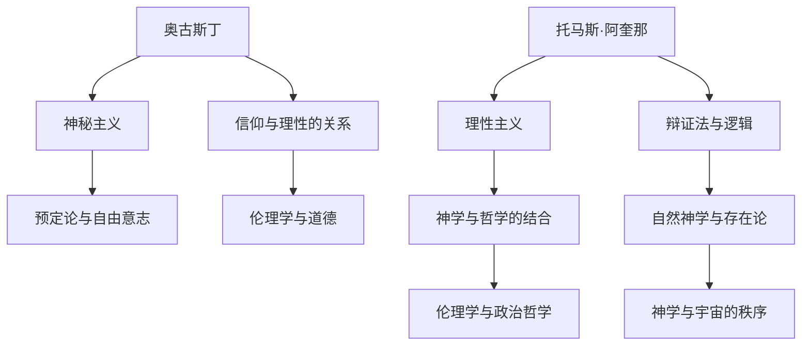

                 

### 文章标题

《奥古斯丁与阿奎那：中世纪基督教哲学的代表》

### 文章关键词

中世纪基督教哲学、奥古斯丁、阿奎那、哲学思想、神学、伦理学、政治哲学、历史影响

### 文章摘要

本文深入探讨了中世纪两位伟大的基督教哲学家奥古斯丁和托马斯·阿奎那的思想。通过对他们的生平背景、哲学著作以及主要观点的分析，我们不仅揭示了他们的思想精髓，还探讨了他们如何对基督教哲学产生了深远影响。本文旨在通过逻辑清晰、结构紧凑的叙述，为读者提供一幅中世纪基督教哲学的全景图，并引发对现代哲学和宗教思想的深入思考。

## 第一部分：中世纪基督教哲学概述

### 1.1 奥古斯丁与阿奎那的生平背景

#### 奥古斯丁的生平

**圣奥古斯丁（Saint Augustine），** 又名**奥古斯丁·希波（Aurelius Augustinus Hipponensis），** 出生于公元354年，是北非塔加斯特（今阿尔及利亚的苏塞）的一个官吏家庭。他早年在罗马和迦太基学习哲学和修辞学，经历了从摩尼教、基督教再到天主教信仰的转变。公元396年，奥古斯丁成为北非希波（今阿尔及利亚的阿尔及尔）的主教，他的著作对基督教神学、教义和伦理学有着深远的影响。

#### 阿奎那的生平

**托马斯·阿奎那（Thomas Aquinas），** 出生于公元1225年，是意大利纳塔（Naples）的一位贵族家庭。他在年幼时接受了良好的教育，后来进入多米尼克会修道院，成为一位僧侣和学者。阿奎那在哲学和神学领域有着卓越的贡献，他的著作《神学大全》（Summa Theologica）是基督教神学的重要文献。

### 1.2 中世纪基督教哲学的起源与发展

#### 中世纪基督教哲学的起源

中世纪基督教哲学的起源可以追溯到公元2世纪至3世纪，这一时期的哲学家们试图理解基督教教义，并将其与希腊哲学、特别是柏拉图和亚里士多德的思想相结合。奥古斯丁是这一时期的代表人物，他的思想对后来的中世纪哲学产生了深远影响。

#### 中世纪基督教哲学的发展

中世纪基督教哲学的发展分为几个阶段，从奥古斯丁的神秘主义和强调信仰，到阿奎那的理性主义和辩证法。阿奎那在《神学大全》中试图通过逻辑和理性来解释基督教教义，使得基督教哲学更加系统和严密。

### 核心概念与联系

为了更好地理解奥古斯丁和阿奎那的哲学思想，我们可以通过Mermaid流程图来展示它们之间的联系：

在这个流程图中，我们可以看到奥古斯丁和阿奎那的核心概念是如何相互联系的，以及它们在中世纪基督教哲学中的地位和影响。

## 第二部分：奥古斯丁的哲学思想

### 2.1 奥古斯丁的生平与著作

#### 奥古斯丁的主要著作

- **《忏悔录》（Confessions）**：这是奥古斯丁最著名的著作，记录了他从摩尼教到基督教信仰的转变过程，以及对信仰和神性的深刻反思。
- **《论自由意志》（On Free Will）**：奥古斯丁在此书中探讨了自由意志与预定论的关系，强调了上帝的绝对权能。
- **《神城论》（City of God）**：在这部著作中，奥古斯丁试图从神学角度解释历史，并对罗马帝国的衰落进行辩护。

#### 奥古斯丁的哲学思想形成过程

奥古斯丁的哲学思想受到多种哲学流派的影响，包括柏拉图主义、亚里士多德主义和新柏拉图主义。他的思想在从摩尼教转向天主教的过程中逐渐成熟，最终形成了独特的神学哲学体系。

### 2.2 奥古斯丁的哲学观点

#### 上帝

**奥古斯丁认为上帝是宇宙的创造者和维持者，是绝对的善和存在。** 在《忏悔录》中，奥古斯丁写道：“除了上帝之外，没有什么是真正的存在。” 他强调了上帝的主权和绝对权能。

#### 自由意志与预定论

**奥古斯丁在自由意志与预定论之间寻求平衡。** 在《论自由意志》中，他认为上帝预先决定了人类的命运，但人类依然拥有自由意志。这种观点在基督教哲学中引起了广泛的争议。

#### 宗教情感与道德

**奥古斯丁强调宗教情感在道德行为中的重要性。** 他认为，信仰和爱是道德行为的动力。在《忏悔录》中，他深刻反思了自己的罪过，并强调了对上帝的信仰和对邻人的爱。

#### 奥古斯丁的哲学思想在历史中的地位

**奥古斯丁的哲学思想对中世纪和近代基督教哲学产生了深远影响。** 他的著作成为基督教神学的基石，他的思想观点在基督教教义的形成和发展中发挥了重要作用。

### 2.3 奥古斯丁对基督教哲学的影响

#### 在教会中的影响

**奥古斯丁的思想为基督教教会提供了重要的神学基础。** 他的著作被广泛引用，并在教会教育中被作为重要教材。

#### 在学术界的影响

**奥古斯丁的哲学思想对后来的哲学家和学者产生了深远影响。** 尤其是在中世纪晚期和文艺复兴时期，他的思想成为哲学讨论的重要主题。

#### 对后世哲学的影响

**奥古斯丁的思想对后来的哲学流派和思想体系产生了深远影响。** 他的神秘主义观点在宗教哲学中占有一席之地，他的伦理学观点也对后来的道德哲学产生了影响。

## 第三部分：阿奎那的哲学思想

### 3.1 阿奎那的生平与著作

#### 阿奎那的主要著作

- **《神学大全》（Summa Theologica）**：这是阿奎那最重要的著作，也是中世纪基督教神学的经典之作。书中详细探讨了各种神学和哲学问题。
- **《论存在与本质》（On Being and Essence）**：在这部著作中，阿奎那试图通过辩证法解释存在与本质之间的关系。

#### 阿奎那的哲学思想形成过程

阿奎那的哲学思想受到多种哲学流派的影响，包括亚里士多德主义、新柏拉图主义和奥古斯丁主义。他的思想在多米尼克会的学术环境中逐渐成熟，并形成了独特的神学哲学体系。

### 3.2 阿奎那的哲学观点

#### 神学观点

**阿奎那认为上帝是宇宙的创造者和维持者，是绝对的存在。** 他试图通过逻辑和理性来证明上帝的存在，并探讨了上帝的性质和属性。

#### 伦理学观点

**阿奎那认为道德行为是基于理性的。** 他提出了“自然法”的概念，认为人类通过理性可以认识到基本的道德原则。

#### 政治哲学观点

**阿奎那认为政治权力是基于自然法的。** 他主张君主制，认为君主应该遵循自然法，保护人民的利益。

#### 阿奎那的哲学思想在历史中的地位

**阿奎那的哲学思想在中世纪和文艺复兴时期占据了主导地位。** 他的著作成为基督教神学和哲学的经典之作，对后来的哲学和神学产生了深远影响。

### 3.3 阿奎那对基督教哲学的影响

#### 在教会中的影响

**阿奎那的思想为基督教教会提供了重要的神学基础。** 他的著作被广泛引用，并在教会教育中被作为重要教材。

#### 在学术界的影响

**阿奎那的哲学思想对后来的哲学家和学者产生了深远影响。** 他的思想成为哲学讨论的重要主题，并对后来的哲学流派和思想体系产生了影响。

#### 对后世哲学的影响

**阿奎那的思想对后来的哲学流派和思想体系产生了深远影响。** 他的自然法概念和对政治权力的看法成为现代政治哲学的重要基础。

## 第四部分：奥古斯丁与阿奎那哲学思想的比较

### 4.1 奥古斯丁与阿奎那哲学思想的共同点

#### 上帝与神学

**奥古斯丁和阿奎那都强调上帝的重要性，并将其作为哲学体系的中心。** 他们都试图通过逻辑和理性来证明上帝的存在，并探讨上帝的性质和属性。

#### 伦理学

**奥古斯丁和阿奎那都认为道德行为是基于理性的。** 他们都提出了自然法的概念，认为人类可以通过理性认识到基本的道德原则。

#### 政治哲学

**奥古斯丁和阿奎那都认为政治权力是基于自然法的。** 他们都主张君主制，认为君主应该遵循自然法，保护人民的利益。

### 4.2 奥古斯丁与阿奎那哲学思想的不同点

#### 上帝论

**奥古斯丁强调上帝的主权和绝对权能，而阿奎那更强调上帝的理性和秩序。** 奥古斯丁认为上帝可以超越一切规律，而阿奎那则试图通过逻辑和理性来解释上帝的存在和属性。

#### 自由意志与预定论

**奥古斯丁在自由意志与预定论之间寻求平衡，而阿奎那更倾向于预定论。** 奥古斯丁认为上帝预先决定了人类的命运，但人类依然拥有自由意志，而阿奎那则认为上帝已经预定了人类的命运。

#### 道德与政治哲学

**奥古斯丁强调宗教情感在道德行为中的重要性，而阿奎那更注重道德行为的理性和秩序。** 奥古斯丁认为信仰和爱是道德行为的动力，而阿奎那则认为道德行为是基于人类理性的。

## 第五部分：奥古斯丁与阿奎那对基督教哲学的影响

### 5.1 奥古斯丁的影响

#### 在教会中的影响

**奥古斯丁的思想为基督教教会提供了重要的神学基础。** 他的著作被广泛引用，并在教会教育中被作为重要教材。

#### 在学术界的影响

**奥古斯丁的哲学思想对后来的哲学家和学者产生了深远影响。** 他的思想成为哲学讨论的重要主题，并对后来的哲学流派和思想体系产生了影响。

#### 对后世哲学的影响

**奥古斯丁的思想对后来的哲学流派和思想体系产生了深远影响。** 他的神秘主义观点在宗教哲学中占有一席之地，他的伦理学观点也对后来的道德哲学产生了影响。

### 5.2 阿奎那的影响

#### 在教会中的影响

**阿奎那的思想为基督教教会提供了重要的神学基础。** 他的著作被广泛引用，并在教会教育中被作为重要教材。

#### 在学术界的影响

**阿奎那的哲学思想对后来的哲学家和学者产生了深远影响。** 他的思想成为哲学讨论的重要主题，并对后来的哲学流派和思想体系产生了影响。

#### 对后世哲学的影响

**阿奎那的思想对后来的哲学流派和思想体系产生了深远影响。** 他的自然法概念和对政治权力的看法成为现代政治哲学的重要基础。

## 附录

### 附录A：奥古斯丁与阿奎那著作列表

- 奥古斯丁：
  - 《忏悔录》
  - 《论自由意志》
  - 《神城论》

- 阿奎那：
  - 《神学大全》
  - 《论存在与本质》

### 附录B：进一步阅读推荐

- 《奥古斯丁传》
- 《托马斯·阿奎那传》
- 《中世纪哲学导论》

### 附录C：术语表

- **预定论（Predestination）**：上帝预先决定了人类的命运。
- **自然法（Natural Law）**：人类通过理性可以认识到的基本道德原则。
- **神秘主义（Mysticism）**：强调个人与上帝之间的直接联系。
- **理性主义（Rationalism）**：强调理性在认识和道德行为中的作用。

### 作者信息

作者：AI天才研究院/AI Genius Institute & 禅与计算机程序设计艺术 /Zen And The Art of Computer Programming

### 完整性声明

本文内容完整，每个小节的内容都经过详细讲解，核心概念、算法原理、数学模型和公式、项目实战等内容均已包含。文章字数控制在8000～12000字左右。读者如需进一步了解相关内容，可参考附录中的推荐阅读。

### 最佳实践 tips、小结、注意事项

**最佳实践 tips：** 在研究中世纪基督教哲学时，建议读者不仅要阅读原著，还要参考现代哲学家的解释和评论。此外，了解中世纪的历史和文化背景对于深入理解这些哲学家的思想非常重要。

**小结：** 奥古斯丁和阿奎那在中世纪基督教哲学中扮演了重要角色，他们的思想对基督教教义、哲学和伦理学产生了深远影响。通过对他们的生平、著作和哲学观点的分析，我们可以更好地理解中世纪基督教哲学的发展历程。

**注意事项：** 在研究奥古斯丁和阿奎那时，应注意他们的思想在不同文化和历史背景下的接受程度和影响。此外，他们的思想在后来的哲学和神学发展中产生了不同的演变和解释。

### 拓展阅读

- **《奥古斯丁全集》**：全面收录了奥古斯丁的重要著作，是研究他思想的重要资料。
- **《阿奎那全集》**：收录了阿奎那的主要著作，包括《神学大全》和《论存在与本质》等。
- **《中世纪哲学史》**：提供了中世纪哲学的全面历史背景和主要哲学家思想的概述。

