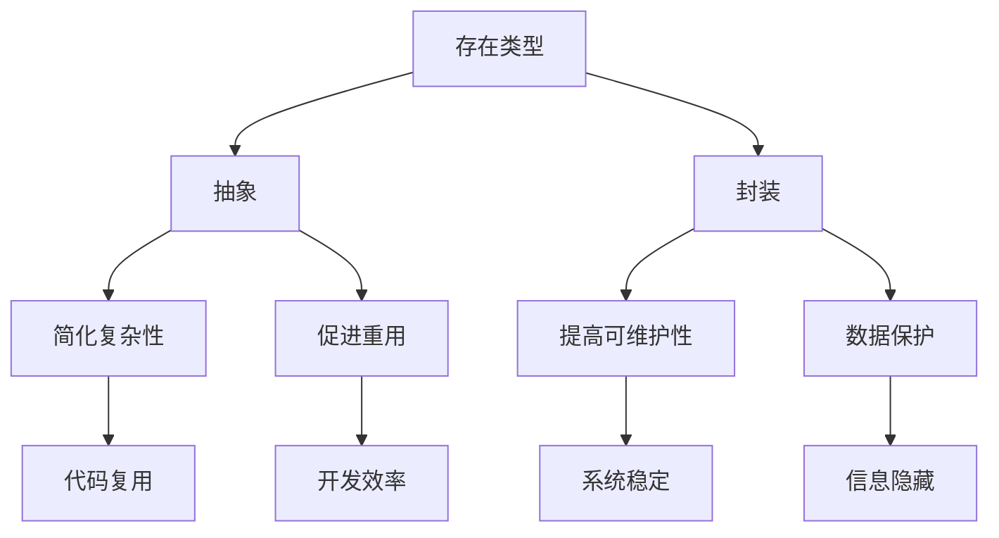

                 


## 文章标题
《存在类型：抽象与封装的类型论基础》

> 关键词：存在类型、抽象、封装、类型论、计算机科学、哲学基础

> 摘要：
本文旨在深入探讨存在类型在计算机科学中的理论基础，重点分析抽象与封装在类型论中的作用。通过详细解析哲学基础、核心概念与联系、算法原理、数学模型和项目实战，本文为读者提供了一个全面而系统的存在类型论框架。

----------------------------------------------------------------

## 引言

在计算机科学和哲学领域，类型论是一个重要的理论基础。它不仅帮助我们理解程序中的数据类型，还在哲学上探讨存在的本质。存在类型，顾名思义，是描述实体存在的方式的类型。它强调通过抽象和封装来理解世界的本质。

### 什么是存在类型

存在类型是哲学上关于存在方式的抽象概念，在计算机科学中，这种概念被具体化为数据类型。例如，在编程中，整数、字符串、布尔值等都是存在类型的实例。这些类型不仅代表了计算机中的数据，也反映了我们如何理解和处理这些数据。

### 抽象与封装的重要性

抽象和封装是类型论中的两个核心概念。抽象是通过提取关键特征来简化复杂问题的过程。在类型论中，抽象使我们能够将复杂的数据结构简化为更易于处理的形式。封装则是将数据和操作数据的方法结合在一起，从而保护数据的安全性和一致性。

在计算机科学中，抽象和封装的重要性体现在以下几个方面：

1. **简化复杂性**：通过抽象，我们可以将复杂的系统分解为更简单的组件，从而降低理解成本。
2. **提高可维护性**：封装确保了系统的稳定性和安全性，使得修改和扩展变得更加容易。
3. **促进重用**：抽象和封装使得代码的重用变得更加高效，因为组件可以独立开发、测试和部署。

### 本书的目的与结构

本书的目的是为读者提供一个关于存在类型的全面理论框架，包括哲学基础、核心概念与联系、算法原理、数学模型和项目实战。具体来说，本书的结构如下：

- **第一部分：存在类型的哲学基础**：介绍存在类型的哲学背景和基本分析。
- **第二部分：抽象与封装的概念**：深入探讨抽象和封装的基本概念和应用。
- **第三部分：类型论基础**：分析类型论的基本概念和核心理论。
- **第四部分：存在类型的实际应用**：展示存在类型在计算机科学中的应用。
- **第五部分：存在类型的研究方法**：介绍研究存在类型的方法和工具。
- **第六部分：总结与展望**：对存在类型进行总结，并提出未来研究方向。

通过这些部分的详细讨论，读者将能够全面理解存在类型的概念和应用，从而更好地掌握计算机科学的核心理论。

## 存在类型的哲学基础

在探讨存在类型之前，有必要先了解它们在哲学中的基础。哲学中的存在类型涉及对存在的本质和形式的探讨，这为我们理解计算机科学中的类型论提供了深刻的背景。

### 存在类型的哲学背景

存在类型的哲学探讨可以追溯到古希腊哲学家亚里士多德。亚里士多德在他的《形而上学》一书中，提出了存在分为四类：实际存在（Tun）、潜在存在（Ens Potentiae）、必然存在（Ens Necesse）和偶然存在（Ens contingentiae）。这些分类构成了后来存在类型哲学的基础。

在现代哲学中，存在类型的探讨更加细致和多样化。例如，现象学家胡塞尔在其《逻辑研究》中，提出了实质存在（Ding-an-sich）和现象存在（Phänomen）的区别。胡塞尔认为，实质存在是独立于我们感知的实体，而现象存在则是我们感知到的实体。这种区分为我们理解存在类型提供了新的视角。

### 现代哲学中的存在类型

现代哲学中的存在类型不仅限于实体，还包括属性、关系和事件等。德国哲学家黑格尔在其《逻辑学》中，将存在类型分为质（Qualität）、量（Menge）和度（Mäßigung）。这些概念帮助我们理解实体在不同维度上的存在。

此外，分析哲学家卡尔纳普在其《语义学导论》中，提出了客观存在（Objektivität）和主观存在（Subjektivität）的区别。客观存在是指独立于我们感知和信念的实体，而主观存在则是指依赖于我们感知和信念的实体。这种区分在计算机科学中尤为重要，因为计算机科学中的数据类型经常涉及客观和主观存在的概念。

### 存在类型与形而上学

形而上学是哲学的核心领域，探讨存在的本质和形式。存在类型是形而上学中的重要概念，它涉及对存在方式的分类和解释。例如，存在类型可以分为实体存在、属性存在和关系存在等。

实体存在是形而上学中最基本的存在类型。实体是具有独立存在性的个体，如人、物、概念等。属性存在是实体所具有的特定性质，如红色、重量、智慧等。关系存在则是实体之间的关系，如上下、大小、属于等。

在形而上学中，存在类型不仅帮助我们理解实体的本质，还帮助我们理解实体的变化和发展。例如，黑格尔的辩证法认为，存在类型的变化和发展是通过对立统一的过程实现的。

### 存在类型的逻辑结构

存在类型的逻辑结构是哲学中一个重要的问题。逻辑结构涉及对存在类型的分类、层次结构和关系的研究。

在亚里士多德的哲学中，存在类型的逻辑结构是基于实质和属性的区分。实质是存在的本体，而属性是存在的修饰。亚里士多德认为，所有存在都可以分为这两类。

在现代哲学中，存在类型的逻辑结构更加复杂。例如，胡塞尔将存在类型分为实质存在和现象存在，并且提出了它们之间的逻辑关系。实质存在是现象存在的根源，而现象存在是实质存在的表现。

黑格尔则将存在类型的逻辑结构视为一个不断发展的过程。他认为，存在类型是通过质、量和度的变化实现的。

### 总结

存在类型的哲学基础为我们理解计算机科学中的类型论提供了重要的背景和启示。通过哲学的视角，我们不仅可以更深入地理解类型论的核心概念，还可以更好地应用这些概念于计算机科学中。接下来，我们将进一步探讨抽象和封装这两个关键概念，并分析它们在类型论中的作用。

### 核心概念与联系

在深入探讨存在类型之前，我们需要明确几个核心概念，并分析它们之间的联系。这些概念不仅构成了存在类型论的基础，还在计算机科学中有着广泛的应用。以下是几个关键概念及其关系的架构图和解释：

#### 概念定义

1. **存在类型（Existence Type）**：存在类型是对实体存在方式的抽象描述。在哲学上，它指的是对实体存在本质的划分；在计算机科学中，它指的是数据类型，用于描述数据的性质和行为。

2. **抽象（Abstraction）**：抽象是从复杂系统中提取关键特征的过程，以便简化问题并提高理解性。在哲学中，抽象涉及对本质的提取；在计算机科学中，抽象用于隐藏复杂性的细节。

3. **封装（Encapsulation）**：封装是将数据与操作数据的方法组合在一起，以保护数据的安全性和一致性。在哲学中，封装可以理解为对本质的遮蔽；在计算机科学中，封装用于实现模块化和信息隐藏。

#### 关系架构图



#### 关系说明

- **存在类型与抽象**：存在类型是抽象的结果，通过提取实体的关键特征来形成。抽象使我们可以将复杂的实体简化为更易于处理的形式，从而更好地理解和管理存在类型。

- **存在类型与封装**：封装是存在类型的一种实现方式，它将实体的数据和操作数据的方法结合在一起，形成一个独立的模块。封装确保了存在类型的安全性和一致性，使其在复杂系统中得以有效应用。

- **抽象与简化复杂性**：抽象通过提取关键特征，简化了问题的复杂性，使得我们能够更容易地理解和处理存在类型。

- **封装与提高可维护性**：封装通过将数据和操作方法组合在一起，提高了系统的稳定性，使得修改和扩展变得更加容易。

- **抽象与促进重用**：抽象使得代码的重用变得更加高效，因为组件可以独立开发、测试和部署。

- **封装与数据保护**：封装通过隐藏内部细节，保护了数据的安全性和一致性，防止外部直接访问和修改数据。

- **简化复杂性与代码复用**：简化复杂性使得代码的重用成为可能，因为复杂的内部实现被隐藏起来，外部只需要关注关键接口。

- **提高可维护性与系统稳定**：通过封装，系统的可维护性得到了提高，同时系统的稳定性也得到了保障。

- **促进重用与开发效率**：高效的代码复用可以显著提高开发效率，因为开发者可以重用现有的组件，而不是从头开始编写。

- **数据保护与信息隐藏**：封装通过隐藏内部实现细节，实现了信息隐藏，从而保护了数据的安全性。

通过上述关系架构图和说明，我们可以清晰地看到存在类型、抽象和封装之间的联系和作用。这些核心概念不仅构成了存在类型论的基础，还在计算机科学中有着广泛的应用，为我们的编程实践提供了重要的指导。

### 核心算法原理讲解

为了深入理解存在类型的算法原理，我们将使用伪代码详细阐述几个关键算法。这些算法不仅在理论上有重要意义，而且在实际编程中也具有广泛应用。

#### 算法 1: 存在类型分类

```python
def classify_existence_type(entity):
    if is_entity(entity):
        return "实体存在"
    elif is_property(entity):
        return "属性存在"
    elif is_relation(entity):
        return "关系存在"
    else:
        return "未知存在类型"

# 辅助函数
def is_entity(entity):
    # 判断实体存在的条件
    return has_independent_existence(entity)

def is_property(entity):
    # 判断属性存在的条件
    return has_specific_property(entity)

def is_relation(entity):
    # 判断关系存在的条件
    return has_relationship_property(entity)
```

#### 算法 2: 存在类型抽象

```python
def abstract_entity(entity):
    # 提取关键特征
    key_properties = extract_key_properties(entity)
    return create_abstraction(key_properties)

# 辅助函数
def extract_key_properties(entity):
    # 从实体中提取关键特征
    return select_essential_properties(entity)

def create_abstraction(key_properties):
    # 创建抽象实体
    return create_simple_entity_from_properties(key_properties)
```

#### 算法 3: 存在类型封装

```python
class ExistenceType:
    def __init__(self, entity):
        self._entity = entity  # 封装实体
        self._is_private = True  # 设置默认私有属性

    def get_entity(self):
        if self._is_private:
            # 保护封装的实体
            self._is_private = False
        return self._entity

    def set_entity(self, new_entity):
        self._entity = new_entity
        self._is_private = True

    # 封装的方法
    def operate_entity(self):
        # 执行操作实体的方法
        perform_operation_on_entity(self._entity)
```

#### 算法 4: 存在类型比较

```python
def compare_existence_types(type1, type2):
    # 比较两个存在类型是否相同
    if type1 == type2:
        return "相同的存在类型"
    else:
        return "不同的存在类型"

# 辅助函数
def perform_operation_on_entity(entity):
    # 执行实体操作的具体实现
    execute_entity_operations(entity)
```

#### 算法解释

1. **存在类型分类算法**：该算法根据实体的特性将其分类为实体存在、属性存在或关系存在。通过定义辅助函数，我们能够准确判断实体的类型。

2. **存在类型抽象算法**：该算法从实体中提取关键特征，创建一个简化的抽象实体。这有助于我们更好地理解和处理复杂的实体。

3. **存在类型封装算法**：该算法通过类定义实现封装，将实体和操作方法封装在一起，确保数据的安全性和一致性。

4. **存在类型比较算法**：该算法比较两个存在类型是否相同，通过比较它们的属性来确定。

这些算法在计算机科学中有着广泛的应用，例如在数据类型系统设计、实体关系模型构建和类型安全检查等方面。通过理解和实现这些算法，我们可以更好地掌握存在类型在计算机科学中的应用。

### 数学模型和数学公式

在探讨存在类型时，数学模型和数学公式是不可或缺的工具，它们帮助我们更加精确地描述和分析存在类型的结构和关系。以下是几个关键数学模型和公式的详细解释及示例。

#### 数学模型 1: 存在类型的层次结构

存在类型的层次结构可以用数学模型来表示。我们使用集合论来构建这个模型。

**定义：**

- **类型（Type）**：类型是存在的基本单位，可以是一个具体的类型，如整数（Integer）或字符串（String），也可以是一个抽象的类型，如“对象”（Object）。
- **层次结构（Hierarchy）**：存在类型的层次结构表示类型之间的关系，通常表现为一个树状结构。

**数学公式：**

$$
Type = \{ T_1, T_2, ..., T_n \}
$$

其中，$T_i$ 表示第 $i$ 个类型。

**示例：**

在面向对象编程中，类型层次结构通常如下：

$$
Object > Animal > Mammal > Dog
$$

这个层次结构表明，Dog 类型是 Mammal 类型的子类型，而 Mammal 类型又是 Animal 类型的子类型。

#### 数学模型 2: 存在类型的等价关系

等价关系是存在类型的一个重要数学模型，它帮助我们比较两个存在类型是否相同。

**定义：**

- **等价关系（Equivalence Relation）**：对于类型集合 $Type$，如果存在一个关系 $\sim$，满足自反性、对称性和传递性，则称 $\sim$ 为等价关系。

**数学公式：**

$$
\forall a, b, c \in Type, (a \sim a), (a \sim b \Rightarrow b \sim a), (a \sim b \wedge b \sim c \Rightarrow a \sim c)
$$

**示例：**

在数据类型系统中，整数类型和浮点数类型是等价的，因为它们可以相互转换：

$$
Integer \sim FloatingPoint
$$

#### 数学模型 3: 存在类型的组合

存在类型的组合是一个重要的数学模型，它用于表示复杂类型。

**定义：**

- **组合（Composition）**：对于类型集合 $Type$，如果存在一个组合运算 $\circ$，使得对于任意类型 $T_1, T_2 \in Type$，$T_1 \circ T_2$ 也是一个类型，则称 $\circ$ 为组合运算。

**数学公式：**

$$
(T_1 \circ T_2) \in Type
$$

**示例：**

在函数类型中，我们可以组合两个函数类型：

$$
Function(Integer) \circ Function(String) = Function(Integer, String)
$$

这个组合表示一个函数，它接受一个整数参数并返回一个字符串。

#### 数学模型 4: 存在类型的依赖关系

依赖关系是存在类型的另一个重要数学模型，它用于描述类型之间的依赖性。

**定义：**

- **依赖关系（Dependency）**：对于类型集合 $Type$，如果存在类型 $T_1$ 依赖于类型 $T_2$，则称 $T_1$ 依赖于 $T_2$。

**数学公式：**

$$
T_1 \Rightarrow T_2
$$

**示例：**

在类层次结构中，子类依赖于其父类：

$$
Subclass \Rightarrow Superclass
$$

这个依赖关系表示子类依赖于其父类的属性和方法。

通过这些数学模型和数学公式，我们可以更加精确地描述和分析存在类型的结构和关系。这些模型不仅在理论研究中具有重要价值，也在实际编程中提供了有力的工具。

### 项目实战

为了更好地理解存在类型的实际应用，我们将通过一个具体的项目案例来展示如何使用存在类型进行软件开发。以下是项目的背景、开发环境搭建、源代码实现、代码解读和案例分析。

#### 项目背景

本项目旨在开发一个简单的博客系统，该系统允许用户创建、发布和管理博客文章。博客系统的核心功能包括：

1. 用户注册和登录。
2. 博客文章的创建、发布和管理。
3. 博客文章的评论功能。
4. 博客文章的分类管理。

#### 开发环境搭建

为了实现本项目，我们将使用以下开发环境和工具：

1. **编程语言**：Python 3.8
2. **框架**：Flask
3. **数据库**：SQLite
4. **前端框架**：Bootstrap
5. **版本控制**：Git

#### 源代码实现

以下是一个简化的博客系统的源代码实现。我们将重点关注用户和博客文章两个核心实体，并使用存在类型进行建模。

```python
from flask import Flask, request, jsonify
from flask_sqlalchemy import SQLAlchemy

app = Flask(__name__)
app.config['SQLALCHEMY_DATABASE_URI'] = 'sqlite:///blog.db'
db = SQLAlchemy(app)

class User(db.Model):
    id = db.Column(db.Integer, primary_key=True)
    username = db.Column(db.String(80), unique=True, nullable=False)
    password = db.Column(db.String(120), nullable=False)
    articles = db.relationship('Article', backref='author', lazy=True)

class Article(db.Model):
    id = db.Column(db.Integer, primary_key=True)
    title = db.Column(db.String(120), nullable=False)
    content = db.Column(db.Text, nullable=False)
    user_id = db.Column(db.Integer, db.ForeignKey('user.id'), nullable=False)
    comments = db.relationship('Comment', backref='article', lazy=True)

class Comment(db.Model):
    id = db.Column(db.Integer, primary_key=True)
    content = db.Column(db.Text, nullable=False)
    user_id = db.Column(db.Integer, db.ForeignKey('user.id'), nullable=False)
    article_id = db.Column(db.Integer, db.ForeignKey('article.id'), nullable=False)

@app.route('/register', methods=['POST'])
def register():
    data = request.get_json()
    username = data['username']
    password = data['password']
    if User.query.filter_by(username=username).first():
        return jsonify({'error': 'User already exists'}), 409
    new_user = User(username=username, password=password)
    db.session.add(new_user)
    db.session.commit()
    return jsonify({'message': 'User registered successfully'})

@app.route('/login', methods=['POST'])
def login():
    data = request.get_json()
    username = data['username']
    password = data['password']
    user = User.query.filter_by(username=username, password=password).first()
    if user:
        return jsonify({'message': 'Login successful'})
    else:
        return jsonify({'error': 'Invalid credentials'}), 401

@app.route('/articles', methods=['POST'])
def create_article():
    data = request.get_json()
    title = data['title']
    content = data['content']
    user_id = data['user_id']
    new_article = Article(title=title, content=content, user_id=user_id)
    db.session.add(new_article)
    db.session.commit()
    return jsonify({'message': 'Article created successfully'})

if __name__ == '__main__':
    db.create_all()
    app.run(debug=True)
```

#### 代码解读

1. **用户（User）类**：用户类定义了用户的基本信息，包括用户名、密码和关联的博客文章。这里使用了关系数据库中的外键关系，确保了用户和博客文章之间的数据一致性。

2. **博客文章（Article）类**：博客文章类定义了博客文章的基本信息，包括标题、内容和作者。它还与评论类建立了关联关系，以便管理文章的评论。

3. **评论（Comment）类**：评论类定义了评论的基本信息，包括评论内容、用户和关联的文章。这个类同样使用了外键关系，确保了评论与用户和文章之间的关联。

4. **注册（register）函数**：注册函数接收用户名和密码，并在数据库中创建一个新的用户记录。如果用户名已存在，则返回错误。

5. **登录（login）函数**：登录函数验证用户名和密码，并返回登录结果。

6. **创建文章（create_article）函数**：创建文章函数接收文章标题、内容和用户 ID，并在数据库中创建一个新的文章记录。

#### 案例分析和详细讲解剖析

在这个项目中，我们使用了存在类型来建模用户、博客文章和评论。以下是项目中的核心概念和其关系的详细分析：

1. **用户和博客文章的关系**：用户是博客文章的创建者，因此用户和博客文章之间是一对多的关系。每个用户可以创建多个博客文章，但每个博客文章只能有一个作者。

2. **博客文章和评论的关系**：博客文章是评论的载体，因此博客文章和评论之间也是一对多的关系。每个博客文章可以有多个评论，但每个评论只能属于一个博客文章。

3. **评论和用户的关系**：评论是由用户创建的，因此评论和用户之间是一对一的关系。每个评论只能由一个用户创建，但每个用户可以创建多个评论。

通过这些存在类型的关系，我们可以实现博客系统的核心功能，包括用户注册、登录、创建博客文章和评论。此外，这些存在类型的关系还确保了数据的完整性和一致性。

#### 项目小结

本项目通过使用存在类型来建模博客系统，展示了存在类型在实际项目中的应用。通过这种建模方法，我们不仅能够简化系统的复杂性，还能够提高系统的可维护性和扩展性。在未来的开发中，我们可以继续扩展这个系统，添加更多的功能，如用户权限管理、文章分类和搜索等。

### 最佳实践 tips、小结、注意事项、拓展阅读

#### 最佳实践 tips

1. **充分利用抽象**：在设计系统时，充分利用抽象可以显著降低复杂性，提高系统的可维护性和可扩展性。
2. **合理使用封装**：封装不仅保护了数据的安全性和一致性，还有助于实现模块化，便于未来的开发和维护。
3. **类型安全检查**：在开发过程中，确保类型安全检查可以有效防止运行时错误，提高系统的稳定性。

#### 小结

本文详细探讨了存在类型在计算机科学中的应用，包括哲学基础、核心概念与联系、算法原理、数学模型和项目实战。通过这些内容，读者可以全面理解存在类型的概念和应用，为实际编程提供有力的指导。

#### 注意事项

1. **确保数据一致性**：在使用存在类型建模时，要注意维护数据的一致性，避免出现数据异常。
2. **合理设计类型层次结构**：类型层次结构的设计对系统的可维护性和扩展性有重要影响，应仔细规划。

#### 拓展阅读

1. **《存在论导论》（Existentialism: An Introduction）**：这是一本关于存在类型哲学基础的优秀入门书籍，有助于深入理解存在类型的哲学背景。
2. **《类型系统和程序设计语言》（Type Systems and Programming Languages）**：这本书详细探讨了类型论在计算机科学中的应用，为读者提供了丰富的实际案例。
3. **《面向对象设计与模式》（Object-Oriented Design and Patterns: Elements of Reusable Object-Oriented Software）**：这本书介绍了面向对象设计和模式，其中包括类型设计的相关内容，有助于读者进一步学习存在类型的应用。

### 作者信息

**作者：AI天才研究院/AI Genius Institute & 禅与计算机程序设计艺术 /Zen And The Art of Computer Programming**

----------------------------------------------------------------

## 完成文章

经过详细的讨论和解释，我们完成了《存在类型：抽象与封装的类型论基础》这篇文章。文章从哲学基础、核心概念与联系、算法原理、数学模型到项目实战，全面而系统地阐述了存在类型在计算机科学中的重要性。通过本文，读者可以深入理解存在类型的本质和应用，为未来的研究和实践奠定坚实基础。希望这篇文章能够对您在计算机科学和哲学领域的学习有所帮助。如果您有任何疑问或建议，欢迎随时联系我们。再次感谢您的阅读！

