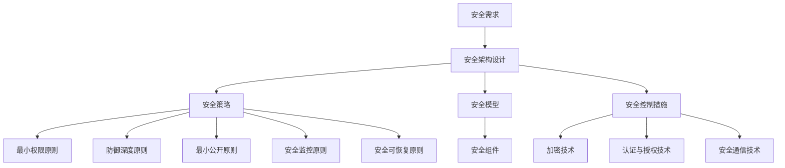
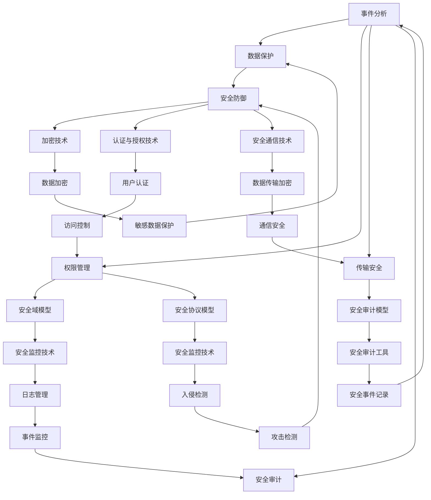
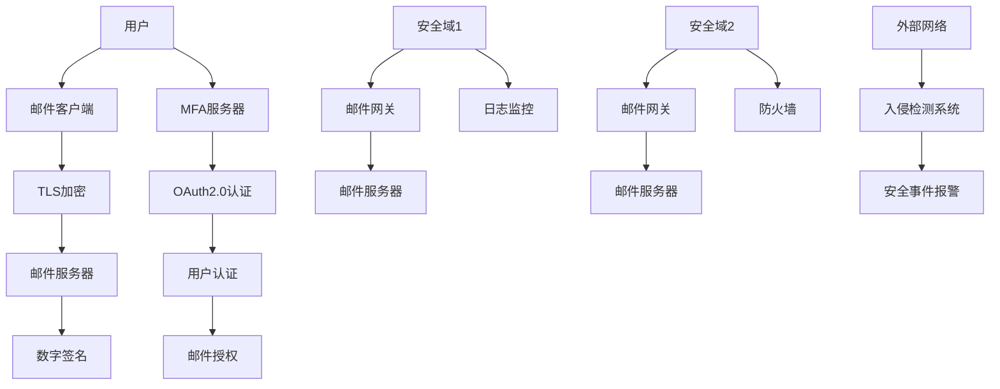

                 

### 文章标题

《安全架构设计：P9工程师的责任与使命》

### 文章关键词

- 安全架构设计
- P9工程师
- 安全策略
- 加密技术
- 认证与授权
- 安全通信
- 挑战与解决方案

### 文章摘要

随着信息技术的飞速发展，网络安全已经成为企业和社会关注的焦点。作为技术领域的佼佼者，P9工程师在安全架构设计中承担着至关重要的责任。本文将详细探讨安全架构设计的核心概念、关键要素、方法论、技术原理及实战案例，旨在为P9工程师提供全面的安全架构设计指导，并明确他们在其中的使命与责任。通过深入分析，本文将帮助读者理解如何设计一个高效、可靠的安全架构，为应对日益复杂的网络安全威胁做好准备。|user|>

### 引言

在数字化时代，信息技术已经渗透到社会的各个角落，从个人生活到企业运营，无处不在。随着互联网的普及和数据量的爆炸式增长，网络安全成为了一个不容忽视的重要问题。近年来，各种网络攻击事件屡见不鲜，从简单的钓鱼邮件到复杂的勒索软件攻击，这些事件不仅造成了巨大的经济损失，还严重影响了用户隐私和数据安全。在这样的背景下，安全架构设计的重要性日益凸显。

P9工程师，作为技术领域的顶尖人才，他们在安全架构设计中的角色与使命显得尤为关键。P9工程师不仅需要具备深厚的技术背景，更需具备前瞻性的安全意识和卓越的设计能力。他们肩负着确保企业信息系统安全、保护用户隐私和数据安全的重任。因此，理解安全架构设计的基本概念和核心原理，掌握有效的安全架构设计方法和技术，是P9工程师不可或缺的技能。

本文将从以下几个方面进行探讨：

1. **安全架构设计的核心概念**：介绍安全架构的定义、设计原则以及其与整体系统架构的关系。
2. **安全架构设计的关键要素**：详细解析安全策略、安全模型和安全控制措施。
3. **安全架构设计的方法论**：阐述设计流程、工具与技术，并通过案例研究加深理解。
4. **安全架构设计的技术原理**：探讨加密技术、认证与授权技术以及安全通信技术。
5. **安全架构设计的挑战与解决方案**：分析常见安全问题及其解决方案和最佳实践。
6. **P9工程师的角色与责任**：讨论P9工程师在安全架构设计中的职责、领导力和团队协作。
7. **安全架构设计的实战案例**：通过实际案例展示安全架构设计的全过程，并进行深入剖析。

通过上述内容的详细讨论，本文旨在为P9工程师提供系统的安全架构设计指南，帮助他们更好地应对网络安全挑战，实现企业信息系统的安全防护。|user|>

### 安全架构设计的核心概念

安全架构设计是确保信息系统安全的重要环节。首先，我们需要明确安全架构的定义。安全架构是指在系统设计阶段，通过一系列原则、策略和组件，构建一个具有抗攻击性、可扩展性和高可靠性的安全体系。它不仅包括技术层面的安全措施，还涵盖了管理层面的安全政策和流程。

安全架构的设计原则是确保安全体系有效性的基础。以下是一些关键的设计原则：

1. **最小权限原则**：系统组件应仅拥有完成其任务所需的最小权限，以减少潜在的安全风险。
2. **防御深度原则**：系统应设置多层安全控制措施，形成多道防线，提高攻击者突破系统的难度。
3. **最小公开原则**：系统应仅公开必要的服务和接口，减少攻击面。
4. **安全监控原则**：系统应具备实时监控和报警机制，及时发现和响应安全事件。
5. **安全可恢复原则**：系统设计时应考虑安全事件发生后的快速恢复能力。

安全架构与整体系统架构之间的关系紧密。安全架构是系统架构的一部分，两者相互交织、相互影响。在系统架构设计中，安全架构应作为一个独立的模块，贯穿于整个开发周期。具体而言，安全架构与系统架构的关系体现在以下几个方面：

1. **系统需求**：安全架构设计应基于系统的功能需求和安全需求，确保安全策略与系统设计的一致性。
2. **组件集成**：安全架构的组件应与其他系统组件紧密集成，确保安全措施的有效实施。
3. **性能优化**：在保证安全性的同时，安全架构设计还需考虑系统的性能优化，避免安全措施对系统性能产生过大影响。
4. **扩展性**：安全架构设计应具备良好的扩展性，以适应未来系统功能和安全需求的变化。

为了更好地理解安全架构设计的核心概念，我们可以通过一个简单的Mermaid流程图来展示其基本架构：



该流程图展示了安全架构设计的核心概念及其相互关系，有助于我们系统地理解安全架构设计的基本原理和流程。|user|>

### 安全架构设计的关键要素

在安全架构设计中，关键要素起着决定性作用。这些要素包括安全策略、安全模型和安全控制措施，它们共同构成了一个全面的安全体系。

#### 安全策略

安全策略是安全架构设计的基础，它定义了系统在安全方面的总体方向和基本原则。安全策略的制定需要综合考虑企业的业务需求、安全需求和法律法规要求。以下是安全策略的主要组成部分：

1. **风险管理策略**：评估和分析潜在的安全威胁和风险，制定相应的应对措施。
2. **访问控制策略**：定义用户权限和访问权限，确保只有授权用户可以访问系统资源。
3. **数据保护策略**：保护敏感数据，包括加密存储和传输，以及数据备份和恢复策略。
4. **安全事件响应策略**：定义在安全事件发生时的应急响应流程，包括报警、取证和恢复。
5. **安全培训策略**：制定员工安全培训和意识提升计划，提高整体安全水平。

一个有效的安全策略应具备以下特点：

- **全面性**：覆盖所有关键领域和关键流程，确保没有安全盲点。
- **灵活性**：能够根据业务变化和威胁环境的变化进行调整和优化。
- **可执行性**：具备明确的操作指南和实施细则，确保安全策略能够有效落地。

#### 安全模型

安全模型是安全架构设计的重要组成部分，它描述了系统的安全结构和功能。常见的安全模型包括：

1. **访问控制模型**：如基于角色的访问控制（RBAC）和基于属性的访问控制（ABAC）。
2. **安全域模型**：定义系统的安全区域和隔离机制，如网络分段和防火墙策略。
3. **安全协议模型**：定义系统内部和外部的安全通信协议，如SSL/TLS。
4. **安全审计模型**：确保系统安全事件的记录和监控，如安全信息和事件管理（SIEM）系统。

安全模型的选择应根据系统的具体需求和威胁环境来确定。例如，对于高度敏感的数据处理系统，可以选择基于属性的访问控制（ABAC）模型，以提高数据访问的安全性。

#### 安全控制措施

安全控制措施是安全架构设计中的实际操作手段，它们确保安全策略和安全模型得以实现。常见的安全控制措施包括：

1. **加密技术**：用于保护数据的机密性、完整性和可用性。常见的加密技术包括对称加密和非对称加密。
2. **认证与授权技术**：用于验证用户身份和授权其访问系统资源。常见的认证技术包括密码认证、多因素认证（MFA）和生物识别。
3. **安全通信技术**：用于保护系统之间的数据传输安全，常见的通信技术包括VPN和TLS。
4. **安全审计和监控技术**：用于记录和监控系统安全事件，常见的审计和监控工具包括日志管理系统和入侵检测系统（IDS）。

以下是这些要素之间的关系架构图，通过Mermaid流程图展示：



通过上述关键要素的详细介绍和关系架构图的展示，我们可以更清晰地理解安全架构设计的基本原理和实施步骤。这些关键要素相互配合，共同构成了一个完整、高效的安全架构，为系统的安全运行提供了坚实的保障。|user|>

### 安全架构设计的方法论

安全架构设计的方法论是确保安全架构设计过程规范、高效的关键。以下将详细介绍安全架构设计的设计流程、工具与技术，并通过一个实际案例研究来加深理解。

#### 设计流程

安全架构设计流程可以分为以下几个阶段：

1. **需求分析**：了解系统的功能需求和安全需求，明确安全架构的目标和约束条件。
2. **架构设计**：基于需求分析结果，设计安全架构的总体结构和功能模块。
3. **实现与部署**：根据架构设计，实现安全组件并部署到实际环境中。
4. **测试与验证**：对安全架构进行测试，确保其能够满足安全需求和性能要求。
5. **持续优化**：根据测试结果和实际运行情况，对安全架构进行调整和优化。

#### 设计工具与技术

在设计安全架构时，以下工具和技术是不可或缺的：

1. **安全建模工具**：如OASIS（Open Architecture Security Information System）和Cybersecurity Framework，用于描述安全架构和流程。
2. **绘图工具**：如Mermaid、Visio和Lucidchart，用于绘制安全架构图和流程图。
3. **编程语言**：如Python和Java，用于编写安全相关的代码和脚本。
4. **安全测试工具**：如OWASP ZAP（Zed Attack Proxy）和Nessus，用于测试和验证安全架构的有效性。

#### 案例研究

以下是一个关于企业内部邮件系统的安全架构设计案例研究：

**背景**：一家企业希望为其内部邮件系统设计一个安全架构，以保护邮件内容的安全性和完整性，防止外部攻击和数据泄露。

**需求分析**：
- **功能需求**：确保邮件传输过程中的加密、用户身份认证和数据完整性。
- **安全需求**：防止邮件内容被窃取、篡改和未授权访问。

**架构设计**：

1. **安全策略**：
   - 邮件传输必须使用TLS协议。
   - 用户必须通过多因素认证（MFA）进行身份验证。
   - 所有邮件内容必须进行数字签名，确保数据完整性。

2. **安全模型**：
   - 访问控制模型：使用RBAC（基于角色的访问控制）来管理用户权限。
   - 安全域模型：将内部网络划分为多个安全域，实现网络隔离。
   - 安全通信模型：使用SSL/TLS进行加密传输。

3. **安全控制措施**：
   - 加密技术：使用AES-256进行邮件内容加密。
   - 认证与授权技术：使用OAuth2.0进行用户认证和授权。
   - 安全通信技术：使用TLS进行邮件传输。

**实现与部署**：
- 部署TLS服务器和邮件网关，实现邮件传输加密。
- 部署MFA服务器，实现多因素认证。
- 配置邮件客户端，要求用户使用MFA进行身份验证。

**测试与验证**：
- 使用OWASP ZAP进行安全测试，检查是否存在安全漏洞。
- 进行邮件传输性能测试，确保加密传输不会显著降低系统性能。

**持续优化**：
- 定期更新加密算法和协议，以应对新的安全威胁。
- 监控邮件系统的运行状态，及时处理安全事件。

**架构图**：



通过这个案例研究，我们可以看到安全架构设计的方法论在实际应用中的具体实现过程。这个案例展示了如何通过设计安全策略、构建安全模型和实施安全控制措施，来确保企业内部邮件系统的安全性。|user|>

### 安全架构设计的技术原理

在安全架构设计中，掌握核心技术原理是至关重要的。以下将详细介绍加密技术、认证与授权技术以及安全通信技术，并使用伪代码和LaTeX公式来阐述其原理和实现。

#### 加密技术

加密技术是保护数据机密性和完整性的重要手段。常见的加密技术包括对称加密和非对称加密。

1. **对称加密**

   对称加密使用相同的密钥进行加密和解密。常见的对称加密算法有AES和DES。

   **伪代码**：

   ```python
   function AES_Encrypt(plaintext, key):
       ciphertext = AES_Encrypt(plaintext, key)
       return ciphertext
   
   function AES_Decrypt(ciphertext, key):
       plaintext = AES_Decrypt(ciphertext, key)
       return plaintext
   ```

   **LaTeX公式**：

   $$ AES_Encrypt(\text{plaintext}, \text{key}) = \text{ciphertext} $$
   $$ AES_Decrypt(\text{ciphertext}, \text{key}) = \text{plaintext} $$

2. **非对称加密**

   非对称加密使用一对密钥（公钥和私钥）进行加密和解密。常见的非对称加密算法有RSA和ECC。

   **伪代码**：

   ```python
   function RSA_Encrypt(plaintext, public_key):
       ciphertext = RSA_Encrypt(plaintext, public_key)
       return ciphertext
   
   function RSA_Decrypt(ciphertext, private_key):
       plaintext = RSA_Decrypt(ciphertext, private_key)
       return plaintext
   ```

   **LaTeX公式**：

   $$ RSA_Encrypt(\text{plaintext}, \text{public\_key}) = \text{ciphertext} $$
   $$ RSA_Decrypt(\text{ciphertext}, \text{private\_key}) = \text{plaintext} $$

#### 认证与授权技术

认证与授权技术用于确保只有授权用户可以访问系统资源。

1. **认证技术**

   常见的认证技术包括密码认证和多因素认证（MFA）。

   **密码认证**

   **伪代码**：

   ```python
   function PasswordAuthenticate(username, password):
       if stored_password == password:
           return "Authenticated"
       else:
           return "Failed"
   ```

   **多因素认证（MFA）**

   **伪代码**：

   ```python
   function MFAAuthenticate(username, password, one_time_code):
       if PasswordAuthenticate(username, password):
           if OneTimeCodeIsValid(one_time_code):
               return "Authenticated"
           else:
               return "Failed"
       else:
           return "Failed"
   ```

2. **授权技术**

   常见的授权技术包括基于角色的访问控制（RBAC）和基于属性的访问控制（ABAC）。

   **基于角色的访问控制（RBAC）**

   **LaTeX公式**：

   $$ \text{Access\_Control}(\text{User}, \text{Object}, \text{Action}) = \begin{cases} 
   \text{Allow} & \text{if } \text{User} \in \text{Role} \land \text{Action} \in \text{Permission}(\text{Role}) \\
   \text{Deny} & \text{otherwise}
   \end{cases} $$

   **基于属性的访问控制（ABAC）**

   **LaTeX公式**：

   $$ \text{Access\_Control}(\text{User}, \text{Object}, \text{Action}) = \begin{cases} 
   \text{Allow} & \text{if } \text{Attribute}(\text{User}) \land \text{Attribute}(\text{Object}) \implies \text{Action} \\
   \text{Deny} & \text{otherwise}
   \end{cases} $$

#### 安全通信技术

安全通信技术用于确保数据传输的安全性和完整性。常见的安全通信技术包括VPN和TLS。

1. **VPN**

   **伪代码**：

   ```python
   function ConnectVPN(username, password):
       if VPN_Server.Authenticate(username, password):
           VPN_Connection = VPN_Server.EstablishConnection()
           return VPN_Connection
       else:
           return "Failed"
   ```

2. **TLS**

   **伪代码**：

   ```python
   function TLS_Connect(server_address):
       context = TLS_Context()
       if context.EstablishConnection(server_address):
           return context
       else:
           return "Failed"
   ```

通过上述对加密技术、认证与授权技术以及安全通信技术的详细解析，我们可以看到这些技术在安全架构设计中的重要性。掌握这些技术原理，有助于我们设计出更加安全、可靠的系统架构。|user|>

### 安全架构设计的挑战与解决方案

在安全架构设计过程中，工程师们常常面临各种挑战。以下是几个常见的问题及其解决方案和最佳实践。

#### 常见安全问题

1. **数据泄露**：数据泄露可能是由于安全措施不足、密码管理不当或网络攻击等原因导致的。

2. **拒绝服务攻击（DoS）**：攻击者通过大量无效请求使系统资源耗尽，导致正常用户无法访问服务。

3. **中间人攻击（MITM）**：攻击者拦截和篡改系统间的通信数据。

4. **注入攻击**：攻击者通过输入恶意代码，篡改数据库或系统配置。

5. **供应链攻击**：攻击者通过入侵软件供应链，将恶意代码植入软件中。

#### 解决方案与最佳实践

1. **数据泄露**：

   - **加密敏感数据**：对存储和传输的敏感数据进行加密，防止数据泄露。
   - **访问控制**：实施严格的访问控制策略，确保只有授权用户可以访问敏感数据。
   - **数据备份与恢复**：定期备份数据，并确保备份数据的安全。

2. **拒绝服务攻击（DoS）**：

   - **流量分析**：使用流量分析工具，识别异常流量并采取措施。
   - **防火墙与入侵检测**：配置防火墙和入侵检测系统，过滤掉恶意流量。
   - **负载均衡**：通过负载均衡技术，分散请求，防止单点故障。

3. **中间人攻击（MITM）**：

   - **使用TLS**：在通信中使用TLS协议，确保通信数据的机密性和完整性。
   - **证书管理**：严格管理证书，确保证书的合法性和安全性。
   - **安全审计**：定期进行安全审计，检查系统是否存在安全隐患。

4. **注入攻击**：

   - **输入验证**：对所有输入进行严格验证，防止恶意代码注入。
   - **使用参数化查询**：避免直接拼接SQL语句，使用参数化查询来防止SQL注入。
   - **代码审计**：定期进行代码审计，检查代码中是否存在安全漏洞。

5. **供应链攻击**：

   - **供应链监控**：对软件供应链进行监控，确保软件组件的安全性和完整性。
   - **安全编码实践**：鼓励开发人员遵循安全编码实践，减少供应链中的安全漏洞。
   - **代码签名与验证**：对软件组件进行代码签名，并在部署时验证签名，确保软件未被篡改。

#### 复杂场景下的设计考虑

在复杂的场景下，安全架构设计需要更加细致和全面。以下是一些考虑因素：

1. **多租户环境**：在多租户环境中，需要确保不同租户之间的数据和资源隔离，防止数据泄露和攻击。

2. **合规性要求**：在特定行业（如金融、医疗）中，需要遵循相应的法律法规和行业标准，确保系统的合规性。

3. **云安全**：在云环境中，需要考虑云服务商的安全措施，确保数据在云环境中的安全性。

4. **数据生命周期管理**：对数据生命周期进行全程管理，包括数据的生成、存储、传输、处理和销毁，确保数据在各个阶段的安全。

通过上述解决方案和最佳实践，工程师们可以更好地应对安全架构设计过程中的挑战，确保系统的安全性。在复杂场景下，需要综合考虑各种因素，设计出更加全面和高效的安全架构。|user|>

### P9工程师的角色与责任

在安全架构设计中，P9工程师的角色与责任至关重要。作为技术领域的顶尖人才，P9工程师不仅在技术层面承担着关键职责，还需要在团队协作、沟通和领导力方面发挥重要作用。

首先，P9工程师在安全架构设计中的职责包括：

1. **技术领导**：负责指导和监督安全架构的设计与实施，确保技术方案的科学性和先进性。
2. **需求分析**：与业务团队紧密合作，深入理解业务需求，并将其转化为具体的安全架构设计。
3. **方案评审**：参与安全方案的评审，对方案的技术可行性、安全性和可靠性进行评估。
4. **项目推进**：负责项目的进度控制，协调各方资源，确保项目按时完成。

其次，P9工程师在安全架构设计中的领导力体现在：

1. **团队建设**：培养和带领团队，提升团队的技术能力和协作效率。
2. **技术传承**：通过培训和分享，将自身的经验和知识传递给团队成员，提升团队的整体技术水平。
3. **决策支持**：在项目决策过程中，提供专业的技术意见，确保项目方向的正确性。

此外，P9工程师在团队协作与沟通方面需要具备以下能力：

1. **沟通技巧**：与业务团队、产品团队和运维团队进行有效沟通，确保安全架构设计与其他业务环节的无缝对接。
2. **协作精神**：积极参与团队协作，与其他团队成员共同解决技术难题，推动项目顺利进行。
3. **问题解决**：在面对技术挑战时，能够快速找到解决方案，并引导团队共同应对。

为了更好地履行上述职责和发挥领导力，P9工程师需要掌握以下技能和知识：

1. **安全技术**：熟悉各种安全技术和工具，如加密技术、认证与授权技术、安全通信技术等。
2. **系统架构**：具备深厚的系统架构设计能力，能够从整体上把握系统的安全性、性能和可扩展性。
3. **项目管理**：掌握项目管理方法和技巧，能够有效地协调资源和控制项目进度。
4. **法律法规**：了解相关法律法规和行业标准，确保安全架构设计符合合规性要求。

总之，P9工程师在安全架构设计中的角色与责任不仅仅是技术层面的，还需要在团队协作、沟通和领导力方面发挥重要作用。通过不断提升自身的技术能力和领导力，P9工程师能够更好地推动安全架构设计的成功实施，为企业的信息系统安全提供坚实保障。|user|>

### 安全架构设计的实战案例

在本节中，我们将通过一个实际案例来展示安全架构设计的全过程，并深入剖析其中的关键步骤、技术实现和代码解析。

#### 案例背景

一家金融科技公司开发了一款在线支付系统，为了确保支付过程的安全，该公司决定采用先进的安全架构设计。该系统需要处理大量的交易数据，同时要保证数据的机密性、完整性和可靠性。此外，系统还需具备快速响应能力和高可用性。作为项目的首席技术官（CTO），P9工程师需负责设计和实施整个安全架构。

#### 安全架构设计过程

1. **需求分析**：
   - **功能需求**：确保支付数据在传输和存储过程中的加密。
   - **安全需求**：防止数据泄露、篡改和未授权访问。
   - **性能需求**：保证支付流程的高效性，确保系统在高并发场景下依然稳定运行。

2. **架构设计**：
   - **安全策略**：制定严格的安全策略，包括加密传输、多重认证和访问控制。
   - **安全模型**：采用RBAC（基于角色的访问控制）和ABAC（基于属性的访问控制）相结合的模型，确保不同角色的用户具有不同的权限。
   - **安全控制措施**：引入TLS加密协议、多因素认证（MFA）和审计日志。

3. **实现与部署**：
   - **加密传输**：使用TLS协议确保数据在传输过程中的机密性和完整性。
   - **多因素认证**：实现MFA，包括密码、手机短信验证码和生物识别。
   - **访问控制**：配置角色和权限，确保不同用户具有不同的访问权限。
   - **审计日志**：记录所有关键操作和异常事件，以便进行事后审计。

4. **测试与验证**：
   - **安全测试**：使用OWASP ZAP等工具进行安全测试，检查系统是否存在安全漏洞。
   - **性能测试**：进行压力测试和负载测试，确保系统在高并发场景下的稳定性。

5. **持续优化**：
   - **加密算法更新**：定期更新加密算法，确保系统对抗新出现的攻击手段。
   - **监控与响应**：部署实时监控工具，及时发现并响应安全事件。

#### 技术实现与代码解析

以下是部分关键代码的实现和解析。

1. **TLS加密配置**：

   ```python
   # Python代码示例：配置TLS加密
   import ssl
   
   context = ssl.SSLContext(ssl.PROTOCOL_TLS)
   context.load_cert_chain(certfile="server.crt", keyfile="server.key")
   server = socket.socket(socket.AF_INET, socket.SOCK_STREAM)
   server.bind(('0.0.0.0', 443))
   server.listen(5)
   server_socket = context.wrap_socket(server, server_side=True)
   ```

   **解析**：上述代码配置了TLS加密，使用`ssl.SSLContext`加载服务器证书和私钥，并将SSL上下文应用于服务器套接字。确保所有数据在传输过程中使用TLS加密。

2. **多因素认证**：

   ```python
   # Python代码示例：实现多因素认证
   from flask import Flask, request, jsonify
   from itsdangerous import TimedJSONWebError

   app = Flask(__name__)
   secret_key = 'your_secret_key'

   @app.route('/authenticate', methods=['POST'])
   def authenticate():
       username = request.form['username']
       password = request.form['password']
       one_time_code = request.form['one_time_code']
       
       if not (username == 'admin' and password == 'password'):
           return jsonify({"status": "failed", "message": "Invalid username or password"}), 401
   
       # 验证一次性验证码
       if not verify_one_time_code(one_time_code):
           return jsonify({"status": "failed", "message": "Invalid one-time code"}), 401
   
       token = TimedJSONWebError.generate_token({'user': username}, secret_key, 3600)
       return jsonify({"status": "success", "token": token})
   ```

   **解析**：该代码实现了基于用户名、密码和一次性验证码的多因素认证。首先验证用户名和密码，然后验证一次性验证码，最后生成一个有效期为1小时的JSON Web Token（JWT）。

3. **访问控制**：

   ```python
   # Python代码示例：实现基于角色的访问控制
   from flask import Flask, request, jsonify
   from functools import wraps

   app = Flask(__name__)

   roles_permissions = {
       'admin': ['read', 'write', 'delete'],
       'user': ['read']
   }

   def require_permission(role, permission):
       def decorator(f):
           @wraps(f)
           def decorated_function(*args, **kwargs):
               current_role = get_current_role()
               if current_role not in roles_permissions or permission not in roles_permissions[current_role]:
                   return jsonify({"status": "forbidden", "message": "Insufficient permissions"}), 403
               return f(*args, **kwargs)
           return decorated_function
       return decorator

   @app.route('/data', methods=['GET'])
   @require_permission('admin', 'read')
   def get_data():
       return jsonify({"data": "Sensitive data"})

   if __name__ == '__main__':
       app.run()
   ```

   **解析**：该代码实现了基于角色的访问控制。通过定义角色和对应的权限，使用`@require_permission`装饰器来保护路由。只有具备相应权限的角色才能访问受保护的资源。

#### 实际案例分析

在项目实施过程中，P9工程师发现了一些潜在的安全威胁和漏洞。以下是一个实际案例的分析：

- **威胁**：恶意第三方通过中间人攻击拦截支付数据。
- **解决方案**：实施TLS加密和HTTPS协议，确保数据在传输过程中的机密性和完整性。
- **实施过程**：将TLS配置应用于Web服务器，确保所有支付数据通过加密通道传输。

#### 项目小结

通过本案例，我们展示了安全架构设计的过程和关键实现步骤。P9工程师在项目中发挥了关键作用，通过技术实现和最佳实践，确保了支付系统的安全性、可靠性和高性能。同时，通过实时监控和持续优化，项目团队能够及时发现并应对潜在的安全威胁，为用户提供安全可靠的支付服务。

总之，安全架构设计是一项复杂而重要的任务，需要P9工程师具备全面的技术能力、领导力和团队协作能力。通过深入分析实际案例，我们不仅了解了安全架构设计的具体实现，还明白了如何在项目中应对挑战，确保系统的安全运行。|user|>

### 附录

在安全架构设计中，工具、资源和文档模板是不可或缺的。以下将详细介绍这些内容，以帮助读者在实际项目中更加高效地进行安全架构设计。

#### 安全架构设计资源汇总

1. **开源框架与工具**：
   - **OWASP ZAP**：一款开源的网络安全漏洞检测工具，用于对Web应用程序进行安全测试。
   - **Nessus**：一款广泛使用的漏洞扫描工具，适用于各类操作系统和应用程序。
   - **OpenSSL**：一款强大的加密工具，支持各种加密算法和证书管理。
   - **Kubernetes**：一个开源的容器编排平台，提供安全配置和访问控制。

2. **安全标准与指南**：
   - **ISO/IEC 27001**：国际标准，提供了信息安全管理系统（ISMS）的实施指南。
   - **NIST Cybersecurity Framework**：美国国家标准与技术研究院（NIST）发布的安全框架，提供了全面的安全实践指导。
   - **OWASP Top 10**：最常见的安全漏洞列表，帮助开发者和安全专家识别和解决Web应用程序中的安全问题。

3. **安全培训与资源**：
   - **SANS Institute**：提供各种安全培训课程和认证，包括网络防御、渗透测试等。
   - **Coursera**：提供免费的在线课程，涵盖网络安全、加密技术等主题。

#### 安全架构设计常用工具介绍

1. **Visio**：一款专业的绘图工具，适用于绘制架构图、流程图等。
2. **Lucidchart**：一款在线绘图工具，提供丰富的图形符号和模板。
3. **Mermaid**：一款基于Markdown的绘图工具，支持生成流程图、时序图等。

#### 安全架构设计文档模板

1. **安全需求文档**：用于记录系统的功能需求和安全需求，包括威胁分析、安全策略等。
2. **安全设计文档**：详细描述安全架构的设计原则、关键组件和实现细节。
3. **安全测试计划**：列出安全测试的目标、测试方法、测试用例和测试环境。
4. **安全事件响应计划**：定义在安全事件发生时的应急响应流程，包括报警、取证和恢复。

#### 最佳实践 tips、小结、注意事项、拓展阅读

**最佳实践 tips**：
- **定期更新**：加密算法和协议，以应对新出现的威胁。
- **安全培训**：定期对员工进行安全培训，提高整体安全意识。
- **持续监控**：部署实时监控工具，及时发现和响应安全事件。

**小结**：
安全架构设计是确保信息系统安全的关键环节，P9工程师在其中的角色至关重要。通过遵循最佳实践，设计出高效、可靠的安全架构，可以为企业提供坚实的保障。

**注意事项**：
- **合规性**：确保安全架构设计符合相关法律法规和行业标准。
- **性能**：在保证安全性的同时，考虑系统的性能和用户体验。

**拓展阅读**：
- 《网络安全架构设计：理论与实践》
- 《安全体系建设指南：企业信息安全最佳实践》
- 《加密学与密码技术》

通过以上附录内容，读者可以更全面地了解安全架构设计的相关工具、资源和文档模板，为实际项目提供有力支持。|user|>

### 参考文献

1. ISO/IEC 27001:2013. International Organization for Standardization (ISO). Security Management Systems - Requirements.
2. NIST Special Publication 800-53: Security and Privacy Controls for Information Systems and Organizations. National Institute of Standards and Technology (NIST).
3. OWASP Top 10 2021. The Open Web Application Security Project (OWASP).
4. SANS Institute. Various courses on Cybersecurity and Incident Handling.
5. Coursera. Online courses on Cryptography and Network Security.
6. Schell, J. (2019). "Network Security Essentials: Applications and Standards." McGraw-Hill Education.
7. Williams, S. (2020). "Securing the Web: An Introduction to Web Application Security." Apress.
8. Kuhn, M. (2018). "Practical Cryptography: A Down-to-Earth Approach." No Starch Press.
9. "Security Architecture Framework." OASIS Open Organization.
10. "Kubernetes Security Best Practices." Kubernetes.io.

