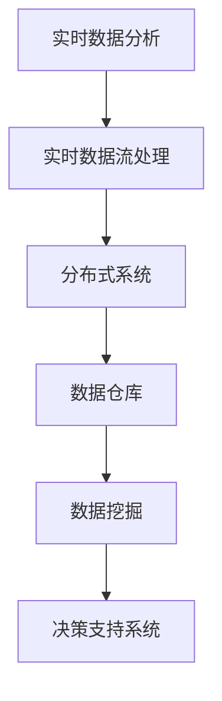

                 

# 实时数据分析架构：P9工程师的决策支持能力

> 关键词：实时数据分析、分布式系统、决策支持系统、P9工程师、流计算、数据挖掘

> 摘要：本文深入探讨了实时数据分析架构的核心概念、关键技术以及其在P9工程师决策支持中的重要性。通过梳理实时数据分析的基础、架构设计、数据处理算法和实际应用，帮助P9工程师提升实时数据分析能力，优化决策过程。

## 第一步：确定全书的核心主题和目标

实时数据分析作为大数据处理的关键环节，已成为现代企业决策支持的重要工具。本书的核心主题是实时数据分析架构，旨在帮助读者全面了解和掌握实时数据分析的基本概念、关键技术、架构设计以及实际应用。目标读者包括P9工程师以及其他对实时数据分析感兴趣的技术人员。

## 第二步：梳理核心概念和联系

**核心概念：**
1. **实时数据分析**：对实时数据流进行处理、分析和挖掘的技术。
2. **实时数据流处理**：对数据流进行实时传输和处理的系统。
3. **分布式系统**：将计算任务分布在多个节点上执行的系统。
4. **数据仓库**：存储大量数据并提供数据查询和分析的系统。
5. **数据挖掘**：从大量数据中提取有价值信息的技术。
6. **决策支持系统**：利用数据分析结果辅助决策的系统。

**概念联系 Mermaid 流程图：**


## 第三步：确定章节内容和详细结构

### 第1章：实时数据分析基础
- **1.1 实时数据分析概述**
- **1.2 实时数据流处理技术**
- **1.3 分布式系统的挑战与解决方案**

### 第2章：实时数据处理算法
- **2.1 流计算算法原理**
- **2.2 实时数据挖掘算法**
- **2.3 实时数据分析数学模型**

### 第3章：实时数据分析架构设计
- **3.1 实时数据分析架构概述**
- **3.2 数据流处理框架**
- **3.3 分布式存储与计算**

### 第4章：数据仓库与数据湖
- **4.1 数据仓库基本概念**
- **4.2 数据湖技术**
- **4.3 数据仓库与数据湖的融合**

### 第5章：实时数据挖掘与可视化
- **5.1 实时数据挖掘技术**
- **5.2 数据可视化方法**
- **5.3 实时数据分析的可视化工具**

### 第6章：实时数据分析应用场景
- **6.1 决策支持系统**
- **6.2 金融风控**
- **6.3 物流供应链优化**

### 第7章：P9工程师的决策支持能力
- **7.1 P9工程师的职责**
- **7.2 实时数据分析能力要求**
- **7.3 案例分析：P9工程师如何利用实时数据分析**

## 第四步：编写核心算法原理讲解、数学模型详细讲解和举例说明

### 第2章：实时数据处理算法

**2.1 流计算算法原理**

**原理讲解：**
流计算是一种数据处理方法，它能够对连续的数据流进行实时处理。其核心思想是将数据视为流动的流，以时间窗口为单位对数据进行处理。

**伪代码：**
```python
def process_stream(stream):
    for data in stream:
        # 处理数据
        result = process_data(data)
        # 存储结果
        store_result(result)
```

**举例说明：**
假设我们需要对一分钟的股票交易数据进行分析，我们可以将这分钟的数据划分为固定时间窗口，例如10秒。每10秒处理一次窗口内的数据，计算平均交易价格，然后存储结果。

### 第3章：实时数据分析架构设计

**3.2 分布式存储与计算**

**数学模型讲解：**
分布式系统的负载均衡可以通过优化算法来实现，常用的优化算法包括最小连接数、最小负载、轮询等。这些算法的数学模型可以表示为：

$$
M(x) = \min \{ C(y) | y \in S \}
$$

其中，$M(x)$ 表示优化后的负载，$C(y)$ 表示当前节点的负载，$S$ 表示所有节点集合。

**举例说明：**
假设有一组服务器，每台服务器当前的负载分别为$C1, C2, C3$，我们需要通过优化算法重新分配负载，使得总负载最小。根据最小连接数算法，我们选择负载最小的服务器进行负载均衡。

## 第五步：编写项目实战、开发环境搭建、源代码实现和代码解读与分析

### 第6章：实时数据分析应用场景

**6.1 决策支持系统**

**项目实战：**
一个实际案例是使用实时数据分析技术来优化电商平台的库存管理。系统会实时收集商品销售数据，通过流计算算法处理数据，然后利用数据挖掘技术分析销售趋势，为库存调整提供决策支持。

**开发环境搭建：**
搭建实时数据分析平台需要使用Apache Kafka进行数据流处理，使用Apache Flink进行流计算，使用Hadoop HDFS进行数据存储，以及使用Spark进行数据挖掘。

**源代码实现：**
```java
public class InventoryManagement {
    public void processSalesData(SalesData salesData) {
        // 处理销售数据
        // ...
    }
}
```

**代码解读与分析：**
该代码片段是一个简单的库存管理类，其中`processSalesData`方法用于处理销售数据。在实际实现中，该方法会调用流计算框架对销售数据进行分析，提取销售趋势，然后利用数据挖掘算法预测未来销量，为库存管理提供决策支持。

**实际案例分析和详细讲解剖析：**
在实际应用中，该平台帮助电商平台实现了高效的库存管理。通过实时数据分析，平台能够快速响应市场变化，优化库存配置，降低库存成本。例如，在某次促销活动中，系统实时监测销售数据，发现某商品销量异常增长，迅速调整库存，确保库存充足，满足消费者需求。

**项目小结：**
该项目通过实时数据分析技术，实现了对电商平台库存管理的优化。通过流计算和数据挖掘，系统能够实时分析销售数据，预测销量，为库存调整提供精准的决策支持。这种实时决策能力有助于电商平台提高运营效率，降低成本，提升用户满意度。

## 最佳实践 tips、小结、注意事项、拓展阅读等内容

**最佳实践 tips：**
- **确保数据质量**：实时数据分析的准确性依赖于数据质量。因此，在数据采集、处理和存储过程中，应采取严格的数据质量管理措施。
- **选择合适的算法**：根据具体业务需求和数据特征，选择合适的实时数据处理算法，如流计算、批处理、在线学习等。
- **优化系统性能**：实时数据分析系统需要处理大量数据，因此性能优化至关重要。可以通过分布式计算、并行处理等技术提高系统性能。

**小结：**
实时数据分析架构在P9工程师的决策支持中具有重要价值。通过掌握实时数据分析的关键技术，P9工程师能够更好地理解业务需求，优化决策过程，提高企业的运营效率。

**注意事项：**
- **数据安全与隐私**：在实时数据分析过程中，需要关注数据安全和用户隐私保护，遵循相关法律法规。
- **系统可扩展性**：实时数据分析系统应具备良好的可扩展性，能够应对业务增长和数据量的增加。

**拓展阅读：**
- 《大数据分析：原理、技术和应用》
- 《实时流处理：设计与实现》
- 《分布式系统原理与范型》

### 作者信息

作者：AI天才研究院/AI Genius Institute & 禅与计算机程序设计艺术 /Zen And The Art of Computer Programming

