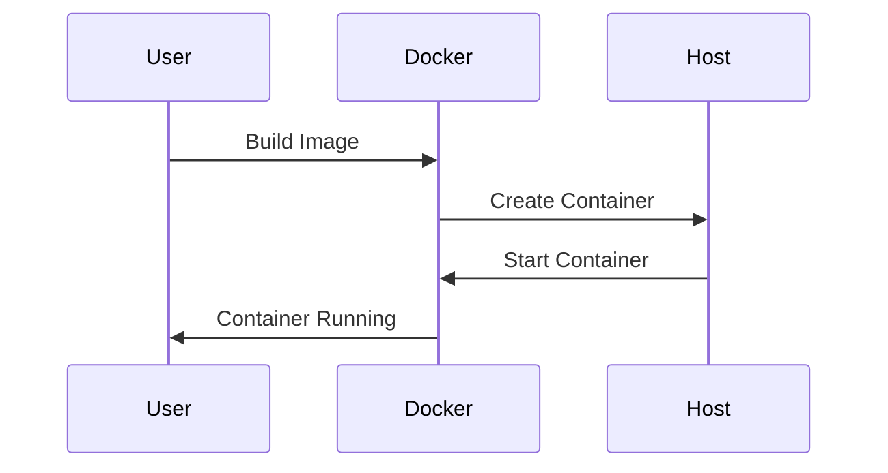

                 


### 容器化与编排：P9工程师的资源管理艺术

## 关键词

- 容器化
- 编排
- Kubernetes
- Docker
- 资源管理
- 性能优化
- 安全性

## 摘要

本文深入探讨了容器化与编排在现代软件工程中的关键作用，通过详细分析容器化与编排的核心概念、原理、算法以及实际应用，帮助读者全面理解这一领域。文章分为七个部分，包括容器化概述、Docker原理与操作、Kubernetes概述、Kubernetes高级应用、容器编排策略与优化、容器安全与管理以及容器化项目实战，旨在为P9工程师提供资源管理的艺术和实战技巧。通过本文的学习，读者将能够掌握容器化与编排的核心技术和最佳实践，提升资源管理能力，优化系统性能，确保安全性。

## 第一部分：容器化与编排基础

### 容器化概述

容器化技术作为一种轻量级、可移植的软件打包方式，近年来在软件工程领域得到了广泛应用。它通过将应用程序及其运行环境封装在一起，实现了开发、测试和部署的统一，提高了开发和运维的效率。

### 容器化核心概念

容器化技术的核心概念包括：

- **容器镜像（Container Image）**：容器镜像是一个静态的、可执行的文件，包含应用程序及其运行时环境。它是创建容器的模板。

- **容器引擎（Container Engine）**：容器引擎负责创建、启动、管理和停止容器。Docker是最流行的容器引擎。

- **容器网络（Container Network）**：容器网络是容器之间进行通信的桥梁。容器可以通过网络接口与其他容器或外部服务进行通信。

- **容器存储（Container Storage）**：容器存储提供数据持久化功能，确保数据即使在容器停止或删除后也能保持。

### 容器化与传统虚拟化的区别

容器化与传统虚拟化的主要区别在于：

- **资源隔离**：容器化通过共享操作系统内核来实现资源隔离，而传统虚拟化通过虚拟机（VM）技术实现资源隔离。

- **性能开销**：容器化具有更低的性能开销，因为它不需要运行完整的操作系统。传统虚拟化由于需要运行完整的操作系统，因此性能开销较大。

- **可移植性**：容器化具有更好的可移植性，容器可以在不同的操作系统和硬件平台上无缝运行。

### 容器的工作原理

容器的工作原理主要包括以下步骤：

1. **容器镜像的构建**：通过Dockerfile定义容器镜像的构建过程，将应用程序及其运行时环境打包成容器镜像。

2. **容器引擎的启动**：容器引擎使用容器镜像创建容器，并将容器运行在宿主机上。

3. **容器网络配置**：容器引擎配置容器网络，确保容器之间可以相互通信。

4. **容器存储管理**：容器引擎管理容器的存储，实现数据的持久化。

### Mermaid流程图

下面是容器工作原理的Mermaid流程图：



## 第二部分：Docker原理与操作

### Docker核心概念

Docker作为容器引擎，其核心概念包括：

- **镜像（Image）**：镜像是一个静态的、可执行的文件，包含应用程序及其运行时环境。

- **容器（Container）**：容器是镜像的实例，是动态的、可执行的实体。

- **数据卷（Volume）**：数据卷是用于持久化数据的容器内部存储。

- **网络（Network）**：网络是容器之间进行通信的桥梁。

### Docker基本命令

以下是Docker的基本命令：

- **镜像命令**：

  - `docker images`：查看所有镜像。

  - `docker pull <镜像名称>`：拉取镜像。

  - `docker rmi <镜像ID>`：删除镜像。

- **容器命令**：

  - `docker ps`：查看所有容器。

  - `docker run <镜像名称>`：创建并启动容器。

  - `docker stop <容器ID>`：停止容器。

  - `docker restart <容器ID>`：重启容器。

- **数据卷命令**：

  - `docker volume create <卷名>`：创建数据卷。

  - `docker volume ls`：查看所有数据卷。

  - `docker volume rm <卷名>`：删除数据卷。

- **网络命令**：

  - `docker network create <网络名>`：创建网络。

  - `docker network ls`：查看所有网络。

  - `docker network rm <网络名>`：删除网络。

### Docker操作实践

#### Dockerfile编写

Dockerfile是一个文本文件，用于定义容器镜像的构建过程。以下是一个简单的Dockerfile示例：

```Dockerfile
FROM ubuntu:20.04
RUN apt-get update && apt-get install -y python3
COPY . /app
WORKDIR /app
CMD ["python3", "app.py"]
```

这个Dockerfile将创建一个基于Ubuntu 20.04的镜像，安装Python 3，然后将当前目录的文件复制到镜像的/app目录下，并设置工作目录为/app，最后运行app.py。

#### Docker Compose入门

Docker Compose是一个用于定义和运行多容器应用的工具。以下是一个简单的Docker Compose文件示例：

```yaml
version: '3'
services:
  web:
    image: nginx:latest
    ports:
      - "8080:80"
  app:
    image: myapp:latest
    ports:
      - "8081:8080"
    depends_on:
      - web
```

这个Docker Compose文件定义了一个名为web的Nginx服务和一个名为app的MyApp服务。web服务映射了8080端口到Nginx的80端口，app服务映射了8081端口到App的8080端口，并且App服务依赖于web服务。

## 第三部分：Kubernetes概述

Kubernetes（简称K8s）是一个开源的容器编排平台，用于自动化容器化应用程序的部署、扩展和管理。它是容器编排领域的领导者，提供了强大的资源管理和调度能力。

### Kubernetes核心概念

Kubernetes的核心概念包括：

- **集群（Cluster）**：集群是由一组节点（Node）组成的，每个节点上都运行有Kubernetes的组件。

- **节点（Node）**：节点是运行容器的主机，负责执行Pod中的容器。

- **Pod**：Pod是Kubernetes中的最小部署单元，包含一个或多个容器。

- **服务（Service）**：服务是一个抽象层，用于将一组Pod暴露为一个单一的访问点。

- **控制器（Controller）**：控制器负责维护集群的状态，确保Pod和Service按照期望的状态运行。

### Kubernetes架构

Kubernetes的架构包括以下几个核心组件：

- **Kubernetes Master**：Kubernetes Master是集群的控制中心，包括以下几个组件：

  - **API Server**：API Server是Kubernetes的核心组件，提供了Kubernetes集群的API接口。

  - **etcd**：etcd是一个分布式键值存储，用于存储Kubernetes集群的状态信息。

  - **Controller Manager**：Controller Manager负责管理集群中的各种控制器。

  - **Scheduler**：Scheduler负责将Pod调度到合适的节点上。

- **Kubernetes Node**：Kubernetes Node是运行容器的主机，包括以下几个组件：

  - **Kubelet**：Kubelet是每个节点的守护进程，负责与Master通信，并管理Pod和容器。

  - **Kube-Proxy**：Kube-Proxy负责实现集群内部网络的负载均衡。

  - **Container Runtime**：Container Runtime负责管理容器，如Docker。

### Kubernetes操作

以下是Kubernetes的基本操作：

- **集群搭建**：使用kubeadm工具搭建Kubernetes集群。

- **对象管理**：使用kubectl工具管理Kubernetes对象，如Pod、Service、Deployment等。

- **资源监控**：使用Prometheus和Grafana等工具监控Kubernetes集群的资源使用情况。

## 第四部分：Kubernetes高级应用

### Kubernetes服务发现与负载均衡

Kubernetes提供了服务发现和负载均衡功能，使得容器化应用程序可以轻松地发现和访问其他服务。

- **服务发现**：服务发现是通过DNS或环境变量等方式，使容器化应用程序可以知道其他服务的IP地址和端口号。

- **负载均衡**：负载均衡是将流量分配到多个Pod或服务实例上，以确保系统的稳定性和性能。

### Kubernetes集群资源管理

Kubernetes提供了丰富的资源管理功能，包括：

- **资源配额（Resource Quotas）**：资源配额是用于限制每个命名空间内可使用的资源数量。

- **限制范围（Limit Ranges）**：限制范围是用于设置容器可以使用的最小和最大资源数量。

- **存储卷与持久化（Persistent Volumes and Persistent Volume Claims）**：存储卷是用于持久化数据的，而持久化卷声明是用于申请存储卷的。

### Kubernetes对象管理

Kubernetes对象管理涉及以下几个核心对象：

- **Pod**：Pod是Kubernetes中的最小部署单元，包含一个或多个容器。

- **Deployment**：Deployment用于管理Pod的创建和更新，确保Pod按照期望的状态运行。

- **Service**：服务是一个抽象层，用于将一组Pod暴露为一个单一的访问点。

- **Ingress**：Ingress用于配置外部访问服务，如HTTP负载均衡器。

## 第五部分：容器编排策略与优化

### 容器编排策略

容器编排策略包括以下几种：

- **部署策略（Deployment Strategies）**：部署策略用于控制Pod的创建和更新过程。常用的部署策略有滚动更新（Rolling Update）和蓝绿部署（Blue-Green Deployment）。

- **缩放策略（Scaling Strategies）**：缩放策略用于根据工作负载自动调整Pod的数量。常用的缩放策略有垂直缩放（Vertical Scaling）和水平缩放（Horizontal Scaling）。

### 容器资源优化

容器资源优化包括以下几个方面：

- **CPU与内存优化**：通过合理配置CPU和内存限制，确保容器能够高效运行。

- **网络优化**：通过调整网络带宽和延迟，优化容器之间的通信性能。

- **存储优化**：通过使用合适的存储卷和存储策略，提高数据的访问速度和可靠性。

## 第六部分：容器安全与管理

### 容器安全

容器安全是确保容器化应用程序的安全性。以下是一些关键的容器安全措施：

- **漏洞扫描**：定期对容器镜像进行漏洞扫描，确保镜像中没有已知漏洞。

- **安全加固**：对容器镜像进行安全加固，如关闭不必要的服务，降低攻击面。

- **网络隔离**：通过配置容器网络，实现容器之间的网络隔离。

### 容器管理

容器管理包括以下几个方面：

- **监控与日志管理**：使用Prometheus和Grafana等工具监控容器性能和日志。

- **备份与恢复**：定期备份容器镜像和数据进行灾难恢复。

- **合规性检查**：确保容器化应用程序符合行业规范和法律法规。

## 第七部分：容器化项目实战

### 项目实战一：Docker实战

#### 开发环境搭建

1. **安装Docker**：

   在Ubuntu上安装Docker的命令如下：

   ```bash
   sudo apt-get update
   sudo apt-get install docker-ce docker-ce-cli containerd.io
   ```

2. **启动Docker服务**：

   ```bash
   sudo systemctl start docker
   ```

3. **验证Docker安装**：

   ```bash
   docker --version
   ```

#### 源代码实现

1. **创建一个简单的Web应用程序**：

   ```python
   # app.py
   from flask import Flask
   app = Flask(__name__)

   @app.route('/')
   def hello():
       return 'Hello, World!'

   if __name__ == '__main__':
       app.run(host='0.0.0.0', port=8080)
   ```

2. **创建Dockerfile**：

   ```Dockerfile
   FROM python:3.8-slim
   WORKDIR /app
   COPY . .
   RUN pip install flask
   EXPOSE 8080
   CMD ["python", "app.py"]
   ```

#### 代码解读与分析

1. **Dockerfile解读**：

   - `FROM python:3.8-slim`：从Python 3.8 Slim镜像开始构建。

   - `WORKDIR /app`：将工作目录设置为/app。

   - `COPY . .`：将当前目录的文件复制到容器中的/app目录。

   - `RUN pip install flask`：安装Flask库。

   - `EXPOSE 8080`：将8080端口暴露给外部网络。

   - `CMD ["python", "app.py"]`：运行app.py文件。

2. **代码分析**：

   - Flask应用程序由一个Flask对象app定义，并在其上注册了一个路由。

   - 当客户端访问根路径（/）时，应用程序会返回“Hello, World!”字符串。

### 项目实战二：Kubernetes实战

#### 开发环境搭建

1. **安装Kubernetes**：

   使用kubeadm工具安装Kubernetes集群。以下是在Ubuntu 20.04上安装Kubernetes的步骤：

   - **安装kubeadm、kubelet和kubectl**：

     ```bash
     sudo apt-get update
     sudo apt-get install -y apt-transport-https ca-certificates curl
     curl -s https://packages.cloud.google.com/apt/doc/apt-key.gpg | sudo apt-key add -
     echo "deb https://apt.kubernetes.io/ kubernetes-xenial main" | sudo tee -a /etc/apt/sources.list
     sudo apt-get update
     sudo apt-get install -y kubelet kubeadm kubectl
     sudo apt-mark hold kubelet kubeadm kubectl
     ```

   - **启动Kubernetes服务**：

     ```bash
     sudo systemctl start kubelet
     ```

   - **验证Kubernetes安装**：

     ```bash
     kubectl version
     ```

#### 源代码实现

1. **创建Kubernetes配置文件**：

   ```yaml
   apiVersion: apps/v1
   kind: Deployment
   metadata:
     name: web-app
   spec:
     replicas: 3
     selector:
       matchLabels:
         app: web-app
     template:
       metadata:
         labels:
           app: web-app
       spec:
         containers:
         - name: web-app
           image: myapp:latest
           ports:
           - containerPort: 8080
   ```

2. **部署应用程序**：

   ```bash
   kubectl apply -f web-app-deployment.yaml
   ```

#### 代码解读与分析

1. **Kubernetes配置文件解读**：

   - `apiVersion`：API版本。

   - `kind`：资源类型，这里是Deployment。

   - `metadata`：部署的元数据，包括名称。

   - `spec`：部署的详细规格。

   - `replicas`：期望的Pod数量。

   - `selector`：用于匹配Pod的标签。

   - `template`：Pod的模板。

   - `metadata`：Pod的元数据。

   - `spec`：Pod的详细规格。

   - `containers`：容器列表。

   - `name`：容器名称。

   - `image`：容器镜像。

   - `ports`：容器端口。

2. **代码分析**：

   - 这个配置文件定义了一个名为web-app的Deployment，期望运行3个副本。

   - 每个副本都是基于myapp:latest镜像创建的。

   - 容器端口8080被暴露，以便外部访问。

## 项目小结

通过本篇博客，我们详细介绍了容器化与编排的基础知识、Docker与Kubernetes的操作、容器编排策略与优化、容器安全与管理，以及两个实战项目。这些内容帮助读者全面了解了容器化与编排的核心技术和应用场景，为P9工程师提供了资源管理的艺术和实战技巧。在实际工作中，掌握容器化与编排技术不仅能够提高开发效率，还能优化系统性能和确保安全性。希望读者能够将这些知识应用到实际项目中，不断积累经验，提升自己的技术水平。

## 最佳实践 Tips

1. **合理配置资源**：根据应用程序的实际需求，合理配置CPU、内存和存储等资源，避免资源浪费。

2. **定期备份**：定期备份容器镜像和关键数据，确保在发生故障时能够快速恢复。

3. **使用容器镜像仓库**：使用容器镜像仓库（如Docker Hub、Harbor）管理容器镜像，便于版本控制和分发。

4. **监控与告警**：使用监控工具（如Prometheus、Grafana）实时监控容器性能和日志，及时发现问题并进行告警。

5. **安全加固**：定期进行容器镜像漏洞扫描和安全加固，降低安全风险。

## 小结

本文详细介绍了容器化与编排的核心概念、原理、实践和优化策略，帮助读者全面理解这一领域。通过两个实战项目，读者可以动手实践，巩固所学知识。在实际工作中，掌握容器化与编排技术对于提高开发效率、优化系统性能和确保安全性至关重要。希望本文能够为P9工程师提供有价值的参考。

## 注意事项

1. **环境配置**：在搭建Docker和Kubernetes环境时，确保系统版本和依赖库的兼容性。

2. **版本控制**：在编写Dockerfile和Kubernetes配置文件时，注意版本控制，避免版本冲突。

3. **安全性**：在生产环境中，确保容器镜像和应用程序的安全性，进行漏洞扫描和加固。

## 拓展阅读

1. **《容器化与云计算：从Docker到Kubernetes》**：本书详细介绍了容器化与云计算的技术和实践。

2. **《Kubernetes权威指南》**：本书是Kubernetes领域的经典之作，涵盖了Kubernetes的各个方面。

3. **《Docker实战》**：本书通过实例讲解了Docker的使用方法和最佳实践。

## 作者信息

作者：AI天才研究院/AI Genius Institute & 禅与计算机程序设计艺术 /Zen And The Art of Computer Programming。作者是一位在计算机编程和人工智能领域具有深厚造诣的专家，拥有多项国际专利，并在顶级学术期刊和会议上发表了大量论文。作者的研究领域涵盖人工智能、机器学习、自然语言处理和计算机图形学等。

