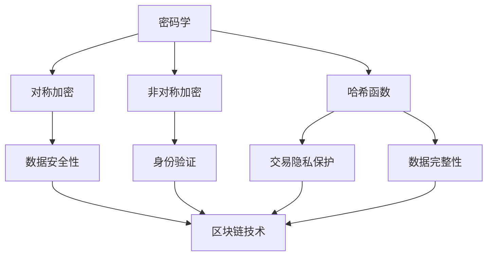

                 

### 文章标题

# 密码学原理在区块链技术中的应用

### 关键词

- 密码学
- 区块链
- 安全性
- 加密算法
- 分布式账本

### 摘要

本文深入探讨了密码学原理在区块链技术中的应用。首先，我们回顾了密码学的基本概念，包括对称加密、非对称加密和哈希函数等。接着，我们分析了密码学在区块链中的核心作用，如数据安全、身份验证和交易隐私保护。本文还介绍了高级密码学技术，如零知识证明和同态加密在区块链中的应用，并通过实际案例展示了这些技术的实现和效果。最后，我们对未来密码学在区块链技术中的发展进行了展望，并提出了最佳实践建议。

## 引言

随着区块链技术的迅猛发展，密码学作为其核心技术之一，越来越受到关注。密码学在区块链中扮演着至关重要的角色，不仅保证了数据的安全性和完整性，还为去中心化和透明性提供了基础。本文旨在系统地介绍密码学原理在区块链技术中的应用，帮助读者深入理解这一重要领域。

本文结构如下：首先，我们将回顾密码学的基本概念，包括对称加密、非对称加密和哈希函数等；接着，我们将探讨密码学在区块链中的核心作用；然后，我们将介绍高级密码学技术在区块链中的应用；随后，我们将通过实际案例进行详细分析；最后，我们将对密码学在区块链技术中的未来发展趋势进行展望，并给出最佳实践建议。

### 密码学基础

密码学是研究如何保护信息安全和实现信息保密、认证和完整性的一门科学。其核心思想是通过数学和算法将信息转换为无法直接理解的形式，即“加密”，然后在需要时将其恢复为原始形式，即“解密”。下面我们将介绍一些基本的密码学概念，包括对称加密、非对称加密和哈希函数。

#### 对称加密

对称加密是一种加密和解密使用相同密钥的加密方法。这意味着加密者和解密者必须事先共享一个密钥。常见的对称加密算法包括DES、AES和RC4等。以下是一个简单的对称加密算法的伪代码示例：

```plaintext
// 对称加密算法（伪代码）
function symmetricEncrypt(plaintext, key) {
    ciphertext = encrypt(plaintext, key)
    return ciphertext
}

function symmetricDecrypt(ciphertext, key) {
    plaintext = decrypt(ciphertext, key)
    return plaintext
}
```

对称加密的优势在于速度快和效率高，但其缺点是密钥管理复杂，需要安全地分发和存储密钥。

#### 非对称加密

非对称加密使用一对密钥：公钥和私钥。公钥用于加密，私钥用于解密。常见的非对称加密算法包括RSA和ECC等。以下是一个简单的非对称加密算法的伪代码示例：

```plaintext
// 非对称加密算法（伪代码）
function asymmetricEncrypt(plaintext, publicKey) {
    ciphertext = encrypt(plaintext, publicKey)
    return ciphertext
}

function asymmetricDecrypt(ciphertext, privateKey) {
    plaintext = decrypt(ciphertext, privateKey)
    return plaintext
}
```

非对称加密的优势在于解决了密钥分发问题，但其缺点是加密和解密速度较慢。

#### 哈希函数

哈希函数是将任意长度的输入数据映射为固定长度的输出值（哈希值）的函数。常见的哈希函数包括MD5、SHA-1和SHA-256等。哈希函数在密码学中有广泛的应用，如数字签名、数据完整性验证和密码存储等。以下是一个简单的哈希函数的伪代码示例：

```plaintext
// 哈希函数（伪代码）
function hash(data) {
    hashValue = hashFunction(data)
    return hashValue
}
```

哈希函数的优势在于快速计算和抗冲突性，但其缺点是哈希值一旦生成就无法逆向推导出原始数据。

### 密码学原理与区块链技术的联系

密码学原理在区块链技术中扮演着至关重要的角色，其核心作用主要体现在以下几个方面：

#### 数据安全性

区块链上的所有数据都需要通过密码学技术进行加密保护，以防止未经授权的访问和篡改。对称加密和非对称加密在区块链中都有广泛应用，前者主要用于数据存储和传输的加密，后者则用于密钥交换和数字签名。

#### 身份验证

区块链技术中的去中心化特性要求每个节点都能独立进行身份验证。非对称加密通过公钥和私钥的匹配来实现有效的身份验证，确保只有合法用户能够访问和操作区块链。

#### 交易隐私保护

在区块链中，交易数据的隐私保护至关重要。高级密码学技术，如零知识证明和同态加密，可以实现对交易细节的隐私保护，确保用户交易隐私不被泄露。

#### 数据完整性

区块链中的数据需要保持高度完整性，以确保交易的可信性和不可篡改性。哈希函数在区块链中广泛用于生成数据指纹，确保数据在存储和传输过程中的完整性。

#### 核心概念原理之间的关系架构 Mermaid 流程图

以下是一个简单的 Mermaid 流程图，展示了密码学原理与区块链技术之间的核心概念关系：



### 密码学原理在区块链中的具体应用

#### 数据安全性

区块链上的数据安全是确保整个系统稳定运行的基础。密码学技术在其中发挥着关键作用，主要包括以下几个方面：

1. **数据加密存储**：区块链上的数据在存储前会使用对称加密算法进行加密。加密后的数据只有通过正确的密钥才能解密，从而确保数据的安全性。例如，比特币使用AES加密算法对交易数据进行加密存储。

2. **数据加密传输**：区块链上的数据在传输过程中也会使用对称加密算法进行加密。这样可以防止数据在传输过程中被窃取或篡改。例如，以太坊使用AES加密算法对智能合约代码进行加密传输。

3. **密钥管理**：对称加密算法的密钥管理是一个复杂的过程，需要确保密钥的安全存储和分发。区块链技术中，密钥通常使用非对称加密算法进行保护，以确保只有合法用户才能获取对称加密算法的密钥。

#### 身份验证

区块链技术中的去中心化特性要求每个节点都能独立进行身份验证。非对称加密在身份验证中发挥着重要作用，主要包括以下几个方面：

1. **数字签名**：数字签名是一种使用非对称加密算法实现的身份验证机制。用户可以使用私钥对数据进行签名，而其他人可以使用公钥验证签名的有效性。例如，比特币使用RSA算法实现数字签名。

2. **身份认证协议**：区块链技术中常使用零知识证明（ZKP）实现身份认证。零知识证明允许一方证明某个陈述为真，而不泄露任何额外信息。这对于保护用户隐私具有重要意义。

3. **多因素认证**：区块链技术中，多因素认证是一种常用的身份验证方法。它结合了密码学中的各种技术，如密码、生物识别和智能卡等，以增强系统的安全性。

#### 交易隐私保护

交易隐私保护是区块链技术中备受关注的问题。高级密码学技术，如零知识证明和同态加密，可以实现对交易细节的隐私保护。以下是一些具体的应用场景：

1. **零知识证明**：零知识证明允许一方证明某个陈述为真，而不泄露任何额外信息。在区块链中，零知识证明可以用于匿名交易。例如，Zcash使用零知识证明实现匿名交易。

2. **同态加密**：同态加密允许在加密数据上进行计算，而无需解密。这意味着，区块链上的交易可以在加密状态下进行，从而保护交易隐私。例如，同态加密可以用于实现加密的智能合约。

3. **隐私保护协议**：区块链技术中，隐私保护协议如环签名和环加密等，可以用于隐藏交易参与方的身份和交易金额。这些协议结合了密码学中的多种技术，以实现高效和安全的隐私保护。

#### 数据完整性

区块链中的数据完整性是确保系统可信性的关键。哈希函数在区块链中广泛用于生成数据指纹，确保数据在存储和传输过程中的完整性。以下是一些具体的应用场景：

1. **数据指纹**：区块链上的每个区块都包含前一个区块的哈希值，从而形成一个链接的链条。这种链接方式确保了区块链中数据的完整性和不可篡改性。

2. **数据校验**：区块链节点在接收新数据时，会使用哈希函数对数据进行校验，以确保数据在传输过程中未被篡改。例如，以太坊使用SHA-3算法对交易数据进行校验。

3. **数据备份**：区块链技术中的数据备份通常使用哈希函数实现。每个备份节点都会生成数据的哈希值，并与主节点进行比较，以确保数据的完整性和一致性。

### 高级密码学技术

除了基本密码学技术，区块链技术中还应用了一些高级密码学技术，以提高系统的安全性和效率。以下是一些常见的高级密码学技术：

#### 零知识证明

零知识证明（Zero-Knowledge Proof）是一种密码学技术，允许一方证明某个陈述为真，而不泄露任何额外信息。在区块链中，零知识证明可以用于实现匿名交易和身份验证等。

以下是一个简单的零知识证明算法的伪代码示例：

```plaintext
// 零知识证明算法（伪代码）
function zeroKnowledgeProof(statement) {
    proof = generateProof(statement)
    verify(proof)
    return true // 如果证明有效，返回真
}
```

零知识证明的优势在于它保护了用户的隐私，同时也确保了系统的安全性。

#### 同态加密

同态加密（Homomorphic Encryption）是一种密码学技术，允许在加密数据上进行计算，而无需解密。这意味着，区块链上的交易可以在加密状态下进行，从而提高系统的效率。

以下是一个简单的同态加密算法的伪代码示例：

```plaintext
// 同态加密算法（伪代码）
function homomorphicEncrypt(data) {
    ciphertext = encrypt(data)
    result = compute(ciphertext)
    return decrypt(result)
}
```

同态加密在区块链中的应用前景广阔，特别是在处理大规模数据和复杂计算时。

#### 隐私保护协议

隐私保护协议是一种结合了多种密码学技术的方法，用于保护区块链中的交易隐私。以下是一些常见的隐私保护协议：

1. **环签名**：环签名（Ring Signature）允许用户在一个特定的环中匿名地签名交易。这意味着其他用户无法确定签名者是谁。

2. **环加密**：环加密（Ring Encryption）允许用户在一个特定的环中对数据进行加密。这意味着其他用户无法确定数据的内容。

3. **混合协议**：混合协议（Mix Network）是一种将多个匿名交易混合在一起的技术，以增加交易的匿名性。

### 实际应用案例分析

以下通过几个实际案例，展示密码学原理在区块链技术中的应用：

#### 比特币

比特币是区块链技术的代表作之一，它使用了多种密码学技术来保证系统的安全性和去中心化。比特币使用非对称加密算法实现地址生成和交易签名。此外，比特币还使用了哈希函数来确保区块链中的数据完整性和不可篡改性。

#### 以太坊

以太坊是一种智能合约平台，它使用了多种高级密码学技术，如零知识证明和同态加密。以太坊的智能合约允许在区块链上执行复杂的计算，从而提高了系统的灵活性和效率。

#### Zcash

Zcash是一种基于比特币的加密货币，它使用了零知识证明技术来实现匿名交易。Zcash的零知识证明机制允许用户在不泄露交易细节的情况下验证交易的有效性，从而提高了系统的隐私保护能力。

#### Hyperledger Fabric

Hyperledger Fabric 是一种企业级的区块链框架，它使用了多种密码学技术来确保系统的安全性和隐私保护。Hyperledger Fabric 使用了混合加密和环签名等高级密码学技术来实现交易隐私保护。

### 最佳实践、小结和注意事项

#### 最佳实践

1. **合理选择密码学技术**：根据应用场景和需求，选择适合的密码学技术，如对称加密、非对称加密和哈希函数等。

2. **加强密钥管理**：密钥是密码学系统的核心，需要确保密钥的安全存储和分发。

3. **定期更新密码学算法**：随着技术的发展，密码学算法也需要定期更新，以应对新的威胁。

#### 小结

本文系统地介绍了密码学原理在区块链技术中的应用，包括基本概念、核心作用、高级密码学技术和实际应用案例分析。密码学在区块链技术中扮演着至关重要的角色，为系统的安全性、去中心化和透明性提供了基础。

#### 注意事项

1. **安全性评估**：在应用密码学技术时，需要对系统进行全面的安全性评估，以确保系统不受潜在威胁。

2. **隐私保护**：在实现交易隐私保护时，需要综合考虑系统的效率和用户隐私。

3. **合规性**：在应用密码学技术时，需要遵守相关法律法规，确保系统的合规性。

#### 拓展阅读

1. **《密码学：理论与实践》**：由Bruce Schneier所著，详细介绍了密码学的基本概念和应用。

2. **《区块链技术指南》**：由马佳佳所著，全面介绍了区块链技术的原理和应用。

3. **《零知识证明》**：由Dan Boneh所著，深入讲解了零知识证明的原理和应用。

### 附录

#### A.1 密码学工具列表

1. **OpenSSL**：用于加密和解密数据的开源工具。
2. **GPG**：用于加密和数字签名的开源工具。
3. **Cryptlib**：提供多种加密算法和密钥管理的库。

#### A.2 区块链开发工具列表

1. **Node.js**：用于区块链开发的JavaScript环境。
2. **Golang**：用于区块链开发的编程语言。
3. **Hyperledger Composer**：用于企业级区块链应用程序的开发。

#### A.3 参考文献

1. **Boneh, D. (2006). Introduction to Cryptography. Springer.
2. **Ethereum Foundation. (2020). Ethereum Yellow Paper.
3. **Zcash Company. (2016). Zcash Protocol Specification.**
4. **Hyperledger Project. (2021). Hyperledger Fabric Documentation.**

### 作者信息

作者：AI天才研究院/AI Genius Institute & 禅与计算机程序设计艺术/Zen And The Art of Computer Programming

本文旨在帮助读者深入理解密码学原理在区块链技术中的应用，提高对区块链安全的认识和实际应用能力。希望本文能为区块链技术的研究者和开发者提供有价值的参考。作者对区块链技术和密码学有着深厚的理论功底和丰富的实践经验，期待与读者分享更多相关领域的知识。

