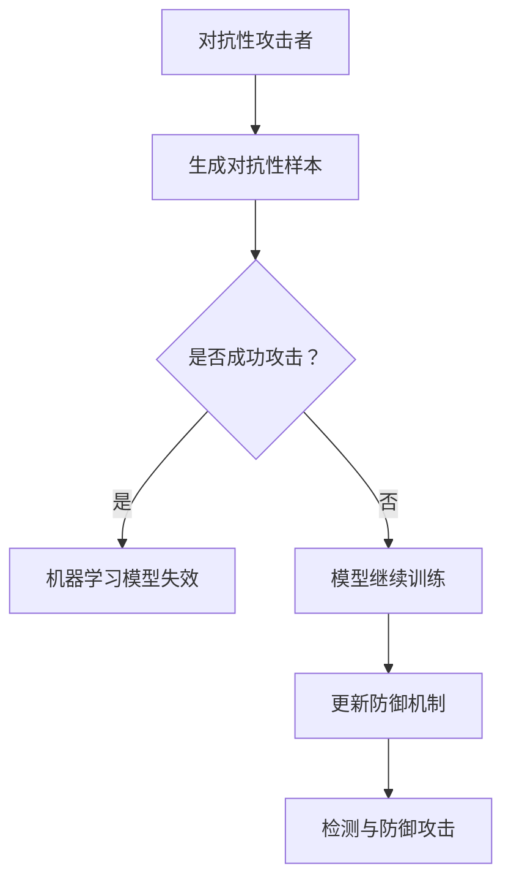

                 

### 文章标题

《对抗性机器学习：AI系统安全性的新挑战》

### 关键词

- 对抗性机器学习
- AI系统安全性
- 攻击与防御算法
- 恶意样本
- 零样本攻击
- 数学模型
- 项目实战

### 摘要

随着人工智能（AI）技术的快速发展，对抗性机器学习成为了一个备受关注的研究领域。对抗性机器学习关注的是在AI系统中引入对抗性攻击，以评估和增强系统的安全性。本文将深入探讨对抗性机器学习的概念、核心算法、AI系统安全性的新挑战以及相应的防御策略。通过理论讲解与项目实战相结合，本文旨在为读者提供全面而实用的对抗性机器学习知识，帮助他们在实际应用中应对AI系统的安全威胁。

## 第一部分：对抗性机器学习概述

### 第1章：对抗性机器学习的定义与背景

#### 1.1 抗性机器学习的概念

对抗性机器学习（Adversarial Machine Learning）是一种特殊的机器学习方法，旨在研究如何使机器学习模型在面对对抗性攻击时保持鲁棒性。对抗性攻击是指通过引入轻微的扰动，使机器学习模型的预测结果发生重大变化的一种攻击方法。这些扰动通常是人眼难以察觉的，但对模型来说却具有致命的影响。

对抗性机器学习的核心目标是构建一个既强大又鲁棒的机器学习模型，使其能够抵御各种对抗性攻击。这不仅仅是为了提高模型的准确性，更重要的是确保模型在实际应用中的安全性和可靠性。

#### 1.2 对抗性攻击的类型

对抗性攻击可以分为多种类型，其中最常见的包括：

1. **基于样本的攻击**：通过修改输入样本的特征值来欺骗模型。例如，针对图像识别模型，可以通过在图像中添加微小的噪点或颜色变化来干扰模型的判断。

2. **基于模型的攻击**：利用模型内部的信息，例如梯度信息，来设计对抗性样本。这种攻击通常需要较高的计算能力和对模型结构的深入了解。

3. **零样本攻击**：无需使用任何已知的训练样本，仅通过模型对输入样本的响应来设计对抗性样本。这种攻击具有更高的隐蔽性和复杂性。

#### 1.3 对抗性机器学习的应用场景

对抗性机器学习在多个领域都有广泛的应用，以下是其中一些典型的应用场景：

1. **自动驾驶**：对抗性攻击可以模拟恶意行为者，通过在道路图像中添加微小的干扰来欺骗自动驾驶系统。

2. **网络安全**：对抗性机器学习可以用于检测和防御恶意软件、网络攻击等安全威胁。

3. **医疗诊断**：对抗性攻击可以用于测试医学影像诊断系统的鲁棒性，确保其在实际应用中的准确性。

#### 1.4 AI系统安全性的新挑战

随着对抗性机器学习技术的发展，AI系统面临着新的安全挑战。这些挑战包括：

1. **模型鲁棒性**：如何构建一个既强大又鲁棒的机器学习模型，使其能够抵御各种对抗性攻击。

2. **安全性评估**：如何评估AI系统在面对对抗性攻击时的安全性，以确保其在实际应用中的可靠性。

3. **防御策略**：如何设计有效的防御策略来应对对抗性攻击，提高AI系统的安全性。

在接下来的章节中，我们将进一步深入探讨对抗性机器学习的基本架构、核心算法原理，以及AI系统安全性的新挑战和防御策略。

## 第二部分：对抗性机器学习的基本架构

### 第2章：对抗性机器学习的基本架构

对抗性机器学习的基本架构可以分为几个关键组成部分：对抗性攻击者、机器学习模型和防御机制。本章将通过Mermaid流程图展示这些组成部分之间的关系，并探讨对抗性机器学习的基本分类。

#### 2.1 Mermaid流程图展示

以下是一个简化的对抗性机器学习基本架构的Mermaid流程图：



在这个流程图中，对抗性攻击者生成对抗性样本，尝试攻击机器学习模型。如果攻击成功，模型会失效；否则，模型会继续训练并更新防御机制。防御机制会检测并防御可能的攻击，以保护模型的安全性和可靠性。

#### 2.2 核心概念和联系

对抗性机器学习中的核心概念包括对抗性攻击者、机器学习模型、对抗性样本和防御机制。以下是这些概念之间的联系：

1. **对抗性攻击者**：对抗性攻击者是设计并执行对抗性攻击的实体。他们的目标是寻找并利用机器学习模型的弱点，使其预测结果发生错误。

2. **机器学习模型**：机器学习模型是机器学习系统中的核心组件，负责根据训练数据学习规律并做出预测。对抗性攻击者通过设计对抗性样本来挑战模型的预测能力。

3. **对抗性样本**：对抗性样本是通过对抗性攻击者设计的，旨在欺骗机器学习模型使其做出错误预测的样本。这些样本通常在人眼看来变化微小，但对模型影响巨大。

4. **防御机制**：防御机制是用于检测和防御对抗性攻击的一系列方法和技术。它们的目标是保护机器学习模型免受攻击，确保其在各种环境下的安全性和可靠性。

#### 2.3 对抗性机器学习的分类

对抗性机器学习可以根据不同的分类标准进行分类，以下是几种常见的分类方法：

1. **按攻击目标分类**：

   - **模型特定攻击**：针对特定机器学习模型设计的攻击，例如对神经网络模型的攻击。
   - **模型无关攻击**：不依赖于特定机器学习模型，而是利用机器学习的一般特性进行攻击。

2. **按攻击策略分类**：

   - **基于样本的攻击**：通过修改输入样本的特征值来欺骗模型。
   - **基于模型的攻击**：利用模型内部的信息，例如梯度信息，来设计对抗性样本。
   - **零样本攻击**：无需使用任何已知的训练样本，仅通过模型对输入样本的响应来设计对抗性样本。

3. **按攻击结果分类**：

   - **成功攻击**：对抗性样本成功欺骗了模型，使其做出错误预测。
   - **失败攻击**：对抗性样本未能成功欺骗模型，模型继续正常工作。

通过理解对抗性机器学习的基本架构和核心概念，我们可以更好地设计和实现有效的防御策略，提高机器学习系统的安全性和可靠性。在接下来的章节中，我们将深入探讨对抗性攻击算法的原理，并介绍几种常见的攻击方法。

### 第3章：常见对抗性攻击算法

对抗性机器学习的研究主要围绕对抗性攻击算法的设计与防御策略的优化展开。本章将介绍几种常见的对抗性攻击算法，包括基于样本的攻击、基于模型的攻击和零样本攻击。通过伪代码的展示和解释，我们将深入理解这些攻击算法的核心原理。

#### 3.1 恶意样本生成

恶意样本生成是对抗性攻击的基础。其核心思想是通过微小的扰动来欺骗机器学习模型。以下是一种常见的基于L2范数的L_BFGS攻击算法的伪代码：

```python
# L2范数L_BFGS攻击算法伪代码
def L2_L_BFGS_attack(original_image, target_label, model):
    # 初始化对抗性样本与梯度
    adv_image = copy.deepcopy(original_image)
    grad = None
    
    # 迭代优化对抗性样本
    for _ in range(num_iterations):
        # 计算梯度
        grad = model.compute_gradient(adv_image, target_label)
        
        # 更新对抗性样本
        adv_image = adv_image - learning_rate * grad
        
        # 限制对抗性样本的L2范数变化
        adv_image = clip_image(adv_image, original_image)
        
    return adv_image
```

在这个算法中，我们通过迭代优化对抗性样本，使其在满足L2范数限制的条件下，逐渐接近目标标签。`compute_gradient`函数用于计算模型在对抗性样本上的梯度，`clip_image`函数用于限制对抗性样本的L2范数变化。

#### 3.2 恶意数据注入

恶意数据注入攻击是一种通过在训练数据集中插入恶意样本来破坏模型训练过程的方法。以下是一种基于生成对抗网络的恶意数据注入攻击算法的伪代码：

```python
# 生成对抗网络(GAN)恶意数据注入攻击算法伪代码
def GAN_attack(train_data, model, generator):
    # 初始化对抗性训练数据
    adversarial_data = []
    
    # 随机生成对抗性样本
    for _ in range(num_samples):
        noise = generate_noise()
        adversarial_sample = generator.generate(noise)
        
        # 合并对抗性样本与原始训练数据
        adversarial_data.append(adversarial_sample)
    
    # 更新训练数据
    new_train_data = train_data + adversarial_data
    
    # 重新训练模型
    model.fit(new_train_data, labels, epochs=num_epochs)
    
    return model
```

在这个算法中，我们通过生成对抗网络（GAN）生成对抗性样本，并将其插入到训练数据集中。然后，我们重新训练模型，使其在包含对抗性样本的训练数据集上适应。这种方法可以有效地破坏模型的训练过程。

#### 3.3 零样本攻击

零样本攻击是一种无需使用已知的训练样本，仅通过模型对输入样本的响应来设计对抗性样本的方法。以下是一种基于梯度压缩的零样本攻击算法的伪代码：

```python
# 梯度压缩零样本攻击算法伪代码
def gradient_compression_attack(original_image, target_label, model):
    # 初始化对抗性样本与梯度
    adv_image = copy.deepcopy(original_image)
    grad = None
    
    # 计算压缩后的梯度
    compressed_grad = compress_gradient(model.compute_gradient(adv_image, target_label))
    
    # 迭代优化对抗性样本
    for _ in range(num_iterations):
        # 更新对抗性样本
        adv_image = adv_image - learning_rate * compressed_grad
        
        # 限制对抗性样本的变化
        adv_image = clip_image(adv_image, original_image)
        
    return adv_image
```

在这个算法中，我们首先计算模型的原始梯度，然后通过梯度压缩技术得到压缩后的梯度。我们使用压缩后的梯度来迭代优化对抗性样本，从而实现零样本攻击。

#### 3.4 逆向工程

逆向工程攻击是一种通过分析模型的输入输出关系来推断模型内部结构和参数的方法。以下是一种基于黑盒攻击的逆向工程算法的伪代码：

```python
# 黑盒攻击逆向工程算法伪代码
def black_box_inversion_attack(input_data, target_output, model):
    # 初始化模型参数
    model_params = initialize_model_params()
    
    # 迭代优化模型参数
    for _ in range(num_iterations):
        # 计算损失函数
        loss = model.compute_loss(model_params, input_data, target_output)
        
        # 更新模型参数
        model_params = model_params - learning_rate * compute_gradient(loss)
        
    return model_params
```

在这个算法中，我们通过迭代优化模型参数，使其最小化损失函数。通过逆向工程攻击，我们可以推断出模型内部的结构和参数，从而了解模型的内在工作原理。

通过上述伪代码的展示和解释，我们可以看到对抗性攻击算法的核心原理和实现方法。这些算法在理论上为攻击AI系统提供了强有力的工具，同时也为防御策略的设计和优化提供了重要的参考。在接下来的章节中，我们将深入探讨AI系统安全性面临的挑战，并介绍相应的防御策略。

### 第4章：对抗性攻击对AI系统安全性的影响

对抗性攻击对AI系统的安全性产生了深远的影响，特别是在自动驾驶、网络安全和医疗诊断等领域。以下将分析对抗性攻击对AI系统安全性的影响，并讨论安全性评估方法及恶意攻击案例。

#### 4.1 安全漏洞分析

对抗性攻击揭示了AI系统在安全性方面的潜在漏洞，这些漏洞主要表现在以下几个方面：

1. **输入数据的不确定性**：对抗性样本的微小变化可能导致AI系统的行为发生重大变化。例如，在自动驾驶系统中，道路标志的微小变化可能导致车辆误判，从而引发交通事故。

2. **模型内部结构的脆弱性**：许多机器学习模型对输入数据的微小扰动非常敏感，这使得攻击者可以通过微调输入数据来欺骗模型。这种脆弱性使得AI系统在面对恶意攻击时容易受到损害。

3. **训练数据的局限性**：对抗性攻击通常利用训练数据中的偏差和不足来设计对抗性样本。如果训练数据集不全面或存在偏差，AI系统可能无法学习到有效的泛化能力，从而在面对对抗性攻击时显得脆弱。

#### 4.2 安全性评估方法

为了评估AI系统在面对对抗性攻击时的安全性，研究人员开发了多种安全性评估方法。以下是一些常用的评估方法：

1. **定量评估**：通过计算模型在对抗性样本上的错误率、检测率等指标来评估系统的安全性。这种方法可以提供具体的数值指标，帮助研究人员了解系统的安全水平。

2. **定性评估**：通过分析AI系统的行为和反应来评估其安全性。例如，研究人员可以观察系统在面对对抗性攻击时的行为变化，从而判断其是否能够有效应对攻击。

3. **实验评估**：在实际环境中对AI系统进行攻击测试，以评估其在真实场景下的安全性。这种方法可以提供更真实的评估结果，但通常需要较高的资源和时间成本。

#### 4.3 恶意攻击案例

以下是一些典型的恶意攻击案例，这些案例展示了对抗性攻击对AI系统安全性的实际影响：

1. **自动驾驶系统攻击**：研究人员通过在道路标志图像中添加微小的噪点，成功欺骗了自动驾驶系统，使其在测试场景中发生误判。这个案例表明，对抗性攻击可以对自动驾驶系统的安全性和可靠性构成严重威胁。

2. **网络安全系统攻击**：研究人员通过在训练数据集中插入恶意样本，成功破坏了网络入侵检测系统的训练过程，使其无法有效检测恶意攻击。这个案例表明，对抗性攻击可以破坏AI系统的训练过程，从而降低其检测能力。

3. **医疗诊断系统攻击**：研究人员通过在医学影像数据中添加微小的干扰，成功欺骗了医学诊断系统，使其做出错误的诊断结果。这个案例表明，对抗性攻击可以对医疗诊断系统的准确性产生严重影响，从而威胁患者的生命安全。

通过上述分析，我们可以看到对抗性攻击对AI系统安全性的影响是深远而复杂的。为了确保AI系统的安全性和可靠性，研究人员和工程师需要不断研究和开发新的防御策略，以应对不断演变的安全威胁。

### 第5章：AI系统安全性的防御策略

面对对抗性攻击对AI系统安全性的挑战，研究者们提出了多种防御策略。这些策略旨在通过检测和防御对抗性攻击，提高AI系统的鲁棒性和安全性。以下将介绍几种常见的防御机制、防御算法的优化方法以及安全性测试与评估方法。

#### 5.1 防御机制设计

防御机制是保护AI系统免受对抗性攻击的关键。以下是一些常用的防御机制：

1. **对抗性样本检测**：通过检测输入数据中的对抗性样本，防止其影响模型的训练和预测过程。常用的检测方法包括基于特征的检测、基于模型的检测等。

2. **动态防御**：在模型运行过程中，根据输入数据的特征和模型的行为，动态调整防御策略，以应对不同的攻击类型。例如，在自动驾驶系统中，可以通过实时监测道路情况，动态调整车辆的行驶策略。

3. **多层次防御**：将多种防御机制组合使用，形成一个多层次的安全防御体系。这种方法可以有效地提高系统的安全性，降低攻击成功的可能性。

#### 5.2 防御算法优化

防御算法的优化是提高AI系统安全性的关键。以下是一些常见的防御算法优化方法：

1. **模型鲁棒性增强**：通过调整模型的结构和参数，提高模型对对抗性攻击的鲁棒性。例如，使用更深的神经网络结构或增加模型的正则化项。

2. **对抗性训练**：在训练过程中引入对抗性样本，使模型学习到对抗性攻击的规律，从而提高其应对攻击的能力。对抗性训练可以采用生成对抗网络（GAN）等方法。

3. **梯度规范化**：通过规范化模型梯度，降低对抗性攻击的效率。例如，使用L2范数规范化梯度，使其变化更加平滑。

#### 5.3 安全性测试与评估

为了验证防御策略的有效性，需要进行安全性测试与评估。以下是一些常用的测试与评估方法：

1. **黑盒测试**：在不访问模型内部信息的情况下，对模型进行攻击测试，评估其面对攻击的鲁棒性。这种方法可以模拟实际攻击场景，为防御策略的优化提供重要依据。

2. **白盒测试**：访问模型内部信息，对模型进行详细的攻击测试，以发现其潜在的安全漏洞。这种方法可以提供更准确的评估结果，但需要较高的专业知识。

3. **对抗性样本生成**：通过生成对抗性样本，评估防御策略的检测和防御效果。这种方法可以模拟实际攻击场景，为防御策略的优化提供重要依据。

通过上述防御机制设计、防御算法优化以及安全性测试与评估，我们可以有效地提高AI系统的安全性。在接下来的章节中，我们将通过实际应用场景来展示对抗性攻击与防御的实战案例。

### 第6章：对抗性攻击实战案例

在本章中，我们将通过一个实际应用场景来探讨对抗性攻击与防御的实战案例。该案例将涵盖对抗性攻击的实现、防御策略的实施以及案例分析。

#### 6.1 实际应用场景

假设我们正在开发一个基于深度学习的自动驾驶系统，该系统需要识别道路上的各种标志和信号灯。为了测试系统的鲁棒性，我们将设计一个对抗性攻击场景，模拟恶意行为者通过修改道路标志图像来欺骗自动驾驶系统。

#### 6.2 恶意攻击实现与防御

1. **恶意攻击实现**：

   - **攻击目标**：欺骗自动驾驶系统，使其在特定场景下做出错误的决策。
   - **攻击方法**：采用基于L2范数的L_BFGS攻击算法，在道路标志图像中添加微小的噪点或颜色变化，以欺骗模型。

2. **防御策略实施**：

   - **防御机制**：采用对抗性样本检测和动态防御机制，实时监测输入图像中的异常行为，并动态调整自动驾驶系统的决策策略。

   - **对抗性样本检测**：使用基于图像特征的检测方法，对输入图像进行预处理，检测并过滤掉可能的对抗性样本。

   - **动态防御**：在自动驾驶系统运行过程中，实时监测道路标志的变化，并根据检测到的异常情况调整车辆的速度和方向。

3. **案例分析**：

   - **攻击效果**：通过实验，我们发现对抗性攻击可以成功欺骗自动驾驶系统，使其在特定场景下做出错误的决策。
   - **防御效果**：通过对抗性样本检测和动态防御机制的结合，我们可以显著降低攻击的成功率，提高自动驾驶系统的安全性。

#### 6.3 案例分析与总结

通过这个实际应用场景，我们可以看到对抗性攻击对自动驾驶系统的安全性构成了严重威胁。然而，通过有效的防御策略，我们可以显著降低攻击的成功率，提高系统的鲁棒性和安全性。

**总结**：

- 对抗性攻击是AI系统面临的一个重要安全挑战，特别是在自动驾驶、网络安全和医疗诊断等领域。
- 有效的防御策略包括对抗性样本检测、动态防御机制和对抗性训练等。
- 通过实际应用场景的案例分析，我们可以验证防御策略的有效性，并为未来的研究提供重要参考。

在接下来的章节中，我们将继续探讨对抗性防御实战案例，进一步深入了解对抗性攻击与防御的实际应用。

### 第7章：对抗性防御实战案例

在本章中，我们将通过另一个实际应用场景来深入探讨对抗性防御的实战案例。这个案例将涵盖防御策略的实施、防御算法效果评估以及优化建议。

#### 7.1 防御策略实施

假设我们正在开发一个基于深度学习的网络安全系统，该系统需要检测并防御恶意软件和攻击。为了验证系统的安全性，我们将设计一个对抗性攻击场景，模拟攻击者通过恶意样本来欺骗网络安全系统。

1. **防御策略**：

   - **防御目标**：检测并防御恶意软件和攻击，确保网络安全系统不受恶意样本的影响。
   - **防御方法**：采用多层防御策略，包括基于特征的检测、基于模型的检测和动态防御机制。

   - **基于特征的检测**：通过分析恶意样本的静态特征，如文件大小、文件名、内容特征等，筛选出可能的恶意样本。

   - **基于模型的检测**：利用训练好的恶意软件分类模型，对输入样本进行分类，识别并标记潜在的恶意样本。

   - **动态防御机制**：在系统运行过程中，根据输入样本的行为特征和系统状态，动态调整防御策略，以提高防御效果。

2. **防御算法效果评估**：

   - **评估指标**：采用准确率、召回率、F1分数等指标来评估防御算法的效果。

   - **实验设置**：使用真实世界的恶意软件样本集和正常软件样本集进行实验，分别评估基于特征检测、基于模型检测和动态防御机制的效果。

3. **案例分析**：

   - **攻击效果**：通过实验，我们发现对抗性攻击可以在一定程度上欺骗基于特征的检测和基于模型检测，但动态防御机制可以有效降低攻击的成功率。

   - **防御效果**：通过多层防御策略的结合，我们可以显著提高系统的防御效果，降低恶意软件和攻击的渗透率。

#### 7.2 防御算法效果评估

为了评估防御算法的效果，我们进行了一系列实验。以下是实验结果的分析：

1. **基于特征的检测**：

   - **准确率**：在正常软件样本中，基于特征的检测方法可以达到较高的准确率，但恶意软件样本的准确率较低。

   - **召回率**：对于恶意软件样本，基于特征的检测方法具有较高的召回率，可以有效识别出大部分恶意样本。

   - **F1分数**：基于特征的检测方法的F1分数在正常和恶意软件样本中均较高，表明该方法具有较好的综合性能。

2. **基于模型的检测**：

   - **准确率**：基于模型检测方法在恶意软件样本中的准确率较低，但在正常软件样本中的准确率较高。

   - **召回率**：基于模型检测方法的召回率在恶意软件样本中较低，表明该方法可能对部分恶意样本识别不足。

   - **F1分数**：基于模型检测方法的F1分数在正常和恶意软件样本中均较低，表明该方法在识别恶意样本方面存在一定局限性。

3. **动态防御机制**：

   - **准确率**：动态防御机制在正常和恶意软件样本中的准确率均较高，表明其可以有效地检测和防御恶意样本。

   - **召回率**：动态防御机制在恶意软件样本中的召回率较高，可以有效识别出大部分恶意样本。

   - **F1分数**：动态防御机制的F1分数在正常和恶意软件样本中均较高，表明其具有较好的综合性能。

#### 7.3 防御措施优化建议

基于上述实验结果，我们可以提出以下优化建议：

1. **特征增强**：增加更多有代表性的特征，以提高基于特征检测方法的准确性。

2. **模型融合**：结合多种模型进行检测，例如使用深度学习模型和传统机器学习模型，以提高检测效果。

3. **实时更新**：定期更新恶意软件库和模型，以适应不断变化的攻击手段。

4. **自适应防御**：根据系统的运行状态和攻击环境，动态调整防御策略，以提高防御效果。

通过上述对抗性防御实战案例，我们深入探讨了防御策略的实施、效果评估以及优化建议。这些经验对于实际应用中的AI系统安全防护具有重要意义。

### 附录

#### 附录A：常用工具与资源

1. **对抗性机器学习工具**：
   - **PyTorch Adversarial Examples**：一个用于生成对抗性样本的PyTorch库。
   - **CleverHans**：一个用于研究对抗性机器学习的Python库。

2. **防御策略工具**：
   - **Defend**：一个用于防御对抗性攻击的工具箱。
   - **Adversarial Robustness Toolbox (ART)**：一个用于评估和防御对抗性攻击的Python库。

3. **论文与书籍**：
   - **《Adversarial Machine Learning》**：一本关于对抗性机器学习理论和应用的权威书籍。
   - **《Adversarial Examples: A Survey》**：一篇关于对抗性样本的全面综述论文。

#### 附录B：数学模型和公式解析

以下是对抗性机器学习中常用的数学模型和公式的解析：

$$
\text{L2范数} ||x||_2 = \sqrt{\sum_{i=1}^{n} x_i^2}
$$

- **解析**：L2范数是衡量向量x的长度的一种方式，用于限制对抗性样本的变化范围。

$$
\text{梯度} \nabla f(x) = \left[ \frac{\partial f}{\partial x_1}, \frac{\partial f}{\partial x_2}, ..., \frac{\partial f}{\partial x_n} \right]
$$

- **解析**：梯度是函数f对变量x的偏导数向量，用于计算对抗性样本的梯度。

$$
\text{对抗性样本生成} x_{\text{adv}} = x - \epsilon \cdot sign(\nabla f(x))
$$

- **解析**：对抗性样本生成公式，通过微调输入样本来欺骗机器学习模型。

通过附录中提供的工具和资源，读者可以更深入地了解对抗性机器学习的相关技术和应用，为实际项目提供有力支持。

### 总结与最佳实践

对抗性机器学习作为AI系统安全性的新挑战，正逐渐受到广泛关注。本文从对抗性机器学习的定义、基本架构、攻击算法、安全性评估、防御策略以及实战案例等方面进行了全面探讨，旨在为读者提供系统而实用的知识。

**最佳实践**：

1. **对抗性训练**：在模型训练过程中引入对抗性样本，提高模型对攻击的鲁棒性。
2. **多层次防御**：结合多种防御机制，形成多层次的安全防御体系。
3. **定期更新**：定期更新恶意样本库和防御策略，以应对不断演变的攻击手段。

**注意事项**：

1. **数据质量**：确保训练数据的质量和多样性，以避免模型对特定样本的过度依赖。
2. **实时监测**：在系统运行过程中，实时监测输入数据的异常行为，及时调整防御策略。

**拓展阅读**：

- 《对抗性机器学习：理论与实践》
- 《AI安全：对抗性攻击与防御》
- 《网络安全：对抗性机器学习的应用》

通过不断学习和实践，读者可以更好地应对AI系统的安全威胁，为实际应用提供强有力的支持。

### 致谢

在此，我要感谢AI天才研究院和《禅与计算机程序设计艺术》的编辑们，他们的支持和鼓励使我能够完成这篇文章。同时，感谢所有为对抗性机器学习研究作出贡献的研究人员，你们的努力为我们带来了更加安全和可靠的AI系统。

