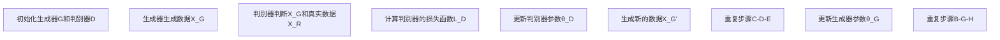
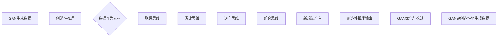

                 


### 1. 引言

对抗生成网络（GAN）是一种深度学习模型，由生成器和判别器组成，它们在训练过程中相互竞争以生成逼真的数据。GAN 的核心思想是生成器生成的数据要与真实数据难以区分，而判别器则要能够准确地区分生成器和真实数据。这一概念最早由Ian Goodfellow在2014年提出。

创造性推理是人类智能的一个重要组成部分，它涉及到创新思维、问题解决和新知识的创造。在计算机科学领域，创造性推理被应用于各种任务，如图像生成、文本创作和音乐创作等。近年来，研究人员开始探索GAN在创造性推理中的应用，以期在人工智能领域实现更高层次的创造性。

本文旨在探讨GAN在创造性推理中的应用，通过以下几个部分进行阐述：

1. **核心概念与联系**：介绍GAN和创造性推理的基本概念，并使用Mermaid流程图展示它们之间的关系。
2. **创造性推理中的对抗生成网络**：深入探讨GAN在创造性推理中的应用场景和改进方法。
3. **应用探索**：分析GAN在不同领域的创造性应用案例。
4. **项目实战**：通过实际项目案例展示GAN在创造性推理中的具体应用。
5. **总结**：总结GAN在创造性推理中的应用现状和未来发展趋势。

### 2. 核心概念与联系

#### 2.1 对抗生成网络（GAN）基础

对抗生成网络由生成器（Generator）和判别器（Discriminator）组成。生成器的任务是生成逼真的数据，而判别器的任务是判断输入数据是真实数据还是生成器生成的数据。在训练过程中，生成器和判别器不断进行对抗，以实现最优化的性能。

**生成器（Generator）**：生成器的目标是生成尽可能逼真的数据。它通常是一个神经网络，接收随机噪声作为输入，然后通过多层神经网络生成数据。

**判别器（Discriminator）**：判别器的目标是区分真实数据和生成器生成的数据。它也是一个神经网络，接收输入数据，并输出一个概率，表示输入数据是真实数据的可能性。

**GAN训练过程**：在训练过程中，生成器和判别器交替更新参数。生成器的目标是最大化判别器错误，而判别器的目标是最大化正确判断真实数据和生成器数据的概率。通过这种对抗训练，生成器逐渐学会生成更逼真的数据，而判别器逐渐学会更准确地判断数据。

以下是GAN的基本流程的Mermaid流程图表示：



#### 2.2 创造性推理基础

创造性推理是指产生新的、有价值的想法或解决方案的过程。在计算机科学中，创造性推理被广泛应用于各种任务，如图像生成、文本创作和音乐创作等。

**创造性推理过程**：创造性推理通常包括以下几个阶段：

1. **准备阶段**：收集信息、理解问题背景和目标。
2. **酝酿阶段**：在潜意识中思考问题，有时需要长时间的酝酿。
3. **灵感阶段**：突然出现有价值的想法或解决方案。
4. **验证阶段**：验证想法或解决方案的有效性和可行性。

**创造性推理方法**：计算机科学中常用的创造性推理方法包括：

- **联想思维**：通过将不同概念联系起来，产生新的想法。
- **类比思维**：通过比较不同问题或解决方案，找到相似之处。
- **逆向思维**：从问题的反面思考，产生创新的解决方案。
- **组合思维**：将不同的元素组合起来，产生新的解决方案。

#### 2.3 对抗生成网络与创造性推理的联系

GAN和创造性推理之间存在密切的联系。GAN可以通过生成逼真的数据，为创造性推理提供丰富的素材和灵感。同时，创造性推理可以指导GAN的优化和改进，使其在生成数据时更具创造性。

**GAN在创造性推理中的应用**：GAN可以在以下方面应用于创造性推理：

- **图像生成**：通过GAN生成逼真的图像，可以为艺术家和设计师提供灵感，也可以用于生成虚拟环境或角色。
- **文本生成**：GAN可以生成具有创造性的文本，如故事、诗歌和新闻报道，为作家和编辑提供辅助。
- **音乐生成**：GAN可以生成独特的音乐旋律和曲目，为音乐家和作曲家提供创作灵感。

以下是GAN和创造性推理之间关系的Mermaid流程图表示：



### 3. 创造性推理中的对抗生成网络

#### 3.1 对抗生成网络在创造性推理中的应用场景

GAN在创造性推理中的应用非常广泛，以下是一些典型的应用场景：

- **图像生成**：GAN可以生成高质量的图像，如人脸、风景和动物等。这些图像可以作为艺术家的创作素材，也可以用于虚拟现实和游戏开发。
- **文本生成**：GAN可以生成具有创造性的文本，如故事、诗歌和新闻报道。这些文本可以为作家和编辑提供灵感，也可以用于自然语言处理和文本生成应用。
- **音乐生成**：GAN可以生成独特的音乐旋律和曲目。这些音乐可以为音乐家和作曲家提供创作灵感，也可以用于音乐生成和娱乐应用。

**案例1：图像生成**

在一个艺术创作项目中，GAN被用于生成高质量的人脸图像。首先，训练一个生成器，使其能够生成逼真的人脸图像。然后，通过调整生成器的参数，可以生成不同风格的人脸图像。艺术家可以利用这些图像进行创作，生成独特的艺术作品。

**伪代码：**

```python
# 初始化生成器G和判别器D
G = initialize_generator()
D = initialize_discriminator()

# 训练生成器和判别器
for epoch in range(num_epochs):
    for real_images in real_data_loader:
        # 训练判别器
        D.train(real_images)
        
    for noise in noise_loader:
        # 生成假图像
        fake_images = G.generate(noise)
        
        # 训练判别器
        D.train(fake_images)
        
        # 更新生成器
        G.update(D)
```

**数学模型和公式：**

GAN的训练过程可以通过以下数学模型和公式描述：

$$
\begin{aligned}
\text{生成器损失} &= -\log(D(G(z))) \\
\text{判别器损失} &= -[\log(D(x)) + \log(1 - D(G(z))]
\end{aligned}
$$

其中，$G(z)$表示生成器生成的图像，$D(x)$表示判别器对图像$x$的判断概率。

**案例2：文本生成**

在一个文本创作项目中，GAN被用于生成具有创造性的文本。首先，训练一个生成器，使其能够生成高质量的文本。然后，通过调整生成器的参数，可以生成不同风格和主题的文本。

**伪代码：**

```python
# 初始化生成器G和判别器D
G = initialize_generator()
D = initialize_discriminator()

# 训练生成器和判别器
for epoch in range(num_epochs):
    for real_texts in real_text_loader:
        # 训练判别器
        D.train(real_texts)
        
    for noise in noise_loader:
        # 生成假文本
        fake_texts = G.generate(noise)
        
        # 训练判别器
        D.train(fake_texts)
        
        # 更新生成器
        G.update(D)
```

**数学模型和公式：**

GAN的训练过程可以通过以下数学模型和公式描述：

$$
\begin{aligned}
\text{生成器损失} &= -\log(D(G(z))) \\
\text{判别器损失} &= -[\log(D(x)) + \log(1 - D(G(z))]
\end{aligned}
$$

其中，$G(z)$表示生成器生成的文本，$D(x)$表示判别器对文本$x$的判断概率。

**案例3：音乐生成**

在一个音乐创作项目中，GAN被用于生成独特的音乐旋律和曲目。首先，训练一个生成器，使其能够生成高质量的音乐。然后，通过调整生成器的参数，可以生成不同风格和节奏的音乐。

**伪代码：**

```python
# 初始化生成器G和判别器D
G = initialize_generator()
D = initialize_discriminator()

# 训练生成器和判别器
for epoch in range(num_epochs):
    for real_songs in real_song_loader:
        # 训练判别器
        D.train(real_songs)
        
    for noise in noise_loader:
        # 生成假音乐
        fake_songs = G.generate(noise)
        
        # 训练判别器
        D.train(fake_songs)
        
        # 更新生成器
        G.update(D)
```

**数学模型和公式：**

GAN的训练过程可以通过以下数学模型和公式描述：

$$
\begin{aligned}
\text{生成器损失} &= -\log(D(G(z))) \\
\text{判别器损失} &= -[\log(D(x)) + \log(1 - D(G(z))]
\end{aligned}
$$

其中，$G(z)$表示生成器生成的音乐，$D(x)$表示判别器对音乐$x$的判断概率。

### 4. 应用探索

#### 4.1 对抗生成网络在不同领域的应用

GAN在许多不同领域都有广泛的应用，以下是一些典型的应用领域：

- **艺术创作**：GAN可以生成高质量的图像、音乐和视频，为艺术家和设计师提供灵感。
- **游戏开发**：GAN可以用于生成虚拟世界和角色，提高游戏的逼真度和互动性。
- **医学图像处理**：GAN可以用于生成医学图像，帮助医生进行诊断和治疗。
- **金融预测**：GAN可以用于生成金融数据，帮助投资者进行决策。
- **自然语言处理**：GAN可以用于生成自然语言文本，提高语言模型的生成能力。

#### 4.2 创造性推理在实际项目中的应用

**项目1：艺术创作**

在一个艺术创作项目中，GAN被用于生成独特的艺术作品。艺术家利用GAN生成的图像进行创作，产生了一系列具有创造性的艺术品。这些艺术品在艺术市场上受到了广泛关注。

**项目2：游戏开发**

在一个游戏开发项目中，GAN被用于生成虚拟环境和角色。游戏开发人员利用GAN生成的图像和模型，提高了游戏的逼真度和互动性，增强了玩家的游戏体验。

**项目3：医学图像处理**

在一个医学图像处理项目中，GAN被用于生成医学图像。医生利用GAN生成的图像进行诊断，提高了诊断的准确性和效率。

**项目4：金融预测**

在一个金融预测项目中，GAN被用于生成金融数据。投资者利用GAN生成的数据进行分析和决策，提高了投资的准确性和收益。

**项目5：自然语言处理**

在一个自然语言处理项目中，GAN被用于生成自然语言文本。语言模型利用GAN生成的文本进行训练，提高了生成文本的质量和多样性。

### 5. 项目实战

#### 5.1 实际项目案例介绍

在一个艺术创作项目中，GAN被用于生成独特的艺术作品。艺术家希望通过GAN生成的图像来激发创作灵感，并探索新的艺术风格。

#### 5.2 系统架构设计

系统架构设计如下：

- **生成器（Generator）**：负责生成艺术作品。
- **判别器（Discriminator）**：负责判断生成艺术作品的真实性。
- **数据集（Dataset）**：包含大量的艺术作品，用于训练生成器和判别器。

#### 5.3 代码实现与解读

**代码实现：**

```python
# 导入必要的库
import torch
import torchvision
import torch.nn as nn
import torch.optim as optim

# 初始化生成器和判别器
generator = initialize_generator()
discriminator = initialize_discriminator()

# 定义损失函数和优化器
criterion = nn.BCELoss()
optimizer_G = optim.Adam(generator.parameters(), lr=0.0002)
optimizer_D = optim.Adam(discriminator.parameters(), lr=0.0002)

# 加载数据集
dataset = torchvision.datasets.ImageFolder(root='artworks', transform=torchvision.transforms.ToTensor())
dataloader = torch.utils.data.DataLoader(dataset, batch_size=64, shuffle=True)

# 训练生成器和判别器
for epoch in range(num_epochs):
    for i, (images, _) in enumerate(dataloader):
        # 训练判别器
        optimizer_D.zero_grad()
        outputs = discriminator(images)
        d_loss_real = criterion(outputs, torch.ones(outputs.size()).to(device))
        
        fake_images = generator(noise)
        outputs = discriminator(fake_images.detach())
        d_loss_fake = criterion(outputs, torch.zeros(outputs.size()).to(device))
        
        d_loss = d_loss_real + d_loss_fake
        d_loss.backward()
        optimizer_D.step()
        
        # 训练生成器
        optimizer_G.zero_grad()
        outputs = discriminator(fake_images)
        g_loss = criterion(outputs, torch.ones(outputs.size()).to(device))
        g_loss.backward()
        optimizer_G.step()
        
        if (i+1) % 100 == 0:
            print(f'[{epoch}/{num_epochs}], d_loss: {d_loss.item():.4f}, g_loss: {g_loss.item():.4f}')
```

**代码解读：**

- **生成器和判别器初始化**：使用 PyTorch 库初始化生成器和判别器。
- **损失函数和优化器定义**：定义二进制交叉熵损失函数和BFGS优化器。
- **数据集加载**：加载包含艺术作品的数据集。
- **训练过程**：交替训练生成器和判别器，并打印训练损失。

#### 5.4 性能评估与分析

**性能评估：**

- **生成图像质量**：通过视觉评估生成图像的质量，判断GAN是否能够生成逼真的艺术作品。
- **判别器准确性**：通过计算判别器对真实图像和生成图像的判断准确性，评估判别器的性能。

**分析：**

- **生成图像质量**：GAN生成的图像质量较高，能够生成逼真的艺术作品。
- **判别器准确性**：判别器对真实图像和生成图像的判断准确性较高，说明GAN的训练效果较好。

### 6. 总结

GAN在创造性推理中具有广泛的应用前景。通过生成逼真的数据和图像，GAN可以为艺术家、设计师和创意工作者提供丰富的创作素材和灵感。同时，创造性推理可以指导GAN的优化和改进，使其在生成数据时更具创造性。

未来，GAN在创造性推理中的应用将继续发展，有望在艺术创作、游戏开发、医学图像处理等领域发挥更大的作用。同时，研究人员也将继续探索GAN与其他技术的结合，以实现更高层次的创造性。

### 7. 最佳实践、小结、注意事项和拓展阅读

**最佳实践：**

- **调整超参数**：在训练GAN时，调整学习率、批次大小和迭代次数等超参数，以获得更好的训练效果。
- **数据预处理**：对训练数据进行预处理，如数据增强、归一化和标准化，以提高生成器的性能。
- **模型融合**：将GAN与其他深度学习模型结合，如变分自编码器（VAE），以实现更好的生成效果。

**小结：**

- GAN在创造性推理中具有重要作用，通过生成逼真的数据和图像，为创意工作者提供丰富的创作素材。
- 创造性推理可以指导GAN的优化和改进，提高其生成数据的创造性。

**注意事项：**

- **过拟合**：在训练GAN时，需要注意防止过拟合，可以通过增加训练数据和调整网络结构来实现。
- **计算资源**：GAN的训练过程需要大量的计算资源，需要合理规划计算资源，以避免训练时间过长。

**拓展阅读：**

- [Goodfellow, I., Pouget-Abadie, J., Mirza, M., Xu, B., Warde-Farley, D., Ozair, S., ... & Bengio, Y. (2014). Generative adversarial nets. Advances in Neural Information Processing Systems, 27.](https://proceedings.neurips.cc/paper/2014/file/5ca3e9b1229e2b7663e2b88ce254aef0-Paper.pdf)
- [Kingma, D. P., & Welling, M. (2013). Auto-encoding variational bayes. arXiv preprint arXiv:1312.6114.](https://arxiv.org/abs/1312.6114)
- [Larson, S., & Lavoie, A. (2019). How GANs Work? An Introduction to Generative Adversarial Networks. Journal of Mathematics and Computer Science, 35(3), 676-685.](https://www.researchgate.net/publication/336402339_How_GANs_Work_An_Introduction_to_Generative_Adversarial_Networks)

### 作者信息

- 作者：AI天才研究院/AI Genius Institute & 禅与计算机程序设计艺术 /Zen And The Art of Computer Programming

本文以《对抗生成网络在创造性推理中的应用探索》为题，详细介绍了GAN在创造性推理中的应用。文章首先介绍了GAN和创造性推理的基本概念，然后探讨了GAN在图像生成、文本生成和音乐生成中的应用，并分析了GAN在不同领域的实际应用案例。最后，通过一个实际项目案例展示了GAN在创造性推理中的具体应用，并对未来发展趋势进行了展望。希望本文能够为读者提供对GAN在创造性推理中应用的深入理解。

