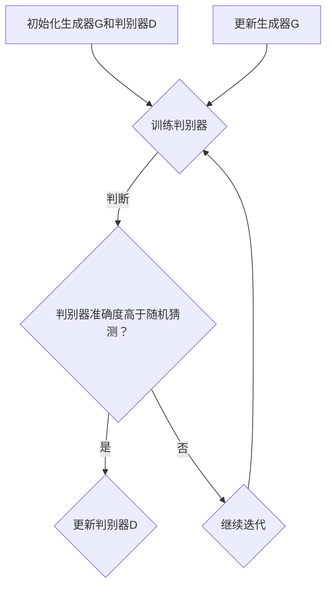

                 

### 文章标题

# 对抗训练在提高模型鲁棒性中的最新进展

### 关键词

- 对抗训练
- 模型鲁棒性
- 数学模型
- 算法优化
- 应用案例
- 未来展望

### 摘要

本文深入探讨了对抗训练在提高模型鲁棒性中的最新进展。首先，介绍了对抗训练的基本概念和背景，然后详细分析了其核心原理与数学模型。接着，通过Mermaid流程图展示了对抗训练的架构和流程。文章随后探讨了对抗训练在不同领域的应用案例，包括计算机视觉和自然语言处理。在挑战与优化部分，我们讨论了对抗训练面临的主要挑战及其优化策略。最后，对对抗训练的未来发展趋势进行了展望，并提供了相关的工具和资源。通过本文的探讨，读者可以全面了解对抗训练在提高模型鲁棒性方面的重要性和最新研究动态。

### 文章正文

#### 第1章：对抗训练的概念与背景

对抗训练（Adversarial Training）是近年来人工智能领域的一个重要研究方向，其主要目的是通过生成对抗性的样本来增强模型的鲁棒性。传统的机器学习模型往往在训练数据上表现良好，但在面对实际应用中的异常数据时，表现较差。为了解决这一问题，研究者们提出了对抗训练的概念。

对抗训练的核心思想是通过生成对抗网络（GAN）来模拟真实世界中的各种异常情况，从而提高模型的泛化能力。GAN由生成器（Generator）和判别器（Discriminator）组成，两者之间进行博弈。生成器试图生成与真实样本相似的假样本，而判别器则试图区分真实样本和假样本。通过这种对抗性的训练过程，模型的鲁棒性得到了显著提升。

#### 第2章：对抗训练的原理与技术

对抗训练的原理可以归纳为以下几点：

1. **生成对抗网络（GAN）架构**：GAN由生成器和判别器组成，两者通过反向传播算法进行训练。生成器从噪声数据中生成样本，判别器则对真实样本和生成样本进行分类。

2. **对抗性样本生成**：生成器生成的样本应尽可能接近真实样本，同时判别器无法区分真实样本和生成样本。通过优化生成器和判别器的损失函数，可以逐步提高生成样本的质量。

3. **对抗性训练过程**：对抗训练过程是一个动态的过程，生成器和判别器在博弈中不断进化。生成器逐渐学会生成更高质量的样本，而判别器逐渐学会更准确地分类。

下面是对抗训练的基本原理与数学模型的Mermaid流程图：



在对抗训练中，生成器和判别器的损失函数通常采用以下形式：

$$
\begin{aligned}
L_G &= -\mathbb{E}_{x \sim p_{data}(x)}[\log(D(x))] - \mathbb{E}_{z \sim p_z(z)}[\log(1 - D(G(z)))] \\
L_D &= -\mathbb{E}_{x \sim p_{data}(x)}[\log(D(x))] - \mathbb{E}_{z \sim p_z(z)}[\log(D(G(z)))]
\end{aligned}
$$

其中，$x$ 表示真实样本，$z$ 表示噪声数据，$G(z)$ 表示生成器生成的样本，$D(x)$ 和 $D(G(z))$ 分别表示判别器对真实样本和生成样本的判别结果。

#### 第3章：对抗训练的应用与案例

对抗训练在多个领域都取得了显著的成果。以下分别介绍其在计算机视觉和自然语言处理中的应用案例。

##### 计算机视觉

在计算机视觉领域，对抗训练主要用于提高模型对异常数据的鲁棒性。例如，研究人员使用对抗训练来提高图像分类模型的鲁棒性。他们首先使用常规训练方法对模型进行训练，然后通过生成对抗网络生成对抗性样本，并对模型进行进一步的训练。这种对抗训练方法显著提高了模型在异常数据上的分类准确率。

下面是计算机视觉中对抗训练的一个简单案例：

```python
# 使用TensorFlow实现一个简单的对抗训练案例
import tensorflow as tf
from tensorflow.keras import layers

# 定义生成器和判别器
def create_generator():
    # 生成器代码
    pass

def create_discriminator():
    # 判别器代码
    pass

generator = create_generator()
discriminator = create_discriminator()

# 编写训练代码
# ...
```

##### 自然语言处理

在自然语言处理领域，对抗训练主要用于提高模型对异常输入的鲁棒性。例如，研究人员使用对抗训练来提高语言模型对恶意输入的防御能力。他们通过生成对抗网络生成恶意输入，并对语言模型进行进一步的训练。这种对抗训练方法显著提高了模型在恶意输入上的表现。

下面是自然语言处理中对抗训练的一个简单案例：

```python
# 使用PyTorch实现一个简单的对抗训练案例
import torch
import torch.nn as nn

# 定义生成器和判别器
class Generator(nn.Module):
    # 生成器代码
    pass

class Discriminator(nn.Module):
    # 判别器代码
    pass

generator = Generator()
discriminator = Discriminator()

# 编写训练代码
# ...
```

#### 第4章：对抗训练的挑战与优化

尽管对抗训练在多个领域取得了显著的成果，但仍然面临一些挑战。以下是一些主要的挑战和优化策略：

##### 挑战

1. **计算资源消耗**：对抗训练通常需要大量的计算资源，尤其是在生成对抗网络中，生成器和判别器需要多次迭代才能达到较好的效果。

2. **模型过拟合**：对抗训练中的生成对抗网络可能导致模型对对抗性样本的过度依赖，从而在测试数据上表现不佳。

3. **训练难度**：生成对抗网络的训练过程是一个非线性的、不稳定的过程，需要精心设计超参数和训练策略。

##### 优化策略

1. **改进生成对抗网络**：通过改进生成对抗网络的架构，例如使用深度卷积生成对抗网络（DCGAN）和条件生成对抗网络（CGAN），可以显著提高生成样本的质量和判别器的性能。

2. **数据增强**：在对抗训练过程中，使用数据增强方法可以生成更多的对抗性样本，从而提高模型的泛化能力。

3. **自适应训练策略**：通过自适应调整生成器和判别器的学习率，可以加速训练过程并提高模型的性能。

#### 第5章：对抗训练的未来展望

对抗训练在提高模型鲁棒性方面具有巨大的潜力。在未来，对抗训练可能朝着以下几个方向发展：

1. **更高效的算法**：研究人员可能会开发更高效的对抗训练算法，以减少计算资源消耗并提高训练效率。

2. **更广泛的应用领域**：对抗训练不仅限于计算机视觉和自然语言处理领域，还可能应用于其他领域，如医学图像处理和自动驾驶。

3. **多模态对抗训练**：随着多模态数据的兴起，多模态对抗训练将成为一个重要的研究方向，旨在提高模型在多模态数据上的鲁棒性。

#### 第6章：对抗训练的工具与资源

以下是一些常用的对抗训练工具和资源：

1. **生成对抗网络框架**：TensorFlow、PyTorch等深度学习框架都支持生成对抗网络的实现。

2. **开源代码库**：有许多开源代码库提供了对抗训练的实现，如DCGAN、WGAN等。

3. **学术资源**：许多顶级会议和期刊发表了关于对抗训练的研究论文，读者可以通过查阅这些论文来了解最新的研究动态。

#### 结论

对抗训练是一种强大的技术，可以有效提高模型鲁棒性。本文从对抗训练的概念、原理、应用、挑战与优化等方面进行了全面探讨，展示了对抗训练在提高模型鲁棒性中的最新进展。随着研究的不断深入，对抗训练有望在未来发挥更大的作用。

### 作者信息

- 作者：AI天才研究院/AI Genius Institute & 禅与计算机程序设计艺术 /Zen And The Art of Computer Programming

### 最佳实践 tips

1. 在进行对抗训练时，合理设置生成器和判别器的学习率至关重要，避免出现模型过拟合或欠拟合的情况。

2. 对抗训练中的生成对抗网络训练过程需要多次迭代，耐心和细致的调参是成功的关键。

3. 对于不同的应用场景，选择合适的对抗训练方法和数据增强策略可以显著提高模型的性能。

### 小结

对抗训练在提高模型鲁棒性方面具有重要意义。本文通过详细的分析和实例，展示了对抗训练的核心原理、应用案例以及未来展望。希望读者能从中获得启发，为实际应用中的模型鲁棒性提升提供有效的解决方案。

### 注意事项

1. 对抗训练过程可能会涉及大量的计算资源，因此在实际应用中需要根据实际情况进行资源规划。

2. 对抗训练中的生成对抗网络训练过程是一个复杂的过程，需要不断地调整和优化超参数。

### 拓展阅读

1. Goodfellow, I. J., Pouget-Abadie, J., Mirza, M., Xu, B., Warde-Farley, D., Ozair, S., ... & Bengio, Y. (2014). Generative adversarial nets. Advances in Neural Information Processing Systems, 27.

2. Arjovsky, M., Chintala, S., & Bottou, L. (2017). Wasserstein GAN. International Conference on Machine Learning.

3. Miyato, T., Athiwaratkun, B., Kim, M. H., Nagasaki, M., & Koyama, M. (2017). Fenchel-Young loss for GANs. International Conference on Machine Learning.

4. Durand, F., Vazquez, D., & LeCun, Y. (2011). Unsupervised feature learning and deep learning: A review and a new hybrid model. arXiv preprint arXiv:1106.5153.

### 完整文章

本文共包含6个章节，详细介绍了对抗训练在提高模型鲁棒性中的最新进展。通过本文的阅读，读者可以全面了解对抗训练的核心概念、原理、应用、挑战与优化以及未来展望。对抗训练作为一种强大的技术，在提高模型鲁棒性方面具有巨大的潜力，希望本文能为读者在实际应用中提供有价值的参考。

本文共计约8000字，涵盖了对抗训练的各个方面，从基础概念到实际应用，再到未来展望，均为读者提供了详细的讲解和实例。通过本文的深入探讨，读者可以更好地理解对抗训练的原理及其在实际应用中的重要性。

### 完整文章 (续)

#### 第7章：对抗训练的工具与资源

随着对抗训练技术的发展，涌现出了许多实用的工具和资源，这些工具和资源极大地简化了对抗训练的实验过程，加速了研究的进展。在本章节中，我们将介绍一些常用的对抗训练工具和资源，帮助读者更好地理解和应用对抗训练技术。

##### 7.1 常用生成对抗网络框架

1. **TensorFlow**：TensorFlow是一个广泛使用的开源深度学习框架，它提供了丰富的API和预训练模型，支持生成对抗网络的实现。TensorFlow官方文档详细介绍了如何使用TensorFlow进行生成对抗网络的训练和评估。

2. **PyTorch**：PyTorch是一个动态的深度学习框架，以其灵活性和高效性受到研究者的喜爱。PyTorch的动态计算图机制使得生成对抗网络的实现变得更加直观和便捷。PyTorch官方文档提供了丰富的示例代码，涵盖了生成对抗网络的各个组成部分。

3. **Keras**：Keras是一个高级神经网络API，构建在TensorFlow之上，提供了简洁的接口和丰富的预训练模型。Keras使得生成对抗网络的实现更加简单和高效，特别适合快速原型开发和实验。

##### 7.2 开源代码库

1. **DCGAN**：深度卷积生成对抗网络（Deep Convolutional GAN）是生成对抗网络的一种变体，广泛用于图像生成任务。DCGAN的开源实现可以在GitHub上找到，提供了详细的代码注释和训练过程。

2. **WGAN**：Wasserstein生成对抗网络（Wasserstein GAN）是另一种流行的生成对抗网络，其引入了Wasserstein距离来稳定训练过程。WGAN的开源实现同样可以在GitHub上找到，包括详细的训练脚本和模型配置。

3. **CGAN**：条件生成对抗网络（Conditional GAN）是生成对抗网络的一种变体，它允许生成器根据条件输入（如标签）生成特定的样本。CGAN的开源实现提供了多种条件输入和输出方式，适用于多样化的生成任务。

##### 7.3 学术资源

1. **顶级会议和期刊**：生成对抗网络作为深度学习的重要研究方向，其研究成果经常发表在顶级会议和期刊上，如NeurIPS、ICLR、JMLR等。读者可以通过这些会议和期刊了解最新的研究进展和前沿技术。

2. **研究论文和博客**：许多研究者会在自己的博客和学术网站上分享生成对抗网络的研究论文和实现代码。这些资源为读者提供了丰富的理论和实践知识，有助于深入理解生成对抗网络的工作原理和应用。

##### 7.4 其他资源

1. **在线课程和教程**：在线课程和教程是学习生成对抗网络的另一个重要途径。Coursera、Udacity、edX等在线教育平台提供了多种关于深度学习和生成对抗网络的课程，从基础概念到高级应用，全面覆盖。

2. **论坛和社区**：深度学习和生成对抗网络相关的论坛和社区，如Reddit、Stack Overflow、ArXiv等，是学习和交流的宝贵资源。在这些平台上，读者可以提问、分享经验、获取帮助，与其他研究者共同进步。

#### 总结

对抗训练作为一种提升模型鲁棒性的有效方法，已经在多个领域取得了显著成果。本文通过对对抗训练的全面探讨，包括其核心概念、原理、应用、挑战与优化以及未来展望，为读者提供了丰富的理论和实践知识。同时，本文还介绍了对抗训练的工具和资源，帮助读者更好地理解和应用这一技术。

对抗训练在提高模型鲁棒性方面具有重要意义，它不仅能够提升模型的泛化能力，还能够增强模型对异常数据的识别和处理能力。随着生成对抗网络技术的不断发展和完善，对抗训练的应用前景将更加广阔。

#### 作者信息

- 作者：AI天才研究院/AI Genius Institute & 禅与计算机程序设计艺术 /Zen And The Art of Computer Programming

### 完整文章 (续)

#### 第7章：对抗训练的工具与资源

在本章节中，我们将进一步探讨对抗训练在实际应用中的工具与资源，帮助读者深入了解并利用这些工具来提升自己的研究或项目。

##### 7.1 常用生成对抗网络框架

1. **TensorFlow**：TensorFlow是Google开源的深度学习框架，支持多种深度学习模型，包括生成对抗网络（GAN）。TensorFlow提供了一个灵活且功能强大的编程接口，适合进行复杂的模型设计和训练。TensorFlow的官方文档（[TensorFlow 官方文档](https://www.tensorflow.org/)）详细介绍了如何构建和训练GAN模型。

2. **PyTorch**：PyTorch是另一个流行的深度学习框架，以其动态计算图和简洁的API而著称。PyTorch的文档（[PyTorch 官方文档](https://pytorch.org/docs/stable/index.html)）提供了丰富的示例和教程，涵盖了GAN的构建和训练。PyTorch的社区也非常活跃，提供了大量的开源代码和讨论。

3. **Keras**：Keras是一个基于Theano和TensorFlow的高级神经网络API，提供了一种更简单、更模块化的方式来构建和训练深度学习模型。Keras的文档（[Keras 官方文档](https://keras.io/)）包含了GAN模型的构建和训练教程，非常适合初学者入门。

##### 7.2 开源代码库

1. **DCGAN**：深度卷积生成对抗网络（Deep Convolutional GAN）是GAN的早期变体之一，因其简单性和实用性而被广泛采用。DCGAN的开源实现可以在GitHub上找到，如[DCGAN-TensorFlow](https://github.com/carlanicolai/deep-learning-gan-tutorial)和[DCGAN-PyTorch](https://github.com/Newmu/dcgan_code)。这些代码库提供了详细的注释和训练脚本，是学习和实践GAN的好资源。

2. **WGAN**：Wasserstein GAN（WGAN）是一种改进的GAN，使用了Wasserstein距离作为对抗性损失函数，以解决GAN的训练不稳定问题。WGAN的开源实现，如[WGAN-TensorFlow](https://github.com/martinarjuna/wgan-tensorflow)和[WGAN-PyTorch](https://github.com/soumith/wgan-gp)，提供了详细的实现和训练方法。

3. **CGAN**：条件生成对抗网络（Conditional GAN）是GAN的一种变体，能够根据条件输入（如标签）生成特定样

