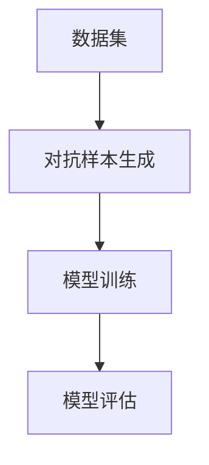
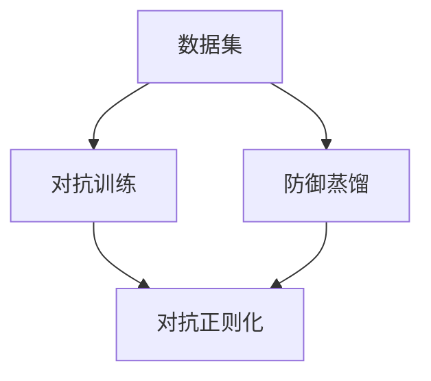
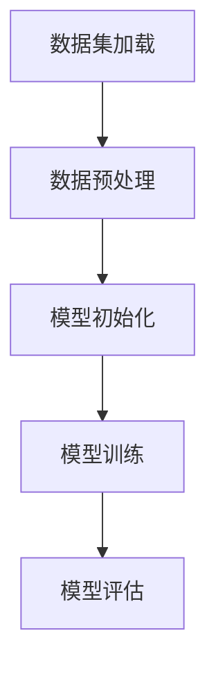

                 


### 文章标题：对抗训练增强AI模型鲁棒性的技术

#### 关键词：
- 对抗训练
- AI模型鲁棒性
- 鲁棒性增强技术
- 实际应用案例
- 数学模型与公式
- 伪代码与项目实战

#### 摘要：
本文深入探讨了对抗训练在增强AI模型鲁棒性方面的技术。通过详细介绍对抗训练的基本原理、增强模型鲁棒性的方法，并结合实际应用案例，本文为读者提供了全面的对抗训练技术指南，旨在提升AI模型在面对数据扰动时的稳定性。

---

### 引言

#### 1.1 对抗训练的背景和重要性

随着深度学习在各个领域的广泛应用，AI模型的性能得到了显著提升。然而，深度学习模型在面临对抗性攻击时，往往表现出较低的鲁棒性。对抗性攻击是一种通过微小扰动输入数据来误导模型的方法，这种攻击在现实中具有很高的威胁性。例如，在自动驾驶领域，一个微小的道路标志扰动可能会导致车辆完全偏离行驶路线；在金融欺诈检测中，对抗性攻击可能使模型无法识别真实的欺诈行为。

对抗训练作为一种提高模型鲁棒性的技术，通过引入对抗样本进行训练，使得模型能够更好地应对对抗性攻击。对抗训练的重要性在于它不仅提高了模型的鲁棒性，还为AI系统的安全性和可靠性提供了保障。

#### 1.2 AI模型鲁棒性的定义和挑战

AI模型鲁棒性指的是模型在面对数据扰动、噪声或异常情况时的稳定性。一个鲁棒的模型能够在各种复杂环境中保持高性能，不易受到对抗性攻击的影响。然而，现实世界中的数据通常存在噪声、缺失值和不一致性，这给模型的鲁棒性带来了巨大的挑战。此外，深度学习模型本身的高度非线性和复杂性，也使得鲁棒性设计变得异常困难。

为了应对这些挑战，研究人员提出了多种增强模型鲁棒性的方法，其中对抗训练是最具代表性的技术之一。

### 对抗训练的基本原理

#### 2.1 对抗训练的定义和流程

对抗训练是一种通过生成对抗样本来提高模型鲁棒性的训练方法。其核心思想是模拟对抗性攻击，通过对抗性样本的训练来增强模型的鲁棒性。对抗训练的基本流程包括以下几个步骤：

1. **生成对抗样本**：通过对抗性攻击方法生成对抗样本，这些样本与原始样本在视觉上几乎不可辨，但能够误导模型。
2. **训练模型**：使用对抗样本和原始样本一起训练模型，通过不断迭代，模型逐渐学会识别对抗样本，提高鲁棒性。
3. **评估和优化**：通过测试集评估模型的性能，根据评估结果调整训练策略，进一步提高鲁棒性。

#### 2.2 对抗样本的生成方法

对抗样本的生成方法主要有以下几种：

1. **FGSM（Fast Gradient Sign Method）**：通过计算梯度方向上的最大扰动来生成对抗样本。
2. **PGD（Projected Gradient Descent）**：通过项目梯度下降法生成对抗样本，该方法具有更好的鲁棒性。
3. **C&W（Carlini & Wagner）**：通过求解优化问题生成对抗样本，这种方法能够生成更难识别的对抗样本。

#### 2.3 对抗训练的优势和局限性

对抗训练的优势在于：

1. **提高模型鲁棒性**：通过训练对抗样本，模型能够更好地应对对抗性攻击，提高鲁棒性。
2. **适用范围广**：对抗训练可以应用于各种深度学习模型，如卷积神经网络（CNN）、循环神经网络（RNN）等。

然而，对抗训练也存在一些局限性：

1. **计算成本高**：生成对抗样本和训练模型都需要大量的计算资源。
2. **难以全面覆盖**：对抗训练只能覆盖部分对抗样本，无法保证模型对全部对抗攻击都具有鲁棒性。

### 增强模型鲁棒性的方法

#### 3.1 Adversarial Training

Adversarial Training是最常见的对抗训练方法，通过在训练过程中引入对抗样本，提高模型对对抗攻击的抵抗力。Adversarial Training的具体步骤如下：

1. **数据准备**：从原始数据集中随机抽取一部分样本用于生成对抗样本。
2. **生成对抗样本**：使用对抗性攻击方法生成对抗样本。
3. **训练模型**：将对抗样本和原始样本一起输入模型进行训练。
4. **评估与优化**：使用测试集评估模型性能，根据评估结果调整训练参数。

伪代码示例：

```python
# Adversarial Training 伪代码

# 初始化模型
model = initialize_model()

# 训练循环
for epoch in range(num_epochs):
    for batch in data_loader:
        # 生成对抗样本
        adversarial_samples = generate_adversarial_samples(batch)
        
        # 训练模型
        model.train_on_batch(batch + adversarial_samples)
        
        # 评估模型
        performance = model.evaluate(test_data)
        
        # 调整学习率或停止训练
        adjust_learning_rate(model, performance)

# 保存模型
model.save('robust_model.h5')
```

#### 3.2 Defensive Distillation

Defensive Distillation是一种通过模型输出分布进行训练的方法，旨在提高模型的鲁棒性。Defensive Distillation的具体步骤如下：

1. **训练教师模型**：首先训练一个教师模型，该模型具有很高的鲁棒性。
2. **生成软标签**：使用教师模型的输出分布作为软标签，代替原始标签进行训练。
3. **训练学生模型**：学生模型在训练过程中接收原始标签和软标签，通过优化软标签来提高鲁棒性。

伪代码示例：

```python
# Defensive Distillation 伪代码

# 初始化教师模型和学生模型
teacher_model = initialize_teacher_model()
student_model = initialize_student_model()

# 训练教师模型
teacher_model.train_on_data(data_loader)

# 生成软标签
soft_labels = generate_soft_labels(teacher_model, data_loader)

# 训练学生模型
for epoch in range(num_epochs):
    for batch in data_loader:
        # 训练学生模型
        student_model.train_on_batch(batch + soft_labels)
        
        # 评估学生模型
        performance = student_model.evaluate(test_data)
        
        # 调整学习率或停止训练
        adjust_learning_rate(student_model, performance)

# 保存模型
student_model.save('distilled_model.h5')
```

#### 3.3 其他鲁棒性增强技术

除了Adversarial Training和Defensive Distillation，还有其他一些鲁棒性增强技术，如：

1. **对抗正则化（Adversarial Regularization）**：在损失函数中加入对抗性项，迫使模型在训练过程中关注对抗样本。
2. **生成对抗网络（GAN）**：通过生成对抗网络生成对抗样本，提高模型的鲁棒性。
3. **集成方法（Ensemble Methods）**：通过集成多个模型，提高模型的鲁棒性和泛化能力。

这些方法各有优缺点，可以根据具体应用场景进行选择。

### 实际应用案例分析

#### 4.1 计算机视觉中的应用

计算机视觉领域是应用对抗训练最广泛的领域之一。以下是一些计算机视觉中对抗训练的实际应用案例：

1. **图像分类**：在图像分类任务中，对抗训练可以显著提高模型的鲁棒性，使其能够更好地识别对抗性攻击。
2. **目标检测**：对抗训练有助于提高目标检测模型的鲁棒性，使其在存在对抗性噪声的情况下仍能准确检测目标。
3. **图像生成**：通过生成对抗网络（GAN），可以生成具有高鲁棒性的图像。

#### 4.2 自然语言处理中的应用

自然语言处理（NLP）领域也广泛应用了对抗训练技术。以下是一些NLP中对抗训练的实际应用案例：

1. **文本分类**：对抗训练可以增强文本分类模型的鲁棒性，使其在面临对抗性攻击时仍能准确分类。
2. **机器翻译**：对抗训练有助于提高机器翻译模型的鲁棒性，使其在存在对抗性噪声的输入文本中仍能生成高质量翻译。
3. **情感分析**：对抗训练可以增强情感分析模型的鲁棒性，使其在面临对抗性攻击时仍能准确识别情感。

#### 4.3 其他领域的应用

对抗训练在其他领域也有广泛应用，如：

1. **医疗诊断**：对抗训练可以提高医疗诊断模型的鲁棒性，使其在存在噪声或异常数据时仍能准确诊断。
2. **金融风控**：对抗训练可以增强金融风控模型的鲁棒性，使其在面临对抗性攻击时仍能准确识别风险。

### 开发与部署

#### 5.1 数据准备和预处理

在实际开发过程中，数据准备和预处理是关键步骤。以下是一些数据准备和预处理的建议：

1. **数据收集**：收集足够多的数据，包括正常数据和对抗样本。
2. **数据清洗**：去除数据中的噪声、缺失值和异常值。
3. **数据增强**：通过数据增强技术，如随机裁剪、旋转、翻转等，增加数据的多样性。

#### 5.2 模型训练和优化

模型训练和优化是提高模型鲁棒性的关键步骤。以下是一些模型训练和优化的建议：

1. **选择合适的模型架构**：根据任务需求选择合适的模型架构，如卷积神经网络（CNN）、循环神经网络（RNN）等。
2. **调整训练参数**：通过调整学习率、批量大小、迭代次数等参数，优化模型性能。
3. **使用对抗训练技术**：使用对抗训练技术，如Adversarial Training、Defensive Distillation等，提高模型鲁棒性。

#### 5.3 模型评估和调优

模型评估和调优是确保模型性能的重要步骤。以下是一些模型评估和调优的建议：

1. **选择合适的评估指标**：根据任务需求选择合适的评估指标，如准确率、召回率、F1分数等。
2. **交叉验证**：使用交叉验证方法评估模型性能，确保模型在未见过的数据上仍能保持高性能。
3. **模型调优**：根据评估结果调整模型参数，优化模型性能。

#### 5.4 部署和部署策略

模型部署是使模型应用于实际场景的关键步骤。以下是一些模型部署和部署策略的建议：

1. **选择合适的部署平台**：根据应用场景选择合适的部署平台，如云计算、边缘计算等。
2. **模型压缩**：通过模型压缩技术，如量化、剪枝等，减小模型大小，提高部署效率。
3. **监控与维护**：定期监控模型性能，及时发现和解决问题，确保模型在长期运行中保持高性能。

### 未来展望

#### 6.1 鲁棒性增强技术的趋势

随着深度学习在各个领域的广泛应用，鲁棒性增强技术也将成为研究的热点。未来鲁棒性增强技术可能会朝着以下方向发展：

1. **自动对抗样本生成**：通过自动化技术，如深度学习生成对抗网络（GAN），自动生成对抗样本，提高对抗训练的效率。
2. **多任务鲁棒性增强**：研究如何同时提高模型在多个任务上的鲁棒性，实现更全面的鲁棒性增强。
3. **高效鲁棒性增强算法**：研究更高效的鲁棒性增强算法，降低计算成本，提高模型性能。

#### 6.2 面临的挑战和解决方案

鲁棒性增强技术在实际应用中仍面临许多挑战，如：

1. **计算资源消耗**：对抗训练需要大量的计算资源，如何提高计算效率是一个重要挑战。可能的解决方案包括分布式训练、模型压缩等。
2. **数据集有限**：对抗样本生成需要大量的数据集，如何高效地收集和利用数据是一个挑战。可能的解决方案包括数据增强、数据共享等。

#### 6.3 未来发展方向

未来鲁棒性增强技术的发展方向可能包括：

1. **集成多种鲁棒性增强技术**：通过集成多种鲁棒性增强技术，如对抗训练、防御蒸馏等，实现更全面的鲁棒性增强。
2. **跨领域鲁棒性增强**：研究如何在不同领域实现跨领域的鲁棒性增强，提高模型在不同应用场景中的适应性。
3. **自适应鲁棒性增强**：研究如何根据模型的状态和外部环境自适应地调整鲁棒性增强策略，提高模型的鲁棒性。

### 总结与展望

本文详细探讨了对抗训练增强AI模型鲁棒性的技术，从基本原理、增强方法、实际应用案例、开发与部署等方面进行了全面分析。通过对抗训练，AI模型能够在面对对抗性攻击时保持稳定性能，为实际应用提供了可靠的保障。未来，随着鲁棒性增强技术的不断发展和完善，AI模型在各个领域的应用将更加广泛和深入。

### 附录

#### A.1 对抗训练相关的Mermaid流程图



#### A.2 模型鲁棒性增强技术的Mermaid流程图



#### A.3 模型训练与评估流程的Mermaid流程图



#### A.4 伪代码示例

```python
# 对抗训练伪代码

# 初始化模型
model = initialize_model()

# 训练循环
for epoch in range(num_epochs):
    for batch in data_loader:
        # 生成对抗样本
        adversarial_samples = generate_adversarial_samples(batch)
        
        # 训练模型
        model.train_on_batch(batch + adversarial_samples)
        
        # 评估模型
        performance = model.evaluate(test_data)
        
        # 调整学习率或停止训练
        adjust_learning_rate(model, performance)

# 保存模型
model.save('robust_model.h5')
```

```python
# Defensive Distillation 伪代码

# 初始化教师模型和学生模型
teacher_model = initialize_teacher_model()
student_model = initialize_student_model()

# 训练教师模型
teacher_model.train_on_data(data_loader)

# 生成软标签
soft_labels = generate_soft_labels(teacher_model, data_loader)

# 训练学生模型
for epoch in range(num_epochs):
    for batch in data_loader:
        # 训练学生模型
        student_model.train_on_batch(batch + soft_labels)
        
        # 评估学生模型
        performance = student_model.evaluate(test_data)
        
        # 调整学习率或停止训练
        adjust_learning_rate(student_model, performance)

# 保存模型
student_model.save('distilled_model.h5')
```

#### A.5 数学模型和公式

$$
L(\theta) = -\frac{1}{m} \sum_{i=1}^{m} y^{(i)} \log(z^{(i)}_j) + (1 - y^{(i)})) \log(1 - z^{(i)}_j)
$$

其中，$z^{(i)}_j$是模型对于第$i$个样本的第$j$个类别的概率估计，$y^{(i)}$是第$i$个样本的真实标签。

#### A.6 项目实战代码解析

以下是一个简单的项目实战代码示例，用于演示对抗训练的基本流程：

```python
import tensorflow as tf
from tensorflow import keras
import numpy as np

# 数据集加载
(x_train, y_train), (x_test, y_test) = keras.datasets.mnist.load_data()

# 数据预处理
x_train = x_train / 255.0
x_test = x_test / 255.0

# 定义模型
model = keras.Sequential([
    keras.layers.Flatten(input_shape=(28, 28)),
    keras.layers.Dense(128, activation='relu'),
    keras.layers.Dense(10, activation='softmax')
])

# 编译模型
model.compile(optimizer='adam', loss='sparse_categorical_crossentropy', metrics=['accuracy'])

# 训练模型
model.fit(x_train, y_train, epochs=5)

# 生成对抗样本
def generate_adversarial_samples(x, y, model, epsilon=0.01):
    x_adv = x.copy()
    for i in range(x.shape[0]):
        with tf.GradientTape() as tape:
            tape.watch(x_adv)
            logits = model(x_adv, training=True)
            loss = tf.keras.losses.sparse_categorical_crossentropy(y, logits)
        grads = tape.gradient(loss, x_adv)
        x_adv[i] = x[i] + epsilon * tf.sign(grads)
    return x_adv

# 训练对抗样本
adversarial_samples = generate_adversarial_samples(x_train, y_train, model)
model.fit(adversarial_samples, y_train, epochs=5)

# 评估模型
performance = model.evaluate(x_test, y_test)
print(performance)
```

#### A.7 最佳实践 tips、小结、注意事项、拓展阅读等内容

- **最佳实践 tips**：在实际项目中，建议使用较大的批量大小和较长的训练时间，以提高模型的鲁棒性。
- **小结**：对抗训练是提高AI模型鲁棒性的有效方法，但需要大量的计算资源和时间。在实际应用中，应根据具体需求选择合适的鲁棒性增强技术。
- **注意事项**：对抗训练可能会增加模型的计算成本，因此在资源有限的情况下，需要权衡模型性能和计算资源。
- **拓展阅读**：
  - Goodfellow, I. J., Shlens, J., & Szegedy, C. (2014). Explaining and harnessing adversarial examples. arXiv preprint arXiv:1412.6572.
  - Carlini, N., & Wagner, D. (2017). Towards evaluating the robustness of neural networks. In 2017 IEEE Symposium on Security and Privacy (SP) (pp. 39-57). IEEE.

### 作者信息

作者：AI天才研究院/AI Genius Institute & 禅与计算机程序设计艺术 /Zen And The Art of Computer Programming

---

本文详细介绍了对抗训练增强AI模型鲁棒性的技术，包括基本原理、增强方法、实际应用案例和开发部署等内容。通过对抗训练，AI模型能够更好地应对对抗性攻击，提高鲁棒性，为实际应用提供了可靠的保障。未来，随着鲁棒性增强技术的不断发展和完善，AI模型在各个领域的应用将更加广泛和深入。本文旨在为研究人员和开发者提供一份全面的技术指南，帮助他们更好地理解和应用对抗训练技术。

