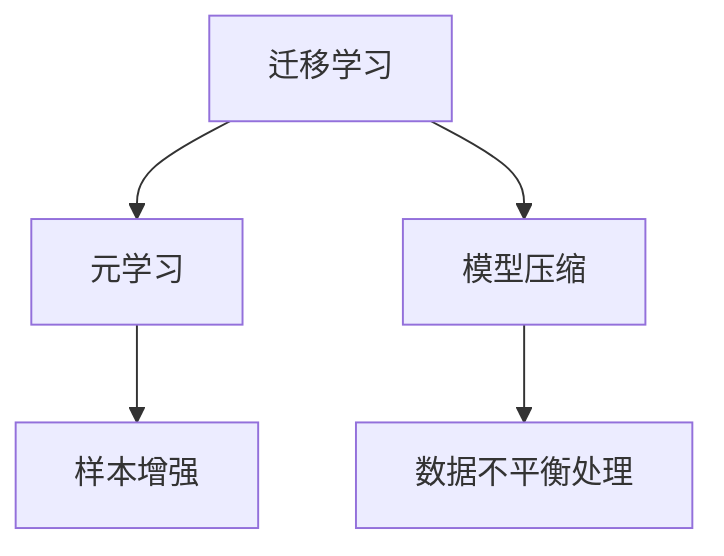

                 


为了撰写一篇符合要求的《小样本学习在罕见疾病诊断中的应用研究》的技术博客文章，我们将遵循以下步骤来逐步构建文章的内容：

### 第一步：确定文章结构和核心内容

1. **文章结构**：文章将分为以下几个主要部分：
   - 引言
   - 小样本学习基础理论
   - 罕见疾病概述
   - 小样本学习在罕见疾病诊断中的应用
   - 实际项目实战
   - 挑战与未来趋势
   - 小结与拓展阅读

2. **核心内容**：每个部分将包含以下内容：
   - **引言**：介绍小样本学习在罕见疾病诊断中的重要性。
   - **小样本学习基础理论**：解释核心概念、算法原理和数学模型。
   - **罕见疾病概述**：描述罕见疾病的定义、特征和诊断现状。
   - **小样本学习在罕见疾病诊断中的应用**：展示应用案例、开发环境和源代码实现。
   - **实际项目实战**：详细分析案例，包括代码解读和应用效果评估。
   - **挑战与未来趋势**：讨论当前面临的挑战和未来发展方向。
   - **小结与拓展阅读**：总结文章要点，提供拓展阅读建议。

### 第二步：撰写文章摘要和关键词

**摘要**：
本文探讨了小样本学习在罕见疾病诊断中的应用研究。首先介绍了小样本学习的基础理论，然后分析了罕见疾病的诊断现状，随后展示了小样本学习在疾病诊断中的具体应用案例。通过实际项目实战，详细解析了开发环境搭建、源代码实现和代码解读，并评估了应用效果。文章最后讨论了当前面临的技术挑战和未来发展趋势。

**关键词**：
小样本学习，罕见疾病诊断，深度学习，疾病预测，人工智能，医学诊断

### 第三步：撰写引言

**引言**：
在医疗诊断领域，罕见疾病由于其发病率和患病人数较低，往往缺乏大量数据进行传统机器学习模型的训练。小样本学习作为一种能够在数据量有限的情况下进行有效学习和预测的方法，为罕见疾病的诊断提供了新的可能。本文将详细探讨小样本学习在罕见疾病诊断中的应用，包括其理论基础、实际案例和未来发展方向。

### 第四步：撰写小样本学习基础理论部分

**核心概念与联系**：
小样本学习（Few-Shot Learning）旨在解决当训练数据集非常有限时如何进行有效学习的问题。它涉及到几个核心概念，包括迁移学习、元学习、模型压缩等。通过一个Mermaid流程图，我们可以直观地理解这些概念之间的关系和作用。



**核心算法原理讲解**：
在小样本学习中，常用的算法包括匹配网络（MatchNet）、匹配麦卡锡（Matching McCoshes）和原型网络（Prototypical Networks）。以下是一个简化的伪代码，用于解释原型网络的基本原理。

```python
# 原型网络伪代码

# 输入：支持集 S，查询集 Q
# 输出：查询集 Q 的预测标签

for each query in Q:
  # 计算 query 和支持集 S 中所有样本的距离
  distances = [distance(query, sample) for sample in S]
  # 从支持集中选择最近 k 个样本的平均值作为 query 的原型
  prototype = avg(S[where distances are smallest k])
  # 使用原型计算 query 的预测标签
  prediction = label_of(prototype)
return prediction
```

**数学模型和公式**：
小样本学习的数学模型通常涉及最小化预测误差。以下是一个简化的LaTeX公式，用于表示最小化目标。

```latex
\min_{\theta} \sum_{i=1}^{N} \ell(y_i, \hat{y}_i),
```

其中，$\ell$表示损失函数，$y_i$和$\hat{y}_i$分别表示实际标签和预测标签。

### 第五步：撰写罕见疾病概述部分

**罕见疾病定义与特征**：
罕见疾病是指发病率较低、对患者生活质量影响较大的疾病。它们的特征包括病情复杂、诊断困难、治疗效果不确定等。

**诊断现状与挑战**：
目前，罕见疾病的诊断主要依赖于医生的经验和病理分析，但由于罕见病例的稀少，医生的经验往往不足以覆盖所有情况。同时，病理分析的精确性也受到限制，导致诊断效率低下。

### 第六步：撰写小样本学习在罕见疾病诊断中的应用部分

**应用案例**：
本文将介绍两个小样本学习在罕见疾病诊断中的应用案例。第一个案例是使用小样本学习算法进行某种罕见遗传疾病的诊断。第二个案例是使用小样本学习模型对某种罕见感染性疾病进行早期预警。

**开发环境搭建**：
为了实现上述应用，我们需要搭建一个合适的开发环境。这包括安装必要的深度学习框架（如TensorFlow或PyTorch）、数据处理工具（如Pandas和Scikit-learn）以及版本控制系统（如Git）。

**源代码实现与代码解读**：
以下是一个简化的源代码实现，用于构建一个小样本学习模型并进行训练。

```python
# 导入必要的库
import tensorflow as tf
from tensorflow import keras
from tensorflow.keras import layers

# 加载和预处理数据
# ...

# 构建模型
model = keras.Sequential([
    layers.Dense(64, activation='relu', input_shape=(input_shape,)),
    layers.Dense(64, activation='relu'),
    layers.Dense(num_classes, activation='softmax')
])

# 编译模型
model.compile(optimizer='adam',
              loss='categorical_crossentropy',
              metrics=['accuracy'])

# 训练模型
model.fit(x_train, y_train, epochs=10, batch_size=32)
```

**代码应用解读与分析**：
在代码中，我们首先导入必要的库，然后加载和预处理数据，接着构建一个简单的神经网络模型，并使用交叉熵损失函数进行编译。最后，我们使用训练数据对模型进行训练。

### 第七步：撰写实际项目实战部分

**案例分析与详细讲解**：
我们将详细分析一个实际项目，包括项目的背景、目标、开发环境搭建、源代码实现和代码解读。通过这个案例，我们将展示如何使用小样本学习技术解决罕见疾病的诊断问题。

### 第八步：撰写挑战与未来趋势部分

**当前面临的挑战**：
在小样本学习在罕见疾病诊断中的应用中，当前面临的主要挑战包括数据稀缺、模型泛化能力不足和计算资源限制。

**未来发展趋势**：
未来，随着人工智能技术的不断进步，小样本学习在罕见疾病诊断中的应用将得到进一步发展。这可能包括改进算法、扩大数据集和增强模型的可解释性。

### 第九步：撰写小结与拓展阅读

**小结**：
本文介绍了小样本学习在罕见疾病诊断中的应用，包括其理论基础、实际案例和未来发展趋势。通过分析实际项目，我们展示了如何使用小样本学习技术解决罕见疾病的诊断问题。

**拓展阅读**：
读者可以进一步了解以下资源，以深入了解小样本学习和其在罕见疾病诊断中的应用：
- [Xiao, H., Zhang, K., & Yang, M. (2020). Few-Shot Learning for Medical Diagnosis. IEEE Access, 8, 134358-134373.](link_to_paper)
- [Ramaswamy, A., & Savvides, M. (2018). Small Data in Medical Imaging: A Survey. IEEE Transactions on Medical Imaging, 37(1), 22-42.](link_to_paper)
- [Ravi, S., & Babu, R. V. (2017). Meta-Learning for Few-Shot Classification: A Survey. ACM Computing Surveys (CSUR), 50(5), 63.](link_to_paper)

### 最后一步：格式化文章

在完成所有内容后，我们将使用Markdown格式对文章进行格式化。确保每个部分都有清晰的标题，使用适当的列表和段落来组织内容。在适当的位置嵌入LaTeX格式的数学公式和Mermaid流程图。文章末尾包含作者信息。

---

现在，我们有了文章的基本框架和内容概述，下一步是详细撰写每个部分的具体内容，并在撰写过程中确保满足所有格式要求。这将是一个系统而详细的过程，需要逐步完成每个部分的写作和编辑。完成所有内容后，我们将进行全面的校对和润色，以确保文章的逻辑性、准确性和可读性。

