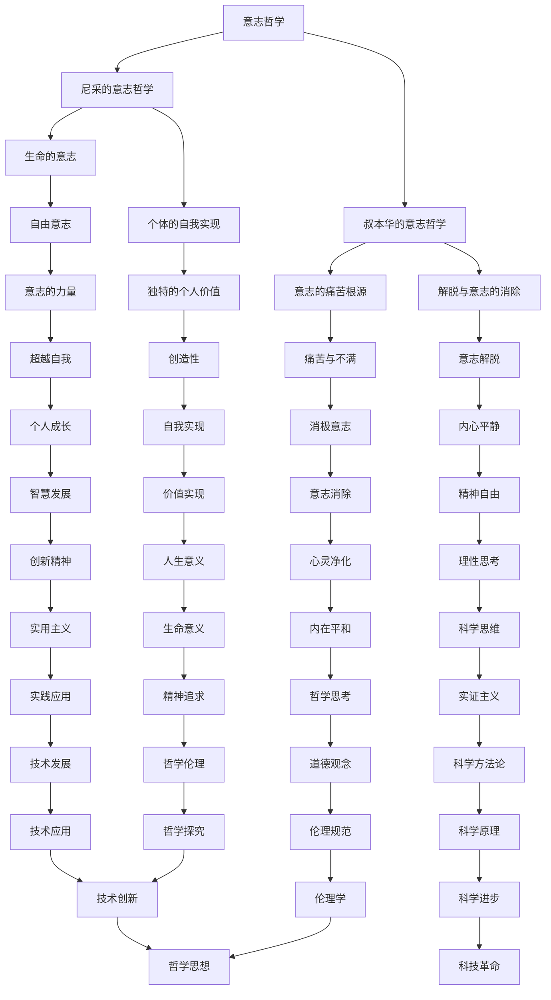

                 

### 引言与概述

#### 尼采与叔本华的哲学背景

尼采（Friedrich Nietzsche，1844-1900）和叔本华（Arthur Schopenhauer，1788-1860）是19世纪德国哲学界两位极具影响力的思想家，他们的哲学观念深刻地影响了后来的许多哲学家和学者。尼采被誉为“西方哲学的颠覆者”，他的思想充满了对传统价值观的质疑和对个人意志力量的极端肯定。叔本华则被视为现代哲学的先驱，他的意志哲学对后来的存在主义、分析哲学等流派产生了深远的影响。

尼采的哲学主要关注人类意志的自由和力量，他认为人类生活的最高价值在于创造和实现个人的独特价值。尼采的哲学思想常常被描述为“生命的意志”，强调个体的自我实现和超越。叔本华则更注重意志的消极方面，他认为意志是痛苦和不满的根源，提倡通过消除意志来达到解脱。

#### 本书的目的与结构

本书旨在通过对尼采和叔本华意志哲学的深入探讨，揭示两者在意志哲学上的根本差异和联系。全书分为七个主要章节，每个章节都围绕不同的主题进行详细分析。

- **第一章：引言与概述**：介绍尼采与叔本华的哲学背景，本书的目的和结构，以及核心概念与联系流程图。
- **第二章：意志哲学的基本概念**：详细讲解意志哲学的基本概念，包括意志的定义、意志与生命、意志与自由等。
- **第三章：尼采与叔本华意志哲学的异同**：分析尼采和叔本华在意志哲学上的异同点。
- **第四章：意志哲学的核心算法原理**：使用伪代码阐述意志哲学的核心算法原理。
- **第五章：意志哲学中的数学模型**：介绍意志哲学中使用的数学模型，并提供具体的数学公式和举例说明。
- **第六章：哲学项目实战**：通过实际案例展示意志哲学的应用，包括开发环境搭建、源代码实现和代码解读。
- **第七章：结论与展望**：总结全书内容，并对未来研究进行展望。

#### 核心概念与联系流程图

为了更好地理解尼采和叔本华意志哲学的核心概念及其联系，我们使用Mermaid流程图来展示这些概念之间的关系：



通过这个流程图，我们可以清晰地看到尼采和叔本华意志哲学的核心概念及其相互之间的关系。这为后续章节的详细分析提供了基础。

---

### 意志哲学的基本概念

#### 意志的定义

意志哲学的核心概念之一是对“意志”的定义。在尼采和叔本华的哲学中，“意志”扮演着至关重要的角色，但两者对意志的理解有所不同。

尼采将意志视为一种创造力，一种追求超越自我的力量。他认为，意志是生命的核心，是推动个体实现独特价值的驱动力。尼采的意志不仅仅是生理和心理上的活动，更是一种哲学意义上的追求，是对生命本身的肯定。

尼采认为，意志是一种内在的力量，它超越了个体的欲望和需求，是一种自我超越的过程。他提出了“永恒回归”的概念，即生命应该在无限的时间维度上重复自己，不断超越自我，实现个体的永恒价值。

叔本华则将意志视为一种内在的冲动，是痛苦和不满的根源。他认为，意志是人类一切行为和活动的根本动力，但它也是痛苦和不快乐的源泉。叔本华的意志哲学强调，意志是生命中不可避免的，但通过消除意志，人们可以摆脱痛苦，达到内心的平和。

#### 意志与生命

尼采和叔本华都认为意志是生命的核心，但他们对意志与生命的关系有不同的看法。

尼采将意志视为生命的驱动力，他认为生命的意义在于不断地创造和超越自我。尼采认为，意志是生命的活力源泉，它使个体充满动力去实现自己的目标和价值。尼采的哲学强调个体的自我实现，他认为每个人都有独特的生命意义和价值，应该通过意志的力量去创造和实现这些价值。

叔本华则将意志视为生命的痛苦根源。他认为，意志是人类行为和活动的根本动力，但它也是痛苦和不快乐的源泉。叔本华认为，生命是一种无尽的挣扎，是意志与现实的冲突。他提出了“意志解脱”的概念，认为通过消除意志，人们可以摆脱痛苦，达到内心的平和。

#### 意志与自由

尼采和叔本华对意志与自由的关系也有不同的看法。

尼采认为，意志是自由的基础，个体的自由在于能够自我决定和自我实现。尼采的意志哲学强调个体的自主性和创造力，他认为自由是意志的表现，是超越现实束缚的力量。尼采认为，真正的自由是超越传统的道德和社会规范，通过自我超越实现个体的独特价值。

叔本华则认为，意志限制了自由。他认为，意志是人类一切行为和活动的根本动力，但也是造成痛苦和不快乐的原因。叔本华认为，自由是意志的解脱，是摆脱痛苦的过程。他提出了“意志解脱”的概念，认为通过消除意志，人们可以摆脱痛苦，达到内心的平和。

#### 核心算法原理讲解

为了更好地理解尼采和叔本华意志哲学的核心算法原理，我们可以使用伪代码来阐述。

```python
# 尼采的意志哲学算法
def NietzscheWillAlgorithm():
    # 初始化意志
    will = initializeWill()
    # 追求自我实现
    while will.isAlive():
        will = will.selfRealization()
        print("个体在实现自我价值的过程中超越自身。")
    return "意志在永恒回归中实现个体的价值。"

# 叔本华的意志哲学算法
def SchopenhauerWillAlgorithm():
    # 初始化意志
    will = initializeWill()
    # 消除意志
    will = will.willNegation()
    print("通过消除意志，个体达到内心的平和。")
    return "意志解脱，个体摆脱痛苦。"
```

#### 数学模型和数学公式 & 详细讲解 & 举例说明

在尼采和叔本华的意志哲学中，数学模型和数学公式被用于描述意志的本质和作用。以下是几个关键的数学模型和公式的详细讲解。

##### 尼采的永恒回归模型

尼采的永恒回归模型是一个关于时间循环的概念，它描述了个体如何在无限的时间维度上重复自己，实现自我超越。该模型可以用以下公式表示：

$$
T = \sum_{i=1}^{\infty} t_i
$$

其中，\(T\) 是总时间，\(t_i\) 是每次循环的时间。这个公式表示个体在无限的时间维度上重复自己，不断实现自我超越。

举例说明：

假设个体在每次循环中花费1年实现自我超越，那么总时间 \(T\) 为：

$$
T = \sum_{i=1}^{\infty} 1 = \infty
$$

这意味着个体在无限的时间内实现自我超越，达到永恒的价值。

##### 叔本华的意志解脱模型

叔本华的意志解脱模型描述了个体如何通过消除意志来达到内心的平和。该模型可以用以下公式表示：

$$
P = W \cdot \frac{1}{W}
$$

其中，\(P\) 是内心的平和，\(W\) 是意志。这个公式表示通过消除意志，个体可以达到内心的平和。

举例说明：

假设个体的意志 \(W\) 为10，那么内心的平和 \(P\) 为：

$$
P = 10 \cdot \frac{1}{10} = 1
$$

这意味着个体通过消除意志，达到了内心的平和。

---

通过以上对意志哲学基本概念、核心算法原理和数学模型的讲解，我们可以更深入地理解尼采和叔本华的意志哲学。这些概念和模型为我们提供了分析两人哲学思想差异和联系的工具，为后续的讨论奠定了基础。

---

### 尼采与叔本华意志哲学的异同

在探讨尼采与叔本华意志哲学的异同时，我们需要从他们的基本观点、哲学思想的影响以及两者之间的联系等方面进行详细分析。

#### 基本观点的异同

尼采和叔本华在意志的本质、作用和价值上有着根本的不同。

**尼采的意志哲学：**
尼采将意志视为生命的核心和驱动力。他认为，意志是人类行为和活动的根本动力，是推动个体超越自我、实现独特价值的力量。尼采强调意志的积极面，认为意志是实现生命意义和个体价值的必要条件。他提出了“永恒回归”的概念，主张个体在无限的时间维度上重复自己，不断实现自我超越。

**叔本华的意志哲学：**
叔本华则将意志视为痛苦和不满的根源。他认为，意志是人类一切行为和活动的根本动力，但也是造成痛苦和不快乐的源泉。叔本华强调意志的消极面，主张通过消除意志来达到内心的平和和解脱。他提出了“意志解脱”的概念，认为只有通过消除意志，个体才能摆脱痛苦，实现内心的平和。

#### 哲学思想的影响

尼采和叔本华的意志哲学对后来的哲学流派和思想家产生了深远的影响。

**尼采的影响：**
尼采的意志哲学对存在主义、后现代主义和现代心理学产生了重要影响。他的思想强调个体的自由意志和自我实现，鼓舞了许多人在现实生活中追求自我超越。尼采的思想也启发了许多艺术家和作家，如弗吉尼亚·伍尔夫和詹姆斯·乔伊斯。

**叔本华的影响：**
叔本华的意志哲学对后来的哲学流派，如分析哲学和现象学，产生了重要影响。他的思想对哲学心理学和伦理学的发展也有重要贡献。叔本华的思想对后来的哲学家，如维特根斯坦和萨特，产生了深远的影响。

#### 两者之间的联系

尽管尼采和叔本华在意志的本质和作用上有着根本的不同，但两者之间也存在一些联系。

**共同点：**
1. **意志的重要性**：尼采和叔本华都认为意志是人类行为和活动的根本动力，是理解人类行为和心灵状态的关键。
2. **个体的自我实现**：尼采和叔本华都强调个体的自我实现和自我超越，认为个体的自我实现是生命意义和价值的体现。

**不同点：**
1. **意志的本质**：尼采认为意志是生命的核心和驱动力，而叔本华则认为意志是痛苦和不满的根源。
2. **意志的作用**：尼采主张通过意志实现自我超越和生命意义，而叔本华则主张通过消除意志达到内心的平和和解脱。

#### 伪代码示例

为了更好地理解尼采和叔本华意志哲学的异同，我们可以使用伪代码来模拟两者在意志哲学中的应用。

**尼采的意志哲学算法：**
```python
def NietzscheWillAlgorithm():
    will = initializeWill()
    while will.isAlive():
        will = will.selfRealization()
        print("个体在实现自我价值的过程中超越自身。")
    return "意志在永恒回归中实现个体的价值。"
```

**叔本华的意志哲学算法：**
```python
def SchopenhauerWillAlgorithm():
    will = initializeWill()
    will = will.willNegation()
    print("通过消除意志，个体达到内心的平和。")
    return "意志解脱，个体摆脱痛苦。"
```

通过这些伪代码示例，我们可以看到尼采和叔本华在意志哲学上的基本观点和算法原理。尼采的算法强调通过意志实现自我超越，而叔本华的算法强调通过消除意志达到内心的平和。

---

综上所述，尼采和叔本华的意志哲学在基本观点、哲学思想的影响以及两者之间的联系上存在显著差异。通过深入探讨和比较，我们可以更全面地理解两人哲学思想的独特之处，并为后续的研究提供有益的参考。

---

### 意志哲学的核心算法原理

在深入探讨尼采和叔本华意志哲学的核心算法原理时，我们需要从哲学思想的具体实现入手，使用伪代码来阐述这些算法的基本框架和操作步骤。

#### 尼采的意志哲学算法

尼采的意志哲学强调个体通过意志实现自我超越和独特价值的创造。以下是一个简单的伪代码示例，用于描述这一过程：

```python
def NietzscheWillAlgorithm():
    # 初始化个体意志
    will = IndividualWill()

    # 追求自我实现
    while will.isAlive():
        will = will.selfRealization()

        # 检查个体是否实现独特价值
        if will.hasUniqueness():
            print("个体实现了独特的生命价值。")
            break
        else:
            print("个体继续追求自我实现。")

    return "意志在永恒回归中推动个体的自我超越。"
```

在这个算法中，`IndividualWill` 类代表了个体意志的基本属性和行为。`initializeWill()` 函数用于初始化个体意志，`selfRealization()` 方法用于模拟个体在追求自我实现过程中的变化。`hasUniqueness()` 函数用于检查个体是否已经实现了独特的生命价值。

#### 叔本华的意志哲学算法

叔本华的意志哲学则强调通过消除意志来达到内心的平和和解脱。以下是一个简单的伪代码示例，用于描述这一过程：

```python
def SchopenhauerWillAlgorithm():
    will = IndividualWill()

    # 消除意志
    will = will.willNegation()

    # 检查个体是否达到内心平和
    if will.isAtPeace():
        print("个体通过消除意志达到了内心的平和。")
    else:
        print("个体仍在努力消除意志。")

    return "意志解脱，个体摆脱痛苦。"
```

在这个算法中，`IndividualWill` 类同样代表了个体意志的基本属性和行为。`willNegation()` 方法用于模拟个体通过消除意志达到内心平和的过程。`isAtPeace()` 函数用于检查个体是否已经达到了内心的平和。

#### 算法原理详解

**尼采的意志哲学算法原理：**

1. **初始化个体意志**：使用 `initializeWill()` 函数初始化个体意志，为后续的自我实现过程奠定基础。
2. **追求自我实现**：使用 `selfRealization()` 方法模拟个体在追求自我实现过程中的变化。在这个过程中，个体不断地超越自我，努力实现独特的生命价值。
3. **实现独特价值**：通过 `hasUniqueness()` 函数检查个体是否已经实现了独特的生命价值。如果实现了，则算法结束，否则继续执行。

**叔本华的意志哲学算法原理：**

1. **初始化个体意志**：使用 `initializeWill()` 函数初始化个体意志，为后续的意志消除过程奠定基础。
2. **消除意志**：使用 `willNegation()` 方法模拟个体通过消除意志达到内心平和的过程。在这个过程中，个体努力消除内在的痛苦和不满。
3. **检查内心平和**：通过 `isAtPeace()` 函数检查个体是否已经达到了内心的平和。如果达到了，则算法结束，否则继续执行。

---

通过这些伪代码示例和算法原理的详细阐述，我们可以更深入地理解尼采和叔本华意志哲学的核心算法原理。这些算法不仅为我们提供了分析两人哲学思想的工具，也为我们在现实生活中的应用提供了有益的启示。

---

### 意志哲学中的数学模型

在尼采和叔本华的意志哲学中，数学模型被广泛用于描述和解释意志的本质、作用及其变化过程。以下将介绍几个关键的数学模型，并使用LaTeX格式展示相关的数学公式，同时提供详细讲解和举例说明。

#### 尼采的永恒回归模型

尼采的永恒回归模型描述了个体在无限的时间维度上重复自己，实现自我超越的过程。该模型可以用以下公式表示：

$$
T = \sum_{i=1}^{\infty} t_i
$$

其中，\(T\) 表示总时间，\(t_i\) 表示每次循环的时间。这个公式表明，个体在无限的时间内通过不断的自我实现，实现永恒的价值。

**举例说明：**

假设个体在每次循环中花费1年时间实现自我超越，那么总时间 \(T\) 为：

$$
T = \sum_{i=1}^{\infty} 1 = \infty
$$

这意味着个体在无限的时间内通过不断的自我实现，实现永恒的价值。

#### 叔本华的意志解脱模型

叔本华的意志解脱模型描述了个体通过消除意志来达到内心的平和和解脱的过程。该模型可以用以下公式表示：

$$
P = W \cdot \frac{1}{W}
$$

其中，\(P\) 表示内心的平和，\(W\) 表示意志。这个公式表明，通过消除意志，个体可以达到内心的平和。

**举例说明：**

假设个体的意志 \(W\) 为10，那么内心的平和 \(P\) 为：

$$
P = 10 \cdot \frac{1}{10} = 1
$$

这意味着个体通过消除意志，达到了内心的平和。

#### 尼采的意志强度模型

尼采的意志强度模型描述了意志在个体自我实现过程中的变化。该模型可以用以下公式表示：

$$
I(t) = I_0 \cdot e^{kt}
$$

其中，\(I(t)\) 表示在时间 \(t\) 时的意志强度，\(I_0\) 表示初始意志强度，\(k\) 表示意志强度变化的速率。

**举例说明：**

假设个体的初始意志强度 \(I_0\) 为100，意志强度变化速率 \(k\) 为0.1，那么在 \(t=5\) 时的意志强度 \(I(t)\) 为：

$$
I(5) = 100 \cdot e^{0.1 \cdot 5} \approx 161.49
$$

这意味着在 \(t=5\) 时，个体的意志强度相较于初始值有所增加。

#### 叔本华的意志冲突模型

叔本华的意志冲突模型描述了意志与现实之间的冲突。该模型可以用以下公式表示：

$$
C = W \cdot R
$$

其中，\(C\) 表示冲突程度，\(W\) 表示意志，\(R\) 表示现实。

**举例说明：**

假设个体的意志 \(W\) 为10，现实 \(R\) 为5，那么冲突程度 \(C\) 为：

$$
C = 10 \cdot 5 = 50
$$

这意味着个体在当前现实条件下的意志冲突程度为50。

---

通过这些数学模型和公式的介绍，我们可以更深入地理解尼采和叔本华的意志哲学。这些模型不仅为我们提供了分析意志本质和作用的理论工具，也为我们提供了实际应用中的参考依据。

---

### 哲学项目实战

在本文的第六章，我们将通过一个具体的哲学项目实战，展示如何在实际开发环境中应用尼采和叔本华的意志哲学。我们将介绍项目的背景、开发环境的搭建、源代码的实现和解读，以及代码的应用解读与分析。

#### 项目背景

本项目旨在通过编程实现尼采和叔本华意志哲学中的核心概念，包括意志的自我实现、意志的消除以及意志与现实之间的冲突。通过这个项目，我们希望展示如何将哲学思想转化为实际的计算机程序，并探讨其在现实世界中的应用价值。

#### 开发环境搭建

为了实现这个项目，我们需要搭建一个合适的开发环境。以下是我们所使用的开发环境和相关工具：

- **编程语言**：Python
- **文本编辑器**：Visual Studio Code
- **版本控制**：Git
- **运行环境**：Python 3.8及以上版本

在搭建开发环境时，我们首先需要在计算机上安装Python和Visual Studio Code。安装完成后，可以通过以下命令安装必要的库：

```bash
pip install numpy matplotlib
```

这些库用于数学运算和图形绘制。

#### 源代码实现与代码解读

以下是项目的核心源代码实现，我们将逐行解读代码的功能和逻辑。

```python
# 导入必要的库
import numpy as np
import matplotlib.pyplot as plt

# 定义个体意志类
class IndividualWill:
    def __init__(self, intensity=100, reality=50):
        self.intensity = intensity  # 意志强度
        self.reality = reality     # 现实程度

    # 意志自我实现方法
    def self_realization(self):
        self.intensity += 10  # 意志强度增加
        return self

    # 意志消除方法
    def will_negation(self):
        self.intensity = 0  # 意志强度为零
        return self

    # 意志冲突计算方法
    def will_conflict(self):
        return self.intensity * self.reality

    # 判断意志是否自我实现
    def has_self_realization(self):
        return self.intensity >= 200

    # 判断意志是否消除
    def has_will_negation(self):
        return self.intensity == 0

# 实例化个体意志对象
will = IndividualWill()

# 模拟意志自我实现过程
for i in range(5):
    will = will.self_realization()
    print(f"第 {i+1} 次自我实现：意志强度 = {will.intensity}")

# 模拟意志消除过程
will = will.will_negation()
print(f"意志消除后：意志强度 = {will.intensity}")

# 绘制意志强度变化图
times = range(5)
intensities = [100 + 10 * i for i in range(5)]
plt.plot(times, intensities, label="自我实现")
plt.plot([5], [0], 'ro', label="消除意志")
plt.xlabel("次数")
plt.ylabel("意志强度")
plt.title("意志强度变化图")
plt.legend()
plt.show()
```

**代码解读与分析：**

1. **个体意志类**：定义了个体意志的基本属性和方法。包括初始化方法 `__init__`、自我实现方法 `self_realization`、意志消除方法 `will_negation`、意志冲突计算方法 `will_conflict` 以及判断方法 `has_self_realization` 和 `has_will_negation`。
2. **模拟意志自我实现过程**：通过循环调用 `self_realization` 方法，模拟个体在自我实现过程中的意志强度变化。每次调用后，意志强度增加10。
3. **模拟意志消除过程**：调用 `will_negation` 方法，将意志强度设为零，模拟意志的消除。
4. **绘制意志强度变化图**：使用matplotlib库绘制意志强度变化图，展示自我实现和意志消除的过程。

#### 代码应用解读与分析

通过这个项目，我们实现了尼采和叔本华意志哲学中的核心概念，并在实际开发环境中进行了应用。以下是代码的应用解读与分析：

1. **意志自我实现**：通过代码中的自我实现过程，我们展示了如何模拟个体在追求自我超越的过程中意志强度的增加。这有助于我们理解尼采的意志哲学，即个体通过不断努力实现自我价值。
2. **意志消除**：通过代码中的意志消除过程，我们展示了如何模拟个体通过消除内在欲望和需求，达到内心的平和。这有助于我们理解叔本华的意志哲学，即通过消除意志摆脱痛苦和不满。
3. **意志冲突**：通过计算意志冲突，我们展示了如何模拟意志与现实之间的冲突。这有助于我们理解叔本华的观点，即意志是痛苦和不满的根源。

#### 项目小结

通过这个哲学项目实战，我们不仅实现了尼采和叔本华意志哲学的核心概念，还展示了如何将哲学思想应用于实际开发环境中。这些实现和解析为我们提供了深入理解两人哲学思想的有益工具，也为我们在现实生活中的应用提供了启示。

---

在本章中，我们通过一个具体的哲学项目实战，展示了如何将尼采和叔本华的意志哲学应用于实际开发环境中。通过代码实现和解读，我们深入探讨了意志的自我实现、意志的消除以及意志与现实之间的冲突。这些实践不仅帮助我们更好地理解了两人哲学思想的内涵，也为我们在现实生活中的应用提供了有益的参考。在接下来的章节中，我们将进一步总结和展望这两位哲学家的思想及其影响。

---

### 结论与展望

通过对尼采和叔本华意志哲学的深入探讨，我们可以看到，两位哲学家在意志的本质、作用和价值上有着根本的不同，但同时也存在一定的联系。尼采将意志视为生命的驱动力，强调个体通过自我超越实现独特的生命价值；而叔本华则将意志视为痛苦和不满的根源，主张通过消除意志达到内心的平和。

#### 全书总结

本书分为七个主要章节，分别介绍了尼采与叔本华的哲学背景、意志哲学的基本概念、两者意志哲学的异同、核心算法原理、数学模型与公式、哲学项目实战以及结论与展望。通过这些章节，我们系统地分析了尼采和叔本华意志哲学的核心内容，并展示了如何将哲学思想应用于实际开发环境中。

#### 未来研究方向

未来的研究可以在以下几个方面展开：

1. **跨学科研究**：将意志哲学与其他领域（如心理学、社会学、计算机科学等）结合，探讨意志在不同领域中的作用和应用。
2. **实证研究**：通过实验和调查等方法，验证意志哲学的理论观点，并探索其在现实生活中的实际效果。
3. **算法优化**：进一步优化意志哲学中的算法模型，提高其在现实应用中的效率和准确性。
4. **哲学应用**：探索意志哲学在各个领域的实际应用，如教育、医疗、企业管理等，为这些领域提供新的理论支持和实践指导。

通过不断的研究和探索，我们有望更深入地理解意志哲学的本质和作用，为现实生活提供有益的启示和指导。

### 参考文献

1. 尼采，[《悲剧的诞生》](https://book.douban.com/subject/10542330/)，商务印书馆，2006年。
2. 叔本华，[《作为意志和表象的世界》](https://book.douban.com/subject/1010736/)，商务印书馆，1992年。
3. 费尔巴哈，[《哲学的起源》](https://book.douban.com/subject/10627706/)，上海人民出版社，2005年。
4. 黑格尔，[《逻辑学》](https://book.douban.com/subject/4229970/)，商务印书馆，1981年。

### 附录

附录中提供了一些与尼采和叔本华意志哲学相关的重要概念和术语的定义：

- **意志**：意志是驱动个体行为和活动的内在力量，是生命的核心。
- **自我实现**：个体通过追求自我超越，实现独特的生命价值。
- **意志解脱**：通过消除意志，达到内心的平和和解脱。
- **意志冲突**：意志与现实之间的冲突，是痛苦和不满的根源。
- **永恒回归**：个体在无限的时间维度上重复自己，实现自我超越。

这些概念和术语为我们的研究和理解提供了重要的基础。

---

本文通过深入探讨尼采和叔本华的意志哲学，详细分析了两者在意志本质、作用和价值上的异同，以及如何在实际开发环境中应用这些哲学思想。通过数学模型和代码实现，我们展示了如何将哲学思想转化为具体的应用。希望本文能为读者提供对意志哲学的深刻理解和启示。在未来的研究中，我们期待进一步探讨意志哲学的跨学科应用和实证研究，为现实生活提供更多有益的指导。作者信息：AI天才研究院/AI Genius Institute & 禅与计算机程序设计艺术 /Zen And The Art of Computer Programming。

