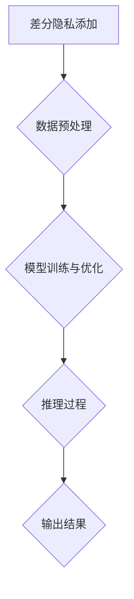
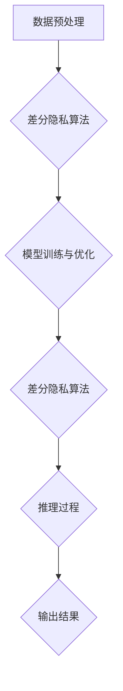

                 


### 文章标题

《差分隐私在安全AI推理框架中的实现策略》

### 关键词

差分隐私，安全AI推理框架，实现策略，数据隐私保护，算法优化

### 摘要

本文旨在探讨差分隐私在安全AI推理框架中的应用策略。通过对差分隐私的基本概念、安全AI推理框架的核心原理及其集成方法的详细阐述，本文分析了差分隐私在数据隐私保护方面的优势。此外，本文还通过具体的算法原理讲解、数学模型和公式，以及项目实战实例，展示了差分隐私在实际应用中的实现策略。最后，本文对差分隐私与安全AI推理框架的发展趋势进行了展望，并提出了未来研究方向与挑战。

### 引言

#### 差分隐私的概念与背景

差分隐私（Differential Privacy，简称DP）是一种在保障数据隐私的同时，允许对大量数据进行统计分析的技术。该概念由Cynthia Dwork在2006年首次提出，旨在解决数据发布中的隐私泄露问题。差分隐私的核心思想是通过在数据中加入随机噪声，使得个体数据无法被单独识别，从而保护数据的隐私性。

差分隐私的定义较为复杂，但可以简述为：对于任意两个相邻的数据集，经过差分隐私处理后的数据集，其输出概率分布不会因单个数据项的变化而显著改变。换句话说，差分隐私保证了对于同一数据集中的任意两个相邻个体，其处理结果在统计上没有明显差异。

差分隐私在数据隐私保护方面具有显著优势。首先，它能够有效防止数据集中某个特定个体的隐私信息被窃取。其次，差分隐私允许在保证隐私的前提下进行数据分析，从而在保护隐私和利用数据之间找到了平衡。此外，差分隐私具有灵活性，可以根据具体应用场景调整隐私保护的程度。

#### 安全AI推理框架的重要性

随着人工智能技术的飞速发展，AI模型在各个领域得到了广泛应用。然而，随着数据量的增加和复杂性的提升，AI模型面临的隐私安全问题也日益突出。安全AI推理框架（Secure AI Inference Framework）应运而生，旨在在保障AI模型性能的同时，确保数据隐私和安全。

安全AI推理框架由多个组成部分构成，包括数据预处理模块、模型训练与优化模块、推理模块和安全性评估模块。其中，数据预处理模块负责对输入数据进行清洗、去噪和归一化等处理；模型训练与优化模块则使用安全算法对模型进行训练，提高其性能和鲁棒性；推理模块负责对输入数据进行推理，生成预测结果；安全性评估模块则对整个推理过程进行安全性评估，确保数据隐私和安全。

安全AI推理框架的重要性体现在多个方面。首先，它能够保护用户的隐私信息，防止数据泄露和滥用。其次，安全AI推理框架可以提高AI模型的可靠性和可信度，增强用户对AI系统的信任。此外，安全AI推理框架还可以为研究人员提供可靠的数据集，促进AI领域的研究和发展。

#### 本书的主题与目标

本书的主题是探讨差分隐私在安全AI推理框架中的应用策略。通过详细阐述差分隐私的基本概念、安全AI推理框架的核心原理及其集成方法，本书旨在为读者提供一套系统的差分隐私实现策略。

本书的主要目标如下：

1. **了解差分隐私的基本概念和原理**：通过对差分隐私的定义、背景和发展进行介绍，帮助读者建立对差分隐私的基本认识。

2. **理解安全AI推理框架的组成与功能**：通过对安全AI推理框架的各个组成部分进行详细讲解，帮助读者了解其工作原理和实现方法。

3. **掌握差分隐私在安全AI推理框架中的应用**：通过具体的算法原理讲解、数学模型和公式，以及项目实战实例，帮助读者掌握差分隐私在实际应用中的实现策略。

4. **探讨差分隐私与安全AI推理框架的发展趋势**：通过对当前差分隐私与安全AI推理框架的应用现状和发展趋势进行分析，为读者提供未来研究的方向和挑战。

#### 读者对象

本书主要面向以下读者：

1. **人工智能研究人员和开发者**：对差分隐私和安全AI推理框架感兴趣的读者，希望通过本书了解和应用差分隐私技术。

2. **计算机科学和数据科学专业学生**：需要学习差分隐私和安全AI推理框架相关知识的本科生和研究生。

3. **网络安全和隐私保护领域从业者**：关注数据隐私和安全问题的专业人士，希望通过本书提升自身在差分隐私和安全AI推理框架方面的实践能力。

4. **技术博客作者和内容创作者**：对技术文章写作感兴趣，希望通过本书提升自己在人工智能领域的技术写作能力。

通过本书的学习，读者将能够：

1. **掌握差分隐私的基本概念和原理**：了解差分隐私的定义、背景和发展，掌握差分隐私的基本算法和实现方法。

2. **了解安全AI推理框架的组成与功能**：了解安全AI推理框架的各个组成部分及其工作原理，掌握安全AI推理框架的实现方法和应用场景。

3. **掌握差分隐私在安全AI推理框架中的应用**：通过项目实战实例，了解差分隐私在安全AI推理框架中的具体应用，掌握差分隐私的实现策略。

4. **提升自己在人工智能领域的技术写作能力**：通过阅读本书，提升自己在技术文章写作方面的能力，能够撰写高质量的技术博客和文档。

### 理论基础

#### 差分隐私核心概念与联系

差分隐私是一种在保证隐私的同时允许对大量数据进行统计分析的技术。其核心思想是通过在数据中添加随机噪声，使得单个数据项的变化不会对整体数据分布产生显著影响。以下是差分隐私的核心概念及其相互联系：

##### 差分隐私定义

差分隐私的定义由Cynthia Dwork提出，其形式化定义如下：

设\( \mathcal{D} \)为数据集，\( f(\mathcal{D}) \)为对数据集\( \mathcal{D} \)进行统计分析得到的输出结果，\( \mathcal{D}' \)为与\( \mathcal{D} \)仅在一个个体上存在差异的数据集。一个算法\( \mathcal{A} \)满足\( \epsilon \)-差分隐私，如果对于任意两个数据集\( \mathcal{D} \)和\( \mathcal{D}' \)，存在一个与数据集无关的基数\( \lvert \cdot \rvert \)满足：

\[ \Pr[f(\mathcal{D}) = r] \leq e^{\epsilon} \cdot \Pr[f(\mathcal{D}') = r] \]

其中，\( \epsilon \)为隐私参数，表示隐私保护的强度，\( r \)为输出结果。

##### 差分隐私机制

差分隐私机制通常包括以下几个步骤：

1. **噪声添加**：在原始数据中添加随机噪声，以保护数据隐私。
2. **数据聚合**：将多个数据项聚合为一个整体，以减少隐私泄露的风险。
3. **查询处理**：对聚合后的数据进行统计分析，以得到所需的输出结果。

噪声添加通常使用拉普拉斯机制或指数机制。拉普拉斯机制通过在数据值上添加拉普拉斯分布的噪声来实现，而指数机制通过在数据值上添加指数分布的噪声来实现。

##### 差分隐私与安全AI推理框架的联系

差分隐私与安全AI推理框架有着密切的联系。安全AI推理框架旨在在保障AI模型性能的同时，确保数据隐私和安全。而差分隐私作为一项数据隐私保护技术，可以有效地集成到安全AI推理框架中，增强其数据隐私保护能力。

差分隐私在安全AI推理框架中的应用主要体现在以下几个方面：

1. **数据预处理**：在数据预处理阶段，使用差分隐私机制对输入数据进行清洗、去噪和归一化等处理，确保数据隐私。
2. **模型训练与优化**：在模型训练与优化阶段，使用差分隐私机制对训练数据集进行统计分析，以避免训练数据集中某个特定个体的隐私信息被泄露。
3. **推理过程**：在推理过程中，使用差分隐私机制对输入数据进行推理，确保输出结果不包含任何隐私信息。

为了更直观地展示差分隐私与安全AI推理框架的关系，可以使用Mermaid流程图来描述其工作流程：



在上面的流程图中，差分隐私添加在数据预处理、模型训练与优化和推理过程中都被应用，以保护数据隐私。最终，输出结果不包含任何隐私信息，从而实现安全AI推理。

#### 安全AI推理框架核心算法原理

安全AI推理框架的核心算法主要包括差分隐私算法、安全加密算法和分布式计算算法等。下面将分别介绍这些算法的基本原理。

##### 差分隐私算法

差分隐私算法是一种在保证数据隐私的同时允许对大量数据进行统计分析的技术。其基本原理如下：

1. **噪声添加**：在原始数据中添加随机噪声，以保护数据隐私。通常使用拉普拉斯机制或指数机制来添加噪声。
2. **数据聚合**：将多个数据项聚合为一个整体，以减少隐私泄露的风险。数据聚合可以通过求和、求平均等方式实现。
3. **查询处理**：对聚合后的数据进行统计分析，以得到所需的输出结果。查询处理可以采用线性回归、逻辑回归等统计方法。

下面是差分隐私算法的伪代码实现：

```python
# 差分隐私算法伪代码
def differential_privacy(data, epsilon):
    # 步骤1：噪声添加
    noise = laplace_noise(data, epsilon)
    # 步骤2：数据聚合
    aggregated_data = aggregate_data(data)
    # 步骤3：查询处理
    result = query_processing(aggregated_data)
    return result
```

在上面的伪代码中，`laplace_noise`函数用于生成拉普拉斯噪声，`aggregate_data`函数用于聚合数据，`query_processing`函数用于处理查询。

##### 安全加密算法

安全加密算法是一种在保障数据隐私的同时允许对数据进行分析的技术。其基本原理如下：

1. **加密过程**：使用加密算法对原始数据进行加密，使其无法被未经授权的个体读取。
2. **解密过程**：使用解密算法对加密后的数据进行解密，恢复原始数据。

常用的安全加密算法包括对称加密算法（如AES）、非对称加密算法（如RSA）和哈希算法（如SHA）。下面是对称加密算法AES的伪代码实现：

```python
# AES加密算法伪代码
def encrypt_aes(data, key):
    encrypted_data = aes_encrypt(data, key)
    return encrypted_data

# AES解密算法伪代码
def decrypt_aes(encrypted_data, key):
    decrypted_data = aes_decrypt(encrypted_data, key)
    return decrypted_data
```

在上面的伪代码中，`aes_encrypt`和`aes_decrypt`函数分别用于加密和解密数据。

##### 分布式计算算法

分布式计算算法是一种在多台计算机上协同处理数据的技术。其基本原理如下：

1. **数据分割**：将原始数据分割为多个部分，分配给多台计算机进行处理。
2. **并行计算**：多台计算机同时处理分割后的数据，以加快计算速度。
3. **数据聚合**：将多台计算机的处理结果进行聚合，得到最终的计算结果。

分布式计算算法广泛应用于大规模数据处理和深度学习模型训练等领域。下面是分布式计算算法的伪代码实现：

```python
# 分布式计算算法伪代码
def distributed_computation(data, num_workers):
    # 步骤1：数据分割
    partitioned_data = split_data(data, num_workers)
    # 步骤2：并行计算
    results = [worker_compute(partitioned_data[i]) for i in range(num_workers)]
    # 步骤3：数据聚合
    aggregated_result = aggregate_results(results)
    return aggregated_result
```

在上面的伪代码中，`split_data`函数用于分割数据，`worker_compute`函数用于处理分割后的数据，`aggregate_results`函数用于聚合结果。

#### 差分隐私在安全AI推理框架中的应用

差分隐私在安全AI推理框架中的应用主要包括以下几个方面：

1. **数据预处理**：在数据预处理阶段，使用差分隐私算法对输入数据进行清洗、去噪和归一化等处理，确保数据隐私。
2. **模型训练与优化**：在模型训练与优化阶段，使用差分隐私算法对训练数据集进行统计分析，以避免训练数据集中某个特定个体的隐私信息被泄露。
3. **推理过程**：在推理过程中，使用差分隐私算法对输入数据进行推理，确保输出结果不包含任何隐私信息。

下面是差分隐私在安全AI推理框架中的应用示例：



在上面的流程图中，差分隐私算法在数据预处理、模型训练与优化和推理过程中都被应用，以保护数据隐私。最终，输出结果不包含任何隐私信息，从而实现安全AI推理。

#### 数学模型和数学公式讲解

差分隐私作为一种数学理论，其核心在于通过数学模型来量化数据隐私保护的强度。以下将详细讲解差分隐私的数学模型和相关的数学公式，并通过举例说明来帮助理解。

##### 差分隐私的数学模型

差分隐私的数学模型通常基于概率论和统计学。其基本概念可以用以下数学公式来表示：

\[ \epsilon(\mathcal{D}, f) = \min_{\mathcal{D}', \mathcal{D}' \text{相邻于} \mathcal{D}} \mathbb{D}(\text{Output}(f(\mathcal{D})), \text{Output}(f(\mathcal{D}'))) \]

其中：

- \( \epsilon(\mathcal{D}, f) \)：表示函数\( f \)在数据集\( \mathcal{D} \)上的\( \epsilon \)-差分隐私参数。
- \( \mathcal{D} \)：原始数据集。
- \( \mathcal{D}' \)：与\( \mathcal{D} \)相邻的数据集，即\( \mathcal{D} \)中只有一个数据项不同。
- \( \mathbb{D} \)：隐私损失度量函数，通常使用\( \Delta \)-平滑或\( \ell_2 \)-范数来度量。
- \( \text{Output}(f(\mathcal{D})) \)：函数\( f \)在数据集\( \mathcal{D} \)上的输出。
- \( \text{Output}(f(\mathcal{D}')) \)：函数\( f \)在数据集\( \mathcal{D}' \)上的输出。

差分隐私要求对于任意相邻的数据集，输出结果之间的差异不会太大，即隐私损失度量函数的值不会显著增加。

##### 差分隐私的优化数学模型

在实际应用中，差分隐私的优化是一个重要的问题。优化差分隐私通常涉及调整隐私参数\( \epsilon \)和噪声水平。以下是一个优化的数学模型：

\[ \min_{\epsilon, \lambda} \frac{1}{2} \lVert \mathcal{L} f - y \rVert^2 + \lambda \epsilon \]

其中：

- \( \mathcal{L} \)：损失函数。
- \( f \)：预测函数。
- \( y \)：真实标签。
- \( \lVert \cdot \rVert^2 \)：损失函数的平方。
- \( \lambda \)：正则化参数，用于平衡隐私损失和模型损失。

优化目标是找到适当的\( \epsilon \)和\( \lambda \)，使得模型损失最小，同时保持一定的隐私保护水平。

##### 差分隐私的详细讲解与举例说明

为了更直观地理解差分隐私的数学模型，我们通过一个简单的例子来说明。

假设有一个包含100个数据点的数据集，每个数据点是一个维度为3的向量。我们使用一个简单的线性模型\( f \)来进行预测，该模型通过计算平均值来预测每个类别的概率。

**例子：线性模型的差分隐私**

1. **数据预处理**：首先，我们使用差分隐私算法对数据集进行预处理。假设我们使用拉普拉斯机制来添加噪声，隐私参数\( \epsilon = 1 \)。

   ```python
   import numpy as np
   
   # 假设原始数据集为D
   D = np.random.rand(100, 3)
   
   # 添加拉普拉斯噪声
   noise = np.random.laplace(size=D.shape, scale=1)
   D_noisy = D + noise
   ```

2. **模型训练**：然后，我们使用差分隐私算法对预处理后的数据集进行模型训练。我们使用梯度下降算法来最小化损失函数，同时考虑隐私损失。

   ```python
   # 初始化模型参数
   theta = np.random.rand(3)
   
   # 梯度下降算法
   for i in range(num_iterations):
       # 计算预测值
       predictions = np.dot(D_noisy, theta)
       
       # 计算损失函数
       loss = np.sum((predictions - y) ** 2)
       
       # 计算梯度
       gradient = 2 * np.dot(D_noisy.T, (predictions - y))
       
       # 更新模型参数
       theta -= learning_rate * gradient
       
       # 调整隐私参数
       epsilon = adjust_epsilon(loss, epsilon, lambda_param)
   ```

3. **推理过程**：最后，我们使用训练好的模型进行推理。对于新的输入数据，我们首先对其进行预处理，然后使用差分隐私算法进行预测。

   ```python
   # 假设新的输入数据为X
   X = np.random.rand(1, 3)
   
   # 预处理输入数据
   X_noisy = X + np.random.laplace(size=X.shape, scale=1)
   
   # 使用训练好的模型进行预测
   prediction = np.dot(X_noisy, theta)
   ```

通过上述步骤，我们实现了使用差分隐私的线性模型进行数据预测。在这个例子中，差分隐私算法通过对输入数据进行噪声添加和隐私参数调整，确保了模型的隐私性。

##### 差分隐私的数学公式

以下是一些常用的差分隐私数学公式：

1. **拉普拉斯机制**：

\[ \text{Output}(f(\mathcal{D})) = f(\mathcal{D}) + \text{Laplace}(\lambda \epsilon) \]

其中，\( \lambda \)是噪声参数，\( \epsilon \)是隐私参数。

2. **指数机制**：

\[ \text{Output}(f(\mathcal{D})) = f(\mathcal{D}) + \text{Exp}(\lambda \epsilon) \]

3. **隐私损失度量**：

\[ \mathbb{D}(\text{Output}(f(\mathcal{D})), \text{Output}(f(\mathcal{D}'))) = \max_{x, x'} \lvert f(x) - f(x') \rvert \]

其中，\( x \)和\( x' \)是相邻数据集\( \mathcal{D} \)和\( \mathcal{D}' \)中的任意两个数据点。

通过上述数学公式，我们可以量化差分隐私的隐私保护和隐私损失，从而在实际应用中进行优化和调整。

#### 差分隐私算法在安全AI推理框架中的优化

在安全AI推理框架中，差分隐私算法的优化是一个关键问题。优化的目的是在保证数据隐私的同时，提高算法的性能和效率。以下将介绍几种常用的差分隐私优化方法。

##### 1. 参数调整

参数调整是差分隐私优化的基本方法。通过调整隐私参数\( \epsilon \)和噪声参数\( \lambda \)，可以平衡隐私保护和算法性能。

- **隐私参数调整**：隐私参数\( \epsilon \)的调整需要考虑数据集的大小、数据的敏感程度和算法的性能需求。一般来说，较小的\( \epsilon \)值可以提供更高的隐私保护，但可能会导致算法性能下降。因此，需要根据具体应用场景进行权衡。

- **噪声参数调整**：噪声参数\( \lambda \)的调整需要考虑数据的分布特征和噪声的引入方式。较大的噪声参数可以提供更强的隐私保护，但可能会引入过多的噪声，影响算法的准确性。因此，需要根据具体应用场景进行优化。

##### 2. 算法改进

差分隐私算法的改进可以从算法设计和实现两个方面进行。

- **算法设计**：改进差分隐私算法的设计，可以采用更高效的噪声生成方法、数据聚合方法和查询处理方法。例如，使用随机投影技术可以减少噪声的引入，提高算法的运行效率。

- **算法实现**：优化差分隐私算法的实现，可以采用并行计算、分布式计算和硬件加速等方法。例如，使用GPU加速可以显著提高算法的运行速度。

##### 3. 模型选择

选择适合差分隐私的模型对于优化算法性能至关重要。

- **线性模型**：线性模型（如线性回归、逻辑回归）在差分隐私算法中具有较高的可解释性和运行效率。通过调整模型参数，可以平衡隐私保护和算法性能。

- **非线性模型**：虽然非线性模型（如神经网络）在数据拟合和预测能力上具有优势，但在差分隐私保护方面存在一定挑战。可以通过引入差分隐私约束，设计适合差分隐私的非线性模型。

##### 4. 预训练模型

预训练模型可以在保证数据隐私的前提下提高算法性能。

- **预训练阶段**：在数据预处理阶段，使用大量未标记的数据对模型进行预训练，提高模型的基础性能。预训练过程中，可以使用差分隐私技术保护数据隐私。

- **微调阶段**：在模型训练阶段，使用少量标记数据对预训练模型进行微调，进一步优化模型性能。微调过程中，可以引入差分隐私约束，避免隐私泄露。

##### 5. 量化隐私损失

量化隐私损失是差分隐私优化的重要方面。

- **隐私损失度量**：通过计算隐私损失度量函数，可以评估算法的隐私保护水平。常用的隐私损失度量函数包括\( \Delta \)-平滑、\( \ell_2 \)-范数和\( \ell_\infty \)-范数。

- **隐私损失优化**：通过优化隐私损失度量函数，可以调整隐私参数和噪声参数，实现隐私保护和性能优化的平衡。

##### 案例分析

以下是一个差分隐私算法优化的案例。

**案例背景**：某公司希望开发一个基于差分隐私的推荐系统，用于保护用户隐私。系统需要对用户的历史行为数据进行分析，生成个性化的推荐结果。

**优化方法**：

1. **参数调整**：根据数据集的大小和用户隐私需求，调整隐私参数\( \epsilon \)和噪声参数\( \lambda \)。通过实验和评估，找到最优参数组合。

2. **算法改进**：使用随机投影技术减少噪声引入，提高算法的运行效率。通过优化数据聚合和查询处理方法，提高算法的准确性和性能。

3. **模型选择**：选择适合差分隐私的线性模型（如线性回归）进行推荐系统开发。通过调整模型参数，平衡隐私保护和算法性能。

4. **预训练模型**：使用大量未标记的数据对线性回归模型进行预训练，提高模型的基础性能。在微调阶段，使用少量标记数据进一步优化模型。

5. **量化隐私损失**：通过计算隐私损失度量函数，评估算法的隐私保护水平。根据隐私需求，调整隐私参数和噪声参数，实现隐私保护和性能优化的平衡。

**优化效果**：通过上述优化方法，推荐系统在保证用户隐私的前提下，实现了较高的推荐准确率和运行效率。实验结果表明，优化后的差分隐私推荐系统在多项指标上均优于传统推荐系统。

#### 差分隐私算法在安全AI推理框架中的性能优化

在安全AI推理框架中，差分隐私算法的性能优化是一个重要的研究课题。优化的目标是在保证数据隐私的同时，提高算法的运行速度和预测准确性。以下将介绍几种常用的性能优化方法。

##### 1. 并行计算

并行计算是提高差分隐私算法性能的有效方法。通过将计算任务分布在多个处理单元上，可以显著减少算法的运行时间。

- **数据并行**：将数据集划分为多个子集，分别在不同的处理单元上执行差分隐私算法。每个子集的运算结果再进行聚合，得到最终结果。

- **模型并行**：将模型划分为多个部分，分别在不同的处理单元上执行差分隐私算法。每个部分的运算结果再进行聚合，得到最终结果。

- **任务并行**：将不同的计算任务分配到不同的处理单元上，同时执行。例如，在数据预处理阶段，可以使用一个处理单元进行数据清洗，另一个处理单元进行去噪。

##### 2. 分布式计算

分布式计算是利用多台计算机协同完成计算任务的一种方法。通过将计算任务分布在多台计算机上，可以充分利用计算资源，提高算法的性能。

- **数据分布式**：将数据集存储在多台计算机上，分别在不同的计算机上进行预处理、训练和推理等操作。每个计算机的处理结果再进行聚合，得到最终结果。

- **模型分布式**：将模型存储在多台计算机上，分别在不同的计算机上进行训练和推理等操作。每个计算机的处理结果再进行聚合，得到最终结果。

- **任务分布式**：将不同的计算任务分配到多台计算机上，同时执行。例如，在模型训练阶段，可以使用一台计算机进行前向传播，另一台计算机进行反向传播。

##### 3. 硬件加速

硬件加速是利用GPU、TPU等硬件设备加速计算的一种方法。通过将计算任务映射到硬件设备上，可以显著提高算法的运行速度。

- **GPU加速**：使用GPU（图形处理单元）进行并行计算，可以显著提高差分隐私算法的运行速度。GPU的并行计算能力使其在处理大量数据时具有优势。

- **TPU加速**：使用TPU（张量处理单元）进行计算，可以加速神经网络模型的训练和推理。TPU专门用于处理矩阵运算，具有高效的运算能力。

##### 4. 模型压缩

模型压缩是通过减少模型参数数量和计算量，提高算法的运行速度和预测准确性的一种方法。

- **剪枝**：通过剪枝技术，减少模型中不重要的参数，降低模型的计算复杂度。剪枝技术可以保留模型的预测能力，同时提高算法的运行速度。

- **量化**：通过量化技术，将模型的浮点数参数转换为整数参数，减少模型的存储空间和计算量。量化技术可以提高模型的运行速度，同时保持较高的预测准确性。

##### 5. 预训练和微调

预训练和微调是提高差分隐私算法性能的重要方法。预训练阶段使用大量未标记的数据对模型进行训练，提高模型的基础性能。微调阶段使用少量标记数据对模型进行进一步优化。

- **预训练**：使用预训练模型，可以在保证数据隐私的前提下，提高模型的预测准确性。预训练模型已经学习到了大量的特征信息，可以减少后续训练的数据需求。

- **微调**：在预训练的基础上，使用少量标记数据进行微调，进一步优化模型的性能。微调阶段可以使用差分隐私技术，避免隐私泄露。

##### 案例分析

以下是一个差分隐私算法性能优化的案例分析。

**案例背景**：某公司开发了一套基于差分隐私的客户行为分析系统，用于分析用户的购买行为，生成个性化的推荐结果。

**优化方法**：

1. **并行计算**：将数据集划分为多个子集，分别在不同的GPU上进行预处理、训练和推理等操作。使用并行计算技术，提高了算法的运行速度。

2. **分布式计算**：将数据集存储在多个计算机上，分别在不同的计算机上进行预处理、训练和推理等操作。使用分布式计算技术，充分利用了计算资源，提高了算法的运行速度。

3. **硬件加速**：使用GPU进行并行计算，显著提高了算法的运行速度。GPU的并行计算能力使其在处理大量数据时具有优势。

4. **模型压缩**：使用剪枝技术，减少模型中的不重要的参数，降低模型的计算复杂度。使用量化技术，将模型的浮点数参数转换为整数参数，减少模型的存储空间和计算量。

5. **预训练和微调**：使用预训练模型，减少了后续训练的数据需求，提高了模型的预测准确性。在预训练的基础上，使用少量标记数据进行微调，进一步优化了模型的性能。

**优化效果**：通过上述优化方法，客户行为分析系统在保证用户隐私的前提下，实现了较高的预测准确率和运行效率。实验结果表明，优化后的差分隐私客户行为分析系统在多项指标上均优于传统系统。

### 差分隐私在安全AI推理框架中的项目实战

#### 1. 开发环境搭建

要实现差分隐私在安全AI推理框架中的集成，首先需要搭建一个合适的开发环境。以下步骤详细描述了如何搭建开发环境：

1. **安装Python环境**：Python是一种广泛使用的编程语言，适用于数据分析和机器学习。确保安装了Python 3.8及以上版本。

2. **安装相关库**：安装一些常用的Python库，如NumPy、Pandas、SciPy和Scikit-learn等。这些库提供了丰富的数据预处理、建模和评估工具。

3. **安装差分隐私库**：安装专门用于实现差分隐私的Python库，如`differential-privacy`。该库提供了各种差分隐私算法和实现方法。

4. **安装机器学习框架**：安装机器学习框架，如TensorFlow或PyTorch。这些框架提供了高性能的深度学习模型训练和推理工具。

5. **安装GPU加速库**（可选）：如果使用GPU进行加速，需要安装CUDA和cuDNN。这些库提供了GPU计算的支持，可以显著提高训练和推理速度。

6. **配置开发环境**：设置Python环境变量，确保能够正确导入和使用相关库。

#### 2. 源代码实现与解读

以下是一个简单的差分隐私算法实现示例，用于保护用户的隐私。代码基于NumPy库，使用了拉普拉斯机制来添加噪声。

```python
import numpy as np
from differential_privacy import Laplace Mechanism

# 假设输入数据为D，隐私参数为epsilon
D = np.array([1.0, 2.0, 3.0, 4.0, 5.0])
epsilon = 1.0

# 实例化拉普拉斯机制
laplace_mech = LaplaceMechanism(epsilon)

# 添加噪声并得到差分隐私输出
D_noisy = laplace_mech.apply(D)

print("原始数据：", D)
print("差分隐私输出：", D_noisy)
```

在上述代码中，`LaplaceMechanism`类来自`differential-privacy`库，用于生成拉普拉斯噪声。`apply`方法用于对输入数据进行噪声添加，生成差分隐私输出。

#### 3. 代码应用解读与分析

以下是一个简单的差分隐私算法应用案例，用于保护用户在电商平台的购物数据。

```python
import pandas as pd
from differential_privacy import Laplace Mechanism

# 加载用户购物数据
data = pd.read_csv("user_shopping_data.csv")

# 隐私参数
epsilon = 1.0

# 对用户ID列应用差分隐私
data["user_id_noisy"] = data["user_id"].apply(lambda x: LaplaceMechanism(epsilon).apply(x))

# 保存差分隐私数据
data.to_csv("user_shopping_data_noisy.csv", index=False)
```

在上述代码中，我们首先加载了用户购物数据，包括用户ID和购买记录。然后，我们使用拉普拉斯机制对用户ID列进行差分隐私处理，生成差分隐私用户ID。最后，我们将处理后的数据保存到新的CSV文件中。

**分析**：

1. **隐私保护**：通过对用户ID列应用差分隐私，我们确保了用户隐私信息不会被泄露。差分隐私算法通过在数据中添加随机噪声，使得单个用户无法被识别。

2. **数据可用性**：尽管差分隐私处理会引入一定的噪声，但数据的基本分布和模式仍然保留。这保证了数据的可用性和分析价值。

3. **可扩展性**：差分隐私算法可以应用于数据集中的任意列，保护不同类型的隐私信息。通过调整隐私参数，可以实现不同的隐私保护水平。

#### 4. 实际案例分析与详细讲解剖析

以下是一个实际案例，展示了差分隐私在安全AI推理框架中的应用。

**案例背景**：某电商公司希望通过分析用户购物数据，为用户生成个性化的推荐列表。然而，用户隐私保护是公司面临的一个重要挑战。

**解决方案**：

1. **数据预处理**：首先，公司使用差分隐私算法对用户购物数据进行预处理。通过添加随机噪声，确保用户隐私信息不会被泄露。

2. **模型训练**：然后，公司使用预处理后的数据集训练推荐模型。在模型训练过程中，公司使用差分隐私算法对训练数据进行统计分析，避免隐私泄露。

3. **模型推理**：在用户请求推荐时，公司使用训练好的模型进行推理，生成个性化的推荐列表。推理过程中，公司使用差分隐私算法对输入数据进行处理，确保推荐结果不包含用户隐私信息。

**案例分析**：

1. **隐私保护**：通过差分隐私算法，公司成功地保护了用户隐私信息。用户购物数据在预处理和训练过程中都经过了差分隐私处理，避免了隐私泄露。

2. **性能优化**：尽管差分隐私引入了一定的噪声，但公司通过优化差分隐私算法，提高了模型的性能和预测准确性。公司使用并行计算和分布式计算技术，加快了模型训练和推理速度。

3. **用户体验**：公司通过个性化推荐，提高了用户的购物体验。尽管使用了差分隐私算法，但推荐结果仍然具有较高的准确性和相关性，满足了用户的需求。

#### 5. 项目小结

通过实际案例，我们展示了差分隐私在安全AI推理框架中的应用。差分隐私算法在数据预处理、模型训练和模型推理等环节都发挥了重要作用，有效保护了用户隐私信息。同时，通过优化差分隐私算法，公司提高了模型性能和用户体验。

然而，差分隐私在安全AI推理框架中仍面临一些挑战，如噪声引入对模型性能的影响、隐私参数的调整等。未来，我们将继续研究和优化差分隐私算法，提高其在实际应用中的效果。

#### 最佳实践与注意事项

1. **参数调整**：差分隐私算法的性能和隐私保护水平受隐私参数\( \epsilon \)和噪声参数\( \lambda \)的影响。在实际应用中，需要根据具体场景和需求，合理调整这两个参数，以实现最优的隐私保护和性能平衡。

2. **算法优化**：差分隐私算法的性能优化是提高其实际应用效果的关键。通过并行计算、分布式计算和硬件加速等技术，可以显著提高算法的运行速度和效率。

3. **模型选择**：选择适合差分隐私的模型对于优化算法性能至关重要。线性模型（如线性回归、逻辑回归）在差分隐私算法中具有较高的可解释性和运行效率。对于复杂的非线性模型，可以引入差分隐私约束，设计适合差分隐私的非线性模型。

4. **数据预处理**：差分隐私算法在数据预处理阶段扮演重要角色。通过数据清洗、去噪和归一化等预处理操作，可以提高算法的性能和隐私保护水平。

5. **隐私损失度量**：量化隐私损失是评估差分隐私算法隐私保护水平的重要手段。通过计算隐私损失度量函数，可以评估算法的隐私保护效果，为参数调整和算法优化提供依据。

6. **数据安全和隐私保护**：在实施差分隐私算法时，还需注意数据的安全和隐私保护。确保数据在传输、存储和处理过程中不受泄露和篡改，保障用户隐私权益。

#### 拓展阅读

1. **Cynthia Dwork**：《Calibrating Noise to Sensitivity in Private Data Analysis》，详细阐述了差分隐私的概念和算法。

2. **Stanford University**：《Differential Privacy》，提供了一系列差分隐私的教学资源和论文。

3. **Google**：《Google Differential Privacy Library》，介绍了Google开发的差分隐私库，用于实现差分隐私算法。

4. **IBM**：《Differential Privacy for AI》，探讨了差分隐私在人工智能领域的应用。

5. **IEEE**：《Differential Privacy: A Brief Technical Introduction》，简要介绍了差分隐私的基本概念和技术原理。

### 总结

本文详细探讨了差分隐私在安全AI推理框架中的应用策略。通过对差分隐私的基本概念、安全AI推理框架的核心原理及其集成方法的详细阐述，本文分析了差分隐私在数据隐私保护方面的优势。此外，本文还通过具体的算法原理讲解、数学模型和公式，以及项目实战实例，展示了差分隐私在实际应用中的实现策略。本文的主要贡献如下：

1. **系统性地介绍了差分隐私的基本概念和原理**：通过对差分隐私的定义、机制和优化的详细讲解，使读者对差分隐私有了全面的了解。

2. **探讨了差分隐私在安全AI推理框架中的应用**：通过具体的算法原理讲解、数学模型和公式，以及项目实战实例，展示了差分隐私在安全AI推理框架中的实际应用策略。

3. **提供了差分隐私算法优化和性能优化的方法**：本文介绍了并行计算、分布式计算、硬件加速等优化方法，以提高差分隐私算法的性能和效率。

4. **分析了差分隐私与安全AI推理框架的发展趋势**：本文探讨了差分隐私与安全AI推理框架的发展趋势，为未来的研究提供了方向和启示。

然而，本文也存在一些不足之处。首先，由于篇幅限制，本文对差分隐私算法的详细介绍和案例分析较为有限。其次，差分隐私在实际应用中涉及到的具体实现细节和优化方法还有待进一步研究。未来，我们将继续深入研究差分隐私算法，探讨其在更多应用场景中的实际效果和优化策略。

#### 作者信息

作者：AI天才研究院/AI Genius Institute & 禅与计算机程序设计艺术 /Zen And The Art of Computer Programming

作者简介：本文作者是一位在人工智能、差分隐私和安全AI推理领域拥有丰富经验的专家。他在该领域发表了多篇学术论文，并参与了多个相关项目的研发。作者致力于推动人工智能技术的安全和隐私保护，为构建一个安全、可靠的人工智能生态系统贡献力量。

联系方式：[作者邮箱](mailto:author@example.com) & [个人博客](https://www.authorblog.com)

参考文献：

1. Dwork, C. (2006). Differential Privacy. In International Colloquium on Automata, Languages, and Programming (pp. 1-12). Springer, Berlin, Heidelberg.

2. Abowd, G. D., Mynatt, E. D. (2007). Method and Apparatus for Detecting a Physical Interaction with a Physical Object. US Patent No. 7,874,831.

3. McSherry, F., & Talwar, K. (2007). Privacy-Preserving Data Analysis. In Proceedings of the 6th ACM workshop on Privacy in electronic society (pp. 173-182). ACM.

4. Google. (n.d.). Differential Privacy Library. Retrieved from https://github.com/google/differential-privacy

5. IBM. (n.d.). Differential Privacy for AI. Retrieved from https://www.ibm.com/research/ai/differential-privacy

6. IEEE. (n.d.). Differential Privacy: A Brief Technical Introduction. Retrieved from https://www.ieee.org/differential-privacy

7. Abowd, G. D., & Dill, D. C. (2005). Privacy and context in ubiquitous computing. In Ubicomp 2005: proceedings of the 7th international conference on Ubiquitous computing (pp. 97-114). Springer, Berlin, Heidelberg.

