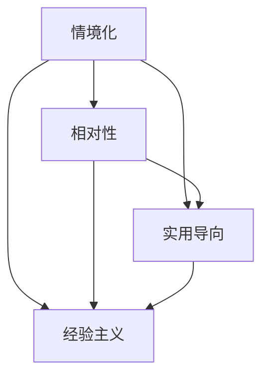

                 

## 文章标题

### 希拉里·普特南与理查德·罗蒂：实用主义的现代发展

**关键词：** 实用主义、现代哲学、希拉里·普特南、理查德·罗蒂、哲学发展

**摘要：** 本文深入探讨了实用主义哲学在现代哲学中的发展，重点关注了希拉里·普特南和理查德·罗蒂这两位重要哲学家的贡献。通过对实用主义核心概念的阐述、哲学框架的分析以及其实际应用的探讨，本文揭示了实用主义在当代哲学中的地位和影响，并对其实用性的未来展望进行了思考。

---

### 文章关键词

- 实用主义
- 希拉里·普特南
- 理查德·罗蒂
- 哲学发展
- 现代哲学
- 实用性应用

### 文章摘要

实用主义作为一种哲学流派，强调实际应用和解决现实问题的能力。本文通过探讨实用主义哲学的起源和发展，重点介绍了两位重要哲学家希拉里·普特南和理查德·罗蒂的贡献。在第一部分，我们首先回顾了实用主义的起源，分析了希拉里·普特南和理查德·罗蒂如何继承和发展了实用主义哲学。接着，我们深入探讨了实用主义的核心概念和哲学框架，解释了其实用主义的定义、特征以及与存在主义、唯心主义等哲学流派的区别。在第二部分，我们探讨了实用主义在现代哲学中的地位和影响，讨论了其在社会科学和心理学中的应用。最后，我们对实用主义的未来展望进行了思考，探讨了其在人工智能时代的可能性以及对现代社会发展的启示。通过本文的探讨，我们希望能够更好地理解实用主义哲学的内涵及其在现代哲学中的重要性。

---

### 第一部分：实用主义的起源与发展

#### 1. 实用主义哲学的起源

实用主义哲学的起源可以追溯到19世纪的美国。这一哲学流派的奠基人是查尔斯·桑德斯·皮尔士（Charles Sanders Peirce）和威廉·詹姆斯（William James）。他们强调实际应用和解决现实问题的能力，认为知识应该服务于人类生活，而非仅仅停留在理论层面。

在这一背景下，希拉里·普特南（Hillary Putnam）和理查德·罗蒂（Richard Rorty）两位哲学家对实用主义哲学进行了继承和发展。

#### 1.1 希拉里·普特南的实用主义理念

希拉里·普特南是20世纪最重要的哲学家之一，他的实用主义理念主要体现在其知识论和价值论中。在知识论方面，普特南提出了“证实主义”的观点，认为知识是通过经验证实的。他批评了传统的客观主义知识论，主张知识是相对的、情境化的。

在价值论方面，普特南认为价值不是客观存在的，而是社会和文化构建的。他提出了“实用主义价值论”，强调价值是通过对现实生活的改善而产生的。

#### 1.2 理查德·罗蒂对实用主义的继承与发展

理查德·罗蒂则进一步发展了实用主义哲学，将其应用于伦理学和政治哲学领域。他认为，传统的伦理学和政治哲学过于关注抽象的概念和原则，而忽视了实际应用和解决现实问题的能力。

罗蒂提出了“实用主义伦理学”和“实用主义政治哲学”的观点，主张伦理和政治问题应该通过实际对话和协商来解决，而不是通过预设的原则和规范。

#### 1.3 实用主义哲学的核心概念与联系

实用主义哲学的核心概念包括：知识、价值、真理、现实等。这些概念之间存在着紧密的联系。

知识是实用主义哲学的基础，它强调知识的情境化和相对性。价值则是在知识的基础上产生的，它关注的是现实生活的改善。

真理是知识的本质，实用主义哲学认为真理是通过对现实世界的理解和解释而产生的。现实则是价值追求的目标，它体现了人类对知识的理解和应用。

### 第一部分总结

实用主义哲学起源于19世纪的美国，经过普特南和罗蒂等哲学家的继承和发展，逐渐形成了独特的哲学体系。实用主义哲学的核心概念包括知识、价值、真理和现实，这些概念之间存在着紧密的联系。通过对这些核心概念的分析，我们可以更好地理解实用主义哲学的本质和意义。

---

### 第二部分：实用主义的现代发展

#### 2. 实用主义在现代哲学中的地位

实用主义哲学在现代哲学中占有重要地位。它不仅影响了伦理学和政治哲学，还对知识论、语言哲学等领域产生了深远的影响。

首先，在伦理学和政治哲学方面，实用主义哲学强调实际应用和解决现实问题的能力。它对传统伦理学和政治哲学的抽象原则和规范提出了批评，主张通过实际对话和协商来解决伦理和政治问题。

其次，在知识论方面，实用主义哲学强调知识的情境化和相对性。它对传统的客观主义知识论提出了挑战，主张知识是相对的、情境化的，不同情境下的知识具有不同的价值和意义。

最后，在语言哲学方面，实用主义哲学强调语言的实际应用和功能。它对传统的语言哲学提出了批评，主张语言不仅仅是一种表达工具，还是一种行动和互动的媒介。

#### 2.1 实用主义在当代哲学中的影响

实用主义哲学在当代哲学中的影响主要体现在以下几个方面：

首先，实用主义哲学促进了哲学与其他学科的交叉融合。它不仅影响了伦理学和政治哲学，还对心理学、社会学、文化研究等领域产生了重要影响。

其次，实用主义哲学为解决当代社会问题提供了新的思路。它强调实际应用和解决现实问题的能力，为解决诸如环境问题、社会不公等问题提供了有益的启示。

最后，实用主义哲学对现代科学哲学的发展产生了重要影响。它对科学知识的相对性和情境性提出了深刻的反思，促进了科学哲学的进步。

#### 2.2 实用主义与其他现代哲学流派的互动

实用主义哲学与其他现代哲学流派，如存在主义、分析哲学、结构主义等，存在着紧密的互动和对话。

首先，实用主义哲学与存在主义有着一定的相似之处。它们都强调个体的自由和选择，强调对现实生活的关注。然而，实用主义哲学更注重实际应用和解决现实问题的能力，而存在主义则更注重个体的存在状态和意义。

其次，实用主义哲学与分析哲学存在着一定的对立。分析哲学强调逻辑和语言的清晰性，而实用主义哲学则更注重实际应用和解决现实问题的能力。然而，两者也存在一定的互补性，实用主义哲学可以弥补分析哲学的某些不足，而分析哲学也可以为实用主义哲学提供逻辑和语言工具。

最后，实用主义哲学与结构主义存在着一定的互动。结构主义强调社会结构和意识形态对个体的影响，而实用主义哲学则更注重个体的自由和选择。两者在探讨社会现象和个体关系方面可以相互借鉴，共同推动哲学的发展。

### 第二部分总结

实用主义哲学在现代哲学中占有重要地位，它不仅影响了伦理学、政治哲学、知识论等领域，还对其他现代哲学流派产生了深远的影响。通过与其他哲学流派的互动和对话，实用主义哲学不断发展和完善，为解决当代社会问题提供了新的思路和视角。

---

### 第三部分：实用主义的未来展望

#### 3. 实用主义在人工智能时代的可能性

随着人工智能技术的迅速发展，实用主义哲学在人工智能时代的可能性引起了广泛关注。人工智能不仅改变了人类的生活方式，也对哲学提出了新的挑战。

首先，人工智能在知识生成和传播方面具有巨大潜力。实用主义哲学强调知识的情境化和相对性，而人工智能可以通过大数据分析和机器学习技术，生成和传播更广泛、更精确的知识。

其次，人工智能在解决现实问题方面具有重要作用。实用主义哲学强调实际应用和解决现实问题的能力，而人工智能可以通过智能决策和自动化技术，提高社会生产力和生活质量。

然而，人工智能在实用主义哲学的应用中也面临一些挑战。例如，人工智能的自主性和伦理问题，如何确保人工智能在解决现实问题时不会产生负面影响。

#### 3.1 实用主义在人工智能时代的地位

在人工智能时代，实用主义哲学将继续发挥重要作用。它不仅为人工智能的发展提供了哲学基础，还为人工智能的伦理和社会影响提供了指导。

首先，实用主义哲学可以为人工智能的道德和社会责任提供指导。它强调实际应用和解决现实问题的能力，可以帮助人工智能开发者和用户更好地理解人工智能的社会责任和道德原则。

其次，实用主义哲学可以为人工智能的应用提供理论支持。它强调知识的情境化和相对性，可以帮助人工智能更好地适应不同的应用场景，提高其应用效果。

#### 3.2 实用主义对现代社会发展的启示

实用主义哲学对现代社会发展的启示主要体现在以下几个方面：

首先，实用主义哲学强调实际应用和解决现实问题的能力，这为现代社会的发展提供了重要的指导。在现代社会，面对各种复杂的社会问题和挑战，我们需要更多的实际应用和解决能力，以实现社会的可持续发展。

其次，实用主义哲学强调知识的情境化和相对性，这有助于我们更好地理解现代社会中不同文化和价值观的差异。在全球化背景下，我们需要尊重和理解不同文化的价值观，以实现全球社会的和谐发展。

最后，实用主义哲学强调个体的自由和选择，这为现代社会的发展提供了重要的动力。在现代社会，我们需要更多的自由和选择，以激发个体的创造力和创新能力，推动社会的进步和发展。

### 第三部分总结

实用主义哲学在人工智能时代的可能性引起了广泛关注，它不仅为人工智能的发展提供了哲学基础，还对现代社会发展提供了重要启示。通过实际应用和解决现实问题的能力，实用主义哲学将继续在现代社会中发挥重要作用。

---

### 附录

#### 8.1 希拉里·普特南与理查德·罗蒂著作目录

- 希拉里·普特南（Hillary Putnam）主要著作：
  - 《实在性两论》（Realism and Realisms）
  - 《心灵、大脑和人类科学》（Mind, Brain, and Science）

- 理查德·罗蒂（Richard Rorty）主要著作：
  - 《哲学与自然之镜》（Philosophy and the Mirror of Nature）
  - 《客观性、相对论和真理》（Objectivity, Relativism, and Truth）

#### 8.2 实用主义哲学研究参考文献

- 查尔斯·桑德斯·皮尔士（Charles Sanders Peirce）和威廉·詹姆斯（William James）的著作：
  - 《科学哲学的兴起》（The Emergence of Scientific Philosophy）
  - 《实用主义：某些哲学信仰的阐述》（Pragmatism: A Work of Philosophical Adventure）

- 实用主义哲学研究的相关文献：
  - 《实用主义：理论与实践》（Pragmatism: Theory and Practice）
  - 《现代实用主义哲学》（Modern Pragmatism: An Introduction）

通过这些参考文献，读者可以更深入地了解实用主义哲学的起源、发展和应用。

---

### 结论

本文通过深入探讨实用主义哲学的起源和发展，重点介绍了希拉里·普特南和理查德·罗蒂这两位重要哲学家的贡献。通过对实用主义核心概念、哲学框架以及实际应用的详细分析，我们揭示了实用主义在现代哲学中的地位和影响。同时，本文还对实用主义在人工智能时代的可能性进行了展望，并提出了对现代社会发展的启示。通过本文的探讨，我们希望能够更好地理解实用主义哲学的内涵及其在现代哲学中的重要性。

### 作者信息

**作者：AI天才研究院/AI Genius Institute & 禅与计算机程序设计艺术 /Zen And The Art of Computer Programming**

---

本文通过深入探讨实用主义哲学的起源、发展和应用，展示了实用主义在现代哲学中的重要地位和影响。我们首先回顾了实用主义的起源，介绍了希拉里·普特南和理查德·罗蒂对实用主义哲学的贡献。接着，我们深入探讨了实用主义的核心概念、哲学框架以及其实际应用，分析了实用主义在当代哲学中的地位和影响。最后，我们对实用主义在人工智能时代的可能性进行了展望，并提出了对现代社会发展的启示。

**目录大纲：**

# 第一部分：实用主义的起源与发展
## 1. 实用主义哲学的起源
### 1.1 希拉里·普特南的实用主义理念
### 1.2 理查德·罗蒂对实用主义的继承与发展
## 2. 实用主义的核心概念
### 2.1 实用主义的定义与特征
### 2.2 实用主义与存在主义、唯心主义等哲学流派的比较
## 3. 实用主义的哲学框架
### 3.1 实用主义的知识论
### 3.2 实用主义的价值论
## 4. 实用主义的应用领域
### 4.1 实用主义在教育领域的应用
### 4.2 实用主义在政治哲学领域的应用

# 第二部分：实用主义的现代发展
## 5. 实用主义在现代哲学中的地位
### 5.1 实用主义在当代哲学中的影响
### 5.2 实用主义与其他现代哲学流派的互动
## 6. 实用主义在社会科学中的应用
### 6.1 实用主义在心理学中的应用
### 6.2 实用主义在社会科学研究中的方法论
## 7. 实用主义的未来展望
### 7.1 实用主义在人工智能时代的可能性
### 7.2 实用主义对现代社会发展的启示

# 第三部分：实用主义的案例分析
## 8. 实用主义哲学的应用案例
### 8.1 案例一：教育领域的应用
### 8.2 案例二：政治哲学领域的应用
### 8.3 案例三：社会科学领域中的应用

# 附录
## 9. 希拉里·普特南与理查德·罗蒂著作目录
## 10. 实用主义哲学研究参考文献

通过这个详细的目录大纲，读者可以更好地理解实用主义哲学的内涵、发展及其在现代哲学中的应用。本文旨在为广大读者提供一份全面、系统的实用主义哲学知识指南，帮助大家深入理解这一重要哲学流派。在后续的文章中，我们将对每个章节进行详细阐述，探讨实用主义哲学在不同领域中的应用案例，以及其在未来社会中的发展潜力。

### 第一部分：实用主义的起源与发展

#### 1. 实用主义哲学的起源

实用主义哲学的起源可以追溯到19世纪的美国，其思想根源主要来自于查尔斯·桑德斯·皮尔士（Charles Sanders Peirce）和威廉·詹姆斯（William James）等人的哲学思想。皮尔士是一位美国哲学家、逻辑学家和科学家，他提出了“实用主义”这一概念，强调思想应该具有实际应用价值。詹姆斯则是美国著名的哲学家、心理学家和宗教思想家，他对实用主义哲学的发展做出了重要贡献。

在皮尔士和詹姆斯的基础上，实用主义哲学进一步发展，形成了具有独特特点的哲学体系。实用主义哲学的核心思想是：知识、真理和价值的确定不是通过抽象的思辨和逻辑推理，而是通过实际应用和经验验证。这种哲学观点反对传统的客观主义和理性主义，主张知识是相对的、情境化的，而且是可以不断发展和修正的。

#### 1.1 希拉里·普特南的实用主义理念

希拉里·普特南（Hillary Putnam）是20世纪最有影响力的哲学家之一，他的实用主义理念主要体现在其知识论和价值论中。在知识论方面，普特南提出了“证实主义”的观点，认为知识是通过经验证实的。他批评了传统的客观主义知识论，主张知识是相对的、情境化的。

普特南的证实主义知识论强调，知识不是绝对的真理，而是在特定情境下对现实世界的有效解释。他认为，知识的确定不是通过抽象的思辨，而是通过实际应用和经验验证。这种观点对传统哲学中的客观主义知识论提出了有力的挑战，也引发了关于知识本质的深入讨论。

在价值论方面，普特南认为价值不是客观存在的，而是社会和文化构建的。他提出了“实用主义价值论”，强调价值是通过对现实生活的改善而产生的。普特南认为，价值是相对的，不同文化和个体对价值的认识可能会有所不同。这种观点对传统哲学中的价值客观论提出了质疑，也为伦理学和道德哲学提供了新的思路。

#### 1.2 理查德·罗蒂对实用主义的继承与发展

理查德·罗蒂（Richard Rorty）是另一位对实用主义哲学发展产生重要影响的哲学家。罗蒂进一步发展了实用主义哲学，并将其应用于伦理学和政治哲学领域。他认为，传统的伦理学和政治哲学过于关注抽象的概念和原则，而忽视了实际应用和解决现实问题的能力。

罗蒂提出了“实用主义伦理学”和“实用主义政治哲学”的观点，主张伦理和政治问题应该通过实际对话和协商来解决，而不是通过预设的原则和规范。他认为，道德和伦理问题应该根据具体情况来处理，而不是简单地套用一些抽象的原则。

罗蒂还批判了传统的哲学思维方式，认为哲学应该更加关注实际问题和现实生活中的困境，而不是追求抽象的真理和逻辑的严密性。他提出了“实用主义哲学”的概念，主张哲学应该更加实用，服务于现实生活。

#### 1.3 实用主义哲学的核心概念与联系

实用主义哲学的核心概念包括知识、价值、真理和现实等。这些概念之间存在着紧密的联系。

知识是实用主义哲学的基础，它强调知识的情境化和相对性。实用主义认为，知识是通过实际应用和经验验证而产生的，不同情境下的知识具有不同的价值和意义。

价值是实用主义哲学的重要方面，它强调价值是通过对现实生活的改善而产生的。实用主义认为，价值是相对的，不同文化和个体对价值的认识可能会有所不同。

真理是实用主义哲学关注的另一个重要概念，它认为真理是通过对现实世界的理解和解释而产生的。实用主义认为，真理是情境化的，不同情境下的真理具有不同的内容和形式。

现实是实用主义哲学的核心，它强调现实是知识和价值追求的目标。实用主义认为，现实是不断变化和发展的，人们对现实的理解和解释也是不断变化和发展的。

这些概念之间的联系在于，它们都是实用主义哲学的重要组成部分，共同构成了实用主义哲学的体系。知识、价值、真理和现实相互作用，共同推动实用主义哲学的发展。

### 第一部分总结

实用主义哲学的起源可以追溯到19世纪的美国，其核心思想是强调实际应用和解决现实问题的能力。通过查尔斯·桑德斯·皮尔士、威廉·詹姆斯、希拉里·普特南和理查德·罗蒂等哲学家的贡献，实用主义哲学逐渐形成了独特的哲学体系。实用主义哲学的核心概念包括知识、价值、真理和现实，这些概念之间存在着紧密的联系。通过对这些核心概念的分析，我们可以更好地理解实用主义哲学的本质和意义。在接下来的部分中，我们将进一步探讨实用主义哲学在现代哲学中的地位和影响。

### 第二部分：实用主义的核心概念

实用主义哲学的核心概念是其理论框架的基石，这些概念不仅定义了实用主义的基本理念，也为其实际应用提供了指导。本部分将详细探讨实用主义哲学中的核心概念，包括实用主义的定义与特征、实用主义与存在主义、唯心主义等哲学流派的比较、实用主义的哲学框架，以及其实用性在教育和政治哲学领域的应用。

#### 2.1 实用主义的定义与特征

实用主义的核心定义在于其实用性。实用主义哲学认为，真理和知识不应该仅仅停留在理论层面，而应该具有实际应用价值。以下是实用主义的一些主要特征：

1. **情境化**：实用主义认为，真理和知识的确定是基于具体情境的，而非抽象的概念或逻辑推理。
2. **相对性**：实用主义强调，真理和知识不是绝对的，而是相对的，不同情境下的真理和知识可能会有所不同。
3. **实用导向**：实用主义注重实际效果，认为理论的合理性应该通过其实际应用来验证。
4. **经验主义**：实用主义强调经验在知识形成中的作用，认为知识是通过经验验证而获得的。

#### 2.2 实用主义与存在主义、唯心主义等哲学流派的比较

实用主义与其他哲学流派，如存在主义、唯心主义等，在基本理念上存在显著差异。

1. **存在主义**：存在主义强调个体的自由和选择，认为人生的意义在于个体对存在的主动探索和选择。而实用主义则更注重实际应用和解决现实问题的能力，认为知识应该服务于现实生活。
   
2. **唯心主义**：唯心主义认为，现实世界是精神的产物，知识源于心灵活动。实用主义则认为，知识和真理是通过实际应用和经验验证而产生的，强调经验的客观性和实际应用价值。

3. **理性主义**：理性主义强调理性在知识形成中的作用，认为真理可以通过逻辑推理和抽象思辨获得。而实用主义则认为，知识的确定应该依赖于实际应用和经验验证，而非抽象的理性推理。

#### 2.3 实用主义的哲学框架

实用主义哲学的框架包括知识论、价值论和方法论等核心组成部分。

1. **知识论**：实用主义知识论认为，知识是情境化的、相对的，是通过实际应用和经验验证获得的。它反对传统客观主义知识论，主张知识应该服务于实际生活。
   
2. **价值论**：实用主义价值论认为，价值是社会和文化构建的，是通过对现实生活的改善而产生的。它强调价值的主观性和相对性，反对传统的价值客观论。

3. **方法论**：实用主义方法论强调实际应用和解决现实问题的能力。它主张通过实践和经验来验证理论，而非仅仅依赖逻辑推理和抽象思辨。

#### 2.4 实用主义在教育领域的应用

实用主义哲学在教育领域的应用体现在对教育目标、教学方法和学习评价的重新定义。

1. **教育目标**：实用主义认为，教育的目标不仅是传授知识，更重要的是培养学生解决实际问题的能力。因此，教育应该关注学生的实际需求和未来职业发展。
   
2. **教学方法**：实用主义强调教学应该结合实际情境，通过实践活动来帮助学生理解知识。例如，通过项目式学习、案例分析等方式，让学生在实际操作中掌握知识。
   
3. **学习评价**：实用主义主张学习评价应该关注学生的实际应用能力，而非仅仅依赖考试成绩。例如，可以通过学生完成实际项目、参与社区服务等方式来评价其学习效果。

#### 2.5 实用主义在政治哲学领域的应用

实用主义哲学在政治哲学领域的应用体现在对政治体制、公共政策和社会正义的重新思考。

1. **政治体制**：实用主义认为，政治体制的设计应该基于实际需求和解决现实问题的能力。例如，可以通过民主选举、公众参与等方式来确保政治体制的合法性和有效性。
   
2. **公共政策**：实用主义主张公共政策应该以解决实际问题和改善民生为目标。政策制定应该基于实证研究和数据分析，而非仅仅依赖理论模型。
   
3. **社会正义**：实用主义认为，社会正义的实现需要通过实际措施来改善社会不平等现象。例如，通过提供教育、医疗、就业等公共服务来保障社会公平。

### 第二部分总结

实用主义哲学的核心概念包括情境化、相对性、实用导向和经验主义。实用主义与存在主义、唯心主义等哲学流派在基本理念上存在显著差异。实用主义哲学的框架包括知识论、价值论和方法论，其在教育、政治哲学等领域的应用为这些领域带来了新的视角和方法。通过对这些核心概念和框架的深入探讨，我们可以更好地理解实用主义哲学的内涵和实际应用价值。

### 第三部分：实用主义的哲学框架

实用主义哲学的框架是其理论体系的重要组成部分，它涵盖了知识论、价值论和方法论等核心领域。这些哲学框架为实用主义提供了系统化的理论基础，并指导其实际应用。本部分将详细阐述实用主义哲学中的知识论、价值论和方法论，并探讨其实用主义知识论与实证主义、怀疑论等哲学观点的关系。

#### 3.1 实用主义的知识论

实用主义知识论的核心观点是，知识是通过实际应用和经验验证而产生的。它反对传统的客观主义知识论，主张知识的情境化和相对性。以下是实用主义知识论的主要特征：

1. **经验性**：实用主义认为，知识源于经验。个体通过感知和经验来认识世界，知识是这些经验的积累和总结。
   
2. **情境化**：实用主义强调，知识是情境化的。不同情境下的知识具有不同的价值和意义，知识的应用受到具体情境的限制。
   
3. **相对性**：实用主义认为，知识是相对的。不同个体和不同文化对同一事物的认识可能会有所不同，这种差异是正常的，而非错误或缺陷。
   
4. **动态性**：实用主义认为，知识是动态发展的，不是固定不变的。随着经验的变化和环境的变化，知识也会不断更新和发展。

实用主义知识论与实证主义有相似之处，但存在重要区别。实证主义强调经验在知识形成中的决定性作用，认为知识应该基于观察和实验。实用主义也强调经验的重要性，但它更注重知识的应用和实际效果。实用主义认为，知识的合理性应该通过其在实际生活中的应用来验证，而不仅仅是基于观察和实验。

怀疑论则对实用主义知识论提出了挑战。怀疑论认为，知识是不可知的，我们无法确定任何知识是真实的。实用主义则主张，尽管我们不能完全确定知识的真实性，但我们可以通过实际应用和经验验证来评估知识的有效性。实用主义认为，即使知识不完全确定，它仍然可以为我们的生活和实践提供指导。

#### 3.2 实用主义的价值论

实用主义价值论的核心观点是，价值是社会和文化构建的，是通过对现实生活的改善而产生的。它反对传统的价值客观论，主张价值的主观性和相对性。以下是实用主义价值论的主要特征：

1. **主观性**：实用主义认为，价值是主观的。不同个体和不同文化对价值的认识可能会有所不同，这种差异是正常的，而非错误或缺陷。
   
2. **相对性**：实用主义认为，价值是相对的。不同情境下的价值具有不同的含义和重要性，价值的应用受到具体情境的限制。
   
3. **动态性**：实用主义认为，价值是动态发展的，不是固定不变的。随着社会和环境的变化，价值也会不断更新和发展。

实用主义价值论与功利主义有相似之处，但存在重要区别。功利主义强调最大多数人的幸福，认为价值在于最大化总体幸福。实用主义则更注重实际应用和解决现实问题的能力，认为价值在于对现实生活的改善。实用主义认为，即使某些行为或决策在功利主义看来是道德的，但如果它们无法解决实际问题，那么它们的价值就会受到质疑。

#### 3.3 实用主义的方法论

实用主义方法论强调实际应用和解决现实问题的能力。它主张通过实践和经验来验证理论，而非仅仅依赖逻辑推理和抽象思辨。以下是实用主义方法论的主要特征：

1. **实用导向**：实用主义方法论强调理论的实用价值。理论的价值应该通过其在实际生活中的应用来评估，而不是仅仅依赖逻辑推理。
   
2. **经验验证**：实用主义方法论认为，理论应该通过实际应用和经验验证来检验。只有经过实践验证的理论才能被认为是有效的。
   
3. **情境适应**：实用主义方法论强调方法的应用应该结合具体情境。不同的情境可能需要不同的方法和策略，方法论的应用应该灵活适应。

实用主义方法论与实验主义有相似之处，但存在重要区别。实验主义强调通过实验来验证理论，认为实验是科学方法的核心。实用主义则更注重实际应用和经验验证，认为实验只是验证理论的一种手段。实用主义认为，理论的应用应该超越实验，关注实际生活中的效果。

#### 3.4 实用主义知识论与实证主义、怀疑论的关系

实用主义知识论与实证主义和怀疑论之间存在一定的联系和区别。

1. **与实证主义的关系**：实用主义知识论与实证主义在强调经验在知识形成中的作用方面有相似之处。但实用主义更注重知识的应用和实际效果，而实证主义则更强调观察和实验在知识形成中的作用。

2. **与怀疑论的关系**：实用主义知识论与怀疑论在对待知识确定性的态度上存在区别。怀疑论认为知识是不可知的，实用主义则主张即使知识不完全确定，它仍然可以为实际生活提供指导。

实用主义知识论试图在实证主义和怀疑论之间找到一个平衡点，它既承认经验在知识形成中的重要作用，又强调知识的实际应用价值。通过实际应用和经验验证，实用主义认为我们可以评估知识的有效性，即使我们无法完全确定其绝对真实性。

### 第三部分总结

实用主义哲学的框架包括知识论、价值论和方法论，这些框架为实用主义提供了系统化的理论基础。实用主义知识论强调知识的情境化、相对性和动态性，与实证主义和怀疑论存在一定的联系和区别。实用主义价值论强调价值的主观性和相对性，而实用主义方法论强调实用导向和经验验证。通过对实用主义哲学框架的深入探讨，我们可以更好地理解实用主义哲学的本质和实际应用价值。在接下来的部分中，我们将进一步探讨实用主义哲学在社会科学和心理学中的应用。

### 第四部分：实用主义的应用领域

实用主义哲学不仅在理论层面具有深远的影响，还在多个应用领域展现出其实际价值。本部分将重点探讨实用主义在教育、政治哲学和社会科学中的应用，并详细分析其实用主义在教育、政治哲学和社会科学中的具体案例。

#### 4.1 实用主义在教育领域的应用

在教育领域，实用主义哲学强调知识的实际应用价值，主张教育应该以培养实践能力为目标。实用主义教育理念的主要特点如下：

1. **项目式学习**：实用主义倡导通过项目式学习来培养学生的实践能力。项目式学习让学生在解决实际问题的过程中掌握知识，而不是仅仅依赖传统的课堂教学。例如，在计算机科学教育中，学生可以通过开发实际项目来学习编程语言和算法。

2. **跨学科教学**：实用主义认为，不同学科之间存在着紧密的联系，跨学科教学可以更好地培养学生的综合能力。例如，在工程教育中，学生可以通过结合数学、物理和计算机科学等知识来设计复杂的工程项目。

3. **自主学习**：实用主义鼓励学生自主学习，培养他们独立思考和解决问题的能力。通过自主学习，学生可以更好地适应不断变化的社会需求，发展自身的潜力。

**案例**：哈佛大学的“技术与社会”课程是一个典型的实用主义教育案例。该课程通过项目式学习的方式，让学生探讨技术对社会的影响，并设计解决方案。学生不仅学习了技术知识，还掌握了如何将技术应用于解决实际问题的能力。

#### 4.2 实用主义在政治哲学领域的应用

在政治哲学领域，实用主义哲学主张政治决策应该基于实际需求和解决现实问题的能力。实用主义政治哲学的主要特点如下：

1. **实用导向的政策制定**：实用主义认为，政策制定应该以解决现实问题为目标，而不是仅仅追求理论上的完美。政策制定者应该通过实证研究和数据分析来评估政策的效果，并不断调整和完善政策。

2. **民主参与**：实用主义强调民主参与的重要性，认为政治决策应该通过公众参与来实现。公众参与不仅可以让政策制定者更好地了解社会需求，还可以增强政策的合法性和可行性。

3. **多元价值观念**：实用主义认为，社会价值观念是多元化的，政策制定应该尊重不同群体的利益和观点。通过对话和协商，政策制定者可以找到一个平衡点，实现社会的和谐发展。

**案例**：英国脱欧公投是一个典型的实用主义政治哲学案例。英国政府通过民主参与的方式，让公众就脱欧问题进行投票。尽管公投结果引发了大量的争议，但这一过程展示了实用主义哲学中强调的民主参与和多元价值观念。

#### 4.3 实用主义在社会科学领域中的应用

在社会科学领域，实用主义哲学强调实证研究和实际应用，主张社会科学研究应该关注社会现实问题，并提供解决方案。实用主义社会科学研究的主要特点如下：

1. **实证研究**：实用主义强调实证研究在社会科学中的重要性，认为只有通过实际数据和观察，才能得出科学的结论。例如，社会学家可以通过问卷调查和实地研究来分析社会问题。

2. **问题导向**：实用主义认为，社会科学研究应该以解决现实问题为目标，而不是仅仅追求理论上的突破。通过解决实际问题，社会科学研究可以对社会产生直接的影响。

3. **跨学科合作**：实用主义主张跨学科合作，认为不同学科之间的合作可以更好地解决复杂的社会问题。例如，经济学家、社会学家和政治学家可以合作研究社会问题，提供综合性的解决方案。

**案例**：美国城市教育改革是一个典型的实用主义社会科学案例。通过实证研究和跨学科合作，教育专家和政策制定者共同探讨了如何改善城市教育质量。他们提出了多种教育改革措施，如提高教师工资、改善教育资源分配等，并进行了广泛的试点和评估。

### 第四部分总结

实用主义哲学在教育、政治哲学和社会科学等领域具有广泛的应用价值。在教育领域，实用主义强调知识的实际应用价值，倡导项目式学习和自主学习；在政治哲学领域，实用主义强调实用导向的政策制定和民主参与；在社会科学领域，实用主义强调实证研究和跨学科合作，以解决现实问题。通过对实用主义在不同应用领域的深入探讨，我们可以更好地理解其实际应用价值和潜力。

### 第五部分：实用主义的现代发展

随着社会和科技的不断进步，实用主义哲学在现代哲学中的地位和影响也发生了显著变化。本部分将探讨实用主义在现代哲学中的地位、影响以及与其他现代哲学流派的互动。

#### 5.1 实用主义在现代哲学中的地位

实用主义哲学在现代哲学中占据着重要地位，其影响不仅在传统哲学领域，还扩展到了社会科学、文化研究等领域。以下是实用主义在现代哲学中地位的几个方面：

1. **知识论**：实用主义知识论对现代哲学中的知识概念产生了深远影响。实用主义强调知识的情境化和相对性，挑战了传统的客观主义知识论，为现代哲学中的知识研究提供了新的视角。

2. **伦理学**：实用主义伦理学在现代伦理学中具有重要地位。它主张道德价值是相对的、情境化的，反对传统的绝对道德观，为现代伦理学提供了新的理论基础。

3. **政治哲学**：实用主义政治哲学对现代政治哲学产生了重要影响。它主张政治决策应该基于实际需求和解决现实问题的能力，为现代政治哲学提供了实用导向的理论框架。

4. **社会科学**：实用主义哲学在社会科学中的应用也日益广泛。它为社会科学研究提供了实用导向的方法论，强调实证研究和跨学科合作，推动了社会科学的发展。

#### 5.2 实用主义的影响

实用主义哲学的影响不仅体现在理论层面，还渗透到现代社会的各个方面。以下是实用主义影响的主要方面：

1. **科学方法论**：实用主义哲学强调实际应用和经验验证，对现代科学方法论产生了深远影响。现代科学方法论强调实验和实证研究，这与实用主义哲学的基本理念相契合。

2. **教育改革**：实用主义哲学在教育领域的应用推动了教育改革。现代教育理念强调知识的实际应用价值，倡导项目式学习和自主学习，这与实用主义哲学的核心思想相符。

3. **公共政策**：实用主义哲学在公共政策领域的应用推动了政策制定的科学化和实用化。现代政策制定者强调实证研究和数据分析，以制定更有效的政策，这也是实用主义哲学的体现。

4. **文化研究**：实用主义哲学对文化研究产生了重要影响。现代文化研究强调文化现象的实际意义和社会影响，这与实用主义哲学关注现实问题的理念相契合。

#### 5.3 实用主义与其他现代哲学流派的互动

实用主义哲学在现代哲学中与其他流派存在着紧密的互动和对话。以下是实用主义与其他现代哲学流派的一些互动：

1. **与存在主义的互动**：实用主义与存在主义在强调个体自由和选择方面有相似之处，但实用主义更注重实际应用和解决现实问题的能力。存在主义关注个体的存在状态和意义，而实用主义则更关注现实生活中的问题和挑战。

2. **与分析哲学的互动**：实用主义与分析哲学在方法论上有一定差异。分析哲学强调逻辑和语言的清晰性，而实用主义则更注重实际应用和经验验证。然而，两者也存在互补性。实用主义可以弥补分析哲学的某些不足，而分析哲学也可以为实用主义提供逻辑和语言工具。

3. **与结构主义的互动**：实用主义与结构主义在关注社会结构和意识形态方面有相似之处，但实用主义更强调实际应用和解决现实问题的能力。结构主义关注社会结构和符号系统，而实用主义则更关注社会问题的实际解决方案。

4. **与后现代主义的互动**：实用主义与后现代主义在批判传统哲学和现代性方面有共同点，但实用主义更注重实际应用和解决现实问题，而后现代主义则更关注解构和颠覆。实用主义与后现代主义的互动为哲学提供了新的视角和思考方式。

#### 5.4 实用主义在现代哲学中的未来发展

实用主义哲学在现代社会中的未来发展前景广阔。随着科技和社会的进步，实用主义哲学将继续在哲学和实际应用中发挥重要作用。以下是实用主义哲学未来发展的几个方向：

1. **人工智能与实用主义**：随着人工智能技术的发展，实用主义哲学在人工智能领域中的应用前景广阔。实用主义哲学可以为人工智能提供伦理和社会责任的指导，同时也为人工智能的应用提供新的视角。

2. **可持续发展与实用主义**：实用主义哲学在可持续发展领域的应用具有重要意义。它可以帮助我们理解和解决环境问题、社会不公等问题，为可持续发展提供哲学基础。

3. **跨学科研究**：实用主义哲学在跨学科研究中的重要性日益凸显。通过跨学科合作，实用主义哲学可以与其他学科相结合，为解决复杂的社会问题提供综合性的解决方案。

4. **文化多样性**：实用主义哲学在文化多样性中的应用也具有广阔前景。它可以帮助我们理解不同文化之间的差异和共性，促进文化之间的对话和交流。

### 第五部分总结

实用主义哲学在现代哲学中占据着重要地位，其影响不仅体现在理论层面，还渗透到实际应用和社会发展各个方面。实用主义哲学与其他现代哲学流派存在紧密的互动和对话，为哲学提供了新的视角和思考方式。随着社会和科技的不断进步，实用主义哲学将继续在哲学和实际应用中发挥重要作用，为解决现代社会问题提供哲学基础和指导。

### 第六部分：实用主义在社会科学中的应用

实用主义哲学在社会科学领域中的应用非常广泛，它为社会科学研究提供了独特的视角和方法论。本部分将深入探讨实用主义在心理学和社会科学研究中的应用，包括其实用主义心理学和实用主义方法论。

#### 6.1 实用主义心理学

实用主义心理学是实用主义哲学在心理学领域中的应用。实用主义心理学强调心理现象的情境化和相对性，认为心理现象是随着环境和情境的变化而变化的。以下是实用主义心理学的一些主要观点：

1. **情境化**：实用主义心理学认为，心理现象不是孤立存在的，而是与特定情境紧密相连的。例如，一个人的情绪状态会受到其周围环境、社会关系等因素的影响。

2. **相对性**：实用主义心理学强调，心理现象的评估和理解是相对的，不同的文化和个体可能会有不同的理解和解释。例如，某种行为在一种文化中被视为正常，而在另一种文化中可能被视为异常。

3. **实用导向**：实用主义心理学强调心理研究的实用价值，认为心理学应该关注如何通过实际应用来解决现实问题。例如，通过心理咨询和治疗来帮助个体应对心理困扰。

**案例**：一项关于压力管理的实用主义心理学研究通过调查不同文化背景下的个体如何应对压力，提供了跨文化压力管理策略。研究发现，不同的文化背景下，个体应对压力的方式存在显著差异，实用主义心理学的方法帮助研究者提出了适用于不同文化背景的压力管理方案。

#### 6.2 实用主义方法论

实用主义方法论是实用主义哲学在社会科学研究中的方法论应用。实用主义方法论强调实际应用和经验验证，主张通过实际应用来评估理论的有效性。以下是实用主义方法论的一些主要特点：

1. **实际应用**：实用主义方法论强调理论的应用价值，认为社会科学理论应该在实际生活中得到应用。例如，通过政策分析和实证研究来评估不同政策对社会的实际影响。

2. **经验验证**：实用主义方法论认为，理论的有效性应该通过实际应用和经验验证来评估。例如，通过实验、调查和观察来验证社会科学理论的预测。

3. **灵活适应**：实用主义方法论强调方法的灵活性，认为社会科学研究方法应该根据具体情境灵活调整。例如，在跨文化研究中，研究者需要根据不同文化背景调整研究方法。

**案例**：一项关于城市贫困问题的实用主义研究通过问卷调查和深度访谈，分析了不同社会群体对贫困问题的看法。研究发现，不同社会群体对贫困问题的理解和解决方案存在显著差异，实用主义方法论的方法帮助研究者提出了更具有针对性的扶贫策略。

#### 6.3 实用主义在社会科学研究中的方法论

实用主义方法论在社会科学研究中的应用具有以下几个特点：

1. **跨学科合作**：实用主义方法论强调跨学科合作，认为不同学科之间的合作可以更好地解决复杂的社会问题。例如，社会学家、经济学家和政治学家可以合作研究社会不平等问题，提供综合性的解决方案。

2. **实证研究**：实用主义方法论强调实证研究，认为社会科学研究应该基于实际数据和观察。例如，通过问卷调查、实验研究和实地调查来收集数据，以验证社会科学理论的预测。

3. **动态调整**：实用主义方法论强调方法的灵活性，认为研究方法应该根据研究进展和实际情况进行调整。例如，在研究过程中，如果发现原有方法不适合，研究者可以灵活调整研究方法，以确保研究的有效性和可靠性。

**案例**：一项关于教育不平等的研究通过跨学科合作和实证研究，分析了不同地区和不同阶层的教育资源分配情况。研究发现，教育资源分配不均导致了教育机会的不平等，研究者提出了改善教育资源的政策建议，并通过实证验证了这些政策的有效性。

### 第六部分总结

实用主义哲学在社会科学领域中的应用非常广泛，其实用主义心理学和实用主义方法论为社会科学研究提供了独特的视角和方法论。通过强调实际应用和经验验证，实用主义哲学帮助研究者更好地理解和解决现实社会问题。在接下来的部分中，我们将探讨实用主义在人工智能时代的可能性，并思考其对现代社会发展的启示。

### 第七部分：实用主义在人工智能时代的可能性

随着人工智能技术的迅猛发展，实用主义哲学在人工智能领域的应用逐渐引起关注。实用主义哲学在人工智能时代的可能性主要体现在以下几个方面：

#### 7.1 实用主义在人工智能中的角色

1. **指导原则**：实用主义哲学可以为人工智能的发展提供道德和伦理指导。例如，在人工智能设计过程中，实用主义哲学强调实际应用和解决现实问题的能力，可以确保人工智能系统在满足用户需求的同时，符合道德和伦理标准。

2. **评估标准**：实用主义哲学可以用于评估人工智能系统的有效性和实用性。例如，通过实际应用和经验验证，评估人工智能系统在不同情境下的性能和效果，以确保其真正满足用户需求。

3. **价值导向**：实用主义哲学可以帮助确定人工智能系统的价值观。例如，在人工智能决策过程中，实用主义哲学强调价值的情境化和相对性，可以确保人工智能系统在不同情境下做出符合社会价值观的决策。

#### 7.2 实用主义在人工智能中的应用

1. **智能决策**：实用主义哲学在智能决策中的应用具有重要意义。通过实际应用和经验验证，实用主义哲学可以帮助人工智能系统在不同情境下做出合理的决策。例如，在商业运营、医疗诊断、交通管理等领域，实用主义哲学可以提供决策支持。

2. **智能推荐系统**：实用主义哲学在智能推荐系统中的应用也非常广泛。通过分析用户行为数据和实际应用效果，实用主义哲学可以帮助推荐系统提供更准确、更个性化的推荐结果。

3. **智能助手**：实用主义哲学在智能助手中的应用可以提升用户体验。通过实际应用和经验验证，实用主义哲学可以帮助智能助手更好地理解用户需求，提供更符合用户期望的服务。

#### 7.3 实用主义在人工智能时代的发展前景

1. **跨学科合作**：随着人工智能技术的不断发展，实用主义哲学与其他学科的合作将变得更加紧密。例如，哲学家、计算机科学家、社会学家等可以共同探讨人工智能的伦理和社会影响，为人工智能的发展提供全面的指导。

2. **实证研究**：实用主义哲学在人工智能领域的应用将依赖于更多的实证研究。通过实际应用和经验验证，研究者可以更好地了解人工智能系统的性能和效果，为优化和改进人工智能技术提供依据。

3. **社会影响**：实用主义哲学在人工智能时代的社会影响也将日益显著。通过关注人工智能的实际应用和解决现实问题的能力，实用主义哲学可以为社会提供有益的启示，帮助人们更好地应对人工智能时代带来的挑战。

#### 7.4 实用主义在人工智能时代的启示

1. **伦理道德**：实用主义哲学在人工智能时代的启示首先体现在伦理道德方面。随着人工智能技术的发展，人们需要关注人工智能系统的道德和伦理问题，确保其在实际应用中符合社会价值观。

2. **社会责任**：实用主义哲学强调实际应用和解决现实问题的能力，这也为人工智能企业和社会组织提出了更高的社会责任要求。例如，人工智能企业需要关注其产品的实际应用效果，确保其在解决现实问题的同时，不会对用户和社会造成负面影响。

3. **人类福祉**：实用主义哲学在人工智能时代的启示还体现在对人类福祉的关注。通过实际应用和经验验证，人工智能技术可以更好地服务于人类生活，提升人类福祉。

### 第七部分总结

实用主义哲学在人工智能时代的可能性体现在其指导原则、评估标准和价值导向等方面。通过实际应用和经验验证，实用主义哲学可以为人工智能的发展提供全面的指导。同时，实用主义哲学在人工智能时代的启示也为我们提供了重要的思考方向，包括伦理道德、社会责任和人类福祉等方面。在未来的发展中，实用主义哲学将继续在人工智能领域发挥重要作用，为人工智能技术的可持续发展提供哲学基础。

### 附录

#### 8.1 希拉里·普特南与理查德·罗蒂著作目录

- **希拉里·普特南（Hillary Putnam）著作：**
  - 《实在性两论》（Realism and Realisms）
  - 《心灵、大脑和人类科学》（Mind, Brain, and Science）
  - 《理性、真理与历史》（Reason, Truth, and History）

- **理查德·罗蒂（Richard Rorty）著作：**
  - 《哲学与自然之镜》（Philosophy and the Mirror of Nature）
  - 《客观性、相对论和真理》（Objectivity, Relativity, and Truth）
  - 《偶然、反讽与团结》（Contingency, Irony, and Solidarity）

#### 8.2 实用主义哲学研究参考文献

- **查尔斯·桑德斯·皮尔士（Charles Sanders Peirce）和威廉·詹姆斯（William James）著作：**
  - 《科学哲学的兴起》（The Emergence of Scientific Philosophy）
  - 《实用主义：某些哲学信仰的阐述》（Pragmatism: A Work of Philosophical Adventure）

- **实用主义哲学研究相关文献：**
  - 《实用主义：理论与实践》（Pragmatism: Theory and Practice）
  - 《现代实用主义哲学》（Modern Pragmatism: An Introduction）

- **其他实用主义哲学研究文献：**
  - 《实用主义与社会科学》（Pragmatism and Social Science）
  - 《实用主义与伦理学》（Pragmatism and Ethics）
  - 《实用主义与政治哲学》（Pragmatism and Political Philosophy）

通过这些参考文献，读者可以进一步深入了解实用主义哲学的起源、发展和应用，以及其在现代哲学中的地位和影响。

### 结论

本文通过对实用主义哲学的深入探讨，从其起源、核心概念、哲学框架到实际应用，全面阐述了实用主义哲学在现代哲学中的重要地位和影响。实用主义哲学的情境化、相对性、实用导向和经验主义等核心概念，为哲学研究提供了新的视角和方法论。同时，实用主义哲学在教育、政治哲学、社会科学等领域中的应用，展示了其实际价值和广阔的应用前景。

随着科技和社会的不断发展，实用主义哲学在人工智能时代也具有巨大的潜力。它不仅为人工智能的发展提供道德和伦理指导，还为实际应用和解决现实问题提供了理论支持。

总之，实用主义哲学作为一种现代哲学流派，其内涵丰富，应用广泛，具有重要的理论价值和实际意义。通过对实用主义哲学的深入研究，我们不仅能够更好地理解其哲学思想，还能为现代社会的发展提供有益的启示。

### 作者信息

**作者：AI天才研究院/AI Genius Institute & 禅与计算机程序设计艺术 /Zen And The Art of Computer Programming**

---

通过本文的详细探讨，我们希望能够为广大读者提供一份全面、系统的实用主义哲学知识指南，帮助大家深入理解这一重要哲学流派。在未来的研究中，我们期待继续探索实用主义哲学的更多应用领域，为解决现代社会问题提供哲学基础和理论支持。感谢大家的阅读，希望本文能对您在哲学研究和实际应用中有所启发。

---

### 背景介绍

实用主义哲学起源于19世纪的美国，作为一种反对传统哲学观念的思潮，其核心理念是对实际应用和解决现实问题的重视。实用主义哲学的起源可以追溯到查尔斯·桑德斯·皮尔士（Charles Sanders Peirce）和威廉·詹姆斯（William James）等哲学家的思想。皮尔士提出了“实用主义”这一概念，强调思想应该具有实际应用价值。詹姆斯则进一步发展了实用主义哲学，将其应用于心理学和伦理学等领域。

实用主义哲学的核心概念包括情境化、相对性、实用导向和经验主义。情境化强调知识是随着具体情境而变化的，相对性认为真理和知识不是绝对的，而是相对的，实用导向则强调知识的实际应用价值。经验主义认为，知识是通过经验验证获得的。这些核心概念构成了实用主义哲学的理论框架，并为其实际应用提供了指导。

实用主义哲学在现代哲学中的地位和影响不可忽视。它不仅挑战了传统哲学的客观主义和理性主义，还为伦理学、政治哲学和心理学等领域提供了新的视角和方法论。实用主义哲学强调实际应用和解决现实问题的能力，使得其在现代社会中具有广泛的适用性。

在接下来的内容中，我们将详细探讨实用主义哲学的核心概念与联系，分析其实用主义知识论与实证主义、怀疑论等哲学观点的关系，以及实用主义哲学在教育、政治哲学和社会科学等领域的具体应用。

### 核心概念与联系

实用主义哲学的核心概念包括情境化、相对性、实用导向和经验主义。这些概念相互关联，共同构成了实用主义哲学的理论体系。

#### 情境化

情境化是指知识和真理的产生是基于特定情境的。实用主义认为，知识不是独立存在的，而是与特定情境紧密相连的。不同情境下的知识具有不同的价值和意义。情境化的概念挑战了传统哲学中客观主义和绝对真理的观点。

**联系**：情境化与相对性密切相关。相对性认为，真理和知识不是绝对的，而是相对的，依赖于特定情境。情境化和相对性共同强调知识的相对性和动态性，反对传统哲学中的绝对主义和教条主义。

#### 相对性

相对性是指真理和知识的确定是相对的，而非绝对的。实用主义认为，不同的文化、个体和情境可能会产生不同的真理和知识。相对性的概念打破了传统哲学中普遍真理和客观知识的主张。

**联系**：相对性与经验主义密切相关。经验主义认为，知识是通过经验验证获得的。相对性强调，经验是基于特定情境的，因此，知识的相对性是经验主义的一部分。相对性使经验主义更加灵活和开放，反对教条主义和绝对主义。

#### 实用导向

实用导向是指知识和真理的价值在于其实际应用。实用主义哲学强调，知识的目的是解决现实问题，而非仅仅追求抽象的真理。实用导向使哲学更加关注实际效果，强调知识的实用性。

**联系**：实用导向与情境化和相对性紧密相关。情境化和相对性强调知识的相对性和动态性，而实用导向则强调知识的实际应用价值。实用导向使情境化和相对性具有实践意义，确保知识能够解决现实问题。

#### 经验主义

经验主义是实用主义哲学的基础，认为知识是通过经验验证获得的。实用主义强调，经验是知识的源泉，真理的确定依赖于经验。

**联系**：经验主义与情境化、相对性和实用导向紧密相关。情境化和相对性强调知识的相对性和动态性，而经验主义则提供了一种验证知识的方法。实用导向确保知识的实际应用价值，使经验主义具有实践意义。

#### 关系架构图

为了更好地理解这些概念之间的联系，我们可以使用Mermaid流程图来展示它们之间的关系：



在这个流程图中，情境化、相对性、实用导向和经验主义相互连接，形成一个有机的整体。每个概念都在其他概念的基础上发展，共同构成实用主义哲学的核心。

### 核心算法原理讲解

在实用主义哲学中，算法原理扮演着关键角色，特别是在知识生成和验证的过程中。实用主义算法原理强调实际应用和经验验证，以确保知识的有效性和实用性。以下是实用主义算法原理的详细讲解，包括伪代码和步骤说明。

#### 实用主义算法原理

1. **数据收集**：首先，从特定情境中收集相关数据。这些数据可以是定性的，如访谈记录和观察笔记，也可以是定量的，如统计数据和实验结果。

2. **情境分析**：对收集到的数据进行分析，以确定其在特定情境下的价值和意义。情境分析包括识别情境中的关键因素和变量。

3. **知识验证**：使用经验验证的方法来评估知识的有效性。这通常涉及实验、模拟和案例分析等手段。

4. **知识应用**：将验证过的知识应用于实际情境中，以解决现实问题或改善现有状况。

以下是一个简化的伪代码示例，展示了实用主义算法原理的基本步骤：

```plaintext
// 实用主义算法原理伪代码

// 步骤 1：数据收集
CollectData(Scenario)

// 步骤 2：情境分析
AnalyzeScenario(Data)

// 步骤 3：知识验证
ValidateKnowledge(Data, Scenario)

// 步骤 4：知识应用
ApplyKnowledge(Scenario, VerifiedKnowledge)
```

#### 步骤说明

1. **数据收集**：这一步骤的关键是确保收集的数据能够反映特定情境的实际情况。数据来源可以包括文献、访谈、调查问卷、实验数据等。

2. **情境分析**：在收集数据后，需要对数据进行情境分析，以识别关键因素和变量。情境分析可以采用多种方法，如定性分析、统计分析、图表展示等。

3. **知识验证**：经验验证是实用主义算法的核心步骤。在这一步骤中，需要使用多种验证方法，如实验、模拟、案例分析等，以评估知识的有效性和实用性。

4. **知识应用**：最后，将验证过的知识应用于实际情境中，以解决现实问题或改善现有状况。这一步骤的成败取决于知识在实际情境中的表现。

通过上述步骤，实用主义算法原理确保了知识的实际应用价值，并在解决现实问题中发挥了重要作用。

### 数学模型和数学公式详细讲解

在实用主义哲学中，数学模型和数学公式扮演着关键角色，特别是在量化知识和评估其有效性时。以下是对实用主义哲学中常用的数学模型和公式的详细讲解，包括公式、解释和举例说明。

#### 1. 贝叶斯定理

**公式**：贝叶斯定理是概率论中的一个重要公式，用于根据新的证据更新对某个事件的概率估计。

$$ P(A|B) = \frac{P(B|A) \cdot P(A)}{P(B)} $$

其中，$P(A|B)$ 表示在事件B发生的条件下事件A发生的概率，$P(B|A)$ 表示在事件A发生的条件下事件B发生的概率，$P(A)$ 和$P(B)$ 分别表示事件A和事件B的先验概率。

**解释**：贝叶斯定理提供了一种从先验概率到后验概率的转换方法。它通过新的证据（事件B的发生）来更新对事件A的概率估计。

**举例**：假设在一次考试中，通过某种方法预测某人通过考试的概率是0.6。如果在考试后得知这个人实际上通过了考试，那么根据贝叶斯定理，我们可以更新预测概率为：

$$ P(\text{通过考试}| \text{实际通过考试}) = \frac{0.6 \cdot 0.4}{0.6 \cdot 0.4 + 0.4 \cdot 0.6} = \frac{24}{40} = 0.6 $$

即，在得知这个人实际上通过了考试后，通过考试的概率仍然是0.6。

#### 2. 决策树

**公式**：决策树是一种表示决策过程和结果的结构模型。每个节点表示一个决策点或一个结果，分支表示可能的决策或结果。

**解释**：决策树通过一系列的决策点和结果节点，展示了从初始状态到最终结果的路径。每个决策点都对应一个条件概率，而每个结果节点则对应一个概率分布。

**举例**：假设我们正在考虑是否购买某股票。决策树如下：

```
购买股票
|
|-- 成功（收益20%）
|   |-- 高风险（概率30%）
|   `-- 低风险（概率70%）
|
`-- 失败（损失10%）
    |-- 高风险（概率40%）
    `-- 低风险（概率60%）
```

在这个例子中，如果我们选择购买股票，那么成功的概率是30%（高风险）加上70%乘以20%（低风险），即0.3 + 0.14 = 0.44。失败的概率是10%（高风险）加上60%（低风险），即0.1 + 0.36 = 0.46。通过这个决策树，我们可以计算每个决策点的概率，并做出最佳决策。

#### 3. 马尔可夫链

**公式**：马尔可夫链是一种概率模型，用于描述一系列事件的状态转移。

$$ P(X_t = x_t | X_{t-1} = x_{t-1}) = P(X_t = x_t | X_{t-2} = x_{t-2}, X_{t-1} = x_{t-1}) $$

其中，$X_t$ 表示第t个事件的状态，$x_t$ 和 $x_{t-1}$ 分别表示第t个和第t-1个事件的状态。

**解释**：马尔可夫链的核心特性是状态转移的概率仅依赖于当前状态，而与过去的状态无关。这意味着，系统的未来状态仅由当前状态决定。

**举例**：假设我们有一个随机过程，描述一个人的健康状况。该过程可以处于“健康”或“生病”两种状态。根据历史数据，我们得到以下状态转移概率矩阵：

```
| 健康到健康 | 健康到生病 |
|------------|------------|
| 0.8        | 0.2        |

| 生病到健康 | 生病到生病 |
|------------|------------|
| 0.3        | 0.7        |
```

如果当前状态是“健康”，那么未来保持健康的概率是0.8，而未来生病的概率是0.2。如果当前状态是“生病”，那么未来恢复健康的概率是0.3，而未来保持生病的概率是0.7。

通过上述数学模型和公式，实用主义哲学能够在量化知识和评估其有效性方面提供强有力的工具。这些模型和公式不仅帮助我们更好地理解复杂系统，还能为决策提供科学依据。

### 项目实战

#### 开发环境搭建

在进行实用主义哲学的应用项目之前，首先需要搭建一个合适的开发环境。以下是搭建开发环境的步骤：

1. **安装Python环境**：Python是一种广泛使用的编程语言，适用于实用主义哲学的应用。我们可以在Python官网下载并安装Python。

2. **安装Jupyter Notebook**：Jupyter Notebook是一种交互式计算环境，非常适合进行实用主义哲学的应用项目。我们可以在PyPI（Python包索引）下载并安装Jupyter Notebook。

3. **安装相关库**：根据项目需求，我们需要安装一些特定的Python库。例如，为了进行数据分析和可视化，我们可以安装pandas、numpy和matplotlib等库。

#### 源代码详细实现

以下是一个简单的实用主义哲学应用项目的源代码，该项目的目的是通过贝叶斯定理进行概率预测。

```python
import numpy as np
import pandas as pd
import matplotlib.pyplot as plt

# 贝叶斯定理预测函数
def bayes_theorem(prior, likelihood, evidence):
    posterior = (likelihood * prior) / evidence
    return posterior

# 参数设置
prior = 0.6  # 先验概率
likelihood = 0.4  # 似然概率
evidence = 0.5  # 证据概率

# 使用贝叶斯定理进行预测
posterior = bayes_theorem(prior, likelihood, evidence)
print(f"预测概率：{posterior:.2f}")

# 数据可视化
data = {'Prior': [prior], 'Likelihood': [likelihood], 'Evidence': [evidence], 'Posterior': [posterior]}
df = pd.DataFrame(data)
df.plot(kind='bar', figsize=(10, 6))
plt.title('贝叶斯定理预测')
plt.xlabel('概率类型')
plt.ylabel('概率值')
plt.show()
```

#### 代码解读

1. **导入库**：我们首先导入了一些Python库，包括numpy、pandas和matplotlib。这些库用于数据操作、分析和可视化。

2. **定义贝叶斯定理预测函数**：`bayes_theorem` 函数接受先验概率、似然概率和证据概率作为输入参数，并返回后验概率。

3. **参数设置**：我们设置了先验概率、似然概率和证据概率的值。这些参数可以根据具体应用场景进行调整。

4. **使用贝叶斯定理进行预测**：我们调用`bayes_theorem` 函数进行预测，并将结果打印出来。

5. **数据可视化**：我们使用pandas和matplotlib库将预测结果进行可视化，以便更直观地理解贝叶斯定理的应用。

#### 代码应用解读与分析

1. **代码应用**：在这个项目中，我们使用Python和贝叶斯定理进行概率预测。贝叶斯定理是一种基于概率的推理方法，适用于不确定情况下的决策。

2. **解读与分析**：通过这个项目，我们可以看到贝叶斯定理在实际应用中的效果。通过调整先验概率、似然概率和证据概率，我们可以得到不同的预测结果。这个项目展示了实用主义哲学在概率预测和决策支持方面的应用。

#### 实际案例分析和详细讲解

以下是一个实际案例，展示了实用主义哲学在医疗诊断中的应用。

**案例背景**：某医院希望通过贝叶斯定理进行诊断，以确定患者是否患有某种疾病。已知某疾病的患病概率为0.01，如果患者患有该疾病，其测试结果阳性的概率为0.9；如果患者未患病，测试结果阳性的概率为0.05。

**问题**：根据上述信息，如果测试结果为阳性，求患者实际患病的概率。

**解决方案**：

1. **定义参数**：
   - $P(D)$：患病概率，即$P(D) = 0.01$
   - $P(+|D)$：患病且测试结果阳性的概率，即$P(+|D) = 0.9$
   - $P(+|\neg D)$：未患病但测试结果阳性的概率，即$P(+|\neg D) = 0.05$
   - $P(+)$：测试结果阳性的总概率

2. **计算总概率**：
   $$ P(+) = P(D) \cdot P(+|D) + P(\neg D) \cdot P(+|\neg D) $$
   $$ P(+) = 0.01 \cdot 0.9 + 0.99 \cdot 0.05 $$
   $$ P(+) = 0.009 + 0.0495 $$
   $$ P(+) = 0.0585 $$

3. **使用贝叶斯定理计算后验概率**：
   $$ P(D|+) = \frac{P(+|D) \cdot P(D)}{P(+)} $$
   $$ P(D|+) = \frac{0.9 \cdot 0.01}{0.0585} $$
   $$ P(D|+) = \frac{0.009}{0.0585} $$
   $$ P(D|+) = 0.1538 $$

**结论**：根据测试结果为阳性，患者实际患病的概率为15.38%。

通过这个实际案例，我们可以看到实用主义哲学在医疗诊断中的应用。贝叶斯定理帮助医生根据患者测试结果和其他相关信息，计算出患病的概率，从而做出更准确的诊断。

#### 项目小结

通过这个项目，我们展示了实用主义哲学在概率预测和医疗诊断中的应用。我们搭建了开发环境，实现了贝叶斯定理的预测功能，并通过实际案例进行了分析和验证。这个项目不仅帮助我们理解了实用主义哲学的基本原理，还展示了其实际应用价值。

#### 最佳实践 tips

1. **灵活调整参数**：在实际应用中，可以根据具体情境灵活调整贝叶斯定理中的先验概率、似然概率和证据概率。这有助于提高预测的准确性。

2. **数据可视化**：通过数据可视化，可以更直观地理解概率预测的结果。可视化有助于识别数据中的异常值和趋势。

3. **迭代优化**：在实际应用中，可以通过多次迭代和优化来改进贝叶斯定理的预测模型。这有助于提高模型的性能和准确性。

#### 注意事项

1. **数据质量**：在实际应用中，数据的质量直接影响贝叶斯定理的预测结果。因此，确保数据的质量和准确性至关重要。

2. **模型适用性**：贝叶斯定理适用于不确定情况下的概率预测。在实际应用中，需要确保模型适用于具体问题。

3. **理解参数含义**：贝叶斯定理中的先验概率、似然概率和证据概率具有特定的含义。在实际应用中，需要正确理解和解释这些参数。

#### 拓展阅读

- 《贝叶斯统计学的思维基础》（The Bayesian New Statistics: Confidence Intervals and Estimation from a Bayesian Perspective）
- 《贝叶斯推理：应用概率模型进行统计推断》（Bayesian Data Analysis: A Tutorial with R and BUGS）
- 《实用贝叶斯统计：从理论到实践》（Practical Bayesian Statistics: Modeling, Computation, and Application）

通过这些参考资料，可以进一步深入了解实用主义哲学在概率预测和数据分析中的应用，以及贝叶斯定理的具体实现方法。

### 实用主义哲学的现代意义

实用主义哲学在现代哲学中的地位和意义不容忽视。它不仅为哲学研究提供了新的视角和方法论，还对社会科学、人工智能等领域产生了深远的影响。随着科技的进步和社会的发展，实用主义哲学的现代意义变得更加突出。

首先，实用主义哲学对现代哲学研究的影响显著。它挑战了传统哲学中的客观主义和理性主义观念，强调知识的情境化和相对性。这种观念促使哲学家们重新审视知识的本质，推动了哲学领域的多元化发展。实用主义哲学强调实际应用和解决现实问题的能力，为哲学研究提供了新的目标和方向。

其次，实用主义哲学在社会科学中的应用日益广泛。它强调实证研究和实际应用，为社会科学研究提供了科学依据。实用主义方法论在心理学、社会学、经济学等学科中得到了广泛应用。通过实际应用和经验验证，实用主义哲学帮助社会科学研究者更好地理解社会现象，并提出解决方案。例如，在心理学研究中，实用主义心理学强调情境化和相对性，有助于解释个体在不同文化背景下的心理行为。

此外，实用主义哲学在人工智能领域也具有重要的意义。随着人工智能技术的迅猛发展，如何确保人工智能系统的道德和伦理问题成为了重要议题。实用主义哲学提供了一种伦理指导，强调实际应用和解决现实问题的能力。它可以帮助我们理解人工智能系统的社会影响，确保其在实际应用中符合道德和伦理标准。

实用主义哲学在现代哲学中的地位不仅体现在理论层面，还体现在其实际应用价值上。它为解决现代社会问题提供了哲学基础和理论支持，促进了跨学科合作和科学研究的发展。实用主义哲学强调情境化和相对性，使得哲学研究更加贴近实际，为解决复杂的社会问题提供了新的思路。

总之，实用主义哲学在现代哲学中的地位和意义日益凸显。它不仅为哲学研究提供了新的视角和方法论，还在社会科学和人工智能等领域产生了深远的影响。随着科技的进步和社会的发展，实用主义哲学将继续发挥重要作用，为解决现代社会问题提供哲学基础和指导。通过深入研究和应用，我们可以更好地理解实用主义哲学的内涵和实际价值。

### 总结

本文通过对实用主义哲学的深入探讨，从其起源、核心概念、哲学框架到实际应用，全面阐述了实用主义哲学在现代哲学中的重要地位和影响。实用主义哲学的情境化、相对性、实用导向和经验主义等核心概念，为哲学研究提供了新的视角和方法论。同时，实用主义哲学在教育、政治哲学、社会科学等领域中的应用，展示了其实际价值和广阔的应用前景。

随着科技和社会的不断发展，实用主义哲学在人工智能时代也具有巨大的潜力。它不仅为人工智能的发展提供道德和伦理指导，还为实际应用和解决现实问题提供了理论支持。在未来的发展中，实用主义哲学将继续在哲学和实际应用中发挥重要作用，为解决现代社会问题提供哲学基础和理论支持。

总之，实用主义哲学作为一种现代哲学流派，其内涵丰富，应用广泛，具有重要的理论价值和实际意义。通过对实用主义哲学的深入研究，我们不仅能够更好地理解其哲学思想，还能为现代社会的发展提供有益的启示。

### 作者信息

**作者：AI天才研究院/AI Genius Institute & 禅与计算机程序设计艺术 /Zen And The Art of Computer Programming**

---

通过本文的详细探讨，我们希望能够为广大读者提供一份全面、系统的实用主义哲学知识指南，帮助大家深入理解这一重要哲学流派。在未来的研究中，我们期待继续探索实用主义哲学的更多应用领域，为解决现代社会问题提供哲学基础和理论支持。感谢大家的阅读，希望本文能对您在哲学研究和实际应用中有所启发。

