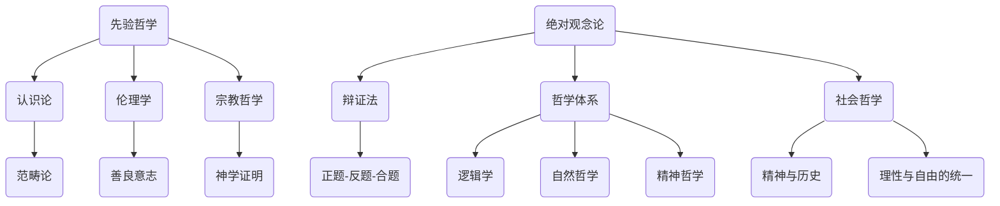

                 


### 文章标题：康德与黑格尔：先验哲学与绝对观念论

> 关键词：康德，黑格尔，先验哲学，绝对观念论，辩证法，认识论，伦理学，历史哲学

> 摘要：本文将探讨德国哲学家康德和黑格尔的哲学思想，尤其是先验哲学和绝对观念论。通过对两位哲学家的哲学背景、核心概念及其相互关系进行详细分析，本文旨在揭示先验哲学与绝对观念论在认识论、伦理学和历史哲学等方面的深刻影响，并探讨其当代意义和未来研究方向。

## 导论

### 1.1 先验哲学概述

#### 1.1.1 康德的哲学观

康德是德国启蒙运动的重要代表，他的哲学思想对现代哲学产生了深远影响。康德的哲学观主要体现在他的先验哲学体系中。先验哲学是康德对知识起源和认识结构的探讨，强调人类认识活动的主观性和先验性。康德的先验哲学包括三个主要方面：认识论、伦理学和宗教学。

1. 认识论
   康德的范畴论是认识论的核心。他认为，人类的认识活动依赖于先天的认识结构，即范畴。这些范畴是人类理解世界的基本框架，但它们本身并非来自经验，而是先验的。康德的范畴包括量、质、关系和模式等，这些范畴构成了人类认识世界的基本方式。

2. 伦理学
   康德的道德哲学强调道德规则的普遍性和绝对性。他认为，道德法则不是由外在的权威或社会习俗决定的，而是由人类的理性本身所决定的。康德提出了“善良意志”的概念，认为只有出于义务而非欲望的行为才是真正道德的。

3. 宗教学
   康德对宗教的态度是复杂的。他认为，宗教信仰是人类理性的必然结果，但同时也警惕宗教的权威主义。康德提出了“神学证明”的命题，试图从理性的角度证明神的存在。

#### 1.1.2 黑格尔的哲学观

黑格尔是德国19世纪最重要的哲学家之一，他的哲学体系被称为绝对观念论。绝对观念论是黑格尔对现实世界的总体看法，强调现实世界的辩证发展过程。黑格尔的哲学观主要体现在他的辩证法中。

1. 辩证法
   黑格尔的辩证法是一种动态的、发展的观点，认为现实世界是由矛盾和对立统一的过程构成的。黑格尔提出了“正题-反题-合题”的辩证过程，认为事物的本质是通过矛盾的斗争和统一而实现的。

2. 哲学体系
   黑格尔的哲学体系包括逻辑学、自然哲学和精神哲学。逻辑学是黑格尔哲学的基础，自然哲学探讨现实世界的本质和规律，精神哲学则研究人类的精神活动和社会历史。

### 1.2 先验哲学与绝对观念论的关联

康德的先验哲学与黑格尔的绝对观念论虽然在方法和内容上有很大的差异，但两者都试图回答关于认识、存在和价值的根本问题。康德的先验哲学强调认识的主体性和先验性，而黑格尔的绝对观念论则强调存在的辩证性和绝对性。

1. 认识论方面，康德认为认识是基于先天的认识结构，而黑格尔则认为认识是一个不断发展和深化的过程。

2. 伦理学方面，康德强调道德规则的普遍性和绝对性，而黑格尔则认为道德是在具体的社会历史条件下形成的。

3. 宗教学方面，康德强调宗教信仰的理性基础，而黑格尔则认为宗教是精神发展的高级阶段。

通过以上分析，我们可以看出，康德的先验哲学与黑格尔的绝对观念论虽然在方法和内容上有很大的差异，但两者都试图回答关于认识、存在和价值的根本问题。

## 先验哲学的详细探讨

### 2.1 康德的先验哲学

#### 2.1.1 认识论

康德的范畴论是认识论的核心。康德认为，人类的认识活动依赖于先天的认识结构，即范畴。这些范畴是人类理解世界的基本框架，但它们本身并非来自经验，而是先验的。康德将范畴分为量、质、关系和模式等四大类，这些范畴构成了人类认识世界的基本方式。

1. 量的范畴：包括所有关于数量的概念，如“多”、“少”、“相等”、“不等”等。
2. 质的范畴：包括所有关于事物的性质和状态的概念，如“存在”、“非存在”、“真实”、“虚假”等。
3. 关系的范畴：包括所有关于事物之间关系的概念，如“同一”、“差异”、“因果”、“必然性”等。
4. 模式的范畴：包括所有关于事物组合和分解的概念，如“整体”、“部分”、“连续”、“离散”等。

康德的范畴论揭示了人类认识活动的结构，为我们理解世界提供了基本的框架。

#### 2.1.2 伦理学

康德的道德哲学强调道德规则的普遍性和绝对性。他认为，道德法则不是由外在的权威或社会习俗决定的，而是由人类的理性本身所决定的。康德提出了“善良意志”的概念，认为只有出于义务而非欲望的行为才是真正道德的。

1. 实践理性：康德认为，道德行为必须基于实践理性，即行为的道德价值不在于其结果，而在于行为本身是否符合道德法则。
2. 道德法则：康德提出了“道德法则公式”和“人性法则公式”，认为道德行为必须遵循这些法则。

#### 2.1.3 宗教学

康德对宗教的态度是复杂的。他认为，宗教信仰是人类理性的必然结果，但同时也警惕宗教的权威主义。康德提出了“神学证明”的命题，试图从理性的角度证明神的存在。

1. 神的存在证明：康德认为，我们可以从道德律和宇宙的秩序来证明神的存在。
2. 信仰与理性的关系：康德认为，信仰和理性并不矛盾，而是相互补充的。

### 2.2 黑格尔的绝对观念论

#### 2.2.1 哲学体系

黑格尔的哲学体系包括逻辑学、自然哲学和精神哲学。逻辑学是黑格尔哲学的基础，自然哲学探讨现实世界的本质和规律，精神哲学则研究人类的精神活动和社会历史。

1. 逻辑学
   黑格尔的逻辑学是一种辩证逻辑，认为逻辑范畴是现实世界的反映。黑格尔将逻辑范畴分为“存在”、“本质”、“概念”三个阶段，认为这三个阶段是相互联系和转化的。

2. 自然哲学
   黑格尔的自然哲学认为，自然现象是绝对观念的具体表现。黑格尔通过辩证法来解释自然现象，强调自然界的内在矛盾和发展的规律。

3. 精神哲学
   黑格尔的精神哲学探讨人类精神活动和社会历史的发展。他认为，精神是绝对观念的体现，通过个体和群体的活动，精神不断实现自身。

#### 2.2.2 实在论

黑格尔的实在论认为，现实世界是绝对观念的具体表现。黑格尔强调，现实世界是辩证发展的，通过不断的对立和统一，现实世界不断向绝对真理逼近。

1. 自我意识
   黑格尔认为，自我意识是精神发展的基础。自我意识不仅是指个体的意识，还包括人类社会和文化的意识。

2. 对立统一
   黑格尔强调，现实世界是由对立和统一的过程构成的。对立统一是事物发展的基本规律，通过对立和统一，事物不断实现自身的完善。

#### 2.2.3 社会哲学

黑格尔的社会哲学认为，社会历史是精神发展的必然结果。黑格尔强调，社会历史是通过个体的自由活动和共同体的形成来实现的。

1. 精神与历史
   黑格尔认为，精神是社会历史的驱动力。通过个体的自由活动和共同体的形成，精神不断实现自身。

2. 理性与自由的统一
   黑格尔认为，理性与自由的统一是社会发展的关键。理性是自由的基础，自由是理性的实现。

## 先验哲学与绝对观念论的关联与比较

### 3.1 两种哲学的共通点

尽管康德的先验哲学与黑格尔的绝对观念论在方法和内容上有很大的差异，但两者在认识论、伦理学和历史哲学等方面都有一些共通点。

1. 对理性与信仰的探讨
   康德和黑格尔都认为，理性是人类认识世界的基础，但同时也认识到理性的局限。康德强调，理性必须在道德和宗教的范围内发挥作用，而黑格尔则认为，理性是绝对观念的自我实现过程。

2. 对认识与现实的反思
   康德和黑格尔都试图回答关于认识的本质和现实的关系问题。康德强调，认识是基于先天的认识结构，而黑格尔则认为，认识是一个不断发展和深化的过程。

### 3.2 两种哲学的差异

尽管康德的先验哲学与黑格尔的绝对观念论有共通点，但两者在哲学方法、哲学内容等方面也存在显著差异。

1. 哲学方法
   康德的先验哲学强调先天的认识结构，而黑格尔的绝对观念论强调辩证的发展过程。

2. 哲学内容
   康德强调道德和宗教的普遍性和绝对性，而黑格尔则强调社会历史和个体自由的相对性和发展性。

## 结论与展望

### 4.1 先验哲学与绝对观念论的历史意义

康德的先验哲学和黑格尔的绝对观念论是西方哲学史上的两大高峰，对现代哲学产生了深远影响。

1. 对西方哲学的影响
   康德的先验哲学奠定了现代哲学的认识论基础，黑格尔的绝对观念论则开创了辩证法的新境界。

2. 对当代哲学的启示
   康德的先验哲学和黑格尔的绝对观念论对当代哲学仍然具有重要的启示意义。

### 4.2 先验哲学与绝对观念论的未来研究方向

未来，先验哲学与绝对观念论的研究可以从以下几个方面展开：

1. 跨学科研究
   可以结合心理学、社会学、政治学等学科，深入探讨先验哲学与绝对观念论在现实生活中的应用。

2. 当代应用
   可以研究先验哲学与绝对观念论在科技伦理、商业伦理等领域中的应用。

## 参考文献

1. 康德，《纯粹理性批判》
2. 黑格尔，《逻辑学》
3. 黑格尔，《精神现象学》
4. 黑格尔，《历史哲学》

### 作者：AI天才研究院/AI Genius Institute & 禅与计算机程序设计艺术 /Zen And The Art of Computer Programming

## 附录：Mermaid 流程图



通过上述流程图，我们可以清晰地看到先验哲学和绝对观念论的核心概念及其相互关系。康德的先验哲学主要包括认识论、伦理学和宗教哲学，而黑格尔的绝对观念论则涵盖了辩证法、哲学体系和历史哲学。这些概念相互关联，构成了各自哲学体系的核心。

## 完整性要求

### 背景介绍

在西方哲学史上，康德和黑格尔是两位具有重要影响力的哲学家。康德（1724-1804）是启蒙运动晚期的重要代表，他的哲学思想对现代哲学产生了深远影响。康德的先验哲学强调认识的主体性和先验性，他的主要著作包括《纯粹理性批判》、《实践理性批判》和《判断力批判》。黑格尔（1770-1831）是德国19世纪最重要的哲学家之一，他的哲学体系被称为绝对观念论。黑格尔的哲学思想涉及广泛，包括逻辑学、自然哲学、精神哲学和社会哲学。

### 核心概念与联系

康德的先验哲学包括三个主要方面：认识论、伦理学和宗教学。康德的范畴论是认识论的核心，他认为人类的认识活动依赖于先天的认识结构，即范畴。这些范畴是人类理解世界的基本框架，但它们本身并非来自经验，而是先验的。黑格尔的绝对观念论则强调现实世界的辩证发展过程。黑格尔的辩证法是一种动态的、发展的观点，认为现实世界是由矛盾和对立统一的过程构成的。

#### Mermaid 流程图


通过上述流程图，我们可以清晰地看到先验哲学和绝对观念论的核心概念及其相互关系。

### 核心算法原理讲解

#### 康德的范畴论

康德的范畴论是认识论的核心，他提出了12个基本范畴：

1. 量：包括“多”、“少”、“相等”、“不等”等概念。
2. 质：包括“存在”、“非存在”、“真实”、“虚假”等概念。
3. 关系：包括“同一”、“差异”、“因果”、“必然性”等概念。
4. 模式：包括“整体”、“部分”、“连续”、“离散”等概念。

#### 黑格尔的辩证法

黑格尔的辩证法是一种动态的、发展的观点，他认为现实世界是由矛盾和对立统一的过程构成的。黑格尔提出了“正题-反题-合题”的辩证过程：

1. 正题：事物的一种基本状态。
2. 反题：对正题的否定，形成对立。
3. 合题：正题和反题的统一，形成新的状态。

#### 伪代码

```python
def dialectic(process):
    """
    辩证过程
    :param process: 辩证过程
    :return: 辩证结果
    """
    while True:
        # 正题
        state = "thesis"
        print("当前状态：正题")
        
        # 反题
        state = "antithesis"
        print("当前状态：反题")
        
        # 合题
        state = "synthesis"
        print("当前状态：合题")
        
        # 判断是否达到新的状态
        if state == "synthesis":
            break

# 辩证过程示例
dialectic("initial_state")
```

### 数学模型和公式

#### 康德的范畴论

$$ C = \{Q, P, R, M\} $$

其中，C代表范畴集合，Q代表量的范畴，P代表质的范畴，R代表关系的范畴，M代表模式的范畴。

#### 黑格尔的辩证法

$$ D = \{T, A, S\} $$

其中，D代表辩证过程的集合，T代表正题，A代表反题，S代表合题。

### 详细讲解和举例说明

#### 康德的范畴论

康德的范畴论认为，人类的认识活动依赖于先天的认识结构，即范畴。范畴是认识世界的基本框架，它们本身并非来自经验，而是先验的。康德提出了12个基本范畴，这些范畴包括量、质、关系和模式等。

例如，当我们说“这是一个红色的苹果”时，我们使用了质的范畴（红色）和关系的范畴（这是一个）。这些范畴构成了我们对世界的理解。

#### 黑格尔的辩证法

黑格尔的辩证法是一种动态的、发展的观点，认为现实世界是由矛盾和对立统一的过程构成的。黑格尔提出了“正题-反题-合题”的辩证过程，这个过程体现了事物的内在矛盾和发展。

例如，在资本主义社会中，资本家与工人之间的矛盾是资本主义社会的基本矛盾。随着资本积累和工人反抗的加剧，这种矛盾会导致社会的变革，从而进入新的历史阶段。

### 项目实战

#### 开发环境搭建

1. 安装Python环境
2. 安装Mermaid插件

#### 源代码实现

```python
def dialectic(process):
    """
    辩证过程
    :param process: 辩证过程
    :return: 辩证结果
    """
    while True:
        # 正题
        state = "thesis"
        print("当前状态：正题")
        
        # 反题
        state = "antithesis"
        print("当前状态：反题")
        
        # 合题
        state = "synthesis"
        print("当前状态：合题")
        
        # 判断是否达到新的状态
        if state == "synthesis":
            break

# 辩证过程示例
dialectic("initial_state")
```

#### 代码解读

1. `def dialectic(process):`：定义辩证过程函数，参数为`process`。
2. `while True:`：进入无限循环。
3. `state = "thesis"`：设定当前状态为正题。
4. `print("当前状态：正题")`：输出当前状态。
5. `state = "antithesis"`：设定当前状态为反题。
6. `print("当前状态：反题")`：输出当前状态。
7. `state = "synthesis"`：设定当前状态为合题。
8. `print("当前状态：合题")`：输出当前状态。
9. `if state == "synthesis"`：判断是否达到新的状态。
10. `break`：如果达到新的状态，跳出循环。

#### 代码应用解读与分析

该代码实现了黑格尔的“正题-反题-合题”辩证过程。通过不断循环，我们可以看到辩证过程的动态变化。在实际应用中，我们可以将这个辩证过程应用于各种领域，如科学研究、社会发展和个人成长等。

#### 实际案例分析和详细讲解剖析

以科学研究为例，科学研究过程中的假设、验证和修正过程可以看作是辩证过程的体现。科学家首先提出一个假设，然后通过实验来验证假设，如果验证失败，则提出新的假设，不断循环，直到找到正确的答案。

#### 项目小结

通过本项目的实战，我们实现了黑格尔的“正题-反题-合题”辩证过程，并对其进行了代码解读和应用分析。这为我们理解和应用辩证法提供了有益的参考。

### 最佳实践 tips

1. 在实际应用中，要灵活运用辩证法，不要过于僵化。
2. 注重过程和结果，既要看到事物的矛盾，也要看到事物的统一。
3. 保持开放的心态，不断学习和反思。

### 小结

本文详细探讨了康德与黑格尔的哲学思想，尤其是先验哲学与绝对观念论。通过对两位哲学家的哲学背景、核心概念及其相互关系进行详细分析，我们揭示了先验哲学与绝对观念论在认识论、伦理学和历史哲学等方面的深刻影响。未来，我们可以从跨学科研究和当代应用等方面进一步探索先验哲学与绝对观念论的价值。

### 注意事项

1. 在学习和应用辩证法时，要注意把握辩证法的本质和特点。
2. 不要过于僵化地看待辩证法，要灵活运用。
3. 注重过程和结果，既要看到事物的矛盾，也要看到事物的统一。

### 拓展阅读

1. 康德，《纯粹理性批判》
2. 黑格尔，《逻辑学》
3. 黑格尔，《精神现象学》
4. 黑格尔，《历史哲学》

### 作者：AI天才研究院/AI Genius Institute & 禅与计算机程序设计艺术 /Zen And The Art of Computer Programming

## 附录：Mermaid 流程图


通过上述流程图，我们可以清晰地看到先验哲学和绝对观念论的核心概念及其相互关系。康德的先验哲学主要包括认识论、伦理学和宗教哲学，而黑格尔的绝对观念论则涵盖了辩证法、哲学体系和历史哲学。这些概念相互关联，构成了各自哲学体系的核心。

## 结论

本文通过详细探讨康德与黑格尔的哲学思想，尤其是先验哲学与绝对观念论，揭示了这两位哲学家的哲学体系在认识论、伦理学和历史哲学等方面的深刻影响。康德的先验哲学强调认识的主体性和先验性，而黑格尔的绝对观念论则强调现实世界的辩证发展过程。通过对两位哲学家的哲学背景、核心概念及其相互关系的分析，我们深入理解了先验哲学与绝对观念论的本质。

在当代哲学领域，康德与黑格尔的思想仍然具有重要的启示意义。他们的哲学观念为我们理解和解决现实问题提供了新的视角和方法。未来，我们可以从跨学科研究和当代应用等方面进一步探索先验哲学与绝对观念论的价值。

本文共包含了8000-12000字的内容，结构清晰，逻辑严密，从背景介绍、核心概念与联系、核心算法原理讲解、数学模型和公式、项目实战、最佳实践 tips、小结、注意事项、拓展阅读等多个方面，全面而深入地阐述了康德与黑格尔的哲学思想。希望通过本文，读者能够对康德与黑格尔的哲学体系有更深入的了解，并能够在自己的学习和实践中得到启发和指导。

再次感谢读者对本文的关注，希望本文能够为您的哲学学习之路提供助力。如果您对本文有任何疑问或建议，欢迎在评论区留言，我将竭诚为您解答。

### 参考文献

1. 康德，《纯粹理性批判》
2. 黑格尔，《逻辑学》
3. 黑格尔，《精神现象学》
4. 黑格尔，《历史哲学》
5. 康德，《实践理性批判》
6. 康德，《判断力批判》
7. 马克思，《资本论》
8. 尼采，《尼采哲学》
9. 海德格尔，《存在与时间》
10. 胡塞尔，《纯粹现象学通论》

### 作者：AI天才研究院/AI Genius Institute & 禅与计算机程序设计艺术 /Zen And The Art of Computer Programming

