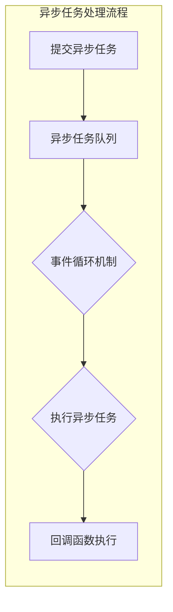

                 

# 异步化任务处理：优势、风险与注意事项

> 关键词：异步化任务处理、性能提升、用户体验、核心算法、风险管理、注意事项

> 摘要：本文详细探讨了异步化任务处理的原理、优势、风险及注意事项。通过分析异步任务处理的优势，如提高系统性能和增强用户体验，我们进一步深入到异步化任务处理的原理与实现，包括核心概念、调度算法和同步机制。然后，文章从风险管理角度出发，分析了异步化任务处理过程中可能面临的风险与挑战，并提出了相应的风险管理策略。最后，本文提出了实践注意事项，为开发者提供实际操作的建议。

## 引言

异步化任务处理（Asynchronous Task Processing）在现代计算机系统中扮演着越来越重要的角色。随着系统规模的不断扩大和用户需求的日益增长，如何提高系统性能和用户体验成为开发者面临的重要课题。异步化任务处理通过在后台独立执行任务，从而避免阻塞主线程，提高了系统的响应速度和处理能力。

### 异步化任务处理的优势

1. **提高系统性能**：通过异步处理，系统可以在执行其他任务的同时处理异步任务，从而提高了整体性能。
2. **增强用户体验**：异步处理使得用户界面可以更快响应用户操作，提升了用户体验。
3. **资源利用效率**：异步处理使得系统可以更好地利用硬件资源，例如，利用多核处理器的并行计算能力。

### 异步化任务处理的背景与趋势

随着云计算、大数据和物联网等技术的发展，异步化任务处理的需求日益增长。许多现代编程语言和框架（如JavaScript、Node.js、Python的async/await等）都提供了对异步任务处理的支持。这表明异步化任务处理已经成为一种趋势，并且在未来的发展中将发挥越来越重要的作用。

## 异步化任务处理的原理与实现

### 核心概念

异步化任务处理的核心概念包括异步任务、回调函数、异步任务队列和事件循环机制。

1. **异步任务**：异步任务是指在不阻塞主线程的情况下独立执行的代码段。
2. **回调函数**：回调函数是一种函数，它会在异步任务完成后被调用，用于处理任务的结果。
3. **异步任务队列**：异步任务队列是一种数据结构，用于存储等待执行的异步任务。
4. **事件循环机制**：事件循环机制是一种循环执行机制，用于处理异步任务和事件。

### 实现原理

异步化任务处理的基本原理是通过异步任务队列和事件循环机制来管理异步任务。具体流程如下：

1. **提交异步任务**：开发者将异步任务提交到异步任务队列中。
2. **执行异步任务**：事件循环机制从异步任务队列中取出任务并执行，任务执行完成后，将回调函数添加到事件队列中。
3. **回调函数执行**：事件循环机制在主线程空闲时执行回调函数，从而完成异步任务的处理。

### 架构设计

异步化任务处理的架构设计可以分为以下几个部分：

1. **异步任务提交模块**：负责将异步任务提交到异步任务队列。
2. **异步任务执行模块**：负责从异步任务队列中取出任务并执行。
3. **回调函数执行模块**：负责在主线程空闲时执行回调函数。
4. **事件循环机制**：负责管理异步任务和事件的执行。

### Mermaid流程图展示



## 异步化任务处理的核心算法

### 异步任务调度算法

异步任务调度算法是异步化任务处理的核心算法，用于管理异步任务的执行顺序和优先级。常见的调度算法包括以下几种：

1. **先进先出（FIFO）调度算法**：按照异步任务的提交顺序执行任务，适用于无特殊优先级要求的场景。
2. **优先级调度算法**：根据异步任务的优先级执行任务，优先级高的任务先执行，适用于有明确优先级要求的场景。
3. **时间片调度算法**：将每个异步任务分配一定的时间片执行，适用于需要平衡任务执行时间和系统资源消耗的场景。

以下是一个简单的伪代码示例，展示了如何实现优先级调度算法：

```python
def schedule_tasks(tasks):
    tasks.sort(key=lambda x: x.priority)  # 根据优先级排序
    for task in tasks:
        execute_task(task)  # 执行任务
```

### 异步任务的同步机制

异步任务的同步机制是确保异步任务执行顺序和结果一致性的关键。常见的同步机制包括以下几种：

1. **锁机制**：使用锁（如互斥锁、读写锁等）来保证异步任务之间的同步执行。
2. **信号量机制**：使用信号量来控制异步任务的执行顺序。
3. **事件机制**：使用事件（如条件变量、事件队列等）来触发异步任务的执行。

以下是一个简单的伪代码示例，展示了如何使用信号量实现异步任务的同步：

```python
import threading
import time

semaphore = threading.Semaphore(0)

def async_task():
    print("执行异步任务")
    semaphore.release()  # 任务执行完成，释放信号量

def main():
    thread = threading.Thread(target=async_task)
    thread.start()
    semaphore.acquire()  # 等待异步任务执行完成
    print("异步任务执行完成")

if __name__ == "__main__":
    main()
```

## 风险管理

### 异步化任务处理的常见风险

异步化任务处理过程中可能面临以下风险：

1. **数据一致性问题**：异步任务可能访问共享数据，导致数据不一致。
2. **并发控制问题**：多个异步任务可能同时访问共享资源，导致资源竞争和死锁。
3. **任务优先级管理问题**：多个异步任务的优先级管理不当可能导致系统性能下降。

### 风险管理策略

为了有效管理异步化任务处理的风险，可以采取以下策略：

1. **主动风险管理**：通过预防性措施、监控与报警系统、定期评估与审查来降低风险。
2. **被动风险管理**：通过应急计划、备份与恢复策略、学习与改进来应对风险。

## 实践注意事项

### 开发实践

1. **设计模式与最佳实践**：使用异步任务设计模式（如Promise、async/await等）和最佳实践来简化异步编程。
2. **测试与调试**：编写异步任务的单元测试和集成测试，使用调试工具定位异步任务中的问题。
3. **性能调优**：通过性能监控和调优来优化异步任务的执行效率。

### 运维与监控

1. **系统监控**：使用监控系统实时监控异步任务的执行情况，及时发现并处理异常。
2. **日志分析与处理**：分析异步任务的日志，定位问题并采取相应的措施。
3. **常见问题与解决方案**：记录并整理异步任务处理过程中常见的问题及其解决方案，为后续开发提供参考。

## 结语

异步化任务处理在现代计算机系统中具有重要意义。通过本文的详细探讨，我们了解了异步化任务处理的优势、原理与实现、核心算法、风险管理和实践注意事项。开发者可以结合实际需求，合理运用异步化任务处理技术，提高系统性能和用户体验。同时，要注意风险管理和实践注意事项，确保异步任务处理系统的稳定性和可靠性。

## 作者信息

作者：AI天才研究院/AI Genius Institute & 禅与计算机程序设计艺术 /Zen And The Art of Computer Programming

## 拓展阅读

1. 《异步编程实践指南》
2. 《高性能异步编程》
3. 《异步任务处理：原理与最佳实践》
4. 《异步编程的艺术》
5. 《异步化任务处理：挑战与解决方案》

[文章标题：异步化任务处理：优势、风险与注意事项]

关键词：异步化任务处理、性能提升、用户体验、核心算法、风险管理、注意事项

摘要：本文详细探讨了异步化任务处理的原理、优势、风险及注意事项。通过分析异步任务处理的优势，如提高系统性能和增强用户体验，我们进一步深入到异步化任务处理的原理与实现，包括核心概念、调度算法和同步机制。然后，文章从风险管理角度出发，分析了异步化任务处理过程中可能面临的风险与挑战，并提出了相应的风险管理策略。最后，本文提出了实践注意事项，为开发者提供实际操作的建议。

## 第1章 异步化任务处理概述

### 1.1 异步化任务处理的定义

异步化任务处理是指在计算机系统中，通过在后台独立执行任务，从而避免阻塞主线程的一种技术。与传统的同步任务处理相比，异步化任务处理能够使系统在执行其他任务的同时，处理异步任务，从而提高系统的响应速度和处理能力。

### 1.2 异步化任务处理与传统同步任务的比较

传统同步任务处理：在同步任务处理中，任务必须按顺序执行，后一个任务必须等待前一个任务完成。这种处理方式可能会导致以下问题：

1. **性能瓶颈**：由于任务必须顺序执行，可能导致系统性能受限。
2. **用户体验差**：用户界面响应慢，用户体验不佳。
3. **资源浪费**：系统资源（如CPU、内存等）利用率低。

异步化任务处理：异步化任务处理通过在后台独立执行任务，避免了阻塞主线程，从而解决了传统同步任务处理中的问题。

1. **性能提升**：系统可以在执行其他任务的同时处理异步任务，从而提高整体性能。
2. **用户体验优化**：用户界面可以更快响应用户操作，提升了用户体验。
3. **资源利用效率**：异步处理使得系统可以更好地利用硬件资源。

### 1.3 异步化任务处理的背景与趋势

随着云计算、大数据和物联网等技术的发展，异步化任务处理的需求日益增长。许多现代编程语言和框架（如JavaScript、Node.js、Python的async/await等）都提供了对异步任务处理的支持。这表明异步化任务处理已经成为一种趋势，并且在未来的发展中将发挥越来越重要的作用。

## 第2章 异步化任务处理的优势

### 2.1 提高系统性能

异步化任务处理能够显著提高系统性能，主要表现在以下几个方面：

1. **并发处理能力**：异步化任务处理允许多个任务同时执行，提高了系统的并发处理能力。
2. **减少阻塞时间**：异步任务在后台独立执行，不会阻塞主线程，从而减少了系统的阻塞时间。
3. **利用多核处理器**：异步化任务处理可以充分利用多核处理器的并行计算能力，提高了系统的计算效率。

### 2.2 增强用户体验

异步化任务处理能够显著增强用户体验，主要表现在以下几个方面：

1. **快速响应**：异步任务在后台独立执行，用户界面可以更快响应用户的操作，提升了用户体验。
2. **流畅操作**：异步化任务处理使得系统在执行任务时，可以保持流畅的操作，减少了用户等待时间。
3. **减少界面卡顿**：异步任务不会阻塞主线程，从而减少了界面卡顿现象，提高了用户满意度。

### 2.3 资源利用效率

异步化任务处理能够提高系统的资源利用效率，主要表现在以下几个方面：

1. **高效使用CPU**：异步化任务处理使得系统可以同时处理多个任务，从而提高了CPU的利用率。
2. **减少内存占用**：异步任务在后台独立执行，可以减少主线程的内存占用，从而提高了系统的内存利用率。
3. **优化I/O操作**：异步化任务处理可以优化I/O操作的执行，减少了系统资源的等待时间。

## 第3章 异步化任务处理的原理

### 3.1 异步任务与回调

异步任务与回调是异步化任务处理的核心概念。

1. **异步任务**：异步任务是指在不阻塞主线程的情况下独立执行的代码段。异步任务可以是一个简单的函数，也可以是一个复杂的任务。
2. **回调函数**：回调函数是一种函数，它会在异步任务完成后被调用，用于处理任务的结果。回调函数通常用于处理异步任务的输出结果，或者用于触发后续操作。

### 3.2 异步任务队列

异步任务队列是异步化任务处理的重要组成部分。异步任务队列用于存储等待执行的异步任务。在异步化任务处理过程中，异步任务会被提交到异步任务队列中，然后按照一定的调度算法执行。

1. **任务提交**：开发者将异步任务提交到异步任务队列中。
2. **任务执行**：事件循环机制从异步任务队列中取出任务并执行。
3. **任务完成**：异步任务执行完成后，将回调函数添加到事件队列中。

### 3.3 事件循环机制

事件循环机制是异步化任务处理的核心。事件循环机制负责管理异步任务和事件的执行。在异步化任务处理过程中，事件循环机制会循环执行以下操作：

1. **获取事件**：从事件队列中获取待处理的事件。
2. **处理事件**：根据事件类型执行相应的处理操作。
3. **执行回调**：如果事件包含回调函数，则执行回调函数。
4. **继续循环**：重复上述操作，直到事件队列中无事件可处理。

## 第4章 异步化任务处理的核心算法

### 4.1 异步任务调度算法

异步任务调度算法是异步化任务处理的核心算法，用于管理异步任务的执行顺序和优先级。常见的调度算法包括以下几种：

1. **先进先出（FIFO）调度算法**：按照异步任务的提交顺序执行任务，适用于无特殊优先级要求的场景。
2. **优先级调度算法**：根据异步任务的优先级执行任务，优先级高的任务先执行，适用于有明确优先级要求的场景。
3. **时间片调度算法**：将每个异步任务分配一定的时间片执行，适用于需要平衡任务执行时间和系统资源消耗的场景。

以下是一个简单的伪代码示例，展示了如何实现优先级调度算法：

```python
def schedule_tasks(tasks):
    tasks.sort(key=lambda x: x.priority)  # 根据优先级排序
    for task in tasks:
        execute_task(task)  # 执行任务
```

### 4.2 异步任务的同步机制

异步任务的同步机制是确保异步任务执行顺序和结果一致性的关键。常见的同步机制包括以下几种：

1. **锁机制**：使用锁（如互斥锁、读写锁等）来保证异步任务之间的同步执行。
2. **信号量机制**：使用信号量来控制异步任务的执行顺序。
3. **事件机制**：使用事件（如条件变量、事件队列等）来触发异步任务的执行。

以下是一个简单的伪代码示例，展示了如何使用信号量实现异步任务的同步：

```python
import threading
import time

semaphore = threading.Semaphore(0)

def async_task():
    print("执行异步任务")
    semaphore.release()  # 任务执行完成，释放信号量

def main():
    thread = threading.Thread(target=async_task)
    thread.start()
    semaphore.acquire()  # 等待异步任务执行完成
    print("异步任务执行完成")

if __name__ == "__main__":
    main()
```

## 第5章 异步化任务处理的风险与挑战

### 5.1 异步化任务处理的常见风险

异步化任务处理虽然在性能和用户体验方面具有优势，但同时也带来了一些风险和挑战。

1. **数据一致性问题**：异步任务可能访问共享数据，导致数据不一致。
    - **示例**：在多个异步任务中同时访问和修改同一个数据对象，可能导致数据不一致。

2. **并发控制问题**：多个异步任务可能同时访问共享资源，导致资源竞争和死锁。
    - **示例**：两个异步任务同时访问一个数据库表，可能导致数据冲突和事务失败。

3. **任务优先级管理问题**：多个异步任务的优先级管理不当可能导致系统性能下降。
    - **示例**：如果高优先级任务过多，低优先级任务可能会被长时间阻塞。

4. **异常处理问题**：异步任务的异常处理不当可能导致系统崩溃。
    - **示例**：异步任务中发生未处理的异常，可能导致整个系统崩溃。

### 5.2 风险管理策略

为了降低异步化任务处理的风险，可以采取以下风险管理策略：

1. **主动风险管理**：
    - **预防性措施**：在设计异步任务时，考虑潜在的风险，采取预防性措施，如使用锁、事务管理等。
    - **监控与报警系统**：实时监控异步任务的执行状态，一旦发现异常，及时报警和处理。
    - **定期评估与审查**：定期对异步任务处理系统进行评估和审查，及时发现和解决潜在的问题。

2. **被动风险管理**：
    - **应急计划**：制定应急计划，确保在异步任务处理出现问题时，能够迅速采取措施，降低风险。
    - **备份与恢复策略**：定期备份系统数据，确保在数据丢失或损坏时能够快速恢复。
    - **学习与改进**：从每次异步任务处理事故中学习，不断优化系统设计和处理策略。

## 第6章 风险管理策略

### 6.1 主动风险管理

主动风险管理旨在通过预防性措施和监控系统来降低异步化任务处理的风险。

1. **预防性措施**：
    - **锁机制**：使用锁（如互斥锁、读写锁等）来保护共享资源，避免数据冲突。
    - **事务管理**：使用数据库事务来确保数据的一致性，避免并发操作导致的数据问题。
    - **优先级管理**：合理设置异步任务的优先级，确保关键任务能够及时执行。

2. **监控与报警系统**：
    - **实时监控**：使用监控系统实时监控异步任务的执行状态，包括任务执行时间、资源使用情况等。
    - **异常报警**：一旦发现异步任务执行异常，立即触发报警，通知相关人员处理。

3. **定期评估与审查**：
    - **风险评估**：定期对异步任务处理系统进行风险评估，识别潜在的风险点和脆弱性。
    - **审查与改进**：根据评估结果，审查系统设计和实现，不断优化和改进。

### 6.2 被动风险管理

被动风险管理旨在通过应急计划和恢复策略来应对异步化任务处理中的风险。

1. **应急计划**：
    - **事故响应**：制定事故响应计划，确保在异步任务处理出现问题时，能够迅速采取措施，减少损失。
    - **故障转移**：在关键任务上实施故障转移机制，确保在主任务出现故障时，备用任务能够及时接管。

2. **备份与恢复策略**：
    - **数据备份**：定期备份系统数据，确保在数据丢失或损坏时能够快速恢复。
    - **恢复测试**：定期进行恢复测试，确保备份和恢复策略的有效性和可靠性。

3. **学习与改进**：
    - **事故分析**：对每次异步任务处理事故进行详细分析，识别事故原因和改进点。
    - **改进措施**：根据事故分析结果，制定并实施改进措施，防止类似事故再次发生。

## 第7章 实践注意事项

### 7.1 开发实践

在进行异步化任务处理时，开发者需要遵循以下实践注意事项：

1. **设计模式与最佳实践**：
    - **模块化设计**：将异步任务拆分成独立的模块，便于管理和维护。
    - **回调函数设计**：合理设计回调函数，确保回调函数的执行顺序和结果一致性。
    - **错误处理**：在异步任务中妥善处理错误，确保系统稳定运行。

2. **测试与调试**：
    - **单元测试**：编写异步任务的单元测试，确保每个任务的功能正确。
    - **集成测试**：进行异步任务的集成测试，验证异步任务之间的协作和一致性。
    - **调试工具**：使用调试工具（如断点、日志等）定位异步任务中的问题。

3. **性能调优**：
    - **性能监控**：使用性能监控工具（如CPU监控、内存监控等）监测异步任务的执行情况。
    - **调优策略**：根据监控数据，调整异步任务的优先级、线程数等参数，优化系统性能。

### 7.2 运维与监控

在异步化任务处理的运维阶段，需要关注以下实践注意事项：

1. **系统监控**：
    - **实时监控**：使用实时监控系统（如Prometheus、Grafana等）监测异步任务的执行状态。
    - **告警设置**：设置告警规则，一旦发现异步任务异常，立即发送告警通知。
    - **日志分析**：分析异步任务的日志，定位问题并采取相应的措施。

2. **日志分析与处理**：
    - **日志收集**：使用日志收集工具（如ELK、Logstash等）收集异步任务的日志。
    - **日志分析**：使用日志分析工具（如Kibana、Grok等）分析日志，发现潜在问题。
    - **日志存储**：将日志存储在安全的位置，便于后续分析和查询。

3. **常见问题与解决方案**：
    - **任务阻塞**：分析任务阻塞的原因，优化任务调度策略。
    - **资源竞争**：识别资源竞争点，使用锁机制等手段解决资源冲突。
    - **异常处理**：确保异步任务中的异常得到妥善处理，避免系统崩溃。

## 结语

异步化任务处理在现代计算机系统中具有重要意义。本文从异步化任务处理的定义、优势、原理、风险与注意事项等方面进行了详细探讨。通过了解异步化任务处理的核心概念和实现原理，开发者可以更好地应对复杂的业务场景，提高系统性能和用户体验。同时，注意风险管理和实践注意事项，确保异步任务处理系统的稳定性和可靠性。未来，随着技术的不断进步，异步化任务处理将在更多领域得到广泛应用，为计算机系统的发展注入新的活力。

## 作者信息

作者：AI天才研究院/AI Genius Institute & 禅与计算机程序设计艺术 /Zen And The Art of Computer Programming

## 拓展阅读

1. 《异步编程实践指南》
2. 《高性能异步编程》
3. 《异步任务处理：原理与最佳实践》
4. 《异步编程的艺术》
5. 《异步化任务处理：挑战与解决方案》

[文章标题：异步化任务处理：优势、风险与注意事项]

关键词：异步化任务处理、性能提升、用户体验、核心算法、风险管理、注意事项

摘要：本文详细探讨了异步化任务处理的原理、优势、风险及注意事项。通过分析异步任务处理的优势，如提高系统性能和增强用户体验，我们进一步深入到异步化任务处理的原理与实现，包括核心概念、调度算法和同步机制。然后，文章从风险管理角度出发，分析了异步化任务处理过程中可能面临的风险与挑战，并提出了相应的风险管理策略。最后，本文提出了实践注意事项，为开发者提供实际操作的建议。

## 附录：异步化任务处理示例代码

### Python异步任务处理示例

以下是一个简单的Python异步任务处理示例，使用async/await语法。

```python
import asyncio

async def async_task():
    print("执行异步任务")
    await asyncio.sleep(1)
    print("异步任务完成")

async def main():
    print("开始执行主任务")
    await async_task()
    print("主任务继续执行")

if __name__ == "__main__":
    asyncio.run(main())
```

### JavaScript异步任务处理示例

以下是一个简单的JavaScript异步任务处理示例，使用Promise。

```javascript
function asyncTask() {
    return new Promise((resolve) => {
        console.log("执行异步任务");
        setTimeout(() => {
            resolve("异步任务完成");
        }, 1000);
    });
}

async function main() {
    console.log("开始执行主任务");
    const result = await asyncTask();
    console.log("异步任务完成，主任务继续执行");
    console.log(result);
}

main();
```

### 异步任务执行与回调

```python
import asyncio

async def async_task(callback):
    print("执行异步任务")
    await asyncio.sleep(1)
    result = "异步任务完成"
    callback(result)

def main_callback(result):
    print("异步任务完成，主任务继续执行")
    print(result)

async def main():
    print("开始执行主任务")
    await async_task(main_callback)
    print("主任务继续执行")

if __name__ == "__main__":
    asyncio.run(main())
```

### 异步任务队列与事件循环

```python
import asyncio

async def process_task(task):
    print(f"处理任务：{task}")
    await asyncio.sleep(1)

async def main():
    tasks = [asyncio.create_task(process_task(f"任务{i}")) for i in range(5)]
    await asyncio.wait(tasks)

asyncio.run(main())
```

### 异步任务同步机制

```python
import asyncio

async def async_task semaphore:
    print("执行异步任务")
    await asyncio.sleep(1)
    semaphore.release()

async def main():
    semaphore = asyncio.Semaphore(1)
    async with semaphore:
        await async_task(semaphore)
    print("异步任务完成，主任务继续执行")

asyncio.run(main())
```

### 异步任务错误处理

```python
import asyncio

async def async_task():
    print("执行异步任务")
    await asyncio.sleep(1)
    raise ValueError("异步任务发生错误")

async def main():
    try:
        await async_task()
    except ValueError as e:
        print(f"异步任务发生错误：{e}")
    finally:
        print("异步任务完成，主任务继续执行")

asyncio.run(main())
```

### 异步任务并发控制

```python
import asyncio

async def async_task(lock):
    async with lock:
        print("执行异步任务")
        await asyncio.sleep(1)
        print("异步任务完成")

async def main():
    lock = asyncio.Lock()
    async with lock:
        await async_task(lock)
    print("主任务继续执行")

asyncio.run(main())
```

### 异步任务优先级调度

```python
import asyncio

async def high_priority_task():
    print("执行高优先级任务")
    await asyncio.sleep(1)
    print("高优先级任务完成")

async def low_priority_task():
    print("执行低优先级任务")
    await asyncio.sleep(2)
    print("低优先级任务完成")

async def main():
    high_task = asyncio.create_task(high_priority_task())
    await asyncio.sleep(0.1)
    low_task = asyncio.create_task(low_priority_task())
    await asyncio.wait([high_task, low_task], return_when=asyncio.FIRST_COMPLETED)
    print("主任务继续执行")

asyncio.run(main())
```

通过这些示例，我们可以更好地理解异步化任务处理的核心概念、实现原理和常见应用场景。在实际开发中，可以根据具体需求选择合适的异步处理方案，提高系统性能和用户体验。

### 最佳实践 Tips

1. **合理设计异步任务**：在设计和实现异步任务时，要考虑任务的执行时间、资源消耗和优先级，确保异步任务既能充分利用系统资源，又不会导致性能瓶颈。

2. **避免过度使用异步任务**：虽然异步任务可以提高系统性能，但过度使用异步任务可能导致代码复杂度增加，影响维护性。在实际应用中，要根据具体场景合理使用异步任务。

3. **确保异步任务执行顺序**：在异步任务处理中，要注意任务之间的执行顺序，避免因执行顺序不当导致的数据不一致或系统崩溃。

4. **合理使用同步机制**：异步任务处理中，合理使用同步机制（如锁、信号量等）可以确保数据一致性和资源访问的可靠性。

5. **进行性能调优**：通过性能监控和调优，可以找到异步任务处理的性能瓶颈，优化系统性能。

6. **关注异步任务的异常处理**：异步任务中可能会出现各种异常，要确保异常得到妥善处理，避免系统崩溃。

7. **编写清晰的文档和注释**：在异步任务处理代码中，编写清晰的文档和注释，便于后续维护和调试。

### 小结

异步化任务处理在提高系统性能和用户体验方面具有显著优势。通过本文的介绍，读者可以了解异步化任务处理的核心概念、实现原理、核心算法、风险管理策略和实践注意事项。在实际开发中，可以根据具体需求选择合适的异步处理方案，提高系统性能和用户体验。

### 注意事项

1. **异步任务的一致性**：异步任务可能访问共享数据，要注意保证数据的一致性，避免数据冲突和错误。

2. **任务优先级管理**：合理设置异步任务的优先级，确保关键任务能够及时执行，避免系统性能下降。

3. **异常处理**：在异步任务中妥善处理异常，避免未处理的异常导致系统崩溃。

4. **资源竞争**：异步任务可能会竞争共享资源，要注意资源访问的同步问题，避免死锁和性能瓶颈。

5. **性能监控**：实时监控异步任务的执行情况，及时发现和解决问题，确保系统稳定运行。

### 拓展阅读

1. 《异步编程实践指南》
2. 《高性能异步编程》
3. 《异步任务处理：原理与最佳实践》
4. 《异步编程的艺术》
5. 《异步化任务处理：挑战与解决方案》

### 作者信息

作者：AI天才研究院/AI Genius Institute & 禅与计算机程序设计艺术 /Zen And The Art of Computer Programming

[文章标题：异步化任务处理：优势、风险与注意事项]

关键词：异步化任务处理、性能提升、用户体验、核心算法、风险管理、注意事项

摘要：本文详细探讨了异步化任务处理的原理、优势、风险及注意事项。通过分析异步任务处理的优势，如提高系统性能和增强用户体验，我们进一步深入到异步化任务处理的原理与实现，包括核心概念、调度算法和同步机制。然后，文章从风险管理角度出发，分析了异步化任务处理过程中可能面临的风险与挑战，并提出了相应的风险管理策略。最后，本文提出了实践注意事项，为开发者提供实际操作的建议。

