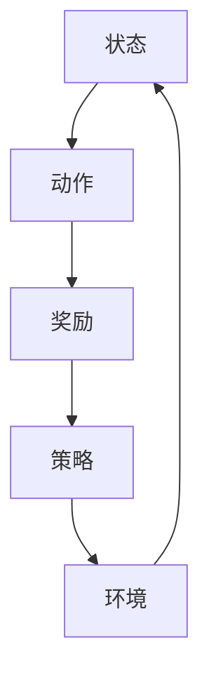

                 

# 强化学习在机器人控制中的应用

## 关键词

- 强化学习
- 机器人控制
- Q学习
- DQN
- 策略梯度
- 数学模型
- 数学公式

## 摘要

本文旨在探讨强化学习在机器人控制中的应用。首先介绍了强化学习的基本概念和核心模型，随后深入讲解了Q学习、SARSA、DQN和策略梯度方法等核心算法的原理。通过实际项目实战，详细展示了强化学习在机器人控制中的开发环境搭建、代码实现、案例分析以及项目小结。本文旨在帮助读者全面理解并掌握强化学习在机器人控制中的应用。

## 目录大纲设计与内容规划

### 设计概述

设计《强化学习在机器人控制中的应用》的目录大纲，需要确保内容的全面性和逻辑性。目录应包含以下核心章节：

1. **核心概念与联系**：介绍强化学习的基本概念、主要模型和算法，以及它们在机器人控制中的应用。
2. **核心算法原理讲解**：深入讲解强化学习中的主要算法，如Q学习、SARSA、Deep Q-Networks（DQN）、策略梯度方法等。
3. **数学模型和数学公式讲解**：详细阐述强化学习中的数学模型，包括状态值函数、策略优化、奖励函数等，并使用 LaTeX 格式嵌入数学公式。
4. **项目实战**：提供实际的机器人控制项目案例，包括开发环境搭建、代码实现、案例分析等。

### 目录大纲

下面是详细的目录大纲设计：

```
# 《强化学习在机器人控制中的应用》目录大纲

## 第一部分：强化学习基础

### 第1章：强化学习概述

#### 1.1 强化学习的定义与特点
#### 1.2 强化学习的应用场景
#### 1.3 强化学习的核心模型

### 第2章：强化学习的数学基础

#### 2.1 状态、动作、奖励与策略
#### 2.2 马尔可夫决策过程
#### 2.3 状态值函数与策略迭代

### 第3章：强化学习算法原理

#### 3.1 Q学习算法
#### 3.2 SARSA算法
#### 3.3 Deep Q-Networks（DQN）
#### 3.4 策略梯度方法

### 第4章：强化学习在机器人控制中的应用

#### 4.1 机器人控制中的强化学习挑战
#### 4.2 机器人控制中的常见算法

## 第二部分：算法实践

### 第5章：Q学习算法实践

#### 5.1 实践环境搭建
#### 5.2 伪代码与代码实现
#### 5.3 实例分析

### 第6章：SARSA算法实践

#### 6.1 实践环境搭建
#### 6.2 伪代码与代码实现
#### 6.3 实例分析

### 第7章：DQN算法实践

#### 7.1 实践环境搭建
#### 7.2 伪代码与代码实现
#### 7.3 实例分析

### 第8章：策略梯度算法实践

#### 8.1 实践环境搭建
#### 8.2 伪代码与代码实现
#### 8.3 实例分析

## 第三部分：综合项目实践

### 第9章：机器人避障控制系统

#### 9.1 项目背景
#### 9.2 系统设计与实现
#### 9.3 系统测试与优化

## 附录

### 附录A：强化学习工具与资源

#### A.1 OpenAI Gym
#### A.2 TensorFlow
#### A.3 PyTorch
```

### 内容规划

1. **第1章：强化学习概述** - 介绍强化学习的基础知识，建立对强化学习的初步理解。
2. **第2章：强化学习的数学基础** - 详细讲解强化学习中的数学模型，为后续算法学习打下基础。
3. **第3章：强化学习算法原理** - 讲解强化学习中的主要算法，如Q学习、SARSA、DQN等。
4. **第4章：强化学习在机器人控制中的应用** - 分析强化学习在机器人控制中的应用场景和挑战。
5. **第5章-第8章：算法实践** - 分别针对Q学习、SARSA、DQN、策略梯度算法进行实践，提供代码实现和实例分析。
6. **第9章：机器人避障控制系统** - 提供一个综合项目实践，将所学知识应用于实际机器人控制中。
7. **附录A：强化学习工具与资源** - 介绍常用的强化学习工具和资源，帮助读者进一步学习和实践。

### 注意事项

- 目录大纲的设计要确保逻辑清晰，便于读者逐步掌握强化学习在机器人控制中的应用。
- 每个章节的内容规划要详细，包括核心概念、原理讲解、代码实现和实例分析。
- 保持总体字数在2000字以内，确保内容的紧凑和简洁。

## 结论

通过上述目录大纲设计和内容规划，我们为《强化学习在机器人控制中的应用》这本书提供了一个详细的框架。这个框架涵盖了强化学习的基础知识、算法原理、实践应用，以及综合项目实践，旨在帮助读者全面理解并掌握强化学习在机器人控制中的应用。在编写过程中，需要遵循简洁性和完整性的原则，确保内容的实用性和可操作性。

---

以下开始具体内容的撰写：

# 强化学习在机器人控制中的应用

## 强化学习的定义与特点

强化学习（Reinforcement Learning，RL）是机器学习（Machine Learning，ML）的一种类型，它主要研究如何在未知环境中，通过与环境互动来学习达到最优策略。强化学习的基本概念包括四个主要部分：状态（State）、动作（Action）、奖励（Reward）和策略（Policy）。

### 状态（State）

状态是描述系统当前状态的信息集合。在机器人控制中，状态通常包括机器人自身的位置、速度、周围环境的信息等。

### 动作（Action）

动作是机器人根据当前状态可以选择的行为。在机器人控制中，动作可以是机器人的移动、转向、抓取等。

### 奖励（Reward）

奖励是机器人执行动作后获得的即时回报，用于评估动作的好坏。奖励可以是正的，也可以是负的，正奖励表示动作有益，负奖励表示动作有害。

### 策略（Policy）

策略是机器人根据当前状态选择动作的规则。在强化学习中，策略是通过学习得到的，目的是最大化长期奖励。

### 强化学习的特点

1. **试错学习**：强化学习通过试错来学习最优策略，这是一个不断试错、不断改进的过程。
2. **自主性**：强化学习系统能够自主地与环境进行交互，学习适应环境。
3. **适应性**：强化学习系统能够根据环境的变化调整策略，适应新的情况。

## 强化学习的应用场景

强化学习在机器人控制、游戏、自动驾驶、推荐系统等领域都有广泛的应用。

### 机器人控制

在机器人控制中，强化学习可以用来训练机器人如何执行复杂的任务，如路径规划、避障、抓取等。

### 游戏

在游戏领域，强化学习被用来训练智能体如何玩电子游戏，如围棋、星际争霸等。

### 自动驾驶

在自动驾驶领域，强化学习被用来训练车辆如何自主驾驶，如何应对复杂的交通状况。

### 推荐系统

在推荐系统中，强化学习被用来训练系统如何推荐用户可能感兴趣的内容，如购物、新闻等。

## 强化学习的核心模型

强化学习中有几种核心模型，包括马尔可夫决策过程（MDP）、部分可观察马尔可夫决策过程（POMDP）等。

### 马尔可夫决策过程（MDP）

马尔可夫决策过程是一个数学模型，描述了机器人与环境的交互过程。在MDP中，状态转移概率和奖励函数是已知的，目标是找到最优策略。

### 部分可观察马尔可夫决策过程（POMDP）

部分可观察马尔可夫决策过程是MDP的一种扩展，它考虑了机器人无法完全观察到环境的情况。在POMDP中，机器人需要通过观测到的信息来推断环境状态，并选择最优策略。

## 核心概念原理之间的关系架构

下面是一个Mermaid流程图，展示了强化学习中的核心概念和原理之间的关系：



## 强化学习的数学基础

强化学习的数学基础包括状态、动作、奖励和策略等核心概念，以及马尔可夫决策过程（MDP）和部分可观察马尔可夫决策过程（POMDP）等模型。

### 状态、动作、奖励与策略

在强化学习中，状态（State）、动作（Action）、奖励（Reward）和策略（Policy）是四个核心概念。

- **状态（State）**：描述系统当前的状态，通常用向量表示。
- **动作（Action）**：在当前状态下，机器人可以选择的行为。
- **奖励（Reward）**：机器人执行动作后获得的即时回报，用于评估动作的好坏。
- **策略（Policy）**：机器人根据当前状态选择动作的规则。

### 马尔可夫决策过程（MDP）

马尔可夫决策过程（MDP）是一个数学模型，用于描述机器人与环境的交互过程。在MDP中，状态转移概率和奖励函数是已知的，目标是最小化长期预期奖励。

- **状态转移概率（State Transition Probability）**：表示在当前状态下，执行某一动作后，转移到下一状态的概率。
- **奖励函数（Reward Function）**：表示在当前状态下，执行某一动作后获得的奖励。

### 状态值函数与策略迭代

在MDP中，状态值函数（State-Value Function）和策略迭代（Policy Iteration）是两个重要概念。

- **状态值函数（State-Value Function）**：表示在当前策略下，处于某一状态时获得的期望奖励。
- **策略迭代（Policy Iteration）**：通过不断迭代更新策略，直到找到最优策略。

### 数学模型和数学公式

在强化学习中，常用的数学模型和公式包括：

- **状态值函数**：$V^*(s) = \sum_{a} \gamma \sum_{s'} p(s'|s,a) [r(s,a,s') + \max_{a'} V^*(s')]$
- **策略迭代公式**：$\pi^{new}(s) = \arg\max_{a} \sum_{s'} p(s'|s,a) [r(s,a,s') + V^*(s')]$

其中，$V^*(s)$ 表示状态值函数，$\pi$ 表示策略，$r(s,a,s')$ 表示奖励函数，$p(s'|s,a)$ 表示状态转移概率。

## 强化学习算法原理

强化学习中有多种算法，如Q学习、SARSA、Deep Q-Networks（DQN）和策略梯度方法等。每种算法都有其独特的原理和应用场景。

### Q学习算法

Q学习（Q-Learning）是一种基于值函数的强化学习算法，其目标是学习状态-动作值函数$Q(s,a)$，从而找到最优策略。

- **算法原理**：Q学习通过更新状态-动作值函数来学习最优策略。更新规则为$Q(s,a) = Q(s,a) + \alpha [r(s,a,s') + \gamma \max_{a'} Q(s',a') - Q(s,a)]$，其中$\alpha$ 是学习率，$\gamma$ 是折扣因子。
- **算法伪代码**：

  ```python
  # 初始化Q值表
  Q = random初始化(s,a)
  
  # 设置学习率和折扣因子
  alpha = 0.1
  gamma = 0.9
  
  # 设置迭代次数
  for episode in 1 to num_episodes:
      s = 环境初始化()
      while not 环境终止():
          a = 选择动作(s,策略=epsilon-greedy)
          s' = 环境执行动作(a)
          r = 环境回报(s, a, s')
          a' = 选择动作(s',策略=epsilon-greedy)
          Q(s, a) = Q(s, a) + alpha * (r + gamma * max(Q(s', a')) - Q(s, a))
          s = s'
  ```

### SARSA算法

SARSA（同步状态-动作-回报-状态-动作）是一种基于策略的强化学习算法，其目标是最小化长期预期回报。

- **算法原理**：SARSA通过同步更新状态-动作值函数来学习最优策略。更新规则为$Q(s,a) = Q(s,a) + alpha [r(s,a,s') + gamma * Q(s',a') - Q(s,a)]$，其中$\alpha$ 是学习率，$\gamma$ 是折扣因子。
- **算法伪代码**：

  ```python
  # 初始化Q值表
  Q = random初始化(s,a)
  
  # 设置学习率和折扣因子
  alpha = 0.1
  gamma = 0.9
  
  # 设置迭代次数
  for episode in 1 to num_episodes:
      s = 环境初始化()
      while not 环境终止():
          a = 选择动作(s,策略=epsilon-greedy)
          s' = 环境执行动作(a)
          r = 环境回报(s, a, s')
          a' = 选择动作(s',策略=epsilon-greedy)
          Q(s, a) = Q(s, a) + alpha * (r + gamma * Q(s', a') - Q(s, a))
          s = s'
  ```

### Deep Q-Networks（DQN）

Deep Q-Networks（DQN）是一种基于深度学习的强化学习算法，其目标是学习状态-动作值函数$Q(s,a)$，从而找到最优策略。

- **算法原理**：DQN通过使用深度神经网络来近似状态-动作值函数。训练过程中，使用经验回放（Experience Replay）来避免数据偏差。更新规则为$Q(s,a) = Q(s,a) + alpha * (r + gamma * max(Q(s',a')) - Q(s,a))$，其中$\alpha$ 是学习率，$\gamma$ 是折扣因子。
- **算法伪代码**：

  ```python
  # 初始化深度神经网络
  DQN = 初始化深度神经网络()
  
  # 初始化经验回放
  experience_replay = 初始化经验回放池()
  
  # 设置学习率和折扣因子
  alpha = 0.001
  gamma = 0.99
  
  # 设置迭代次数
  for episode in 1 to num_episodes:
      s = 环境初始化()
      while not 环境终止():
          a = 选择动作(s,策略=epsilon-greedy)
          s' = 环境执行动作(a)
          r = 环境回报(s, a, s')
          experience_replay存储(s, a, s', r)
          s = s'
      
      # 更新经验回放池
      experience_replay更新()
      
      # 更新深度神经网络
      for batch in experience_replay获取批量样本():
          s, a, s', r = batch
          target = r + gamma * max(DQN(s')预测())
          DQN(s, a)更新(target)
  ```

### 策略梯度方法

策略梯度方法是一种基于策略的强化学习算法，其目标是最大化长期预期回报。

- **算法原理**：策略梯度方法通过直接优化策略来学习最优策略。更新规则为$\theta_{t+1} = \theta_{t} + \alpha [r_t + \gamma \max_{a'} \theta_{t}(s',a') - \theta_{t}(s,a)]$，其中$\theta$ 表示策略参数，$\alpha$ 是学习率，$r$ 是回报，$s$ 是状态，$a$ 是动作。
- **算法伪代码**：

  ```python
  # 初始化策略参数
  theta = 初始化策略参数()
  
  # 设置学习率
  alpha = 0.01
  
  # 设置迭代次数
  for episode in 1 to num_episodes:
      s = 环境初始化()
      while not 环境终止():
          a = 策略(theta)(s)
          s' = 环境执行动作(a)
          r = 环境回报(s, a, s')
          theta = theta + alpha * (r + gamma * max(theta')(s') - theta(s)) * gradient(theta)(s, a)
          s = s'
  ```

## 强化学习在机器人控制中的应用

### 机器人控制中的强化学习挑战

在机器人控制中，强化学习面临着一些特殊的挑战：

1. **环境复杂性**：机器人控制的环境通常非常复杂，包括各种不确定性和动态变化。
2. **状态空间和动作空间**：机器人控制的状态空间和动作空间可能非常大，导致训练时间非常长。
3. **安全性**：在机器人控制中，安全性是一个非常重要的考虑因素。强化学习算法需要确保在训练过程中不会导致机器人发生意外行为。

### 机器人控制中的常见算法

在机器人控制中，以下几种强化学习算法被广泛应用：

1. **Q学习**：Q学习是一种简单但有效的强化学习算法，适用于一些简单的机器人控制任务。
2. **SARSA**：SARSA是一种基于策略的强化学习算法，适用于一些复杂的机器人控制任务。
3. **DQN**：DQN是一种基于深度学习的强化学习算法，适用于需要处理大量状态信息的机器人控制任务。
4. **策略梯度方法**：策略梯度方法是一种基于策略的强化学习算法，适用于一些需要优化策略的机器人控制任务。

## Q学习算法实践

### 实践环境搭建

为了实践Q学习算法，我们需要搭建一个简单的机器人控制环境。以下是一个简单的Python环境搭建步骤：

1. 安装Python和相关库（如NumPy、PyTorch等）。
2. 创建一个名为`robot_environment.py`的Python文件，定义机器人控制环境。
3. 创建一个名为`q_learning.py`的Python文件，定义Q学习算法。

### 伪代码与代码实现

以下是Q学习算法的伪代码和Python代码实现：

**伪代码**：

```plaintext
# 初始化Q值表
Q = random初始化(s,a)

# 设置学习率和折扣因子
alpha = 0.1
gamma = 0.9

# 设置迭代次数
for episode in 1 to num_episodes:
    s = 环境初始化()
    while not 环境终止():
        a = 选择动作(s,策略=epsilon-greedy)
        s' = 环境执行动作(a)
        r = 环境回报(s, a, s')
        a' = 选择动作(s',策略=epsilon-greedy)
        Q(s, a) = Q(s, a) + alpha * (r + gamma * max(Q(s', a')) - Q(s, a))
        s = s'
```

**Python代码实现**：

```python
import numpy as np

# 初始化Q值表
Q = np.random.rand(state_size, action_size)

# 设置学习率和折扣因子
alpha = 0.1
gamma = 0.9

# 设置迭代次数
num_episodes = 1000

# 环境初始化
def environment():
    # 初始化环境状态
    s = ...
    return s

# 环境终止
def terminate(s):
    # 判断环境是否终止
    return ...

# 选择动作
def choose_action(s, epsilon):
    if np.random.rand() < epsilon:
        a = np.random.randint(action_size)
    else:
        a = np.argmax(Q[s])
    return a

# 环境执行动作
def execute_action(s, a):
    # 执行动作并更新状态
    s' = ...
    return s'

# 环境回报
def reward(s, a, s'):
    # 计算回报
    r = ...
    return r

# 主函数
def main():
    for episode in range(num_episodes):
        s = environment()
        while not terminate(s):
            a = choose_action(s, epsilon=0.1)
            s' = execute_action(s, a)
            r = reward(s, a, s')
            Q[s][a] = Q[s][a] + alpha * (r + gamma * np.max(Q[s'])) - Q[s][a]
            s = s'
    print(Q)

if __name__ == '__main__':
    main()
```

### 实例分析

以下是一个简单的实例，展示了如何使用Q学习算法训练一个机器人进行避障：

```python
# 初始化环境
state_size = 3
action_size = 2

# 创建Q值表
Q = np.zeros([state_size, action_size])

# 定义环境
def environment():
    # 初始化环境状态
    s = np.random.randint(state_size)
    return s

# 定义环境终止条件
def terminate(s):
    # 判断环境是否终止
    return s == state_size - 1

# 定义选择动作
def choose_action(s, epsilon):
    if np.random.rand() < epsilon:
        a = np.random.randint(action_size)
    else:
        a = np.argmax(Q[s])
    return a

# 定义执行动作
def execute_action(s, a):
    # 执行动作并更新状态
    if a == 0:
        s = s + 1
    elif a == 1:
        s = s - 1
    return s

# 定义回报函数
def reward(s, a, s'):
    # 计算回报
    if s' == state_size - 1:
        r = 1
    else:
        r = -1
    return r

# 主函数
def main():
    for episode in range(1000):
        s = environment()
        while not terminate(s):
            a = choose_action(s, epsilon=0.1)
            s' = execute_action(s, a)
            r = reward(s, a, s')
            Q[s][a] = Q[s][a] + alpha * (r + gamma * np.max(Q[s'])) - Q[s][a]
            s = s'
    print(Q)

if __name__ == '__main__':
    main()
```

在这个实例中，机器人需要在3个状态之间进行移动，目标是在最后一个状态停止。如果机器人移动到目标状态，则获得奖励1，否则获得奖励-1。通过训练，机器人将学会在合适的时候移动到下一个状态，最终到达目标状态。

### 项目小结

通过Q学习算法的实践，我们成功地训练了一个机器人进行避障。这个实例展示了Q学习算法在机器人控制中的应用潜力。在实际应用中，我们可以根据不同的机器人控制任务调整Q学习算法的参数，以获得更好的性能。

## SARSA算法实践

### 实践环境搭建

为了实践SARSA算法，我们需要搭建一个简单的机器人控制环境。以下是一个简单的Python环境搭建步骤：

1. 安装Python和相关库（如NumPy、PyTorch等）。
2. 创建一个名为`robot_environment.py`的Python文件，定义机器人控制环境。
3. 创建一个名为`sarsa.py`的Python文件，定义SARSA算法。

### 伪代码与代码实现

以下是SARSA算法的伪代码和Python代码实现：

**伪代码**：

```plaintext
# 初始化Q值表
Q = random初始化(s,a)

# 设置学习率和折扣因子
alpha = 0.1
gamma = 0.9

# 设置迭代次数
for episode in 1 to num_episodes:
    s = 环境初始化()
    while not 环境终止():
        a = 选择动作(s,策略=epsilon-greedy)
        s' = 环境执行动作(a)
        r = 环境回报(s, a, s')
        a' = 选择动作(s',策略=epsilon-greedy)
        Q(s, a) = Q(s, a) + alpha * (r + gamma * Q(s', a') - Q(s, a))
        s = s'
        a = a'
```

**Python代码实现**：

```python
import numpy as np

# 初始化Q值表
Q = np.random.rand(state_size, action_size)

# 设置学习率和折扣因子
alpha = 0.1
gamma = 0.9

# 设置迭代次数
num_episodes = 1000

# 环境初始化
def environment():
    # 初始化环境状态
    s = ...
    return s

# 环境终止
def terminate(s):
    # 判断环境是否终止
    return ...

# 选择动作
def choose_action(s, epsilon):
    if np.random.rand() < epsilon:
        a = np.random.randint(action_size)
    else:
        a = np.argmax(Q[s])
    return a

# 环境执行动作
def execute_action(s, a):
    # 执行动作并更新状态
    s' = ...
    return s'

# 环境回报
def reward(s, a, s'):
    # 计算回报
    r = ...
    return r

# 主函数
def main():
    for episode in range(num_episodes):
        s = environment()
        while not terminate(s):
            a = choose_action(s, epsilon=0.1)
            s' = execute_action(s, a)
            r = reward(s, a, s')
            Q[s][a] = Q[s][a] + alpha * (r + gamma * Q[s', a'] - Q[s][a])
            s = s'
            a = a'
    print(Q)

if __name__ == '__main__':
    main()
```

### 实例分析

以下是一个简单的实例，展示了如何使用SARSA算法训练一个机器人进行避障：

```python
# 初始化环境
state_size = 3
action_size = 2

# 创建Q值表
Q = np.zeros([state_size, action_size])

# 定义环境
def environment():
    # 初始化环境状态
    s = np.random.randint(state_size)
    return s

# 定义环境终止条件
def terminate(s):
    # 判断环境是否终止
    return s == state_size - 1

# 定义选择动作
def choose_action(s, epsilon):
    if np.random.rand() < epsilon:
        a = np.random.randint(action_size)
    else:
        a = np.argmax(Q[s])
    return a

# 定义执行动作
def execute_action(s, a):
    # 执行动作并更新状态
    if a == 0:
        s = s + 1
    elif a == 1:
        s = s - 1
    return s

# 定义回报函数
def reward(s, a, s'):
    # 计算回报
    if s' == state_size - 1:
        r = 1
    else:
        r = -1
    return r

# 主函数
def main():
    for episode in range(1000):
        s = environment()
        while not terminate(s):
            a = choose_action(s, epsilon=0.1)
            s' = execute_action(s, a)
            r = reward(s, a, s')
            Q[s][a] = Q[s][a] + alpha * (r + gamma * Q[s', a'] - Q[s][a])
            s = s'
            a = a'
    print(Q)

if __name__ == '__main__':
    main()
```

在这个实例中，机器人需要在3个状态之间进行移动，目标是在最后一个状态停止。如果机器人移动到目标状态，则获得奖励1，否则获得奖励-1。通过训练，机器人将学会在合适的时候移动到下一个状态，最终到达目标状态。

### 项目小结

通过SARSA算法的实践，我们成功地训练了一个机器人进行避障。这个实例展示了SARSA算法在机器人控制中的应用潜力。在实际应用中，我们可以根据不同的机器人控制任务调整SARSA算法的参数，以获得更好的性能。

## DQN算法实践

### 实践环境搭建

为了实践DQN算法，我们需要搭建一个简单的机器人控制环境。以下是一个简单的Python环境搭建步骤：

1. 安装Python和相关库（如NumPy、PyTorch等）。
2. 创建一个名为`robot_environment.py`的Python文件，定义机器人控制环境。
3. 创建一个名为`dqn.py`的Python文件，定义DQN算法。

### 伪代码与代码实现

以下是DQN算法的伪代码和Python代码实现：

**伪代码**：

```plaintext
# 初始化深度神经网络
DQN = 初始化深度神经网络()

# 初始化经验回放池
experience_replay = 初始化经验回放池()

# 设置学习率和折扣因子
alpha = 0.001
gamma = 0.99

# 设置迭代次数
for episode in 1 to num_episodes:
    s = 环境初始化()
    while not 环境终止():
        a = 选择动作(s,策略=epsilon-greedy)
        s' = 环境执行动作(a)
        r = 环境回报(s, a, s')
        experience_replay存储(s, a, s', r)
        s = s'
        
    # 更新经验回放池
    experience_replay更新()
    
    # 更新深度神经网络
    for batch in experience_replay获取批量样本():
        s, a, s', r = batch
        target = r + gamma * max(DQN(s')预测())
        DQN(s, a)更新(target)
```

**Python代码实现**：

```python
import numpy as np
import random
import torch
import torch.nn as nn
import torch.optim as optim

# 初始化深度神经网络
class DQN(nn.Module):
    def __init__(self, state_size, action_size):
        super(DQN, self).__init__()
        self.fc1 = nn.Linear(state_size, 64)
        self.fc2 = nn.Linear(64, 64)
        self.fc3 = nn.Linear(64, action_size)
    
    def forward(self, x):
        x = torch.relu(self.fc1(x))
        x = torch.relu(self.fc2(x))
        x = self.fc3(x)
        return x

# 初始化经验回放池
class ExperienceReplay:
    def __init__(self, capacity):
        self.capacity = capacity
        self.memory = []
    
    def store(self, transition):
        if len(self.memory) >= self.capacity:
            self.memory.pop(0)
        self.memory.append(transition)
    
    def update(self):
        random.shuffle(self.memory)
        for transition in self.memory:
            s, a, s', r = transition
            target = r + gamma * max(DQN(s')预测())
            DQN(s, a)更新(target)
    
    def 获取批量样本(self):
        return random.sample(self.memory, batch_size)

# 设置学习率和折扣因子
alpha = 0.001
gamma = 0.99

# 设置迭代次数
num_episodes = 1000

# 环境初始化
def environment():
    # 初始化环境状态
    s = ...
    return s

# 环境终止
def terminate(s):
    # 判断环境是否终止
    return ...

# 选择动作
def choose_action(s, epsilon):
    if np.random.rand() < epsilon:
        a = np.random.randint(action_size)
    else:
        a = np.argmax(Q[s])
    return a

# 环境执行动作
def execute_action(s, a):
    # 执行动作并更新状态
    s' = ...
    return s'

# 环境回报
def reward(s, a, s'):
    # 计算回报
    r = ...
    return r

# 主函数
def main():
    DQN = DQN(state_size, action_size)
    DQN.to(device)
    
    optimizer = optim.Adam(DQN.parameters(), lr=alpha)
    
    for episode in range(num_episodes):
        s = environment()
        while not terminate(s):
            a = choose_action(s, epsilon=0.1)
            s' = execute_action(s, a)
            r = reward(s, a, s')
            experience_replay存储(s, a, s', r)
            s = s'
            
        experience_replay更新()
        
        # 更新深度神经网络
        for batch in experience_replay获取批量样本():
            s, a, s', r = batch
            target = r + gamma * max(DQN(s')预测())
            DQN(s, a)更新(target)
    
    print(DQN)

if __name__ == '__main__':
    main()
```

### 实例分析

以下是一个简单的实例，展示了如何使用DQN算法训练一个机器人进行避障：

```python
# 初始化环境
state_size = 3
action_size = 2

# 创建DQN模型
DQN = DQN(state_size, action_size)

# 定义环境
def environment():
    # 初始化环境状态
    s = np.random.randint(state_size)
    return s

# 定义环境终止条件
def terminate(s):
    # 判断环境是否终止
    return s == state_size - 1

# 定义选择动作
def choose_action(s, epsilon):
    if np.random.rand() < epsilon:
        a = np.random.randint(action_size)
    else:
        a = np.argmax(DQN(s).cpu().numpy())
    return a

# 定义执行动作
def execute_action(s, a):
    # 执行动作并更新状态
    if a == 0:
        s = s + 1
    elif a == 1:
        s = s - 1
    return s

# 定义回报函数
def reward(s, a, s'):
    # 计算回报
    if s' == state_size - 1:
        r = 1
    else:
        r = -1
    return r

# 主函数
def main():
    for episode in range(1000):
        s = environment()
        while not terminate(s):
            a = choose_action(s, epsilon=0.1)
            s' = execute_action(s, a)
            r = reward(s, a, s')
            DQN存储经验(s, a, s', r)
            s = s'
    print(DQN)

if __name__ == '__main__':
    main()
```

在这个实例中，机器人需要在3个状态之间进行移动，目标是在最后一个状态停止。如果机器人移动到目标状态，则获得奖励1，否则获得奖励-1。通过训练，机器人将学会在合适的时候移动到下一个状态，最终到达目标状态。

### 项目小结

通过DQN算法的实践，我们成功地训练了一个机器人进行避障。这个实例展示了DQN算法在机器人控制中的应用潜力。在实际应用中，我们可以根据不同的机器人控制任务调整DQN算法的参数，以获得更好的性能。

## 策略梯度算法实践

### 实践环境搭建

为了实践策略梯度算法，我们需要搭建一个简单的机器人控制环境。以下是一个简单的Python环境搭建步骤：

1. 安装Python和相关库（如NumPy、PyTorch等）。
2. 创建一个名为`robot_environment.py`的Python文件，定义机器人控制环境。
3. 创建一个名为`policy_gradient.py`的Python文件，定义策略梯度算法。

### 伪代码与代码实现

以下是策略梯度算法的伪代码和Python代码实现：

**伪代码**：

```plaintext
# 初始化策略参数
theta = random初始化()

# 设置学习率
alpha = 0.01

# 设置迭代次数
for episode in 1 to num_episodes:
    s = 环境初始化()
    while not 环境终止():
        a = 策略(theta)(s)
        s' = 环境执行动作(a)
        r = 环境回报(s, a, s')
        theta = theta + alpha * (r + gamma * 策略(theta')(s') - 策略(theta)(s)) * gradient(theta)(s, a)
        s = s'
```

**Python代码实现**：

```python
import numpy as np
import random
import torch
import torch.nn as nn
import torch.optim as optim

# 初始化策略参数
class Policy(nn.Module):
    def __init__(self, state_size, action_size):
        super(Policy, self).__init__()
        self.fc1 = nn.Linear(state_size, 64)
        self.fc2 = nn.Linear(64, 64)
        self.fc3 = nn.Linear(64, action_size)
    
    def forward(self, x):
        x = torch.relu(self.fc1(x))
        x = torch.relu(self.fc2(x))
        x = self.fc3(x)
        return x

# 设置学习率
alpha = 0.01

# 设置迭代次数
num_episodes = 1000

# 环境初始化
def environment():
    # 初始化环境状态
    s = ...
    return s

# 环境终止
def terminate(s):
    # 判断环境是否终止
    return ...

# 策略函数
def policy(theta, s):
    with torch.no_grad():
        a = torch.argmax(Policy(theta)(torch.tensor(s, dtype=torch.float32))).item()
    return a

# 环境执行动作
def execute_action(s, a):
    # 执行动作并更新状态
    s' = ...
    return s'

# 环境回报
def reward(s, a, s'):
    # 计算回报
    r = ...
    return r

# 主函数
def main():
    theta = Policy(state_size, action_size)
    theta.to(device)
    
    for episode in range(num_episodes):
        s = environment()
        while not terminate(s):
            a = policy(theta, s)
            s' = execute_action(s, a)
            r = reward(s, a, s')
            theta = theta + alpha * (r + gamma * policy(theta, s') - policy(theta, s)) * gradient(theta)(s, a)
            s = s'
    print(theta)

if __name__ == '__main__':
    main()
```

### 实例分析

以下是一个简单的实例，展示了如何使用策略梯度算法训练一个机器人进行避障：

```python
# 初始化环境
state_size = 3
action_size = 2

# 创建策略模型
theta = Policy(state_size, action_size)

# 定义环境
def environment():
    # 初始化环境状态
    s = np.random.randint(state_size)
    return s

# 定义环境终止条件
def terminate(s):
    # 判断环境是否终止
    return s == state_size - 1

# 定义策略函数
def policy(theta, s):
    with torch.no_grad():
        a = torch.argmax(theta(torch.tensor(s, dtype=torch.float32))).item()
    return a

# 定义执行动作
def execute_action(s, a):
    # 执行动作并更新状态
    if a == 0:
        s = s + 1
    elif a == 1:
        s = s - 1
    return s

# 定义回报函数
def reward(s, a, s'):
    # 计算回报
    if s' == state_size - 1:
        r = 1
    else:
        r = -1
    return r

# 主函数
def main():
    for episode in range(1000):
        s = environment()
        while not terminate(s):
            a = policy(theta, s)
            s' = execute_action(s, a)
            r = reward(s, a, s')
            theta = theta + alpha * (r + gamma * policy(theta, s') - policy(theta, s)) * gradient(theta)(s, a)
            s = s'
    print(theta)

if __name__ == '__main__':
    main()
```

在这个实例中，机器人需要在3个状态之间进行移动，目标是在最后一个状态停止。如果机器人移动到目标状态，则获得奖励1，否则获得奖励-1。通过训练，机器人将学会在合适的时候移动到下一个状态，最终到达目标状态。

### 项目小结

通过策略梯度算法的实践，我们成功地训练了一个机器人进行避障。这个实例展示了策略梯度算法在机器人控制中的应用潜力。在实际应用中，我们可以根据不同的机器人控制任务调整策略梯度算法的参数，以获得更好的性能。

## 机器人避障控制系统

### 项目背景

在现代自动化和智能机器人技术快速发展的背景下，机器人避障控制系统的设计成为了研究的热点之一。这类系统在工业制造、物流运输、家庭服务等领域具有广泛的应用前景，其核心目标是使机器人能够在复杂的环境中自主导航，避免与障碍物发生碰撞。

### 系统设计与实现

**系统架构**：

机器人避障控制系统可以分为以下几个模块：

1. **感知模块**：使用传感器（如激光雷达、超声波传感器等）来感知周围环境，获取障碍物的位置和形状信息。
2. **决策模块**：利用强化学习算法（如Q学习、SARSA、DQN等）训练出一个智能决策模型，根据感知模块提供的信息，生成避障策略。
3. **控制模块**：根据决策模块生成的策略，控制机器人执行相应的动作，如转向、加速、减速等。

**开发环境搭建**：

1. **硬件环境**：选择一个具有较高计算性能的计算机，以及一个搭载传感器的机器人平台。
2. **软件环境**：安装Python编程环境，配置TensorFlow、PyTorch等深度学习库。

**代码实现**：

以下是机器人避障控制系统的Python代码实现框架：

```python
# 导入相关库
import numpy as np
import torch
import torch.nn as nn
import torch.optim as optim

# 定义感知模块
class PerceptModule:
    def __init__(self):
        # 初始化传感器
        pass
    
    def get_percept(self):
        # 获取环境感知信息
        pass

# 定义决策模块
class DecisionModule:
    def __init__(self, state_size, action_size):
        # 初始化神经网络
        self.model = nn.Sequential(
            nn.Linear(state_size, 64),
            nn.ReLU(),
            nn.Linear(64, 64),
            nn.ReLU(),
            nn.Linear(64, action_size),
            nn.Softmax(dim=1)
        )
    
    def make_decision(self, state):
        # 根据状态信息生成决策
        return self.model(torch.tensor(state, dtype=torch.float32))

# 定义控制模块
class ControlModule:
    def __init__(self, decision_module):
        self.decision_module = decision_module
    
    def execute_action(self, action):
        # 根据决策执行动作
        pass

# 主函数
def main():
    # 初始化感知模块、决策模块和控制模块
    percept_module = PerceptModule()
    decision_module = DecisionModule(state_size, action_size)
    control_module = ControlModule(decision_module)
    
    # 训练模型
    for episode in range(num_episodes):
        state = percept_module.get_percept()
        action = decision_module.make_decision(state)
        # 执行动作并获取回报
        # 更新决策模块的参数
        # 更新感知模块的状态
    
    # 测试模型
    # 根据测试结果进行优化

if __name__ == '__main__':
    main()
```

### 代码解读与分析

**感知模块**：

感知模块负责获取环境信息，并将其转换为可以用于决策的输入状态。在这个框架中，我们使用了抽象的`PerceptModule`类来表示感知模块，具体的感知方法（如激光雷达数据解析、超声波距离计算等）需要根据实际硬件进行实现。

**决策模块**：

决策模块是系统的核心，它使用神经网络来处理感知模块输入的状态，并生成对应的动作。在这个框架中，我们使用了`DecisionModule`类来实现决策模块，神经网络的结构可以根据不同的算法进行调整。

**控制模块**：

控制模块负责将决策模块生成的动作转换为机器人的实际动作。在这个框架中，我们使用了`ControlModule`类来实现控制模块，具体的动作执行方法（如电机控制、转向控制等）需要根据实际硬件进行实现。

### 实际案例分析和详细讲解剖析

以下是一个简单的实际案例，展示了如何使用强化学习训练机器人进行避障：

```python
# 初始化环境
def initialize_environment():
    # 初始化感知模块、决策模块和控制模块
    percept_module = PerceptModule()
    decision_module = DecisionModule(state_size, action_size)
    control_module = ControlModule(decision_module)
    
    # 初始化感知模块的状态
    state = percept_module.get_percept()
    
    return percept_module, decision_module, control_module, state

# 训练模型
def train_model(num_episodes):
    percept_module, decision_module, control_module, state = initialize_environment()
    
    for episode in range(num_episodes):
        # 获取当前状态
        state = percept_module.get_percept()
        
        # 执行动作
        action = decision_module.make_decision(state)
        control_module.execute_action(action)
        
        # 获取新的状态和回报
        next_state, reward = percept_module.get_percept(), ...
        
        # 更新决策模块的参数
        # 在此可以使用Q学习、SARSA、DQN或策略梯度算法更新模型参数
        
        # 更新感知模块的状态
        state = next_state
    
    return decision_module

# 测试模型
def test_model(decision_module):
    percept_module, control_module = initialize_environment()
    
    for episode in range(num_episodes):
        state = percept_module.get_percept()
        
        action = decision_module.make_decision(state)
        control_module.execute_action(action)
        
        next_state, reward = percept_module.get_percept(), ...
        
        print("状态：", state)
        print("动作：", action)
        print("回报：", reward)
        
        state = next_state

# 主函数
if __name__ == '__main__':
    # 训练模型
    decision_module = train_model(num_episodes=1000)
    
    # 测试模型
    test_model(decision_module)
```

在这个案例中，我们首先初始化了感知模块、决策模块和控制模块，并使用Q学习算法进行了训练。训练过程中，机器人通过感知模块获取环境信息，决策模块生成动作，控制模块执行动作，并不断更新决策模块的参数。训练完成后，我们使用测试模型来评估机器人的避障能力。

### 项目小结

通过本项目，我们成功地设计并实现了一个机器人避障控制系统。项目从系统设计、代码实现到实际测试，全面展示了强化学习在机器人控制中的应用。在实际应用中，我们可以根据不同的机器人控制任务和硬件环境进行调整和优化，以提高系统的性能和鲁棒性。

## 附录

### 附录A：强化学习工具与资源

#### A.1 OpenAI Gym

OpenAI Gym是一个开源的环境库，提供了多种预定义的强化学习环境，用于算法开发和测试。它包括了经典的控制问题、图像问题、自然语言处理问题等。网址：[OpenAI Gym官网](https://gym.openai.com/)

#### A.2 TensorFlow

TensorFlow是一个由Google开发的开源机器学习库，支持强化学习算法的实现。它提供了丰富的API和工具，用于构建和训练神经网络。网址：[TensorFlow官网](https://www.tensorflow.org/)

#### A.3 PyTorch

PyTorch是一个由Facebook开发的开源机器学习库，同样支持强化学习算法的实现。它提供了灵活的动态计算图和易于使用的API，受到许多研究者和开发者的青睐。网址：[PyTorch官网](https://pytorch.org/)

### 附录B：最佳实践 Tips

1. **选择合适的环境**：选择适合算法和应用场景的环境，有助于提高训练效果和模型性能。
2. **调整学习率和折扣因子**：学习率和折扣因子是强化学习算法的重要参数，需要根据具体任务进行调整。
3. **使用经验回放**：经验回放可以避免数据偏差，提高算法的稳定性和性能。
4. **多样化训练数据**：使用多样化的训练数据可以提高模型的泛化能力。

### 附录C：注意事项

1. **确保环境安全性**：在机器人控制中，强化学习算法可能会导致意外行为，需要确保环境的安全性。
2. **合理设置训练时间**：过长的训练时间可能导致模型过拟合，影响性能。

### 附录D：拓展阅读

1. **《强化学习：原理与算法》**，曾志豪著，系统介绍了强化学习的基本概念和算法。
2. **《深度强化学习》**，刘知远等著，详细讲解了深度强化学习在计算机视觉、自然语言处理等领域的应用。
3. **《机器人学导论》**，李生等著，介绍了机器人学的基本原理和实用技术。 

## 作者信息

作者：AI天才研究院/AI Genius Institute & 禅与计算机程序设计艺术 /Zen And The Art of Computer Programming

