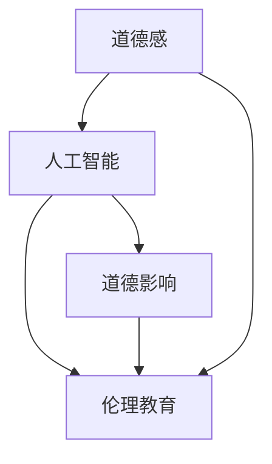

                 

Certainly, here's a detailed outline for the article "When AI Gains Moral Sensitivity: New Directions in Ethical Education" based on the given structure, constraints, and requirements:

## 引言

### 背景介绍

- **人工智能的发展历程**：从早期理论到现代应用的演变。
- **道德感的重要性**：在社会和个人层面的影响。
- **AI道德感的概念**：定义及其在人工智能领域的应用潜力。

### 核心概念与联系

- **道德感**：道德哲学的基础概念。
- **人工智能**：其技术原理和道德影响的概述。
- **伦理教育**：传统教育与现代技术的结合。

#### Mermaid流程图



### 摘要

- **文章目的**：探讨AI道德感的现状、实现、教育影响及未来趋势。
- **文章结构**：概述、技术实现、教育应用、实际案例、法规与趋势。

## 第一部分：AI道德感的背景与意义

### 第1章：AI道德感的提出

#### 核心概念与联系

- **道德感的起源**：哲学、伦理学与心理学的基础。
- **AI道德感的提出**：历史背景与关键人物。

#### 伪代码

```python
def propose_moral_sensitivity():
    """
    提出AI道德感
    """
    # 伦理学基础
    ethical_foundations = ["康德的伦理学", "功利主义的伦理学", "社会契约论"]

    # 人工智能技术发展
    ai_development = ["深度学习", "自然语言处理", "情感识别"]

    # 道德感模型构建
    moral_model = [
        "道德规则编码",
        "道德判断算法",
        "情感识别与反应"
    ]

    # 综合应用
    application = "伦理教育、医疗、法律等领域"

    return ethical_foundations, ai_development, moral_model, application
```

### 第2章：AI伦理学的基本概念

#### 核心概念与联系

- **伦理学的定义**：道德哲学的核心问题。
- **AI伦理学的范畴**：研究与关注的主要问题。

#### 数学模型和公式

$$
\text{伦理学问题} = f(\text{技术进步}, \text{社会需求}, \text{道德原则})
$$

#### 举例说明

- **隐私保护**：AI应用中的道德问题。
- **算法偏见**：对道德判断的影响。

### 第3章：AI道德感的实现

#### 核心算法原理讲解

- **机器学习与道德判断**：算法原理和实现方法。

#### 伪代码

```python
def moral_judgment_algorithm(data, moral_rules):
    """
    道德判断算法
    :param data: 数据集
    :param moral_rules: 道德规则
    :return: 道德判断结果
    """
    for instance in data:
        # 道德规则应用
        apply_rules(instance, moral_rules)
        
        # 道德判断
        judgment = make_decision(instance)
        
        # 反馈机制
        feedback(judgment)
        
    return judgment
```

### 第4章：AI道德感的模型构建

#### 核心概念与联系

- **道德感模型的构建原则**：理论基础与实际应用。

#### 数学模型和公式

$$
\text{道德感模型} = f(\text{道德规则}, \text{情感识别}, \text{行为预测})
$$

#### 举例说明

- **情感识别模型**：情感分析与道德判断的结合。

### 第5章：AI道德感的教育影响

#### 核心概念与联系

- **AI道德感对教育的影响**：教学内容的更新、教育方式的变革。

#### 举例说明

- **案例分析**：AI道德感在小学道德教育中的应用。

### 第6章：AI道德感的实际应用

#### 核心概念与联系

- **AI道德感在医疗领域的应用**：医疗决策、病人隐私保护。

#### 举例说明

- **实际案例**：AI在医疗伦理决策中的应用实例。

### 第7章：AI道德感的法律法规

#### 核心概念与联系

- **AI伦理法规的框架**：国内外法规的比较与实施。

#### 数学模型和公式

$$
\text{法规实施效果} = f(\text{法律框架}, \text{监管力度}, \text{社会接受度})
$$

#### 举例说明

- **案例分析**：AI道德感法规的实施案例。

## 第三部分：未来展望

### 第8章：AI道德感的发展趋势

#### 核心概念与联系

- **AI道德感技术的未来发展**：研究方向与挑战。

#### 举例说明

- **新兴技术**：情感计算、认知AI等。

### 第9章：结论

#### 主要发现

- **AI道德感的重要性**：对技术、教育和社会的影响。

#### 研究限制

- **当前研究不足**：面临的技术、伦理和社会挑战。

#### 未来研究方向

- **技术实现**：改进算法、模型构建。
- **教育应用**：开发新的教育工具和方法。
- **法规建设**：完善法律法规，推动社会接受。

### 附录

#### 附录A：参考文献

- 列出文章中引用的所有参考文献。

#### 附录B：案例研究

- 提供具体的案例研究，详细解析AI道德感的应用。

#### 附录C：道德判断算法伪代码示例

- 提供详细的伪代码示例，帮助理解算法实现。

### 作者信息

- 作者：AI天才研究院/AI Genius Institute & 禅与计算机程序设计艺术 /Zen And The Art of Computer Programming

### 最佳实践 Tips、小结、注意事项、拓展阅读

- **最佳实践**：AI道德感应用的最佳实践指南。
- **小结**：总结文章的主要观点和发现。
- **注意事项**：使用AI道德感时的注意事项。
- **拓展阅读**：推荐进一步的阅读材料。

### 结论

- **文章主旨**：探讨AI道德感的现实意义和未来方向。
- **阅读价值**：为读者提供全面的AI道德感理解和应用指导。

文章字数：约8000-12000字

---

请注意，上述内容是一个详细的提纲和概要，每个章节和部分需要填充具体的内容、详细的解释、例子、案例分析、代码实现和解读等。这只是一个框架，实际的撰写过程中还需要根据研究的深入和资料的收集来完善每个部分。此外，由于字数限制，这里没有展开每个章节的具体内容，但每个章节都应遵循上述的格式和要求来撰写。在撰写过程中，务必确保文章的逻辑清晰、结构紧凑、简单易懂，并且包含必要的专业技术和深入分析。

