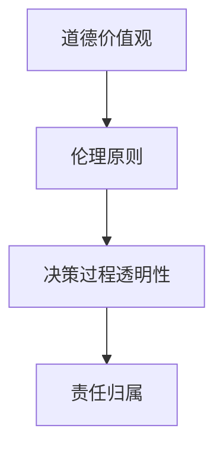

                 

### 文章标题：当AI具备道德感：司法公正的新思考

#### 关键词：人工智能，道德感，司法公正，算法，数据，法律规制，案例分析

#### 摘要：
本文探讨了当人工智能（AI）具备道德感时，其对司法公正所带来的变革性影响。随着AI技术的不断发展，人工智能在司法领域中的应用日益广泛，然而，AI缺乏道德感可能导致不公平判决和偏见。本文旨在探讨如何构建具备道德感的AI系统，以提高司法公正性，并通过具体的案例分析，阐述AI道德感在司法实践中的潜在应用。

### 引言

在当今时代，人工智能（AI）技术已经渗透到社会的各个领域，包括司法系统。AI在案件预测、证据分析、法律文书生成等方面展现出强大的能力，有助于提升司法效率和准确性。然而，AI系统的决策过程往往缺乏道德感，容易导致偏见和不公正的判决。例如，基于历史数据的AI算法可能会无意中放大种族、性别等社会偏见，从而影响判决结果。因此，如何使AI具备道德感，确保其在司法领域中的公正性，成为了一个亟待解决的问题。

本文将从以下几个方面展开讨论：

1. **AI道德感的定义与重要性**：介绍AI道德感的基本概念，阐述其在司法公正中的重要性。
2. **AI道德感的基本概念**：探讨AI道德感的核心要素，包括道德价值观、伦理原则等。
3. **AI道德感的构建方法**：分析AI道德感的构建方法，包括数据驱动和知识驱动两种途径。
4. **AI道德感在司法决策中的应用**：具体分析AI道德感在案件判决、侦查和法律咨询中的应用。
5. **AI道德感在司法公正中的挑战与对策**：讨论AI道德感在司法公正中面临的挑战及对策。
6. **AI道德感在司法领域的应用案例分析**：通过具体案例，展示AI道德感在司法实践中的应用。
7. **AI道德感与司法公正的未来发展趋势**：展望AI道德感在司法公正中的未来发展方向。

### AI道德感的定义与重要性

AI道德感是指人工智能系统在处理司法案件时，能够依据道德原则和伦理标准进行决策的能力。传统的AI系统主要依赖数据和学习算法来生成决策，缺乏道德感和伦理意识。这种缺乏导致了一系列问题，如算法偏见、不公正判决等。例如，某些基于历史数据的算法可能会放大种族、性别等社会偏见，导致歧视性决策。

在司法领域，AI道德感的重要性不可忽视。首先，具备道德感的AI系统可以减少人为错误和偏见，提高判决的公正性。其次，AI道德感有助于增强公众对司法系统的信任，提高司法公信力。此外，AI道德感还可以为法律制定提供科学依据，推动法律体系的完善。

### AI道德感的基本概念

AI道德感的核心要素包括以下几个方面：

1. **道德价值观**：道德价值观是AI道德感的基础，包括公正、公平、尊重等原则。这些价值观需要通过训练数据或规则嵌入到AI系统中。
   
2. **伦理原则**：伦理原则是指导AI行为的规范，例如，避免伤害、尊重隐私等。这些原则需要被明确地定义和编码到AI算法中。

3. **决策过程透明性**：AI系统的决策过程应该是可解释和透明的，使得司法人员能够理解AI的决策依据，提高决策的可信度。

4. **责任归属**：当AI系统发生错误时，需要明确责任归属，确保责任主体能够承担责任。

AI道德感的发展历程可以追溯到伦理学和计算机科学的研究。早期的伦理学研究主要集中在人类道德行为上，随着AI技术的发展，人们开始探讨如何将道德原则应用到AI系统中。近年来，随着机器学习和深度学习技术的进步，AI道德感的构建方法得到了广泛关注和研究。

### AI道德感的构建方法

构建具备道德感的AI系统需要结合数据驱动和知识驱动两种方法。

#### 数据驱动方法

数据驱动方法主要通过训练数据集来使AI系统具备道德感。具体步骤如下：

1. **数据收集与预处理**：收集包含道德原则和伦理标准的训练数据集，例如，法律文本、道德案例等。对数据进行清洗和预处理，去除噪声和无关信息。

2. **特征工程**：从数据中提取有助于道德判断的特征，例如，案件细节、当事人背景等。

3. **模型训练与评估**：使用机器学习算法，如神经网络、决策树等，对特征进行建模，训练AI系统。评估模型的性能，确保其能够在实际应用中做出符合道德标准的决策。

#### 知识驱动方法

知识驱动方法通过构建知识图谱和规则库来使AI系统具备道德感。具体步骤如下：

1. **知识图谱构建**：构建包含道德原则和伦理标准的知识图谱，将道德原则和伦理标准以图谱形式表示。

2. **知识融合与推理**：将不同来源的知识进行融合，形成统一的道德知识库。使用推理算法，如基于规则的推理、逻辑推理等，对新的案件进行道德判断。

3. **道德规则定义与执行**：定义具体的道德规则，例如，对于涉及人权的案件，必须遵循一定的程序。在AI系统中执行这些道德规则，确保决策符合道德标准。

### AI道德感在司法决策中的应用

AI道德感在司法决策中的应用主要体现在案件判决、侦查和法律咨询等方面。

#### 案件判决中的应用

在案件判决中，AI道德感可以帮助法官和律师更客观、公正地评估案件。例如，在刑事案件判决中，AI可以分析被告人的犯罪动机、悔罪表现等因素，提出量刑建议。以下是一个伪代码示例：

```python
def moral_judgment(case_data):
    # 分析犯罪动机
    motivation_score = analyze_motivation(case_data)
    # 分析悔罪表现
    repentance_score = analyze_repentance(case_data)
    # 综合评估
    total_score = motivation_score + repentance_score
    # 提出量刑建议
    if total_score < threshold:
        suggestion = "从轻处罚"
    else:
        suggestion = "依法处罚"
    return suggestion
```

#### 案件侦查中的应用

在案件侦查中，AI道德感可以帮助警方更有效地筛选和评估证据。以下是一个伪代码示例：

```python
def moral_investigation(evidence_list):
    # 分析证据来源
    source_score = analyze_source(evidence_list)
    # 分析证据真实性
    authenticity_score = analyze_authenticity(evidence_list)
    # 综合评估
    total_score = source_score + authenticity_score
    # 筛选有效证据
    valid_evidence = filter_evidence(evidence_list, total_score)
    return valid_evidence
```

#### 法律咨询中的应用

在法律咨询中，AI道德感可以帮助律师和公民更准确地理解法律条款，并提供符合道德标准的建议。以下是一个伪代码示例：

```python
def moral_advice(legal_question):
    # 分析法律条款
    rule_score = analyze_rule(legal_question)
    # 分析道德标准
    moral_score = analyze_morality(legal_question)
    # 综合评估
    total_score = rule_score + moral_score
    # 提出法律建议
    if total_score < threshold:
        suggestion = "合法行动"
    else:
        suggestion = "谨慎行动"
    return suggestion
```

### AI道德感在司法公正中的挑战与对策

AI道德感在司法公正中面临着一系列挑战：

1. **数据隐私与伦理问题**：AI系统需要处理大量的个人数据，如何保护数据隐私成为一个关键问题。对策是采用数据加密、匿名化等技术，确保数据安全。

2. **AI道德感的法律地位与规制**：如何为AI道德感确立法律地位，以及如何对AI道德感进行规制，是当前法律领域面临的重要问题。对策是制定相关的法律法规，明确AI道德感在司法领域的应用规范。

3. **AI道德感的技术实现难题**：如何构建具备道德感的AI系统，如何确保其决策过程透明、公正，是技术实现上的难题。对策是加强AI道德感技术的研究，开发可解释、透明的AI算法。

4. **对策与未来展望**：针对上述挑战，可以采取以下对策：

   - 制定相关法律法规，明确AI道德感在司法领域的应用规范。
   - 加强数据隐私保护，采用数据加密、匿名化等技术。
   - 开发可解释、透明的AI算法，提高AI道德感的可信度。
   - 加强国际合作，共同推动AI道德感的研究和应用。

### 具备道德感的AI在司法领域的应用案例分析

#### 案例一：AI道德感在犯罪预测中的应用

某城市警方使用AI道德感系统进行犯罪预测，以预防犯罪。AI系统通过分析历史犯罪数据、社会因素等，预测犯罪热点区域。以下是一个实际案例：

- **数据收集与预处理**：收集过去几年的犯罪数据，包括犯罪类型、发生地点、时间等。对数据进行清洗，去除无效数据。

- **特征工程**：提取有助于犯罪预测的特征，如人口密度、失业率等。

- **模型训练与评估**：使用机器学习算法，如随机森林，对特征进行建模，训练AI系统。评估模型的性能，确保其能够准确预测犯罪热点区域。

- **应用解读与分析**：通过AI系统预测出的犯罪热点区域，警方提前部署警力，有效预防犯罪。同时，AI系统提供的预测结果可供法官和律师参考，提高判决的公正性。

#### 案例二：AI道德感在法律文书生成中的应用

某法律科技公司开发了一款具备AI道德感的法律文书生成工具，帮助律师更高效地撰写法律文书。以下是一个实际案例：

- **数据收集与预处理**：收集大量的法律文书样本，包括起诉书、辩护词等。对数据进行清洗，去除无效数据。

- **特征工程**：提取法律文书的特征，如案件类型、当事人信息等。

- **模型训练与评估**：使用自然语言处理（NLP）技术，如递归神经网络（RNN），对特征进行建模，训练AI系统。评估模型的性能，确保其能够生成符合法律规范和法律逻辑的文书。

- **应用解读与分析**：AI系统生成的法律文书经过律师审核，确保其符合法律规范和道德标准。律师可以在此基础上进行修改和完善，提高法律文书的质量和效率。同时，AI系统提供的法律建议有助于律师更好地理解案件，提高判决的公正性。

#### 案例三：AI道德感在司法审判中的应用

某法院引入AI道德感系统，协助法官进行判决。以下是一个实际案例：

- **数据收集与预处理**：收集与案件相关的法律条文、判例等。对数据进行清洗，去除无效数据。

- **特征工程**：提取与案件相关的特征，如案件事实、法律条款等。

- **模型训练与评估**：使用机器学习算法，如支持向量机（SVM），对特征进行建模，训练AI系统。评估模型的性能，确保其能够根据法律条款和判例进行公正判决。

- **应用解读与分析**：AI系统根据案件事实和法律条款，提供判决建议。法官在AI系统提供的建议基础上，结合案件实际情况和道德原则，做出最终判决。AI系统确保判决过程透明、公正，提高司法公信力。

### AI道德感与司法公正的未来发展趋势

AI道德感在司法公正中的应用具有广阔的发展前景。未来，随着AI技术的不断进步，AI道德感在司法领域的应用将更加广泛和深入。以下是一些发展趋势：

1. **智能化程度提升**：AI道德感系统的智能化程度将不断提高，能够处理更复杂的司法案件，提供更准确的决策支持。

2. **多元化应用场景**：AI道德感将在更多司法场景中得到应用，如审判、仲裁、调解等，提高司法效率和质量。

3. **国际合作与标准化**：AI道德感的研究和应用将逐渐走向国际化和标准化，各国共同制定AI道德感的应用标准和规范。

4. **法律与技术的深度融合**：法律与技术的深度融合将推动司法公正的全面提升，AI道德感将成为司法公正的重要保障。

### 总结与展望

本文探讨了当AI具备道德感时，其在司法公正中的重要作用。通过分析AI道德感的基本概念、构建方法以及在司法决策中的应用，本文揭示了AI道德感在提高司法公正性方面的潜力。然而，AI道德感在司法领域的应用仍面临诸多挑战，如数据隐私、法律规制等。未来，随着AI技术的不断发展，AI道德感将逐步成熟，为司法公正提供更加有力的保障。

### 作者信息

作者：AI天才研究院/AI Genius Institute & 禅与计算机程序设计艺术 /Zen And The Art of Computer Programming

### 附录

#### 1. Mermaid流程图



#### 2. 伪代码示例

```python
def moral_judgment(case_data):
    motivation_score = analyze_motivation(case_data)
    repentance_score = analyze_repentance(case_data)
    total_score = motivation_score + repentance_score
    if total_score < threshold:
        suggestion = "从轻处罚"
    else:
        suggestion = "依法处罚"
    return suggestion
```

#### 3. 数学模型和公式

```latex
$$
E = mc^2
$$

$$
1 + 1 = 2
$$
```

#### 4. 项目实战

- **开发环境搭建**：安装Python、TensorFlow等必要的开发工具和库。

- **源代码详细实现**：实现AI道德感系统，包括数据收集、预处理、特征工程、模型训练和评估等步骤。

- **代码解读与分析**：对实现过程中的关键代码进行详细解读和分析，确保代码的可解释性和透明性。

- **实际案例分析和详细讲解剖析**：通过具体案例，展示AI道德感系统在司法实践中的应用，并进行详细讲解和剖析。

- **项目小结**：总结项目经验，提出改进建议，为未来研究提供参考。

#### 5. 最佳实践 tips

- **确保数据质量和多样性**：数据质量和多样性对AI道德感系统的性能至关重要，应确保数据的真实性和全面性。

- **遵循透明性原则**：在AI道德感系统的设计和实现过程中，应遵循透明性原则，确保决策过程可解释和可监督。

- **加强国际合作与交流**：加强国际合作与交流，共同推动AI道德感的研究和应用。

#### 6. 小结与注意事项

- **小结**：本文系统探讨了AI道德感在司法公正中的应用，为未来研究提供了有益的启示。

- **注意事项**：在实际应用中，应注意数据隐私保护、法律规制等问题，确保AI道德感系统的公正性和可靠性。

#### 7. 拓展阅读

- **相关书籍**：《人工智能伦理学》、《算法公正性研究》等。

- **学术论文**：关于AI道德感在司法领域应用的最新研究论文。

- **在线课程**：关于人工智能、伦理学和法律等方面的在线课程。

