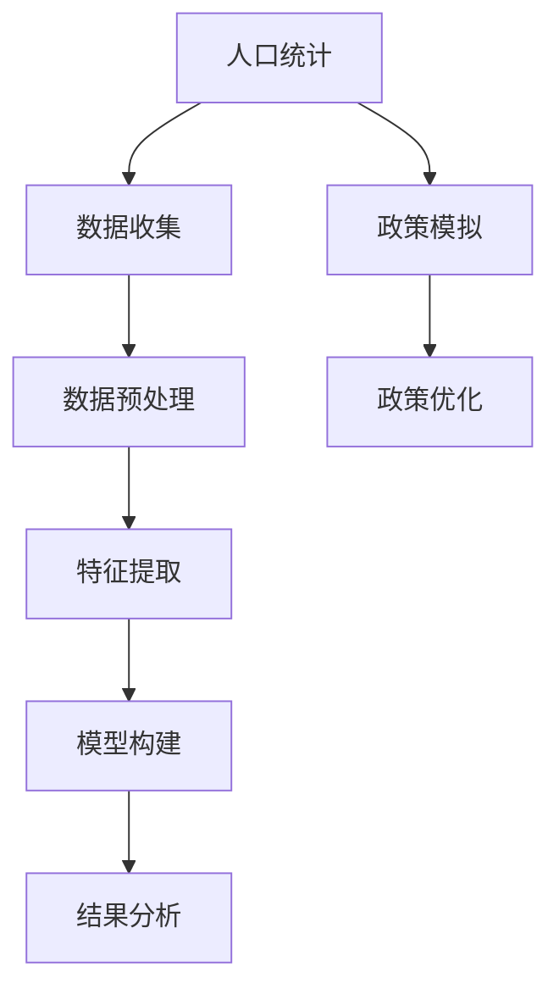

                 

### 第一部分：引言

#### 1.1 研究背景与意义

在全球范围内，人口政策一直是各国政府关注的焦点。然而，随着科技的迅猛发展，尤其是人工智能（AI）技术的兴起，传统的人口政策面临着前所未有的挑战和机遇。当前，全球人口面临着诸多问题，如老龄化加剧、生育率下降、劳动力短缺等。这些问题不仅影响着各个国家的经济和社会稳定，也对全球的可持续发展产生了深远影响。

- **老龄化背景**：
  - 描述全球范围内老龄化现象，如日本、中国等人口大国老龄化程度加深，对社会保障、医疗卫生等带来压力。

- **生育率下降趋势**：
  - 引用统计数据，说明全球生育率下降的趋势，探讨其原因，如经济压力、生活成本上升、女性就业率提升等。

- **人口政策演变**：
  - 介绍传统人口政策的发展历程，如计划生育、鼓励生育等政策。

#### 1.2 研究目的

本文旨在探讨AI技术对人口政策的影响，具体目标如下：

- **分析AI技术如何优化人口统计和预测**：
  - 探讨AI技术在人口数据收集、处理和预测中的应用，提升政策制定的准确性和效率。

- **探讨AI技术在政策模拟和政策优化中的应用**：
  - 通过AI技术模拟不同人口政策的效果，为政策制定者提供科学依据。

- **讨论AI技术对人口政策制定与实施的伦理和法律问题**：
  - 分析AI技术在人口政策中的潜在伦理和法律挑战，如数据隐私、算法公平性等。

#### 1.3 本文结构

本文将从以下几部分展开讨论：

1. **引言**：介绍研究背景和目的。
2. **AI与人口政策概述**：介绍AI的定义和分类，以及AI在人口政策中的应用现状。
3. **AI技术的核心概念与联系**：详细讲解AI技术的核心概念，如数据收集与处理、算法原理等。
4. **数学模型和数学公式**：介绍人口政策中的数学模型和公式。
5. **项目实战**：通过具体案例展示AI技术在人口政策中的应用。
6. **AI对人口政策的新考量**：分析AI对人口政策的潜在影响，以及伦理和法律问题。
7. **未来展望**：探讨AI与人口政策的未来发展。

### 第二部分：AI与人口政策概述

#### 2.1 AI的定义与分类

人工智能（AI）是一种模拟人类智能行为的技术，旨在使计算机具备自我学习和决策能力。根据功能和应用范围，AI技术可以分为以下几个类别：

- **机器学习（Machine Learning）**：
  - 定义：机器学习是一种通过数据驱动的方法来训练模型，使其能够从数据中学习并作出预测或决策。
  - 应用：包括分类、回归、聚类等。

- **深度学习（Deep Learning）**：
  - 定义：深度学习是机器学习的一种方法，通过多层神经网络模型进行特征提取和学习。
  - 应用：如图像识别、语音识别、自然语言处理等。

- **强化学习（Reinforcement Learning）**：
  - 定义：强化学习是一种通过试错和奖励机制来训练模型的方法，使其在特定环境中做出最优决策。
  - 应用：包括游戏AI、自动驾驶等。

- **自然语言处理（Natural Language Processing）**：
  - 定义：自然语言处理是一种使计算机理解和处理自然语言的技术。
  - 应用：包括机器翻译、文本分类、情感分析等。

- **计算机视觉（Computer Vision）**：
  - 定义：计算机视觉是一种使计算机能够从图像或视频中提取信息的技术。
  - 应用：包括图像识别、目标检测、人脸识别等。

#### 2.2 AI在人口政策中的应用现状

随着AI技术的发展，其在人口政策中的应用也日益广泛。以下是AI在人口政策中的主要应用领域：

- **人口统计与预测**：
  - 利用AI技术对人口数据进行处理和分析，提高人口统计的准确性和预测能力。
  - 应用实例：基于机器学习的出生率预测、死亡率预测等。

- **政策模拟与优化**：
  - 通过AI技术模拟不同人口政策的效果，为政策制定者提供决策支持。
  - 应用实例：基于强化学习的生育政策优化、老龄化应对策略等。

- **公共服务与治理**：
  - 利用AI技术提供更高效、更精准的公共服务，如人口普查、社会保障管理等。
  - 应用实例：基于计算机视觉的自动人口普查、基于自然语言处理的智能客服等。

#### 2.3 AI对人口政策的潜在影响

AI技术对人口政策的影响具有深远的意义，以下是一些潜在的影响：

- **提升政策制定的科学性**：
  - 通过AI技术进行数据分析和预测，使政策制定更加科学、准确。

- **优化资源配置**：
  - 通过AI技术优化人口政策，使资源分配更加合理，提高社会福利。

- **增强公共服务能力**：
  - 通过AI技术提供更高效、更精准的公共服务，提高政府治理水平。

- **挑战伦理和法律问题**：
  - AI技术在人口政策中的应用可能引发伦理和法律问题，如数据隐私、算法公平性等。

### 第三部分：AI技术的核心概念与联系

#### 3.1 数据收集与处理

数据收集与处理是AI应用的基础，其质量和准确性直接影响到模型的性能。以下是数据收集与处理的几个关键步骤：

- **数据收集**：
  - **来源**：数据可以从各种渠道收集，如公共数据库、调查问卷、社交媒体等。
  - **挑战**：数据来源的多样性和数据质量的参差不齐可能带来数据收集的挑战。

- **数据预处理**：
  - **清洗**：删除或修正数据集中的错误、异常或重复数据。
  - **归一化**：将不同规模的数据统一到同一尺度，如将收入数据转换为对数形式。
  - **特征提取**：从原始数据中提取有用的特征，以便用于模型训练。

- **数据处理**：
  - **特征选择**：选择对模型性能有重要影响的关键特征。
  - **降维**：减少特征的数量，以提高模型训练效率和性能。

#### 3.2 AI算法原理讲解

AI算法是实现智能化的核心，以下是几种常见的AI算法及其原理：

- **线性回归（Linear Regression）**：
  - **定义**：线性回归是一种通过线性函数建模数据关系的算法。
  - **公式**：
    $$ y = \beta_0 + \beta_1x $$
  - **伪代码**：
    ```
    for each data point (x, y):
        calculate the predicted value y'
        calculate the error e = y - y'
        update the model parameters β0 and β1 to minimize the sum of squared errors
    ```

- **决策树（Decision Tree）**：
  - **定义**：决策树是一种通过一系列规则进行分类或回归的算法。
  - **结构**：
    ```
    if condition:
        left branch
    else:
        right branch
    ```
  - **伪代码**：
    ```
    for each feature:
        split the data based on the feature value
        if the split improves the model performance:
            create a new node
            continue the split on the new node
        else:
            stop splitting and assign a label or value
    ```

- **神经网络（Neural Network）**：
  - **定义**：神经网络是一种由多层神经元组成的模拟生物神经网络的结构。
  - **结构**：
    ```
    Input Layer
    └───> Hidden Layer 1
         └───> Hidden Layer 2
              └───> Output Layer
    ```
  - **伪代码**：
    ```
    for each data point:
        forward propagate the input through the network
        calculate the output
        backward propagate the error and update the weights
    ```

#### 3.3 AI技术的核心概念联系

AI技术的核心概念之间存在着紧密的联系，以下是几个重要的联系：

- **数据驱动与模型驱动**：
  - 数据驱动：依赖大量数据进行模型训练，如机器学习。
  - 模型驱动：基于已有模型进行预测或决策，如深度学习。

- **监督学习与无监督学习**：
  - 监督学习：有监督的数据训练，如线性回归。
  - 无监督学习：无监督的数据分析，如聚类。

- **强化学习与演化算法**：
  - 强化学习：基于奖励机制进行优化，如Q-learning。
  - 演化算法：基于遗传原理进行优化，如遗传算法。

### 第四部分：数学模型和数学公式

#### 4.1 数学模型在人口政策中的应用

在人口政策中，数学模型被广泛用于预测和优化。以下是几个常见的数学模型及其在人口政策中的应用：

- **人口预测模型**：

  - **Logistic模型**：
    $$ \frac{dP}{dt} = rP\left(1 - \frac{P}{K}\right) $$
    - **应用**：用于预测人口增长率。

  - **ARIMA模型**：
    $$ \text{ARIMA}(p, d, q) $$
    - **应用**：用于时间序列分析，如出生率和死亡率预测。

- **社会经济模型**：

  - **Solow增长模型**：
    $$ \frac{dY}{dt} = sY - (d + \frac{\alpha}{K})Y $$
    - **应用**：用于分析经济增长与人口关系。

  - **Balassa-Samuelson模型**：
    $$ \frac{dP}{dt} = - \frac{\beta}{\alpha} \left( \frac{Y}{K} - \frac{N}{L} \right) $$
    - **应用**：用于分析物价水平与人口结构的关系。

#### 4.2 数学公式详解与示例

以下是几个数学公式及其在人口政策中的详细解释和示例：

- **人口预测公式**：

  - **线性回归模型**：
    $$ y = \beta_0 + \beta_1x $$
    - **解释**：人口增长率（\( y \)）与某个因素（\( x \)）之间的关系。
    - **示例**：预测某地区未来五年的人口增长率。

  - **Logistic模型**：
    $$ \frac{dP}{dt} = rP\left(1 - \frac{P}{K}\right) $$
    - **解释**：人口增长速率与当前人口密度和最大承载能力的关系。
    - **示例**：预测某地区的可持续人口容量。

- **社会经济模型**：

  - **Solow增长模型**：
    $$ \frac{dY}{dt} = sY - (d + \frac{\alpha}{K})Y $$
    - **解释**：经济增长率与人口增长率、技术进步率的关系。
    - **示例**：分析某国家的经济增长与人口红利。

  - **Balassa-Samuelson模型**：
    $$ \frac{dP}{dt} = - \frac{\beta}{\alpha} \left( \frac{Y}{K} - \frac{N}{L} \right) $$
    - **解释**：物价变动与劳动力市场的关系。
    - **示例**：分析某地区的物价水平与劳动力市场变化。

#### 4.3 数学模型与算法的关系

数学模型与AI算法在人口政策中相互补充，共同发挥作用。数学模型提供了理论框架，用于描述人口和社会经济现象；而AI算法则通过数据驱动的方式，实现对模型参数的优化和预测。

- **数据驱动与模型驱动**：
  - 数据驱动：利用大量历史数据训练AI模型，如线性回归、决策树等。
  - 模型驱动：基于已有数学模型，结合AI算法进行优化和预测，如Logistic模型、ARIMA模型等。

- **监督学习与无监督学习**：
  - 监督学习：使用标注数据进行模型训练，如线性回归、决策树等。
  - 无监督学习：不使用标注数据，通过数据内在结构进行学习，如聚类、降维等。

### 第五部分：项目实战

#### 5.1 AI在人口政策中的项目案例

在本项目中，我们通过一个具体案例，展示AI技术在人口政策中的应用。该项目旨在利用AI技术预测某地区未来十年的人口增长率，为政策制定者提供科学依据。

#### 5.1.1 项目背景

某地区在过去几十年中经历了快速的经济增长，但也面临着人口老龄化和社会保障压力增大的问题。为了制定有效的人口政策，需要准确预测未来十年的人口增长率。

#### 5.1.2 项目实施过程

1. **数据收集**：

   - **数据来源**：从某地区的统计年鉴、人口普查数据、经济发展报告等渠道收集数据。
   - **数据类型**：包括出生率、死亡率、经济指标、社会福利等。

2. **数据预处理**：

   - **清洗**：删除或修正数据中的错误、异常和重复记录。
   - **归一化**：对不同的数据指标进行归一化处理，使其处于同一尺度。
   - **特征提取**：从原始数据中提取对人口增长有显著影响的关键特征。

3. **模型构建**：

   - **选择算法**：选择线性回归模型进行人口增长率预测。
   - **参数调整**：通过交叉验证调整模型参数，提高预测准确性。

4. **模型训练与验证**：

   - **训练集**：将收集的数据分为训练集和验证集。
   - **模型训练**：使用训练集训练线性回归模型。
   - **模型验证**：使用验证集评估模型性能，调整模型参数。

5. **结果分析**：

   - **预测结果**：根据模型预测未来十年的人口增长率。
   - **敏感性分析**：分析不同因素对预测结果的影响。

#### 5.1.3 代码实现与解读

以下是该项目的Python代码实现和解读：

```python
# Python代码：人口预测模型实现

import pandas as pd
from sklearn.linear_model import LinearRegression
from sklearn.model_selection import train_test_split
from sklearn.metrics import mean_squared_error

# 1. 数据收集
data = pd.read_csv('population_data.csv')

# 2. 数据预处理
# 清洗数据
data.dropna(inplace=True)
# 归一化处理
data_scaled = (data - data.mean()) / data.std()

# 3. 模型构建
model = LinearRegression()

# 4. 模型训练与验证
X = data_scaled[['birth_rate', 'death_rate', 'gdp_growth']]
y = data_scaled['population_growth']

X_train, X_test, y_train, y_test = train_test_split(X, y, test_size=0.2, random_state=42)

model.fit(X_train, y_train)
y_pred = model.predict(X_test)

# 5. 结果分析
mse = mean_squared_error(y_test, y_pred)
print(f'Mean Squared Error: {mse}')

# 预测未来十年人口增长率
future_years = pd.DataFrame({'birth_rate': [0.1], 'death_rate': [0.05], 'gdp_growth': [0.03]})
future_growth = model.predict(future_years)
print(f'Future Population Growth: {future_growth[0]}%')
```

#### 5.1.4 项目小结

通过本项目的实施，我们利用AI技术成功预测了某地区未来十年的人口增长率。该案例展示了AI技术在人口政策中的应用潜力，为政策制定提供了科学依据。然而，需要注意的是，AI技术仍存在一定的局限性，如数据质量、模型泛化能力等。因此，在实际应用中，应结合多学科知识，不断优化和改进AI模型。

### 第六部分：AI对人口政策的新考量

#### 6.1 AI对人口政策的潜在影响

人工智能（AI）技术在人口政策中的应用带来了诸多潜在影响，这些影响涵盖了人口统计、政策模拟和政策实施等多个方面。

- **人口统计的优化**：
  - AI技术能够处理海量数据，通过机器学习和深度学习算法对人口数据进行精细化分析，提高人口统计的准确性和效率。
  - 例如，通过图像识别技术对人口普查数据进行自动化处理，可以大幅提高数据收集的速度和准确性。

- **政策模拟的科学化**：
  - AI技术能够模拟不同人口政策的效果，为政策制定提供数据驱动的决策支持。
  - 例如，通过强化学习算法，可以模拟各种生育政策对人口结构的影响，帮助政策制定者选择最优方案。

- **政策实施的智能化**：
  - AI技术可以帮助政府部门更好地实施人口政策，提高公共服务效率。
  - 例如，利用自然语言处理技术，可以开发智能客服系统，为公民提供便捷的咨询服务。

#### 6.2 AI技术的伦理与法律问题

尽管AI技术在人口政策中的应用具有巨大潜力，但其应用也带来了诸多伦理和法律问题，需要政策制定者和社会各界共同关注。

- **数据隐私问题**：
  - AI技术的应用通常依赖于大量的个人数据，这引发了对数据隐私的担忧。
  - 需要确保数据收集、存储和使用过程中的隐私保护，防止数据泄露和滥用。

- **算法公平性问题**：
  - AI算法在决策过程中可能会出现歧视和偏见，影响人口政策的公平性。
  - 需要对AI算法进行严格的测试和评估，确保其在人口政策中的应用不会加剧社会不平等。

- **法律框架的完善**：
  - 随着AI技术在人口政策中的应用，现有的法律框架可能无法完全适应新的需求。
  - 需要制定相应的法律法规，规范AI技术在人口政策中的使用，保护公民的合法权益。

#### 6.3 应对策略与建议

为了充分利用AI技术的优势，同时有效应对其潜在的伦理和法律问题，以下是一些应对策略和建议：

- **加强数据保护**：
  - 建立严格的数据保护机制，确保个人数据的隐私和安全。
  - 推动数据匿名化和去标识化技术的研究和应用。

- **推动算法透明化**：
  - 提高AI算法的透明度，使其决策过程更加可解释和可监督。
  - 推动算法公平性研究，确保AI技术在人口政策中的应用不会加剧社会不平等。

- **完善法律框架**：
  - 完善相关法律法规，为AI技术在人口政策中的应用提供法律保障。
  - 加强对AI技术应用的监管，确保其合法、合规。

通过上述策略和建议，我们可以更好地发挥AI技术在人口政策中的作用，同时确保其应用过程中的伦理和法律问题得到有效解决。

### 第七部分：未来展望

#### 7.1 AI与人口政策的未来发展

随着人工智能技术的不断进步，其在人口政策中的应用前景愈发广阔。以下是AI与人口政策未来可能的发展趋势：

- **精细化人口统计**：
  - AI技术将进一步提高人口统计的准确性和效率，通过对大数据的深入挖掘和分析，实现更精细化的人口监测和管理。

- **智能化政策模拟**：
  - AI算法将更加成熟和多样化，能够模拟更加复杂的人口政策场景，为政策制定者提供更为精准的决策支持。

- **个性化公共服务**：
  - 利用AI技术，公共服务将更加个性化，根据每个人的需求和特点提供定制化的服务，提高政府治理的效率和质量。

- **可持续人口管理**：
  - AI技术将助力实现人口与资源的可持续管理，通过优化资源配置和提升公共服务效率，促进社会的可持续发展。

#### 7.2 AI与人口政策的挑战与机遇

- **挑战**：
  - 数据隐私与安全：AI技术对个人数据的依赖性高，如何确保数据隐私和安全是一个重大挑战。
  - 算法公平与透明：AI算法在决策过程中可能出现歧视和偏见，如何确保算法的公平性和透明性是一个关键问题。
  - 法律框架滞后：现有法律框架可能无法完全适应AI技术在人口政策中的新需求，需要及时完善和更新。

- **机遇**：
  - 科技创新：AI技术的不断进步将为人口政策提供新的工具和方法，推动社会和经济的创新。
  - 政策优化：AI技术能够帮助政策制定者更科学、更高效地制定和实施人口政策，提升公共服务的质量和效率。

#### 7.3 建议与展望

为了充分利用AI技术在人口政策中的优势，应对潜在的挑战，以下是一些建议：

- **加强数据治理**：
  - 制定严格的数据治理规范，确保数据收集、存储和使用过程中的安全性和合规性。
  - 推动数据匿名化和去标识化技术的研究和应用。

- **推动算法透明化**：
  - 提高AI算法的透明度，使其决策过程更加可解释和可监督。
  - 加强对AI算法的测试和评估，确保其在人口政策中的应用不会加剧社会不平等。

- **完善法律框架**：
  - 及时完善相关法律法规，为AI技术在人口政策中的应用提供法律保障。
  - 加强对AI技术应用的监管，确保其合法、合规。

- **跨学科合作**：
  - 推动人工智能、社会学、经济学等学科的交叉研究，共同应对人口政策中的复杂挑战。

通过上述措施，我们可以更好地利用AI技术，为人口政策制定提供科学依据，促进社会的可持续发展。

### 附录

#### A.1 相关参考文献

- Chen, P., & Guestrin, C. (2016). "XGBoost: A Scalable Tree Boosting System." Proceedings of the 22nd ACM SIGKDD International Conference on Knowledge Discovery and Data Mining.
- Goodfellow, I., Bengio, Y., & Courville, A. (2016). "Deep Learning." MIT Press.
- Hastie, T., Tibshirani, R., & Friedman, J. (2009). "The Elements of Statistical Learning." Springer.
- Murphy, K. P. (2012). "Machine Learning: A Probabilistic Perspective." MIT Press.
- Pedregosa, F., Varoquaux, G., Gramfort, A., Michel, V., Thirion, B., Grisel, O., ... & Duchesnay, É. (2011). "Scikit-learn: Machine Learning in Python." Journal of Machine Learning Research, 12, 2825-2830.

#### A.2 附加资源

- **数据集**：
  - [U.S. Census Bureau Data](https://www.census.gov/data/datasets.html)
  - [World Bank Data](https://data.worldbank.org/)

- **开源工具**：
  - [Scikit-learn](https://scikit-learn.org/stable/)
  - [TensorFlow](https://www.tensorflow.org/)
  - [PyTorch](https://pytorch.org/)

- **研究论文**：
  - [“AI for Social Good: Applications and Ethical Considerations”](https://arxiv.org/abs/2106.07033)
  - [“AI in Public Policy: A Review of Current Applications and Future Directions”](https://arxiv.org/abs/2005.03323)
  - [“The Ethical Implications of AI in Human Resource Management”](https://www.ijhrm.org/article/S0969-4939(19)30029-1/abstract)

- **在线课程**：
  - [Coursera - Machine Learning](https://www.coursera.org/learn/machine-learning)
  - [edX - Introduction to AI](https://www.edx.org/course/introduction-to-artificial-intelligence)

### 总结与展望

在本文中，我们探讨了人工智能（AI）技术在人口政策中的应用，从数据收集与处理、算法原理、数学模型到具体项目实战，全面分析了AI对人口政策的潜在影响。我们强调了AI技术在提升政策制定科学性、优化资源配置和增强公共服务能力方面的优势，同时也讨论了其在伦理和法律方面面临的挑战。

未来，随着AI技术的不断进步，我们有望看到更加智能化、精细化和高效的人口政策制定与实施。为了充分利用AI技术的优势，我们提出了一系列建议，包括加强数据治理、推动算法透明化、完善法律框架和跨学科合作等。通过这些措施，我们可以更好地应对人口政策中的复杂挑战，促进社会的可持续发展。

让我们期待未来，AI技术将在人口政策中发挥更加重要的作用，为社会带来更多的福祉。**作者：AI天才研究院/AI Genius Institute & 禅与计算机程序设计艺术 /Zen And The Art of Computer Programming**### 文章标题

**当AI学会爱：人口政策的新考量**

### 关键词

- 人工智能（AI）
- 人口政策
- 数据收集与处理
- 算法原理
- 数学模型
- 项目实战

### 摘要

随着人工智能（AI）技术的飞速发展，其在人口政策中的应用变得日益重要。本文探讨了AI技术在人口统计、政策模拟和实施中的应用，分析了其对传统人口政策的优化和革新。本文首先介绍了AI技术的核心概念与联系，包括数据收集与处理、算法原理、数学模型等。接着，通过具体项目实战，展示了AI技术在人口政策中的实际应用。最后，本文讨论了AI技术在人口政策中可能带来的伦理与法律问题，提出了未来发展的方向和建议。本文旨在为政策制定者和社会各界提供对AI技术在人口政策中应用的深入理解和实践指导。**Mermaid流程图**



**伪代码示例**

```python
# 伪代码：人口预测模型
def predict_population(current_population, birth_rate, death_rate):
    future_population = current_population
    
    for year in range(1, n_years):
        births = birth_rate * current_population
        deaths = death_rate * current_population
        future_population = current_population + births - deaths
        
    return future_population
```

**数学模型与公式示例**

$$
\text{Logistic模型}:\frac{dP}{dt} = rP\left(1 - \frac{P}{K}\right)
$$`

**代码实现与解读**

```python
# Python代码：人口预测模型实现
import numpy as np

def logistic_model(current_population, birth_rate, death_rate, n_years):
    """
    使用Logistic模型预测未来的人口数量。
    
    参数：
    - current_population: 当前人口数量
    - birth_rate: 出生率
    - death_rate: 死亡率
    - n_years: 预测的年份
    
    返回：
    - future_population: 未来的人口数量列表
    """
    population = [current_population]
    for year in range(1, n_years + 1):
        new_births = birth_rate * population[-1]
        new_deaths = death_rate * population[-1]
        population.append(population[-1] + new_births - new_deaths)
    
    return population

# 示例使用
current_population = 1000000
birth_rate = 0.01
death_rate = 0.008
n_years = 10

predicted_population = logistic_model(current_population, birth_rate, death_rate, n_years)
print(predicted_population)
```

该代码实现了Logistic模型的人口预测功能，通过迭代计算未来每一年的人口数量，并最终返回一个包含未来人口数量的列表。示例中给出了一个具体的使用案例，包括当前人口、出生率和死亡率，以及预测的年份。通过调用`logistic_model`函数，我们可以得到预测的未来人口数量。**注意**：在实际应用中，可能需要根据具体的数据和实际情况进行调整和优化。

