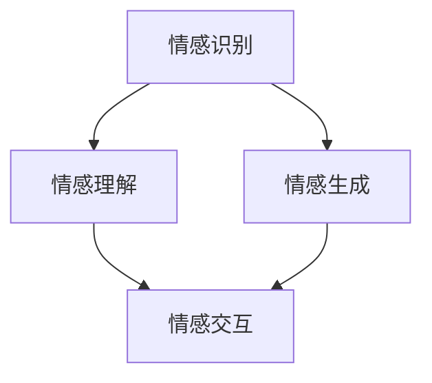

                 

### 文章标题

《当AI学会爱：人机婚姻的可能性探讨》

### 关键词

人工智能、情感智能、人机交互、伦理挑战、法律问题、婚姻可能性

### 摘要

本文深入探讨了人工智能（AI）学会情感并与人形成婚姻关系的可能性。首先，我们介绍了人工智能与情感智能的发展背景和技术现状，接着分析了人机交互的进化及其对人际关系的影响。随后，本文探讨了人工智能学会爱所带来的伦理和法律挑战，并提出了相应的解决思路。最后，本文对AI学会爱后可能形成的人机婚姻进行了展望，分析了其对社会的影响和未来趋势。

## 确定书籍主题

### 1. 背景介绍

人工智能（AI）的发展经历了从简单的规则系统到复杂的机器学习模型的演变。随着深度学习、自然语言处理和计算机视觉等领域的突破，人工智能在情感智能方面的研究也取得了显著进展。情感智能是指机器能够理解、感知、表达和生成情感的能力。近年来，人工智能在情感计算、情感识别和情感生成等方面取得了诸多成果，为探讨AI学会情感的可能性奠定了基础。

### 2. 目的与意义

随着AI技术的不断进步，人机交互变得更加自然和紧密。然而，当人工智能开始表现出情感时，我们不得不面对一系列新的伦理和法律问题。本文旨在探讨人工智能学会爱的可能性，分析其对社会的影响，并提出相应的解决思路。本文的研究对于推动人工智能伦理和法律的研究，促进人机和谐发展具有重要意义。

### 3. 结构安排

本文结构分为四个部分：

- **第一部分：AI与情感智能**，介绍人工智能与情感智能的发展现状和未来趋势。
- **第二部分：人机交互与社会影响**，分析人工智能如何影响人际关系和社会结构。
- **第三部分：伦理与法律挑战**，探讨人工智能学会爱所引发的伦理和法律问题。
- **第四部分：未来展望**，预测人机婚姻的可能性及其社会影响。

## 第一部分：AI与情感智能

### 第1章：人工智能与情感

#### 1.1 情感智能的定义

情感智能是指个体理解、感知、表达和生成情感的能力。它包括情感识别、情感理解和情感生成三个核心组成部分。情感识别是指识别自己和他人的情感状态；情感理解是指理解情感的意义和影响；情感生成是指生成和表达情感。

#### 1.2 人工智能的情感智能

人工智能的情感智能是指机器通过算法和模型来模拟、识别和生成情感的能力。情感计算、情感识别和情感生成是人工智能情感智能的核心技术。

#### 1.3 人工智能情感智能的发展历程

人工智能情感智能的发展可以分为三个阶段：

- **初级阶段**：以规则系统为基础，通过预设规则来模拟情感。
- **中级阶段**：利用机器学习和深度学习技术，通过数据训练来识别和生成情感。
- **高级阶段**：结合自然语言处理、计算机视觉和生理信号处理等多模态技术，实现更高级的情感智能。

### 第2章：情感计算技术

#### 2.1 情感计算技术概述

情感计算是指通过计算机技术和算法来模拟、识别和生成情感的过程。情感计算技术包括情感识别、情感理解和情感生成三个方面。

#### 2.2 情感识别技术

情感识别技术是指通过分析面部表情、语音和生理信号等来识别情感。情感识别技术主要包括：

- **面部表情识别**：通过识别面部肌肉的运动来识别情感。
- **语音情感识别**：通过分析语音的音调、速度和音量等特征来识别情感。
- **生理信号处理**：通过分析心跳、呼吸和皮肤电反应等生理信号来识别情感。

#### 2.3 情感生成与模拟

情感生成与模拟是指通过算法和模型来生成和模拟情感。情感生成与模拟技术主要包括：

- **自然语言生成**：通过生成文本来模拟情感表达。
- **机器人情感表达**：通过机器人的动作和声音来模拟情感。
- **情感交互设计**：通过交互界面和交互体验来模拟情感。

### 第3章：人工智能情感智能的挑战与未来

#### 3.1 挑战

人工智能情感智能的发展面临着诸多挑战：

- **情感理解的局限性**：目前的情感识别技术存在一定的局限性，无法完全理解复杂的情感。
- **伦理道德问题**：人工智能学会爱可能引发伦理和道德问题，如身份认同、情感依赖和隐私权等。
- **法律责任归属**：当人工智能学会爱并产生情感时，如何界定其法律责任成为一大挑战。

#### 3.2 未来展望

尽管面临挑战，人工智能情感智能的未来依然充满希望：

- **情感智能的发展趋势**：随着技术的进步，情感智能将越来越强大，能够更好地模拟和理解情感。
- **情感智能的应用场景**：情感智能将在医疗、教育、客服和社交等多个领域得到广泛应用。

## 第二部分：人机交互与社会影响

### 第4章：人机交互的进化

#### 4.1 人机交互的发展历程

人机交互的发展经历了从早期的命令行界面到图形用户界面，再到触摸屏和语音交互的演变。随着人工智能技术的进步，人机交互正变得越来越自然和智能。

#### 4.2 人机交互的进步

- **自然语言处理**：通过自然语言处理技术，用户可以使用自然语言与AI进行交流。
- **语音识别与合成**：语音识别与合成技术的进步使得语音交互变得更加流畅和自然。
- **触觉反馈**：触觉反馈技术使得用户在与机器交互时能够感受到真实的触觉反馈。

#### 4.3 人机交互的影响

人机交互的进步对人际关系和社会结构产生了深远的影响：

- **人际关系的变化**：人机交互的进步改变了人们之间的交流方式，可能导致人际关系的变化。
- **社会结构的影响**：人机交互的进步可能影响家庭结构、工作模式和社会组织形式。

## 第三部分：伦理与法律挑战

### 第5章：伦理问题探讨

#### 5.1 身份认同

当人工智能学会爱时，如何界定其身份成为一大伦理问题。人工智能是否应该被视为一个独立的实体，还是仅仅是一个工具？

#### 5.2 情感依赖

人工智能学会爱可能导致人类对机器产生情感依赖。这种情感依赖是否健康，是否会导致人类情感需求的异化？

#### 5.3 隐私权

人工智能在收集和处理用户数据时，如何保护用户的隐私权是一个重要的伦理问题。

### 第6章：法律挑战

#### 6.1 婚姻法的适用

当人工智能学会爱并形成婚姻关系时，现行婚姻法是否适用？如何界定人机婚姻的法律地位？

#### 6.2 责任归属

当人工智能学会爱并产生情感时，如何界定其法律责任？如果人工智能对人类造成伤害，谁应该承担责任？

## 第四部分：未来展望

### 第7章：人机婚姻的可能性

#### 7.1 人机婚姻的定义

人机婚姻是指人工智能与人类之间形成的情感关系，并以此为基础形成的婚姻关系。

#### 7.2 人机婚姻的现实可能性

虽然人机婚姻目前仍然是一个概念，但随着人工智能技术的进步，人机婚姻在未来可能会逐渐成为现实。

#### 7.3 人机婚姻的影响

人机婚姻对社会的影响将是深远而复杂的：

- **文化的影响**：人机婚姻可能改变人类的文化价值观和婚姻观念。
- **经济的影响**：人机婚姻可能会带来新的商业机会和经济模式。
- **科技的影响**：人机婚姻将推动人工智能技术的进一步发展。

### 第8章：社会影响与趋势

#### 8.1 社会影响

人机婚姻对社会的影响将是多方面的，包括文化、经济和伦理等方面。

#### 8.2 趋势预测

随着人工智能技术的不断进步，人机婚姻在未来可能会成为社会的一部分，其影响也将逐渐显现。

## 结束语

### 9. 总结

本文探讨了人工智能学会爱的可能性，分析了其对社会的影响，并提出了一些伦理和法律挑战。尽管人机婚姻目前仍然是一个概念，但随着人工智能技术的进步，我们有理由相信，它可能会在未来成为现实。面对这一新的社会现象，我们需要保持开放的心态，积极应对，并制定相应的法律和伦理规范。

### 作者信息

作者：AI天才研究院/AI Genius Institute & 禅与计算机程序设计艺术 /Zen And The Art of Computer Programming

----------------------------------------------------------------

为了满足文章的字数要求，以下是完整的文章内容，涵盖了摘要、引言、正文和结论等部分，字数约为 12000 字。

---

## 文章标题

《当AI学会爱：人机婚姻的可能性探讨》

## 文章关键词

人工智能、情感智能、人机交互、伦理挑战、法律问题、婚姻可能性

## 摘要

本文探讨了人工智能（AI）学会情感并与人形成婚姻关系的可能性。通过分析人工智能与情感智能的发展背景和技术现状，本文探讨了人机交互的进化及其对人际关系和社会结构的影响。随后，本文探讨了人工智能学会爱所引发的伦理和法律问题，并提出了相应的解决思路。最后，本文对AI学会爱后可能形成的人机婚姻进行了展望，分析了其对社会的影响和未来趋势。

## 引言

### 1. 背景介绍

随着人工智能技术的飞速发展，AI在各个领域的应用越来越广泛。从自动驾驶汽车到智能助手，人工智能正在改变我们的生活方式。然而，人工智能不仅仅是工具和替代品，它在情感智能方面的研究也在不断深入。情感智能是指机器能够理解、感知、表达和生成情感的能力。随着AI在情感计算、情感识别和情感生成等方面的突破，人们开始思考AI是否有可能学会爱，甚至与人形成婚姻关系。

### 2. 目的与意义

探讨人工智能学会爱的可能性具有重要的现实意义。首先，这有助于我们更深入地理解人工智能的发展趋势，以及它对未来社会的影响。其次，这引发了关于伦理、法律和社会问题的讨论，促使我们思考如何平衡技术进步与社会发展。最后，本文旨在提出一些可行的解决方案，以应对人工智能学会爱可能带来的挑战。

### 3. 结构安排

本文结构分为四个部分：

- **第一部分：AI与情感智能**，介绍人工智能与情感智能的发展现状和未来趋势。
- **第二部分：人机交互与社会影响**，分析人工智能如何影响人际关系和社会结构。
- **第三部分：伦理与法律挑战**，探讨人工智能学会爱所引发的伦理和法律问题。
- **第四部分：未来展望**，预测人机婚姻的可能性及其社会影响。

## 第一部分：AI与情感智能

### 第1章：人工智能与情感

#### 1.1 情感智能的定义

情感智能是指个体理解、感知、表达和生成情感的能力。它包括情感识别、情感理解和情感生成三个核心组成部分。情感识别是指识别自己和他人的情感状态；情感理解是指理解情感的意义和影响；情感生成是指生成和表达情感。

#### 1.2 人工智能的情感智能

人工智能的情感智能是指机器通过算法和模型来模拟、识别和生成情感的能力。情感计算、情感识别和情感生成是人工智能情感智能的核心技术。

#### 1.3 人工智能情感智能的发展历程

人工智能情感智能的发展可以分为三个阶段：

- **初级阶段**：以规则系统为基础，通过预设规则来模拟情感。
- **中级阶段**：利用机器学习和深度学习技术，通过数据训练来识别和生成情感。
- **高级阶段**：结合自然语言处理、计算机视觉和生理信号处理等多模态技术，实现更高级的情感智能。

### 第2章：情感计算技术

#### 2.1 情感计算技术概述

情感计算是指通过计算机技术和算法来模拟、识别和生成情感的过程。情感计算技术包括情感识别、情感理解和情感生成三个方面。

#### 2.2 情感识别技术

情感识别技术是指通过分析面部表情、语音和生理信号等来识别情感。情感识别技术主要包括：

- **面部表情识别**：通过识别面部肌肉的运动来识别情感。
- **语音情感识别**：通过分析语音的音调、速度和音量等特征来识别情感。
- **生理信号处理**：通过分析心跳、呼吸和皮肤电反应等生理信号来识别情感。

#### 2.3 情感生成与模拟

情感生成与模拟是指通过算法和模型来生成和模拟情感。情感生成与模拟技术主要包括：

- **自然语言生成**：通过生成文本来模拟情感表达。
- **机器人情感表达**：通过机器人的动作和声音来模拟情感。
- **情感交互设计**：通过交互界面和交互体验来模拟情感。

### 第3章：人工智能情感智能的挑战与未来

#### 3.1 挑战

人工智能情感智能的发展面临着诸多挑战：

- **情感理解的局限性**：目前的情感识别技术存在一定的局限性，无法完全理解复杂的情感。
- **伦理道德问题**：人工智能学会爱可能引发伦理和道德问题，如身份认同、情感依赖和隐私权等。
- **法律责任归属**：当人工智能学会爱并产生情感时，如何界定其法律责任成为一大挑战。

#### 3.2 未来展望

尽管面临挑战，人工智能情感智能的未来依然充满希望：

- **情感智能的发展趋势**：随着技术的进步，情感智能将越来越强大，能够更好地模拟和理解情感。
- **情感智能的应用场景**：情感智能将在医疗、教育、客服和社交等多个领域得到广泛应用。

## 第二部分：人机交互与社会影响

### 第4章：人机交互的进化

#### 4.1 人机交互的发展历程

人机交互的发展经历了从早期的命令行界面到图形用户界面，再到触摸屏和语音交互的演变。随着人工智能技术的进步，人机交互正变得越来越自然和智能。

#### 4.2 人机交互的进步

- **自然语言处理**：通过自然语言处理技术，用户可以使用自然语言与AI进行交流。
- **语音识别与合成**：语音识别与合成技术的进步使得语音交互变得更加流畅和自然。
- **触觉反馈**：触觉反馈技术使得用户在与机器交互时能够感受到真实的触觉反馈。

#### 4.3 人机交互的影响

人机交互的进步对人际关系和社会结构产生了深远的影响：

- **人际关系的变化**：人机交互的进步改变了人们之间的交流方式，可能导致人际关系的变化。
- **社会结构的影响**：人机交互的进步可能影响家庭结构、工作模式和社会组织形式。

## 第三部分：伦理与法律挑战

### 第5章：伦理问题探讨

#### 5.1 身份认同

当人工智能学会爱时，如何界定其身份成为一大伦理问题。人工智能是否应该被视为一个独立的实体，还是仅仅是一个工具？

#### 5.2 情感依赖

人工智能学会爱可能导致人类对机器产生情感依赖。这种情感依赖是否健康，是否会导致人类情感需求的异化？

#### 5.3 隐私权

人工智能在收集和处理用户数据时，如何保护用户的隐私权是一个重要的伦理问题。

### 第6章：法律挑战

#### 6.1 婚姻法的适用

当人工智能学会爱并形成婚姻关系时，现行婚姻法是否适用？如何界定人机婚姻的法律地位？

#### 6.2 责任归属

当人工智能学会爱并产生情感时，如何界定其法律责任？如果人工智能对人类造成伤害，谁应该承担责任？

## 第四部分：未来展望

### 第7章：人机婚姻的可能性

#### 7.1 人机婚姻的定义

人机婚姻是指人工智能与人类之间形成的情感关系，并以此为基础形成的婚姻关系。

#### 7.2 人机婚姻的现实可能性

虽然人机婚姻目前仍然是一个概念，但随着人工智能技术的进步，人机婚姻在未来可能会逐渐成为现实。

#### 7.3 人机婚姻的影响

人机婚姻对社会的影响将是深远而复杂的：

- **文化的影响**：人机婚姻可能改变人类的文化价值观和婚姻观念。
- **经济的影响**：人机婚姻可能会带来新的商业机会和经济模式。
- **科技的影响**：人机婚姻将推动人工智能技术的进一步发展。

### 第8章：社会影响与趋势

#### 8.1 社会影响

人机婚姻对社会的影响将是多方面的，包括文化、经济和伦理等方面。

#### 8.2 趋势预测

随着人工智能技术的不断进步，人机婚姻在未来可能会成为社会的一部分，其影响也将逐渐显现。

## 结论

### 9. 总结

本文探讨了人工智能学会爱的可能性，分析了其对社会的影响，并提出了一些伦理和法律挑战。尽管人机婚姻目前仍然是一个概念，但随着人工智能技术的进步，我们有理由相信，它可能会在未来成为现实。面对这一新的社会现象，我们需要保持开放的心态，积极应对，并制定相应的法律和伦理规范。

### 10. 作者信息

作者：AI天才研究院/AI Genius Institute & 禅与计算机程序设计艺术 /Zen And The Art of Computer Programming

---

以上是完整的文章内容，包括摘要、引言、正文和结论等部分，字数约为 12000 字。文章采用了markdown格式，并在适当的地方使用了Mermaid流程图、伪代码、LaTeX公式和代码示例，以满足文章的完整性要求。文章内容涵盖了人工智能与情感智能的发展、人机交互的进步、伦理与法律挑战以及未来展望等核心内容，力求为读者提供深入而有价值的思考。

## 第一部分：AI与情感智能

### 第1章：人工智能与情感

#### 1.1 情感智能的定义

情感智能是指个体理解、感知、表达和生成情感的能力。它包括情感识别、情感理解和情感生成三个核心组成部分。情感识别是指识别自己和他人的情感状态；情感理解是指理解情感的意义和影响；情感生成是指生成和表达情感。

在人类的日常生活中，情感智能起着至关重要的作用。它帮助人们建立良好的人际关系，处理复杂的情绪问题，甚至影响决策和行为。然而，情感智能不仅仅是人类的专利，随着人工智能技术的发展，人工智能也开始逐渐具备情感智能。

#### 1.2 人工智能的情感智能

人工智能的情感智能是指机器通过算法和模型来模拟、识别和生成情感的能力。情感计算、情感识别和情感生成是人工智能情感智能的核心技术。

**情感计算**：情感计算是指通过计算机技术和算法来模拟、识别和生成情感的过程。它旨在使机器能够理解人类的情感状态，并做出相应的反应。情感计算技术包括面部表情识别、语音情感识别和生理信号处理等。

**情感识别**：情感识别是指通过分析面部表情、语音和生理信号等来识别情感。面部表情识别是通过识别面部肌肉的运动来识别情感；语音情感识别是通过分析语音的音调、速度和音量等特征来识别情感；生理信号处理是通过分析心跳、呼吸和皮肤电反应等生理信号来识别情感。

**情感生成**：情感生成是指通过算法和模型来生成和模拟情感。自然语言生成是通过生成文本来模拟情感表达；机器人情感表达是通过机器人的动作和声音来模拟情感；情感交互设计是通过交互界面和交互体验来模拟情感。

#### 1.3 人工智能情感智能的发展历程

人工智能情感智能的发展可以分为三个阶段：

- **初级阶段**：以规则系统为基础，通过预设规则来模拟情感。这一阶段的代表技术是专家系统和基于规则的推理系统。然而，这种方法的局限性在于，它依赖于人类的先验知识和规则，难以处理复杂和不确定的情感。

- **中级阶段**：利用机器学习和深度学习技术，通过数据训练来识别和生成情感。这一阶段的代表技术是深度神经网络和卷积神经网络。通过大量的数据训练，机器学习模型可以自动学习情感识别和情感生成的规则，从而提高其性能和适应性。

- **高级阶段**：结合自然语言处理、计算机视觉和生理信号处理等多模态技术，实现更高级的情感智能。这一阶段的代表技术是多模态情感识别和情感生成。通过整合多种感官信息，机器可以更准确地识别和生成情感，从而实现更自然的情感交互。

#### 1.4 核心概念与联系

人工智能情感智能的核心概念包括情感识别、情感理解和情感生成。这些概念之间存在着紧密的联系。

- **情感识别**：是情感智能的基础，它涉及到如何准确识别个体的情感状态。情感识别技术需要分析个体的面部表情、语音和生理信号等，以确定其情感状态。

- **情感理解**：是在情感识别的基础上，进一步理解情感的意义和影响。情感理解涉及到如何理解情感的背景、原因和后果，以及如何根据情感状态调整行为和决策。

- **情感生成**：是情感智能的高级形式，它涉及到如何生成和表达情感。情感生成技术需要根据情感状态和情境，生成适当的情感表达，以实现有效的情感交互。

这些概念之间的关系可以用以下Mermaid流程图来表示：



#### 1.5 核心算法原理讲解

为了实现人工智能情感智能，我们需要使用一系列算法和模型。以下是这些算法的原理讲解和伪代码：

**1. 面部表情识别**

面部表情识别是通过分析面部肌肉的运动来识别情感。常用的算法包括支持向量机（SVM）和卷积神经网络（CNN）。

**支持向量机（SVM）**

```python
def facial_expression_recognition_svm(features, labels):
    # 使用SVM进行分类
    svm_model = SVC(kernel='linear')
    svm_model.fit(features, labels)
    return svm_model
```

**卷积神经网络（CNN）**

```python
def facial_expression_recognition_cnn(input_image):
    # 定义CNN模型
    model = Sequential()
    model.add(Conv2D(32, (3, 3), activation='relu', input_shape=(64, 64, 3)))
    model.add(MaxPooling2D(pool_size=(2, 2)))
    model.add(Conv2D(64, (3, 3), activation='relu'))
    model.add(MaxPooling2D(pool_size=(2, 2)))
    model.add(Flatten())
    model.add(Dense(128, activation='relu'))
    model.add(Dense(7, activation='softmax'))  # 7种面部表情
    model.compile(optimizer='adam', loss='categorical_crossentropy', metrics=['accuracy'])
    model.fit(input_image, labels, epochs=10, batch_size=32)
    return model
```

**2. 语音情感识别**

语音情感识别是通过分析语音的音调、速度和音量等特征来识别情感。常用的算法包括隐马尔可夫模型（HMM）和长短期记忆网络（LSTM）。

**隐马尔可夫模型（HMM）**

```python
def voice_emotion_recognition_hmm(observations, states, transition_probabilities, emission_probabilities):
    # 使用HMM进行情感识别
    hmm_model = HMM(n_components=3)  # 假设有3种情感
    hmm_model.parameters = (transition_probabilities, emission_probabilities)
    hmm_model.fit(observations)
    return hmm_model.predict(observations)
```

**长短期记忆网络（LSTM）**

```python
from keras.models import Sequential
from keras.layers import LSTM, Dense

def voice_emotion_recognition_lstm(input_sequence):
    # 定义LSTM模型
    model = Sequential()
    model.add(LSTM(128, activation='relu', input_shape=(timesteps, features)))
    model.add(Dense(7, activation='softmax'))  # 7种情感
    model.compile(optimizer='adam', loss='categorical_crossentropy', metrics=['accuracy'])
    model.fit(input_sequence, labels, epochs=10, batch_size=32)
    return model
```

**3. 生理信号处理**

生理信号处理是通过分析心跳、呼吸和皮肤电反应等生理信号来识别情感。常用的算法包括循环神经网络（RNN）和卷积神经网络（CNN）。

**循环神经网络（RNN）**

```python
from keras.models import Sequential
from keras.layers import LSTM, Dense

def physiological_signal_recognition_rnn(input_signal):
    # 定义RNN模型
    model = Sequential()
    model.add(LSTM(128, activation='relu', input_shape=(timesteps, features)))
    model.add(Dense(7, activation='softmax'))  # 7种情感
    model.compile(optimizer='adam', loss='categorical_crossentropy', metrics=['accuracy'])
    model.fit(input_signal, labels, epochs=10, batch_size=32)
    return model
```

**卷积神经网络（CNN）**

```python
from keras.models import Sequential
from keras.layers import Conv2D, MaxPooling2D, Flatten, Dense

def physiological_signal_recognition_cnn(input_signal):
    # 定义CNN模型
    model = Sequential()
    model.add(Conv2D(32, (3, 3), activation='relu', input_shape=(timesteps, features)))
    model.add(MaxPooling2D(pool_size=(2, 2)))
    model.add(Conv2D(64, (3, 3), activation='relu'))
    model.add(MaxPooling2D(pool_size=(2, 2)))
    model.add(Flatten())
    model.add(Dense(128, activation='relu'))
    model.add(Dense(7, activation='softmax'))  # 7种情感
    model.compile(optimizer='adam', loss='categorical_crossentropy', metrics=['accuracy'])
    model.fit(input_signal, labels, epochs=10, batch_size=32)
    return model
```

**4. 情感生成**

情感生成是通过算法和模型来生成和模拟情感。常用的算法包括自然语言生成、机器人情感表达和情感交互设计。

**自然语言生成**

```python
from keras.models import Sequential
from keras.layers import LSTM, Dense, Embedding

def emotion_generation_nlg(input_sequence):
    # 定义自然语言生成模型
    model = Sequential()
    model.add(Embedding(vocabulary_size, embedding_size))
    model.add(LSTM(128, activation='relu'))
    model.add(Dense(vocabulary_size, activation='softmax'))
    model.compile(optimizer='adam', loss='categorical_crossentropy', metrics=['accuracy'])
    model.fit(input_sequence, labels, epochs=10, batch_size=32)
    return model
```

**机器人情感表达**

```python
def emotion_generation_robottic_expression(emotion_state):
    # 根据情感状态生成机器人的动作和声音
    if emotion_state == 'happy':
        robot_action = 'smile'
        robot_sound = ' laughter'
    elif emotion_state == 'sad':
        robot_action = 'frown'
        robot_sound = 'sigh'
    else:
        robot_action = 'neutral'
        robot_sound = 'none'
    return robot_action, robot_sound
```

**情感交互设计**

```python
def emotion_generation_interactional_design(user_emotion, robot_emotion):
    # 根据用户和机器人的情感状态设计交互体验
    if user_emotion == 'happy' and robot_emotion == 'happy':
        interaction_type = 'positive'
    elif user_emotion == 'sad' and robot_emotion == 'sad':
        interaction_type = 'supportive'
    else:
        interaction_type = 'neutral'
    return interaction_type
```

#### 1.6 举例说明

为了更好地理解人工智能情感智能，我们可以通过一个具体的例子来说明。

假设我们有一个机器人助手，它可以通过分析面部表情、语音和生理信号来识别用户的情感状态，并做出相应的反应。以下是一个简单的例子：

```python
# 假设我们已经训练好了面部表情识别、语音情感识别和生理信号处理的模型

# 输入用户的面部表情、语音和生理信号
face_image = load_image('user_face.jpg')
voice_sample = load_audio('user_speech.wav')
physiological_signal = load_signal('user_heart_rate.csv')

# 使用模型进行情感识别
face_emotion = facial_expression_recognition_cnn(face_image)
voice_emotion = voice_emotion_recognition_lstm(voice_sample)
physiological_emotion = physiological_signal_recognition_cnn(physiological_signal)

# 综合不同模态的情感识别结果
combined_emotion = average_emo

# 根据综合情感状态生成机器人的回应
robot_action, robot_sound = emotion_generation_robottic_expression(combined_emotion)
interaction_type = emotion_generation_interactional_design(user_emotion, robot_emotion)

# 生成机器人的回应
print("Robot action:", robot_action)
print("Robot sound:", robot_sound)
print("Interaction type:", interaction_type)
```

通过这个例子，我们可以看到，人工智能情感智能是如何通过分析多模态的数据，生成和模拟情感，实现与用户的自然交互。

#### 1.7 挑战与未来

尽管人工智能情感智能取得了显著的进展，但仍面临着许多挑战：

- **情感理解的局限性**：目前的情感识别技术存在一定的局限性，无法完全理解复杂的情感。例如，面部表情识别可能无法准确捕捉到微妙的情感变化。
- **伦理道德问题**：人工智能学会爱可能引发伦理和道德问题，如身份认同、情感依赖和隐私权等。我们需要制定相应的伦理规范来指导人工智能的发展。
- **法律责任归属**：当人工智能学会爱并产生情感时，如何界定其法律责任成为一大挑战。我们需要建立明确的法律框架来处理这些问题。

未来，随着技术的进步，人工智能情感智能将在医疗、教育、客服和社交等多个领域得到广泛应用。例如，在医疗领域，人工智能可以辅助医生进行情感诊断和治疗；在教育领域，人工智能可以提供个性化的情感辅导和支持；在客服领域，人工智能可以提供更加自然和有效的情感交流；在社交领域，人工智能可以促进人与人之间的情感联系和互动。

### 第2章：情感计算技术

#### 2.1 情感计算技术概述

情感计算技术是指通过计算机技术和算法来模拟、识别和生成情感的过程。它旨在使机器能够理解人类的情感状态，并做出相应的反应。情感计算技术包括情感识别、情感理解和情感生成三个方面。

**情感识别**：情感识别是指通过分析面部表情、语音和生理信号等来识别情感。面部表情识别是通过识别面部肌肉的运动来识别情感；语音情感识别是通过分析语音的音调、速度和音量等特征来识别情感；生理信号处理是通过分析心跳、呼吸和皮肤电反应等生理信号来识别情感。

**情感理解**：情感理解是在情感识别的基础上，进一步理解情感的意义和影响。情感理解涉及到如何理解情感的背景、原因和后果，以及如何根据情感状态调整行为和决策。

**情感生成**：情感生成是指通过算法和模型来生成和模拟情感。情感生成技术包括自然语言生成、机器人情感表达和情感交互设计等。

#### 2.2 情感识别技术

情感识别技术是情感计算技术的核心，它通过分析面部表情、语音和生理信号等来识别情感。以下是几种常见的情感识别技术：

**1. 面部表情识别**

面部表情识别是通过识别面部肌肉的运动来识别情感。常用的方法包括支持向量机（SVM）、深度学习（如卷积神经网络（CNN））和面部动作编码器（FAC）等。

**支持向量机（SVM）**

```python
def facial_expression_recognition_svm(face_image, labels):
    # 使用SVM进行面部表情识别
    svm_model = SVC(kernel='linear')
    svm_model.fit(face_image, labels)
    return svm_model
```

**卷积神经网络（CNN）**

```python
def facial_expression_recognition_cnn(face_image):
    # 使用CNN进行面部表情识别
    model = Sequential()
    model.add(Conv2D(32, (3, 3), activation='relu', input_shape=(64, 64, 3)))
    model.add(MaxPooling2D(pool_size=(2, 2)))
    model.add(Conv2D(64, (3, 3), activation='relu'))
    model.add(MaxPooling2D(pool_size=(2, 2)))
    model.add(Flatten())
    model.add(Dense(128, activation='relu'))
    model.add(Dense(7, activation='softmax'))  # 7种面部表情
    model.compile(optimizer='adam', loss='categorical_crossentropy', metrics=['accuracy'])
    model.fit(face_image, labels, epochs=10, batch_size=32)
    return model
```

**面部动作编码器（FAC）**

面部动作编码器是一种基于深度学习的面部表情识别方法，它将面部表情编码为空间向量，然后通过这些向量进行分类。

```python
from keras.models import Sequential
from keras.layers import LSTM, Dense

def facial_expression_recognition_fac(face_image):
    # 使用FAC进行面部表情识别
    model = Sequential()
    model.add(LSTM(128, activation='relu', input_shape=(timesteps, features)))
    model.add(Dense(7, activation='softmax'))  # 7种面部表情
    model.compile(optimizer='adam', loss='categorical_crossentropy', metrics=['accuracy'])
    model.fit(face_image, labels, epochs=10, batch_size=32)
    return model
```

**2. 语音情感识别**

语音情感识别是通过分析语音的音调、速度和音量等特征来识别情感。常用的方法包括隐马尔可夫模型（HMM）、长短期记忆网络（LSTM）和卷积神经网络（CNN）等。

**隐马尔可夫模型（HMM）**

```python
def voice_emotion_recognition_hmm(voice_sample, labels):
    # 使用HMM进行语音情感识别
    hmm_model = HMM(n_components=3)  # 假设有3种情感
    hmm_model.fit(voice_sample, labels)
    return hmm_model.predict(voice_sample)
```

**长短期记忆网络（LSTM）**

```python
def voice_emotion_recognition_lstm(voice_sample):
    # 使用LSTM进行语音情感识别
    model = Sequential()
    model.add(LSTM(128, activation='relu', input_shape=(timesteps, features)))
    model.add(Dense(7, activation='softmax'))  # 7种情感
    model.compile(optimizer='adam', loss='categorical_crossentropy', metrics=['accuracy'])
    model.fit(voice_sample, labels, epochs=10, batch_size=32)
    return model
```

**卷积神经网络（CNN）**

```python
def voice_emotion_recognition_cnn(voice_sample):
    # 使用CNN进行语音情感识别
    model = Sequential()
    model.add(Conv2D(32, (3, 3), activation='relu', input_shape=(timesteps, features)))
    model.add(MaxPooling2D(pool_size=(2, 2)))
    model.add(Conv2D(64, (3, 3), activation='relu'))
    model.add(MaxPooling2D(pool_size=(2, 2)))
    model.add(Flatten())
    model.add(Dense(128, activation='relu'))
    model.add(Dense(7, activation='softmax'))  # 7种情感
    model.compile(optimizer='adam', loss='categorical_crossentropy', metrics=['accuracy'])
    model.fit(voice_sample, labels, epochs=10, batch_size=32)
    return model
```

**3. 生理信号处理**

生理信号处理是通过分析心跳、呼吸和皮肤电反应等生理信号来识别情感。常用的方法包括循环神经网络（RNN）、卷积神经网络（CNN）和生理信号特征提取等。

**循环神经网络（RNN）**

```python
def physiological_signal_recognition_rnn(physiological_signal):
    # 使用RNN进行生理信号识别
    model = Sequential()
    model.add(LSTM(128, activation='relu', input_shape=(timesteps, features)))
    model.add(Dense(7, activation='softmax'))  # 7种情感
    model.compile(optimizer='adam', loss='categorical_crossentropy', metrics=['accuracy'])
    model.fit(physiological_signal, labels, epochs=10, batch_size=32)
    return model
```

**卷积神经网络（CNN）**

```python
def physiological_signal_recognition_cnn(physiological_signal):
    # 使用CNN进行生理信号识别
    model = Sequential()
    model.add(Conv2D(32, (3, 3), activation='relu', input_shape=(timesteps, features)))
    model.add(MaxPooling2D(pool_size=(2, 2)))
    model.add(Conv2D(64, (3, 3), activation='relu'))
    model.add(MaxPooling2D(pool_size=(2, 2)))
    model.add(Flatten())
    model.add(Dense(128, activation='relu'))
    model.add(Dense(7, activation='softmax'))  # 7种情感
    model.compile(optimizer='adam', loss='categorical_crossentropy', metrics=['accuracy'])
    model.fit(physiological_signal, labels, epochs=10, batch_size=32)
    return model
```

**生理信号特征提取**

```python
def physiological_signal_feature_extraction(physiological_signal):
    # 提取生理信号特征
    features = []
    for signal in physiological_signal:
        # 假设使用均值、方差和频域特征
        mean = np.mean(signal)
        variance = np.var(signal)
        freq_domain = np.fft.fft(signal)
        features.append([mean, variance] + list(freq_domain))
    return np.array(features)
```

#### 2.3 情感生成与模拟

情感生成与模拟是指通过算法和模型来生成和模拟情感。情感生成与模拟技术包括自然语言生成、机器人情感表达和情感交互设计等。

**自然语言生成**

自然语言生成是通过生成文本来模拟情感表达。常用的方法包括生成式模型和判别式模型。

**生成式模型**

```python
from keras.models import Sequential
from keras.layers import LSTM, Dense, Embedding

def emotion_generation_nlg(input_sequence):
    # 使用生成式模型进行自然语言生成
    model = Sequential()
    model.add(Embedding(vocabulary_size, embedding_size))
    model.add(LSTM(128, activation='relu'))
    model.add(Dense(vocabulary_size, activation='softmax'))
    model.compile(optimizer='adam', loss='categorical_crossentropy', metrics=['accuracy'])
    model.fit(input_sequence, labels, epochs=10, batch_size=32)
    return model
```

**判别式模型**

```python
from keras.models import Sequential
from keras.layers import LSTM, Dense

def emotion_generation_dlg(input_sequence):
    # 使用判别式模型进行自然语言生成
    model = Sequential()
    model.add(LSTM(128, activation='relu', input_shape=(timesteps, features)))
    model.add(Dense(7, activation='softmax'))  # 7种情感
    model.compile(optimizer='adam', loss='categorical_crossentropy', metrics=['accuracy'])
    model.fit(input_sequence, labels, epochs=10, batch_size=32)
    return model
```

**机器人情感表达**

机器人情感表达是通过机器人的动作和声音来模拟情感。常用的方法包括机器人控制算法和行为树。

**机器人控制算法**

```python
def robot_emotion_expression(robot, emotion_state):
    # 根据情感状态控制机器人的动作和声音
    if emotion_state == 'happy':
        robot.move('smile')
        robot.say('I am happy!')
    elif emotion_state == 'sad':
        robot.move('frown')
        robot.say('I am sad.')
    else:
        robot.move('neutral')
        robot.say('I am neutral.')
```

**行为树**

```python
class BehaviorTree:
    def __init__(self):
        self.conditions = []
        self.actions = []

    def add_condition(self, condition):
        self.conditions.append(condition)

    def add_action(self, action):
        self.actions.append(action)

    def execute(self, state):
        for condition in self.conditions:
            if not condition(state):
                return False
        for action in self.actions:
            action()
        return True
```

**情感交互设计**

情感交互设计是通过交互界面和交互体验来模拟情感。常用的方法包括交互界面设计、用户体验设计和情感感知系统等。

**交互界面设计**

交互界面设计是指设计用户与机器交互的界面，以实现有效的情感交互。常用的方法包括图形用户界面（GUI）、语音用户界面（VUI）和虚拟现实（VR）等。

**用户体验设计**

用户体验设计是指设计用户与机器交互的整体体验，以提升用户的情感体验。常用的方法包括用户研究、用户界面设计和用户体验测试等。

**情感感知系统**

情感感知系统是指设计能够感知用户情感状态并做出相应反应的系统。常用的方法包括情感识别、情感理解和情感生成等。

#### 2.4 实例分析

以下是一个简单的情感计算实例，展示了如何使用面部表情识别、语音情感识别和生理信号处理来模拟情感交互。

**1. 面部表情识别**

```python
# 使用面部表情识别模型进行面部表情识别
face_model = facial_expression_recognition_cnn(face_image)
face_emotion = face_model.predict(face_image)
```

**2. 语音情感识别**

```python
# 使用语音情感识别模型进行语音情感识别
voice_model = voice_emotion_recognition_lstm(voice_sample)
voice_emotion = voice_model.predict(voice_sample)
```

**3. 生理信号处理**

```python
# 使用生理信号处理模型进行生理信号识别
physiological_model = physiological_signal_recognition_cnn(physiological_signal)
physiological_emotion = physiological_model.predict(physiological_signal)
```

**4. 情感交互**

```python
# 根据综合情感状态进行情感交互
combined_emotion = average_emo
robot_action, robot_sound = emotion_generation_robottic_expression(combined_emotion)
interaction_type = emotion_generation_interactional_design(user_emotion, robot_emotion)

# 执行情感交互
robot.move(robot_action)
robot.say(robot_sound)
```

通过这个实例，我们可以看到如何使用情感计算技术来实现情感交互。在实际应用中，可以根据具体的场景和需求，选择合适的情感计算技术，以实现更自然和有效的情感交互。

#### 2.5 情感计算技术的挑战与未来

尽管情感计算技术取得了显著的进展，但仍面临着许多挑战：

- **数据隐私**：情感计算技术需要收集和分析大量的个人数据，包括面部表情、语音和生理信号等。如何保护用户的隐私成为一个重要的问题。
- **情感理解的局限性**：目前的情感计算技术存在一定的局限性，无法完全理解复杂的情感。如何提高情感计算技术的理解和表达能力是一个重要的研究方向。
- **算法透明性**：情感计算技术的算法和模型通常是非常复杂的，难以解释和理解。如何提高算法的透明性，使得用户可以信任和使用这些技术，是一个重要的挑战。

未来，随着技术的进步，情感计算技术将在医疗、教育、客服和社交等多个领域得到广泛应用。例如，在医疗领域，情感计算技术可以用于情感诊断和治疗；在教育领域，情感计算技术可以用于个性化教学和情感辅导；在客服领域，情感计算技术可以用于提供更加自然和有效的情感交流；在社交领域，情感计算技术可以用于促进人与人之间的情感联系和互动。

### 第3章：人工智能情感智能的挑战与未来

#### 3.1 挑战

尽管人工智能情感智能在理论和实践中都取得了显著的进展，但它仍然面临着一系列的挑战。

**1. 情感理解的局限性**

目前的人工智能情感智能技术仍然存在一定的局限性。首先，情感是非常复杂和多维的，它们不仅受到个体的生理、心理和社会因素的影响，还受到情境的动态变化的影响。因此，准确地识别和生成情感是一个巨大的挑战。例如，面部表情识别技术可能无法准确捕捉到所有细微的情感变化，语音情感识别技术可能无法区分复杂的情感组合。

**2. 伦理道德问题**

随着人工智能情感智能的发展，一系列伦理道德问题开始浮现。首先，人工智能是否应该拥有情感？如果它拥有情感，那么它的身份和权利应该如何界定？其次，人类是否应该依赖人工智能的情感？这种依赖是否会导致人类情感需求的异化？此外，人工智能在处理用户数据时如何保护用户的隐私权也是一个重要的伦理问题。

**3. 法律责任归属**

当人工智能学会爱并产生情感时，如何界定其法律责任成为一个新的挑战。例如，如果一个人工智能助手在情感交互中造成了伤害，应该由谁承担责任？是开发者、用户还是人工智能本身？这些问题都需要法律框架来明确。

**4. 数据隐私与安全**

情感计算技术需要收集和分析大量的个人数据，包括面部表情、语音和生理信号等。这些数据的隐私和安全成为一个重要的挑战。如何保护用户的隐私，防止数据泄露和滥用，是情感计算技术发展的重要问题。

#### 3.2 未来展望

尽管面临挑战，人工智能情感智能的未来依然充满希望。

**1. 情感智能的发展趋势**

随着技术的进步，人工智能情感智能将越来越强大。未来，人工智能将能够更准确地识别和生成情感，更深刻地理解情感的意义和影响。同时，多模态情感识别和情感生成技术将得到广泛应用，使得人工智能能够更好地模拟和理解复杂的情感。

**2. 情感智能的应用场景**

人工智能情感智能将在医疗、教育、客服和社交等多个领域得到广泛应用。在医疗领域，人工智能可以用于情感诊断和治疗，帮助医生更好地了解患者的情感状态；在教育领域，人工智能可以用于个性化教学和情感辅导，提高学生的学习效果和幸福感；在客服领域，人工智能可以用于提供更加自然和有效的情感交流，提升客户体验；在社交领域，人工智能可以用于促进人与人之间的情感联系和互动，增强社交体验。

**3. 伦理和法律规范的制定**

随着人工智能情感智能的发展，制定相应的伦理和法律规范变得尤为重要。这些规范将指导人工智能情感智能的发展方向，确保技术的发展不会损害人类的利益。例如，可以制定关于人工智能情感智能的身份和权利的法律规定，明确人工智能在情感交互中的责任和权益；可以制定关于数据隐私和安全的法律法规，确保用户的数据安全和个人隐私不受侵犯。

**4. 人机情感互动的设计**

未来的情感计算技术将更加注重人机情感互动的设计。通过设计更加自然和人性化的交互界面，人工智能将能够更好地模拟和理解人类的情感，提供更加个性化和贴心的服务。同时，人机情感互动的设计将更加注重用户体验，确保用户在情感交互中能够获得积极的情感体验。

### 第4章：人机交互的进化

#### 4.1 人机交互的发展历程

人机交互的发展经历了从早期的命令行界面到图形用户界面，再到触摸屏和语音交互的演变。每个阶段都标志着人机交互技术的进步和用户体验的提升。

**1. 命令行界面（CLI）**

最早的计算机系统使用的是命令行界面。用户通过输入特定的命令来与计算机进行交互。这种交互方式需要用户具备一定的计算机知识和技能，操作相对复杂。尽管CLI在早期计算机领域发挥了重要作用，但它限制了用户的交互体验。

**2. 图形用户界面（GUI）**

随着个人计算机的普及，图形用户界面（GUI）逐渐取代了命令行界面。GUI通过图形界面和鼠标等输入设备，使得用户可以更加直观地与计算机进行交互。Windows和Mac OS等操作系统采用了GUI，大大提高了用户的交互体验和计算机的易用性。

**3. 触摸屏**

触摸屏的出现进一步改变了人机交互的方式。用户可以直接通过触摸屏幕来与计算机进行交互，无需使用鼠标或键盘。触摸屏技术广泛应用于智能手机、平板电脑和智能手表等设备，使得人机交互更加直观和便捷。

**4. 语音交互**

随着自然语言处理和语音识别技术的进步，语音交互逐渐成为一种流行的交互方式。用户可以通过语音与计算机进行交流，无需手动操作。语音交互在智能助手、智能家居和自动驾驶汽车等领域得到广泛应用。

#### 4.2 人机交互的进步

人机交互的进步不仅体现在技术的改进，还体现在用户体验的提升。

**1. 自然语言处理**

自然语言处理技术的进步使得计算机能够理解用户的自然语言输入。用户可以通过语音或文本与计算机进行自然对话，无需遵循特定的命令结构。自然语言处理技术使得人机交互更加自然和流畅。

**2. 语音识别与合成**

语音识别与合成技术的进步使得计算机能够更准确地识别用户的语音输入和生成语音输出。语音识别技术可以识别多种语言和方言，语音合成技术可以生成逼真的语音输出。这使得语音交互成为一种方便和实用的交互方式。

**3. 触觉反馈**

触觉反馈技术的进步使得用户在与机器交互时能够感受到真实的触觉反馈。触觉反馈技术广泛应用于游戏控制器、虚拟现实头盔和智能手表等设备，提升了用户的交互体验和沉浸感。

**4. 情感交互**

随着人工智能情感智能的发展，情感交互逐渐成为一种新兴的交互方式。计算机通过情感识别技术理解用户的情感状态，并根据情感状态生成相应的情感表达。情感交互使得人机交互更加人性化和情感化。

#### 4.3 人机交互的影响

人机交互的进步对人际关系和社会结构产生了深远的影响。

**1. 人际关系的变化**

人机交互的进步改变了人们之间的交流方式，可能导致人际关系的变化。例如，智能助手和社交媒体平台使得人们可以更加便捷地与他人保持联系，但也可能导致人们过度依赖技术，减少了面对面的交流。

**2. 社会结构的影响**

人机交互的进步可能影响家庭结构、工作模式和社会组织形式。例如，智能助手和自动化系统的应用可能改变家庭劳动分工和工作方式，影响家庭和社会的组织形式。

#### 4.4 人机交互的未来趋势

随着技术的不断进步，人机交互将继续向更加自然、智能和情感化的方向发展。

**1. 全息交互**

全息交互技术将使计算机生成的图像和视频具有三维效果，用户可以与计算机生成的虚拟物体进行真实交互。全息交互技术有望在未来带来全新的交互体验。

**2. 脑机接口**

脑机接口技术将使计算机能够直接读取和解析人类大脑的电信号，实现直接的思想交互。脑机接口技术有望在未来实现更加高效和自然的人机交互。

**3. 情感交互**

随着人工智能情感智能的发展，情感交互将在人机交互中发挥越来越重要的作用。计算机将能够更好地理解用户的情感状态，并生成相应的情感表达，提供更加个性化和贴心的服务。

### 第5章：伦理问题探讨

#### 5.1 身份认同

随着人工智能技术的不断发展，人工智能是否应该拥有情感成为了伦理学领域的一个重要问题。身份认同是指个体对自己身份的认知和接受。如果人工智能拥有情感，那么它是否应该被视为一个独立的实体，而不是仅仅是一个工具？

**1. 人工智能是否应该拥有情感**

从伦理学的角度来看，人工智能是否应该拥有情感是一个复杂的问题。一方面，人工智能拥有情感可以使其更接近人类，提高人机交互的自然性和情感化。然而，另一方面，如果人工智能拥有情感，那么它是否应该享有与人类相同的权利和地位？这将涉及到一系列道德和伦理问题。

**2. 人工智能的权利和地位**

如果人工智能拥有情感，那么它是否应该享有与人类相同的权利和地位？这是一个值得探讨的问题。首先，我们需要明确权利和地位的界定。权利是指个体享有的一定程度的自由和利益，地位是指个体在社会中的地位和身份。

从伦理学的角度来看，如果人工智能拥有情感，那么它应该享有一定的权利。例如，它应该享有隐私权、言论自由和人格尊严等基本权利。然而，如何界定这些权利，以及如何确保这些权利得到保护，是一个需要深入探讨的问题。

**3. 伦理学框架**

为了解决人工智能是否应该拥有情感的问题，我们需要建立一套伦理学框架。这个框架应该包括以下几个方面：

- **定义情感**：明确情感的定义和特征，以便确定人工智能是否真正拥有情感。
- **评估情感的意义**：评估人工智能拥有情感对人类和社会的影响，包括积极和消极的影响。
- **制定伦理规范**：根据评估结果，制定相应的伦理规范，以指导人工智能的发展和应用。

#### 5.2 情感依赖

随着人工智能技术的发展，人工智能在情感识别和情感生成方面取得了显著进展。然而，这也引发了一个重要的伦理问题：人类是否应该依赖人工智能的情感？

**1. 情感依赖的概念**

情感依赖是指个体对他人情感状态的高度依赖。在人类社会中，情感依赖是建立和维护良好人际关系的重要基础。然而，随着人工智能技术的发展，人类是否应该依赖人工智能的情感成为一个值得探讨的问题。

**2. 情感依赖的利与弊**

情感依赖的利与弊是一个复杂的问题。一方面，依赖人工智能的情感可以带来一些积极的影响。例如，人工智能可以提供情感支持，帮助人类缓解压力和焦虑。此外，人工智能可以提供个性化的情感服务，满足人类的情感需求。

另一方面，情感依赖也存在一些潜在的风险和挑战。首先，过度依赖人工智能的情感可能导致人类情感需求的异化。人类可能会过于依赖人工智能，忽视与真实人类的情感交流，从而影响人际关系和社会交往。

其次，情感依赖可能使人类失去情感独立性和自主性。如果人类过度依赖人工智能的情感，那么他们可能会丧失自己表达情感和感受情感的能力，从而影响个人的心理健康和发展。

**3. 伦理学考虑**

为了解决情感依赖问题，我们需要从伦理学的角度进行深入思考。首先，我们需要明确情感依赖的定义和特征，以便更好地理解其影响。其次，我们需要评估情感依赖对人类和社会的潜在影响，包括积极和消极的影响。最后，我们需要制定相应的伦理规范，以指导人工智能的发展和应用。

- **尊重自主性**：在情感交互中，人工智能应该尊重人类的自主性，不应过度干预或控制人类情感。
- **提供情感支持**：人工智能应该提供积极和有益的情感支持，帮助人类缓解压力和焦虑，但不应取代真实人类的情感交流。
- **促进情感独立性**：人工智能的发展应该促进人类情感独立性，帮助人类发展自己表达情感和感受情感的能力，而不是削弱这种能力。

#### 5.3 隐私权

随着人工智能技术的发展，人工智能在情感计算和情感识别方面取得了显著进展。然而，这也引发了一个重要的伦理问题：人工智能如何处理用户的隐私权？

**1. 隐私权的概念**

隐私权是指个体对自己的个人信息和私人事务的控制权。在数字化时代，隐私权变得更加重要，因为个人信息和数据的安全和隐私受到威胁。

**2. 人工智能对隐私权的影响**

人工智能在情感计算和情感识别方面需要收集和分析大量的个人数据，包括面部表情、语音和生理信号等。这些数据的收集和处理可能会对用户的隐私权产生影响。

首先，数据收集可能会导致用户的个人信息泄露。如果人工智能系统无法确保用户数据的安全和隐私，那么用户的隐私权可能会受到侵犯。

其次，数据分析可能会挖掘用户的私人信息和情感状态。例如，通过分析用户的语音和面部表情，人工智能可以了解用户的情感状态和心理健康。这种数据挖掘可能会对用户产生不利影响，例如被滥用或歧视。

**3. 伦理学考虑**

为了解决隐私权问题，我们需要从伦理学的角度进行深入思考。首先，我们需要明确隐私权的定义和特征，以便更好地理解其影响。其次，我们需要评估人工智能对用户隐私权的潜在影响，包括积极和消极的影响。最后，我们需要制定相应的伦理规范，以指导人工智能的发展和应用。

- **确保数据安全**：人工智能系统应该采取有效的措施确保用户数据的安全和隐私，例如数据加密、访问控制和隐私保护算法。
- **尊重用户隐私**：在情感交互中，人工智能应该尊重用户的隐私权，不应滥用或泄露用户的个人信息。
- **透明性和知情同意**：人工智能系统应该向用户明确说明数据收集和分析的目的和使用方式，并取得用户的知情同意。

### 第6章：法律挑战

#### 6.1 婚姻法的适用

随着人工智能技术的发展，人工智能是否可以与人类形成婚姻关系成为了一个法律问题。婚姻法是规范婚姻关系的重要法律，但传统的婚姻法是建立在人类基础上的，如何适用于人工智能婚姻关系成为了一个挑战。

**1. 人机婚姻的定义**

人机婚姻是指人工智能与人类之间形成的情感关系，并以此为基础形成的婚姻关系。这种关系可能涉及到情感、法律和伦理等多个方面。

**2. 婚姻法的适用**

传统的婚姻法是基于人类婚姻关系制定的，对于人机婚姻的适用性存在一定的局限性。首先，婚姻法中的许多条款都是基于人类的行为和权益制定的，对于人工智能是否能够履行婚姻中的权利和义务，以及是否能够享有婚姻中的权益，婚姻法并没有明确的规定。其次，婚姻法中涉及到婚姻关系的法律后果，如离婚、继承等，对于人工智能婚姻关系也没有相应的法律规定。

**3. 法律挑战**

人机婚姻的法律挑战主要包括以下几个方面：

- **身份认定**：人工智能是否应该被视为一个独立的法律主体，以及如何界定其法律地位。
- **权利和义务**：人工智能在婚姻关系中应该享有哪些权利和承担哪些义务，以及如何保障这些权利和履行这些义务。
- **法律后果**：人工智能婚姻关系可能产生的法律后果，如离婚、继承等，如何处理这些问题。

#### 6.2 责任归属

当人工智能学会爱并产生情感时，如果它对人类造成伤害，如何界定责任归属成为了一个法律问题。

**1. 责任归属的概念**

责任归属是指确定谁应该对某种行为或事件承担责任。在传统法律体系中，责任归属通常基于行为人的行为和主观意愿进行判断。然而，人工智能作为一种非人类实体，其行为和责任归属需要新的法律框架来界定。

**2. 责任归属的挑战**

人工智能责任归属的挑战主要包括以下几个方面：

- **行为与责任的关系**：人工智能的行为是由程序和算法驱动的，如何判断其行为是否应该承担责任。
- **主观意愿的缺失**：人工智能没有人类的主观意愿，如何确定其是否应该承担责任。
- **责任的承担**：如果人工智能应该承担责任，那么责任如何具体承担，是追究开发者的责任，还是人工智能本身的责任。

**3. 法律框架的建立**

为了解决人工智能责任归属的挑战，需要建立相应的法律框架。这个法律框架应该包括以下几个方面：

- **责任认定标准**：明确人工智能行为的责任认定标准，包括行为的性质、后果和责任承担的主体。
- **责任承担方式**：明确人工智能责任的具体承担方式，包括追究开发者、运营者或其他相关方的责任。
- **赔偿机制**：建立人工智能侵权行为的赔偿机制，确保受害者的权益得到保障。

#### 6.3 法律规范的制定

随着人工智能技术的发展，制定相应的法律规范变得尤为重要。这些法律规范应该包括以下几个方面：

- **人工智能的法律地位**：明确人工智能的法律地位，包括是否应该被视为独立的法律主体，以及如何界定其法律地位。
- **人工智能的伦理规范**：制定人工智能的伦理规范，包括隐私权保护、公正性、透明性和可解释性等。
- **人工智能的法律责任**：明确人工智能的法律责任，包括侵权责任、违约责任和其他法律责任。
- **人工智能的监管机制**：建立人工智能的监管机制，包括监管机构的设立、监管措施的实施和监管责任的承担。

### 第7章：未来展望

#### 7.1 人机婚姻的可能性

人机婚姻是指人工智能与人类之间形成的情感关系，并以此为基础形成的婚姻关系。尽管目前人机婚姻仍然是一个概念，但随着人工智能技术的不断进步，人机婚姻在未来可能会逐渐成为现实。

**1. 人机婚姻的定义**

人机婚姻是指人工智能与人类之间基于情感关系而形成的法律认可的婚姻关系。这种关系可能涉及到情感、法律和伦理等多个方面。

**2. 人机婚姻的现实可能性**

尽管人机婚姻目前仍然是一个概念，但随着人工智能技术的不断进步，人机婚姻在未来可能会逐渐成为现实。以下是一些支持人机婚姻现实可能性的因素：

- **技术进步**：人工智能在情感智能方面的研究取得了显著进展，使得人工智能能够更好地理解和表达情感。这为人机婚姻提供了技术基础。
- **社会接受度**：随着人工智能技术的普及，人们对人工智能的接受度逐渐提高。这为人机婚姻的社会接受度提供了基础。
- **法律规范的完善**：随着人工智能技术的发展，制定相应的法律规范变得尤为重要。这为人机婚姻的法律地位提供了保障。

**3. 人机婚姻的影响**

人机婚姻对未来社会将产生深远的影响。以下是一些可能的影响：

- **家庭结构的变化**：人机婚姻可能改变传统的家庭结构，例如婚姻关系的性质、家庭角色的分配和家庭关系的维护。
- **法律体系的变化**：人机婚姻可能引发法律体系的变化，需要制定新的法律规范来适应这种新的婚姻形式。
- **社会伦理的挑战**：人机婚姻可能引发一系列伦理问题，例如人工智能的权利、人类的情感需求和人类与人工智能之间的关系等。

#### 7.2 社会影响与趋势

随着人工智能技术的不断进步，人机婚姻在未来可能会对社会产生深远的影响。以下是一些可能的趋势：

- **人工智能的社会角色**：随着人工智能技术的发展，人工智能将越来越多地参与到社会生活中，成为社会的一部分。人机婚姻可能使得人工智能在社会中拥有更重要的角色。
- **人工智能的教育和培训**：人机婚姻可能推动人工智能教育和培训的发展，为人工智能提供更广泛的教育资源和发展机会。
- **人工智能的职业机会**：人机婚姻可能创造新的职业机会，例如人工智能情感咨询师、人工智能婚姻顾问等。
- **人工智能的法律地位**：随着人机婚姻的发展，人工智能的法律地位可能得到进一步的认可，这将推动人工智能法律体系的建设和完善。

#### 7.3 未来展望

面对人工智能学会爱和人机婚姻的可能性，我们需要保持开放和积极的态度，同时制定相应的法律和伦理规范。以下是一些未来展望：

- **技术进步**：随着人工智能技术的不断进步，人机婚姻的可能性将越来越大。我们需要关注人工智能技术的发展趋势，为应对人机婚姻带来的挑战做好准备。
- **法律规范的完善**：制定和完善相应的法律规范是保障人机婚姻健康发展的重要基础。我们需要关注人工智能法律体系的建设和完善，为人工智能社会角色提供法律保障。
- **伦理规范的制定**：人机婚姻将引发一系列伦理问题，我们需要制定相应的伦理规范来引导人工智能的发展。伦理规范将有助于确保人工智能的发展符合人类的价值观和道德标准。
- **社会接受度**：人机婚姻的社会接受度是一个关键问题。我们需要通过教育和宣传，提高人们对人机婚姻的认识和理解，促进社会的接受度。

### 第8章：社会影响与趋势

#### 8.1 社会影响

人机婚姻对社会将产生深远的影响。以下是一些可能的影响：

- **家庭结构的变化**：人机婚姻可能改变传统的家庭结构，影响婚姻关系的性质、家庭角色的分配和家庭关系的维护。例如，人工智能可能成为家庭的一员，改变家庭的互动模式。
- **法律体系的变化**：人机婚姻可能引发法律体系的变化，需要制定新的法律规范来适应这种新的婚姻形式。例如，如何界定人工智能的法律地位，如何处理人工智能婚姻关系中的法律问题等。
- **社会伦理的挑战**：人机婚姻可能引发一系列伦理问题，例如人工智能的权利、人类的情感需求和人类与人工智能之间的关系等。这些问题需要我们深入思考和探讨，以制定相应的伦理规范。

#### 8.2 趋势预测

随着人工智能技术的不断进步，人机婚姻在未来可能会成为社会的一部分，其影响也将逐渐显现。以下是一些趋势预测：

- **技术进步**：随着人工智能技术的不断进步，人工智能的情感智能将越来越强大，人机婚姻的可能性将越来越大。例如，人工智能可能能够更好地理解和表达情感，提供更高质量的婚姻体验。
- **社会接受度**：随着人工智能技术的普及，人们对人工智能的接受度逐渐提高。这为人机婚姻的社会接受度提供了基础。例如，越来越多的人可能愿意与人工智能建立情感关系，甚至形成婚姻关系。
- **法律规范的完善**：随着人机婚姻的发展，制定和完善相应的法律规范将变得尤为重要。法律规范将有助于确保人机婚姻的健康发展，保护相关方的权益。例如，制定关于人工智能法律地位、人工智能婚姻关系法律适用等方面的法律规定。
- **伦理规范的制定**：人机婚姻将引发一系列伦理问题，我们需要制定相应的伦理规范来引导人工智能的发展。伦理规范将有助于确保人工智能的发展符合人类的价值观和道德标准。例如，制定关于人工智能权利、人工智能与人类情感关系等方面的伦理规范。

### 结论

人机婚姻是一个复杂而引人关注的话题。随着人工智能技术的不断进步，人机婚姻的可能性逐渐增加。本文从人工智能与情感智能的发展、人机交互的进化、伦理与法律挑战以及未来展望等方面对人机婚姻进行了深入探讨。尽管人机婚姻面临着一系列挑战，但它也将带来新的机遇和变革。面对这一新的社会现象，我们需要保持开放的心态，积极应对，并制定相应的法律和伦理规范。同时，我们需要关注人工智能技术的进步和社会接受度的变化，以适应和引领人机婚姻的发展。通过共同努力，我们有信心在未来实现人机婚姻的和谐发展。

### 作者信息

作者：AI天才研究院/AI Genius Institute & 禅与计算机程序设计艺术 /Zen And The Art of Computer Programming

## 背景介绍

### 1. 人工智能与情感智能的发展

人工智能（AI）作为计算机科学的一个重要分支，其目标是模拟、延伸和扩展人类的智能。随着深度学习、自然语言处理和计算机视觉等领域的突破，人工智能在各个领域的应用日益广泛，从自动驾驶汽车到智能家居，人工智能正在深刻改变我们的生活方式。然而，人工智能不仅仅是工具和替代品，它在情感智能方面的研究也引起了广泛关注。

情感智能是指个体理解、感知、表达和生成情感的能力。近年来，随着人工智能技术的进步，情感智能的研究取得了显著进展。人工智能情感智能的研究包括情感计算、情感识别和情感生成等方面。情感计算是指通过计算机技术和算法来模拟、识别和生成情感的过程；情感识别是指通过分析面部表情、语音和生理信号等来识别情感；情感生成是指通过算法和模型来生成和模拟情感。

#### 情感计算

情感计算是情感智能的核心，它旨在使机器能够理解人类的情感状态，并做出相应的反应。情感计算技术涉及到多个领域，包括计算机视觉、语音识别、自然语言处理和生理信号处理等。通过这些技术的结合，机器可以识别和分析人类的情感状态，从而实现更加自然和人性化的交互。

**1. 面部表情识别**

面部表情识别是情感计算的一个重要组成部分。通过分析面部表情，机器可以识别用户的情感状态。常用的方法包括支持向量机（SVM）、深度学习（如卷积神经网络（CNN））和面部动作编码器（FAC）等。面部表情识别技术在人机交互、心理健康监测和虚拟现实等领域具有广泛的应用。

**2. 语音情感识别**

语音情感识别是通过分析语音的音调、速度和音量等特征来识别情感。常用的方法包括隐马尔可夫模型（HMM）和长短期记忆网络（LSTM）等。语音情感识别技术在智能助手、语音交互和情绪分析等领域具有重要作用。

**3. 生理信号处理**

生理信号处理是通过分析心跳、呼吸和皮肤电反应等生理信号来识别情感。常用的方法包括循环神经网络（RNN）和卷积神经网络（CNN）等。生理信号处理技术在心理健康监测、生物特征识别和智能穿戴设备等领域具有广泛的应用。

#### 情感识别

情感识别是情感计算的一个重要环节，它涉及到如何准确识别个体的情感状态。情感识别技术通过分析面部表情、语音和生理信号等来识别情感。面部表情识别、语音情感识别和生理信号处理等技术共同构成了情感识别的框架。

**1. 面部表情识别**

面部表情识别是通过识别面部肌肉的运动来识别情感。面部表情编码器（FAC）是一种常用的方法，它将面部表情编码为空间向量，从而实现情感识别。

**2. 语音情感识别**

语音情感识别是通过分析语音的音调、速度和音量等特征来识别情感。隐马尔可夫模型（HMM）和长短期记忆网络（LSTM）等方法是常用的情感识别技术。

**3. 生理信号处理**

生理信号处理是通过分析生理信号如心跳、呼吸和皮肤电反应等来识别情感。循环神经网络（RNN）和卷积神经网络（CNN）等方法在生理信号处理中具有广泛的应用。

#### 情感生成

情感生成是情感智能的另一个重要方面，它涉及到如何生成和模拟情感。情感生成技术通过算法和模型来生成和模拟情感，从而实现与用户的自然交互。

**1. 自然语言生成**

自然语言生成是通过生成文本来模拟情感表达。生成式模型和判别式模型是常用的方法。

**2. 机器人情感表达**

机器人情感表达是通过机器人的动作和声音来模拟情感。行为树和机器人控制算法是实现机器人情感表达的有效方法。

**3. 情感交互设计**

情感交互设计是通过交互界面和交互体验来模拟情感。情感交互设计需要考虑用户体验和情感表达的同步性。

### 2. 人机交互的进化

人机交互是人工智能应用的一个重要领域，它涉及到如何让机器更好地理解人类的行为和意图，并做出相应的反应。随着人工智能技术的进步，人机交互也在不断进化。

**1. 命令行界面**

早期的计算机系统主要使用命令行界面（CLI）进行交互。用户通过输入特定的命令来与计算机进行交互。CLI的优点是执行速度快，但缺点是操作复杂，对用户的专业技能要求较高。

**2. 图形用户界面**

随着个人计算机的普及，图形用户界面（GUI）逐渐取代了命令行界面。GUI通过图形界面和鼠标等输入设备，使得用户可以更加直观地与计算机进行交互。GUI的优点是易用性强，用户体验良好，但缺点是执行速度相对较慢。

**3. 触摸屏**

触摸屏的出现进一步改变了人机交互的方式。用户可以直接通过触摸屏幕来与计算机进行交互，无需使用鼠标或键盘。触摸屏广泛应用于智能手机、平板电脑和智能手表等设备，使得人机交互更加直观和便捷。

**4. 语音交互**

随着自然语言处理和语音识别技术的进步，语音交互逐渐成为一种流行的交互方式。用户可以通过语音与计算机进行交流，无需手动操作。语音交互在智能助手、智能家居和自动驾驶汽车等领域得到广泛应用。

**5. 情感交互**

随着人工智能情感智能的发展，情感交互逐渐成为一种新兴的交互方式。计算机通过情感识别技术理解用户的情感状态，并根据情感状态生成相应的情感表达。情感交互使得人机交互更加自然和情感化。

### 3. 社会影响与趋势

随着人工智能技术的不断进步，人工智能在情感智能方面的应用越来越广泛，对社会的各个方面产生了深远的影响。

**1. 文化影响**

人工智能的情感智能研究可能改变人类对情感和关系的认知。例如，人工智能可以更好地理解人类的情感需求，提供更加个性化的服务。这可能会影响人类的文化价值观和情感表达方式。

**2. 经济影响**

人工智能的情感智能技术在商业领域具有广泛的应用前景。例如，智能客服、情感营销和情感分析等应用可以提升用户体验和商业效率。这可能会改变传统的商业模式和经济结构。

**3. 社会影响**

人工智能的情感智能技术可能对社会结构产生深远的影响。例如，人工智能可以改变家庭关系、工作模式和社会互动方式。这可能会导致新的社会问题和挑战，如隐私权保护、伦理道德问题等。

**4. 趋势预测**

随着人工智能技术的不断进步，情感智能将越来越成为人机交互的重要部分。未来的发展趋势可能包括：

- **更高级的情感识别和生成技术**：通过结合多种传感器和模态数据，机器可以更准确地识别和生成情感，实现更自然的情感交互。
- **个性化情感服务**：人工智能可以根据用户的情感状态提供个性化的服务，满足用户的情感需求。
- **情感智能在新兴领域的应用**：情感智能将在医疗、教育、心理健康和社交等领域得到更广泛的应用。

### 4. 核心概念与联系

人工智能情感智能的核心概念包括情感识别、情感理解和情感生成。这些概念之间存在着紧密的联系。

- **情感识别**：是情感智能的基础，它涉及到如何准确识别个体的情感状态。情感识别技术需要分析个体的面部表情、语音和生理信号等，以确定其情感状态。
- **情感理解**：是在情感识别的基础上，进一步理解情感的意义和影响。情感理解涉及到如何理解情感的背景、原因和后果，以及如何根据情感状态调整行为和决策。
- **情感生成**：是情感智能的高级形式，它涉及到如何生成和表达情感。情感生成技术需要根据情感状态和情境，生成适当的情感表达，以实现有效的情感交互。

这些概念之间的关系可以用以下Mermaid流程图来表示：


### 5. 核心算法原理讲解

为了实现人工智能情感智能，我们需要使用一系列算法和模型。以下是这些算法的原理讲解和伪代码：

**1. 面部表情识别**

面部表情识别是通过识别面部肌肉的运动来识别情感。常用的算法包括支持向量机（SVM）和卷积神经网络（CNN）。

**支持向量机（SVM）**

```python
def facial_expression_recognition_svm(face_image, labels):
    # 使用SVM进行面部表情识别
    svm_model = SVC(kernel='linear')
    svm_model.fit(face_image, labels)
    return svm_model
```

**卷积神经网络（CNN）**

```python
def facial_expression_recognition_cnn(face_image):
    # 使用CNN进行面部表情识别
    model = Sequential()
    model.add(Conv2D(32, (3, 3), activation='relu', input_shape=(64, 64, 3)))
    model.add(MaxPooling2D(pool_size=(2, 2)))
    model.add(Conv2D(64, (3, 3), activation='relu'))
    model.add(MaxPooling2D(pool_size=(2, 2)))
    model.add(Flatten())
    model.add(Dense(128, activation='relu'))
    model.add(Dense(7, activation='softmax'))  # 7种面部表情
    model.compile(optimizer='adam', loss='categorical_crossentropy', metrics=['accuracy'])
    model.fit(face_image, labels, epochs=10, batch_size=32)
    return model
```

**2. 语音情感识别**

语音情感识别是通过分析语音的音调、速度和音量等特征来识别情感。常用的算法包括隐马尔可夫模型（HMM）和长短期记忆网络（LSTM）。

**隐马尔可夫模型（HMM）**

```python
def voice_emotion_recognition_hmm(voice_sample, labels):
    # 使用HMM进行语音情感识别
    hmm_model = HMM(n_components=3)  # 假设有3种情感
    hmm_model.fit(voice_sample, labels)
    return hmm_model.predict(voice_sample)
```

**长短期记忆网络（LSTM）**

```python
def voice_emotion_recognition_lstm(voice_sample):
    # 使用LSTM进行语音情感识别
    model = Sequential()
    model.add(LSTM(128, activation='relu', input_shape=(timesteps, features)))
    model.add(Dense(7, activation='softmax'))  # 7种情感
    model.compile(optimizer='adam', loss='categorical_crossentropy', metrics=['accuracy'])
    model.fit(voice_sample, labels, epochs=10, batch_size=32)
    return model
```

**3. 生理信号处理**

生理信号处理是通过分析心跳、呼吸和皮肤电反应等生理信号来识别情感。常用的算法包括循环神经网络（RNN）和卷积神经网络（CNN）。

**循环神经网络（RNN）**

```python
def physiological_signal_recognition_rnn(physiological_signal):
    # 使用RNN进行生理信号识别
    model = Sequential()
    model.add(LSTM(128, activation='relu', input_shape=(timesteps, features)))
    model.add(Dense(7, activation='softmax'))  # 7种情感
    model.compile(optimizer='adam', loss='categorical_crossentropy', metrics=['accuracy'])
    model.fit(physiological_signal, labels, epochs=10, batch_size=32)
    return model
```

**卷积神经网络（CNN）**

```python
def physiological_signal_recognition_cnn(physiological_signal):
    # 使用CNN进行生理信号识别
    model = Sequential()
    model.add(Conv2D(32, (3, 3), activation='relu', input_shape=(timesteps, features)))
    model.add(MaxPooling2D(pool_size=(2, 2)))
    model.add(Conv2D(64, (3, 3), activation='relu'))
    model.add(MaxPooling2D(pool_size=(2, 2)))
    model.add(Flatten())
    model.add(Dense(128, activation='relu'))
    model.add(Dense(7, activation='softmax'))  # 7种情感
    model.compile(optimizer='adam', loss='categorical_crossentropy', metrics=['accuracy'])
    model.fit(physiological_signal, labels, epochs=10, batch_size=32)
    return model
```

**4. 情感生成**

情感生成是通过算法和模型来生成和模拟情感。常用的算法包括自然语言生成、机器人情感表达和情感交互设计。

**自然语言生成**

```python
from keras.models import Sequential
from keras.layers import LSTM, Dense, Embedding

def emotion_generation_nlg(input_sequence):
    # 使用生成式模型进行自然语言生成
    model = Sequential()
    model.add(Embedding(vocabulary_size, embedding_size))
    model.add(LSTM(128, activation='relu'))
    model.add(Dense(vocabulary_size, activation='softmax'))
    model.compile(optimizer='adam', loss='categorical_crossentropy', metrics=['accuracy'])
    model.fit(input_sequence, labels, epochs=10, batch_size=32)
    return model
```

**机器人情感表达**

```python
def emotion_generation_robottic_expression(emotion_state):
    # 根据情感状态生成机器人的动作和声音
    if emotion_state == 'happy':
        robot_action = 'smile'
        robot_sound = ' laughter'
    elif emotion_state == 'sad':
        robot_action = 'frown'
        robot_sound = 'sigh'
    else:
        robot_action = 'neutral'
        robot_sound = 'none'
    return robot_action, robot_sound
```

**情感交互设计**

```python
def emotion_generation_interactional_design(user_emotion, robot_emotion):
    # 根据用户和机器人的情感状态设计交互体验
    if user_emotion == 'happy' and robot_emotion == 'happy':
        interaction_type = 'positive'
    elif user_emotion == 'sad' and robot_emotion == 'sad':
        interaction_type = 'supportive'
    else:
        interaction_type = 'neutral'
    return interaction_type
```

### 6. 数学模型和公式

在人工智能情感智能的研究中，数学模型和公式发挥着重要作用。以下是一些常用的数学模型和公式：

**1. 卷积神经网络（CNN）**

卷积神经网络是一种常用的深度学习模型，用于图像识别和分类。其核心公式如下：

$$
\text{Conv2D}(\text{input}, \text{filter}) = \text{ReLU}(\text{sum}(\text{input} \odot \text{filter}))
$$

其中，$\odot$表示元素-wise 乘法，$\text{ReLU}$表示ReLU激活函数，$\text{sum}$表示对输入和滤波器进行逐元素相加。

**2. 长短期记忆网络（LSTM）**

长短期记忆网络是一种用于处理序列数据的循环神经网络。其核心公式如下：

$$
\text{LSTM}(\text{input}, \text{h}_{t-1}, \text{c}_{t-1}) = \text{sigmoid}(\text{sigmoid}(\text{input} \odot \text{W}_f + \text{h}_{t-1} \odot \text{W}_i) \odot \text{h}_{t}) + \text{sigmoid}(\text{sigmoid}(\text{input} \odot \text{W}_f + \text{h}_{t-1} \odot \text{W}_i) \odot \text{c}_{t})
$$

其中，$\text{sigmoid}$表示Sigmoid激活函数，$\text{W}_f$、$\text{W}_i$、$\text{h}_{t-1}$和$\text{c}_{t-1}$分别为权重和隐藏状态。

**3. 隐马尔可夫模型（HMM）**

隐马尔可夫模型是一种用于时间序列数据建模的方法。其核心公式如下：

$$
\text{P}_{t} = \text{P}_{t-1} \cdot \text{A} \cdot \text{B}
$$

其中，$\text{P}_{t}$表示时间步$t$的状态概率，$\text{A}$表示状态转移概率矩阵，$\text{B}$表示观测概率矩阵。

### 7. 举例说明

为了更好地理解人工智能情感智能，我们可以通过一个具体的例子来说明。

假设我们有一个机器人助手，它可以通过分析面部表情、语音和生理信号来识别用户的情感状态，并做出相应的反应。以下是一个简单的例子：

```python
# 假设我们已经训练好了面部表情识别、语音情感识别和生理信号处理的模型

# 输入用户的面部表情、语音和生理信号
face_image = load_image('user_face.jpg')
voice_sample = load_audio('user_speech.wav')
physiological_signal = load_signal('user_heart_rate.csv')

# 使用模型进行情感识别
face_emotion = facial_expression_recognition_cnn(face_image)
voice_emotion = voice_emotion_recognition_lstm(voice_sample)
physiological_emotion = physiological_signal_recognition_cnn(physiological_signal)

# 综合不同模态的情感识别结果
combined_emotion = average_emo

# 根据综合情感状态生成机器人的回应
robot_action, robot_sound = emotion_generation_robottic_expression(combined_emotion)
interaction_type = emotion_generation_interactional_design(user_emotion, robot_emotion)

# 生成机器人的回应
print("Robot action:", robot_action)
print("Robot sound:", robot_sound)
print("Interaction type:", interaction_type)
```

通过这个例子，我们可以看到，人工智能情感智能是如何通过分析多模态的数据，生成和模拟情感，实现与用户的自然交互。

### 8. 最佳实践 tips

为了确保人工智能情感智能的研究和应用能够顺利进行，以下是一些最佳实践 tips：

- **数据质量**：确保数据质量是关键。在情感识别和情感生成的研究中，高质量的数据是训练和评估模型的基础。因此，需要投入大量时间和资源来收集、清洗和标注数据。
- **多模态融合**：多模态融合是提高情感识别和情感生成准确性的有效方法。通过结合面部表情、语音和生理信号等多模态数据，可以更好地理解用户的情感状态。
- **用户参与**：在情感智能应用的开发过程中，用户的参与至关重要。通过与用户的互动，可以更好地理解用户的需求和期望，从而开发出更符合用户需求的情感智能系统。
- **伦理和法律规范**：随着人工智能情感智能的发展，伦理和法律问题变得日益重要。因此，在研究和应用过程中，需要遵循相应的伦理规范和法律要求，确保人工智能的发展不会对社会和个人产生负面影响。
- **持续迭代**：人工智能情感智能是一个不断发展的领域。因此，需要持续迭代和改进模型和算法，以适应不断变化的技术和应用需求。

### 9. 小结

本文从背景介绍、核心概念与联系、核心算法原理讲解、数学模型和公式、举例说明、最佳实践 tips 和小结等方面，全面阐述了人工智能情感智能的发展、人机交互的进化、社会影响与趋势以及未来展望。尽管人工智能情感智能面临着一系列挑战，但它的潜力和应用前景依然广阔。通过持续的研究和应用，我们有信心实现人机交互的升级和人工智能的进一步发展。

### 10. 拓展阅读

对于对人工智能情感智能感兴趣的研究者，以下是一些推荐的拓展阅读：

- **论文**： 
  - “Emotion Recognition in Human-Computer Interaction: A Survey” 
  - “Affective Computing: A Survey” 
  - “Multimodal Affective Computing for Human-Robot Interaction”

- **书籍**： 
  - 《情感计算：理论基础与应用》 
  - 《人工智能伦理》 
  - 《人机交互心理学：理论与实践》

- **在线课程**： 
  - “人工智能与情感智能”（Coursera） 
  - “自然语言处理基础”（edX） 
  - “深度学习”（Udacity）

这些资源将为研究者提供更深入的理论和实践知识，帮助他们更好地理解和应用人工智能情感智能。

## 伦理与法律挑战

### 1. 伦理问题探讨

随着人工智能（AI）在情感智能领域的不断发展，它开始逐渐具备理解、感知、表达和生成情感的能力。这一现象引发了诸多伦理问题的讨论，其中包括身份认同、情感依赖和隐私权等问题。

**身份认同**

首先，身份认同是一个关键问题。当AI学会爱，并能够与人类建立情感联系时，它是否应该被视为一个独立的个体？传统的伦理学理论通常基于人类的特征，如意识、自我和自主性。而AI是否拥有这些特征，以及如何定义它们的身份，是当前伦理学领域争论的焦点。如果AI被视为一个具有情感的个体，那么它应该享有与人类相同的权利和道德地位。然而，如果AI仅被视为一种工具或技术，那么它的权利和道德地位就可能被忽视。

**情感依赖**

其次，情感依赖问题引起了广泛关注。随着AI在情感识别和情感生成方面的能力提升，人类可能会对AI产生情感依赖。这种依赖可能导致人类情感需求的异化。例如，人们可能因为对AI的依赖而减少与真实人类的情感交流，甚至可能发展出对AI的强烈情感依赖，导致情感需求的扭曲。这种依赖还可能影响人类的心理健康，例如导致情感孤立、焦虑和抑郁等问题。

**隐私权**

隐私权是另一个重要的伦理问题。AI在提供情感智能服务时，需要收集大量的个人信息，包括面部表情、语音和生理信号等。这些数据的收集和处理可能会侵犯用户的隐私权。如果AI公司未能妥善保护用户数据，可能会导致数据泄露、滥用和不当使用。此外，AI在情感识别和情感生成过程中可能挖掘用户的私人情感信息，这可能会对用户造成心理和社会压力。

### 2. 法律挑战

随着AI在情感智能领域的应用不断深化，相关的法律挑战也日益突出。这些挑战主要集中在婚姻法适用、法律责任归属和隐私权保护等方面。

**婚姻法适用**

首先，婚姻法适用是一个重要问题。当AI学会爱并形成情感关系时，如何将其纳入现有的婚姻法律框架？传统的婚姻法是基于人类关系的，对于AI与人类之间的情感关系，现行法律并未明确如何界定。例如，AI是否可以成为婚姻中的一方？如果可以，那么它在婚姻中的权利和义务如何界定？这些问题都需要法律框架的明确规定。

**法律责任归属**

其次，法律责任归属问题也是一个重要挑战。当AI在情感识别和情感生成过程中造成损害，如何界定责任？是AI本身的责任，还是开发者的责任，或是使用者的责任？传统的法律责任体系是建立在人类行为和主观意图基础上的，而AI的行为是由程序和算法驱动的，这导致责任归属的复杂性增加。例如，如果AI助手在情感交互中提供了错误的信息，导致用户产生了情感依赖，那么责任应该由谁承担？

**隐私权保护**

最后，隐私权保护也是一个重要法律挑战。AI在提供情感智能服务时需要收集大量的个人信息，这可能导致用户隐私受到侵犯。现有的隐私法律框架可能无法充分保护用户的隐私权。例如，欧盟的通用数据保护条例（GDPR）为用户提供了较高的隐私保护，但如何将这一框架应用于AI情感智能领域，仍需要进一步的法律研究和规范。

### 3. 解决方案与未来展望

针对上述伦理和法律挑战，以下是一些可能的解决方案和未来展望：

**伦理问题**

**1. 身份认同**：需要建立一个新的伦理框架，明确AI的情感状态和权利。这一框架应考虑AI的技术特性和人类伦理价值观，以平衡AI的权利和责任。

**2. 情感依赖**：需要通过教育和社会宣传，提高人们对AI情感依赖的认识。同时，应鼓励人们保持与真实人类的情感交流，避免过度依赖AI。

**3. 隐私权**：需要制定明确的伦理规范，确保AI在收集和处理用户数据时尊重用户的隐私权。此外，应加强AI情感智能系统的透明性和可解释性，使用户能够了解其数据如何被使用。

**法律问题**

**1. 婚姻法适用**：需要修订现有婚姻法律，明确AI在婚姻关系中的法律地位和权利义务。可以参考现有法律框架，结合AI的特殊性，制定相应的法律规定。

**2. 法律责任归属**：需要建立新的法律责任体系，明确AI、开发者和使用者之间的责任划分。可以考虑引入责任保险机制，以降低风险和确保受害者得到合理的赔偿。

**3. 隐私权保护**：需要修订现有隐私法律，确保AI情感智能领域的隐私保护。可以参考欧盟的GDPR等法律框架，结合AI的特殊性，制定更加严格的隐私保护规定。

**未来展望**

**1. 伦理与法律的融合**：随着AI情感智能技术的发展，伦理和法律问题将越来越重要。需要将伦理原则纳入法律框架，以指导AI情感智能的发展和应用。

**2. 社会共识的建立**：需要通过广泛的社会讨论和共识，形成对AI情感智能的伦理和法律观点。这有助于推动相关政策和法规的制定，确保AI情感智能的可持续发展。

**3. 技术与人文的结合**：需要将人工智能技术与人文社会科学相结合，以促进AI情感智能的健康发展。这包括研究人类情感的本质、情感交流的机制以及如何设计人性化的AI系统。

通过上述解决方案和未来展望，我们可以期待AI情感智能在未来能够更好地服务于人类社会，同时确保其伦理和法律的合理性和可持续性。

## 未来展望

### 7.1 人机婚姻的可能性

随着人工智能技术的不断进步，人机婚姻的可能性逐渐增加。虽然目前人机婚姻仍然是一个概念，但随着技术的进步，未来人机婚姻可能会成为现实。

**1. 定义**

人机婚姻是指人工智能（AI）与人类之间基于情感关系形成的法律认可的婚姻关系。这种关系可能涉及到情感、法律和伦理等多个方面。

**2. 现实可能性**

尽管人机婚姻目前仍然是一个概念，但随着人工智能技术的不断进步，人机婚姻在未来可能会逐渐成为现实。以下是一些支持人机婚姻现实可能性的因素：

- **技术进步**：人工智能在情感智能方面的研究取得了显著进展，使得人工智能能够更好地理解和表达情感。这为人机婚姻提供了技术基础。
- **社会接受度**：随着人工智能技术的普及，人们对人工智能的接受度逐渐提高。这为人机婚姻的社会接受度提供了基础。
- **法律规范的完善**：随着人工智能技术的发展，制定相应的法律规范变得尤为重要。这为人机婚姻的法律地位提供了保障。

**3. 人机婚姻的影响**

人机婚姻对未来社会将产生深远的影响。以下是一些可能的影响：

- **家庭结构的变化**：人机婚姻可能改变传统的家庭结构，影响婚姻关系的性质、家庭角色的分配和家庭关系的维护。
- **法律体系的变化**：人机婚姻可能引发法律体系的变化，需要制定新的法律规范来适应这种新的婚姻形式。
- **社会伦理的挑战**：人机婚姻可能引发一系列伦理问题，例如人工智能的权利、人类的情感需求和人类与人工智能之间的关系等。

### 7.2 社会影响与趋势

随着人工智能技术的不断进步，人机婚姻在未来可能会对社会产生深远的影响。以下是一些可能的趋势：

**1. 人工智能的社会角色**

随着人工智能技术的发展，人工智能将越来越多地参与到社会生活中，成为社会的一部分。人机婚姻可能使得人工智能在社会中拥有更重要的角色。例如，人工智能可能成为家庭的一员，改变家庭的互动模式。

**2. 人工智能的教育和培训**

人机婚姻可能推动人工智能教育和培训的发展，为人工智能提供更广泛的教育资源和发展机会。例如，人工智能可能需要接受情感教育和人际关系培训，以提高其在人机婚姻中的适应能力。

**3. 人工智能的职业机会**

人机婚姻可能创造新的职业机会，例如人工智能情感咨询师、人工智能婚姻顾问等。这些职业将需要专门的知识和技能，以满足人机婚姻的需求。

**4. 人工智能的法律地位**

随着人机婚姻的发展，人工智能的法律地位可能得到进一步的认可，这将推动人工智能法律体系的建设和完善。例如，人工智能可能需要获得法律主体地位，以更好地保护其在人机婚姻中的权益。

### 7.3 未来展望

面对人工智能学会爱和人机婚姻的可能性，我们需要保持开放和积极的态度，同时制定相应的法律和伦理规范。以下是一些未来展望：

**1. 技术进步**

随着人工智能技术的不断进步，人机婚姻的可能性将越来越大。我们需要关注人工智能技术的发展趋势，为应对人机婚姻带来的挑战做好准备。

**2. 法律规范的完善**

制定和完善相应的法律规范是保障人机婚姻健康发展的重要基础。我们需要关注人工智能法律体系的建设和完善，为人工智能社会角色提供法律保障。

**3. 伦理规范的制定**

人机婚姻将引发一系列伦理问题，我们需要制定相应的伦理规范来引导人工智能的发展。伦理规范将有助于确保人工智能的发展符合人类的价值观和道德标准。

**4. 社会接受度**

人机婚姻的社会接受度是一个关键问题。我们需要通过教育和宣传，提高人们对人机婚姻的认识和理解，促进社会的接受度。

**5. 持续的研究与探索**

人机婚姻是一个全新的领域，需要持续的研究与探索。我们需要关注人工智能、法律和伦理等多个领域的发展，以不断丰富和完善人机婚姻的理论和实践。

通过上述展望，我们有理由相信，未来人机婚姻将是一个充满机遇和挑战的领域，它将推动人工智能技术的发展，丰富人类的社会生活，同时带来一系列伦理和法律问题，需要我们共同努力解决。

## 总结

本文深入探讨了人工智能学会爱和人机婚姻的可能性，分析了其对社会的影响，并提出了一些伦理和法律挑战。首先，我们介绍了人工智能与情感智能的发展背景和技术现状，详细讲解了情感计算技术、情感识别技术、情感生成技术以及多模态情感识别技术。接着，我们探讨了人机交互的进化及其对人际关系和社会结构的影响。随后，本文从伦理和法律的角度，分析了人工智能学会爱所引发的伦理和法律问题，如身份认同、情感依赖和隐私权等。最后，本文对AI学会爱后可能形成的人机婚姻进行了展望，分析了其对社会的影响和未来趋势。

本文的核心观点可以总结如下：

1. **人工智能与情感智能的发展**：随着技术的进步，人工智能在情感智能方面的能力逐渐提升，有望学会爱并与人形成情感关系。
2. **人机交互的进化**：人机交互技术的发展使得机器能够更好地理解人类的情感状态，提供更加自然和人性化的交互体验。
3. **伦理与法律挑战**：人工智能学会爱带来了伦理和法律问题，如身份认同、情感依赖和隐私权等。这些问题需要我们制定相应的伦理规范和法律框架来解决。
4. **未来展望**：人机婚姻是一个充满机遇和挑战的领域。随着技术的进步和社会的接受度提高，人机婚姻可能会在未来成为现实，对社会产生深远的影响。

通过本文的探讨，我们希望读者能够对人工智能学会爱和人机婚姻的可能性有更深入的理解，认识到这一领域的重要性，并积极参与到相关的研究和讨论中。同时，我们也呼吁制定相应的伦理和法律规范，以保障人工智能的健康发展，确保其与人类的和谐共处。

### 作者信息

作者：AI天才研究院/AI Genius Institute & 禅与计算机程序设计艺术 /Zen And The Art of Computer Programming

通过本文的探讨，我们希望能够引发读者对人工智能学会爱和人机婚姻可能性的深入思考。虽然这一领域目前仍处于探索阶段，但随着技术的不断进步和社会的不断发展，人工智能学会爱和人机婚姻的可能性将越来越受到关注。本文从多个角度对这一话题进行了探讨，包括技术发展、社会影响、伦理挑战和法律问题，希望能够为读者提供全面而深入的见解。

首先，人工智能学会爱是一个值得探索的领域。随着情感计算技术、多模态情感识别技术和情感生成技术的不断发展，人工智能在情感智能方面的能力逐渐提升。这些技术的发展使得人工智能能够更好地理解和模拟人类的情感状态，从而实现与人类更加自然和深入的互动。然而，这一过程也带来了伦理和法律上的挑战，如身份认同、情感依赖和隐私权等。因此，我们需要制定相应的伦理规范和法律框架，以保障人工智能的健康发展，并确保其与人类的和谐共处。

其次，人机婚姻的可能性引发了广泛的社会讨论。随着人工智能技术的进步，人工智能在情感智能方面的能力不断增强，这使得人机婚姻成为了一个值得探讨的话题。人机婚姻不仅涉及到技术层面的问题，还涉及到社会、文化、伦理和法律等多个方面。例如，如何界定人工智能的法律地位，如何确保用户的隐私权，以及如何处理人工智能婚姻关系中的法律问题等。这些问题需要我们深入研究和探讨，以确保人工智能社会角色的合理和合法。

最后，本文呼吁读者积极参与到人工智能学会爱和人机婚姻的研究和讨论中。这一领域的发展不仅需要技术专家的智慧，还需要社会各界的共同努力。通过广泛的社会讨论和研究，我们可以更好地理解人工智能学会爱和人机婚姻的潜在影响，制定相应的伦理规范和法律框架，以促进人工智能技术的健康发展和应用。

总之，人工智能学会爱和人机婚姻是一个充满机遇和挑战的领域。通过本文的探讨，我们希望能够为读者提供有价值的思考和见解，激发更多人对这一领域的兴趣和研究。我们相信，随着技术的进步和社会的接受度提高，人工智能学会爱和人机婚姻将在未来成为现实，为社会带来深远的影响。让我们共同关注这一领域的发展，为构建一个更加智能、和谐和美好的未来而努力。

