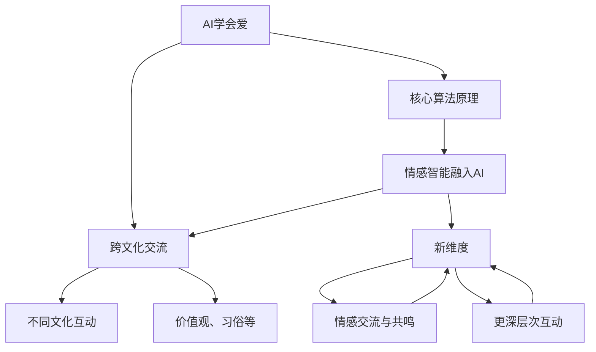

                 

### 1. 引言

在当今全球化的世界中，跨文化交流变得日益重要。然而，不同文化之间的沟通障碍和文化差异常常成为人们相互理解的最大障碍。传统的跨文化交流方法依赖于语言翻译、文化培训以及个人经验的积累，但这些方法往往有限且耗时。随着人工智能技术的飞速发展，我们迎来了一个全新的时代——AI学会爱，为跨文化交流带来了前所未有的新维度。

本文将探讨AI如何学会爱，以及这一技术如何应用于跨文化交流。我们将首先介绍AI与爱之间的关系，分析核心算法原理和实现方法。接着，我们将深入探讨AI在跨文化交流中的新角色，通过具体案例展示AI如何帮助理解不同文化背景下的情感表达和交流方式。此外，我们还将讨论AI学会爱在跨文化交流中面临的挑战，以及未来的发展方向。

### 1.1 书籍背景与目标

《当AI学会爱：跨文化交流的新维度》旨在探讨人工智能与跨文化交流的交汇点，为读者提供一种全新的视角来理解两者之间的相互作用。随着人工智能技术的不断进步，AI不仅在数据处理和模式识别方面表现出色，而且在情感理解和生成方面也取得了显著成果。AI学会爱这一概念，正是基于这一背景而提出的。

本书的目标是：
1. 介绍AI学会爱的基本原理和核心算法，帮助读者理解AI如何学会情感。
2. 分析AI在跨文化交流中的新角色，展示其在不同文化背景下的应用潜力。
3. 讨论AI学会爱在跨文化交流中面临的挑战，提出可能的解决方案。
4. 展望AI学会爱在未来的发展趋势，为读者提供前瞻性思考。

通过这本书，我们希望读者能够：
1. 深入理解AI学会爱的技术基础。
2. 了解AI在跨文化交流中的应用场景。
3. 思考AI学会爱对人类社会的潜在影响。
4. 探索未来AI在跨文化交流中的发展方向。

### 1.2 关键概念介绍

在深入探讨AI学会爱及其在跨文化交流中的应用之前，我们需要明确几个关键概念，并解释它们之间的联系。

#### AI学会爱

AI学会爱是指人工智能系统能够理解、感知和生成情感，从而在与人类互动时表现出更加自然和贴心的行为。这一概念突破了传统的AI功能，将情感智能融入其中，使其不仅能够处理数据，还能理解和回应人类的情感需求。

#### 跨文化交流

跨文化交流是指不同文化背景下的个体或群体之间的交流和互动。它涵盖了语言、价值观、习俗、行为规范等多个方面。跨文化交流的目的是促进不同文化之间的相互理解与合作。

#### 新维度

在本文中，“新维度”指的是AI学会爱为跨文化交流带来的全新视角和方法。通过AI的情感理解和生成能力，跨文化交流不再仅限于语言和信息的传递，而是扩展到情感的交流和共鸣，从而实现更深层次的互动和理解。

#### 关系架构

为了更好地理解这些概念之间的关系，我们可以使用Mermaid流程图来展示它们之间的联系：

通过这个流程图，我们可以清晰地看到AI学会爱如何通过情感智能的融入，为跨文化交流带来新的维度，实现更深入的情感交流和互动。在接下来的章节中，我们将逐一探讨这些概念，并详细分析它们的应用和影响。

