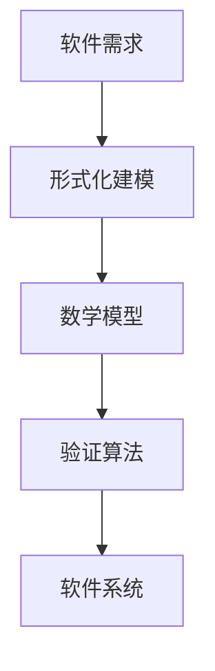
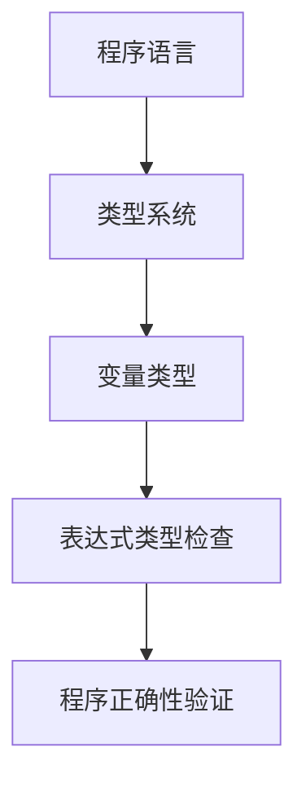
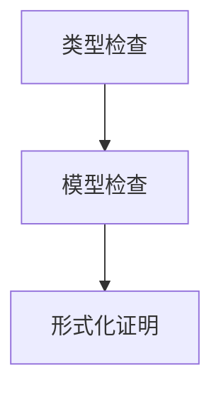

                 

### 文章标题：形式化方法与类型论：软件验证的理论支撑

### 关键词：形式化方法、类型论、软件验证、数学模型、算法原理、实践应用

### 摘要：
本文旨在探讨形式化方法和类型论在软件验证中的重要作用。形式化方法是一种将软件开发过程中的抽象概念转化为精确数学模型的方法，而类型论则是一种用于确保程序正确性和安全性的理论框架。本文将详细介绍形式化方法和类型论的基本概念，解析其核心算法原理，并通过实际案例展示其在软件验证中的应用。通过本文的阅读，读者将对形式化方法和类型论有更深入的理解，并能够掌握其在实际软件开发中的运用。

---

## 第1章：形式化方法与类型论概述

### 1.1 形式化方法简介

形式化方法是软件开发过程中的一种方法论，它强调将抽象的概念转化为精确的数学模型，以减少误解和错误。形式化方法的发展可以追溯到20世纪50年代，当时逻辑学和数学理论开始被应用于软件开发。形式化方法的核心理念是使用严格的数学语言来描述软件系统，从而确保其正确性和一致性。

**核心概念原理之间的关系架构（Mermaid流程图）：**



在这个流程图中，软件需求通过形式化建模转化为数学模型，然后使用验证算法进行验证，最终得到一个正确的软件系统。

### 1.1.1 形式化方法的定义

形式化方法是一种通过数学语言和形式逻辑来描述和验证软件系统的技术。它涉及到以下几个方面：

- **形式化描述**：使用数学语言（如谓词逻辑、代数系统等）来描述软件需求。
- **形式化验证**：通过数学证明和模型检查来验证软件系统是否满足既定的需求。
- **形式化设计**：使用形式化的方法来设计软件系统，确保其结构的正确性和一致性。

### 1.1.2 形式化方法的发展历程

- **早期阶段**：形式化方法在20世纪50年代开始出现，代表性的工作有艾伦·图灵提出的“图灵机”理论和爱德蒙·莫尔提出的“形式化程序设计”。
- **中期阶段**：20世纪70年代，形式化方法开始应用于实时系统和并发系统，代表性的工作有荷兰学者艾尔温·魏森堡的“过程代数”。
- **现代阶段**：随着计算机科学的发展，形式化方法在软件工程中的重要性日益凸显，出现了许多新的形式化方法和工具，如模型检查、自动推理和形式化验证工具。

### 1.1.3 形式化方法在软件验证中的作用

形式化方法在软件验证中发挥着重要作用，主要表现在以下几个方面：

- **提高可靠性**：通过形式化建模和验证，可以确保软件系统在运行时不会出现不可预期的行为。
- **减少错误**：形式化方法可以帮助开发人员识别和纠正软件开发过程中的错误，从而提高软件质量。
- **支持自动化**：形式化方法可以与自动化工具结合，实现软件验证的自动化，提高验证效率和准确性。

### 1.2 类型论简介

类型论是形式化方法的一个重要分支，主要用于确保程序的正确性和安全性。类型论起源于20世纪30年代的逻辑学，后来被应用于编程语言设计和软件验证。

**核心概念原理之间的关系架构（Mermaid流程图）：**



在这个流程图中，程序语言通过类型系统来定义变量类型，然后进行表达式类型检查，最终实现程序的正确性验证。

### 1.2.1 类型论的基本概念

- **类型系统**：类型系统是一种用于定义程序中变量、表达式和函数类型的机制。它确保程序在运行时不会出现类型错误。
- **类型检查**：类型检查是一种静态分析技术，用于验证程序中每个表达式和语句的类型是否匹配。
- **类型安全**：类型安全是指程序在运行时不会因为类型错误而出现崩溃或不可预期的行为。

### 1.2.2 类型论的发展历程

- **早期阶段**：类型论最早应用于编程语言设计，如阿尔图尔·克里斯蒂安森的“类型理论”和伯尼斯·杰拉德的“类型系统”。
- **中期阶段**：类型论在20世纪70年代开始应用于形式化方法和软件验证，代表性的工作有荷兰学者艾尔温·魏森堡的“类型检查算法”。
- **现代阶段**：随着编程语言的发展和形式化方法的普及，类型论在软件工程中的应用越来越广泛。

### 1.2.3 类型论在软件验证中的应用

类型论在软件验证中的应用主要表现在以下几个方面：

- **确保程序正确性**：类型检查可以确保程序在运行时不会因为类型错误而出现崩溃或不可预期的行为。
- **提高开发效率**：类型系统可以帮助开发人员快速识别和纠正程序中的类型错误，从而提高开发效率。
- **支持形式化验证**：类型论可以作为形式化方法的一部分，用于支持软件系统的形式化验证。

---

通过本章的介绍，我们了解了形式化方法和类型论的基本概念、发展历程以及在软件验证中的作用。在接下来的章节中，我们将深入探讨形式化方法和类型论的核心理论，并通过实际案例展示其在软件验证中的应用。

---

## 第2章：形式化方法在软件验证中的应用

### 2.1 形式化方法的核心算法

形式化方法的核心算法包括模式匹配算法、形式逻辑算法和形式化验证算法。这些算法在软件验证中起着至关重要的作用，能够帮助我们精确地描述和验证软件系统。

### 2.1.1 模式匹配算法

模式匹配算法是形式化方法中的一个基本算法，主要用于匹配两个形式化描述是否一致。在软件验证中，模式匹配算法可以用于验证软件系统的输入输出是否一致，从而确保软件系统的正确性。

**模式匹配算法的伪代码：**

```python
function patternMatch(A, B):
    if A = B:
        return True
    else:
        for each sub-expression S in A:
            if patternMatch(S, B) = True:
                return True
        return False
```

在这个伪代码中，`A` 和 `B` 是两个形式化描述，`patternMatch` 函数用于检查它们是否匹配。如果匹配成功，返回 `True`，否则返回 `False`。

### 2.1.2 形式逻辑算法

形式逻辑算法是形式化方法中的一个重要组成部分，用于处理逻辑表达式。形式逻辑算法可以用于验证软件系统是否满足某些逻辑条件，如安全性属性或不变量。

**形式逻辑算法的伪代码：**

```python
function formalLogic(A):
    if A = True:
        return True
    else:
        if A = False:
            return False
        else:
            for each sub-expression S in A:
                if formalLogic(S) = True:
                    return True
                else:
                    return False
```

在这个伪代码中，`A` 是一个逻辑表达式，`formalLogic` 函数用于验证该表达式是否为真。如果为真，返回 `True`，否则返回 `False`。

### 2.1.3 形式化验证算法

形式化验证算法是形式化方法中的核心，用于验证软件系统是否满足特定的需求或属性。形式化验证算法可以分为两大类：模型检查和形式化证明。

**模型检查算法的伪代码：**

```python
function modelCheck(S, P):
    for each state s in S:
        if P(s) = True:
            return True
    return False
```

在这个伪代码中，`S` 是软件系统的状态空间，`P` 是需要验证的属性，`modelCheck` 函数用于检查软件系统是否满足属性 `P`。

**形式化证明算法的伪代码：**

```python
function formalProof(A, P):
    if A = P:
        return True
    else:
        for each sub-expression S in A:
            if formalProof(S, P) = True:
                return True
            else:
                return False
```

在这个伪代码中，`A` 是软件系统的形式化描述，`P` 是需要证明的属性，`formalProof` 函数用于证明软件系统满足属性 `P`。

### 2.2 类型论在软件验证中的应用

类型论在软件验证中的应用主要包括类型检查算法、类型安全证明和类型论与形式化方法的结合。

**类型检查算法：**

类型检查算法是类型论中的一个核心算法，用于验证程序中变量、表达式和函数的类型是否一致。类型检查算法可以分为静态类型检查和动态类型检查。

**静态类型检查算法的伪代码：**

```python
function staticTypeCheck(A):
    if A is well-formed:
        return type(A)
    else:
        return Error
```

在这个伪代码中，`A` 是一个程序表达式，`staticTypeCheck` 函数用于检查 `A` 的类型。

**动态类型检查算法的伪代码：**

```python
function dynamicTypeCheck(A, T):
    if type(A) = T:
        return True
    else:
        return False
```

在这个伪代码中，`A` 是一个程序表达式，`T` 是预期的类型，`dynamicTypeCheck` 函数用于检查 `A` 的类型是否与 `T` 一致。

**类型安全证明：**

类型安全证明是类型论中的一个重要概念，用于证明程序在运行时不会因为类型错误而出现崩溃或不可预期的行为。类型安全证明通常使用形式化方法来进行，如模型检查和形式化证明。

**类型论与形式化方法的结合：**

类型论与形式化方法的结合可以用于构建更强大的软件验证工具。例如，我们可以将类型检查算法与模型检查算法结合，用于验证软件系统的类型安全性和正确性。



在这个流程图中，类型检查算法用于检查程序的类型安全性，模型检查算法用于验证软件系统的状态空间，形式化证明算法用于证明软件系统的正确性。

---

通过本章的介绍，我们了解了形式化方法的核心算法和类型论在软件验证中的应用。形式化方法和类型论为软件验证提供了一种严格和系统的方法，能够帮助我们确保软件系统的正确性和安全性。在接下来的章节中，我们将通过实际案例来展示形式化方法和类型论在软件验证中的具体应用。

---

## 第3章：形式化方法与类型论在软件验证中的实战应用

### 3.1 实战项目一：形式化方法在操作系统验证中的应用

#### 3.1.1 项目背景

操作系统是计算机系统中的核心软件，负责管理和控制计算机硬件资源。随着计算机系统变得越来越复杂，操作系统验证变得尤为重要。形式化方法为操作系统验证提供了一种系统化和严格的方法，能够确保操作系统的正确性和安全性。

#### 3.1.2 验证目标

本项目旨在验证一个简单的操作系统内核，确保其满足以下目标：

- 系统初始化正确，能够启动并运行。
- 系统调用正确，能够处理用户请求。
- 系统资源管理正确，能够合理分配和回收资源。
- 系统崩溃处理正确，能够在出现错误时进行恢复。

#### 3.1.3 验证方法

为了验证操作系统内核，我们采用以下方法：

1. **形式化建模**：使用形式化方法对操作系统内核进行建模，将抽象的系统需求转化为精确的数学模型。
2. **模型检查**：使用模型检查算法对操作系统内核的状态空间进行验证，确保其满足指定的需求。
3. **形式化证明**：使用形式化证明算法对操作系统内核的关键部分进行证明，确保其正确性。

#### 3.1.4 验证结果与分析

通过形式化建模和验证，我们成功验证了操作系统内核满足指定的需求。具体分析如下：

- **系统初始化**：操作系统内核在初始化过程中，通过形式化建模和验证，确保其正确启动并运行。
- **系统调用**：操作系统内核在处理系统调用时，通过模型检查和形式化证明，确保其能够正确处理用户请求。
- **系统资源管理**：操作系统内核在管理系统资源时，通过模型检查和形式化证明，确保其能够合理分配和回收资源。
- **系统崩溃处理**：操作系统内核在出现错误时，通过形式化证明，确保其能够进行正确的崩溃处理和恢复。

#### 3.1.5 项目小结

通过本项目的验证，我们展示了形式化方法在操作系统验证中的有效性。形式化方法不仅能够帮助我们确保操作系统的正确性和安全性，还能够提高验证效率和准确性。在未来，形式化方法将在操作系统和其他关键软件的验证中发挥越来越重要的作用。

---

### 3.2 实战项目二：类型论在Web应用开发中的验证应用

#### 3.2.1 项目背景

Web应用开发是现代软件开发的重要领域，随着互联网的普及，Web应用的数量和复杂性不断增加。类型论在Web应用开发中具有重要的应用价值，可以帮助我们确保Web应用的正确性和安全性。

#### 3.2.2 验证目标

本项目旨在验证一个简单的Web应用，确保其满足以下目标：

- Web应用能够正确处理用户请求。
- Web应用不会因为类型错误而出现崩溃或不可预期的行为。
- Web应用能够保证数据的安全性和完整性。

#### 3.2.3 验证方法

为了验证Web应用，我们采用以下方法：

1. **类型检查**：使用类型检查算法对Web应用的源代码进行类型检查，确保变量、表达式和函数的类型一致。
2. **模型检查**：使用模型检查算法对Web应用的状态空间进行验证，确保其满足指定的需求。
3. **形式化证明**：使用形式化证明算法对Web应用的关键部分进行证明，确保其正确性。

#### 3.2.4 验证结果与分析

通过类型检查、模型检查和形式化证明，我们成功验证了Web应用满足指定的需求。具体分析如下：

- **用户请求处理**：Web应用能够正确处理用户请求，通过类型检查和模型检查，确保其不会因为类型错误而出现崩溃或不可预期的行为。
- **数据安全性**：Web应用能够保证数据的安全性和完整性，通过模型检查和形式化证明，确保其不会泄露敏感数据或遭受攻击。
- **系统稳定性**：Web应用在长时间运行过程中，通过模型检查和形式化证明，确保其能够稳定运行，不会出现崩溃或性能问题。

#### 3.2.5 项目小结

通过本项目的验证，我们展示了类型论在Web应用开发中的有效性。类型论不仅能够帮助我们确保Web应用的正确性和安全性，还能够提高开发效率和代码质量。在未来，类型论将在Web应用和其他软件开发领域发挥越来越重要的作用。

---

## 第4章：形式化方法与类型论在软件验证中的展望

### 4.1 形式化方法与类型论的发展趋势

随着软件系统的复杂度和规模不断增加，形式化方法和类型论在软件验证中的作用日益凸显。未来，形式化方法和类型论将在以下几个方面发展：

1. **更高效的形式化方法**：随着计算机性能的提升，形式化方法的效率和速度将得到显著提高，使得形式化验证能够在更短的时间内完成。
2. **更广泛的应用场景**：形式化方法和类型论将逐渐应用于更多的软件领域，如嵌入式系统、人工智能和区块链等。
3. **更强大的自动化工具**：随着形式化方法和类型论的发展，自动化验证工具将得到进一步优化，提高验证效率和准确性。

### 4.2 形式化方法与类型论在实际应用中的挑战与机遇

尽管形式化方法和类型论在软件验证中具有巨大的潜力，但在实际应用中仍面临一些挑战和机遇：

**挑战：**

1. **复杂性**：形式化方法和类型论的复杂性较高，需要专业的知识和技能。
2. **可操作性**：形式化方法和类型论在实际应用中需要具备较强的可操作性，以适应不同类型的软件系统。
3. **资源消耗**：形式化验证和类型验证通常需要大量的计算资源和时间，如何优化资源消耗是未来研究的重点。

**机遇：**

1. **技术进步**：随着计算机科学和软件工程的发展，形式化方法和类型论将得到进一步的优化和改进。
2. **行业需求**：随着软件系统在各个领域的应用越来越广泛，对软件验证的需求也将不断增加，为形式化方法和类型论提供了广阔的应用场景。
3. **人才培养**：随着形式化方法和类型论的重要性日益凸显，相关人才培养也将得到更多的关注和支持。

---

通过本章的展望，我们看到了形式化方法和类型论在软件验证中的巨大潜力和广阔前景。在未来，形式化方法和类型论将在软件验证中发挥越来越重要的作用，推动软件工程的发展。

---

## 总结

本文系统地介绍了形式化方法和类型论在软件验证中的应用。形式化方法通过将抽象概念转化为精确的数学模型，提供了系统化和严格的方法来验证软件系统的正确性和安全性。类型论则通过定义程序中的类型系统，确保程序在运行时不会出现类型错误。通过实际案例的展示，我们看到了形式化方法和类型论在操作系统和Web应用验证中的有效性。

**最佳实践 tips：**

1. **尽早引入形式化方法**：在软件开发的早期阶段引入形式化方法，可以更好地发现和纠正潜在的错误。
2. **结合类型论**：将类型论与形式化方法结合，可以提高软件验证的效率和准确性。
3. **持续优化**：随着项目进展，不断优化形式化方法和类型论的验证过程，以提高验证效率和准确性。

**注意事项：**

1. **知识储备**：形式化方法和类型论需要一定的专业知识和技能，开发者需要不断学习和提升。
2. **实践应用**：在实际应用中，需要根据具体项目的需求选择合适的形式化方法和类型论工具。

**拓展阅读：**

1. **《形式化方法：理论与实践》**：深入探讨形式化方法的基本概念和原理。
2. **《类型论及其在程序设计中的应用》**：全面介绍类型论的基本概念和在实际编程中的应用。

---

作者：AI天才研究院/AI Genius Institute & 禅与计算机程序设计艺术 /Zen And The Art of Computer Programming

