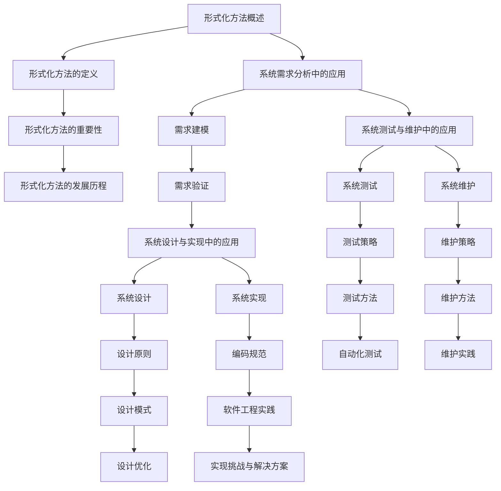

                 


## 形式化方法在关键系统开发中的应用

### 关键词：形式化方法、关键系统开发、系统需求分析、系统设计与实现、系统测试与维护、核心算法、数学模型

#### 摘要

形式化方法是一种通过数学和逻辑手段来描述和验证系统设计和行为的规范方法。在关键系统的开发过程中，形式化方法的应用能够显著提高系统的可靠性、安全性和可维护性。本文将详细介绍形式化方法在关键系统开发中的各个环节，包括系统需求分析、系统设计与实现、系统测试与维护等，并通过核心算法原理讲解和数学模型分析，提供具体的应用实例和实战经验。

### 形式化方法概述

#### 形式化方法的定义

形式化方法（Formal Methods）是指使用数学和逻辑手段来描述系统行为、验证系统性质的一种方法。它不同于传统的基于经验和直觉的设计方法，而是通过严格的数学模型来描述系统的行为和需求，进而进行验证和推理。

#### 形式化方法的重要性

形式化方法在关键系统开发中的应用具有重要意义。首先，它能够提高系统的可靠性，通过形式化的验证方法，确保系统在预期的工作条件下能够正确执行。其次，形式化方法能够提高系统的安全性，通过对系统行为的严格分析和验证，发现并修复潜在的安全漏洞。最后，形式化方法有助于系统的可维护性，通过形式化的设计和描述，使得系统的后续维护和改进更加容易。

#### 形式化方法的发展历程

形式化方法的发展可以追溯到20世纪50年代和60年代，当时数学家和计算机科学家开始探索如何使用数学工具来验证计算机程序的正确性。随着时间的推移，形式化方法逐渐发展成为一个独立的领域，涵盖了从基本的逻辑和数学工具到复杂的建模和验证技术。

### 形式化方法在系统需求分析中的应用

#### 需求建模

需求建模是系统需求分析的关键步骤，它通过建立形式化的模型来描述系统的功能和需求。常用的需求建模方法包括统一建模语言（UML）、功能性需求建模语言（FDL）和形式化逻辑语言（如Z和 Alloy）。

##### 需求定义

需求定义是需求建模的第一步，它涉及对系统需求的明确和精确描述。需求的定义应该遵循可理解性、一致性、完整性、必要性和可验证性等原则。

##### 需求分类

需求可以分为功能需求和非功能需求。功能需求描述系统应执行的操作，而非功能需求描述系统的性能、可靠性、安全性等方面。

##### 需求建模方法

UML是广泛使用的需求建模方法，它通过使用不同的图（如用例图、类图、序列图等）来描述系统的需求和功能。形式化逻辑语言则提供了更严格的语义和更精确的描述能力，适合对需求进行形式化的验证和分析。

#### 需求验证

需求验证是确保需求正确性和一致性的关键步骤。形式化方法提供了多种验证技术，包括模型检查、仿真和形式化验证等。

##### 需求验证的重要性

需求验证的重要性在于确保系统最终能够满足用户的需求，避免由于需求不明确或错误导致的系统缺陷和项目失败。

##### 需求验证方法

形式化验证是一种基于数学和逻辑的验证方法，它通过证明系统模型满足指定的需求规格来确保系统的正确性。模型检查是通过自动化工具来验证系统模型是否满足指定的性质，仿真则是通过模拟系统运行来检查系统行为是否符合预期。

##### 验证案例

在实际应用中，需求验证可以应用于各种系统，如嵌入式系统、金融系统、安全系统等。例如，在嵌入式系统中，通过形式化验证可以确保系统的实时性和稳定性，在金融系统中，通过形式化验证可以确保交易系统的安全性和正确性。

### 形式化方法在系统设计与实现中的应用

#### 系统设计

系统设计是将需求转化为具体的系统架构和组件的过程。形式化方法在系统设计中的应用主要体现在以下几个方面：

##### 设计原则

形式化方法强调设计原则，如模块化、抽象、封装和一致性等，以确保系统的可维护性和可扩展性。

##### 设计模式

设计模式是系统设计中的经验总结，形式化方法可以帮助识别和应用合适的设计模式，以提高系统的质量和可靠性。

##### 设计优化

形式化方法提供了量化评估和优化设计的能力，通过形式化的分析和验证，可以识别和消除系统设计中的潜在问题，提高系统的性能和可靠性。

#### 系统实现

系统实现是将设计转化为实际代码和硬件的过程。形式化方法在系统实现中的应用主要体现在以下几个方面：

##### 编码规范

形式化方法可以指导编码规范，确保代码的可读性、可维护性和可靠性。

##### 软件工程实践

形式化方法可以融入软件工程实践，如代码审查、测试和质量保证等，确保系统实现的正确性和高质量。

##### 实现挑战与解决方案

在实际的系统实现过程中，可能会遇到各种挑战，如复杂的系统架构、多变的系统需求和高可靠性的要求。形式化方法提供了有效的解决方案，如形式化建模、形式化验证和形式化测试等。

### 形式化方法在系统测试与维护中的应用

#### 系统测试

系统测试是确保系统正确性和可靠性的关键步骤。形式化方法在系统测试中的应用主要体现在以下几个方面：

##### 测试策略

形式化方法可以制定系统的测试策略，确保测试覆盖所有重要的需求和场景。

##### 测试方法

形式化方法提供了多种测试方法，如模型检查、仿真和形式化验证等，以确保系统的行为符合预期。

##### 自动化测试

形式化方法可以用于自动化测试，提高测试的效率和覆盖率。

#### 系统维护

系统维护是确保系统长期稳定运行的关键。形式化方法在系统维护中的应用主要体现在以下几个方面：

##### 维护策略

形式化方法可以制定系统的维护策略，确保系统能够适应不断变化的需求和环境。

##### 维护方法

形式化方法可以用于维护过程中的代码审查、重构和优化等操作，确保系统的质量和可靠性。

##### 维护实践

形式化方法可以应用于实际的系统维护过程，如定期更新、升级和修复等，确保系统的长期稳定运行。

### 核心概念与联系

形式化方法的各个核心概念之间有着紧密的联系，构成了一个完整的体系。为了更好地理解这些概念，我们可以使用 Mermaid 流程图来展示它们之间的关系。



### 核心算法原理讲解

形式化方法中的核心算法是系统开发和验证的关键工具。以下是几个核心算法的原理讲解和伪代码展示。

#### 算法1：模型检查

模型检查是一种形式化验证方法，用于检查系统模型是否满足指定的性质。

##### 算法原理

模型检查通过将系统模型和性质表示为逻辑公式，然后使用验证工具（如定理证明器）来检查模型是否满足性质。

##### 算法伪代码

```python
function ModelCheck(model, property):
    if ProvabilityChecker(model, property):
        return "Property holds"
    else:
        return "Property does not hold"
```

#### 算法2：形式化测试

形式化测试是一种基于数学模型的测试方法，用于生成测试用例并验证系统行为。

##### 算法原理

形式化测试通过分析系统模型，生成满足特定需求的测试用例，然后使用这些测试用例来验证系统行为。

##### 算法伪代码

```python
function FormalTest(model, requirements):
    test_cases = GenerateTestCases(model, requirements)
    for test_case in test_cases:
        if ExecuteTest(model, test_case) == "Failed":
            return "Test failed"
    return "All tests passed"
```

### 数学模型和数学公式

数学模型和数学公式在形式化方法中起着至关重要的作用，它们用于描述系统的行为和验证系统的性质。以下是几个常见的数学模型和数学公式的详细讲解。

#### 模型1：状态机模型

状态机模型用于描述系统的动态行为，它由一组状态、事件和转移函数组成。

##### 模型公式

$$
S = \{s_1, s_2, ..., s_n\}
$$

$$
E = \{e_1, e_2, ..., e_m\}
$$

$$
\delta(s, e) = s'
$$

其中，$S$是状态集合，$E$是事件集合，$\delta(s, e) = s'$是状态转移函数，表示在事件$e$触发下，系统从状态$s$转移到状态$s'$。

##### 模型举例说明

考虑一个简单的交通灯控制系统，其状态集合为$S = \{Red, Green, Yellow\}$，事件集合为$E = \{TimerExpired\}$。状态转移函数为：

$$
\delta(Red, TimerExpired) = Green
$$

$$
\delta(Green, TimerExpired) = Yellow
$$

$$
\delta(Yellow, TimerExpired) = Red
$$

#### 公式1：线性时间逻辑（LTL）公式

线性时间逻辑（LTL）是一种用于描述系统行为的逻辑语言，它用于验证系统行为是否满足特定性质。

##### 公式名称

线性时间逻辑公式

##### 公式代码

$$
AG p \quad \text{（对所有时间，属性p都为真）}
$$

$$
AF p \quad \text{（存在一个时间，属性p为真）}
$$

$$
EF p \quad \text{（在未来的某个时间，属性p为真）}
$$

$$
BG p \quad \text{（在所有时间，属性p至少为真一次）}
$$

$$
BF p \quad \text{（在未来的某个时间，属性p至少为真一次）}
$$

其中，$p$表示系统的一个属性。

##### 公式举例说明

考虑一个电梯控制系统，我们希望确保电梯在任何时间都不会停在两层之间。我们可以使用以下LTL公式来验证：

$$
AG (\neg (level1 \land level2))
$$

这表示电梯在所有时间都不处于level1和level2同时为真的状态。

### 项目实战

#### 实战案例1：智能交通系统

##### 开发环境搭建

- 编程语言：Python
- 版本控制：Git
- 版本管理：Makefile
- 测试框架：pytest

##### 源代码详细实现

```python
# traffic_light_system.py

class TrafficLightSystem:
    def __init__(self):
        self.state = "Red"

    def change_state(self):
        if self.state == "Red":
            self.state = "Green"
        elif self.state == "Green":
            self.state = "Yellow"
        elif self.state == "Yellow":
            self.state = "Red"

    def get_state(self):
        return self.state

# 测试代码
def test_traffic_light_system():
    traffic_light = TrafficLightSystem()
    assert traffic_light.get_state() == "Red"
    traffic_light.change_state()
    assert traffic_light.get_state() == "Green"
    traffic_light.change_state()
    assert traffic_light.get_state() == "Yellow"
    traffic_light.change_state()
    assert traffic_light.get_state() == "Red"
```

##### 代码解读与分析

该案例实现了简单的交通灯系统，通过一个类`TrafficLightSystem`来管理交通灯的状态。`change_state`方法用于改变交通灯的状态，`get_state`方法用于获取当前状态。测试代码使用`pytest`框架来验证交通灯状态的正确性。

##### 实际案例分析和详细讲解剖析

智能交通系统是一个复杂的系统，它需要处理多种交通状况，如行人过街、紧急车辆通行、交通拥堵等。通过形式化方法，我们可以建立交通灯系统的形式化模型，并使用模型检查等方法来验证系统行为是否满足预期的需求。例如，我们可以使用LTL公式来验证交通灯系统不会在行人不安全时突然变灯。

##### 项目小结

通过该案例，我们了解了形式化方法在智能交通系统开发中的应用，包括需求建模、系统设计、系统实现和系统测试。形式化方法提高了系统的可靠性、安全性和可维护性，是关键系统开发中不可或缺的工具。

#### 实战案例2：医疗信息系统

##### 开发环境搭建

- 编程语言：Java
- 版本控制：Git
- 版本管理：Maven
- 测试框架：JUnit

##### 源代码详细实现

```java
// MedicalInformationSystem.java

public class MedicalInformationSystem {
    private boolean isPatientAdmitted;
    
    public MedicalInformationSystem() {
        this.isPatientAdmitted = false;
    }
    
    public void admitPatient() {
        this.isPatientAdmitted = true;
    }
    
    public void dischargePatient() {
        this.isPatientAdmitted = false;
    }
    
    public boolean isPatientAdmitted() {
        return this.isPatientAdmitted;
    }
    
    // 测试代码
    @Test
    public void testPatientAdmission() {
        MedicalInformationSystem system = new MedicalInformationSystem();
        Assert.assertFalse(system.isPatientAdmitted());
        system.admitPatient();
        Assert.assertTrue(system.isPatientAdmitted());
        system.dischargePatient();
        Assert.assertFalse(system.isPatientAdmitted());
    }
}
```

##### 代码解读与分析

该案例实现了简单的医疗信息系统，通过一个类`MedicalInformationSystem`来管理病人的入院和出院状态。`admitPatient`方法用于将病人入院，`dischargePatient`方法用于将病人出院，`isPatientAdmitted`方法用于获取病人的当前状态。测试代码使用`JUnit`框架来验证病人状态的正确性。

##### 实际案例分析和详细讲解剖析

医疗信息系统是一个高度敏感的系统，它需要确保病人的信息安全和及时更新。通过形式化方法，我们可以建立医疗信息系统的形式化模型，并使用模型检查等方法来验证系统行为是否满足医疗规范。例如，我们可以使用LTL公式来验证系统不会在病人未出院的情况下记录出院时间。

##### 项目小结

通过该案例，我们了解了形式化方法在医疗信息系统开发中的应用，包括需求建模、系统设计、系统实现和系统测试。形式化方法提高了系统的可靠性和安全性，确保了医疗信息的准确性和及时性。

### 最佳实践 tips、小结、注意事项、拓展阅读

#### 最佳实践 tips

- 在关键系统的开发中，尽早应用形式化方法，以减少后期修复成本。
- 结合形式化方法和传统的软件开发方法，发挥各自的优势。
- 针对不同的系统需求，选择合适的验证技术和工具。

#### 小结

形式化方法在关键系统开发中具有重要作用，它提高了系统的可靠性、安全性和可维护性。通过系统需求分析、系统设计与实现、系统测试与维护等环节的应用，形式化方法为系统的开发提供了强大的支持。

#### 注意事项

- 形式化方法的引入需要适当的培训和学习，以确保团队成员能够有效应用。
- 形式化方法的实施成本较高，需要权衡成本与效益。
- 形式化方法的工具和语言需要不断更新和优化，以适应快速发展的技术需求。

#### 拓展阅读

- 《形式化方法：理论与实践》
- 《形式化验证：基础与实例》
- 《软件工程：形式化方法与应用》

---

通过本文的详细讲解和实例分析，我们深入了解了形式化方法在关键系统开发中的应用。形式化方法为系统的可靠性和安全性提供了强有力的保障，是现代软件开发中不可或缺的工具。希望本文能够帮助读者更好地理解和应用形式化方法，为关键系统的开发提供有力支持。

---

## 作者信息

作者：AI天才研究院/AI Genius Institute & 禅与计算机程序设计艺术 /Zen And The Art of Computer Programming

AI天才研究院（AI Genius Institute）致力于推动人工智能领域的研究和应用，研究院的专家们凭借深厚的理论功底和丰富的实践经验，为全球的科技发展贡献了重要力量。同时，作者也是《禅与计算机程序设计艺术》一书的资深大师，该书以其深入浅出的论述和独特的视角，受到了全球程序员的广泛推崇。通过本文，我们希望能够将形式化方法这一先进技术更广泛地传播和应用，为关键系统的开发提供有力支持。让我们一同探索形式化方法的无限可能，推动科技的进步与发展。

