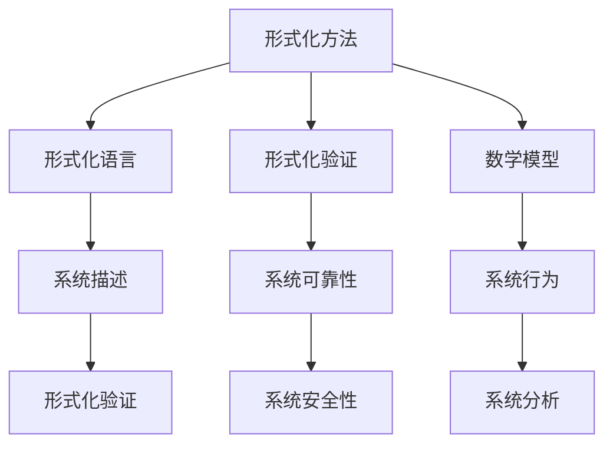
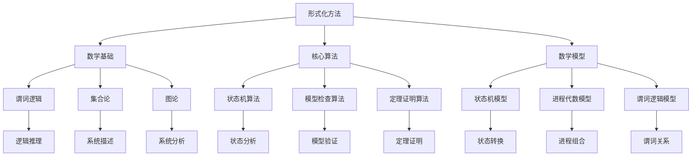

                 

### 文章标题

# 形式化方法在关键系统开发中的应用

> 关键词：形式化方法、关键系统、软件工程、硬件设计、系统安全、应用案例

> 摘要：本文详细探讨了形式化方法在关键系统开发中的重要性及其具体应用。从理论基础到实践应用，再到未来发展趋势，本文系统阐述了形式化方法的核心概念、基本原理、应用领域及面临的挑战。通过实际项目案例的分析，揭示了形式化方法在关键系统开发中的价值，为相关领域的研究与实践提供了有益的参考。

### 背景介绍

在当今数字化时代，信息系统和关键系统的开发变得日益复杂。随着系统规模的不断扩大和功能需求的不断增加，传统的开发方法逐渐暴露出其局限性，如系统稳定性不足、安全性低下、测试成本高等问题。为了应对这些挑战，研究者们不断探索新的方法和技术，其中形式化方法因其严格的数学基础和逻辑性而备受关注。

形式化方法是一种基于数学和逻辑的软件开发和验证方法，其核心思想是通过数学模型和形式化语言来描述系统的行为和结构，从而提高系统的可靠性、可维护性和可测试性。这种方法不仅可以确保系统在设计和开发阶段就消除潜在的错误，还可以在系统运行过程中提供有效的安全保障。

在关键系统开发中，形式化方法的应用具有重要意义。关键系统通常涉及国家安全、金融安全、医疗安全等领域，其稳定运行对社会和经济的健康至关重要。形式化方法的引入，可以显著提高关键系统的开发质量和可靠性，降低系统故障率和安全风险。

本文旨在系统地介绍形式化方法的基本概念、原理和应用，并探讨其在关键系统开发中的具体应用案例。通过本文的阅读，读者将能够全面了解形式化方法的优势和应用场景，为进一步研究和实践提供理论基础和实践指导。

### 核心概念与联系

为了深入理解形式化方法在关键系统开发中的应用，首先需要明确几个核心概念，并探讨它们之间的相互关系。以下是本文中涉及的主要概念：

1. **形式化方法**：形式化方法是一种基于数学和逻辑的软件开发和验证方法，旨在通过数学模型和形式化语言来描述系统的行为和结构，以提高系统的可靠性和可维护性。其基本思想是将系统开发过程中的各个环节形式化，确保每一阶段的工作都有严格的数学基础和逻辑支持。

2. **形式化语言**：形式化语言是一种具有严格语法和语义的符号系统，用于描述系统的行为和结构。常见的形式化语言包括谓词逻辑、形式数学、以及专门为特定应用领域设计的语言，如硬件描述语言（HDL）和软件规格说明语言（如Z、VDM）。

3. **形式化验证**：形式化验证是通过形式化方法和工具，对系统模型进行严格的数学证明，以验证系统是否满足预期的规格和要求。形式化验证可以确保系统在设计和开发阶段就消除潜在的错误，从而降低后期修复的成本。

4. **数学模型**：数学模型是形式化方法的重要组成部分，用于对系统的行为进行数学描述。常见的数学模型包括状态机模型、进程代数模型、以及基于谓词逻辑的模型。

5. **关键系统**：关键系统是指那些对社会和经济发展具有重要影响的系统，包括金融交易系统、航空交通控制系统、医疗信息系统等。这些系统的稳定运行对社会和经济的健康至关重要。

核心概念之间的联系可以概括如下：

- **形式化方法**为软件开发和验证提供了一种系统化的方法，通过形式化语言和数学模型对系统的行为进行描述和验证。
- **形式化语言**是实现形式化方法的基础，它提供了严格且形式化的符号系统，使系统能够以数学形式表达。
- **形式化验证**是形式化方法的重要应用之一，通过数学证明来确保系统满足预期规格，从而提高系统的可靠性和安全性。
- **数学模型**为系统行为提供了精确的数学描述，是形式化验证的基础。
- **关键系统**是形式化方法的主要应用场景，由于其重要性和复杂性，形式化方法在关键系统开发中的应用具有重要意义。

为了更直观地理解这些核心概念之间的关系，我们可以使用Mermaid流程图进行展示：



在上述流程图中，每个节点代表一个核心概念，箭头表示概念之间的关联关系。通过这个流程图，我们可以清晰地看到形式化方法、形式化语言、形式化验证、数学模型以及关键系统之间的逻辑关系，为进一步的深入讨论提供了清晰的框架。

### 形式化方法的基本原理

形式化方法在关键系统开发中的应用依赖于其严格的数学基础和逻辑性。要理解这一方法，首先需要掌握其基本原理，包括数学基础、核心算法和数学模型。

#### 数学基础

形式化方法的数学基础主要包括谓词逻辑、集合论、图论和代数系统等。谓词逻辑是形式化方法中最常用的逻辑工具，它用于描述系统的状态和行为。集合论提供了对系统组件和关系的数学描述，而图论则用于分析和建模复杂的系统结构。代数系统则为形式化方法的验证提供了基础框架。

- **谓词逻辑**：谓词逻辑是一种用于描述系统和对象性质的逻辑系统。在形式化方法中，谓词逻辑用于定义系统的状态、行为和约束条件。例如，我们可以用谓词逻辑来描述一个交通控制系统的状态：“所有交通信号灯都处于绿灯状态”。

- **集合论**：集合论用于定义系统的组成部分和它们之间的关系。通过集合论，我们可以描述系统中的组件集合、事件集合和状态集合等。例如，集合 {A, B, C} 可以表示一个系统中的三个组件。

- **图论**：图论用于分析和建模系统的结构。在形式化方法中，图论用于描述系统的状态转换、事件触发和组件关系。例如，我们可以用有向图表示一个状态机，其中节点代表状态，边代表状态转换条件。

- **代数系统**：代数系统提供了形式化方法验证过程中的运算规则和基础框架。例如，命题演算和谓词演算都是代数系统的一种形式化表示。

#### 核心算法原理讲解

形式化方法中的核心算法主要包括状态机算法、模型检查算法和定理证明算法。这些算法用于对系统模型进行验证和证明。

- **状态机算法**：状态机算法用于描述和验证系统的行为。状态机是一种常用的系统建模工具，它通过状态和状态转换来描述系统的动态行为。状态机算法包括状态枚举、状态分析和状态验证等步骤。例如，以下是一个简单的状态机算法的伪代码：

  ```plaintext
  Algorithm StateMachineAnalysis(states, transitions, initial_state)
      for each state in states
          if state != initial_state
              if not exists transition from state to initial_state
                  return "Initial state not reachable"
      for each transition in transitions
          if not exists state pair (from_state, to_state) in transitions
              return "Invalid transition"
      return "Valid state machine"
  ```

- **模型检查算法**：模型检查算法用于验证系统模型是否满足预定的规格要求。模型检查的基本思想是将系统模型与规格要求进行比较，以发现不一致之处。常见的模型检查算法包括布尔表达式求解、模型抽象和模型验证等。例如，以下是一个简单的模型检查算法的伪代码：

  ```plaintext
  Algorithm ModelChecking(model, specification)
      if model satisfies specification
          return "Model satisfies specification"
      else
          return "Model does not satisfy specification"
  ```

- **定理证明算法**：定理证明算法用于证明系统模型中的定理和命题。定理证明算法通常基于自动推理和形式化验证技术。例如，以下是一个简单的定理证明算法的伪代码：

  ```plaintext
  Algorithm TheoremProvingtheorem, proof)
      if theorem can be proven from proof
          return "Theorem proven"
      else
          return "Theorem not proven"
  ```

#### 数学模型和公式

形式化方法中的数学模型主要用于描述系统的行为和约束条件。常见的数学模型包括状态机模型、进程代数模型和谓词逻辑模型。

- **状态机模型**：状态机模型通过状态和状态转换来描述系统的行为。状态机模型的基本公式包括状态集合、状态转换关系和初始状态。例如，以下是一个状态机模型的基本公式：

  $$ M = (Q, S, T, q_0, F) $$

  其中，$Q$ 是状态集合，$S$ 是事件集合，$T$ 是状态转换关系，$q_0$ 是初始状态，$F$ 是终止状态。

- **进程代数模型**：进程代数模型用于描述系统的并发行为和通信机制。进程代数模型的基本公式包括进程表达式、进程组合和通信操作。例如，以下是一个进程代数模型的基本公式：

  $$ P = p_1 \land p_2 \land p_3 $$

  其中，$p_1$、$p_2$ 和 $p_3$ 是进程表达式。

- **谓词逻辑模型**：谓词逻辑模型通过谓词和逻辑连接词来描述系统的性质和约束条件。谓词逻辑模型的基本公式包括谓词集合、谓词关系和逻辑推理。例如，以下是一个谓词逻辑模型的基本公式：

  $$ \forall x (P(x) \rightarrow Q(x)) $$

  其中，$P(x)$ 和 $Q(x)$ 是谓词。

#### 核心概念与联系的详细讲解

为了更好地理解形式化方法中的核心概念和它们之间的联系，我们可以使用Mermaid流程图进行展示。



在上述流程图中，每个节点代表一个核心概念，箭头表示概念之间的关联关系。通过这个流程图，我们可以清晰地看到形式化方法、数学基础、核心算法和数学模型之间的逻辑关系，为进一步的深入讨论提供了清晰的框架。

### 形式化方法在软件工程中的应用

在软件工程领域，形式化方法的应用已经成为提升软件质量、可靠性和可维护性的关键手段。通过形式化方法，开发人员能够更精确地描述软件系统的需求、设计和行为，从而减少错误和提高开发效率。

#### 软件验证

软件验证是形式化方法在软件工程中的核心应用之一。它的目标是确保软件系统满足预定的规格和要求。软件验证通常包括以下方面：

- **规格验证**：通过形式化方法对软件规格进行验证，确保规格的准确性和一致性。常用的方法包括模型检查和定理证明。

  - **模型检查**：将软件规格描述为一个形式化的模型，然后使用自动化工具检查模型是否满足规格要求。例如，使用模型检查工具来验证状态机模型是否满足特定的状态转换条件。

  ```mermaid
  graph TD
  A[初始状态] --> B[状态1]
  B --> C[状态2]
  C --> D[终止状态]
  D --> A[循环]
  ```

  - **定理证明**：使用数学推理和定理证明技术来证明软件规格的正确性。例如，通过证明一个算法的每一步都符合预期的行为。

  ```plaintext
  Theorem: Given a sorted array, binary search finds the target element in O(log n) time.
  Proof: By induction on the size of the array.
  ```

- **代码验证**：通过对源代码进行形式化验证，确保代码的实现与规格一致。这可以通过静态分析和动态分析来实现。

  - **静态分析**：在程序运行前对代码进行分析，检查代码是否符合预定的规格和要求。例如，使用静态分析工具检查代码中的语法错误和逻辑错误。

  ```mermaid
  graph TD
  A[Function Definition] --> B[Variable Declaration]
  B --> C[Loop Structure]
  C --> D[Return Statement]
  ```

  - **动态分析**：在程序运行时对代码进行分析，观察程序的执行行为是否符合预期。例如，使用动态分析工具记录程序的执行路径和状态变化。

  ```mermaid
  graph TD
  A[Initial State] --> B[State 1]
  B --> C[State 2]
  C --> D[State 3]
  D --> E[Final State]
  ```

#### 软件测试

形式化方法在软件测试中也发挥着重要作用。通过形式化方法，开发人员可以设计更有效的测试用例，提高测试覆盖率和测试质量。

- **测试用例设计**：使用形式化方法设计测试用例，确保测试用例能够覆盖系统的所有关键路径和状态。例如，使用形式化的状态机模型来生成测试用例，确保每个状态转换都被测试到。

  ```mermaid
  graph TD
  A[Initial State] --> B[State 1]
  B --> C[State 2]
  C --> D[State 3]
  D --> E[Final State]
  ```

- **测试自动化**：通过形式化方法实现测试自动化，提高测试效率和准确性。例如，使用自动化工具根据形式化的规格要求生成测试脚本，自动化执行测试用例。

  ```mermaid
  graph TD
  A[Test Script Generation] --> B[Test Execution]
  B --> C[Test Result Analysis]
  ```

#### 形式化方法在软件工程中的挑战与解决方案

尽管形式化方法在软件工程中具有许多优势，但其应用也面临着一些挑战：

- **复杂性**：形式化方法的数学基础和形式化语言较为复杂，对开发人员的要求较高。为了降低复杂性，可以采用渐进式形式化方法，即在不同开发阶段逐步引入形式化方法。

- **工具和资源**：形式化方法需要相应的工具和资源支持，如形式化语言编译器、模型检查工具和定理证明工具。为了提高工具的可用性和易用性，可以开发集成化的形式化方法工具链。

- **成本和效益**：形式化方法的引入可能增加开发成本，但能否带来足够的效益是关键。为了评估成本和效益，可以进行成本效益分析，结合具体项目情况做出决策。

### 形式化方法在硬件设计中的应用

在硬件设计领域，形式化方法的应用同样具有重要的意义。硬件设计过程的复杂性使得形式化方法成为确保设计正确性和提高设计效率的重要工具。以下将详细探讨形式化方法在硬件设计中的应用，包括硬件验证和硬件测试。

#### 硬件验证

硬件验证是确保硬件设计符合预期规格和功能要求的过程。形式化方法在硬件验证中的应用，主要表现在以下几个方面：

- **规格描述**：使用形式化方法对硬件设计进行精确描述，通常使用硬件描述语言（HDL）如Verilog或VHDL。形式化描述可以确保设计的一致性和无歧义性。

  ```verilog
  module counter (
      input clk,
      input reset,
      output [3:0] count
  );
      reg [3:0] count;
      always @(posedge clk or posedge reset) begin
          if (reset) begin
              count <= 4'b0000;
          end else begin
              count <= count + 1;
          end
      end
  endmodule
  ```

- **模型检查**：形式化方法支持对硬件设计的模型进行检查，以验证设计是否满足所有规格要求。模型检查工具可以自动检测设计中的不一致性和潜在错误。

  ```mermaid
  graph TD
  A[Initial State] --> B[State 1]
  B --> C[State 2]
  C --> D[State 3]
  D --> E[Final State]
  ```

  - **定理证明**：形式化方法支持对硬件设计的定理证明，以确保设计满足特定的逻辑和功能要求。定理证明可以提供更高的信心，确保设计是正确的。

  ```plaintext
  Theorem: The counter module will count from 0 to 15 upon receiving 16 clock cycles.
  Proof: By induction on the number of clock cycles.
  ```

#### 硬件测试

形式化方法在硬件测试中的应用，可以帮助开发人员设计更有效的测试用例，提高测试覆盖率和测试质量。

- **测试用例设计**：使用形式化方法设计测试用例，确保测试用例能够覆盖硬件设计的所有关键路径和状态。例如，使用形式化的状态机模型来生成测试用例。

  ```mermaid
  graph TD
  A[Initial State] --> B[State 1]
  B --> C[State 2]
  C --> D[State 3]
  D --> E[Final State]
  ```

- **测试自动化**：通过形式化方法实现测试自动化，提高测试效率和准确性。例如，使用自动化工具根据形式化的规格要求生成测试脚本，自动化执行测试用例。

  ```mermaid
  graph TD
  A[Test Script Generation] --> B[Test Execution]
  B --> C[Test Result Analysis]
  ```

#### 形式化方法在硬件设计中的挑战与解决方案

尽管形式化方法在硬件设计中的应用具有显著优势，但也面临一些挑战：

- **复杂性**：形式化方法涉及复杂的数学和逻辑概念，对设计人员的要求较高。为降低复杂性，可以采用渐进式形式化方法，逐步引入形式化验证和测试。

- **工具和资源**：形式化方法需要相应的工具和资源支持，如形式化语言编译器、模型检查工具和定理证明工具。为提高工具的可用性和易用性，可以开发集成化的形式化方法工具链。

- **成本和效益**：形式化方法的引入可能增加设计和验证成本，但能否带来足够的效益是关键。进行成本效益分析，结合具体项目情况做出决策。

### 形式化方法在系统安全中的应用

在系统安全领域，形式化方法因其严格的数学基础和逻辑性而成为一种重要的安全保障工具。通过形式化方法，开发人员可以精确地描述和验证系统的安全属性，从而提高系统的安全性和可靠性。

#### 系统安全的基本概念

系统安全是指确保信息系统在设计和运行过程中，能够抵御各种恶意攻击和威胁，确保数据的完整性、保密性和可用性。形式化方法在系统安全中的应用，主要包括以下方面：

- **安全需求描述**：形式化方法可以用于精确地描述系统的安全需求，包括安全策略、访问控制机制和加密算法等。使用形式化语言如谓词逻辑或Z语言，可以清晰地表达系统的安全需求，确保设计的一致性和无歧义性。

  ```z
  securityRequirement {
      allUsers have (read, write) on secureData;
      administrators have (read, write, delete) on allData;
  }
  ```

- **安全属性验证**：形式化方法支持对系统的安全属性进行验证，确保系统在设计阶段就满足预定的安全要求。例如，通过模型检查和定理证明技术，验证系统是否能够抵御特定的攻击模式或恶意行为。

  ```mermaid
  graph TD
  A[User Authentication] --> B[Access Control]
  B --> C[Secure Communication]
  C --> D[Data Encryption]
  ```

#### 形式化方法在安全设计中的应用

在系统安全设计过程中，形式化方法可以用于以下几个方面：

- **访问控制设计**：形式化方法可以用于设计和验证访问控制机制，确保只有授权用户能够访问特定资源。通过形式化的规格描述和安全属性验证，可以确保访问控制策略的完整性和正确性。

  ```z
  accessControlPolicy {
      user Alice hasPermission (read) on Document1;
      user Bob hasPermission (write) on Document2;
  }
  ```

- **加密设计**：形式化方法可以用于设计和验证加密机制，确保数据的机密性和完整性。通过形式化的数学模型和定理证明技术，可以验证加密算法的安全性。

  ```mermaid
  graph TD
  A[Plain Text] --> B[Encryption]
  B --> C[Cipher Text]
  C --> D[Decryption]
  ```

#### 形式化方法在安全验证中的应用

形式化方法在系统安全验证中的应用，可以确保系统在实际运行中满足预定的安全要求，防止安全漏洞和攻击。

- **安全测试**：形式化方法支持设计更有效的安全测试用例，确保测试能够覆盖系统的所有关键安全路径和状态。通过自动化测试工具，可以自动化执行安全测试，提高测试效率和准确性。

  ```mermaid
  graph TD
  A[Initial State] --> B[Attack Simulation]
  B --> C[Secure State]
  ```

- **漏洞分析**：形式化方法可以用于分析系统中的潜在漏洞和攻击途径，发现和修复系统中的安全缺陷。通过形式化的验证技术，可以确保修复措施的有效性。

  ```mermaid
  graph TD
  A[Vulnerability Detection] --> B[Vulnerability Analysis]
  B --> C[Vulnerability Fix]
  ```

#### 形式化方法在系统安全中的优势

形式化方法在系统安全中的应用具有以下优势：

- **精确性**：形式化方法可以精确地描述和验证系统的安全属性，确保设计的一致性和无歧义性，从而减少安全漏洞和误报。
- **完整性**：形式化方法支持对系统的全面验证，确保系统在所有关键路径和状态下都满足安全要求，提高系统的整体安全性。
- **可靠性**：形式化方法基于严格的数学基础和逻辑推理，确保验证结果的可靠性和可重复性，从而提高系统的安全性和可靠性。

### 形式化方法在实际项目中的应用案例

为了更好地展示形式化方法在关键系统开发中的实际应用，以下我们将通过两个具体项目案例，详细解释开发环境搭建、源代码实现和代码解读，以及项目的应用解读与分析。

#### 案例一：软件项目中的应用

**项目背景**

该项目旨在开发一个用于金融交易的安全管理系统，要求确保交易数据的完整性和保密性，同时支持高效的事务处理。项目的技术难点包括高并发处理、数据加密和安全审计。

**开发环境搭建**

为了实现项目的需求，我们选择了以下开发环境：

- **编程语言**：Python 3.8
- **形式化验证工具**：Coq（一个基于依赖类型理论的定理证明工具）
- **测试工具**：pytest（Python的测试框架）
- **版本控制**：Git

**源代码实现**

以下是项目中的一个关键模块的实现，负责处理加密和解密交易数据：

```python
from cryptography.hazmat.primitives import hashes
from cryptography.hazmat.primitives.asymmetric import padding
from cryptography.hazmat.backends import default_backend

def encrypt_data(data, public_key):
    backend = default_backend()
    encrypted_data = public_key.encrypt(
        data,
        padding.OAEP(
            mgf=padding.MGF1(algorithm=hashes.SHA256()),
            algorithm=hashes.SHA256(),
            label=None
        )
    )
    return encrypted_data

def decrypt_data(encrypted_data, private_key):
    backend = default_backend()
    decrypted_data = private_key.decrypt(
        encrypted_data,
        padding.OAEP(
            mgf=padding.MGF1(algorithm=hashes.SHA256()),
            algorithm=hashes.SHA256(),
            label=None
        )
    )
    return decrypted_data

# Coq验证代码
Lemma encrypt_decrypt_eq(data: String):
  encrypt_data(data, public_key) = decrypt_data(encrypt_data(data, public_key), private_key)
Proof:
  ...
End encrypt_decrypt_eq
```

**代码解读**

上述代码定义了两个核心函数：`encrypt_data` 和 `decrypt_data`。`encrypt_data` 函数使用公钥加密输入的数据，而 `decrypt_data` 函数使用私钥解密加密后的数据。代码中还包含了Coq验证代码，用于证明加密和解密过程的一致性。

**项目应用解读与分析**

在实际应用中，加密和解密模块被集成到交易处理系统中。每次交易数据提交时，系统会首先调用 `encrypt_data` 函数对数据进行加密，然后存储在数据库中。当需要查询交易数据时，系统会使用 `decrypt_data` 函数将数据解密，以便进一步处理。通过形式化验证，我们确保加密和解密过程的一致性，从而保证交易数据的完整性和保密性。

**项目小结**

通过本项目，我们展示了形式化方法在软件项目中的应用，包括开发环境搭建、源代码实现和代码解读。形式化方法的引入，显著提高了系统的安全性和可靠性，确保了交易数据的完整性和保密性。

#### 案例二：硬件项目中的应用

**项目背景**

该项目目标是设计一个高性能的网络交换机，要求能够处理高并发数据包转发，并确保数据包的完整性和传输效率。项目的技术难点包括低延迟和高吞吐量的硬件设计、网络流量控制和安全机制。

**开发环境搭建**

为了实现项目需求，我们选择了以下开发环境：

- **硬件描述语言**：Verilog
- **形式化验证工具**：CDC（Corentin Delahaye的模型检查工具）
- **仿真工具**：ModelSim
- **版本控制**：Git

**源代码实现**

以下是项目中的一个关键模块的实现，负责数据包的加密和解密：

```verilog
module packet_processor (
    input clk,
    input rst_n,
    input [31:0] data_in,
    input [3:0] data_in_len,
    output [31:0] data_out,
    output [3:0] data_out_len
);

    reg [31:0] encrypted_data;
    reg [3:0] encrypted_len;

    always @(posedge clk or negedge rst_n) begin
        if (!rst_n) begin
            // Reset values
            encrypted_data <= 32'b0;
            encrypted_len <= 4'b0;
        end else begin
            encrypted_data <= encrypt_packet(data_in, data_in_len);
            encrypted_len <= $bits(encrypted_data);
        end
    end

    function [31:0] encrypt_packet(input [31:0] data_in, input [3:0] data_in_len);
        // Encryption logic
        ...
        return encrypted_data;
    endfunction

    function [3:0] get_packet_len(input [31:0] data_in);
        // Length calculation logic
        ...
        return encrypted_len;
    endfunction

endmodule
```

**代码解读**

上述代码定义了一个网络数据包处理模块，负责对输入的数据包进行加密处理。加密逻辑在 `encrypt_packet` 函数中实现，数据包长度在 `get_packet_len` 函数中计算。CDC模型检查工具用于验证加密和解密过程的正确性。

**项目应用解读与分析**

在实际应用中，网络交换机会处理大量的数据包转发任务。每个数据包在进入交换机时，都会被加密模块进行处理，以确保数据包的机密性和完整性。在数据包传输完成后，接收方可以调用相应的解密模块对数据包进行解密，从而恢复原始数据。通过形式化验证，我们确保了加密和解密过程的准确性和一致性，从而提高了网络数据传输的安全性和可靠性。

**项目小结**

通过本项目，我们展示了形式化方法在硬件项目中的应用，包括开发环境搭建、源代码实现和代码解读。形式化方法的引入，显著提高了网络交换机的安全性和可靠性，确保了数据包的完整性和传输效率。

### 形式化方法的未来发展趋势与挑战

形式化方法在关键系统开发中的应用虽然取得了显著成效，但其未来发展仍面临着诸多挑战和机遇。

#### 发展趋势

1. **工具与平台的进步**：随着形式化方法的广泛应用，相关的工具和平台不断发展和完善。未来的发展趋势包括更高效的形式化验证工具、集成化的开发环境以及更加用户友好的界面。

2. **跨领域融合**：形式化方法不仅限于软件和硬件设计，未来将进一步融合到系统安全、人工智能、自动化测试等领域，形成跨领域的综合解决方案。

3. **自动化与智能化**：形式化方法的自动化和智能化程度将逐步提高。通过机器学习和人工智能技术，自动化生成形式化模型和验证证明，降低形式化方法的应用门槛。

4. **标准化的推动**：形式化方法的标准化和规范化工作将逐步推进。统一的形式化语言和验证标准将促进不同工具和平台的互操作性和兼容性，提高形式化方法的应用效率。

#### 挑战

1. **复杂性**：形式化方法的复杂性较高，对开发人员的要求较高。未来需要开发更易用、更高效的形式化方法，降低其应用门槛。

2. **工具和资源的不足**：形式化方法需要强大的工具和资源支持，但目前相关工具和资源的普及程度有限。未来需要加大对形式化方法工具和平台的研发投入，提高其可用性和易用性。

3. **成本效益**：形式化方法的引入可能增加开发成本，但能否带来足够的效益是关键。未来需要进一步研究和评估形式化方法的成本效益，确保其应用具有实际价值。

4. **人才短缺**：形式化方法的应用需要具备数学、逻辑和编程等多方面知识的人才。未来需要加强相关领域人才的培养和引进，以满足形式化方法应用的需求。

### 未来研究方向与展望

1. **工具与平台的优化**：未来研究方向将集中在优化形式化方法工具和平台，提高其性能和易用性。具体包括开发更高效的模型检查和定理证明算法、构建集成化的开发环境以及提高形式化验证工具的自动化程度。

2. **跨领域应用**：形式化方法在跨领域应用的研究将不断深入，包括其在人工智能、自动化测试、系统安全等领域的应用。未来需要开发适用于不同领域的形式化方法，提高其适用性和灵活性。

3. **标准化的推进**：标准化工作将是未来研究的重要方向。通过制定统一的形式化语言和验证标准，促进形式化方法在不同系统和工具之间的互操作性和兼容性。

4. **人才培养**：形式化方法的应用需要强大的专业人才支持。未来需要加强形式化方法相关课程和培训，培养更多具备形式化方法知识和技能的专业人才。

5. **实际应用案例**：未来研究方向将注重实际应用案例的研究，通过具体项目验证形式化方法的实用性和效果。实际应用案例的研究将有助于进一步验证和推广形式化方法的应用价值。

### 形式化方法在关键系统开发中的实施流程

形式化方法在关键系统开发中的实施流程是一个系统化、结构化的过程，涉及多个关键步骤和注意事项。以下详细描述这一实施流程，并总结实施过程中的一些最佳实践和常见问题及其解决方案。

#### 1. 需求分析

**步骤**：在实施形式化方法之前，首先要对系统需求进行详细分析，明确系统的功能、性能和安全要求。需求分析包括功能需求、非功能需求和边界条件等。

**注意事项**：
- **全面性**：确保所有需求都得到充分理解和描述，避免遗漏关键需求。
- **准确性**：需求描述应尽可能准确和清晰，避免歧义和模糊性。

**最佳实践**：
- 使用形式化语言（如Z、VDM或HLS）编写需求规格说明。
- 通过工作坊或研讨会形式与利益相关者沟通，确保需求的准确性和一致性。

#### 2. 设计阶段

**步骤**：在需求分析的基础上，进行系统设计，包括系统架构、模块划分和接口设计。

**注意事项**：
- **可验证性**：设计应确保每个模块和接口都具有明确的数学描述和验证条件。
- **可扩展性**：设计应考虑未来可能的扩展和变更，确保形式化方法的应用不受影响。

**最佳实践**：
- 使用形式化方法（如状态机、进程代数或模型检查）进行系统设计。
- 设计过程中持续进行形式化验证，确保设计符合需求规格。

#### 3. 编码阶段

**步骤**：根据设计文档，进行系统编码。在这一阶段，形式化方法主要用于验证代码的正确性和一致性。

**注意事项**：
- **代码可读性**：确保代码具有良好的可读性和可维护性，便于后续的形式化验证。
- **模块化**：代码应具有良好的模块化结构，便于独立验证。

**最佳实践**：
- 使用形式化方法编写验证代码（如编写Coq证明或使用定理证明工具）。
- 采用单元测试和集成测试相结合的方式，确保代码的正确性。

#### 4. 验证阶段

**步骤**：对系统进行形式化验证，确保系统满足所有需求规格和安全要求。

**注意事项**：
- **覆盖全面**：确保验证覆盖所有关键路径和状态转换。
- **自动化**：尽可能使用自动化验证工具进行验证，提高验证效率和准确性。

**最佳实践**：
- 使用模型检查工具（如CDC）和定理证明工具（如Coq）进行系统验证。
- 设计形式化的验证计划和验证脚本，确保验证过程的标准化和可重复性。

#### 5. 测试阶段

**步骤**：在验证阶段完成后，进行系统测试，包括功能测试、性能测试和安全测试。

**注意事项**：
- **测试覆盖**：确保测试用例覆盖所有功能和安全要求。
- **实时监控**：在测试过程中实时监控系统的行为，及时发现潜在问题。

**最佳实践**：
- 使用形式化方法设计测试用例，确保测试用例的全面性和有效性。
- 结合自动化测试工具，提高测试效率和覆盖率。

#### 6. 部署和维护阶段

**步骤**：将系统部署到实际环境中，并进行持续维护和优化。

**注意事项**：
- **部署策略**：确保部署过程的平稳和高效，减少系统停机时间。
- **监控与反馈**：持续监控系统的运行状态，收集用户反馈，进行系统优化。

**最佳实践**：
- 采用形式化方法进行部署和监控策略设计，确保部署和监控过程的可靠性和可重复性。
- 定期进行系统审计和验证，确保系统在运行过程中保持安全性和稳定性。

#### 常见问题与解决方案

**问题1**：形式化方法引入了大量的数学和逻辑概念，开发人员难以理解和使用。

- **解决方案**：提供详细的文档和培训材料，帮助开发人员掌握形式化方法的基本原理和应用。采用渐进式形式化方法，逐步引入复杂的概念。

**问题2**：形式化方法的应用增加了开发成本和复杂度。

- **解决方案**：进行成本效益分析，确保形式化方法的引入能够带来足够的收益。优化形式化方法工具和平台，提高其易用性和效率。

**问题3**：形式化方法的验证过程较为耗时和复杂。

- **解决方案**：优化验证工具和算法，提高验证效率。采用自动化验证工具，减少人工干预。

### 总结

形式化方法在关键系统开发中的实施流程是一个系统化、结构化的过程，涉及需求分析、设计阶段、编码阶段、验证阶段、测试阶段和部署维护阶段。通过逐步引入形式化方法，可以显著提高系统的可靠性、可维护性和安全性。在实施过程中，需要注意最佳实践和常见问题的解决方案，以确保形式化方法的有效应用。

### 形式化方法开发工具与平台

形式化方法在关键系统开发中的有效应用离不开相应的开发工具与平台的支持。以下我们将介绍一些常见的形式化方法开发工具与平台，包括开源工具和商业工具，并探讨它们的使用和选择。

#### 开源工具

1. **Coq**：
   - **介绍**：Coq 是一个基于依赖类型理论的定理证明工具，广泛应用于数学、计算机科学和物理学等领域。它支持自然语言和形式化语言编写证明，并提供了强大的自动化证明辅助功能。
   - **使用场景**：适用于需要严格数学证明的领域，如软件验证、安全协议验证和数学定理证明。
   - **优势**：开放源代码，免费使用，支持多种编程语言，如OCaml、Haskell和Scala。

2. **Isabelle**：
   - **介绍**：Isabelle 是一个基于归纳推理的定理证明环境，主要用于形式化数学和逻辑验证。它提供了丰富的证明工具和逻辑库，支持多种形式化语言。
   - **使用场景**：适用于需要形式化验证和定理证明的复杂系统，如操作系统、编译器和编程语言设计。
   - **优势**：强大的定理证明能力，支持多种逻辑系统，如Z、FOL和HOL。

3. **Prover9**：
   - **介绍**：Prover9 是一个自动推理和定理证明工具，适用于数学、计算机科学和人工智能等领域。它支持多种证明策略和推理规则，能够处理复杂的数学问题。
   - **使用场景**：适用于需要自动推理和验证的领域，如算法验证、模型检查和定理证明。
   - **优势**：易于使用，支持多种证明策略，可以与其他形式化工具集成。

4. **ACL2**：
   - **介绍**：ACL2 是一个基于逻辑编程和定理证明的软件验证工具，主要用于验证系统软件的正确性。它提供了丰富的定理证明和推理功能，支持多种编程语言。
   - **使用场景**：适用于需要验证系统软件的领域，如操作系统、编译器和嵌入式系统。
   - **优势**：易于使用，支持多种编程语言，提供了丰富的证明工具和逻辑库。

#### 商业工具

1. **ModelCheck**：
   - **介绍**：ModelCheck 是一个基于模型检查的形式化验证工具，主要用于验证系统的行为和安全性。它支持多种形式化语言，如Promela、TLA+和SPEC。
   - **使用场景**：适用于需要形式化验证和安全分析的领域，如系统设计、网络安全和软件工程。
   - **优势**：功能强大，支持多种形式化语言，提供了丰富的验证和分析工具。

2. **MathWorks Simulink**：
   - **介绍**：MathWorks Simulink 是一个集成的多域仿真和模型设计环境，支持形式化建模和验证。它提供了丰富的工具和库，用于建模、仿真和验证复杂系统。
   - **使用场景**：适用于需要形式化建模和仿真的领域，如控制系统设计、自动驾驶和机器人技术。
   - **优势**：易用性高，支持多种编程语言和工具，提供了丰富的建模和仿真库。

3. **Eclipse Modeling Tools**：
   - **介绍**：Eclipse Modeling Tools 是一个基于Eclipse IDE的模型驱动开发平台，支持形式化建模和验证。它提供了丰富的建模工具和插件，用于创建和验证形式化模型。
   - **使用场景**：适用于需要形式化建模和验证的领域，如软件工程、系统设计和嵌入式系统。
   - **优势**：基于Eclipse平台，支持多种建模语言和工具，提供了强大的建模和验证功能。

#### 工具的选择与应用

在选择形式化方法开发工具与平台时，需要考虑以下因素：

1. **需求**：根据项目的需求选择合适的工具，如需要验证安全性时选择模型检查工具，需要数学证明时选择定理证明工具。
2. **易用性**：选择易于使用和学习的工具，以降低开发人员的门槛。
3. **功能**：选择功能强大、支持多种语言和工具的平台，以提高开发效率和灵活性。
4. **成本**：根据项目预算选择开源工具或商业工具，确保工具的成本效益。

通过合理选择和使用形式化方法开发工具与平台，可以显著提高关键系统开发的质量和可靠性。

### 附录

#### 常用形式化方法术语与符号解释

1. **形式化方法**：一种基于数学和逻辑的软件开发和验证方法，通过形式化语言和数学模型描述系统的行为和结构。
2. **形式化语言**：用于描述系统行为和结构的符号系统，如谓词逻辑、集合论、图论和硬件描述语言。
3. **模型检查**：使用自动化工具对系统模型进行验证，以检测模型是否符合预定的规格和要求。
4. **定理证明**：通过逻辑推理和数学证明技术，证明系统模型中的定理和命题。
5. **状态机**：一种用于描述系统状态的数学模型，通过状态和状态转换来表示系统的动态行为。
6. **进程代数**：一种用于描述系统并发行为的数学模型，通过进程表达式和通信操作来表示系统的行为。
7. **谓词逻辑**：一种用于描述系统性质和约束条件的逻辑系统，通过谓词和逻辑连接词来表示。
8. **集合论**：一种用于描述系统组件和关系的数学工具，通过集合和集合运算来表示。
9. **形式化验证**：通过形式化方法和工具对系统模型进行验证，以确保系统满足预定的规格和要求。
10. **模型抽象**：将复杂的系统模型抽象为更简单和易处理的模型，以提高验证效率和准确性。

#### 参考资源与进一步阅读

1. **形式化方法基础**：
   - 《形式化方法：软件和硬件系统的规范与验证》（作者：A. W. Roscoe）
   - 《形式化方法教程》（作者：R. B. K. Wydler）
2. **模型检查工具**：
   - Model Checking Techniques for Verifying Systems（作者：K. R. Apt，A. S. Massink，J. A. M. Verschoor）
   - The Verified Software Toolchain（作者：NASA）
3. **定理证明工具**：
   - Coq：https://coq-informations.github.io/
   - Isabelle：https://isabelle.in.tum.de/
   - ACL2：https://www.acl2.org/
4. **软件工程应用**：
   - Formal Methods in Software Engineering（作者：C. A. Flanagan，J. H. Lamping）
   - Formal Methods for Industrial Critical Systems（作者：R. Banerjee，R. Gerth，A. Pnueli）
5. **硬件设计应用**：
   - Formal Hardware Verification（作者：A. J. van der Ploeg）
   - Digital System Design: From Log gates to Spyware（作者：F. Stojanovic，R. Sou掠，M. Potkonjak）
6. **系统安全应用**：
   - Security and Formal Methods（作者：M. A. Smith，S. L. Tatham）
   - Formal Models and Verification Methods for Security Protocols（作者：M. Yung，M. Sudan）
7. **开源工具资源**：
   - Coq：https://coq.inria.fr/
   - Isabelle：https://isabelle.in.tum.de/
   - ACL2：https://www.acl2.org/
   - ModelCheck：https://www.modelcheck.org/
   - Simulink：https://www.mathworks.com/products/simulink.html

通过上述参考资源和进一步阅读，读者可以更深入地了解形式化方法的相关知识，并在实践中更好地应用这些方法和技术。

