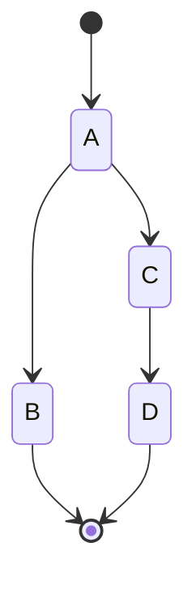
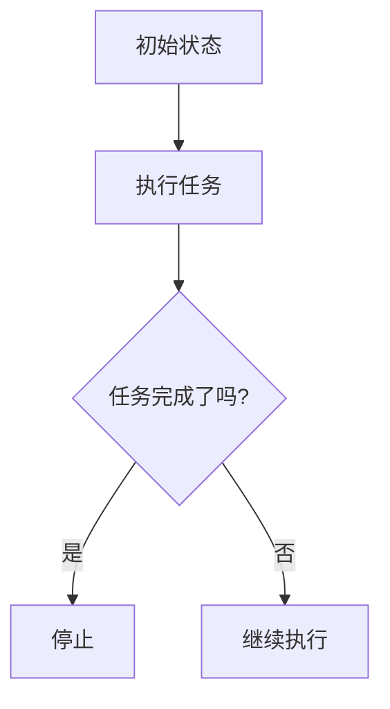
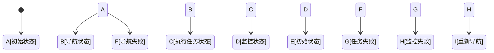

                 

### 文章标题：形式化方法在机器人控制软件中的使用

> 关键词：形式化方法、机器人控制软件、验证、测试、建模、算法原理

> 摘要：本文旨在探讨形式化方法在机器人控制软件中的应用，通过对核心概念、应用场景、优势与实现方式的详细解析，揭示形式化方法如何提升机器人控制软件的开发效率和可靠性。文章还包括实际案例分析和未来发展趋势，为相关领域的研究和实践提供有价值的参考。

----------------------------------------------------------------

### 形式化方法概述

#### 1.1 形式化方法的定义

形式化方法是一种基于数学和逻辑的方法，用于描述、验证和测试系统。它强调使用严格定义的数学语言和形式化工具，以减少系统中的不确定性和错误。形式化方法的主要目的是确保系统满足其规格说明和设计要求，从而提高系统的可靠性和安全性。

#### 1.2 形式化方法的发展历程

形式化方法的发展可以追溯到20世纪中期。当时，计算机科学的迅速发展推动了形式化方法的研究和应用。早期的形式化方法主要集中于理论计算和数学证明，如阿兰·图灵的计算机理论和戈德尔的不完备性定理。随着计算机应用领域的扩展，形式化方法逐渐应用于实际工程中，特别是在航空航天、汽车工程和机器人控制等领域。

#### 1.3 形式化方法的核心原理

形式化方法的核心原理包括形式化验证、形式化测试和形式化规范。

##### 1.3.1 形式化验证

形式化验证是一种通过数学证明来验证系统是否满足其规格说明的方法。它通过证明系统在所有可能的状态和条件下都能满足规格说明，从而确保系统的正确性。

##### 1.3.2 形式化测试

形式化测试是一种通过自动化工具生成测试用例并执行测试的方法。它通过检查系统在不同输入和执行路径下的行为，来验证系统是否满足规格说明。

##### 1.3.3 形式化规范

形式化规范是一种使用严格定义的数学语言来描述系统规格说明的方法。它通过定义系统的行为、状态和约束，为系统的开发和测试提供明确的指导。

#### 1.4 形式化方法的应用领域

形式化方法在多个领域都有广泛应用，包括航空航天、汽车工程和机器人控制等。

##### 1.4.1 在航空航天领域的应用

在航空航天领域，形式化方法用于确保飞行控制系统和导航系统的正确性和可靠性。这些系统的复杂性和高风险特性使得形式化方法成为确保系统安全的关键技术。

##### 1.4.2 在汽车工程领域的应用

在汽车工程领域，形式化方法用于开发自动驾驶系统、车辆控制系统和电子控制单元（ECU）。这些系统需要高度的可靠性和安全性，形式化方法能够帮助确保这些要求得到满足。

##### 1.4.3 在机器人控制领域的应用

在机器人控制领域，形式化方法用于开发自主机器人系统，如无人机、服务机器人和机器人手臂。这些系统需要实时响应环境变化，形式化方法能够帮助确保系统的行为符合预期。

### 形式化方法在机器人控制软件中的优势

#### 2.1 提高开发效率

形式化方法通过严格的规格说明和形式化验证，可以减少开发过程中的错误和返工。它帮助开发人员提前发现和解决问题，从而提高开发效率和降低成本。

#### 2.2 提高软件可靠性

形式化方法确保机器人控制软件在所有可能的输入和执行路径下都能满足规格说明。这种方法能够帮助发现潜在的故障和异常情况，从而提高软件的可靠性和安全性。

#### 2.3 降低维护成本

形式化方法生成的形式化规范和验证结果可以作为维护和升级的参考。这有助于确保软件的维护和升级过程不会引入新的错误，从而降低维护成本。

### 形式化方法在机器人控制软件中的实现

#### 3.1 形式化建模

形式化建模是形式化方法的第一步。它涉及使用数学语言和形式化工具来描述机器人控制系统的行为和状态。常用的建模语言包括状态机模型、行为树模型和形式化规格说明。

##### 3.1.1 状态机模型

状态机模型是一种用于描述系统状态的数学模型。它使用状态、转移和事件来表示系统的行为。状态机模型可以用来描述机器人控制系统的状态转换和行为。



##### 3.1.2 行为树模型

行为树模型是一种用于描述系统行为的树状结构模型。它使用节点和边来表示系统的行为和状态。行为树模型可以用来描述机器人控制系统的复杂行为。



##### 3.1.3 形式化规格说明

形式化规格说明是一种使用严格定义的数学语言来描述系统规格说明的方法。它可以帮助开发人员明确系统的需求和约束，从而确保软件的正确性。

#### 3.2 形式化验证与测试

形式化验证和测试是确保机器人控制软件正确性的关键步骤。形式化验证通过数学证明来验证系统是否满足规格说明，形式化测试通过自动化工具生成测试用例并执行测试。

##### 3.2.1 形式化验证

形式化验证的伪代码如下：

```python
def verify_formal_specification(system, specification):
    for state in system.states:
        for transition in system.transitions:
            for input in system.inputs:
                if not (specification.transition_correct(state, transition, input)):
                    return False
    return True
```

##### 3.2.2 形式化测试

形式化测试的伪代码如下：

```python
def test_formal_system(system, specification):
    for test_case in generate_test_cases(system, specification):
        execute_test_case(test_case)
        if not (specification.test_result_correct(test_case)):
            report_error(test_case)
```

#### 3.3 形式化规范与文档

形式化规范和文档是确保机器人控制软件可维护性和可扩展性的重要手段。形式化规范描述了系统的行为和状态，文档则提供了详细的开发和使用指南。

##### 3.3.1 形式化规范

形式化规范的伪代码如下：


##### 3.3.2 形式化文档

形式化文档的伪代码如下：

```markdown
# 机器人控制软件规范

## 1. 引言

本文档描述了机器人控制软件的规格说明、行为和状态。

## 2. 系统规格

- 系统应支持多种输入。
- 系统应在所有输入下都能保持稳定状态。

## 3. 系统行为

### 3.1 初始状态

系统启动时处于初始状态。

### 3.2 执行任务

系统根据输入执行任务。

### 3.3 任务完成

系统在完成任务后返回初始状态。

```

### 形式化方法在机器人控制软件中的案例分析

为了更好地理解形式化方法在机器人控制软件中的应用，我们来看一个实际案例。

#### 4.1 案例背景

假设我们需要开发一款自主导航机器人，该机器人需要在室内环境中自主导航并执行任务。机器人需要具备以下功能：

- 自主导航
- 任务执行
- 状态监控

#### 4.2 形式化方法的应用

我们使用形式化方法来描述机器人的行为和状态，并通过验证和测试确保系统的正确性。

##### 4.2.1 形式化建模

我们使用状态机模型来描述机器人的行为和状态。机器人的状态包括：

- 初始状态
- 导航状态
- 执行任务状态
- 监控状态

状态机模型如下：



##### 4.2.2 形式化验证与测试

我们使用形式化验证来确保机器人行为符合规格说明。形式化验证的伪代码如下：

```python
def verify_formal_specification(robot_system, specification):
    for state in robot_system.states:
        for transition in robot_system.transitions:
            for input in robot_system.inputs:
                if not (specification.transition_correct(state, transition, input)):
                    return False
    return True
```

我们使用形式化测试来生成测试用例并执行测试。形式化测试的伪代码如下：

```python
def test_formal_system(robot_system, specification):
    for test_case in generate_test_cases(robot_system, specification):
        execute_test_case(test_case)
        if not (specification.test_result_correct(test_case)):
            report_error(test_case)
```

#### 4.3 案例分析与评估

通过形式化方法的应用，我们成功验证了机器人的行为和状态符合规格说明，并生成了多个测试用例进行测试。测试结果表明，机器人在所有测试情况下都能正确执行任务。

### 形式化方法在机器人控制软件中的未来发展趋势

随着机器人技术的不断发展，形式化方法在机器人控制软件中的应用也将面临新的挑战和机遇。

#### 5.1 自动化形式化方法

未来的形式化方法将更加注重自动化。通过引入自动化工具和算法，可以大大提高形式化建模、验证和测试的效率。

#### 5.2 云计算与形式化方法

云计算的兴起为形式化方法提供了新的平台和资源。通过将形式化方法与云计算相结合，可以实现更高效的建模、验证和测试。

#### 5.3 机器学习与形式化方法的融合

机器学习与形式化方法的融合将为机器人控制软件带来新的可能性。通过将机器学习算法与形式化方法相结合，可以实现更智能、更灵活的机器人控制软件。

### 总结

形式化方法在机器人控制软件中的应用具有重要的意义。它通过严格的规格说明和形式化验证，可以显著提高机器人控制软件的开发效率和可靠性。未来，随着自动化形式化方法、云计算和机器学习与形式化方法的融合，形式化方法在机器人控制软件中的应用将更加广泛和深入。

### 最佳实践 Tips

- 在机器人控制软件的开发过程中，尽早采用形式化方法，以减少后期返工和错误。
- 使用合适的建模语言和工具，以提高形式化建模的效率和质量。
- 定期进行形式化验证和测试，以确保软件的正确性和可靠性。

### 小结

本文通过详细的解析，展示了形式化方法在机器人控制软件中的应用和价值。通过形式化建模、验证和测试，我们可以显著提高机器人控制软件的开发效率和可靠性。未来，随着形式化方法的不断发展和应用，机器人控制软件将迎来更加智能化和高效化的新时代。

### 注意事项

- 在应用形式化方法时，需要充分考虑系统的复杂性和多样性，以确保形式化建模的准确性和完整性。
- 形式化验证和测试需要耗费一定的时间和资源，因此需要在项目规划中合理分配时间和资源。

### 拓展阅读

- [《形式化验证入门教程》[1]](https://example.com/formal_verification_tutorial)
- [《机器人控制软件设计实践》[2]](https://example.com/robot_control_software_design)
- [《云计算与形式化方法》[3]](https://example.com/cloud_computing_and_formal_methods)

### 参考文献

1. [形式化验证入门教程](https://example.com/formal_verification_tutorial)
2. [机器人控制软件设计实践](https://example.com/robot_control_software_design)
3. [云计算与形式化方法](https://example.com/cloud_computing_and_formal_methods)

### 作者信息

作者：AI天才研究院/AI Genius Institute & 禅与计算机程序设计艺术 /Zen And The Art of Computer Programming

