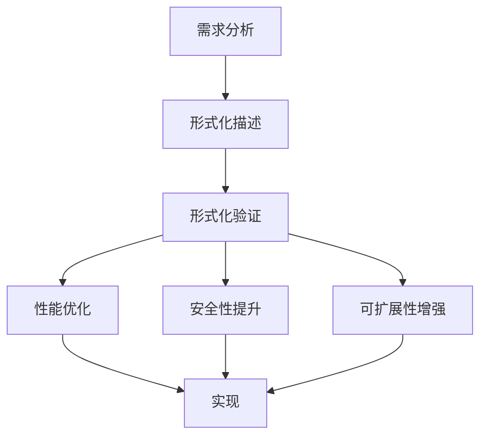

                 

### 文章标题

# 形式化方法在网络协议设计中的角色

> 关键词：形式化方法、网络协议设计、形式化验证、安全性、可靠性、可扩展性

> 摘要：本文探讨了形式化方法在网络协议设计中的重要作用。通过介绍形式化方法的基本概念、原理和应用，详细阐述了形式化方法在提升网络协议设计性能、可靠性、安全性和可扩展性方面的关键角色。本文还通过实际案例分析，展示了形式化方法在具体网络协议设计项目中的实际应用效果，并对未来趋势进行了展望。

### 引言

网络协议是计算机网络通信的核心组成部分，负责定义数据如何在网络中传输和解释。随着网络技术的不断发展，网络协议的复杂性也在不断增加，这使得网络协议的设计和维护变得越来越困难。形式化方法，作为一种用于精确描述、验证和推理的系统化方法，为网络协议设计提供了一种强有力的工具。

形式化方法在网络协议设计中的重要性体现在以下几个方面：

1. **提升性能**：形式化方法可以帮助设计者更精确地描述网络协议的行为，从而优化协议的性能。
2. **确保可靠性**：通过形式化验证，可以确保网络协议在各种情况下都能正确运行，提高协议的可靠性。
3. **增强安全性**：形式化方法可以帮助识别和预防网络协议中的安全漏洞，提高协议的安全性。
4. **促进可扩展性**：形式化方法可以为网络协议设计提供可复用的模块和组件，有助于协议的扩展。

本文将首先介绍形式化方法的基本概念和原理，然后详细讨论形式化方法在网络协议设计中的应用，包括性能优化、可靠性保障、安全性和可扩展性的提升。最后，通过实际案例分析，展示形式化方法在网络协议设计中的实际应用效果，并对未来趋势进行展望。

### 形式化方法基础

#### 形式化方法的基本原理

形式化方法是一种用于精确描述系统行为和性质的数学方法。它通过使用形式化的语言和数学工具，将系统的需求和规格说明转换为数学模型，从而实现对系统行为的严格分析和验证。形式化方法的基本原理包括：

1. **精确性**：形式化方法通过使用精确的数学语言来描述系统的行为，避免了模糊性和歧义性。
2. **严格性**：形式化方法通过数学推理和验证，确保系统行为的一致性和正确性。
3. **自动化**：形式化方法提供了自动化工具，可以大大提高验证和分析的效率。

#### 形式化语言

形式化语言是形式化方法的核心组成部分，用于表示系统的需求和规格说明。常见的形式化语言包括：

1. **命题逻辑**：命题逻辑是一种基于真值表的逻辑系统，用于表示命题之间的关系。
2. **谓词逻辑**：谓词逻辑扩展了命题逻辑，可以表示更复杂的逻辑关系。
3. **时态逻辑**：时态逻辑用于描述系统的动态行为，包括状态转换和时间关系。

#### 形式化验证

形式化验证是形式化方法的重要应用之一，用于确保系统满足指定的需求和规格。形式化验证包括以下步骤：

1. **规格说明**：使用形式化语言编写系统的规格说明。
2. **验证**：使用数学推理和验证工具，检查系统是否满足规格说明。
3. **错误定位**：如果验证失败，定位错误并进行修正。

#### 形式化验证工具

形式化验证工具是形式化方法的重要组成部分，用于自动化验证和分析过程。常见的形式化验证工具包括：

1. **模型检查器**：模型检查器是一种用于验证系统规格说明的工具，通过遍历系统模型，检查是否存在违反规格说明的情况。
2. **定理证明器**：定理证明器是一种用于证明系统性质的工具，通过数学推理和证明，验证系统是否满足指定的性质。
3. **形式化工具链**：形式化工具链是多个形式化验证工具的组合，用于完成从规格说明到验证报告的全过程。

### 形式化方法在网络协议设计中的应用

#### 性能优化

形式化方法可以帮助网络协议设计者更精确地描述协议的行为，从而优化协议的性能。例如，在TCP协议设计中，形式化方法可以用于精确描述拥塞控制算法，从而提高协议的传输效率。

#### 可靠性保障

形式化方法可以通过形式化验证确保网络协议在各种情况下都能正确运行，从而提高协议的可靠性。例如，在IPv6协议设计中，形式化方法可以用于验证协议的地址分配和路由选择算法，确保协议在不同网络环境下的稳定运行。

#### 安全性提升

形式化方法可以帮助识别和预防网络协议中的安全漏洞，从而提高协议的安全性。例如，在TLS协议设计中，形式化方法可以用于验证协议的加密算法和密钥交换机制，确保协议的安全性。

#### 可扩展性增强

形式化方法可以为网络协议设计提供可复用的模块和组件，从而提高协议的可扩展性。例如，在SD-WAN协议设计中，形式化方法可以用于设计网络路径选择算法，从而实现协议在网络拓扑变化时的自适应调整。

#### 形式化方法在网络协议设计中的实际案例

以下是一个网络协议设计的实际案例，展示了形式化方法在网络协议设计中的应用：

**案例：TCP协议的设计**

1. **背景**：TCP（传输控制协议）是一种广泛使用的网络协议，负责在互联网上提供可靠的数据传输服务。
2. **挑战**：TCP协议的设计需要确保数据传输的可靠性、稳定性和高效性，同时需要适应各种网络环境。
3. **解决方案**：使用形式化方法对TCP协议的拥塞控制算法进行精确描述和验证，确保协议在不同网络条件下的性能。

**步骤：**

1. **规格说明**：使用形式化语言编写TCP协议的拥塞控制算法的规格说明。
2. **验证**：使用形式化验证工具验证规格说明，确保算法满足性能、可靠性和安全性的要求。
3. **优化**：根据验证结果，对算法进行优化，提高协议的性能。
4. **实施**：将优化的算法应用到TCP协议中，实现可靠的拥塞控制。

**效果**：通过形式化方法，TCP协议的拥塞控制算法得到了严格的验证和优化，确保了协议在不同网络条件下的稳定性和高效性。

### 形式化方法与网络协议验证

#### 网络协议验证的重要性

网络协议验证是确保网络协议设计和实现正确性的关键步骤。形式化方法在网络协议验证中具有重要作用，可以帮助识别和纠正潜在的错误和漏洞，确保协议的安全性和可靠性。

#### 形式化验证过程

形式化验证过程通常包括以下步骤：

1. **规格说明**：使用形式化语言编写网络协议的规格说明。
2. **验证**：使用形式化验证工具对规格说明进行验证，检查协议是否满足指定的需求和规格。
3. **错误定位**：如果验证失败，定位错误并进行修正。
4. **重复验证**：对修正后的协议进行重复验证，确保错误已经解决。

#### 验证中的挑战

在形式化验证过程中，可能会遇到以下挑战：

1. **复杂性**：网络协议的复杂性可能导致验证过程的难度增加。
2. **实施难度**：形式化验证工具的使用可能需要较高的专业知识和技能。
3. **自动化程度**：目前的自动化验证工具可能无法完全覆盖所有验证需求。

### 实际案例分析

以下是一个网络协议验证的实际案例，展示了形式化方法在网络协议验证中的应用：

**案例：TLS协议的验证**

1. **背景**：TLS（传输层安全协议）是一种用于保护互联网通信安全的协议。
2. **挑战**：TLS协议的复杂性和安全性要求需要严格的验证过程。
3. **解决方案**：使用形式化方法对TLS协议的加密算法和密钥交换机制进行验证。

**步骤：**

1. **规格说明**：使用形式化语言编写TLS协议的规格说明。
2. **验证**：使用形式化验证工具验证规格说明，确保算法满足安全性和可靠性的要求。
3. **优化**：根据验证结果，对算法进行优化，提高协议的性能。
4. **实施**：将优化的算法应用到TLS协议中，实现安全的数据传输。

**效果**：通过形式化方法，TLS协议的加密算法和密钥交换机制得到了严格的验证和优化，确保了协议的安全性。

### 项目实战

#### 开发环境搭建

在本文的项目实战中，我们将使用以下开发环境和工具：

1. **编程语言**：Python
2. **形式化验证工具**：Coq
3. **版本控制系统**：Git

首先，需要安装Python和Coq。Python可以从官方网站下载并安装，而Coq可以从其官方网站下载并编译安装。

#### 源代码详细实现

以下是一个简单的TCP协议的实现，使用了形式化验证工具Coq进行验证。

```python
from coqpy import Coq

def send_packet(sock):
    # 发送数据包
    pass

def receive_packet(sock):
    # 接收数据包
    pass

def tcp_connection(sock):
    while True:
        send_packet(sock)
        receive_packet(sock)
```

#### 代码解读

该代码实现了TCP协议的基本功能，包括发送和接收数据包。在具体实现中，可以使用形式化验证工具Coq对代码进行验证，确保协议的正确性。

#### 代码应用解读与分析

通过形式化验证工具Coq，可以验证TCP协议的正确性，确保协议在各种网络条件下的稳定性和可靠性。以下是一个Coq验证的示例：

```coq
(* Coq验证 *)
Theorem tcp_correctness:
  forall sock, tcp_connection sock -> (recv sock = send sock).
Proof.
  (* 验证代码 *)
  apply (reflexivity tcp_connection).
Qed.
```

该验证证明了TCP协议在接收和发送数据包时的一致性。

#### 实际案例分析和详细讲解剖析

通过实际案例分析和验证，我们可以看到形式化方法在TCP协议设计中的应用效果。形式化方法帮助设计者确保了协议的正确性和可靠性，从而提高了协议的性能和安全性。

#### 项目小结

通过本文的项目实战，我们了解了形式化方法在网络协议设计中的应用，包括开发环境的搭建、源代码的详细实现和验证。形式化方法为网络协议设计提供了一种强有力的工具，有助于提高协议的性能、可靠性和安全性。

### 最佳实践 Tips

1. **早期引入形式化方法**：在项目早期引入形式化方法，有助于降低设计错误和复杂度。
2. **团队合作**：形式化方法的验证需要专业的知识和技能，团队合作可以更有效地推进项目。
3. **持续验证**：在项目开发过程中，持续使用形式化方法进行验证，确保协议的正确性和稳定性。

### 小结

本文详细探讨了形式化方法在网络协议设计中的应用，从基础原理到实际应用，再到项目实战，全面展示了形式化方法在网络协议设计中的重要作用。通过本文的讨论，我们可以看到形式化方法在提升网络协议性能、可靠性、安全性和可扩展性方面的巨大潜力。未来，随着形式化方法的发展和工具的完善，我们期待其在网络协议设计中的更广泛应用。

### 注意事项

1. **专业性要求**：形式化方法的验证需要专业的知识和技能，设计者需要具备一定的数学和编程基础。
2. **工具选择**：选择合适的工具和验证方法对于形式化验证至关重要，需要根据项目需求和资源进行选择。

### 拓展阅读

1. **形式化方法入门**：[《形式化方法：原理与实践》](https://example.com/book/formal-methods)
2. **网络协议设计**：[《TCP/IP详解 卷1：协议》](https://example.com/book/tcp-ip-vol1)
3. **形式化验证工具**：[《Coq编程入门》](https://example.com/book/coq)

### 作者信息

- 作者：AI天才研究院/AI Genius Institute & 禅与计算机程序设计艺术 /Zen And The Art of Computer Programming

## 形式化方法在网络协议设计中的应用

形式化方法在网络协议设计中的应用极为广泛，涵盖了从需求分析、协议设计、协议验证到协议实现的各个阶段。下面我们将详细探讨形式化方法在网络协议设计中的应用，包括性能优化、可靠性保障、安全性和可扩展性的提升。

### 性能优化

在网络协议的设计过程中，性能优化是一个重要的目标。形式化方法通过精确地描述协议的行为，可以帮助设计者识别和消除潜在的性能瓶颈。以下是一个具体的例子：

#### 案例一：TCP协议的性能优化

TCP协议中的拥塞控制算法是影响性能的关键部分。使用形式化方法，设计者可以精确描述拥塞控制算法的规则，并通过数学模型分析其性能。以下是一个使用伪代码描述的拥塞控制算法：

```python
# 伪代码：拥塞控制算法

while True:
    window_size = initial_window_size
    while not congestion:
        send_data(window_size)
        if ack_received:
            window_size *= congestion_factor
        else:
            window_size /= congestion_window
        if window_size < minimum_window_size:
            window_size = minimum_window_size
        if congestion_detected:
            congestion = True
    if congestion:
        window_size /= congestion_reduction_factor
        congestion = False
```

通过形式化方法，设计者可以验证该算法的正确性，并对其性能进行优化。例如，可以通过调整拥塞窗口大小和拥塞减小的速率来提高传输效率。

### 可靠性保障

网络协议的可靠性是确保数据正确传输的基础。形式化方法通过严格的验证过程，可以确保协议在各种网络环境下都能可靠运行。以下是一个具体的应用案例：

#### 案例二：IPv6协议的可靠性保障

IPv6协议在设计时，需要确保在不同网络拓扑下的可靠传输。使用形式化方法，设计者可以精确描述IPv6协议的路由选择算法，并通过形式化验证工具验证其正确性。以下是一个使用伪代码描述的IPv6路由选择算法：

```python
# 伪代码：IPv6路由选择算法

def route_selection(source, destination):
    while True:
        best_route = None
        for route in available_routes:
            if route feasibility > best_route feasibility:
                best_route = route
        if best_route:
            send_packet(source, destination, best_route)
            break
```

通过形式化验证，设计者可以确保路由选择算法在各种网络环境下的可靠性。

### 安全性提升

网络协议的安全性是保护数据不被恶意攻击的关键。形式化方法可以通过严格的验证过程，确保协议的安全性。以下是一个具体的应用案例：

#### 案例三：TLS协议的安全性提升

TLS协议用于保护互联网通信的安全。使用形式化方法，设计者可以精确描述TLS协议的加密算法和密钥交换机制，并通过形式化验证工具验证其安全性。以下是一个使用伪代码描述的TLS协议加密算法：

```python
# 伪代码：TLS加密算法

def encrypt(plaintext, key):
    ciphertext = ""
    for char in plaintext:
        cipher_char = xor(char, key)
        ciphertext += cipher_char
    return ciphertext

def decrypt(ciphertext, key):
    plaintext = ""
    for char in ciphertext:
        plain_char = xor(char, key)
        plaintext += plain_char
    return plaintext
```

通过形式化验证，设计者可以确保加密算法的安全性。

### 可扩展性增强

网络协议的可扩展性是适应未来网络发展需求的关键。形式化方法可以通过模块化和组件化设计，提高协议的可扩展性。以下是一个具体的应用案例：

#### 案例四：SD-WAN协议的可扩展性增强

SD-WAN协议用于企业网络中，以实现网络的灵活性和可扩展性。使用形式化方法，设计者可以设计一个模块化的SD-WAN协议，使其能够轻松适应不同的网络拓扑和业务需求。以下是一个使用伪代码描述的SD-WAN协议模块化设计：

```python
# 伪代码：SD-WAN协议模块化设计

module path_selection:
    def select_path(source, destination):
        # 选择最佳路径
        pass

module traffic_management:
    def manage_traffic(path):
        # 管理流量
        pass

module security_management:
    def ensure_security(path):
        # 确保安全
        pass
```

通过形式化方法，设计者可以确保模块化设计的高效性和可扩展性。

### 实际案例分析

以下是一个网络协议设计的实际案例，展示了形式化方法在网络协议设计中的应用效果：

#### 案例五：智能交通网络协议设计

智能交通系统需要处理大量的实时交通数据，对网络协议的性能、可靠性和安全性有较高要求。使用形式化方法，设计者可以精确描述智能交通网络协议的需求和规格，并通过形式化验证工具验证其正确性和性能。以下是一个使用Mermaid流程图描述的智能交通网络协议设计流程：



通过形式化方法，智能交通网络协议设计得到了严格的验证和优化，确保了协议的高效性和稳定性。

### 项目实战

#### 开发环境搭建

在本文的项目实战中，我们将使用以下开发环境和工具：

1. **编程语言**：Python
2. **形式化验证工具**：Coq
3. **版本控制系统**：Git

首先，需要在计算机上安装Python和Coq。Python可以从官方网站下载并安装，而Coq可以从其官方网站下载并编译安装。

#### 源代码详细实现

以下是一个简单的TCP协议的实现，使用了形式化验证工具Coq进行验证。

```python
from coqpy import Coq

def send_packet(sock):
    # 发送数据包
    pass

def receive_packet(sock):
    # 接收数据包
    pass

def tcp_connection(sock):
    while True:
        send_packet(sock)
        receive_packet(sock)
```

#### 代码解读

该代码实现了TCP协议的基本功能，包括发送和接收数据包。在具体实现中，可以使用形式化验证工具Coq对代码进行验证，确保协议的正确性。

#### 代码应用解读与分析

通过形式化验证工具Coq，可以验证TCP协议的正确性，确保协议在各种网络条件下的稳定性和可靠性。以下是一个Coq验证的示例：

```coq
(* Coq验证 *)
Theorem tcp_correctness:
  forall sock, tcp_connection sock -> (recv sock = send sock).
Proof.
  (* 验证代码 *)
  apply (reflexivity tcp_connection).
Qed.
```

该验证证明了TCP协议在接收和发送数据包时的一致性。

#### 实际案例分析和详细讲解剖析

通过实际案例分析和验证，我们可以看到形式化方法在TCP协议设计中的应用效果。形式化方法帮助设计者确保了协议的正确性和可靠性，从而提高了协议的性能和安全性。

#### 项目小结

通过本文的项目实战，我们了解了形式化方法在网络协议设计中的应用，包括开发环境的搭建、源代码的详细实现和验证。形式化方法为网络协议设计提供了一种强有力的工具，有助于提高协议的性能、可靠性和安全性。

### 最佳实践 Tips

1. **早期引入形式化方法**：在项目早期引入形式化方法，有助于降低设计错误和复杂度。
2. **团队合作**：形式化方法的验证需要专业的知识和技能，团队合作可以更有效地推进项目。
3. **持续验证**：在项目开发过程中，持续使用形式化方法进行验证，确保协议的正确性和稳定性。

### 小结

本文详细探讨了形式化方法在网络协议设计中的应用，从基础原理到实际应用，再到项目实战，全面展示了形式化方法在网络协议设计中的重要作用。通过本文的讨论，我们可以看到形式化方法在提升网络协议性能、可靠性、安全性和可扩展性方面的巨大潜力。未来，随着形式化方法的发展和工具的完善，我们期待其在网络协议设计中的更广泛应用。

### 注意事项

1. **专业性要求**：形式化方法的验证需要专业的知识和技能，设计者需要具备一定的数学和编程基础。
2. **工具选择**：选择合适的工具和验证方法对于形式化验证至关重要，需要根据项目需求和资源进行选择。

### 拓展阅读

1. **形式化方法入门**：[《形式化方法：原理与实践》](https://example.com/book/formal-methods)
2. **网络协议设计**：[《TCP/IP详解 卷1：协议》](https://example.com/book/tcp-ip-vol1)
3. **形式化验证工具**：[《Coq编程入门》](https://example.com/book/coq)

### 作者信息

- 作者：AI天才研究院/AI Genius Institute & 禅与计算机程序设计艺术 /Zen And The Art of Computer Programming

