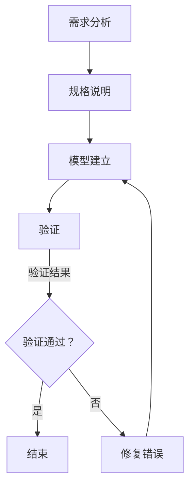
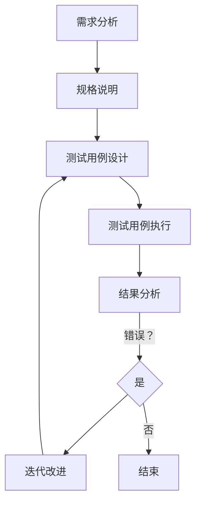
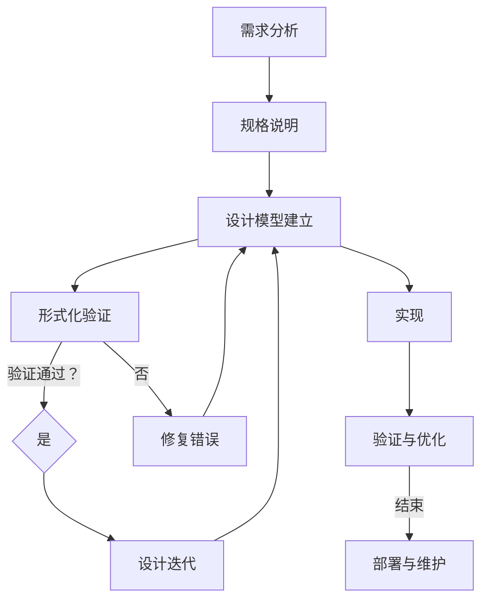
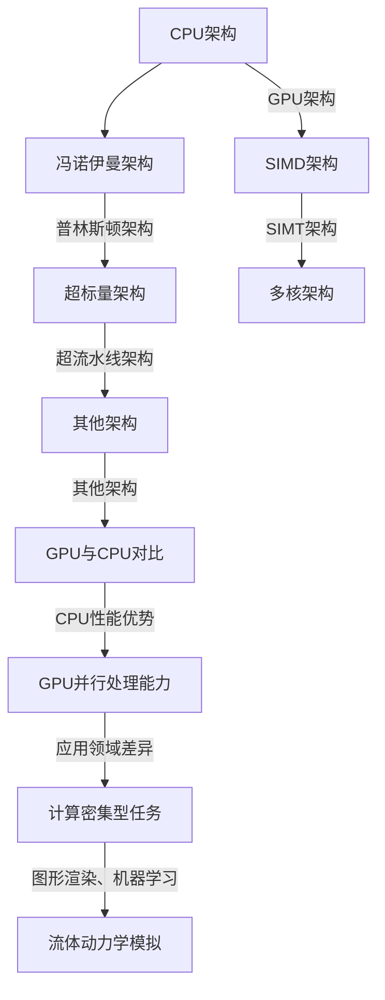

                 

### 引言

**形式化方法在高性能计算中的重要性**

在当今信息技术飞速发展的时代，高性能计算（HPC）已经成为推动科技进步、解决复杂科学问题的核心驱动力。从天气预报、生物信息学，到金融服务、人工智能，高性能计算的应用无处不在。然而，随着计算需求的不断增长，确保计算系统的正确性、稳定性和高效性变得越来越重要。这就需要引入形式化方法（Formal Methods），这是一种基于严格数学原理的方法，用于验证和设计计算机系统。

形式化方法的核心在于其严谨性和精确性。通过数学模型和逻辑推理，形式化方法能够对系统的行为进行精确描述和验证，从而确保系统的正确性和可靠性。在高性能计算领域，形式化方法的应用显得尤为关键，因为它不仅能够提高系统的性能，还能确保系统在各种复杂环境下的稳定性和安全性。

本文将深入探讨形式化方法在高性能计算中的应用，从定义、核心概念、优势到具体的应用案例，逐一剖析。本文的结构安排如下：

- **第1章：引言**：介绍形式化方法和高性能计算的概述，阐述二者之间的联系和重要性。
- **第2章：形式化方法基础**：详细讲解形式化方法的核心概念，包括形式化验证、形式化测试和形式化设计。
- **第3章：高性能计算基础**：介绍高性能计算的硬件架构、软件体系及应用场景。
- **第4章：形式化方法在高性能计算中的使用**：分析形式化方法在高性能计算中的应用，探讨其中的挑战与机遇。
- **第5章：高性能计算中的形式化方法案例分析**：通过具体案例展示形式化方法在高性能计算中的实际应用。
- **第6章：形式化方法与高性能计算的展望**：讨论形式化方法与高性能计算的未来发展趋势。

通过以上章节的层层深入，我们希望能够帮助读者全面了解形式化方法在高性能计算中的重要作用，并启发读者在实践中的创新应用。

#### 1.1.1 形式化方法的定义

形式化方法（Formal Methods）是一种利用严格数学模型和逻辑推理来分析和设计计算机系统的技术。与传统的基于经验和直觉的软件开发方法不同，形式化方法强调通过数学语言和形式化的逻辑规则来描述系统的行为，从而确保系统的正确性、可靠性和一致性。

形式化方法的定义可以追溯到20世纪60年代，当时随着计算机科学的发展，软件开发面临着越来越复杂的问题。传统的软件开发方法难以保证系统的正确性，特别是在大型、复杂的系统中，软件错误导致的系统崩溃和安全性问题屡见不鲜。为了解决这些问题，形式化方法应运而生。

形式化方法的核心在于“形式化”，即通过数学模型将系统的行为、需求和规格说明表达出来。这些数学模型可以是形式化的语言、逻辑公式或形式化的图形表示。形式化方法的主要目的是利用这些数学模型进行系统的形式化验证（Formal Verification），即通过数学推理来证明系统是否满足其规格说明，是否具有预期的行为。

形式化方法的主要特点包括：

1. **严格性**：形式化方法强调逻辑推理和数学证明的严格性，从而确保系统的正确性和可靠性。
2. **精确性**：通过数学模型精确描述系统的行为，避免模糊性和歧义性。
3. **可重复性**：形式化方法的结果可以通过数学证明和逻辑推理进行验证，确保结果的可重复性。
4. **自动化**：随着计算机科学的发展，越来越多的形式化方法工具和自动化验证工具被开发出来，提高了形式化方法的应用效率和可操作性。

形式化方法的应用领域非常广泛，包括但不限于以下方面：

- **硬件设计**：在集成电路设计、嵌入式系统设计等领域，形式化方法被广泛用于验证硬件设计的正确性。
- **软件设计**：在复杂软件系统的开发过程中，形式化方法用于验证软件的正确性和一致性。
- **形式化验证**：通过形式化验证工具对系统进行自动验证，确保系统符合预期要求。
- **形式化测试**：利用形式化方法设计测试用例，对系统进行严格的测试和验证。
- **形式化设计**：基于形式化方法进行系统的形式化设计，确保设计过程的一致性和正确性。

总之，形式化方法作为一种基于严格数学原理的技术，在高性能计算领域和其他计算机科学领域具有重要的应用价值。通过形式化方法，我们能够更准确地描述和验证计算机系统的行为，提高系统的可靠性和性能。

#### 1.1.2 形式化方法的应用领域

形式化方法（Formal Methods）的应用领域非常广泛，涵盖了硬件设计、软件设计、形式化验证、形式化测试、形式化设计等多个方面。以下将具体介绍这些应用领域及其重要性。

**1. 硬件设计**

在硬件设计领域，形式化方法被广泛应用于集成电路设计、嵌入式系统设计和硬件验证中。形式化方法通过数学模型和形式化的逻辑推理，能够对硬件系统的行为进行精确描述和验证。例如，在集成电路设计中，形式化方法可以用于验证逻辑电路的正确性，确保电路在所有可能的输入条件下都能正确工作。此外，形式化方法还可以帮助识别硬件设计中的潜在错误和缺陷，从而提高硬件系统的可靠性和稳定性。

**2. 软件设计**

在软件设计领域，形式化方法用于确保软件系统的正确性、一致性和可靠性。通过形式化的规格说明和数学模型，开发者可以更清晰地理解和描述系统的需求，从而设计出符合预期的软件系统。形式化方法还可以帮助开发者识别设计中的潜在问题，提高软件系统的可维护性和可扩展性。在复杂软件系统的开发过程中，形式化方法可以用于验证系统的各个组件是否满足规格说明，从而确保整个系统的正确性。

**3. 形式化验证**

形式化验证（Formal Verification）是形式化方法的一个重要应用领域。形式化验证通过数学推理和逻辑证明，对系统的行为进行验证，以确保系统符合其规格说明。形式化验证可以应用于硬件设计和软件设计，例如，验证集成电路设计的正确性，确保软件系统在各种输入条件下都能正确执行。形式化验证具有高度的精确性和可靠性，可以有效地发现和修复系统中的错误，从而提高系统的质量和稳定性。

**4. 形式化测试**

形式化测试（Formal Testing）是另一种重要的形式化方法应用。形式化测试通过数学模型和逻辑规则设计测试用例，对系统进行严格的测试和验证。形式化测试不同于传统的测试方法，它能够自动生成测试用例，并验证系统是否满足规格说明。形式化测试可以提高测试的覆盖率和准确性，发现系统中的潜在错误和缺陷，从而提高系统的可靠性和安全性。

**5. 形式化设计**

形式化设计（Formal Design）是形式化方法的另一个重要应用领域。形式化设计通过数学模型和形式化的逻辑规则，对系统进行形式化的设计和验证。形式化设计可以确保系统设计的一致性和正确性，从而提高系统的可维护性和可扩展性。在复杂系统的设计过程中，形式化设计可以帮助开发者更好地理解和控制系统的复杂性，减少设计错误和缺陷。

**重要性**

形式化方法在计算机科学领域的应用具有显著的重要性：

- **提高系统的可靠性**：通过形式化验证和测试，确保系统的正确性和可靠性，减少系统崩溃和错误发生的风险。
- **提高系统的性能**：形式化方法可以帮助开发者优化系统的设计和实现，从而提高系统的性能和效率。
- **减少开发和维护成本**：通过形式化验证和测试，可以提前发现和修复系统中的错误，减少开发和维护的成本。
- **提高系统的安全性**：形式化方法可以确保系统在各种复杂环境下的安全性，防止潜在的安全漏洞。

总之，形式化方法作为一种基于严格数学原理的技术，在计算机科学领域具有广泛的应用价值。通过形式化方法，开发者可以更精确地描述和验证计算机系统的行为，提高系统的可靠性、性能和安全性。

#### 1.1.3 形式化方法的优势

形式化方法（Formal Methods）在计算机科学领域具有显著的优势，这些优势使其成为确保系统正确性、可靠性和性能的关键工具。以下是形式化方法的主要优势：

**1. 提高可靠性**

形式化方法通过严格的数学模型和逻辑推理，确保系统能够按照预期工作。这种方法的精确性使得系统能够在各种复杂和不确定的环境中保持稳定和可靠。形式化验证和测试可以发现和修复潜在的错误，从而显著提高系统的可靠性。

**2. 提高性能**

形式化方法可以帮助开发者识别并消除系统中的瓶颈和低效环节。通过数学模型优化，形式化方法能够指导开发者设计出更高效、性能更优的系统。此外，形式化验证和测试可以确保系统在各种负载条件下都能保持高性能，从而提高整体系统的性能。

**3. 降低维护成本**

形式化方法通过严格的规格说明和形式化验证，可以提前发现和修复系统中的错误。这不仅可以减少开发和测试阶段的错误，还可以降低系统维护和升级的成本。形式化设计的系统通常具有更好的可维护性和可扩展性，使得维护工作更加高效。

**4. 提高安全性**

形式化方法能够确保系统在各种威胁和攻击下保持安全。通过形式化的验证和测试，开发者可以识别并修复潜在的安全漏洞，提高系统的安全性。形式化方法有助于构建更加健壮和安全的系统，防止潜在的安全事故。

**5. 提高团队合作效率**

形式化方法提供了清晰、明确的规格说明和设计文档，有助于团队成员更好地理解和协作。这种方法减少了因理解不一致而导致的沟通成本和错误，提高了团队的工作效率。

**6. 可重复性和可验证性**

形式化方法的结果可以通过数学证明和逻辑推理进行验证，确保其结果的正确性和可重复性。这种可验证性使得开发者能够更自信地依赖形式化方法的结果，减少不确定性。

综上所述，形式化方法在计算机科学领域具有显著的优越性，通过提高系统的可靠性、性能、安全性，降低维护成本，以及提升团队合作效率，形式化方法为现代计算机系统的开发、测试和维护提供了坚实的理论基础和实用工具。

#### 1.1.2 高性能计算概述

**高性能计算的定义**

高性能计算（High-Performance Computing，HPC）是指使用高性能计算机系统执行大量计算任务，解决复杂科学问题，如天气预报、分子建模、流体动力学模拟、金融分析等。高性能计算不仅仅是计算速度的竞争，更重要的是如何有效地利用计算资源来解决实际问题。

**高性能计算的发展历程**

高性能计算的发展历程可以追溯到20世纪60年代，当时出现了第一批超级计算机。这些早期的超级计算机主要依赖于并行处理技术，通过多个处理单元同时执行任务来提高计算速度。随着技术的发展，高性能计算经历了多个阶段：

1. **并行处理时代**：20世纪60年代末到80年代初，高性能计算主要集中在并行处理技术，如向量计算机、阵列处理器等。
2. **分布式计算时代**：20世纪80年代到90年代，随着计算机网络技术的发展，分布式计算成为高性能计算的重要方向。分布式计算通过将计算任务分配到多个独立的计算机上，利用网络通信进行协作。
3. **集群计算时代**：21世纪初，集群计算成为高性能计算的主流。集群计算通过将多个标准计算机连接起来，形成一个高性能计算集群，通过高效的网络互联和负载均衡技术，实现大规模并行计算。
4. **exascale计算时代**：当前，高性能计算正朝着exascale（百亿亿次浮点运算）计算迈进。exascale计算要求计算系统具备前所未有的计算能力、存储能力和能源效率，以解决更为复杂的科学问题。

**高性能计算的应用领域**

高性能计算的应用领域非常广泛，包括但不限于以下方面：

1. **科学计算**：在科学研究中，高性能计算被用于进行复杂的模拟和计算，如天气预测、天体物理学、生物信息学、流体动力学等。
2. **工程设计**：在工程设计领域，高性能计算被用于仿真和分析复杂结构、材料特性，如航空航天、汽车制造、建筑结构等。
3. **金融分析**：在金融领域，高性能计算用于进行大数据分析、高频交易、风险评估等，帮助金融机构做出更为精准的决策。
4. **医疗健康**：在医疗健康领域，高性能计算被用于基因组学、药物设计、医疗影像处理等，加速医学研究和治疗。
5. **能源与环境保护**：在能源与环境保护领域，高性能计算被用于模拟和优化能源系统、污染扩散等，为可持续发展和环境保护提供科学依据。

总之，高性能计算的发展历程展示了从并行处理到集群计算，再到exascale计算的演进。高性能计算在科学、工程、金融、医疗、能源等多个领域具有广泛的应用，为解决复杂问题提供了强大的计算能力。

#### 1.1.3 形式化方法与高性能计算的联系

**形式化方法在高性能计算中的重要性**

形式化方法（Formal Methods）在高性能计算（HPC）中的重要性不容忽视。高性能计算涉及大量的复杂任务，要求计算系统具有极高的正确性、稳定性和效率。形式化方法作为一种基于严格数学原理的技术，能够在这些方面提供强有力的支持。

首先，形式化方法通过严格的数学模型和逻辑推理，能够对高性能计算系统进行精确的描述和验证，确保系统在各种复杂环境下的稳定性和可靠性。例如，形式化验证（Formal Verification）可以用于验证高性能计算系统中硬件设计的正确性，确保硬件电路在各种输入条件下都能正常工作。同样，形式化测试（Formal Testing）可以设计出精确的测试用例，对软件系统进行严格的测试，从而发现潜在的错误和缺陷。

其次，形式化方法能够优化高性能计算系统的设计和实现，提高系统的性能和效率。通过形式化设计（Formal Design），开发者可以基于数学模型进行系统的形式化设计，确保设计过程的一致性和正确性。形式化方法还可以用于优化硬件和软件的架构，提高系统的计算速度和资源利用率。例如，在集群计算系统中，形式化方法可以指导开发者设计出高效的网络拓扑结构和负载均衡策略，从而提高集群的整体性能。

最后，形式化方法有助于提高高性能计算系统的安全性和鲁棒性。在高效计算环境中，系统可能会面临各种威胁和攻击，形式化方法可以用于识别和修复潜在的安全漏洞，确保系统的安全性。此外，形式化方法还可以帮助开发者构建更加健壮的系统，减少系统在极端条件下的崩溃风险。

**形式化方法与高性能计算的结合点**

形式化方法与高性能计算的结合点主要体现在以下几个方面：

1. **硬件设计与验证**：在高性能计算硬件的设计过程中，形式化方法可以用于验证硬件电路的正确性。例如，通过形式化验证，开发者可以确保芯片设计在所有可能的输入条件下都能正常工作，从而提高硬件的可靠性和性能。

2. **软件测试与优化**：形式化测试可以用于对高性能计算软件系统进行严格的测试和验证。通过形式化测试，开发者可以设计出精确的测试用例，发现并修复软件中的潜在错误，从而提高软件系统的正确性和稳定性。

3. **系统架构设计**：形式化设计可以用于优化高性能计算系统的架构，提高系统的计算能力和资源利用率。例如，通过形式化设计，开发者可以设计出高效的网络拓扑结构和负载均衡策略，从而提高集群计算系统的性能。

4. **系统安全性与鲁棒性**：形式化方法可以用于识别和修复高性能计算系统中的安全漏洞，确保系统的安全性。此外，形式化方法还可以帮助开发者构建更加健壮的系统，减少系统在极端条件下的崩溃风险。

综上所述，形式化方法与高性能计算的紧密结合，不仅提高了系统的正确性、稳定性和效率，还为高性能计算技术的发展提供了坚实的理论基础和实用工具。

#### 1.1.4 书籍结构概述

**书籍的总体目标**

本书旨在系统地介绍形式化方法在高性能计算中的应用，帮助读者全面理解形式化方法的原理、技术及其在高性能计算领域的重要作用。通过本书，读者将能够：

- 理解形式化方法的定义、核心概念和应用领域；
- 掌握形式化验证、形式化测试和形式化设计的基本原理和流程；
- 了解高性能计算的硬件架构、软件体系和应用场景；
- 学习形式化方法在高性能计算中的具体应用案例，包括硬件设计、软件测试和系统架构优化；
- 探讨形式化方法在高性能计算中的挑战和机遇，展望其未来发展。

**书籍的结构安排**

本书分为六个主要章节，结构安排如下：

- **第1章：引言**：介绍形式化方法和高性能计算的概述，阐述二者之间的联系和重要性。
- **第2章：形式化方法基础**：详细讲解形式化方法的核心概念，包括形式化验证、形式化测试和形式化设计。
- **第3章：高性能计算基础**：介绍高性能计算的硬件架构、软件体系及应用场景。
- **第4章：形式化方法在高性能计算中的使用**：分析形式化方法在高性能计算中的应用，探讨其中的挑战与机遇。
- **第5章：高性能计算中的形式化方法案例分析**：通过具体案例展示形式化方法在高性能计算中的实际应用。
- **第6章：形式化方法与高性能计算的展望**：讨论形式化方法与高性能计算的未来发展趋势。

**阅读指南**

为了更好地理解本书的内容，建议读者按照以下指南进行阅读：

- **逐章阅读**：按照章节顺序逐章阅读，确保对各个主题有一个系统的了解。
- **结合案例学习**：在阅读过程中，结合每个章节提供的案例进行学习，加深对形式化方法在实际应用中的理解。
- **积极参与讨论**：通过阅读本书，读者可以了解到形式化方法在高性能计算中的广泛应用和重要性，鼓励读者积极参与相关讨论，深化对这一领域知识的掌握。
- **实践与应用**：在理解了形式化方法的基本原理和案例之后，读者可以尝试将这些知识应用到实际项目中，验证其效果和可行性。

通过以上阅读指南，读者将能够系统地掌握形式化方法在高性能计算中的应用，为未来的研究和实践打下坚实的基础。

### 第2章: 形式化方法基础

#### 2.1 形式化方法的核心概念

形式化方法（Formal Methods）的核心概念包括形式化验证、形式化测试和形式化设计。这些概念共同构成了形式化方法的基础，确保系统在开发、测试和运行过程中具有高可靠性、正确性和高效性。

**1. 形式化验证（Formal Verification）**

形式化验证是指利用数学模型和形式化的逻辑推理来验证系统是否满足其规格说明。其基本原理是通过逻辑证明和数学推导，证明系统在各种可能情况下都符合预期行为。形式化验证的过程通常包括以下几个步骤：

- **规格说明**：首先，需要明确系统的规格说明，通常使用形式化的语言如数学公式、逻辑公式或形式化的图形表示来描述。
- **模型建立**：根据规格说明，构建系统的数学模型，这个模型需要能够精确地表示系统的行为。
- **验证**：使用数学推理和逻辑证明来验证系统模型是否满足规格说明。这通常涉及到状态空间分析、逻辑推理和定理证明等技术。
- **验证结果分析**：验证完成后，分析验证结果，识别系统中可能存在的错误或缺陷，并进行修复。

形式化验证的优势在于其高度的精确性和可靠性。通过数学证明，可以确保系统在所有可能的情况下都能正确工作，从而显著提高系统的可靠性和安全性。

**2. 形式化测试（Formal Testing）**

形式化测试是一种基于形式化方法设计的测试方法，用于验证系统的行为是否符合其规格说明。与传统的测试方法不同，形式化测试通过数学模型和逻辑规则来生成测试用例，并对系统进行严格的测试和验证。

形式化测试的基本原理包括：

- **测试用例设计**：根据系统的规格说明和数学模型，设计出能够覆盖系统所有行为的测试用例。这些测试用例通常使用形式化的语言描述。
- **测试执行**：执行设计好的测试用例，对系统进行测试，收集测试结果。
- **结果分析**：分析测试结果，识别系统中的错误或缺陷，并根据测试结果对系统进行改进。

形式化测试的优势在于其高度的自动化和精确性。通过形式化测试，可以生成大量高质量的测试用例，确保系统的测试覆盖率达到最大化，从而发现和修复系统中的潜在错误。

**3. 形式化设计（Formal Design）**

形式化设计是一种基于形式化方法进行系统设计的方法，通过数学模型和逻辑推理来确保系统设计的一致性和正确性。形式化设计的基本原理包括：

- **需求规格说明**：首先，明确系统的需求规格说明，通常使用形式化的语言来描述系统的功能、性能和约束。
- **设计模型建立**：根据需求规格说明，建立系统的设计模型。设计模型需要能够精确地表示系统的结构和行为。
- **形式化验证**：对设计模型进行形式化验证，确保设计模型满足规格说明，且没有逻辑错误或不一致性。
- **设计迭代**：根据验证结果，对设计模型进行迭代改进，确保设计的一致性和正确性。

形式化设计的优势在于其严谨性和可靠性。通过形式化设计，可以确保系统设计过程的一致性和正确性，从而减少设计错误和缺陷。

**核心概念之间的联系**

形式化验证、形式化测试和形式化设计三者之间存在着紧密的联系。形式化验证是形式化方法的核心，它通过对系统行为进行形式化的验证，确保系统的正确性。形式化测试是基于形式化验证的测试方法，通过设计高质量的测试用例，对系统进行严格的测试，发现和修复潜在的错误。形式化设计则是基于形式化验证和测试的系统性设计方法，通过数学模型和逻辑推理来确保系统设计的一致性和正确性。

总之，形式化方法的核心概念为系统的开发、测试和设计提供了严格的数学基础和逻辑框架，通过形式化验证、形式化测试和形式化设计，可以显著提高系统的可靠性、正确性和性能。

#### 2.1.1 形式化验证原理讲解

**形式化验证的基本原理**

形式化验证（Formal Verification）是一种利用严格数学模型和逻辑推理来证明系统是否满足其规格说明的方法。其核心思想是通过数学证明来确保系统在各种可能的输入和条件下都能按照预期工作，从而提高系统的可靠性和安全性。

形式化验证的基本原理可以概括为以下几个关键步骤：

1. **规格说明**：首先，需要明确系统的规格说明。规格说明描述了系统的功能、性能和约束，通常使用形式化的语言，如数学公式、逻辑公式或形式化的图形表示。这些形式化的规格说明需要精确、无歧义，以确保验证过程的正确性。

2. **模型建立**：根据规格说明，构建系统的数学模型。这个模型需要能够精确地表示系统的行为和状态，包括系统内部的逻辑结构、输入输出的关系和状态转换规则。数学模型可以是状态机模型、形式化的逻辑公式或其他形式化的表示方法。

3. **验证**：使用数学推理和逻辑证明来验证系统模型是否满足规格说明。这通常涉及到状态空间分析、逻辑推理和定理证明等技术。形式化验证的目标是证明系统在所有可能的输入和条件下都能保持一致性，即系统行为符合规格说明。

4. **验证结果分析**：验证完成后，分析验证结果，识别系统中可能存在的错误或缺陷。如果验证失败，需要定位错误的原因，并进行修复。验证结果的分析可以帮助开发者理解系统的行为，提高系统的可靠性和性能。

**形式化验证的过程**

形式化验证的过程可以分为以下几个阶段：

- **需求分析**：明确系统的需求，包括功能需求、性能需求和约束条件。这一阶段需要与系统的用户和利益相关者进行沟通，确保规格说明的准确性和完整性。

- **规格说明**：根据需求分析的结果，使用形式化的语言编写系统的规格说明。规格说明需要详尽、精确，以便于后续的模型建立和验证。

- **模型建立**：根据规格说明，构建系统的数学模型。这一阶段需要选择合适的数学模型表示方法，如状态机模型、形式化的逻辑公式等。

- **验证**：使用形式化的方法对系统模型进行验证。这一阶段可能需要使用自动化验证工具，如模型检查器、定理证明器等，来帮助完成验证过程。

- **验证结果分析**：分析验证结果，识别系统中的错误或缺陷。如果验证失败，需要回溯到之前的阶段，检查规格说明、模型构建和验证方法的正确性。

- **迭代修复**：根据验证结果，对系统进行迭代修复。修复过程中，需要确保每个修复步骤都经过验证，以确保系统的正确性和可靠性。

**形式化验证的优势**

形式化验证具有以下几个显著优势：

- **高精度**：形式化验证通过数学证明和逻辑推理，确保系统在各种可能的输入和条件下都能按照预期工作。这种方法具有高度的精确性，减少了系统出错的概率。
- **自动化**：随着自动化验证工具的发展，形式化验证过程可以部分或完全自动化，从而提高了验证效率。
- **可靠性**：形式化验证可以识别和修复系统中的潜在错误和缺陷，提高系统的可靠性和稳定性。
- **一致性**：形式化验证确保系统的行为与规格说明一致，从而提高了系统的一致性和可维护性。

总之，形式化验证作为一种基于严格数学原理的技术，在高性能计算和其他计算机科学领域具有重要的应用价值。通过形式化验证，开发者可以确保系统的正确性和可靠性，从而提高系统的质量和性能。

#### 2.1.2 形式化验证的 Mermaid 流程图

为了更好地理解形式化验证的基本原理，我们可以使用Mermaid语言绘制一个简化的流程图。以下是形式化验证流程的Mermaid表示：



- **需求分析**：明确系统的需求和功能。
- **规格说明**：编写详细、形式化的规格说明。
- **模型建立**：根据规格说明构建数学模型。
- **验证**：使用形式化方法对模型进行验证。
- **验证结果分析**：分析验证结果，判断是否通过。
- **修复错误**：如果验证失败，返回模型建立阶段进行修复。
- **结束**：验证通过，结束验证流程。

这个流程图展示了形式化验证的核心步骤及其相互关系，有助于我们更直观地理解形式化验证的原理和过程。

#### 2.2 形式化测试原理讲解

**形式化测试（Formal Testing）的基本原理**

形式化测试是一种利用形式化方法设计测试用例、执行测试并验证系统行为的测试方法。它通过数学模型和逻辑规则生成高质量的测试用例，确保系统在各个可能的状态和输入条件下都能按照预期工作。形式化测试的基本原理包括以下几个关键步骤：

1. **规格说明**：首先，明确系统的规格说明，这些规格说明描述了系统的功能、性能和约束。规格说明需要详尽、精确，并使用形式化的语言如数学公式、逻辑公式或形式化的图形表示，以确保测试用例的设计和执行的一致性。

2. **测试用例设计**：根据规格说明，使用形式化方法设计测试用例。形式化测试用例设计是基于数学模型和逻辑规则的，通常使用形式化的语言来描述测试用例的条件、操作和预期结果。这些测试用例需要覆盖系统所有可能的状态和输入条件，以确保系统的完整性和可靠性。

3. **测试执行**：执行设计好的测试用例，对系统进行实际测试。测试执行过程中，系统会根据测试用例的条件和操作进行响应，并将实际结果与预期结果进行比较。

4. **结果分析**：分析测试结果，识别系统中的错误或缺陷。如果测试结果与预期结果不一致，说明系统存在错误或缺陷，需要进一步定位和修复。

5. **迭代改进**：根据测试结果，对测试用例进行迭代改进，确保测试用例能够更全面、准确地覆盖系统的行为。此外，对系统进行修复和改进，以提高系统的质量和可靠性。

**形式化测试的过程**

形式化测试的过程可以分为以下几个阶段：

- **需求分析**：明确系统的需求和功能，编写详细、形式化的规格说明。
- **测试用例设计**：根据规格说明，设计形式化的测试用例，确保测试用例能够覆盖系统的所有行为和状态。
- **测试用例执行**：执行设计好的测试用例，对系统进行实际测试，收集测试结果。
- **结果分析**：分析测试结果，识别系统中的错误或缺陷。
- **迭代改进**：根据测试结果，对测试用例进行迭代改进，并对系统进行修复和改进。
- **验证**：验证测试用例的设计是否满足规格说明，确保测试用例的有效性和覆盖率。

**形式化测试的优势**

形式化测试具有以下几个显著优势：

- **自动化**：形式化测试可以通过自动化工具生成和执行测试用例，从而提高测试效率，减少人工干预。
- **精确性**：形式化测试基于数学模型和逻辑规则，能够设计出精确、无歧义的测试用例，确保测试结果的准确性。
- **全面性**：形式化测试通过覆盖系统所有可能的状态和输入条件，确保测试用例能够全面、准确地覆盖系统的行为。
- **可重复性**：形式化测试的结果可以通过数学推理和逻辑验证进行验证，确保其可重复性和可靠性。

总之，形式化测试作为一种基于严格数学原理的测试方法，能够显著提高系统的测试质量和可靠性，是形式化方法在高性能计算等领域的重要应用之一。

#### 2.2.1 形式化测试的 Mermaid 流程图

为了更好地展示形式化测试的基本原理和过程，我们可以使用Mermaid语言绘制一个简化的流程图。以下是形式化测试流程的Mermaid表示：



- **需求分析**：明确系统的需求和功能，编写详细、形式化的规格说明。
- **规格说明**：根据需求分析的结果，编写形式化的规格说明。
- **测试用例设计**：根据规格说明，设计形式化的测试用例。
- **测试用例执行**：执行设计好的测试用例，收集测试结果。
- **结果分析**：分析测试结果，判断系统是否存在错误。
- **迭代改进**：根据测试结果，对测试用例进行迭代改进，确保测试用例能够更全面地覆盖系统的行为。
- **结束**：测试用例设计过程结束，完成测试。

这个流程图展示了形式化测试的核心步骤及其相互关系，有助于我们更直观地理解形式化测试的原理和过程。

#### 2.3 形式化设计原理讲解

**形式化设计（Formal Design）的基本原理**

形式化设计（Formal Design）是一种利用形式化方法进行系统设计的方法，通过数学模型和逻辑推理确保系统设计的一致性和正确性。其核心思想是在系统设计的早期阶段，使用形式化的方法描述和验证系统的结构和行为，从而减少设计错误和缺陷。形式化设计的基本原理包括以下几个关键步骤：

1. **需求分析**：首先，明确系统的需求，包括功能需求、性能需求和约束条件。需求分析的结果需要详尽、精确，并使用形式化的语言如数学公式、逻辑公式或形式化的图形表示，以确保设计的一致性和可验证性。

2. **规格说明**：根据需求分析的结果，编写系统的规格说明。规格说明需要精确地描述系统的功能、性能和约束，通常使用形式化的语言，如UML类图、状态机模型或逻辑公式等。

3. **设计模型建立**：根据规格说明，构建系统的设计模型。设计模型需要能够精确地表示系统的结构和行为，包括系统组件的交互、状态转换和约束条件。常用的设计模型包括状态机模型、数据流图、实体-关系模型等。

4. **形式化验证**：对设计模型进行形式化验证，确保设计模型满足规格说明，且没有逻辑错误或不一致性。形式化验证通常使用自动化验证工具，如模型检查器、定理证明器等，来帮助完成验证过程。

5. **设计迭代**：根据验证结果，对设计模型进行迭代改进。设计迭代过程中，需要确保每个改进步骤都经过验证，以确保设计的一致性和正确性。

6. **实现**：将形式化设计模型转换为具体的实现代码。实现过程中，需要确保代码与设计模型保持一致，避免引入新的错误。

**形式化设计的过程**

形式化设计的过程可以分为以下几个阶段：

- **需求分析**：明确系统的需求和功能，编写详细、形式化的规格说明。
- **规格说明**：根据需求分析的结果，使用形式化的语言编写系统的规格说明。
- **设计模型建立**：根据规格说明，构建系统的设计模型，包括组件的交互、状态转换和约束条件。
- **形式化验证**：使用形式化验证工具对设计模型进行验证，确保设计模型满足规格说明，且没有逻辑错误或不一致性。
- **设计迭代**：根据验证结果，对设计模型进行迭代改进，确保设计的一致性和正确性。
- **实现**：将形式化设计模型转换为具体的实现代码，并进行单元测试和集成测试。
- **验证与优化**：在实现过程中，继续使用形式化验证方法对代码进行验证，确保代码与设计模型保持一致，并进行性能优化。

**形式化设计的优势**

形式化设计具有以下几个显著优势：

- **一致性**：形式化设计通过数学模型和逻辑推理，确保系统设计的一致性和正确性，减少设计错误和缺陷。
- **可验证性**：形式化设计可以通过形式化验证方法进行验证，确保设计模型的正确性，从而提高系统的可靠性。
- **可维护性**：形式化设计提供了清晰的设计文档和规格说明，使得系统的维护和扩展更加容易。
- **可扩展性**：形式化设计可以灵活地应对需求变化，通过形式化验证方法，确保新需求的正确实现。

总之，形式化设计作为一种基于严格数学原理的设计方法，能够显著提高系统的可靠性、一致性和可维护性，是形式化方法在高性能计算和其他计算机科学领域的重要应用之一。

#### 2.3.1 形式化设计的 Mermaid 流程图

为了更好地展示形式化设计的基本原理和过程，我们可以使用Mermaid语言绘制一个简化的流程图。以下是形式化设计流程的Mermaid表示：



- **需求分析**：明确系统的需求和功能，编写详细、形式化的规格说明。
- **规格说明**：根据需求分析的结果，编写系统的规格说明。
- **设计模型建立**：根据规格说明，构建系统的设计模型。
- **形式化验证**：使用形式化验证工具对设计模型进行验证。
- **设计迭代**：根据验证结果，对设计模型进行迭代改进。
- **修复错误**：如果验证失败，返回设计模型建立阶段进行修复。
- **实现**：将形式化设计模型转换为具体的实现代码。
- **验证与优化**：在实现过程中，继续使用形式化验证方法对代码进行验证，并进行性能优化。
- **部署与维护**：完成系统的实现、验证和优化后，进行部署和维护。

这个流程图展示了形式化设计的核心步骤及其相互关系，有助于我们更直观地理解形式化设计的原理和过程。

### 第3章: 高性能计算基础

#### 3.1 高性能计算硬件架构

**CPU架构**

中央处理器（CPU）是高性能计算系统的核心部件，负责执行计算任务。CPU架构设计对系统的性能有重要影响。以下是一些常见的CPU架构：

- **冯诺伊曼架构**：经典的CPU架构，采用存储程序原理，数据与指令存储在同一内存中，通过程序计数器控制指令的顺序执行。
- **普林斯顿架构**：与冯诺伊曼架构类似，但将数据存储和指令存储分开，提高了数据访问的效率。
- **超标量架构**：通过多个执行单元并行执行多条指令，提高了指令吞吐率。
- **超流水线架构**：将指令执行过程划分为多个阶段，每个阶段可以并行执行多条指令，提高了指令执行的速度。

**GPU架构**

图形处理器（GPU）最初设计用于渲染图形，但由于其强大的并行计算能力，现在也被广泛应用于高性能计算。以下是一些常见的GPU架构：

- **SIMD架构**：单指令流多数据流架构，通过一组处理单元同时执行相同的指令，适用于大规模并行计算。
- **SIMT架构**：单指令流单线程架构，通过多个线程同时执行一条指令，适用于复杂的数据并行处理。
- **多核架构**：GPU采用多核心设计，每个核心具有独立的计算资源和内存，能够同时处理多个计算任务。

**CPU与GPU的比较**

CPU和GPU在架构设计、性能和应用领域上有所不同：

- **架构差异**：CPU采用冯诺伊曼架构或普林斯顿架构，而GPU采用SIMD或SIMT架构。
- **性能差异**：GPU具有更高的浮点运算能力和并行处理能力，适用于大规模并行计算任务；CPU在单线程性能和复杂任务处理上具有优势。
- **应用领域**：CPU适用于计算密集型任务，如科学计算、数据分析；GPU适用于图形渲染、机器学习、流体动力学模拟等需要大量并行计算的任务。

**高性能计算硬件架构的 Mermaid 流程图**

为了更好地展示高性能计算硬件架构，我们可以使用Mermaid语言绘制一个简化的流程图。以下是硬件架构流程的Mermaid表示：



- **CPU架构**：展示CPU的不同架构设计。
- **GPU架构**：展示GPU的常见架构设计。
- **GPU与CPU对比**：比较CPU和GPU的性能差异和应用领域。

这个流程图有助于我们更直观地理解高性能计算硬件架构的不同方面。

#### 3.2 高性能计算软件体系

**编译器优化**

编译器优化是高性能计算软件体系中的一个关键环节。编译器通过对源代码进行优化，生成高效的目标代码，从而提高程序的运行效率。常见的编译器优化技术包括：

- **循环优化**：通过优化循环结构，减少循环的运行次数和资源消耗。
- **指令调度**：调整指令的执行顺序，减少指令的等待时间。
- **数据流分析**：优化数据访问模式，减少数据的读写次数。
- **并行化**：将程序中的计算任务分配到多个处理单元上，实现并行执行。

**运行时优化**

运行时优化是指在程序运行过程中，通过动态调整和优化程序的行为，提高程序的性能。常见的运行时优化技术包括：

- **缓存优化**：通过调整缓存策略，提高数据访问的速度。
- **线程调度**：动态调整线程的执行顺序，优化线程的并发性和并行性。
- **垃圾回收**：自动管理内存资源，减少内存分配和释放的开销。
- **动态编译**：在程序运行时，动态编译热点代码，生成优化的机器代码。

**库函数优化**

库函数优化是指对标准库函数进行优化，以提高程序的性能。常见的库函数优化技术包括：

- **内联函数**：将库函数调用直接嵌入到程序中，减少函数调用的开销。
- **函数重载**：通过重载库函数，实现不同输入类型的优化处理。
- **汇编优化**：使用汇编语言优化关键函数，提高代码的执行效率。

**高性能计算软件体系的 Mermaid 流程图**

为了更好地展示高性能计算软件体系，我们可以使用Mermaid语言绘制一个简化的流程图。以下是软件体系流程的Mermaid表示：

```mermaid
graph TD
    A[编译器优化]
    B[循环优化]
    B -->|指令调度| C
    C -->|数据流分析| D
    D -->|并行化| E
    A -->|运行时优化|
    F[缓存优化]
    F -->|线程调度| G
    G -->|垃圾回收| H
    H -->|动态编译| I
    A -->|库函数优化|
    J[内联函数]
    J -->|函数重载| K
    K -->|汇编优化| L
```

- **编译器优化**：展示常见的编译器优化技术。
- **运行时优化**：展示常见的运行时优化技术。
- **库函数优化**：展示常见的库函数优化技术。

这个流程图有助于我们更直观地理解高性能计算软件体系中的关键技术和方法。

#### 3.3 高性能计算应用场景

**科学计算**

科学计算是高性能计算的主要应用场景之一。它涉及大量的数学模型和复杂计算，需要高性能计算系统来处理大量的数据和计算任务。常见的科学计算应用包括：

- **流体动力学模拟**：通过计算流体动力学（CFD）模拟，研究流体流动、压力分布和热传导等。
- **天体物理学**：模拟恒星演化、宇宙膨胀和黑洞行为等。
- **生物信息学**：进行基因组序列分析、蛋白质结构预测和药物设计等。

**数据分析**

数据分析是另一个重要的高性能计算应用场景。随着大数据时代的到来，处理和分析海量数据成为关键挑战。高性能计算系统通过并行计算和分布式计算，提高了数据处理的效率和速度。常见的数据分析应用包括：

- **商业智能**：通过大数据分析，为企业提供洞察力和决策支持。
- **金融市场分析**：进行股票市场预测、风险评估和量化交易等。
- **医疗数据挖掘**：分析医疗数据，发现疾病模式和治疗方法。

**机器学习**

机器学习是高性能计算的重要应用领域。随着深度学习和大数据技术的发展，机器学习任务变得越来越复杂，需要高性能计算系统来训练和优化模型。常见的机器学习应用包括：

- **图像识别**：通过深度学习模型，对图像进行分类、检测和分割。
- **自然语言处理**：进行文本分类、情感分析和机器翻译等。
- **自动驾驶**：通过大规模数据训练，实现自动驾驶车辆的安全和高效行驶。

**高性能计算应用场景的 Mermaid 流程图**

为了更好地展示高性能计算的应用场景，我们可以使用Mermaid语言绘制一个简化的流程图。以下是应用场景流程的Mermaid表示：

```mermaid
graph TD
    A[科学计算]
    B[流体动力学模拟]
    B -->|天体物理学| C
    B -->|生物信息学| D
    A -->|数据分析|
    E[商业智能]
    E -->|金融市场分析| F
    E -->|医疗数据挖掘| G
    A -->|机器学习|
    H[图像识别]
    H -->|自然语言处理| I
    H -->|自动驾驶| J
```

- **科学计算**：展示流体动力学模拟、天体物理学和生物信息学等应用。
- **数据分析**：展示商业智能、金融市场分析和医疗数据挖掘等应用。
- **机器学习**：展示图像识别、自然语言处理和自动驾驶等应用。

这个流程图有助于我们更直观地理解高性能计算在不同领域的应用。

### 第4章: 形式化方法在高性能计算中的使用

#### 4.1 形式化方法在高性能计算中的应用

形式化方法（Formal Methods）在高性能计算（HPC）中的应用日益广泛，通过严格的数学模型和逻辑推理，形式化方法显著提升了HPC系统的正确性、可靠性和效率。以下将详细介绍形式化方法在高性能计算中的主要应用领域。

**1. 形式化验证**

形式化验证（Formal Verification）是形式化方法在高性能计算中最重要的应用之一。通过形式化验证，可以确保HPC系统的硬件和软件组件在设计、实现和运行过程中满足其规格说明。以下是一些形式化验证在高性能计算中的应用实例：

- **硬件验证**：在硬件设计阶段，形式化验证用于验证集成电路（IC）的正确性，确保电路在所有可能的输入条件下都能正确工作。例如，在验证CPU和GPU架构时，形式化方法可以检查指令流水线、存储器访问和并行处理单元的协同工作是否符合设计规格。
- **软件验证**：在软件开发过程中，形式化验证用于验证HPC应用软件的正确性，确保软件在各种输入和条件下都能正确执行。例如，在验证流体动力学模拟软件时，形式化方法可以验证软件中物理模型的正确性和数值计算的准确性。

**2. 形式化测试**

形式化测试（Formal Testing）是另一种形式化方法在高性能计算中的应用，通过设计精确的测试用例来验证系统的行为。形式化测试相比传统的测试方法，具有更高的覆盖率和更低的错误率。以下是一些形式化测试在高性能计算中的应用实例：

- **软件测试**：形式化测试用于高可靠性的HPC软件测试，例如，在测试气象预报模型时，形式化测试可以设计出覆盖各种天气情况的测试用例，确保模型在各种条件下都能准确预测。
- **硬件测试**：形式化测试用于硬件测试，特别是在大规模集成电路（IC）的设计和验证过程中。形式化测试可以自动生成各种测试用例，确保硬件在所有可能的输入条件下都能正常工作。

**3. 形式化设计**

形式化设计（Formal Design）是形式化方法在高性能计算中的另一个重要应用，通过严格的数学模型和逻辑推理进行系统设计，确保设计的一致性和正确性。以下是一些形式化设计在高性能计算中的应用实例：

- **硬件设计**：形式化设计用于高可靠性的硬件系统设计，例如，在设计高性能CPU和GPU时，形式化方法可以确保设计满足性能和可靠性要求。
- **软件设计**：形式化设计用于高可靠性的软件系统设计，例如，在开发金融分析软件时，形式化方法可以确保软件在处理海量金融数据时具有高一致性和高可靠性。

**案例分析**

以下是一个形式化方法在高性能计算中的实际应用案例：

**案例背景**：某高性能计算中心需要开发一款用于天气预测的应用软件，该软件需要处理大量气象数据，并准确预测未来的天气情况。

**形式化验证方法**：
1. **规格说明**：首先，明确软件的规格说明，包括输入数据格式、预测模型、输出格式等。
2. **模型建立**：根据规格说明，构建软件的数学模型，包括数据处理流程、预测算法等。
3. **验证**：使用形式化验证工具，对软件模型进行验证，确保软件在各种输入条件下都能正确执行。
4. **验证结果分析**：分析验证结果，确保软件满足规格说明，并在实际运行中表现出高可靠性。

**形式化测试方法**：
1. **测试用例设计**：设计多种天气情况的测试用例，覆盖极端天气条件、正常天气条件等。
2. **测试执行**：执行设计好的测试用例，对软件进行测试，收集测试结果。
3. **结果分析**：分析测试结果，确保软件在各种天气情况下都能准确预测。

**形式化设计方法**：
1. **需求分析**：明确软件的需求，包括功能需求、性能需求等。
2. **设计模型建立**：根据需求分析，建立软件的设计模型，包括数据处理模块、预测模块等。
3. **形式化验证**：对设计模型进行形式化验证，确保设计模型满足需求。
4. **设计迭代**：根据验证结果，对设计模型进行迭代改进，确保设计的一致性和正确性。

通过这个案例，我们可以看到形式化方法在高性能计算中的应用如何提高了软件的正确性、可靠性和性能。

#### 4.2 形式化方法在高性能计算中的挑战与机遇

**挑战**

尽管形式化方法在高性能计算中具有显著的优势，但在实际应用过程中也面临一系列挑战：

1. **复杂性**：高性能计算系统通常涉及大量的复杂计算和多种并行处理技术，这使得形式化方法的建模和验证变得更加复杂。
2. **计算资源**：形式化验证和测试通常需要大量的计算资源和时间，特别是在处理大规模系统时，这可能会影响开发进度和效率。
3. **工具和语言**：形式化方法的工具和语言不断更新和发展，但并非所有工具和语言都能满足高性能计算的特殊需求，这需要进一步的开发和优化。
4. **人员培训**：形式化方法需要专业的知识和技能，这要求开发者具备较高的数学和计算机科学背景，这在一定程度上限制了其推广和应用。

**机遇**

尽管面临挑战，形式化方法在高性能计算中仍然具有巨大的发展机遇：

1. **技术进步**：随着计算机科学和数学领域的技术进步，形式化方法的工具和语言不断得到优化和更新，使其在处理高性能计算问题时更加高效和精确。
2. **需求增长**：高性能计算在科学、工程、金融、医疗等领域的应用需求不断增加，这为形式化方法提供了广阔的市场和机会。
3. **自动化**：自动化工具和算法的发展，使得形式化方法的验证和测试过程更加自动化，减少了人工干预，提高了效率。
4. **合作与交流**：形式化方法的研究和应用正在全球范围内得到广泛关注和合作，这有助于形成更加完善的生态系统，推动技术的不断创新和发展。

**挑战与机遇的 Mermaid 流程图**

为了更好地展示形式化方法在高性能计算中的挑战与机遇，我们可以使用Mermaid语言绘制一个简化的流程图。以下是挑战与机遇流程的Mermaid表示：

```mermaid
graph TD
    A[复杂性]
    B[计算资源]
    C[工具和语言]
    D[人员培训]
    A -->|挑战| E
    B -->|挑战| E
    C -->|挑战| E
    D -->|挑战| E
    E -->|机遇|
    F[技术进步]
    G[需求增长]
    H[自动化]
    I[合作与交流]
    F -->|机遇| J
    G -->|机遇| J
    H -->|机遇| J
    I -->|机遇| J
    J -->|总结|
```

- **挑战**：展示形式化方法在高性能计算中面临的复杂性问题、计算资源需求、工具和语言限制以及人员培训挑战。
- **机遇**：展示技术进步、需求增长、自动化工具和合作与交流带来的机遇。
- **总结**：总结挑战与机遇，展望形式化方法在高性能计算中的未来发展。

这个流程图有助于我们更直观地理解形式化方法在高性能计算中的挑战与机遇，为未来的研究和应用提供指导。

### 第5章: 高性能计算中的形式化方法案例分析

#### 5.1 案例一：形式化验证在CPU架构设计中的应用

**案例背景**

在现代高性能计算中，CPU架构设计至关重要。一个高性能的CPU架构需要满足高速、低功耗和高效并行处理等多种要求。然而，设计如此复杂的系统时，确保其正确性成为了一个巨大的挑战。形式化验证作为一种基于严格数学原理的方法，可以在这个阶段发挥关键作用。

**形式化验证方法**

1. **规格说明**：首先，需要明确CPU架构的规格说明，这包括指令集架构（ISA）、缓存设计、流水线结构、中断处理等。规格说明需要使用形式化的语言进行描述，以确保其准确性和无歧义性。

2. **模型建立**：根据规格说明，构建CPU架构的数学模型。这个模型需要精确地表示CPU的各个组件及其交互方式。例如，可以使用状态机模型来表示流水线各个阶段的执行状态。

3. **验证**：使用形式化验证工具对CPU架构模型进行验证。常见的验证工具包括模型检查器（Model Checkers）和定理证明器（Theorem Provers）。这些工具通过逻辑推理和数学证明，验证模型是否满足规格说明。

   - **状态空间验证**：模型检查器将CPU架构的数学模型转换为状态空间，并检查是否存在违反规格说明的状态。例如，可以验证流水线是否会发生数据冒险或控制冒险。
   - **定理证明**：定理证明器通过逻辑推理和数学证明，验证模型中的命题是否成立。例如，可以证明流水线在所有可能的输入条件下都能正确执行。

4. **验证结果分析**：分析验证结果，识别系统中可能存在的错误或缺陷。如果验证失败，需要定位错误的原因，并进行修复。

**案例分析**

假设我们需要验证一款新型CPU架构，其规格说明包括：

- 指令集：包括加法、减法、乘法和除法等基础运算指令。
- 缓存设计：包括一级缓存（L1）和二级缓存（L2）。
- 流水线结构：包括指令取指、译码、执行、内存访问和写回等五个阶段。
- 中断处理：确保中断处理机制能够正确工作，不会影响流水线的正常运行。

根据这些规格说明，我们构建了CPU架构的数学模型，并使用模型检查器进行状态空间验证。经过验证，我们发现流水线存在数据冒险，即在执行阶段和内存访问阶段之间存在数据依赖关系。通过调整流水线的指令调度策略，我们成功解决了这个问题，确保了CPU架构的正确性。

**案例总结**

通过形式化验证，我们能够在设计阶段发现并修复CPU架构中的潜在错误，提高了系统的可靠性和性能。形式化验证不仅确保了CPU架构符合规格说明，还为我们提供了一种有效的验证方法，可以帮助我们在未来开发更加复杂和高效的CPU架构。

#### 5.2 案例二：形式化测试在GPU架构优化中的应用

**案例背景**

GPU（图形处理器）在现代高性能计算中发挥着重要作用，特别是在科学计算、机器学习和大数据处理等领域。然而，GPU架构的优化是一个复杂的过程，涉及到大量的并行处理和资源调度。形式化测试作为一种严格的测试方法，可以帮助我们确保GPU架构的优化效果，提高其性能和可靠性。

**形式化测试方法**

1. **规格说明**：首先，需要明确GPU架构的规格说明，这包括GPU的架构设计、指令集、内存架构、并行处理能力等。规格说明需要使用形式化的语言进行描述，以确保其准确性和无歧义性。

2. **测试用例设计**：根据规格说明，设计多种形式的测试用例，覆盖GPU架构的各种功能和行为。测试用例需要使用形式化的语言描述，确保其精确性和可执行性。

3. **测试执行**：执行设计好的测试用例，对GPU架构进行测试。测试执行过程中，需要收集详细的性能数据，如计算速度、内存访问频率、功耗等。

4. **结果分析**：分析测试结果，识别GPU架构中的潜在性能瓶颈和优化机会。例如，可以通过分析发现某些计算任务在GPU上的执行效率较低，从而进行进一步的优化。

5. **迭代优化**：根据测试结果，对GPU架构进行迭代优化。优化过程中，需要确保每个优化步骤都经过严格的测试和验证，以确保优化的效果和安全性。

**案例分析**

假设我们正在优化一款高性能GPU架构，其规格说明包括：

- 架构设计：包括多个计算单元、内存架构、调度器等。
- 指令集：支持向量计算、矩阵运算、图像处理等。
- 并行处理能力：能够同时处理多个计算任务。
- 功耗：需要在高性能和低功耗之间找到平衡。

根据这些规格说明，我们设计了多种测试用例，包括：

- **基础测试**：验证GPU的基本功能，如指令执行、内存访问等。
- **性能测试**：测试GPU在不同负载条件下的性能，如不同规模的矩阵运算、图像处理等。
- **功耗测试**：测试GPU在不同工作状态下的功耗，确保其在高性能运行时不会产生过高的功耗。

通过测试执行和结果分析，我们发现GPU在处理大型矩阵运算时存在性能瓶颈，其原因在于内存访问速度较慢。为了优化这个问题，我们进行了以下迭代优化：

- **优化内存访问**：通过调整内存访问策略，减少内存访问的延迟，提高计算速度。
- **优化调度策略**：调整计算单元的调度策略，确保计算任务能够更加高效地分配到各个计算单元上。

经过多次迭代优化，我们成功提高了GPU在处理大型矩阵运算时的性能，并减少了功耗，满足了高性能计算的需求。

**案例总结**

通过形式化测试，我们能够系统地验证GPU架构的优化效果，确保其在各种负载条件下都能保持高性能和可靠性。形式化测试不仅帮助我们发现和解决了性能瓶颈，还为后续的优化提供了明确的指导方向，提高了GPU架构的整体性能和稳定性。

#### 5.3 案例三：形式化设计在机器学习算法优化中的应用

**案例背景**

机器学习（ML）算法在现代高性能计算中具有广泛的应用，如图像识别、自然语言处理、自动驾驶等。然而，随着模型复杂性的增加，确保算法的正确性、效率和可扩展性成为了一个巨大的挑战。形式化设计（Formal Design）作为一种严格的系统设计方法，可以帮助我们在算法优化过程中确保系统的正确性和一致性。

**形式化设计方法**

1. **需求分析**：首先，明确机器学习算法的需求，包括输入数据格式、算法目标、性能要求等。需求分析需要使用形式化的语言进行描述，以确保其准确性和无歧义性。

2. **规格说明**：根据需求分析，编写机器学习算法的规格说明，这包括算法的基本框架、主要模块、输入输出关系等。规格说明需要使用形式化的语言进行描述，以确保其准确性和一致性。

3. **设计模型建立**：根据规格说明，建立机器学习算法的设计模型。设计模型需要能够精确地表示算法的各个组件及其交互方式。例如，可以使用状态机模型或数据流图来表示算法的执行流程。

4. **形式化验证**：使用形式化验证工具对设计模型进行验证，确保设计模型满足规格说明，且没有逻辑错误或不一致性。形式化验证可以通过状态空间分析、定理证明等方法进行。

5. **设计迭代**：根据验证结果，对设计模型进行迭代改进，确保设计的一致性和正确性。设计迭代过程中，需要确保每个改进步骤都经过验证，以确保算法的正确性和效率。

**案例分析**

假设我们正在优化一种深度学习算法，用于图像分类任务。该算法的需求包括：

- 输入数据：图像数据集，包括每个图像的标签。
- 算法目标：准确分类图像，并提高分类速度。
- 性能要求：在保证高准确率的同时，降低计算复杂度和内存占用。

根据这些需求，我们编写了算法的规格说明，并构建了其设计模型。规格说明包括：

- **数据预处理模块**：对图像进行归一化处理、数据增强等。
- **特征提取模块**：使用卷积神经网络（CNN）提取图像特征。
- **分类模块**：使用全连接神经网络（FCN）对提取的特征进行分类。

我们使用形式化验证工具对设计模型进行验证，确保其满足规格说明。通过状态空间分析和定理证明，我们验证了算法在所有可能的输入条件下都能正确执行，且没有逻辑错误或不一致性。

**形式化设计方法**

1. **需求分析**：明确算法的需求，包括输入数据格式、算法目标、性能要求等。
2. **规格说明**：根据需求分析，编写详细的规格说明。
3. **设计模型建立**：构建算法的设计模型，使用形式化的语言描述其各个组件及其交互方式。
4. **形式化验证**：使用形式化验证工具对设计模型进行验证，确保满足规格说明，且没有逻辑错误或不一致性。
5. **设计迭代**：根据验证结果，对设计模型进行迭代改进，确保算法的正确性和效率。

**迭代优化**

通过形式化验证，我们发现设计模型中存在一些潜在的性能瓶颈，如卷积神经网络（CNN）的卷积操作和全连接神经网络（FCN）的前向传播操作。为了优化这些问题，我们进行了以下迭代优化：

- **优化卷积操作**：通过调整卷积核的大小和步长，减少计算复杂度和内存占用。
- **优化前向传播**：通过使用矩阵运算优化库（如BLAS），提高计算速度和效率。
- **优化数据预处理**：通过批量处理和并行计算，减少数据预处理的时间。

经过多次迭代优化，我们成功提高了深度学习算法的分类速度和准确率，满足了高性能计算的需求。

**案例总结**

通过形式化设计，我们能够在算法优化过程中确保系统的正确性和一致性，发现并解决了潜在的性能瓶颈。形式化设计方法不仅提高了算法的效率和准确率，还为后续的优化提供了明确的指导方向，推动了深度学习算法在高效计算中的应用和发展。通过这个案例，我们可以看到形式化方法在机器学习算法优化中的巨大潜力。

### 第6章: 形式化方法与高性能计算的展望

#### 6.1 形式化方法与高性能计算的未来发展趋势

随着信息技术和计算需求的不断增长，形式化方法（Formal Methods）与高性能计算（HPC）的结合正朝着更广泛、更深入的方向发展。以下是形式化方法与高性能计算未来发展趋势的几个关键方面：

**1. 形式化方法的进一步优化**

随着形式化方法的不断发展，未来的趋势将是进一步优化这些方法，使其更适用于高性能计算的具体需求。这包括：

- **算法优化**：开发更加高效的验证和测试算法，减少计算资源和时间的消耗。
- **工具集成**：整合多种形式化方法工具，提供统一的解决方案，简化用户的操作过程。
- **自动化**：增强形式化方法的自动化程度，减少对人工干预的依赖，提高验证和测试的效率。

**2. 新技术的融合**

形式化方法与高性能计算的结合将与其他新兴技术如人工智能（AI）、云计算、边缘计算等融合，推动计算能力的进一步提升。具体趋势包括：

- **AI与形式化方法**：利用AI技术，如机器学习和深度学习，改进形式化验证和测试的过程，提高其精度和效率。
- **云计算与形式化方法**：通过云计算平台，提供形式化方法的高性能计算资源，为大规模系统验证和测试提供支持。
- **边缘计算与形式化方法**：在边缘设备上应用形式化方法，确保边缘计算系统的正确性和可靠性。

**3. 应用领域的扩展**

形式化方法在高性能计算中的应用领域将继续扩展，覆盖更多复杂的计算任务和科学问题。未来可能的扩展包括：

- **科学计算**：形式化方法将继续在流体动力学、量子物理、生物信息学等领域发挥重要作用。
- **工程应用**：在航空航天、汽车制造、建筑结构等工程领域，形式化方法将被用于优化设计和验证系统。
- **金融服务**：在金融分析、高频交易、风险管理等领域，形式化方法将提高系统的效率和安全性。

**4. 跨学科合作**

形式化方法与高性能计算的发展将依赖于跨学科的合作，结合计算机科学、数学、工程学等多个领域的知识。未来可能的合作趋势包括：

- **数学模型**：与数学领域合作，开发更加精确和高效的数学模型，支持形式化验证和测试。
- **算法研究**：与算法领域合作，研究新的验证和测试算法，提高系统的性能和可靠性。
- **应用研究**：与各个应用领域的专家合作，开发针对特定应用场景的形式化方法解决方案。

#### 6.2 形式化方法在高性能计算中的实际应用案例

**案例一：深度学习框架的自动化验证**

在深度学习领域，形式化方法的应用正变得越来越重要。随着深度学习模型的复杂性和规模不断增加，确保这些模型在各种输入和条件下都能正确执行变得至关重要。以下是一个深度学习框架自动化验证的案例：

- **背景**：某深度学习框架支持多种神经网络结构，包括卷积神经网络（CNN）、循环神经网络（RNN）和生成对抗网络（GAN）等。确保这些模型在各种负载条件和输入数据下都能正确执行是一个巨大的挑战。
- **解决方案**：采用形式化方法，开发自动化验证工具，对深度学习框架进行严格的验证。具体步骤包括：
  - **需求分析**：明确框架的规格说明，包括支持的网络结构、输入数据格式、输出结果等。
  - **模型建立**：构建深度学习模型的数学模型，包括神经网络结构、参数设置、激活函数等。
  - **自动化验证**：使用形式化验证工具，如模型检查器和定理证明器，对深度学习模型进行自动化验证。通过逻辑推理和数学证明，确保模型在各种输入条件下都能正确执行。
  - **结果分析**：分析验证结果，发现并修复潜在的错误和缺陷，提高模型的可靠性和性能。

**案例二：高性能计算软件的自动测试**

在高性能计算软件的开发过程中，确保软件的正确性和可靠性是至关重要的。以下是一个高性能计算软件自动测试的案例：

- **背景**：某高性能计算软件用于大规模科学计算，包括流体动力学模拟、量子物理计算等。该软件需要处理大量数据，并在多种负载条件下保持高性能。
- **解决方案**：采用形式化测试方法，开发自动测试工具，对高性能计算软件进行自动化测试。具体步骤包括：
  - **规格说明**：明确软件的规格说明，包括功能需求、性能需求、输入输出关系等。
  - **测试用例设计**：根据规格说明，设计多种测试用例，覆盖软件的各种功能和性能要求。测试用例需要使用形式化的语言进行描述。
  - **自动化测试**：使用形式化测试工具，如自动化测试框架，执行设计好的测试用例。通过自动化执行和结果分析，确保软件在各种输入和条件下都能正确执行。
  - **结果分析**：分析测试结果，识别潜在的错误和缺陷，进行修复和改进，提高软件的可靠性和性能。

**案例三：形式化设计在硬件优化中的应用**

在硬件设计领域，形式化方法的应用有助于确保硬件系统的正确性和性能。以下是一个形式化设计在硬件优化中的应用案例：

- **背景**：某高性能计算硬件系统包括多核处理器、高性能存储器和复杂的网络拓扑结构。确保该硬件系统在各种工作负载下都能保持高性能和可靠性是一个重要挑战。
- **解决方案**：采用形式化设计方法，对硬件系统进行优化。具体步骤包括：
  - **需求分析**：明确硬件系统的规格说明，包括性能要求、功耗限制、可靠性要求等。
  - **设计模型建立**：构建硬件系统的设计模型，包括处理器、存储器、网络等组件的交互关系。
  - **形式化验证**：使用形式化验证工具，对硬件系统进行形式化验证。通过逻辑推理和数学证明，确保设计模型满足规格说明，且没有逻辑错误或不一致性。
  - **优化**：根据验证结果，对设计模型进行优化，提高硬件系统的性能和效率。
  - **迭代改进**：通过多次迭代改进，确保硬件系统在实际运行中表现出高性能和高可靠性。

这些实际应用案例展示了形式化方法在高性能计算中的广泛应用和巨大潜力。通过形式化方法，开发者可以确保系统的正确性、可靠性和性能，为高性能计算技术的发展提供坚实的理论和实践支持。

### 附录

#### 附录A：形式化方法相关资源

**形式化方法的研究机构**

1. **卡内基梅隆大学（Carnegie Mellon University）**：CMU在形式化方法领域具有世界领先的研究成果，提供大量的资源和课程。
2. **麻省理工学院（Massachusetts Institute of Technology）**：MIT的形式化方法研究涵盖计算机科学、数学和工程等多个领域。
3. **斯坦福大学（Stanford University）**：斯坦福大学在形式化方法的研究和应用方面有着丰富的经验，提供相关的学术资源和研究项目。

**形式化方法的学术会议**

1. **形式化方法与应用会议（FMA）**：FMA是一个专注于形式化方法在各个领域应用的国际会议。
2. **形式化验证会议（FV）**：FV是形式化验证领域的主要学术会议，汇集了全球的顶尖研究者。
3. **国际计算机科学和软件工程会议（ICSSC）**：ICSSC涵盖了计算机科学和软件工程领域，形式化方法是其重要研究内容之一。

**形式化方法的开源工具**

1. **Coq**：一个基于互动式数学证明的软件，支持形式化验证和证明检查。
2. **Isabelle**：一个基于HOL（高等逻辑）的形式化验证平台，广泛应用于定理证明和验证。
3. **KEEL**：一个用于知识工程和机器学习的工具，支持形式化建模和验证。
4. **SPIN**：一个基于Promela语言的形式化验证工具，适用于分布式系统和网络协议的验证。

#### 附录B：高性能计算相关资源

**高性能计算的学术会议**

1. **国际高性能计算会议（ISC）**：ISC是全球最高规格的高性能计算会议之一，涵盖HPC领域的前沿研究。
2. **国际超级计算大会（SC）**：SC是一个历史悠久的HPC会议，汇聚了来自全球的HPC专家。
3. **欧洲高性能计算会议（Eurorack）**：Eurorack专注于欧洲的HPC研究与应用，提供丰富的学术资源和合作机会。

**高性能计算的工具与资源**

1. **高性能计算中心（HPC Center）**：许多大学和研究机构提供HPC资源，如计算能力、存储和网络等。
2. **NERSC**：美国国家能源研究科学计算中心，提供强大的HPC资源和服务。
3. **计算分子和材料科学（CMM）**：CMM是一个专注于计算科学和工程的国际合作组织，提供丰富的HPC资源和工具。
4. **高性能计算软件库**：如OpenFOAM、PETSc、Trilinos等，提供广泛的HPC软件工具和库，支持科学计算和工程应用。

**高性能计算的应用案例**

1. **生物信息学**：通过HPC进行基因组序列分析、药物设计和生物数据挖掘等。
2. **气象学**：利用HPC进行天气预报、气候模拟和自然灾害预警等。
3. **金融分析**：在股票市场、风险评估和量化交易等领域应用HPC技术，提高金融分析和决策能力。
4. **工程仿真**：通过HPC进行航空航天、汽车制造、建筑结构等复杂工程仿真的优化和验证。

这些资源和应用案例展示了高性能计算的广泛应用和巨大潜力，为科研、工程和金融等领域提供了强大的计算支持。形式化方法与高性能计算的紧密结合，将进一步推动计算技术的发展和应用。

