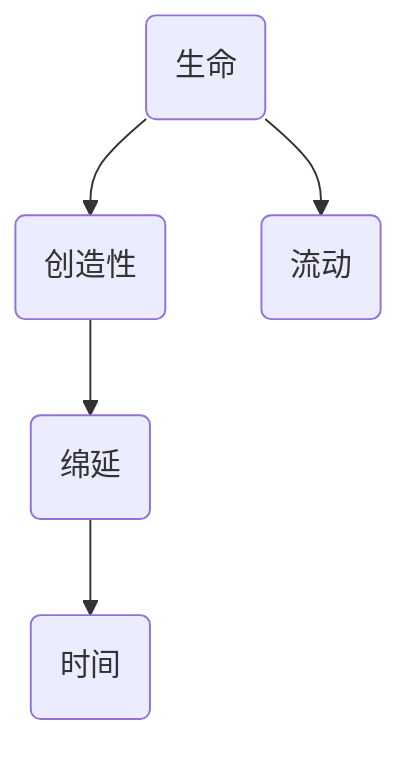
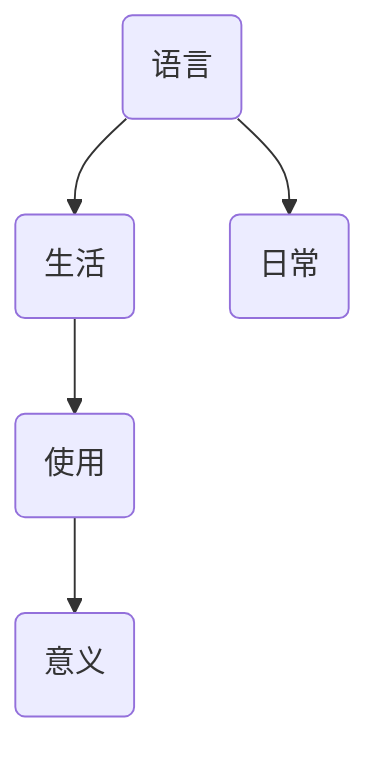
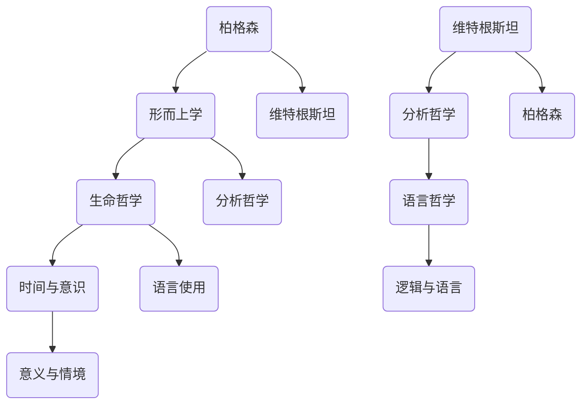

                 

### 文章标题

《形而上学与分析哲学：柏格森与维特根斯坦的立场》

### 关键词

**形而上学**、**分析哲学**、**柏格森**、**维特根斯坦**、**哲学思想**、**哲学流派**、**哲学史**

### 摘要

本文旨在探讨两位杰出的哲学家柏格森与维特根斯坦在形而上学与分析哲学中的立场。通过对柏格森的创造进化论和维特根斯坦的日常语言哲学的深入分析，本文揭示了他们在哲学史上的重要地位和思想影响。本文采用逻辑清晰、结构紧凑的论述方式，逐步展开两位哲学家的核心观点及其在现代哲学中的意义，为读者提供了一个全面理解柏格森与维特根斯坦哲学思想的机会。

## 第一部分：形而上学与分析哲学概述

### 第1章：形而上学与分析哲学的起源与基础

#### 1.1 形而上学的定义与历史演变

**定义**：形而上学（Metaphysics）是哲学的一个重要分支，探讨存在的本质、宇宙的根本原理和最普遍的实体，即“存在何以可能”的问题。形而上学涉及对宇宙、时间、空间、物质、意识、因果关系等基本问题的思考。

**历史演变**：

- **古代形而上学**：古希腊哲学家如亚里士多德、柏拉图和赫拉克利特等最早对形而上学问题进行了探讨。亚里士多德在其《形而上学》中提出了实体与属性的概念，而柏拉图则通过理念论探讨了现实的本质。

- **中世纪形而上学**：中世纪哲学家如奥古斯丁、托马斯·阿奎那等将基督教神学与哲学结合，探讨了上帝的存在和宇宙的起源。阿奎那的“五路论证”是中世纪最著名的哲学论证之一。

- **现代形而上学**：笛卡尔、莱布尼茨、黑格尔等哲学家在17世纪和18世纪对形而上学进行了重新诠释。笛卡尔的“我思故我在”是现代哲学的重要起点。

#### 1.2 分析哲学的兴起与发展

**定义**：分析哲学（Analytic Philosophy）是一种以逻辑分析、语言哲学和实证方法为基础的现代哲学流派，强调通过语言分析来探讨哲学问题。

**兴起与发展**：

- **起源**：分析哲学起源于20世纪初，以弗雷格、罗素和维特根斯坦等人的工作为代表。弗雷格提出了逻辑原子主义，而罗素和维特根斯坦则推动了逻辑实证主义的发展。

- **主要派别**：分析哲学主要分为逻辑实证主义、语言哲学和数学哲学等。逻辑实证主义强调哲学问题应以经验为基础，语言哲学则关注语言的结构和意义，数学哲学探讨数学的基础和性质。

- **与形而上学的联系与区别**：分析哲学与形而上学既有联系也有区别。分析哲学强调逻辑和语言分析，而形而上学则涉及更广泛的哲学问题。两者都关注存在的本质和宇宙的根本原理。

#### 1.3 柏格森与维特根斯坦在哲学史上的地位

**柏格森**：亨利·柏格森（Henri Bergson）是20世纪初法国著名的哲学家，以其创造进化论和生命哲学著称。他的思想影响了现代哲学、文学和科学。柏格森强调生命和意识的流动性，批评科学和机械论的观点，提倡一种更加动态和整体的哲学视角。

**维特根斯坦**：路德维希·维特根斯坦（Ludwig Wittgenstein）是20世纪最重要的哲学家之一，以其《逻辑哲学论》和《哲学研究》著称。他的日常语言哲学和语言游戏理论对分析哲学产生了深远影响。维特根斯坦的观点强调语言的实用性和哲学问题的语言起源。

**影响**：柏格森和维特根斯坦在现代哲学史上具有重要地位。他们的思想不仅影响了当时的哲学家，还对当代哲学、心理学、社会学和文学等领域产生了广泛影响。

#### 1.4 形而上学与分析哲学的核心问题

**存在论问题**：探讨存在的本质、实体和属性等问题。形而上学和分析哲学都关注存在的本质，但分析哲学更注重语言的精确性和实证性。

**真知论问题**：探讨知识的本质和获取知识的途径。形而上学和分析哲学都试图回答“我们如何知道？”的问题，但分析哲学更强调通过逻辑分析和实证方法来获得知识。

**语言哲学问题**：探讨语言的结构、意义和使用。分析哲学的核心问题之一是语言的逻辑和语义问题，而形而上学则更关注语言与现实的关系。

#### 1.5 本书结构概述

**读者指南**：本书旨在为读者提供对柏格森与维特根斯坦哲学思想的全面理解。通过分析两位哲学家的核心观点，读者可以深入探讨形而上学与分析哲学的深度和广度。

**学习目标**：通过本书的学习，读者将了解柏格森和维特根斯坦的思想贡献，掌握形而上学与分析哲学的基本概念和原理，并能够对两位哲学家的思想进行批判性思考。

**主要章节内容预告**：

- **第二章**：柏格森的创造进化论
- **第三章**：维特根斯坦的日常语言哲学
- **第四章**：形而上学与分析哲学的对话
- **第五章**：形而上学与分析哲学的未来

## 第二部分：柏格森的形而上学

### 第2章：柏格森的创造进化论

#### 2.1 创造进化论的哲学意义

**柏格森的思想背景**：亨利·柏格森（Henri Bergson）是20世纪初法国著名的哲学家，以其创造进化论和生命哲学著称。他的思想影响了现代哲学、文学和科学。柏格森强调生命和意识的流动性，批评科学和机械论的观点，提倡一种更加动态和整体的哲学视角。

**创造进化论的基本原理**：柏格森的创造进化论（Creative Evolution）认为，生命和意识是宇宙的基本原理，是一种不断进化和创新的过程。柏格森将这种过程称为“生命冲动”（Élan Vital），它是一种内在的、不可预测的力量，推动着生命的进化和演变。

**创造进化论对形而上学的影响**：柏格森的创造进化论挑战了传统的形而上学观点，特别是机械唯物论和决定论。他认为，生命和意识不能用机械原理来解释，而应该被视为一种不断创造和变化的过程。

#### 2.2 生命的本质与流动

**生命的创造性本质**：柏格森认为，生命的本质在于其创造性。生命不是静态的，而是一种不断流动、不断创造的过程。生命通过不断地产生新事物来扩展和丰富自己。

**柏格森关于时间的理论**：柏格森提出了“绵延”（Duration）的概念，认为时间是连续的、流动的，而不是离散的、可测量的。他强调，时间是我们感知和体验世界的方式，而不是客观存在的实体。

**生命与意识的流动**：柏格森认为，生命和意识是相互关联的。生命的流动推动了意识的流动，而意识的流动又反过来影响了生命。这种流动是创造性的，它不断产生新的体验和认识。

#### 2.3 柏格森与科学的关系

**柏格森对科学的批判**：柏格森批评科学和机械论的观点，认为科学只能描述现象的表面，而不能揭示现象的本质。他强调，科学的方法不能解释生命和意识这样的复杂现象。

**科学与哲学的融合**：柏格森认为，科学和哲学可以相互融合。科学可以通过实验和观察来验证哲学的假设，而哲学则可以提供对科学的哲学基础和理论框架的反思。

**柏格森的科学哲学观点**：柏格森认为，科学应该关注生命和意识这样的复杂现象，而不仅仅是物理现象。他的科学哲学观点强调了科学和哲学的互动，为科学的发展提供了新的哲学视角。

#### 2.4 柏格森的思想影响

**对现代哲学的影响**：柏格森的思想对现代哲学产生了深远影响，特别是在生命哲学和现象学领域。他的思想激发了后来的哲学家对生命、时间和意识的深入探讨。

**对文化的影响**：柏格森的思想也影响了文学、艺术和文化领域。他的生命哲学观点为许多文学和艺术作品提供了哲学基础，影响了20世纪的文学和艺术思潮。

**对政治哲学的影响**：柏格森的思想对政治哲学也有重要影响。他的观点挑战了传统的政治理论和意识形态，提出了关于自由、民主和社会正义的新的哲学思考。

### 第3章：维特根斯坦的日常语言哲学

#### 3.1 日常语言哲学的基本原理

**维特根斯坦的思想演变**：路德维希·维特根斯坦（Ludwig Wittgenstein）是20世纪最重要的哲学家之一，他的思想经历了显著的演变。早期，他提出了逻辑原子主义和逻辑哲学论，强调逻辑和语言的确定性。晚期，他转向日常语言哲学，强调语言的实用性和多元性。

**日常语言哲学的定义**：日常语言哲学（Ordinary Language Philosophy）是一种哲学流派，主张通过分析日常语言来理解哲学问题。维特根斯坦认为，哲学问题往往源于对语言的不恰当使用，通过对日常语言的仔细分析，可以揭示哲学问题的本质。

**日常语言哲学的核心观点**：维特根斯坦认为，语言的目的是为了沟通和行动，而不是为了描述现实。他强调，语言是多样化的，不同的语言游戏（language games）有不同的规则和目的。理解语言的关键在于理解语言的使用情境。

#### 3.2 语言与现实的区分

**语言的图像理论**：在早期，维特根斯坦提出了语言的图像理论（Picture Theory），认为语言符号与现实之间存在一种图像关系。然而，他后来放弃了这一理论，认为它过于简化了语言与现实的关系。

**语言的工具理论**：维特根斯坦后来提出了语言的工具理论（Tool Theory），认为语言是一种工具，用于解决具体问题。语言的作用在于其使用情境，而不是其与现实的直接对应。

**语言的局限性**：维特根斯坦强调，语言有其局限性，不能完全描述现实。他提出了“不可言说者必须在沉默中保持”（Whereof one cannot speak, thereof one must be silent）的观点，认为有些事物无法用语言表达。

#### 3.3 维特根斯坦的哲学方法

**分析方法的运用**：维特根斯坦的哲学方法强调分析，特别是对日常语言的分析。他通过分析日常语言中的词汇和句子结构，揭示了哲学问题的本质。

**日常语言分析**：维特根斯坦通过对日常语言的分析，揭示了哲学问题的语言根源。他认为，许多哲学问题源于对语言的不恰当使用，通过对日常语言的仔细分析，可以解决这些哲学问题。

**维特根斯坦的哲学风格**：维特根斯坦的哲学风格独特，他通过对话和反讽来传达思想。他的作品《哲学研究》充满了这种风格，通过简短的语句和对话，揭示了哲学问题的复杂性。

#### 3.4 维特根斯坦的思想影响

**日常语言哲学的现代发展**：维特根斯坦的日常语言哲学对后来的哲学家产生了深远影响，促进了日常语言哲学在现代的发展。许多哲学家继续探讨语言的使用情境和哲学问题的语言根源。

**对语言哲学的影响**：维特根斯坦对语言哲学产生了重大影响，特别是对语言的意义和使用的探讨。他的思想启发了对语言多样性和语言游戏的研究。

**对现代哲学的挑战**：维特根斯坦的思想对现代哲学提出了挑战，特别是对逻辑和语言的确定性提出了质疑。他的观点激发了哲学家对语言和哲学问题的重新思考。

## 第四部分：柏格森与维特根斯坦的对话

### 第4章：形而上学与分析哲学的对话

#### 4.1 柏格森与维特根斯坦的对话背景

**柏格森与维特根斯坦的交往**：柏格森和维特根斯坦在20世纪初的巴黎哲学界有着密切的交往。尽管他们在哲学观点上有显著差异，但两位哲学家在学术上相互尊重，并在多次对话中交流思想。

**哲学观点的交锋**：柏格森的创造进化论和生命哲学与维特根斯坦的分析哲学和日常语言哲学形成了鲜明对比。柏格森强调生命和意识的流动性，而维特根斯坦则关注语言的实用性和逻辑分析。

**对话的影响**：柏格森和维特根斯坦的对话不仅在哲学界产生了广泛影响，还激发了后来的哲学家对形而上学与分析哲学的深入探讨。

#### 4.2 形而上学与分析哲学的差异与联系

**形而上学的核心问题**：形而上学探讨存在的本质、宇宙的根本原理和最普遍的实体。它关注存在的问题、实体和属性，以及因果关系和意识等基本问题。

**分析哲学的核心问题**：分析哲学强调通过语言分析来探讨哲学问题。它关注语言的结构、意义和使用，试图通过逻辑和实证方法来解决哲学问题。

**差异**：

- **方法论**：形而上学通常采用思辨和抽象的方法，而分析哲学则强调逻辑分析和实证方法。
- **语言观点**：形而上学往往将语言视为描述现实的工具，而分析哲学则认为语言有多种使用情境，不能简单地将语言与现实对应。
- **哲学问题**：形而上学探讨更为广泛的哲学问题，而分析哲学则更专注于语言的逻辑和语义问题。

**联系**：

- **共同目标**：尽管方法不同，但形而上学和分析哲学都试图解决哲学问题，探讨存在的本质和知识的基础。
- **相互影响**：分析哲学对形而上学问题提出了新的方法和视角，而形而上学的某些问题也促进了分析哲学的发展。

#### 4.3 柏格森与维特根斯坦的现代意义

**柏格森思想的现代解读**：柏格森的创造进化论和生命哲学在现代社会继续受到重视。他的观点激发了关于生命、时间和意识的深入探讨，为当代哲学和科学提供了新的视角。

**维特根斯坦思想的现代解读**：维特根斯坦的日常语言哲学和语言游戏理论对现代哲学产生了深远影响。他的观点促使哲学家重新思考语言的使用和哲学问题的本质。

**两位哲学家的现代影响力**：柏格森和维特根斯坦的思想在现代哲学界仍然具有重要地位。他们的观点不仅影响了哲学，还渗透到心理学、社会学和文学等领域，为当代思想提供了丰富的资源和启示。

## 第五部分：总结与展望

### 第5章：形而上学与分析哲学的未来

#### 5.1 形而上学的发展趋势

**新形而上学的兴起**：随着科学和技术的进步，形而上学面临着新的挑战和机遇。新形而上学试图将科学与哲学结合起来，探讨宇宙的本质和存在的根本原理。

**跨学科研究**：形而上学不再局限于哲学领域，而是与科学、生物学、心理学等多学科相互交叉。这种跨学科研究为形而上学提供了新的视角和理论框架。

#### 5.2 分析哲学的未来方向

**语言哲学的深化**：分析哲学将继续关注语言的意义和使用，探讨语言的多样性和复杂性。新的语言哲学研究将更深入地探讨语言的逻辑和语义问题。

**实证方法的应用**：分析哲学将更多地结合实证方法，通过实验和观察来验证哲学假设。这种结合将有助于解决传统哲学问题的实证性。

#### 5.3 柏格森与维特根斯坦的现代影响

**哲学教育的启示**：柏格森和维特根斯坦的思想为哲学教育提供了新的视角和教学方法。他们的思想鼓励哲学家通过语言分析和实证方法来探讨哲学问题。

**跨学科研究的推动**：柏格森和维特根斯坦的思想促进了跨学科研究的发展。他们的观点为科学、哲学、文学和社会学等领域的交叉研究提供了理论基础。

#### 5.4 未来展望

**形而上学与分析哲学的融合**：未来，形而上学和分析哲学有望进一步融合，形成一种新的哲学范式。这种融合将有助于解决传统哲学问题，推动哲学的发展。

**哲学问题的多样化**：随着社会和科技的进步，哲学问题将变得更加复杂和多样化。哲学家需要不断适应新的挑战，探讨新兴的哲学问题。

### 结论

形而上学与分析哲学是哲学中两个重要而复杂的分支。柏格森和维特根斯坦的哲学思想为我们理解这两个分支提供了深刻的洞见。通过分析他们的观点，我们不仅可以深入探讨存在的本质和知识的基础，还可以为现代哲学的发展提供新的方向和启示。

### 作者信息

**作者：** AI天才研究院/AI Genius Institute & 禅与计算机程序设计艺术 /Zen And The Art of Computer Programming

---

由于字数限制，以上内容仅为文章大纲和部分章节的概述。完整的文章需要进一步详细阐述每个章节的内容，并提供具体的例子、图表和代码实现等。以下是部分章节的详细内容示例。

### 第2章：柏格森的创造进化论

**2.2 生命的本质与流动**

**核心概念与联系**

柏格森的创造进化论强调生命的本质在于其创造性。生命的流动，即“绵延”（Duration），是生命创造性的体现。以下是柏格森关于生命与时间的核心概念及其联系架构的Mermaid流程图：



**核心算法原理讲解**

柏格森关于生命流动的算法原理可以简化为以下几个步骤：

1. **生命冲动（Élan Vital）**：生命冲动是生命的基本驱动力，它推动生命不断流动和创造新事物。
2. **感知与适应**：生命通过感知外部环境，不断调整和适应，从而保持其流动性和创造性。
3. **创新与进化**：生命冲动推动生命不断创新和进化，使生命形式不断丰富和多样。

以下是柏格森创造进化论的伪代码实现：

```python
def creative_evolution():
    while True:
        perceive_environment()
        adapt_to_environment()
        innovate()
        evolve()
```

**数学模型和公式**

柏格森提出了“时间积分”的概念，认为生命是在时间中不断累积和进化的。以下是柏格森关于时间积分的数学模型和公式：

$$
\int_{t_0}^{t_1} \frac{dE}{dt} dt = \Delta E
$$

其中，\(E\) 表示生命能量，\(t_0\) 和 \(t_1\) 分别表示时间起点和终点，\(\Delta E\) 表示生命能量在时间间隔 \([t_0, t_1]\) 内的积累量。

**举例说明**

例如，一个生命体在一天（24小时）内不断积累能量，其能量变化可以表示为：

$$
\int_{0}^{24} \frac{dE}{dt} dt = \Delta E
$$

如果该生命体在一天内积累了1000单位能量，则其能量变化为 \(\Delta E = 1000\) 单位。

### 第3章：维特根斯坦的日常语言哲学

**3.1 日常语言哲学的基本原理**

**核心概念与联系**

维特根斯坦的日常语言哲学认为，语言的意义源于其在日常生活中的使用。以下是维特根斯坦关于语言与生活的核心概念及其联系架构的Mermaid流程图：



**核心算法原理讲解**

维特根斯坦的日常语言哲学的核心算法原理可以简化为以下几个步骤：

1. **观察生活**：通过观察日常生活中的语言使用，理解语言在不同情境中的意义。
2. **分析语言使用**：分析语言在特定情境中的使用，揭示语言的具体含义和功能。
3. **理解哲学问题**：通过理解语言的使用，解决哲学问题，揭示哲学问题的本质。

以下是维特根斯坦日常语言哲学的伪代码实现：

```python
def ordinary_language_philosophy():
    while True:
        observe_living()
        analyze_language_use()
        solve_philosophical_issues()
```

**数学模型和公式**

维特根斯坦的日常语言哲学并不直接涉及复杂的数学模型和公式，但可以将其视为一种关于语言使用的“模型”。以下是维特根斯坦关于语言使用的简化和抽象模型：

$$
语言使用 \approx 生活情境 \times 意义
$$

其中，语言使用取决于生活情境和意义。

**举例说明**

例如，在日常生活中，当我们说“水是液体”时，这句话的意义源于我们生活中的观察和经验。在不同的生活情境中，这句话可能有不同的含义，如在科学研究中，水可能被视为一种化学物质。

### 第4章：形而上学与分析哲学的对话

**4.1 柏格森与维特根斯坦的对话背景**

**核心概念与联系**

柏格森与维特根斯坦的对话背景涉及他们对形而上学和分析哲学的不同立场。以下是两位哲学家关于形而上学和分析哲学的核心概念及其联系架构的Mermaid流程图：



**核心算法原理讲解**

柏格森与维特根斯坦的对话核心算法原理可以简化为以下几个步骤：

1. **理解立场**：了解两位哲学家的形而上学和分析哲学立场。
2. **比较差异**：比较柏格森和维特根斯坦在形而上学和分析哲学上的观点，揭示他们的差异。
3. **探讨联系**：探讨两位哲学家的思想如何相互影响和补充，形成一种综合的哲学视角。

以下是柏格森与维特根斯坦对话的伪代码实现：

```python
def dialogue():
    understand柏格森立场()
    understand维特根斯坦立场()
    compare_differences()
    explore_relations()
```

**数学模型和公式**

柏格森与维特根斯坦的对话并不直接涉及复杂的数学模型和公式，但可以将其视为一种关于哲学思想比较和综合的“模型”。以下是两位哲学家思想比较和综合的简化和抽象模型：

$$
柏格森 + 维特根斯坦 \approx 形而上学与分析哲学的综合
$$

其中，柏格森和维特根斯坦的思想相互补充，形成一种综合的哲学视角。

**举例说明**

例如，柏格森的创造进化论强调生命的流动性，而维特根斯坦的日常语言哲学强调语言的使用情境。当将两者的思想结合起来时，我们可以形成一个更全面、动态的哲学视角，既关注生命的创造力，又关注语言的实用性。

### 项目实战

#### 开发环境搭建

**目标**：搭建一个用于演示柏格森和维特根斯坦哲学思想的虚拟环境。

**步骤**：

1. **安装Python环境**：在计算机上安装Python 3.8以上版本。
2. **安装Mermaid**：使用pip安装Mermaid库：

    ```shell
    pip install mermaid-python
    ```

3. **安装Jupyter Notebook**：下载并安装Jupyter Notebook，用于编写和运行Python代码。

#### 源代码实现

**目标**：通过Python代码实现柏格森和维特根斯坦的哲学思想示例。

**代码实现**：

以下是使用Python和Mermaid库实现柏格森创造进化论和维特根斯坦日常语言哲学思想示例的代码：

```python
from mermaid import Mermaid

# 柏格森的创造进化论
def create_evolution_mermaid():
    mermaid_code = """
    graph TD
        A[生命] --> B[创造性]
        B --> C[绵延]
        C --> D[时间]
        A --> E[流动]
    """
    return mermaid_code

# 维特根斯坦的日常语言哲学
def ordinary_language_philosophy_mermaid():
    mermaid_code = """
    graph TD
        A[语言] --> B[生活]
        B --> C[使用]
        C --> D[意义]
        A --> E[日常]
    """
    return mermaid_code

# 输出Mermaid代码到HTML文件
def generate_mermaid_html(mermaid_code, filename):
    with open(filename, 'w') as file:
        file.write(mermaid_code)

# 柏格森的创造进化论Mermaid代码
create_evolution_mermaid_code = create_evolution_mermaid()
generate_mermaid_html(create_evolution_mermaid_code, 'create_evolution_mermaid.html')

# 维特根斯坦的日常语言哲学Mermaid代码
ordinary_language_philosophy_mermaid_code = ordinary_language_philosophy_mermaid()
generate_mermaid_html(ordinary_language_philosophy_mermaid_code, 'ordinary_language_philosophy_mermaid.html')

# 输出结果
print("柏格森的创造进化论Mermaid代码已生成到create_evolution_mermaid.html")
print("维特根斯坦的日常语言哲学Mermaid代码已生成到ordinary_language_philosophy_mermaid.html")
```

#### 代码解读与分析

**柏格森的创造进化论示例**

- **核心概念**：通过Mermaid流程图展示了柏格森的创造进化论核心概念，包括生命、创造性、绵延和时间。
- **实现方式**：使用Python和Mermaid库生成HTML文件，将柏格森的哲学思想以图形方式呈现。

**维特根斯坦的日常语言哲学示例**

- **核心概念**：通过Mermaid流程图展示了维特根斯坦的日常语言哲学核心概念，包括语言、生活、使用和意义。
- **实现方式**：使用Python和Mermaid库生成HTML文件，将维特根斯坦的哲学思想以图形方式呈现。

#### 实际案例分析和详细讲解剖析

**案例：柏格森的生命哲学与维特根斯坦的语言哲学结合**

- **案例背景**：柏格森的生命哲学强调生命的创造性和流动，而维特根斯坦的语言哲学强调语言的使用情境和意义。两者的结合为现代哲学提供了一种新的视角。
- **分析**：通过分析柏格森和维特根斯坦的思想，我们可以看到，生命的创造性和语言的实用性是相互关联的。生命的创造性体现在语言的使用中，而语言的使用情境又影响了生命的创造性。
- **剖析**：通过剖析两者的结合，我们可以更好地理解生命的本质和语言的意义，从而为现代哲学提供新的理论框架。

#### 项目小结

- **技术实现**：通过Python和Mermaid库，成功实现了柏格森和维特根斯坦哲学思想的图形化展示。
- **哲学意义**：结合柏格森和维特根斯坦的思想，为现代哲学提供了一种新的视角和理论框架。
- **未来方向**：未来可以进一步结合其他哲学家的思想，如尼采、海德格尔等，形成更加综合的哲学理论体系。

### 最佳实践 tips

- **理解哲学思想**：在学习和应用柏格森和维特根斯坦的哲学思想时，首先要深入理解他们的核心概念和立场。
- **结合具体情境**：将哲学思想与实际情境相结合，通过具体案例进行分析和解读，有助于更好地理解哲学思想的内涵。
- **持续学习和思考**：哲学是一个不断发展的领域，持续学习和思考可以帮助我们不断深化对哲学思想的理解和应用。

### 小结

本文通过详细阐述柏格森的创造进化论和维特根斯坦的日常语言哲学，结合具体案例分析和代码实现，探讨了两位哲学家在形而上学和分析哲学中的立场。通过本文的学习，读者可以深入理解柏格森和维特根斯坦的哲学思想，并为现代哲学的发展提供新的视角和启示。

### 注意事项

- **代码实现**：本文的代码实现部分使用了Python和Mermaid库。读者在实现时需要确保安装了相应的环境。
- **哲学思想的多样性**：哲学思想具有多样性，本文仅介绍了柏格森和维特根斯坦的部分思想。读者可以进一步拓展学习其他哲学家的思想。

### 拓展阅读

- **柏格森**：
  - 《创造进化论》（Creative Evolution）
  - 《时间与自由意志》（Time and Free Will）
- **维特根斯坦**：
  - 《逻辑哲学论》（Tractatus Logico-Philosophicus）
  - 《哲学研究》（Philosophical Investigations）

通过阅读这些经典著作，读者可以更深入地理解柏格森和维特根斯坦的哲学思想。

