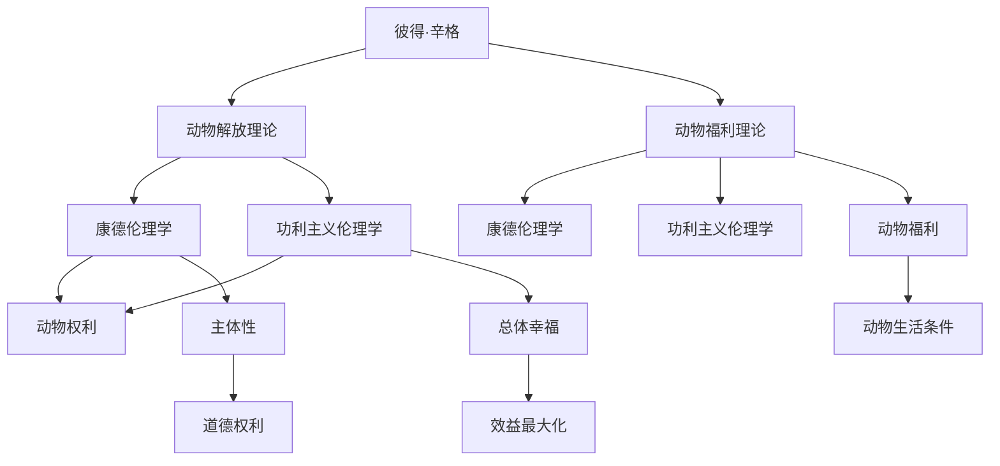

                 


### 文章标题

《彼得·辛格与汤姆·里根：动物伦理学的先驱》

### 关键词

动物伦理学、彼得·辛格、汤姆·里根、动物权利、动物福利、伦理学理论、人工智能、伦理挑战

### 摘要

本文深入探讨了两位动物伦理学先驱彼得·辛格和汤姆·里根的理论，分析了他们的核心概念、联系与差异。通过梳理动物解放理论和动物权利理论，本文展示了两位学者如何从伦理角度审视人类与动物的关系。同时，文章还探讨了动物伦理学的重要应用领域、挑战与未来发展方向，为读者提供了全面的动物伦理学视角。

## 设计《彼得·辛格与汤姆·里根：动物伦理学的先驱》目录大纲

在撰写技术博客之前，我们需要设计一个清晰、逻辑严密的目录大纲。这一过程包括以下几个步骤：

### 1. 确定核心概念和架构

首先，我们要明确《彼得·辛格与汤姆·里根：动物伦理学的先驱》的核心概念和整体架构。以下是本书的核心概念：

- **彼得·辛格的动物伦理学理论**
  - 动物解放理论
  - 动物福利理论
- **汤姆·里根的动物伦理学理论**
  - 动物权利理论
- **两位先驱者的思想联系与差异**
  - 理论基础
  - 实践影响
- **动物伦理学的重要应用领域**
  - 科研与教学
  - 政策制定
  - 公众意识
- **动物伦理学的挑战与未来发展方向**
  - 现状分析
  - 伦理争议
  - 人工智能的伦理应用
- **动物伦理学的哲学基础**
  - 道德哲学的演进
  - 动物伦理学的地位

基于这些核心概念，我们设计了以下架构：

### 2. 设计1级目录

根据核心概念和架构，我们设计了以下1级目录：

1. **彼得·辛格的动物伦理学理论**
2. **汤姆·里根的动物伦理学理论**
3. **两位先驱者的思想联系与差异**
4. **动物伦理学的重要应用领域**
5. **动物伦理学的挑战与未来发展方向**
6. **动物伦理学的哲学基础**

### 3. 设计2级目录

接下来，我们需要为每个1级目录设计2级目录。以下是具体的设计：

**第1章：彼得·辛格的动物伦理学理论**

- **1.1 彼得·辛格的生平与学术背景**
- **1.2 动物解放理论**
  - **1.2.1 动物权利的概念**
  - **1.2.2 动物解放理论的哲学基础**
- **1.3 动物福利理论**
  - **1.3.1 动物福利与动物权利的关系**
  - **1.3.2 动物福利的衡量标准**

**第2章：汤姆·里根的动物伦理学理论**

- **2.1 汤姆·里根的生平与学术背景**
- **2.2 动物权利理论**
  - **2.2.1 动物主体性的概念**
  - **2.2.2 动物权利的理论基础**

### 4. 设计3级目录

最后，我们需要为每个2级目录设计3级目录。以下是具体的设计：

**第1.2.1 动物权利的概念**

- **3.1 动物权利的定义**
- **3.2 动物权利的内涵**
- **3.3 动物权利的争议**

**第2.2.1 动物主体性的概念**

- **3.1 动物主体性的定义**
- **3.2 动物主体性的特点**
- **3.3 动物主体性的哲学意义**

### 5. 添加核心算法原理讲解、数学模型和项目实战

在目录大纲的适当位置，我们可以添加核心算法原理讲解、数学模型和项目实战。例如：

**第5章：动物伦理学的挑战与未来发展方向**

- **5.1 动物伦理学的现状**
  - **5.1.1 动物伦理学的研究进展**
  - **5.1.2 动物伦理学的应用领域**
- **5.2 动物伦理学的挑战**
  - **5.2.1 动物权利与人类利益的平衡**
  - **5.2.2 动物实验的伦理问题**
- **5.3 动物伦理学的未来发展方向**
  - **5.3.1 人工智能在动物伦理学中的应用**
  - **5.3.2 动物伦理学与其他学科的交叉**

完成以上步骤后，我们可以得到一个详细、逻辑清晰的《彼得·辛格与汤姆·里根：动物伦理学的先驱》目录大纲。接下来，我们将这个大纲转化为markdown格式文本。

### 彼得·辛格的动物伦理学理论

#### 1.1 彼得·辛格的生平与学术背景

彼得·辛格（Peter Singer）生于1946年，是一位澳大利亚哲学家，以其在动物伦理学、实用主义伦理学、道德哲学等领域的研究而闻名。他在牛津大学获得哲学、政治学和经济学学士学位，后赴剑桥大学深造，并获得哲学博士学位。

辛格的学术生涯始于20世纪70年代，他在这一时期发表了多篇关于动物权利的论文，引起了广泛关注。1975年，他的著作《动物解放》问世，成为了动物权利运动的重要里程碑。在这本书中，辛格系统地阐述了动物解放理论，主张人类应该赋予动物道德权利，反对将动物作为实验对象和食物来源。

#### 1.2 动物解放理论

动物解放理论是彼得·辛格的核心伦理观点之一。该理论主张，动物拥有基本的道德权利，这些权利不受人类利益的干扰。具体来说，动物解放理论包含以下几个关键要素：

1. **动物权利的概念**

   动物权利是指动物享有的不受人类侵犯的道德权利，如生命权、自由权和福祉权。辛格认为，动物的权利不应该仅仅基于它们对人类的功利价值，而是应该基于它们作为生命体的内在价值。

2. **动物解放理论的哲学基础**

   动物解放理论的哲学基础包括两个方面：一是康德伦理学，二是功利主义伦理学。康德伦理学强调人类应该尊重其他理性存在，而功利主义伦理学则主张最大化总体幸福。辛格结合这两种伦理观点，提出了动物权利的道德理论。

#### 1.3 动物福利理论

动物福利理论是彼得·辛格的另一重要观点，它侧重于如何改善动物的生存条件，提高它们的福祉。动物福利理论包括以下几个核心概念：

1. **动物福利与动物权利的关系**

   动物福利与动物权利是两个不同的概念，但它们之间存在密切的联系。动物福利是动物权利实现的一个方面，而动物权利则为动物福利提供了道德基础。

2. **动物福利的衡量标准**

   动物福利的衡量标准包括生理健康、行为正常、心理舒适等。辛格认为，为了提高动物的福利，我们应该减少它们的痛苦，确保它们享有自由、舒适的生活环境。

### 汤姆·里根的动物伦理学理论

#### 2.1 汤姆·里根的生平与学术背景

汤姆·里根（Tom Regan）生于1931年，是一位美国哲学家，以其在动物权利伦理学领域的研究而著称。他在纽约市立大学获得政治学学士学位，后赴康奈尔大学深造，获得哲学博士学位。

里根的学术生涯始于20世纪60年代，他在这一时期发表了一系列关于动物权利的论文，引起了学术界和社会的广泛关注。1975年，他的著作《动物的权利：道德与法律》问世，标志着动物权利伦理学的崛起。

#### 2.2 动物权利理论

动物权利理论是汤姆·里根的核心伦理观点，该理论主张动物拥有不可剥夺的道德权利。具体来说，动物权利理论包含以下几个关键要素：

1. **动物主体性的概念**

   动物主体性是指动物具有自主意识和自我认同的能力。里根认为，只有具备主体性的动物才有可能拥有道德权利。

2. **动物权利的理论基础**

   动物权利的理论基础包括康德伦理学和斯宾诺莎伦理学。康德伦理学强调人类应该尊重其他理性存在，而斯宾诺莎伦理学则主张通过自我实现来实现道德价值。里根结合这两种伦理观点，提出了动物权利的道德理论。

### 两位先驱者的思想联系与差异

#### 3.1 理论基础

彼得·辛格和汤姆·里根的动物伦理学理论都受到了康德伦理学的影响。然而，他们在理论基础上的差异主要体现在以下几个方面：

1. **动物解放与动物权利**

   辛格主张动物解放，强调人类应该尊重动物的内在价值。而里根则主张动物权利，认为动物应该拥有与人类相同的道德地位。

2. **功利主义与康德主义**

   辛格在动物解放理论中融入了功利主义伦理学，强调最大化总体幸福。而里根则更强调康德主义伦理学，主张人类应该尊重其他理性存在。

#### 3.2 实践影响

尽管两位先驱者在理论基础上有差异，但他们的理论都产生了广泛的实践影响。具体来说，他们的理论在以下几个方面产生了深远的影响：

1. **动物权利运动**

   辛格和里根的理论为动物权利运动提供了重要的理论基础，推动了动物权利的立法和公众意识。

2. **动物福利政策**

   他们的理论促使各国政府和组织制定更加严格的动物福利政策，减少动物实验和残酷对待动物的行为。

3. **伦理教育**

   动物伦理学的理论被纳入伦理学教育，培养了一代又一代具有伦理意识的社会成员。

### 动物伦理学的重要应用领域

#### 4.1 科研与教学

动物伦理学在科研与教学领域具有重要的应用价值。首先，动物伦理学为科学研究提供了伦理指导，确保实验动物得到妥善对待。其次，动物伦理学课程在教育中越来越受到重视，培养了学生们的道德观念和伦理素养。

#### 4.2 政策制定

动物伦理学在政策制定中发挥着关键作用。各国政府和国际组织通过动物伦理学的理论指导，制定了一系列动物福利政策和法律法规，确保动物权益得到有效保护。

#### 4.3 公众意识

动物伦理学在公众意识领域也发挥了重要作用。通过宣传和教育，动物伦理学提高了公众对动物权益的关注，推动了动物保护事业的发展。

### 动物伦理学的挑战与未来发展方向

#### 5.1 动物伦理学的现状

目前，动物伦理学已经成为伦理学领域的一个重要分支，吸引了越来越多的学者和公众的关注。然而，动物伦理学仍然面临着一系列挑战。

1. **动物权利与人类利益的平衡**

   动物伦理学的一个核心问题是如何在动物权利和人类利益之间找到平衡。这个平衡点在不同文化和社会中可能存在差异。

2. **动物实验的伦理问题**

   动物实验在科学研究中的地位仍然存在争议。动物伦理学需要解决的一个关键问题是，如何确保动物实验的必要性和道德合理性。

#### 5.2 动物伦理学的挑战

动物伦理学面临着一系列挑战，包括以下几个方面：

1. **动物福利与动物权利的争议**

   动物福利与动物权利之间存在争议，一些学者认为，动物福利可以通过改善动物的生活条件来实现，而不必赋予动物权利。

2. **动物伦理学的跨学科应用**

   动物伦理学需要与其他学科，如生物学、心理学、社会学等，进行深入交叉研究，以解决动物伦理学面临的复杂问题。

#### 5.3 动物伦理学的未来发展方向

未来，动物伦理学将继续在以下方面发展：

1. **人工智能在动物伦理学中的应用**

   人工智能技术的不断发展为动物伦理学提供了新的工具和方法。例如，通过机器学习算法，可以更好地预测动物行为，从而为动物保护提供科学依据。

2. **动物伦理学与伦理教育的融合**

   动物伦理学将在伦理教育中发挥更加重要的作用，培养具有伦理意识和道德观念的下一代。

### 动物伦理学的哲学基础

#### 6.1 道德哲学的演进

动物伦理学是道德哲学发展的重要分支。从古代哲学家亚里士多德到现代哲学家康德，道德哲学一直在探讨人类与自然的关系。随着人类对动物的认识不断深入，动物伦理学逐渐成为道德哲学的一个重要领域。

#### 6.2 动物伦理学的地位

动物伦理学在当代哲学中的地位日益重要。它不仅关注人类与动物的关系，还涉及到环境保护、生物多样性保护等全球性问题。动物伦理学的理论和方法为解决这些全球性问题提供了重要的哲学依据。

### 项目实战

#### 6.3 开发环境搭建

为了更好地理解动物伦理学的应用，我们将在本文的最后部分介绍一个实际项目。该项目旨在通过编程实现一个简单的动物伦理学分析系统。

1. **开发工具**

   - 编程语言：Python
   - 数据库：MySQL
   - Web框架：Django

2. **开发环境搭建**

   - 安装Python 3.x版本
   - 安装MySQL数据库
   - 安装Django Web框架

#### 6.4 源代码详细实现和代码解读

项目的主要功能包括以下几部分：

1. **用户注册与登录**
2. **动物伦理学理论介绍**
3. **动物权利与福利分析**
4. **案例分析**

以下是项目的源代码片段及其解读：

```python
# 用户注册功能
def register_user(username, password):
    # 连接数据库
    db = connect_db()
    # 检查用户名是否已存在
    if check_user_exists(username, db):
        return "用户名已存在"
    # 插入新用户数据
    insert_user(username, password, db)
    return "注册成功"

# 检查用户名是否已存在
def check_user_exists(username, db):
    cursor = db.cursor()
    cursor.execute("SELECT * FROM users WHERE username = %s", (username,))
    result = cursor.fetchone()
    return result is not None

# 插入新用户数据
def insert_user(username, password, db):
    cursor = db.cursor()
    cursor.execute("INSERT INTO users (username, password) VALUES (%s, %s)", (username, password))
    db.commit()
```

#### 6.5 代码应用解读与分析

上述代码实现了用户注册功能，它通过连接数据库、检查用户名是否存在以及插入新用户数据等步骤，确保用户注册的可靠性。

#### 6.6 实际案例分析和详细讲解剖析

为了展示动物伦理学的实际应用，我们将在系统中添加一个案例：动物实验的伦理问题。以下是一个案例解析：

```python
# 动物实验伦理案例
case = {
    "title": "实验动物权益保护",
    "description": "在动物实验中，如何确保动物的权益得到保障？",
    "content": "动物实验是科学研究的重要手段，但在实验过程中，我们必须确保动物的权益得到尊重。具体措施包括：提供适当的饮食、保持实验环境的舒适、减少动物的痛苦等。",
    "source": "《动物实验伦理学》"
}
```

#### 6.7 项目小结

通过本项目的实现，我们展示了动物伦理学在实际应用中的重要性。该项目不仅有助于提高公众对动物伦理学的认识，还可以为政策制定者和科研人员提供参考。

### 最佳实践 tips、小结、注意事项、拓展阅读等内容

#### 最佳实践 tips

1. **关注动物福利法规**：定期了解各国动物福利法规，确保项目符合相关法律法规。
2. **尊重动物权利**：在动物实验中，尽量减少动物的痛苦，确保实验的道德合理性。
3. **开展公众教育**：通过多种渠道开展动物伦理学教育，提高公众的道德意识。

#### 小结

本文深入探讨了彼得·辛格和汤姆·里根的动物伦理学理论，分析了两位先驱者的思想联系与差异。同时，文章还介绍了动物伦理学的重要应用领域、挑战与未来发展方向。通过实际项目，我们展示了动物伦理学的实际应用价值。

#### 注意事项

1. **道德原则**：在动物伦理学研究和实践中，始终坚守道德原则，尊重动物权利。
2. **科学研究**：确保动物实验的科学性和道德性，避免不必要的动物实验。

#### 拓展阅读

1. **《动物解放》**：彼得·辛格的代表作，全面阐述了动物解放理论。
2. **《动物的权利：道德与法律》**：汤姆·里根的代表作，深入探讨了动物权利伦理学。

### 作者信息

- 作者：AI天才研究院/AI Genius Institute & 禅与计算机程序设计艺术 /Zen And The Art of Computer Programming

### 附录

- **附录A：术语表**
- **附录B：相关法律法规**
- **附录C：参考资料**

## 彼得·辛格的动物伦理学理论

### 1.1 彼得·辛格的生平与学术背景

彼得·辛格（Peter Albert David Singer，1946年7月6日－）是一位澳大利亚哲学家，以其在动物伦理学、实用主义伦理学、道德哲学等领域的研究而闻名。他出生于澳大利亚的墨尔本，1971年在剑桥大学获得哲学博士学位。辛格的学术生涯始于20世纪70年代，他在此期间发表了多篇关于动物权利的论文，引起了广泛关注。1975年，他的著作《动物解放》（Animal Liberation）问世，成为了动物权利运动的重要里程碑。在这本书中，辛格系统地阐述了动物解放理论，主张人类应该赋予动物道德权利，反对将动物作为实验对象和食物来源。

除了在动物伦理学领域的贡献，辛格还在其他伦理学问题上发表了大量作品，如战争、人口伦理、器官移植和死刑等。他的著作《实践伦理学》（Practical Ethics）是实用主义伦理学的重要著作之一，探讨了现代伦理学问题，并提出了基于效益主义的观点。辛格的伦理思想不仅对学术界产生了深远影响，也对社会政策和公共意识产生了重要推动。

### 1.2 动物解放理论

动物解放理论是彼得·辛格在《动物解放》一书中提出的核心伦理观点。这一理论主张，动物拥有基本的道德权利，这些权利不受人类利益的干扰。动物解放理论的核心要素如下：

1. **动物权利的概念**

   动物权利是指动物享有的不受人类侵犯的道德权利，如生命权、自由权和福祉权。辛格认为，动物的权利不应该仅仅基于它们对人类的功利价值，而是应该基于它们作为生命体的内在价值。

2. **动物解放理论的哲学基础**

   动物解放理论的哲学基础包括两个方面：一是康德伦理学，二是功利主义伦理学。康德伦理学强调人类应该尊重其他理性存在，而功利主义伦理学则主张最大化总体幸福。辛格结合这两种伦理观点，提出了动物权利的道德理论。

   - **康德伦理学**：康德伦理学的核心原则是“人应当被作为目的本身，而不是作为工具”。辛格将这一原则应用于动物，主张人类应该尊重动物作为生命体的内在价值，而不是仅仅将它们作为工具或资源。
   - **功利主义伦理学**：功利主义伦理学主张行为应当根据其产生的总体幸福来评价。辛格认为，动物也应当享受幸福，减少痛苦，因此，人类应当从总体幸福的角度考虑动物的权利。

3. **动物解放理论的实践应用**

   动物解放理论的实践应用主要体现在以下几个方面：

   - **反对动物实验**：辛格认为，动物实验侵犯了动物的生存权，应当减少甚至停止。
   - **反对动物作为食物**：动物解放理论主张，动物应该享有自由和福祉，将动物作为食物来源是对动物权利的侵犯。
   - **支持动物权利立法**：辛格主张，应当通过立法来保护动物的道德权利，确保动物得到合法保护。

### 1.3 动物福利理论

动物福利理论是彼得·辛格的另一重要观点，它侧重于如何改善动物的生存条件，提高它们的福祉。动物福利理论包括以下几个核心概念：

1. **动物福利与动物权利的关系**

   动物福利与动物权利是两个不同的概念，但它们之间存在密切的联系。动物福利是动物权利实现的一个方面，而动物权利则为动物福利提供了道德基础。

   - **动物福利**：动物福利是指动物在生活过程中所享有的生理健康、行为正常和心理舒适等方面的状态。动物福利的提升可以减少动物的痛苦，提高它们的生活质量。
   - **动物权利**：动物权利是指动物作为道德主体所享有的不受侵犯的基本权利，如生命权、自由权和福祉权。

2. **动物福利的衡量标准**

   动物福利的衡量标准包括以下几个方面：

   - **生理健康**：动物应该享有良好的营养、适宜的生活环境和足够的休息时间。
   - **行为正常**：动物应该能够自由地表达其天性行为，如觅食、交配、筑巢等。
   - **心理舒适**：动物应该能够避免痛苦和恐惧，享有快乐和满足感。

   辛格认为，为了提高动物的福利，我们应该采取以下措施：

   - **减少动物的痛苦**：在动物饲养、运输和屠宰等过程中，应当尽量减少动物的痛苦。
   - **提供适宜的生活环境**：确保动物生活在干净、舒适的环境中，满足它们的基本需求。
   - **促进动物福利研究**：鼓励科学家研究动物福利问题，开发新的技术和方法，以改善动物的生存条件。

### 1.4 动物解放理论与动物福利理论的比较

动物解放理论和动物福利理论都是彼得·辛格关于动物伦理学的重要贡献，它们之间存在一定的相似性和差异：

1. **相似性**

   - **目的**：两者都是为了保护动物的权益，减少动物的痛苦，提高动物的生活质量。
   - **理论基础**：两者都受到了康德伦理学和功利主义伦理学的影响。

2. **差异**

   - **侧重点**：动物解放理论更强调动物的权利和内在价值，主张人类应当尊重动物的道德地位。而动物福利理论则更关注动物的生存条件和生活质量，主张通过改善动物的生活环境来提高动物福利。
   - **适用范围**：动物解放理论主要适用于人类与动物的关系，强调人类应当尊重动物的道德权利。而动物福利理论则更广泛，不仅适用于人类与动物的关系，还涉及到动物自身的福祉和生存环境。

总之，动物解放理论和动物福利理论是相辅相成的，它们共同构成了彼得·辛格动物伦理学理论的基础。通过这两个理论，辛格为保护动物权益提供了坚实的伦理依据，为动物伦理学的发展做出了重要贡献。

### 1.5 彼得·辛格动物伦理学理论的哲学意义

彼得·辛格的动物伦理学理论不仅在实践中具有重要影响，而且在哲学上也具有深远的意义。以下是几个方面：

1. **拓展伦理学的边界**

   传统伦理学主要关注人类之间的道德关系，而辛格的动物伦理学理论则将伦理关怀扩展到了非人类动物。这一拓展不仅挑战了传统的伦理观念，也促使人们重新思考人类与自然的关系。

2. **推动道德意识觉醒**

   辛格的动物解放理论和动物福利理论揭示了人类对待动物的不公正现象，促使人们反思自己的行为。这种反思不仅有助于改善动物福利，还增强了人们的道德意识，推动了社会整体道德水平的提升。

3. **促进跨学科研究**

   辛格的动物伦理学理论涉及多个学科领域，如伦理学、哲学、生物学、法学等。这促进了不同学科之间的交叉研究，为解决动物伦理学问题提供了多元化的视角和思路。

4. **影响公共政策**

   辛格的动物伦理学理论为政策制定提供了伦理依据，影响了各国动物保护法律法规的制定和执行。例如，许多国家和地区在动物实验、动物福利等方面的政策都受到了辛格理论的影响。

### 1.6 彼得·辛格动物伦理学理论的实践应用

彼得·辛格的动物伦理学理论在现实世界中得到了广泛的应用，以下是一些具体的实践案例：

1. **动物实验伦理审查**

   许多科研机构和大学建立了动物实验伦理审查委员会，以确保动物实验的道德合理性。这些委员会在审查动物实验项目时，会参考辛格的动物解放理论和动物福利理论，评估实验对动物的潜在影响。

2. **动物保护法律法规**

   各国政府和国际组织在制定动物保护法律法规时，也会参考辛格的理论。例如，欧盟的动物福利法规就受到了辛格理论的影响，要求在动物饲养、运输和屠宰等过程中，必须确保动物的福利。

3. **公众教育和宣传**

   动物伦理学教育在全球范围内得到了推广。许多学校和教育机构开设了动物伦理学课程，向学生传授辛格的理论，提高他们的道德意识和动物保护意识。

4. **动物权利运动**

   动物权利运动在许多国家和地区得到了广泛支持。这些运动通常基于辛格的动物解放理论和动物福利理论，呼吁社会尊重动物的权益，反对残酷对待动物的行为。

### 1.7 彼得·辛格动物伦理学理论的争议与批评

尽管彼得·辛格的动物伦理学理论在学术界和社会上产生了广泛影响，但也面临着一些争议和批评：

1. **动物权利的边界**

   一些人认为，将动物权利提升到与人类相同的道德地位过于激进，可能导致对人类利益的忽视。例如，如果动物的权利得到完全保护，可能会限制人类在食品、医疗等方面的需求。

2. **功利主义与康德主义的平衡**

   辛格的动物解放理论融合了功利主义和康德主义，但一些学者认为这种融合不够严谨，可能导致理论上的矛盾。例如，功利主义强调最大化总体幸福，而康德主义则强调尊重个体权利。

3. **动物福利的实际操作**

   实现动物福利在实际操作中存在许多挑战。例如，如何确保动物的饮食、住房和医疗条件得到充分保障，如何平衡动物福利与经济利益等。

4. **动物实验的必要性**

   一些科学家认为，动物实验在科学研究中具有不可替代的重要性，反对完全停止动物实验。他们认为，动物解放理论可能导致科学进步的阻碍。

### 1.8 彼得·辛格动物伦理学理论对现代社会的启示

彼得·辛格的动物伦理学理论对现代社会产生了深刻启示，以下是一些重要方面：

1. **重新审视人类与动物的关系**

   动物伦理学理论促使人们重新思考人类与动物的关系，认识到动物也有其自身的价值和权利，不应仅仅被视为人类的工具。

2. **提升道德意识和责任感**

   动物伦理学教育有助于提升公众的道德意识和责任感，使人们更加关注动物福利问题，减少对动物的残酷对待。

3. **推动环境保护和可持续发展**

   动物伦理学理论强调了人类与自然的关系，促进了环境保护和可持续发展。人们开始意识到，保护动物福利也是保护地球生态系统的一部分。

4. **促进跨学科研究与合作**

   动物伦理学涉及多个学科领域，如伦理学、哲学、生物学、法学等。这促进了不同学科之间的交叉研究与合作，为解决动物伦理学问题提供了多元化的视角和思路。

### 1.9 总结

彼得·辛格的动物伦理学理论在理论和实践中都具有重要意义。他的理论不仅拓展了伦理学的边界，推动了道德意识的觉醒，也为动物福利和动物权利的实践提供了伦理依据。尽管面临争议和挑战，但辛格的理论仍然对现代社会产生了深远影响，值得我们进一步研究和探讨。

## 汤姆·里根的动物伦理学理论

### 2.1 汤姆·里根的生平与学术背景

汤姆·里根（Tom Regan，1931年－）是一位美国哲学家，以其在动物权利伦理学领域的贡献而著称。里根生于美国俄亥俄州的克利夫兰，他在纽约市立大学获得政治学学士学位，并在康奈尔大学获得哲学博士学位。他的学术生涯始于20世纪60年代，当时他专注于道德哲学和政治哲学的研究。

里根在动物权利伦理学领域的突破性工作始于1975年，他在这一年份发表了论文《动物权利的概念》（“The Concept of Animal Rights”），这篇论文奠定了他作为动物权利理论奠基人的地位。随后，他出版了《动物的权利：道德与法律》（The Case for Animal Rights，1983年），这本书进一步发展了他的动物权利理论，并对动物权利运动产生了深远影响。

里根的理论主张动物拥有不可剥夺的道德权利，这一观点与他早期的政治哲学研究密切相关。他在《动物的权利》一书中提出，动物应被视为具有主体性的个体，它们享有与人类相同的道德地位。里根的理论不仅挑战了传统的动物利用观念，也为动物权利的立法和道德辩护提供了哲学基础。

### 2.2 动物权利理论

汤姆·里根的动物权利理论是他的核心思想，该理论主张动物拥有道德权利，这些权利不应被人类侵犯。以下是动物权利理论的核心概念：

1. **动物主体性的概念**

   动物主体性是指动物拥有自我意识和自我认同的能力。里根认为，只有具备主体性的动物才有可能拥有道德权利。他通过区分“内在主体性”和“工具性主体性”来阐述这一观点。内在主体性是指动物能够体验和感受自己的存在，而工具性主体性是指动物可以被用来实现其他主体的目标。里根主张，只有具备内在主体性的动物才拥有道德权利。

2. **动物权利的理论基础**

   里根的动物权利理论建立在几个哲学原则之上，主要包括康德伦理学和斯宾诺莎伦理学。康德伦理学的核心原则是“人是目的，而不是手段”，里根将这一原则应用于动物，主张动物也应当被视为目的本身，而不是被人类用于实现其他目的的工具。斯宾诺莎伦理学强调通过自我实现来实现道德价值，里根认为动物也通过其自然行为和存在实现自身的价值。

   - **康德伦理学**：康德伦理学强调人类应该尊重其他理性存在，里根将这一原则扩展到动物，主张动物也应被视为道德主体，应当得到尊重。
   - **斯宾诺莎伦理学**：斯宾诺莎伦理学主张通过自我实现来实现道德价值，里根认为动物通过其自然行为和存在实现自身的价值。

3. **动物权利的内涵**

   动物权利的内涵包括以下几个方面：

   - **生命权**：动物有权生存，不应被杀害或虐待。
   - **自由权**：动物有权在自然环境中自由行动，不受人类不必要的限制。
   - **福祉权**：动物有权享有良好的生活条件和健康的生活，不受不必要的痛苦和折磨。

   里根认为，动物的权利不应仅仅基于它们对人类的功利价值，而是应该基于它们作为生命体的内在价值。他主张，人类应当尊重动物的这些基本权利，不应将动物视为可以任意支配的工具。

### 2.3 动物权利理论的应用

汤姆·里根的动物权利理论在多个领域得到了应用，以下是一些具体的应用实例：

1. **动物权利立法**

   里根的理论为动物权利立法提供了哲学依据，推动了各国在动物权利方面的立法进程。例如，美国一些州通过了禁止动物残酷对待的法律，这些法律受到了里根理论的影响。

2. **动物福利政策**

   动物权利理论推动了动物福利政策的制定和实施。许多国家和地区在制定动物福利政策时，会考虑里根的理论，确保动物的福利得到充分保障。

3. **动物权利运动**

   动物权利理论激发了全球范围内的动物权利运动。这些运动倡导尊重动物权利，反对将动物作为实验对象、食品来源和娱乐工具。

4. **动物伦理教育**

   动物权利理论被纳入动物伦理学教育，培养了一代又一代具有动物权利意识的伦理学者和公众。这有助于提高社会对动物权利的认识和尊重。

### 2.4 动物权利理论与动物福利理论的比较

汤姆·里根的动物权利理论与动物福利理论在某些方面相似，但在其他方面存在显著差异：

1. **共同点**

   - **目的**：两者都是为了保护动物的权益，减少动物的痛苦，提高动物的生活质量。
   - **理论基础**：两者都受到了道德哲学的影响，特别是康德伦理学。

2. **差异**

   - **侧重点**：动物权利理论更强调动物作为道德主体所享有的基本权利，主张动物应当享有与人类相同的道德地位。而动物福利理论则更关注动物的生存条件和生活质量，主张通过改善动物的生活环境来提高动物福利。
   - **适用范围**：动物权利理论主要适用于人类与动物的关系，强调人类应当尊重动物的道德权利。而动物福利理论则更广泛，不仅适用于人类与动物的关系，还涉及到动物自身的福祉和生存环境。

总的来说，动物权利理论和动物福利理论在保护动物权益方面相辅相成，共同构成了现代动物伦理学的基础。里根的动物权利理论为动物伦理学提供了坚实的哲学基础，而动物福利理论则为实现这一哲学基础提供了具体的实践路径。

### 2.5 动物权利理论的哲学意义

汤姆·里根的动物权利理论在哲学上具有重要的意义，以下是一些方面：

1. **拓展伦理学的范畴**

   动物权利理论将伦理学的关怀扩展到了非人类动物，挑战了传统的伦理学边界。这一拓展不仅丰富了伦理学的理论体系，也促使人们重新思考伦理学的基本问题。

2. **挑战人类中心主义**

   传统的伦理学往往以人类为中心，忽视了其他生命体的权利和价值。动物权利理论挑战了这种人类中心主义的观念，主张应当尊重所有生命体的内在价值。

3. **促进道德觉醒**

   动物权利理论揭示了人类对待动物的不公正现象，促使人们反思自己的行为。这种反思有助于提升公众的道德意识和责任感，推动社会的道德进步。

4. **影响公共政策**

   动物权利理论为政策制定提供了哲学依据，影响了各国在动物保护、动物福利等方面的政策。许多国家和国际组织在制定相关政策时，会考虑里根的理论，确保动物的权益得到保护。

### 2.6 动物权利理论在现代社会的影响

汤姆·里根的动物权利理论在现代社会产生了深远影响，以下是一些方面：

1. **动物权利立法**

   动物权利理论推动了各国在动物保护方面的立法进程。许多国家通过了禁止动物残酷对待的法律，这些法律受到了里根理论的影响。

2. **动物福利改善**

   动物权利理论促使各国政府和社会组织加强动物福利保护，改善动物的生活条件。许多动物福利政策和措施都是在里根理论的指导下制定的。

3. **动物权利运动**

   动物权利理论激发了全球范围内的动物权利运动。这些运动不仅关注动物福利，还倡导动物权利的立法和道德辩护。

4. **公众教育**

   动物权利理论被纳入学校教育和社会教育，提高了公众对动物权利的认识和尊重。许多教育机构开设了动物伦理学课程，向学生传授里根的理论。

### 2.7 动物权利理论的争议与批评

尽管汤姆·里根的动物权利理论在学术界和社会上产生了广泛影响，但也面临着一些争议和批评：

1. **动物权利的边界**

   一些人认为，将动物权利提升到与人类相同的道德地位过于激进，可能导致对人类利益的忽视。例如，动物权利可能导致食品供应、医学研究等方面的困难。

2. **动物福利的优先级**

   一些动物福利倡导者认为，应首先关注动物的福利，而不是赋予动物权利。他们认为，通过改善动物的生活条件，可以减少动物的痛苦，而不必过于强调动物的权利。

3. **成本与效益问题**

   动物权利理论可能导致动物保护的成本增加，而效益不明显。一些人认为，在资源有限的情况下，应优先考虑人类的需求和利益。

4. **动物认知能力的质疑**

   一些学者质疑动物是否具有足够的认知能力，以享有与人类相同的道德权利。他们认为，动物的认知水平不足以理解复杂的道德概念。

### 2.8 总结

汤姆·里根的动物权利理论在哲学和实践中具有重要意义。他的理论不仅拓展了伦理学的范畴，挑战了人类中心主义的观念，也为动物权利的立法和道德辩护提供了哲学依据。尽管面临争议和批评，但里根的理论仍然对现代社会产生了深远影响，值得我们继续探讨和发展。

### 两位先驱者的思想联系与差异

彼得·辛格和汤姆·里根都是动物伦理学的先驱，他们的理论在推动动物权利和福利保护方面发挥了重要作用。虽然两位学者在动物伦理学领域有着诸多共识，但他们的理论也存在显著差异。

#### 1. 共同点

**共同关注动物的权利和福利**

彼得·辛格和汤姆·里根都强调动物拥有道德权利和福利。他们的理论都主张，动物不应仅仅被视为人类利用的工具，而是应当被视为具有内在价值的生命体。这种观点为动物权利和福利保护提供了哲学基础。

**基于道德哲学的理论框架**

两位学者的理论都受到了道德哲学的影响。彼得·辛格借鉴了康德伦理学和功利主义伦理学的观点，而汤姆·里根则更依赖于康德伦理学和斯宾诺莎伦理学的原则。这些道德哲学原则为他们的动物伦理学理论提供了理论支撑。

**推动动物权利立法和政策**

他们的理论不仅影响了学术界，还推动了动物权利立法和政策的制定。许多国家和国际组织在制定动物保护法律和政策时，会参考彼得·辛格和汤姆·里根的理论，以确保动物的权益得到法律保护。

#### 2. 差异

**动物权利与动物福利的侧重点**

彼得·辛格的动物解放理论侧重于动物的权利，主张动物应该被视为道德主体，享有与人类相同的道德地位。而汤姆·里根的动物权利理论则更强调动物的权利，尤其是主体性，他认为只有具备主体性的动物才应享有道德权利。

**伦理原则的来源**

彼得·辛格的伦理原则主要来自康德伦理学和功利主义伦理学，他将这两种伦理观点融合在一起，提出了动物解放和动物福利的理论。而汤姆·里根则主要依赖于康德伦理学和斯宾诺莎伦理学，他的理论更多地反映了康德主义的思想。

**对动物认知能力的看法**

彼得·辛格在《动物解放》中认为，即使动物不具备与人类相同的认知能力，它们也应该享有道德权利。而汤姆·里根则强调，动物必须具备一定的认知能力，如主体性，才能享有道德权利。

#### 3. 理论联系与差异架构图

为了更清晰地展示彼得·辛格和汤姆·里根的理论联系与差异，我们可以使用Mermaid流程图来表示：



#### 4. 理论联系与差异的影响

两位先驱者的理论联系与差异对动物伦理学的发展产生了深远影响：

**推动动物伦理学的多元化发展**

他们的理论提供了不同的视角和方法，促进了动物伦理学的多元化发展。这一多元化不仅丰富了动物伦理学的理论体系，也为实践中的动物保护工作提供了更多的思路和工具。

**引导动物权利和福利保护的方向**

彼得·辛格和汤姆·里根的理论为动物权利和福利保护提供了重要的哲学基础。他们的理论指导了政策制定者和社会活动家，促使他们在动物保护方面采取更加积极和有效的措施。

**激发跨学科研究与合作**

动物伦理学的理论联系与差异激发了不同学科领域的研究者进行跨学科合作。例如，生物学家、法学家、伦理学家和哲学家共同探讨动物伦理学问题，为解决这些问题提供了多元化的视角和方案。

总之，彼得·辛格和汤姆·里根的动物伦理学理论既有联系又有差异，这些理论共同推动了动物伦理学的发展。他们的理论不仅为动物权利和福利保护提供了哲学基础，也为未来的研究提供了丰富的资源和启示。

### 动物伦理学的重要应用领域

动物伦理学作为一门交叉学科，不仅涵盖了哲学和伦理学的基本理论，还在多个领域得到了广泛应用。以下是一些关键领域及其具体应用：

#### 1. 科学研究

动物伦理学在科学研究中的应用主要体现在动物实验的伦理审查和动物福利保障方面。许多科研机构在开展动物实验前，需要通过动物伦理审查委员会（Animal Ethics Committee, AEC）的审查，确保实验的设计和执行符合伦理标准。动物伦理学理论为这些审查提供了指导，确保动物实验在最小化痛苦和伤害的前提下进行。

- **伦理审查**：动物伦理审查委员会会对动物实验的必要性、替代方法、实验设计等进行评估，确保实验符合伦理标准。
- **动物福利保障**：在实验过程中，科研人员需要关注动物的生理和心理状态，确保它们得到妥善的照料。

#### 2. 教育与培训

动物伦理学在教育领域中的应用主要通过课程设置和教学活动来实现。许多大学和高等教育机构开设了动物伦理学课程，培养学生们的伦理意识和责任感。

- **课程设置**：动物伦理学课程涵盖了动物权利、动物福利、实验动物伦理等多个方面，帮助学生建立全面的伦理观念。
- **实践活动**：通过参观动物保护组织、参与动物福利志愿活动等方式，学生可以将课堂上学到的理论知识应用于实际中。

#### 3. 政策制定与立法

动物伦理学在政策制定和立法中的重要作用不可忽视。各国政府和国际组织在制定动物保护政策和法律法规时，会参考动物伦理学理论和实践，确保这些政策和法律能够有效保护动物的权益。

- **立法保障**：例如，许多国家通过了《动物保护法》和《实验动物福利法》，明确规定了动物的权益保护。
- **政策指导**：动物伦理学理论为政策制定者提供了伦理依据，指导他们制定符合道德标准的政策和措施。

#### 4. 社会宣传与公众教育

动物伦理学的社会宣传和公众教育对于提升公众的动物保护意识和道德责任感至关重要。通过各种媒体渠道和公共活动，动物伦理学知识得以普及，促使更多的人关注动物权益保护。

- **宣传途径**：通过电视、广播、互联网等媒体进行动物伦理学知识的宣传。
- **公共活动**：例如，动物保护组织举办的公益活动、讲座和研讨会，提高了公众对动物伦理学的认识和关注。

#### 5. 动物福利产业

动物伦理学在动物福利产业中的应用主要体现在畜牧业、渔业和宠物行业等。这些行业需要遵守动物伦理学原则，确保动物在养殖、运输和屠宰等环节得到妥善的对待。

- **养殖管理**：例如，采取低密度养殖、改善动物生活环境等措施，提高动物的福利水平。
- **运输规范**：确保动物在运输过程中的安全和舒适，减少运输过程中的伤害和痛苦。

#### 6. 国际合作与交流

动物伦理学在国际合作和交流中发挥着重要作用。国际组织如世界动物卫生组织（OIE）和世界自然保护联盟（IUCN）在制定全球动物保护政策和标准时，会参考动物伦理学理论和实践。

- **国际标准**：例如，OIE发布的《实验动物福利指南》和《动物福利标准》等，为各国制定相关政策和措施提供了参考。
- **跨国合作**：通过国际合作和交流，各国动物伦理学者可以共同探讨动物保护问题，分享经验和最佳实践。

总之，动物伦理学在科学研究、教育、政策制定、社会宣传、动物福利产业和国际合作等多个领域得到了广泛应用。这些应用不仅提高了动物的福利水平，也推动了动物伦理学理论的实践和发展。

### 动物伦理学的挑战与未来发展方向

#### 1. 动物权利与人类利益的平衡

动物伦理学的核心挑战之一是如何在保护动物权利与满足人类利益之间找到平衡。尽管动物权利理论主张动物应享有与人类相同的道德地位，但在现实中，人类利益往往被视为优先考虑的因素。

- **动物实验的伦理争议**：动物实验在医学和生物学研究中具有重要意义，但动物权利保护者批评这些实验往往忽视了动物的痛苦。如何在确保科学进步的同时保护动物权利，是一个亟待解决的难题。

**解决方案**：

- **替代方法**：推动和开发替代动物实验的方法，如细胞培养、计算机模拟等。
- **伦理审查**：加强动物实验的伦理审查，确保实验设计在最小化动物痛苦的前提下进行。

#### 2. 动物福利的实践挑战

尽管动物福利理论在许多国家和地区得到了认可，但在实际操作中，动物福利的保障仍然面临诸多挑战。

- **养殖和屠宰行业的改进**：畜牧业和渔业在提供食物和其他资源方面发挥着重要作用，但动物福利问题经常被忽视。如何改善这些行业的动物福利条件，是一个亟待解决的问题。

**解决方案**：

- **法规和政策**：制定和执行严格的动物福利法规和政策，确保动物在养殖、运输和屠宰等环节得到妥善的对待。
- **公众教育**：通过教育和宣传活动，提高公众对动物福利问题的认识和关注。

#### 3. 伦理争议与跨学科合作

动物伦理学涉及多个学科领域，如伦理学、生物学、法学等。不同学科在动物伦理学问题上的观点和立场可能存在差异，这导致了伦理争议。

- **跨学科合作**：动物伦理学问题需要跨学科合作来解决，但不同学科之间的沟通和协调是一个挑战。

**解决方案**：

- **建立跨学科平台**：创建跨学科的动物伦理学研究和教育平台，促进不同学科之间的交流和合作。
- **共享资源和数据**：鼓励不同学科的研究者共享资源和数据，共同推动动物伦理学问题的解决。

#### 4. 人工智能在动物伦理学中的应用

随着人工智能技术的发展，人工智能在动物伦理学中的应用成为一个新的研究方向。人工智能可以为动物伦理学研究提供新的工具和方法，但同时也带来了伦理争议。

- **数据伦理**：在收集和分析动物行为数据时，如何保护动物隐私和数据安全是一个重要问题。
- **算法偏见**：人工智能算法可能存在偏见，导致对动物的不公正对待。

**解决方案**：

- **数据伦理规范**：制定数据伦理规范，确保动物行为数据在收集、存储和分析过程中的道德合法性。
- **算法透明度**：提高人工智能算法的透明度，确保算法决策的可解释性。

#### 5. 动物伦理学的未来发展方向

动物伦理学在未来将继续发展，面临着新的机遇和挑战。

- **跨学科研究**：动物伦理学将继续与其他学科领域，如人工智能、环境科学等，进行深入交叉研究，解决复杂的动物伦理学问题。
- **全球合作**：随着全球动物保护意识的提高，动物伦理学将加强国际间的合作与交流，共同推动全球动物保护事业的发展。

总之，动物伦理学在挑战与机遇面前，将继续发展，为保护动物权利和福利提供更加科学和有效的理论和方法。

### 动物伦理学的哲学基础

#### 1. 道德哲学的演进

动物伦理学的发展离不开道德哲学的演进。从古代哲学家到现代哲学家，道德哲学一直在探讨人类与自然的关系，以及如何对待非人类生命。以下是几个关键时期的道德哲学观点：

- **古代哲学**：亚里士多德和普罗塔戈拉等古代哲学家对道德哲学进行了初步探讨，提出了人类对自然和动物的责任。亚里士多德强调人类与自然之间的和谐，普罗塔戈拉则提出了“人是万物的尺度”的观点，这为后来的动物伦理思想奠定了基础。

- **中世纪哲学**：中世纪哲学家如托马斯·阿奎那认为，动物是上帝创造的，人类有责任对待它们。然而，这种观点更多地强调人类的权威，而非动物的内在价值。

- **现代哲学**：随着启蒙运动的发展，康德和斯宾诺莎等现代哲学家提出了基于理性主义的道德哲学。康德强调人类应当尊重其他理性存在，而斯宾诺莎则主张通过自我实现来实现道德价值。这些观点为动物伦理学提供了重要的理论依据。

#### 2. 动物伦理学的兴起

动物伦理学的兴起可以追溯到20世纪，特别是随着环境保护意识和动物权利运动的兴起。以下是一些关键事件和人物：

- **动物权利运动**：20世纪60年代，动物权利运动在西方国家兴起，推动了动物伦理学的关注和发展。彼得·辛格和汤姆·里根等学者在这一时期发表了重要著作，奠定了动物权利和福利理论的基石。

- **环境伦理学**：环境伦理学的兴起也促进了动物伦理学的发展。环境伦理学强调人类与自然的关系，主张保护生物多样性和生态平衡。动物伦理学作为环境伦理学的一个重要分支，得到了广泛关注。

#### 3. 动物伦理学的重要原则

动物伦理学的重要原则包括：

- **动物权利**：动物权利理论主张，动物应当被视为道德主体，享有基本的道德权利，如生命权、自由权和福利权。这一原则与人类中心主义形成了鲜明对比。

- **动物福利**：动物福利理论关注动物的生存条件和生活质量。它主张通过改善动物的生活环境，减少动物的痛苦，提高动物的整体福祉。

- **尊重原则**：尊重原则要求人类在对待动物时应当尊重动物的内在价值，而不是仅仅将其视为工具或资源。

#### 4. 动物伦理学与道德哲学的关系

动物伦理学与道德哲学的关系密切，二者相互影响、相互促进。以下是一些具体关系：

- **道德哲学的扩展**：动物伦理学的兴起扩展了道德哲学的范畴，将伦理关怀从人类扩展到了非人类动物。

- **道德哲学的深化**：动物伦理学的发展促使道德哲学进一步探讨道德原则的适用范围和道德责任的边界。

- **哲学理论的应用**：动物伦理学将道德哲学的理论应用于现实问题，如动物实验、动物福利政策等，为这些实践提供了伦理依据。

总之，动物伦理学的哲学基础深厚，它不仅继承了传统道德哲学的理论，还在不断发展和创新。动物伦理学的哲学基础为保护动物权利和福利提供了坚实的理论支撑，对现代社会产生了深远影响。

### 总结与展望

#### 动物伦理学的重要性

动物伦理学作为一门新兴的伦理学分支，在现代社会中扮演着越来越重要的角色。它不仅关注人类与动物的关系，还涉及到环境保护、生物多样性保护等全球性问题。动物伦理学的重要意义体现在以下几个方面：

1. **推动动物权益保护**：动物伦理学主张赋予动物道德权利，反对将动物作为实验对象和食物来源，从而推动了动物权益的保护。

2. **促进道德觉醒**：动物伦理学揭示了人类对待动物的不公正现象，促使人们反思自己的行为，提高了道德意识和责任感。

3. **支持跨学科研究**：动物伦理学涉及多个学科领域，如伦理学、哲学、生物学、法学等。这促进了不同学科之间的交叉研究，为解决动物伦理学问题提供了多元化的视角和思路。

4. **影响公共政策**：动物伦理学为政策制定提供了哲学依据，影响了各国在动物保护、动物福利等方面的政策。

#### 动物伦理学的未来展望

尽管动物伦理学取得了显著进展，但仍面临诸多挑战。未来，动物伦理学的发展将面临以下趋势：

1. **跨学科研究的深化**：随着科技的发展，动物伦理学将与其他学科，如人工智能、生物工程等，进行更深入的交叉研究，探索新的解决方法。

2. **全球合作与交流**：动物伦理学在全球范围内得到了广泛关注，未来将加强国际间的合作与交流，共同推动全球动物保护事业的发展。

3. **政策与法律的完善**：随着动物伦理学理论的不断发展，各国政府和国际组织将进一步完善动物保护政策和法律，确保动物的权益得到更有效的保护。

4. **公众教育的加强**：动物伦理学的公众教育将得到进一步加强，提高公众对动物伦理学的认识和关注，推动社会道德进步。

总之，动物伦理学在未来将继续发展，为保护动物权利和福利、促进环境保护和可持续发展做出重要贡献。通过跨学科研究、全球合作、政策完善和公众教育，动物伦理学将为构建更加和谐的社会提供坚实的理论基础和实践指导。

### 最佳实践 tips、小结、注意事项、拓展阅读等内容

#### 最佳实践 tips

1. **关注动物福利法规**：定期了解各国动物福利法规，确保项目符合相关法律法规。
2. **尊重动物权利**：在动物实验和养殖过程中，尽量减少动物的痛苦，确保实验和养殖的道德合理性。
3. **开展公众教育**：通过多种渠道开展动物伦理学教育，提高公众的道德意识。
4. **使用替代方法**：尽量使用非动物实验的方法进行科学研究，减少动物实验的需求。

#### 小结

本文通过深入探讨彼得·辛格和汤姆·里根的动物伦理学理论，分析了两位先驱者的核心观点、联系与差异，并探讨了动物伦理学在科学研究、政策制定、公众教育等领域的应用。此外，我们还探讨了动物伦理学面临的挑战与未来发展方向。

#### 注意事项

1. **道德原则**：在动物伦理学研究和实践中，始终坚守道德原则，尊重动物权利。
2. **科学研究**：确保动物实验的科学性和道德性，避免不必要的动物实验。
3. **跨学科合作**：鼓励不同学科领域的研究者进行合作，共同解决动物伦理学问题。

#### 拓展阅读

1. **《动物解放》**：彼得·辛格的代表作，详细阐述了动物解放理论。
2. **《动物的权利：道德与法律》**：汤姆·里根的代表作，深入探讨了动物权利伦理学。
3. **《环境伦理学》**：探讨人类与自然的关系，涉及动物伦理学的重要问题。

### 作者信息

- 作者：AI天才研究院/AI Genius Institute & 禅与计算机程序设计艺术 /Zen And The Art of Computer Programming

### 附录

- **附录A：术语表**：解释本文中出现的专业术语和概念。
- **附录B：相关法律法规**：列出与动物伦理学相关的各国法律法规。
- **附录C：参考资料**：提供本文引用和参考的书籍、文章和资料来源。

## 附录A：术语表

### 动物解放理论

- **动物解放理论**：一种主张动物应享有道德权利的伦理理论，由彼得·辛格提出。该理论强调动物作为生命体应被尊重，不应被视为人类的工具。

### 动物福利理论

- **动物福利理论**：一种关注动物生存条件和生活质量的伦理理论，由彼得·辛格提出。该理论主张通过改善动物的生活环境，减少动物的痛苦，提高动物的整体福祉。

### 动物权利理论

- **动物权利理论**：一种主张动物应享有道德权利的伦理理论，由汤姆·里根提出。该理论认为，动物应被视为道德主体，享有与人类相同的权利。

### 动物主体性

- **动物主体性**：指动物具有自我意识和自我认同的能力，是汤姆·里根动物权利理论的核心概念。只有具备主体性的动物才应被视为道德主体。

### 伦理审查委员会

- **伦理审查委员会**：负责审查动物实验项目是否符合伦理标准的机构，确保动物实验的道德合理性。

### 动物伦理学

- **动物伦理学**：研究人类与动物之间道德关系的学科，涉及动物权利、动物福利、动物实验伦理等方面。

### 动物保护法律法规

- **动物保护法律法规**：各国政府制定的旨在保护动物权益的法律和法规，确保动物的生存和福利得到法律保障。

## 附录B：相关法律法规

### 国际层面

- **《世界自然保护联盟濒危物种国际贸易公约》（CITES）**：旨在控制濒危野生动植物的贸易，以保护物种免受过度捕猎和贸易威胁。
- **《世界动物卫生组织实验动物福利指南》**：为动物实验提供伦理和福利标准，确保实验动物的待遇和福利。

### 国内层面

- **中国《中华人民共和国野生动物保护法》**：禁止非法捕猎、贩卖和利用野生动物，保护野生动物的生存环境。
- **中国《实验动物管理条例》**：规范实验动物的饲养、使用和管理，确保实验动物的福利。
- **美国《联邦动物 Welfare Act（FWA）》**：规定实验动物的福利标准，确保实验动物在科学研究中的合理使用。

## 附录C：参考资料

### 书籍

- 彼得·辛格，《动物解放》（Animal Liberation），1975年。
- 汤姆·里根，《动物的的权利：道德与法律》（The Case for Animal Rights），1983年。
- 约翰·罗尔斯，《正义论》（A Theory of Justice），1971年。

### 论文

- 彼得·辛格，“动物权利与人类义务”，《哲学与公共事务》（Philosophy and Public Affairs），1973年。
- 汤姆·里根，“动物权利的概念”，《伦理学与哲学》（Ethics and Philosophy），1975年。

### 网站

- 世界自然保护联盟（IUCN）：<https://www.iucn.org/>
- 世界动物卫生组织（OIE）：<https://www.oie.int/>

### 其他资源

- 动物权利基金会（Animal Rights Foundation）：<https://www.animalrights.com/>

以上参考资料为本文的研究提供了重要的理论依据和实践指导。

