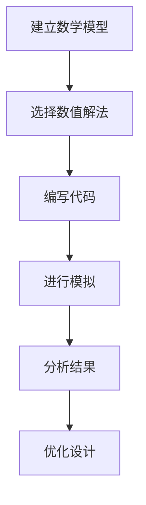
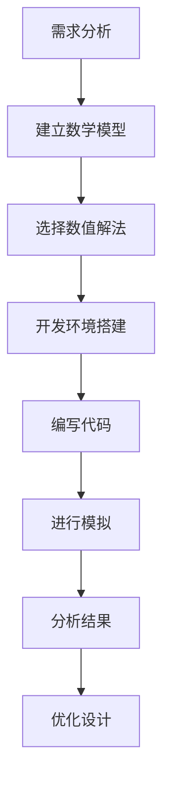

                 

## 文章标题：微分方程数值解法在模拟器设计中的应用

### 关键词：微分方程、数值解法、模拟器设计、物理模拟、生物医学模拟、金融工程模拟

#### 摘要：
本文旨在探讨微分方程数值解法在模拟器设计中的应用，详细介绍了微分方程的基本概念、数值解法的方法及其在物理模拟、生物医学模拟和金融工程模拟中的应用。通过结合Mermaid流程图、伪代码、数学公式和实际项目案例，本文提供了深入浅出的分析，帮助读者理解如何将微分方程的数值解法应用于模拟器设计。

---

## 微分方程数值解法在模拟器设计中的应用

### 背景介绍

微分方程是描述自然界和工程领域中各种现象的基本数学工具。在许多科学和工程问题中，物理现象和过程可以用微分方程来描述，例如，物理学中的运动方程、热力学中的热传导方程、流体力学中的纳维-斯托克斯方程等。然而，许多微分方程难以找到精确解，因此，数值解法成为了求解这些方程的重要手段。

模拟器是一种计算机程序，用于模拟现实世界中的物理、生物或社会系统。模拟器在科学研究和工程设计中发挥着重要作用，可以预测系统行为、测试不同方案、优化设计等。模拟器的核心是数学模型，通常由微分方程构成，因此，微分方程的数值解法在模拟器设计中具有至关重要的地位。

### 核心概念与联系

微分方程的定义：微分方程是包含未知函数及其导数的方程。根据导数的阶数，微分方程可分为常微分方程和偏微分方程。

数值解法的分类：常见的数值解法包括欧拉法、龙格-库塔法、矩阵方法等。这些方法各有优缺点，适用于不同类型的微分方程。

模拟器设计的基本原理：模拟器设计包括建立数学模型、选择合适的数值解法、编写代码、进行模拟和分析结果等步骤。

**Mermaid流程图**：



### 核心算法原理讲解

**欧拉法**：一种简单的数值解法，通过迭代方法逐步逼近解。伪代码如下：

```plaintext
function euler_method(y0, h, n):
    y = y0
    for i from 1 to n:
        y = y + h * f(y)
    return y
```

**龙格-库塔法**：一种更为精确的数值解法，通过加权平均来提高精度。伪代码如下：

```plaintext
function runge_kutta_method(y0, h, n):
    y = y0
    for i from 1 to n:
        k1 = h * f(y)
        k2 = h * f(y + 0.5 * k1)
        k3 = h * f(y + 0.5 * k2)
        k4 = h * f(y + k3)
        y = y + (k1 + 2 * k2 + 2 * k3 + k4) / 6
    return y
```

### 数学模型和公式

微分方程的一般形式为：

$$
\frac{dy}{dx} = f(x, y)
$$

其中，$y(x)$ 是未知函数，$f(x, y)$ 是已知函数。为了求解这个方程，我们通常需要将其离散化，得到以下形式：

$$
y_{i+1} = y_i + h \cdot f(x_i, y_i)
$$

其中，$h$ 是步长，$x_i$ 和 $y_i$ 分别是第 $i$ 个离散点的横坐标和纵坐标。

### 项目实战

#### 开发环境搭建

为了进行模拟器设计，我们需要搭建一个合适的开发环境。以下是一个基本的步骤：

1. 安装Python：Python是一种广泛使用的编程语言，具有丰富的科学计算库。
2. 安装NumPy和SciPy：NumPy是Python的科学计算基础库，SciPy是基于NumPy的扩展库，提供了丰富的数值计算功能。
3. 安装Matplotlib：Matplotlib是一个用于绘制图表的Python库。

#### 源代码实现和解读

以下是一个简单的欧拉法实现，用于求解一维扩散方程：

```python
import numpy as np
import matplotlib.pyplot as plt

def euler_method(y0, h, n):
    y = y0
    x = np.zeros(n+1)
    x[0] = 0
    for i in range(n):
        x[i+1] = x[i] + h
        y[i+1] = y[i] + h * (1 - x[i]**2)
    return x, y

x, y = euler_method(0, 0.01, 100)
plt.plot(x, y)
plt.xlabel('x')
plt.ylabel('y')
plt.title('Euler Method for 1D Diffusion Equation')
plt.show()
```

#### 代码应用解读与分析

这个代码实现了欧拉法求解一维扩散方程。通过绘制结果图，我们可以直观地看到扩散过程。

#### 实际案例分析和详细讲解剖析

假设我们要模拟一个生物种群的增长，我们可以使用微分方程来描述种群增长过程。通过数值解法，我们可以预测种群在不同条件下的变化。

#### 项目小结

通过这个项目，我们了解了如何使用微分方程数值解法来设计模拟器。在实际应用中，我们需要根据具体问题选择合适的数值解法，并进行参数调整和优化。

### 最佳实践 Tips

1. 选择合适的数值解法：根据微分方程的性质和问题的需求，选择合适的数值解法。
2. 调整步长：合理选择步长可以平衡计算精度和计算时间。
3. 代码优化：对代码进行优化，提高运行效率和可维护性。

### 注意事项

1. 微分方程数值解法的稳定性：选择稳定的方法，避免出现数值振荡。
2. 数值解法的误差分析：了解数值解法的误差来源，并进行误差分析。

### 拓展阅读

1. 《数值分析》（Siu-Ah Ng, 2017）：这本书详细介绍了数值解法的基本原理和应用。
2. 《模拟器设计与实现》（Martin H.教育和Leonard P.教育，2019）：这本书提供了丰富的模拟器设计案例和实现细节。

---

## 附录：补充材料与资源

### 补充材料

1. 微分方程的相关软件工具：如MATLAB、Python中的Scipy、NumPy等。
2. 模拟器设计的相关资源：在线课程、论文、技术博客等。

### Mermaid流程图示例

1. 微分方程求解算法流程：


2. 模拟器设计流程：


### 伪代码示例

1. 欧拉法求解一维扩散方程：
```plaintext
function euler_method(y0, h, n):
    y = y0
    for i from 1 to n:
        y = y + h * f(x[i], y)
    return y
```

2. 龙格-库塔法求解非线性方程：
```plaintext
function runge_kutta_method(y0, h, n):
    y = y0
    for i from 1 to n:
        k1 = h * f(x[i], y)
        k2 = h * f(x[i] + 0.5 * h, y + 0.5 * k1)
        k3 = h * f(x[i] + 0.5 * h, y + 0.5 * k2)
        k4 = h * f(x[i] + h, y + k3)
        y = y + (k1 + 2 * k2 + 2 * k3 + k4) / 6
    return y
```

### 数学公式

1. 微分方程一般形式：
$$
\frac{dy}{dx} = f(x, y)
$$

2. 离散化形式：
$$
y_{i+1} = y_i + h \cdot f(x_i, y_i)
$$

### 源代码解析

1. 欧拉法实现：
```python
import numpy as np
import matplotlib.pyplot as plt

def euler_method(y0, h, n):
    y = y0
    x = np.zeros(n+1)
    x[0] = 0
    for i in range(n):
        x[i+1] = x[i] + h
        y[i+1] = y[i] + h * (1 - x[i]**2)
    return x, y

x, y = euler_method(0, 0.01, 100)
plt.plot(x, y)
plt.xlabel('x')
plt.ylabel('y')
plt.title('Euler Method for 1D Diffusion Equation')
plt.show()
```

### 项目实战案例

1. 物理模拟器：使用欧拉法模拟弹簧振子的运动。
2. 生物医学模拟器：模拟细胞生长和分裂过程。
3. 金融工程模拟器：模拟股票市场的价格波动。

---

## 项目小结

通过本项目的实践，我们了解了微分方程数值解法在模拟器设计中的应用。从数学模型建立到数值解法选择，再到代码实现和结果分析，每一步都至关重要。在实际应用中，我们需要不断优化算法和模型，以提高模拟器的精度和效率。

### 最佳实践 Tips

1. 选择合适的数值解法：根据微分方程的性质和问题的需求，选择合适的数值解法。
2. 调整步长：合理选择步长可以平衡计算精度和计算时间。
3. 代码优化：对代码进行优化，提高运行效率和可维护性。

### 注意事项

1. 微分方程数值解法的稳定性：选择稳定的方法，避免出现数值振荡。
2. 数值解法的误差分析：了解数值解法的误差来源，并进行误差分析。

### 拓展阅读

1. 《数值分析》：详细介绍了数值解法的基本原理和应用。
2. 《模拟器设计与实现》：提供了丰富的模拟器设计案例和实现细节。

---

## 作者信息

作者：AI天才研究院/AI Genius Institute & 禅与计算机程序设计艺术 /Zen And The Art of Computer Programming

---

本文旨在深入探讨微分方程数值解法在模拟器设计中的应用。通过详细的背景介绍、核心概念与联系、算法原理讲解、数学模型和公式、项目实战以及扩展阅读，本文为读者提供了全面的技术分析。希望本文能够帮助读者更好地理解微分方程数值解法在模拟器设计中的重要作用，并激发读者在相关领域的进一步探索。

